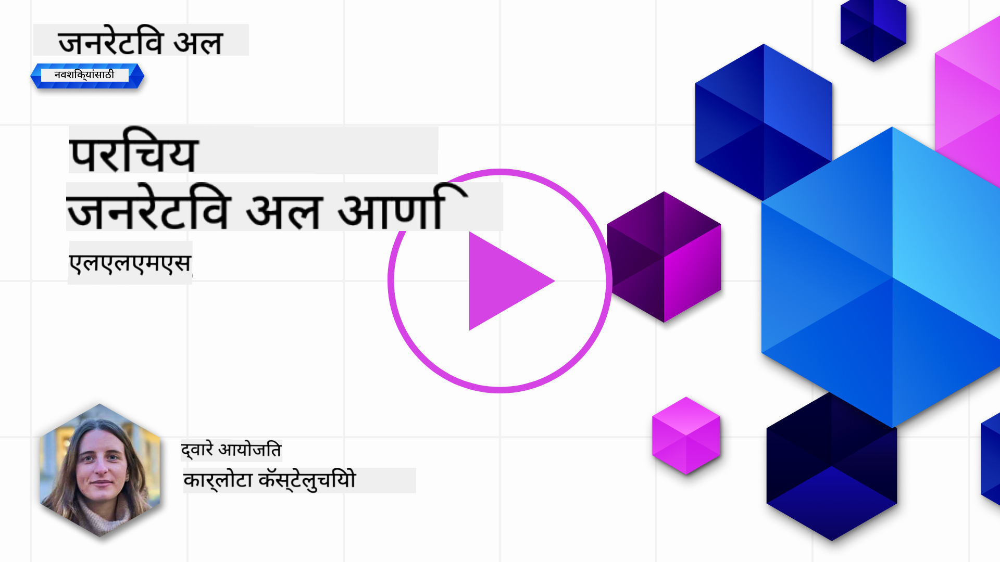
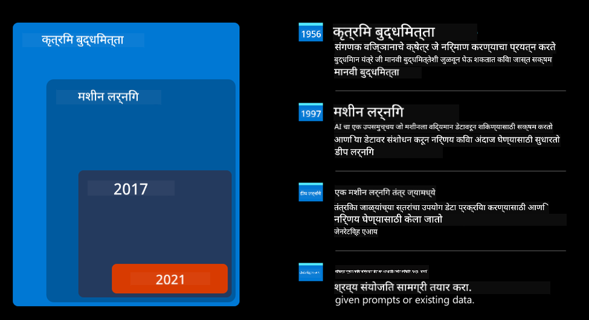
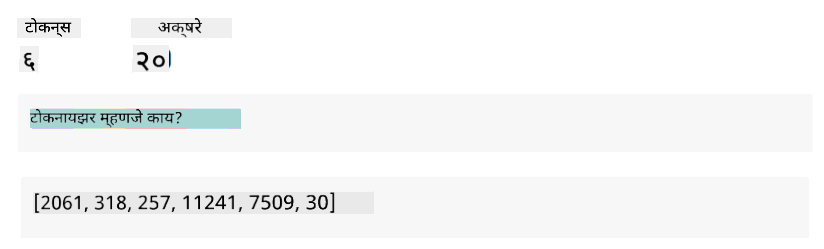
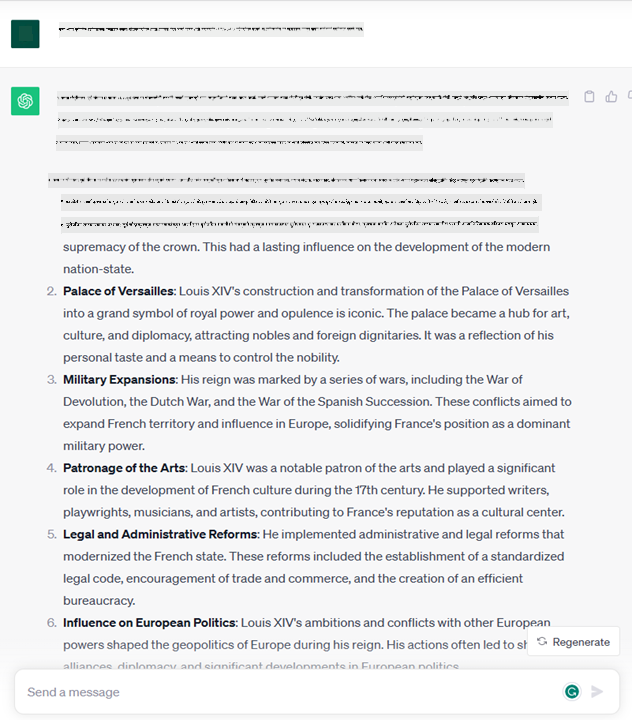
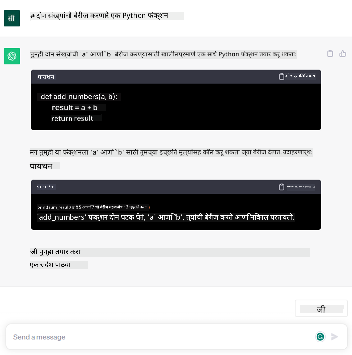

<!--
CO_OP_TRANSLATOR_METADATA:
{
  "original_hash": "bfb7901bdbece1ba3e9f35c400ca33e8",
  "translation_date": "2025-10-17T13:38:19+00:00",
  "source_file": "01-introduction-to-genai/README.md",
  "language_code": "mr"
}
-->
# जनरेटिव्ह AI आणि मोठ्या भाषा मॉडेल्सची ओळख

_(वरील प्रतिमेवर क्लिक करून या धड्याचा व्हिडिओ पाहा)_

जनरेटिव्ह AI ही कृत्रिम बुद्धिमत्ता आहे जी मजकूर, प्रतिमा आणि इतर प्रकारची सामग्री तयार करण्यास सक्षम आहे. ही एक अद्भुत तंत्रज्ञान आहे कारण ती AI ला लोकांसाठी सहज उपलब्ध करते. फक्त एक साधा मजकूर प्रॉम्प्ट, म्हणजेच नैसर्गिक भाषेत लिहिलेली एक वाक्य, वापरून कोणीही याचा उपयोग करू शकतो. तुम्हाला जावा किंवा SQL सारखी भाषा शिकण्याची गरज नाही, फक्त तुमची भाषा वापरा, तुम्हाला काय हवे आहे ते सांगा, आणि AI मॉडेलकडून एक सूचना मिळेल. याचे उपयोग आणि परिणाम खूप मोठे आहेत – अहवाल लिहिणे किंवा समजून घेणे, अर्ज लिहिणे आणि बरेच काही, तेही काही सेकंदांत.

या अभ्यासक्रमात, आम्ही पाहणार आहोत की आमचा स्टार्टअप शिक्षण क्षेत्रात जनरेटिव्ह AI चा कसा उपयोग करतो आणि त्याच्या सामाजिक परिणामांशी संबंधित आव्हानांना आणि तंत्रज्ञानाच्या मर्यादांना कसे सामोरे जातो.

## परिचय

या धड्यात आपण शिकणार आहोत:

- व्यवसायाच्या संकल्पनेची ओळख: आमच्या स्टार्टअपची कल्पना आणि उद्दिष्ट.
- जनरेटिव्ह AI आणि सध्याच्या तंत्रज्ञानाच्या प्रवासाची ओळख.
- मोठ्या भाषा मॉडेल्सचे अंतर्गत कार्य.
- मोठ्या भाषा मॉडेल्सच्या मुख्य क्षमता आणि व्यावहारिक उपयोग.

## शिकण्याची उद्दिष्टे

हा धडा पूर्ण केल्यानंतर, तुम्हाला समजेल:

- जनरेटिव्ह AI म्हणजे काय आणि मोठ्या भाषा मॉडेल्स कसे कार्य करतात.
- शिक्षणाच्या संदर्भात लक्ष केंद्रित करून, विविध उपयोगांसाठी मोठ्या भाषा मॉडेल्सचा कसा उपयोग करता येतो.

## संकल्पना: आमचा शैक्षणिक स्टार्टअप

जनरेटिव्ह कृत्रिम बुद्धिमत्ता (AI) ही AI तंत्रज्ञानाची सर्वोच्च पातळी आहे, जी अशक्य वाटणाऱ्या गोष्टींच्या मर्यादा ओलांडते. जनरेटिव्ह AI मॉडेल्समध्ये अनेक क्षमता आणि उपयोग आहेत, परंतु या अभ्यासक्रमासाठी आम्ही एका काल्पनिक स्टार्टअपद्वारे शिक्षणात कसे क्रांती घडवून आणत आहे हे पाहणार आहोत. आम्ही या स्टार्टअपला _आमचा स्टार्टअप_ म्हणू. आमचा स्टार्टअप शिक्षण क्षेत्रात कार्य करतो आणि त्याचे महत्त्वाकांक्षी उद्दिष्ट आहे:

> _जगभरातील शिक्षणात प्रवेश सुधारणे, शिक्षणात समानता सुनिश्चित करणे आणि प्रत्येक शिकणाऱ्याला त्यांच्या गरजेनुसार वैयक्तिकृत शिक्षण अनुभव प्रदान करणे._

आमच्या स्टार्टअप टीमला माहित आहे की, आधुनिक काळातील सर्वात शक्तिशाली साधनांपैकी एक – मोठ्या भाषा मॉडेल्स (LLMs) – चा उपयोग केल्याशिवाय आम्ही हे उद्दिष्ट साध्य करू शकणार नाही.

जनरेटिव्ह AI शिकण्याच्या आणि शिकवण्याच्या पद्धतीत क्रांती घडवून आणण्याची अपेक्षा आहे. विद्यार्थ्यांना २४ तास उपलब्ध असलेले आभासी शिक्षक मिळतील, जे प्रचंड प्रमाणात माहिती आणि उदाहरणे देतील, आणि शिक्षकांना त्यांच्या विद्यार्थ्यांचे मूल्यमापन करण्यासाठी आणि अभिप्राय देण्यासाठी नाविन्यपूर्ण साधने मिळतील.

सुरुवातीला, आपण या अभ्यासक्रमात वापरणाऱ्या काही मूलभूत संकल्पना आणि शब्दावलींची व्याख्या करूया.

## जनरेटिव्ह AI कसे आले?

जनरेटिव्ह AI मॉडेल्सच्या अलीकडील घोषणांमुळे निर्माण झालेल्या असामान्य _हायप_ असूनही, हे तंत्रज्ञान दशकांपासून विकसित होत आहे, ज्याची पहिली संशोधन प्रयत्न ६० च्या दशकात झाली होती. आज आपण अशा AI च्या टप्प्यावर पोहोचलो आहोत ज्यामध्ये मानवी संज्ञानात्मक क्षमता आहेत, जसे की संभाषण, जसे [OpenAI ChatGPT](https://openai.com/chatgpt) किंवा [Bing Chat](https://www.microsoft.com/edge/features/bing-chat?WT.mc_id=academic-105485-koreyst) मध्ये दिसते, जे वेब शोध Bing संभाषणांसाठी GPT मॉडेल वापरते.

थोडे मागे जाऊन पाहिले तर, AI चे पहिले प्रोटोटाइप टाइपरायट केलेल्या चॅटबॉट्सचे होते, जे तज्ञांच्या गटाकडून काढलेल्या ज्ञानाच्या आधारावर काम करत होते. इनपुट मजकूरात दिसणाऱ्या कीवर्ड्सद्वारे ज्ञानाच्या आधारावर उत्तर दिले जात असे. तथापि, लवकरच हे स्पष्ट झाले की टाइपरायट चॅटबॉट्स वापरण्याचा दृष्टिकोन चांगल्या प्रकारे स्केल होत नाही.

### AI साठी सांख्यिकीय दृष्टिकोन: मशीन लर्निंग

९० च्या दशकात, मजकूर विश्लेषणासाठी सांख्यिकीय दृष्टिकोन लागू केल्यामुळे एक महत्त्वाचा टप्पा आला. यामुळे नवीन अल्गोरिदम्स – मशीन लर्निंग म्हणून ओळखले जाणारे – विकसित झाले, जे स्पष्टपणे प्रोग्राम न करता डेटामधून पॅटर्न शिकण्यास सक्षम होते. या दृष्टिकोनामुळे मशीनला मानवी भाषा समजण्याची क्षमता मिळाली: मजकूर-लेबल जोड्यांवर सांख्यिकीय मॉडेल प्रशिक्षित केले गेले, ज्यामुळे मॉडेलला अज्ञात इनपुट मजकूर पूर्वनिर्धारित लेबलसह वर्गीकृत करता आले.

### न्यूरल नेटवर्क्स आणि आधुनिक आभासी सहाय्यक

अलीकडच्या वर्षांत, हार्डवेअरच्या तांत्रिक उत्क्रांतीमुळे, जे मोठ्या प्रमाणात डेटा आणि अधिक जटिल गणना हाताळण्यास सक्षम आहे, AI मध्ये संशोधनाला प्रोत्साहन मिळाले. यामुळे न्यूरल नेटवर्क्स किंवा डीप लर्निंग अल्गोरिदम्स म्हणून ओळखल्या जाणाऱ्या प्रगत मशीन लर्निंग अल्गोरिदम्सचा विकास झाला.

न्यूरल नेटवर्क्स (विशेषतः Recurrent Neural Networks – RNNs) ने नैसर्गिक भाषा प्रक्रिया लक्षणीयरीत्या सुधारली, ज्यामुळे वाक्यातील शब्दाच्या संदर्भाला महत्त्व देऊन मजकूराचा अर्थ अधिक अर्थपूर्ण पद्धतीने सादर करता आला.

### आजचा काळ, जनरेटिव्ह AI

आता आपण जनरेटिव्ह AI च्या युगात आलो आहोत, जे डीप लर्निंगचा एक उपसमुच्चय मानले जाऊ शकते.

AI क्षेत्रातील दशकांतील संशोधनानंतर, _Transformer_ नावाच्या नवीन मॉडेल आर्किटेक्चरने RNNs च्या मर्यादा ओलांडल्या, ज्यामुळे मजकूराच्या खूप लांब अनुक्रमांना इनपुट म्हणून स्वीकारणे शक्य झाले. Transformers हे अटेंशन मेकॅनिझमवर आधारित आहेत, ज्यामुळे मॉडेलला त्याला मिळालेल्या इनपुट्सना वेगवेगळे वजन देणे शक्य होते, जिथे सर्वात संबंधित माहिती केंद्रित आहे तिथे ‘जास्त लक्ष’ देणे शक्य होते, मजकूर अनुक्रमातील त्यांच्या क्रमाकडे दुर्लक्ष करून.

अलीकडील बहुतेक जनरेटिव्ह AI मॉडेल्स – जे मोठ्या भाषा मॉडेल्स (LLMs) म्हणून ओळखले जातात, कारण ते मजकूर इनपुट्स आणि आउटपुट्ससह कार्य करतात – हे खरोखरच या आर्किटेक्चरवर आधारित आहेत. या मॉडेल्सचे वैशिष्ट्य म्हणजे – विविध स्रोतांमधून, जसे की पुस्तके, लेख आणि वेबसाइट्स, मोठ्या प्रमाणात लेबल नसलेल्या डेटावर प्रशिक्षित केलेले – ते विविध प्रकारच्या कार्यांसाठी अनुकूलित केले जाऊ शकतात आणि सर्जनशीलतेचा आभास देणारा व्याकरणदृष्ट्या योग्य मजकूर तयार करू शकतात. त्यामुळे, त्यांनी मशीनची इनपुट मजकूर ‘समजण्याची’ क्षमता केवळ प्रचंड प्रमाणात सुधारली नाही, तर त्यांनी मानवी भाषेत मूळ प्रतिसाद तयार करण्याची क्षमता सक्षम केली.

## मोठ्या भाषा मॉडेल्स कसे कार्य करतात?

पुढील अध्यायात आपण विविध प्रकारच्या जनरेटिव्ह AI मॉडेल्सचा अभ्यास करणार आहोत, पण सध्या आपण मोठ्या भाषा मॉडेल्स कसे कार्य करतात यावर एक नजर टाकूया, विशेषतः OpenAI GPT (Generative Pre-trained Transformer) मॉडेल्सवर लक्ष केंद्रित करून.

- **Tokenizer, मजकूर ते संख्या**: मोठ्या भाषा मॉडेल्सना इनपुट म्हणून मजकूर मिळतो आणि आउटपुट म्हणून मजकूर तयार होतो. तथापि, सांख्यिकीय मॉडेल्स असल्याने, ते मजकूर अनुक्रमांपेक्षा संख्यांवर चांगले कार्य करतात. म्हणूनच, मॉडेलच्या मुख्य भागात वापरण्यापूर्वी प्रत्येक इनपुटला एक टोकनायझरद्वारे प्रक्रिया केली जाते. टोकन म्हणजे मजकूराचा एक तुकडा – ज्यामध्ये बदलत्या संख्येचे अक्षरे असतात, त्यामुळे टोकनायझरचे मुख्य कार्य म्हणजे इनपुटला टोकन्सच्या अ‍ॅरेमध्ये विभाजित करणे. त्यानंतर, प्रत्येक टोकनला टोकन इंडेक्ससह मॅप केले जाते, जो मूळ मजकूर तुकड्याचा पूर्णांक एन्कोडिंग असतो.

- **आउटपुट टोकन्सची भविष्यवाणी करणे**: n टोकन्स इनपुट म्हणून दिल्यास (प्रत्येक मॉडेलनुसार n ची कमाल मर्यादा बदलते), मॉडेल एक टोकन आउटपुट म्हणून भाकीत करू शकते. हे टोकन नंतर पुढील पुनरावृत्तीच्या इनपुटमध्ये समाविष्ट केले जाते, विस्तारित विंडो पॅटर्नमध्ये, ज्यामुळे एक किंवा अधिक वाक्ये उत्तर म्हणून मिळण्याचा चांगला वापरकर्ता अनुभव सक्षम होतो. यामुळे, जर तुम्ही कधी ChatGPT वापरले असेल, तर तुम्हाला कधी कधी असे वाटले असेल की ते वाक्याच्या मध्यभागी थांबते.

- **निवड प्रक्रिया, संभाव्यता वितरण**: आउटपुट टोकन मॉडेलद्वारे निवडले जाते त्याच्या सध्याच्या मजकूर अनुक्रमानंतर येण्याच्या संभाव्यतेनुसार. कारण मॉडेल त्याच्या प्रशिक्षणाच्या आधारे सर्व संभाव्य ‘पुढील टोकन्स’ वर संभाव्यता वितरणाचा अंदाज लावतो. तथापि, परिणामी वितरणातून नेहमीच सर्वाधिक संभाव्यतेचे टोकन निवडले जात नाही. या निवडीत थोडीशी यादृच्छिकता जोडली जाते, ज्यामुळे मॉडेल अनिश्चित पद्धतीने कार्य करते – आपल्याला समान इनपुटसाठी नेहमीच समान आउटपुट मिळत नाही. ही यादृच्छिकता सर्जनशील विचार प्रक्रियेचे अनुकरण करण्यासाठी जोडली जाते आणि ती तापमान नावाच्या मॉडेल पॅरामीटरचा वापर करून ट्यून केली जाऊ शकते.

## आमचा स्टार्टअप मोठ्या भाषा मॉडेल्सचा कसा उपयोग करू शकतो?

आता आपल्याला मोठ्या भाषा मॉडेल्सच्या अंतर्गत कार्यप्रणालीची चांगली समज झाली आहे, चला पाहूया की ते कोणत्या व्यावहारिक कार्यांसाठी चांगले कार्य करू शकतात, विशेषतः आमच्या व्यवसायाच्या संदर्भात.
आपण म्हटले की मोठ्या भाषा मॉडेल्सची मुख्य क्षमता म्हणजे _नैसर्गिक भाषेत लिहिलेल्या मजकूर इनपुटपासून सुरुवात करून, सुरुवातीपासून मजकूर तयार करणे_.

पण कोणत्या प्रकारचा मजकूर इनपुट आणि आउटपुट?
मोठ्या भाषा मॉडेल्सचा इनपुट _प्रॉम्प्ट_ म्हणून ओळखला जातो, तर आउटपुट _कम्प्लिशन_ म्हणून ओळखला जातो, जो मॉडेलच्या पुढील टोकन तयार करण्याच्या यंत्रणेला संदर्भित करतो. आपण प्रॉम्प्ट म्हणजे काय आणि मॉडेलमधून जास्तीत जास्त फायदा कसा मिळवायचा यावर सखोल चर्चा करणार आहोत. पण सध्या, फक्त एवढेच म्हणूया की प्रॉम्प्टमध्ये समाविष्ट असू शकते:

- मॉडेलकडून अपेक्षित आउटपुटचा प्रकार निर्दिष्ट करणारे **सूचना**. कधी कधी या सूचनांमध्ये काही उदाहरणे किंवा अतिरिक्त डेटा समाविष्ट असतो.

  1. लेख, पुस्तक, उत्पादन पुनरावलोकने इत्यादींचे सारांश, तसेच असंरचित डेटामधून अंतर्दृष्टी काढणे.
    
    
  
  2. लेख, निबंध, असाइनमेंट किंवा इतर गोष्टींची सर्जनशील कल्पना आणि डिझाइन.
      
     

- **प्रश्न**, जो एजंटसोबत संभाषणाच्या स्वरूपात विचारला जातो.
  
  

- **मजकूराचा तुकडा पूर्ण करणे**, जो अप्रत्यक्षपणे लेखन सहाय्याची मागणी आहे.
  
  

- **कोडचा तुकडा** आणि त्याचे स्पष्टीकरण व दस्तऐवजीकरण करण्याची मागणी, किंवा विशिष्ट कार्य करणारा कोड तयार करण्यासाठी टिप्पणी.

  

वरील उदाहरणे सोपी आहेत आणि मोठ्या भाषा मॉडेल्सच्या क्षमतांची संपूर्ण प्रदर्शनी करण्याचा हेतू नाही. त्यांचा उद्देश जनरेटिव्ह AI चा उपयोग, विशेषतः पण केवळ शैक्षणिक संदर्भापुरता मर्यादित नाही, हे दाखवणे आहे.

तसेच, जनरेटिव्ह AI मॉडेलचे आउटपुट परिपूर्ण नसते आणि कधी कधी मॉडेलची सर्जनशीलता त्याच्या विरोधात कार्य करू शकते, परिणामी असे आउटपुट मिळते जे मानवी वापरकर्त्याला वास्तवाचे विकृतीकरण वाटू शकते, किंवा ते आक्षेपार्ह असू शकते. जनरेटिव्ह AI बुद्धिमान नाही – किमान बुद्धिमत्तेच्या अधिक व्यापक व्याख्येत, ज्यामध्ये गंभीर आणि सर्जनशील विचार किंवा भावनिक बुद्धिमत्ता समाविष्ट आहे; ते निश्चित नाही आणि ते विश्वासार्ह नाही, कारण चुकीचे संदर्भ, सामग्री आणि विधाने योग्य माहितीसह एकत्र केली जाऊ शकतात आणि विश्वासार्ह आणि आत्मविश्वासपूर्ण पद्धतीने सादर केली जाऊ शकतात. पुढील धड्यांमध्ये, आपण या सर्व मर्यादांशी व्यवहार करणार आहोत आणि त्यांना कमी करण्यासाठी आपण काय करू शकतो ते पाहणार आहोत.

## असाइनमेंट

तुमचे काम म्हणजे [जनरेटिव्ह AI](https://en.wikipedia.org/wiki/Generative_artificial_intelligence?WT.mc_id=academic-105485-koreyst) बद्दल अधिक वाचणे आणि आज जिथे जनरेटिव्ह AI नाही तिथे तुम्ही ते कसे जोडाल हे ओळखणे. जुन्या पद्धतीने करण्यापेक्षा परिणाम वेगळा कसा असेल, तुम्ही काही नवीन करू शकता का, किंवा तुम्ही जलद आहात का? तुमचे स्वप्नातील AI स्टार्टअप कसे दिसेल यावर ३०० शब्दांचा सारांश लिहा आणि "समस्या", "मी AI कसा वापरेन", "परिणाम" आणि पर्यायी व्यवसाय योजना यासारख्या शीर्षके समाविष्ट करा.

जर तुम्ही हे काम केले, तर तुम्ही मायक्रोसॉफ्टच्या इनक्युबेटरमध्ये अर्ज करण्यास तयार असाल, [Microsoft for Startups Founders Hub](https://www.microsoft.com/startups?WT.mc_id=academic-105485-koreyst) आम्ही Azure, OpenAI, मार्गदर्शन आणि बरेच काही यासाठी क्रेडिट्स ऑफर करतो, तपासा!

## ज्ञान तपासणी

मोठ्या भाषा मॉडेल्सबद्दल काय खरे आहे?

1. तुम्हाला प्रत्येक वेळी अगदी समान प्रतिसाद मिळतो.
2. ते गोष्टी परिपूर्णपणे करतात, संख्यांची बेरीज करणे, कार्यरत कोड तयार करणे इत्यादी.
3. प्रतिसाद समान प्रॉम्प्ट असूनही बदलू शकतो. हे तुम्हाला काहीतरी, मजकूर किंवा कोड, याचा पहिला मसुदा देण्यात उत्कृष्ट आहे. पण तुम्हाला परिणाम सुधारावे लागतील.

उत्तर: 3, LLM अनिश्चित आहे
पाठ 2 वर जा, जिथे आपण [विविध LLM प्रकारांचा शोध घेणे आणि तुलना करणे](../02-exploring-and-comparing-different-llms/README.md?WT.mc_id=academic-105485-koreyst) शिकणार आहोत!

---

**अस्वीकरण**:  
हा दस्तऐवज AI भाषांतर सेवा [Co-op Translator](https://github.com/Azure/co-op-translator) वापरून भाषांतरित करण्यात आला आहे. आम्ही अचूकतेसाठी प्रयत्नशील असलो तरी, कृपया लक्षात ठेवा की स्वयंचलित भाषांतरे त्रुटी किंवा अचूकतेच्या अभावाने युक्त असू शकतात. मूळ भाषेतील दस्तऐवज हा अधिकृत स्रोत मानला जावा. महत्त्वाच्या माहितीसाठी व्यावसायिक मानवी भाषांतराची शिफारस केली जाते. या भाषांतराचा वापर करून उद्भवलेल्या कोणत्याही गैरसमज किंवा चुकीच्या अर्थासाठी आम्ही जबाबदार राहणार नाही.