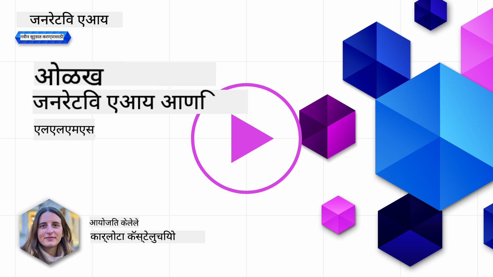
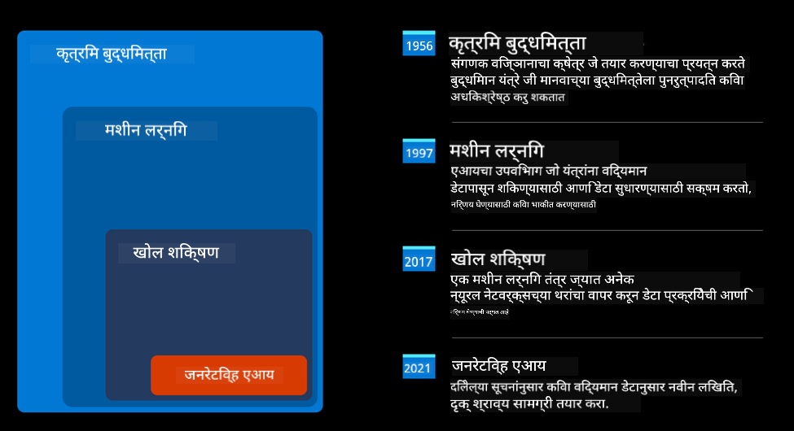
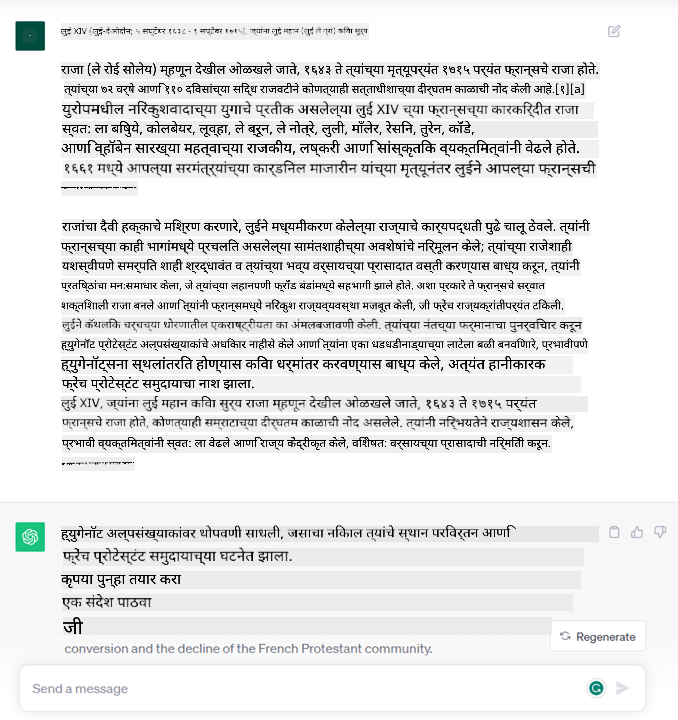
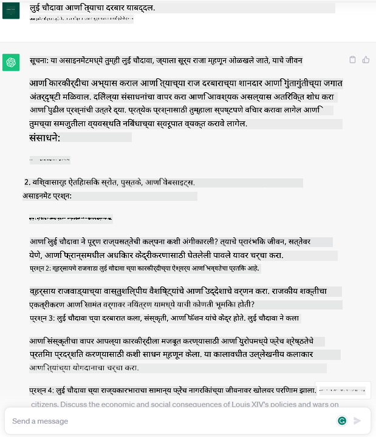
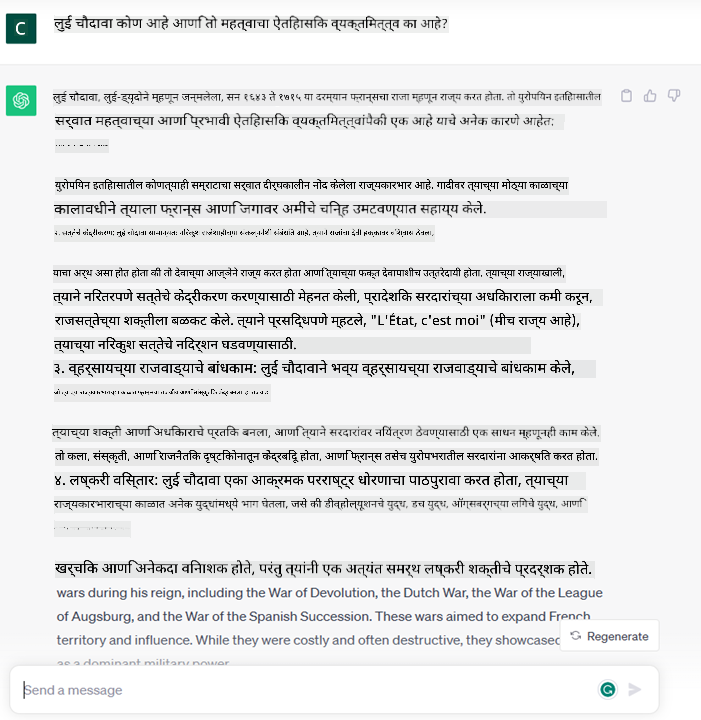

<!--
CO_OP_TRANSLATOR_METADATA:
{
  "original_hash": "f53ba0fa49164f9323043f1c6b11f2b1",
  "translation_date": "2025-05-19T13:08:18+00:00",
  "source_file": "01-introduction-to-genai/README.md",
  "language_code": "mr"
}
-->
# जनरेटिव AI आणि मोठे भाषा मॉडेल्सची ओळख

_(या धड्याचा व्हिडिओ पाहण्यासाठी वरच्या प्रतिमेवर क्लिक करा)_

जनरेटिव AI म्हणजे असा कृत्रिम बुद्धिमत्ता जो मजकूर, प्रतिमा आणि इतर प्रकारची सामग्री तयार करू शकतो. ही एक विलक्षण तंत्रज्ञान आहे कारण ती AI सर्वांसाठी उपलब्ध करते, कुणीही त्याचा वापर नैसर्गिक भाषेत लिहिलेल्या एका वाक्याच्या रूपात करू शकतो. तुम्हाला Java किंवा SQL सारख्या भाषेचा अभ्यास करण्याची आवश्यकता नाही, तुम्हाला फक्त तुमची भाषा वापरायची आहे, तुम्हाला काय हवे आहे ते सांगायचे आहे आणि AI मॉडेलकडून एक सूचना मिळते. याचे अनुप्रयोग आणि प्रभाव खूप मोठे आहेत, तुम्ही अहवाल लिहू किंवा समजून घेऊ शकता, अर्ज लिहू शकता आणि बरेच काही, ते सुद्धा काही सेकंदात.

या अभ्यासक्रमात, आम्ही आमचे स्टार्टअप शिक्षणाच्या जगात नवीन परिस्थिती अनलॉक करण्यासाठी जनरेटिव AI कसे वापरते आणि त्याच्या अनुप्रयोगाच्या सामाजिक प्रभावांशी संबंधित अपरिहार्य आव्हानांचा आणि तंत्रज्ञानाच्या मर्यादांचा कसा सामना करतो ते पाहणार आहोत.

## ओळख

या धड्यात आपण पाहणार आहोत:

- व्यवसाय परिस्थितीची ओळख: आमची स्टार्टअप कल्पना आणि मिशन.
- जनरेटिव AI आणि आम्ही सध्याच्या तंत्रज्ञानाच्या लँडस्केपवर कसे पोहोचलो.
- मोठ्या भाषा मॉडेल्सची अंतर्गत कार्यप्रणाली.
- मोठ्या भाषा मॉडेल्सच्या मुख्य क्षमता आणि व्यावहारिक उपयोग.

## शिकण्याची उद्दिष्टे

हा धडा पूर्ण केल्यानंतर, तुम्ही समजाल:

- जनरेटिव AI म्हणजे काय आणि मोठे भाषा मॉडेल्स कसे कार्य करतात.
- तुम्ही विविध उपयोगांसाठी मोठ्या भाषा मॉडेल्सचा कसा उपयोग करू शकता, शिक्षणाच्या परिस्थितींवर लक्ष केंद्रित करून.

## परिस्थिती: आमचे शैक्षणिक स्टार्टअप

जनरेटिव कृत्रिम बुद्धिमत्ता (AI) हे AI तंत्रज्ञानाचे शिखर दर्शवते, जे एकेकाळी अशक्य वाटणाऱ्या गोष्टींच्या सीमा ओलांडते. जनरेटिव AI मॉडेल्समध्ये अनेक क्षमता आणि अनुप्रयोग आहेत, परंतु या अभ्यासक्रमासाठी आम्ही ते एक काल्पनिक स्टार्टअपच्या माध्यमातून शिक्षणात कसे क्रांती घडवत आहेत ते पाहणार आहोत. आम्ही या स्टार्टअपला _आमचे स्टार्टअप_ असे संबोधू. आमचे स्टार्टअप शिक्षण क्षेत्रात कार्य करते, जागतिक स्तरावर शिक्षणामध्ये प्रवेश सुधारणे, शिक्षणासाठी समान प्रवेश सुनिश्चित करणे आणि प्रत्येक शिकणाऱ्याच्या गरजेनुसार वैयक्तिक शिक्षण अनुभव प्रदान करणे असा महत्त्वाकांक्षी मिशन स्टेटमेंट आहे.

आमच्या स्टार्टअप टीमला माहित आहे की आम्ही आधुनिक काळातील सर्वात शक्तिशाली साधनांपैकी एकाचा उपयोग केल्याशिवाय हे लक्ष्य साध्य करू शकणार नाही – मोठे भाषा मॉडेल्स (LLMs).

जनरेटिव AI आज शिकण्याची आणि शिकवण्याची पद्धत बदलण्याची अपेक्षा आहे, विद्यार्थ्यांना 24 तास उपलब्ध असलेल्या आभासी शिक्षकांकडून मोठ्या प्रमाणात माहिती आणि उदाहरणे मिळतात आणि शिक्षक त्यांच्या विद्यार्थ्यांचे मूल्यांकन करण्यासाठी आणि अभिप्राय देण्यासाठी नाविन्यपूर्ण साधनांचा उपयोग करू शकतात.

सुरुवातीला, आपण काही मूलभूत संकल्पना आणि शब्दावली स्पष्ट करूया ज्याचा आपण संपूर्ण अभ्यासक्रमात वापर करणार आहोत.

## जनरेटिव AI कसे मिळाले?

जनरेटिव AI मॉडेल्सच्या घोषणेमुळे निर्माण झालेल्या असामान्य _हाइप_ असूनही, ही तंत्रज्ञान दशकांपासून तयार होत आहे, 60 च्या दशकातील पहिल्या संशोधन प्रयत्नांपासून. आपण आता AI मानवी संज्ञानात्मक क्षमतांसह असलेल्या बिंदूपर्यंत पोहोचलो आहोत, उदाहरणार्थ [OpenAI ChatGPT](https://openai.com/chatgpt) किंवा [Bing Chat](https://www.microsoft.com/edge/features/bing-chat?WT.mc_id=academic-105485-koreyst), जे Bing संभाषणांसाठी GPT मॉडेलचा वापर करते.

थोडा मागे जाऊन पाहता, AI च्या अगदी पहिल्या प्रोटोटाइप्समध्ये टाइपराइटन चॅटबॉट्स होते, जे तज्ञांच्या गटाकडून काढलेल्या ज्ञानाच्या आधारावर आणि संगणकात सादर केले होते. ज्ञानाच्या आधारावर उत्तरांचा ट्रिगर इनपुट मजकूरात दिसणाऱ्या कीवर्ड्सद्वारे होतो.
तथापि, लवकरच हे स्पष्ट झाले की टाइपराइटन चॅटबॉट्स वापरून अशा पद्धतीने स्केलिंग चांगले होत नाही.

### AI साठी सांख्यिकीय दृष्टिकोन: मशीन लर्निंग

90 च्या दशकात, मजकूर विश्लेषणासाठी सांख्यिकीय दृष्टिकोनाच्या वापरामुळे एक महत्त्वाचा टप्पा आला. यामुळे नवीन अल्गोरिदम्स – मशीन लर्निंग म्हणून ओळखले जाते – विकसित झाले, जे डेटा कडून नमुने शिकण्यास सक्षम होते, ते स्पष्टपणे प्रोग्राम केलेले नसल्याशिवाय. या दृष्टिकोनामुळे मशीनला मानवी भाषा समजून घेण्याची क्षमता मिळाली: सांख्यिकीय मॉडेल मजकूर-लेबल जोडण्यांवर प्रशिक्षित केले जाते, ज्यामुळे मॉडेलला अज्ञात इनपुट मजकूर पूर्वनिर्धारित लेबलसह वर्गीकृत करण्यास सक्षम होते, जे संदेशाच्या हेतूचे प्रतिनिधित्व करते.

### न्यूरल नेटवर्क्स आणि आधुनिक आभासी सहाय्यक

अलीकडच्या वर्षांत, हार्डवेअरच्या तांत्रिक उत्क्रांतीने, अधिक डेटा हाताळण्यास सक्षम आणि अधिक जटिल गणनांनी AI संशोधनाला प्रोत्साहन दिले, ज्यामुळे न्यूरल नेटवर्क्स किंवा डीप लर्निंग अल्गोरिदम्स म्हणून ओळखल्या जाणाऱ्या प्रगत मशीन लर्निंग अल्गोरिदम्सचा विकास झाला.

न्यूरल नेटवर्क्स (आणि विशेषत: पुनरावृत्त न्यूरल नेटवर्क्स – RNNs) नैसर्गिक भाषा प्रक्रिया खूप सुधारली, ज्यामुळे वाक्यातील शब्दाच्या संदर्भाला महत्त्व देऊन मजकूराच्या अर्थाची अधिक अर्थपूर्ण पद्धतीने प्रतिनिधित्व करण्याची क्षमता मिळाली.

हे तंत्रज्ञान आहे ज्यामुळे नवीन शतकाच्या पहिल्या दशकात जन्मलेल्या आभासी सहाय्यकांना मानवी भाषा समजून घेण्यात, गरज ओळखण्यात आणि ते पूर्ण करण्यासाठी कृती करण्यासाठी – पूर्वनिर्धारित स्क्रिप्टसह उत्तर देणे किंवा तृतीय पक्ष सेवा वापरणे – खूप कुशल बनले.

### आजचा दिवस, जनरेटिव AI

तर आपण आजच्या जनरेटिव AI पर्यंत कसे पोहोचलो, जे डीप लर्निंगच्या उपसेट म्हणून पाहिले जाऊ शकते.

AI क्षेत्रातील दशकांच्या संशोधनानंतर, नवीन मॉडेल आर्किटेक्चर – _Transformer_ – RNNsच्या मर्यादा ओलांडल्या, ज्यामुळे ते अधिक लांब मजकूर अनुक्रमांना इनपुट म्हणून स्वीकारण्यास सक्षम झाले. Transformers लक्ष केंद्रित यंत्रणेवर आधारित आहेत, ज्यामुळे मॉडेलला मिळणाऱ्या इनपुट्सना विविध वजन देण्याची क्षमता मिळते, 'अधिक लक्ष' देणे जेथे सर्वात संबंधित माहिती एकत्रित केली जाते, मजकूर अनुक्रमात त्यांच्या क्रमाचे महत्त्व न ठेवता.

अलीकडील जनरेटिव AI मॉडेल्स – मोठे भाषा मॉडेल्स (LLMs) म्हणून ओळखले जातात, कारण ते मजकूर इनपुट्स आणि आउटपुट्ससह कार्य करतात – खरं तर या आर्किटेक्चरवर आधारित आहेत. या मॉडेल्सचे आकर्षक म्हणजे – विविध स्रोतांपासून, जसे की पुस्तके, लेख आणि वेबसाइट्सपासून मिळवलेल्या मोठ्या प्रमाणात लेबल नसलेल्या डेटावर प्रशिक्षित – ते विविध कार्यांसाठी अनुकूल केले जाऊ शकतात आणि व्याकरणदृष्ट्या योग्य मजकूर तयार करू शकतात ज्यामध्ये सर्जनशीलतेचा आभास असतो. त्यामुळे, त्यांनी मशीनच्या 'समजून घेण्याची' क्षमता अविश्वसनीयपणे वाढवली नाही तर मानवी भाषेत एक मूळ उत्तर तयार करण्याची क्षमता सक्षम केली.

## मोठे भाषा मॉडेल्स कसे कार्य करतात?

पुढच्या अध्यायात आपण विविध प्रकारचे जनरेटिव AI मॉडेल्स शोधणार आहोत, पण सध्या आपण मोठे भाषा मॉडेल्स कसे कार्य करतात ते पाहूया, OpenAI GPT (Generative Pre-trained Transformer) मॉडेल्सवर लक्ष केंद्रित करून.

- **Tokenizer, मजकूर ते संख्या**: मोठे भाषा मॉडेल्स मजकूर इनपुट म्हणून स्वीकारतात आणि मजकूर आउटपुट म्हणून तयार करतात. तथापि, सांख्यिकीय मॉडेल्स असल्याने, ते मजकूर अनुक्रमांपेक्षा संख्यांसह अधिक चांगले कार्य करतात. म्हणून प्रत्येक इनपुट मॉडेलला वापरण्यापूर्वी tokenizer द्वारे प्रक्रिया केली जाते. टोकन म्हणजे मजकूराचा तुकडा – ज्यामध्ये बदलणाऱ्या संख्येच्या अक्षरांचा समावेश असतो, त्यामुळे tokenizer चे मुख्य कार्य इनपुटला टोकन्सच्या श्रेणीत विभाजित करणे आहे. नंतर, प्रत्येक टोकनला टोकन इंडेक्ससह नकाशित केले जाते, जे मूळ मजकूर तुकड्याचे पूर्णांक कोडिंग आहे.

- **आउटपुट टोकन्सची भविष्यवाणी**: n टोकन्स इनपुट म्हणून दिले जातात (प्रत्येक मॉडेलच्या अनुसार max n बदलत असतो), मॉडेल एक टोकन आउटपुट म्हणून भविष्यवाणी करण्यास सक्षम असतो. नंतर, हा टोकन पुढील पुनरावृत्तीच्या इनपुटमध्ये समाविष्ट केला जातो, विस्तारणाऱ्या विंडो पॅटर्नमध्ये, एक (किंवा अनेक) वाक्य उत्तर म्हणून मिळवण्यासाठी एक चांगला वापरकर्ता अनुभव सक्षम करतो. हे स्पष्ट करते की, तुम्ही कधी ChatGPT सोबत खेळले असेल, तुम्हाला कदाचित लक्षात आले असेल की कधीकधी ते वाक्याच्या मध्यभागी थांबते असे दिसते.

- **निवड प्रक्रिया, संभाव्यता वितरण**: आउटपुट टोकन मॉडेलद्वारे सध्याच्या मजकूर अनुक्रमानंतर येण्याची संभाव्यता आहे त्यानुसार निवडले जाते. कारण मॉडेल त्याच्या प्रशिक्षणाच्या आधारावर सर्व संभाव्य 'पुढील टोकन्स'वर संभाव्यता वितरणाची भविष्यवाणी करते. तथापि, नेहमीच सर्वात जास्त संभाव्यता असलेले टोकन परिणामी वितरणातून निवडले जात नाही. या निवडीला एक प्रमाणात यादृच्छिकता जोडली जाते, ज्यामुळे मॉडेल नॉन-डिटर्मिनिस्टिक पद्धतीने कार्य करते - आम्हाला समान इनपुटसाठी एकच आउटपुट मिळत नाही. या यादृच्छिकतेचे प्रमाण सर्जनशील विचार प्रक्रियेची नक्कल करण्यासाठी जोडले जाते आणि मॉडेल पॅरामीटर तापमान वापरून ते ट्यून केले जाऊ शकते.

## आमचे स्टार्टअप मोठे भाषा मॉडेल्सचा कसा उपयोग करू शकते?

आता आपल्याला मोठ्या भाषा मॉडेलच्या अंतर्गत कार्यप्रणालीची अधिक चांगली समज आहे, तर त्यांना सर्वात सामान्य कार्ये चांगल्या प्रकारे कशी पार पाडता येतील याचे काही व्यावहारिक उदाहरणे पाहूया, आमच्या व्यवसाय परिस्थितीवर लक्ष ठेवून.
आम्ही म्हटले की मोठ्या भाषा मॉडेलची मुख्य क्षमता आहे _मूलभूत मजकूर तयार करणे, नैसर्गिक भाषेत लिहिलेल्या मजकूर इनपुटपासून सुरू करून_.

पण कोणत्या प्रकारचा मजकूर इनपुट आणि आउटपुट?
मोठ्या भाषा मॉडेलचा इनपुट _प्रॉम्प्ट_ म्हणून ओळखला जातो, तर आउटपुट _पूर्णता_ म्हणून ओळखला जातो, जो सध्याच्या इनपुटला पूर्ण करण्यासाठी पुढील टोकन तयार करण्याच्या मॉडेल यंत्रणेला संदर्भित करतो. आम्ही प्रॉम्प्ट म्हणजे काय आणि आमच्या मॉडेलमधून जास्तीत जास्त मिळवण्यासाठी ते कसे डिझाइन करायचे यावर सखोल चर्चा करणार आहोत. पण सध्या, आपण म्हणूया की प्रॉम्प्टमध्ये समाविष्ट असू शकते:

- आम्ही मॉडेलकडून अपेक्षित आउटपुटचा प्रकार निर्दिष्ट करणारा एक **सूचना**. ही सूचना कधीकधी काही उदाहरणे किंवा काही अतिरिक्त डेटा समाविष्ट करू शकते.

  1. लेख, पुस्तक, उत्पादन पुनरावलोकनांची संक्षेपण आणि संरचित नसलेल्या डेटामधून अंतर्दृष्टी काढणे.
    
    
  
  2. लेख, निबंध, असाइनमेंट किंवा अधिकची सर्जनशील कल्पना आणि डिझाइन.
      
     

- एक **प्रश्न**, एजंटसोबत संवादाच्या रूपात विचारला जातो.
  
  

- **मजकूर पूर्ण करण्यासाठी** एक तुकडा, जो अप्रत्यक्षपणे लेखन सहाय्याची मागणी आहे.
  
  

- एक **कोडचा तुकडा** ज्यासोबत त्याचे स्पष्टीकरण आणि दस्तऐवजीकरण करण्याची मागणी आहे, किंवा विशिष्ट कार्य पूर्ण करणारा कोड तयार करण्याची टिप्पणी आहे.
  
  

वरील उदाहरणे अगदी सोपी आहेत आणि मोठ्या भाषा मॉडेल्सच्या क्षमतांची संपूर्ण प्रदर्शन म्हणून विचारात घेतली जाणार नाहीत. ते जनरेटिव AI चा उपयोग करण्याच्या संभाव्यतेचे प्रदर्शन करण्यासाठी आहेत, विशेषतः पण शैक्षणिक संदर्भांपुरते मर्यादित नाहीत.

तसेच, जनरेटिव AI मॉडेलचे आउटपुट परिपूर्ण नाही आणि कधीकधी मॉडेलची सर्जनशीलता त्याच्या विरुद्ध कार्य करू शकते, ज्यामुळे एक असा आउटपुट तयार होतो जो शब्दांच्या संयोजनामुळे मानवी वापरकर्त्याला वास्तविकतेची विकृतीकरण म्हणून समजता येतो, किंवा तो आक्षेपार्ह असू शकतो. जनरेटिव AI बुद्धिमान नाही - कमीतकमी बुद्धिमत्तेच्या व्यापक परिभाषेमध्ये, ज्यामध्ये गंभीर आणि सर्जनशील विचार किंवा भावनिक बुद्धिमत्ता समाविष्ट आहे; ते निश्चित नाही, आणि ते विश्वासार्ह नाही, कारण फॅब्रिकेशन्स, जसे की चुकीचे संदर्भ, सामग्री, आणि विधान, योग्य माहिती सोबत संयोजनात दिले जाऊ शकतात, आणि ते विश्वासार्ह आणि आत्मविश्वासपूर्ण पद्धतीने सादर केले जाऊ शकते. पुढील धड्यात, आपण या सर्व मर्यादांशी व्यवहार करणार आहोत आणि आम्ही त्यांना कमी करण्यासाठी काय करू शकतो ते पाहणार आहोत.

## असाइनमेंट

तुमचे असाइनमेंट म्हणजे [जनरेटिव AI](https://en.wikipedia.org/wiki/Generative_artificial_intelligence?WT.mc_id=academic-105485-koreyst) वर अधिक वाचन करणे आणि जनरेटिव AI जोडण्यासाठी आज नसलेल्या क्षेत्राची ओळख करणे. ते "जुन्या पद्धतीने" करण्यापेक्षा प्रभाव कसा वेगळा असेल, तुम्ही काही असे करू शकता जे तुम्ही पूर्वी करू शकत नाही, किंवा तुम्ही जलद आहात का? तुमचे स्वप्न AI स्टार्टअप कसे दिसेल यावर 300 शब्दांचा सारांश लिहा आणि "समस्या", "मी AI कसा वापरेन", "प्रभाव" आणि ऐच्छिकरित्या व्यवसाय योजना असे शीर्षक समाविष्ट करा.

जर तुम्ही हे कार्य केले असेल, तर तुम्ही Microsoft's incubator, [Microsoft for Startups Founders Hub](https://www.microsoft.com/startups?WT.mc_id=academic-105485-koreyst) मध्ये अर्ज करण्यासाठी तयार असू शकता. आम्ही Azure, OpenAI, मार्गदर्शन आणि बरेच काही साठी क्रेडिट्स ऑफर करतो, तपासा!

## ज्ञान तपासणी

मोठ्या भाषा मॉडेल्सबद्दल काय सत्य आहे?

1. तुम्हाला प्रत्येक वेळी समान प्रतिसाद मिळतो.
1. ते गोष्टी परिपूर्णपणे करतात, संख्या जोडणे, कार्यरत कोड तयार करणे इत्यादी

**अस्वीकृति**:  
हा दस्तऐवज AI भाषांतर सेवा [Co-op Translator](https://github.com/Azure/co-op-translator) वापरून अनुवादित केला आहे. आम्ही अचूकतेसाठी प्रयत्नशील असलो तरी, कृपया लक्षात ठेवा की स्वयंचलित भाषांतरांमध्ये त्रुटी किंवा अपूर्णता असू शकते. मूळ भाषेतील दस्तऐवज अधिकृत स्रोत मानला जावा. महत्त्वाच्या माहितीसाठी, व्यावसायिक मानवी भाषांतराची शिफारस केली जाते. या भाषांतराचा वापर केल्याने उद्भवणाऱ्या कोणत्याही गैरसमज किंवा चुकीच्या अर्थासाठी आम्ही जबाबदार नाही.