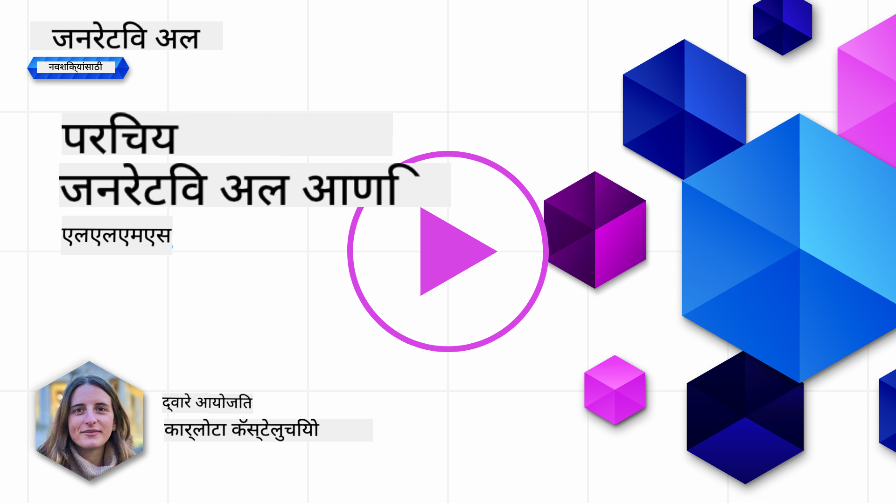
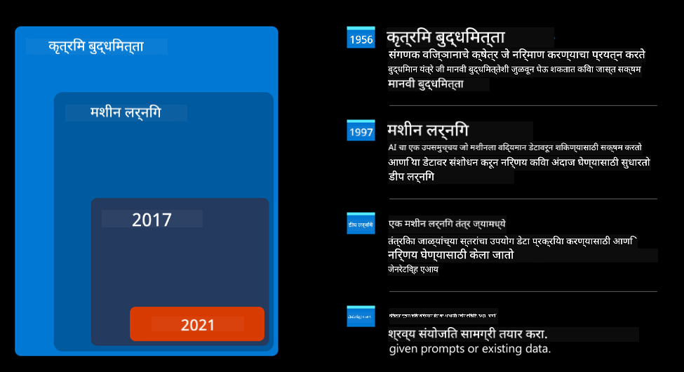
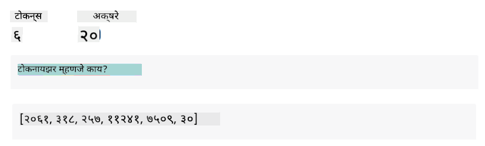
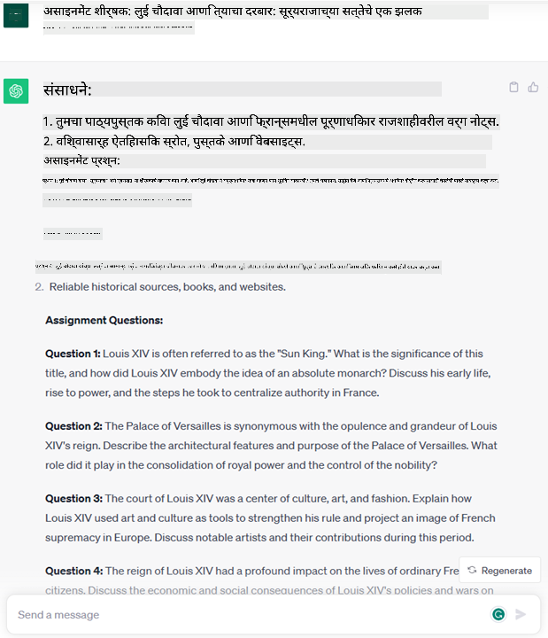
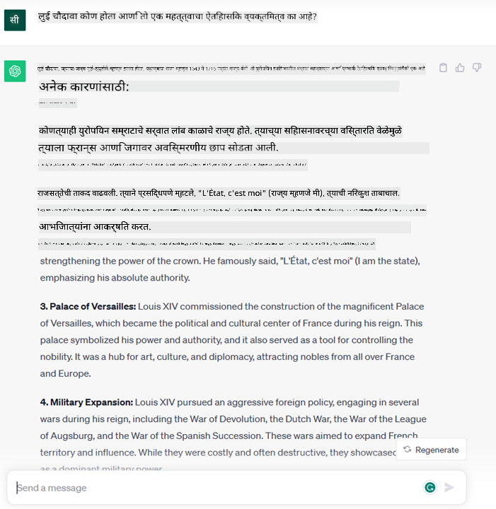
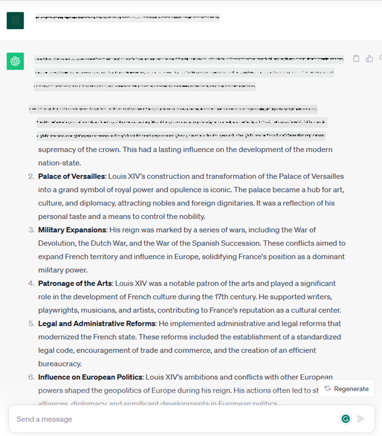
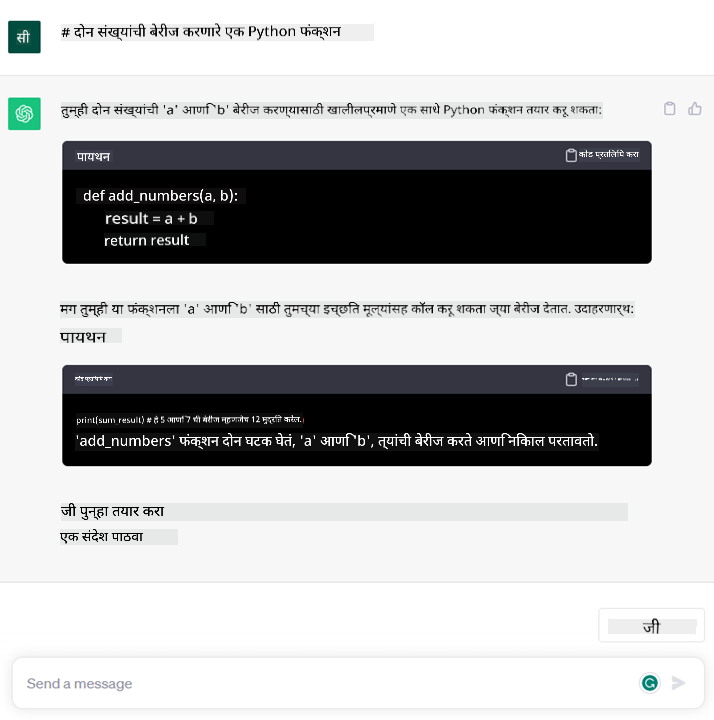

<!--
CO_OP_TRANSLATOR_METADATA:
{
  "original_hash": "f53ba0fa49164f9323043f1c6b11f2b1",
  "translation_date": "2025-06-25T09:45:32+00:00",
  "source_file": "01-introduction-to-genai/README.md",
  "language_code": "mr"
}
-->
# जनरेटिव AI आणि मोठ्या भाषा मॉडेल्सची ओळख

_(या धड्याचा व्हिडिओ पाहण्यासाठी वरील प्रतिमेवर क्लिक करा)_

जनरेटिव AI म्हणजे कृत्रिम बुद्धिमत्ता जी मजकूर, प्रतिमा आणि इतर प्रकारचे कंटेंट तयार करू शकते. ही एक अद्भुत तंत्रज्ञान आहे कारण ती AI ला लोकशाही करते, कोणीही नैसर्गिक भाषेत लिहिलेल्या वाक्याच्या रूपात एक साधा मजकूर संकेत देऊन याचा वापर करू शकतो. तुम्हाला काहीतरी उपयुक्त साध्य करण्यासाठी जावा किंवा SQL सारखी भाषा शिकण्याची गरज नाही, तुम्हाला फक्त तुमची भाषा वापरायची आहे, तुम्हाला काय हवे आहे ते सांगायचे आहे आणि AI मॉडेलकडून एक सूचना मिळते. यासाठी अनुप्रयोग आणि प्रभाव खूप मोठे आहेत, तुम्ही अहवाल लिहू शकता किंवा समजू शकता, अनुप्रयोग लिहू शकता आणि बरेच काही, तेही काही सेकंदात.

या अभ्यासक्रमात, आम्ही आमचे स्टार्टअप शिक्षण जगात नवीन परिस्थिती उघडण्यासाठी जनरेटिव AI कसे वापरते आणि त्याच्या अनुप्रयोगाशी संबंधित सामाजिक परिणाम आणि तंत्रज्ञानाच्या मर्यादांशी संबंधित अपरिहार्य आव्हाने कसे सोडवतो याचा अभ्यास करू.

## परिचय

हा धडा समाविष्ट करेल:

- व्यवसाय परिस्थितीची ओळख: आमची स्टार्टअप कल्पना आणि ध्येय.
- जनरेटिव AI आणि आम्ही वर्तमान तंत्रज्ञानाच्या लँडस्केपवर कसे पोहोचलो.
- मोठ्या भाषा मॉडेलचे अंतर्गत कार्य.
- मोठ्या भाषा मॉडेल्सच्या मुख्य क्षमता आणि व्यावहारिक वापर प्रकरणे.

## शिकण्याची उद्दिष्टे

हा धडा पूर्ण केल्यानंतर, तुम्हाला समजेल:

- जनरेटिव AI म्हणजे काय आणि मोठे भाषा मॉडेल्स कसे कार्य करतात.
- तुम्ही शिक्षण परिस्थितीवर लक्ष केंद्रित करून, विविध वापर प्रकरणांसाठी मोठे भाषा मॉडेल्स कसे वापरू शकता.

## परिस्थिती: आमचे शैक्षणिक स्टार्टअप

जनरेटिव कृत्रिम बुद्धिमत्ता (AI) AI तंत्रज्ञानाचा शिखर दर्शवते, जे एकदा अशक्य मानले गेले होते त्या सीमा ओलांडते. जनरेटिव AI मॉडेल्समध्ये अनेक क्षमता आणि अनुप्रयोग आहेत, परंतु या अभ्यासक्रमासाठी आम्ही कसे ते एका काल्पनिक स्टार्टअपद्वारे शिक्षण क्षेत्रात क्रांती घडवत आहे याचा अभ्यास करू. आम्ही या स्टार्टअपला _आमचे स्टार्टअप_ म्हणून संदर्भित करू. आमचे स्टार्टअप शिक्षण क्षेत्रात कार्य करते ज्याचे महत्त्वाकांक्षी ध्येय आहे

> _जागतिक स्तरावर शिक्षणामध्ये प्रवेशयोग्यता सुधारणे, शिक्षणामध्ये समान प्रवेश सुनिश्चित करणे आणि प्रत्येक शिकणाऱ्याच्या गरजेनुसार वैयक्तिकृत शिक्षण अनुभव प्रदान करणे._

आमच्या स्टार्टअप टीमला माहित आहे की आम्ही आधुनिक काळातील सर्वात शक्तिशाली साधनांपैकी एक - मोठ्या भाषा मॉडेल्स (LLMs) वापरल्याशिवाय हे लक्ष्य साध्य करू शकणार नाही.

जनरेटिव AI ने आज आम्ही शिकण्याचा आणि शिकवण्याचा मार्ग बदलण्याची अपेक्षा आहे, विद्यार्थ्यांना 24 तास उपलब्ध असलेल्या आभासी शिक्षकांनी भरपूर प्रमाणात माहिती आणि उदाहरणे दिली आहेत आणि शिक्षक त्यांचे विद्यार्थी मूल्यांकन करण्यासाठी आणि अभिप्राय देण्यासाठी नाविन्यपूर्ण साधने वापरू शकतात.

सुरुवात करण्यासाठी, चला काही मूलभूत संकल्पना आणि शब्दावली परिभाषित करूया ज्याचा आम्ही संपूर्ण अभ्यासक्रमात वापर करू.

## जनरेटिव AI कसा मिळवला?

जनरेटिव AI मॉडेल्सच्या घोषणेमुळे निर्माण झालेल्या असामान्य _हायप_ असूनही, हे तंत्रज्ञान दशकानुदशके विकसित झाले आहे, ज्यामध्ये 60 च्या दशकातील पहिल्या संशोधन प्रयत्नांचा समावेश आहे. आम्ही आता AI मानवी संज्ञानात्मक क्षमता असलेल्या बिंदूवर आहोत, जसे की [OpenAI ChatGPT](https://openai.com/chatgpt) किंवा [Bing Chat](https://www.microsoft.com/edge/features/bing-chat?WT.mc_id=academic-105485-koreyst) द्वारा दर्शविल्याप्रमाणे संभाषण, जे Bing संवादासाठी वेब शोधासाठी GPT मॉडेल देखील वापरते.

थोडे मागे जाऊन, AI चे सर्वात पहिले प्रोटोटाइप टाइपरायटेन चॅटबॉट्स होते, जे तज्ञांच्या गटातून काढलेल्या ज्ञानाच्या आधारावर आणि संगणकात दर्शवलेले होते. इनपुट मजकूरात दिसणारे कीवर्ड्सद्वारे ज्ञानाच्या आधारातील उत्तर ट्रिगर केले जात होते.
तथापि, लवकरच हे स्पष्ट झाले की टाइपरायटेन चॅटबॉट्स वापरणे असा दृष्टिकोन चांगला स्केल होत नाही.

### AI साठी सांख्यिकीय दृष्टिकोन: मशीन लर्निंग

90 च्या दशकात टेक्स्ट विश्लेषणासाठी सांख्यिकीय दृष्टिकोन लागू करून एक महत्त्वपूर्ण टप्पा आला. यामुळे नवीन अल्गोरिदमचा विकास झाला - ज्याला मशीन लर्निंग म्हणून ओळखले जाते - डेटा मधून नमुने शिकण्यास सक्षम, स्पष्टपणे प्रोग्राम न करता. या दृष्टिकोनामुळे मशीनला मानवी भाषा समजण्याची क्षमता मिळाली: एक सांख्यिकीय मॉडेल टेक्स्ट-लेबल जोड्यांवर प्रशिक्षित केले जाते, ज्यामुळे मॉडेलला संदेशाच्या उद्देशाचे प्रतिनिधित्व करणाऱ्या पूर्व-परिभाषित लेबलसह अज्ञात इनपुट टेक्स्ट वर्गीकृत करण्याची क्षमता मिळते.

### न्यूरल नेटवर्क्स आणि आधुनिक आभासी सहाय्यक

अलीकडच्या वर्षांत, मोठ्या प्रमाणात डेटा आणि अधिक जटिल गणनांवर प्रक्रिया करणारे हार्डवेअरचे तांत्रिक उत्क्रांती AI मधील संशोधनाला प्रोत्साहित करते, ज्यामुळे न्यूरल नेटवर्क्स किंवा डीप लर्निंग अल्गोरिदम म्हणून ओळखल्या जाणाऱ्या प्रगत मशीन लर्निंग अल्गोरिदमचा विकास झाला.

न्यूरल नेटवर्क्स (आणि विशेषतः रेकर्न्ट न्यूरल नेटवर्क्स – RNNs) ने नैसर्गिक भाषा प्रक्रिया लक्षणीयरीत्या वाढवली, वाक्यातील शब्दाच्या संदर्भाला महत्त्व देऊन मजकूराचा अर्थ अधिक अर्थपूर्ण पद्धतीने दर्शवण्याची क्षमता मिळवली.

हीच तंत्रज्ञान आहे जी नवीन शतकाच्या पहिल्या दशकात जन्मलेल्या आभासी सहाय्यकांना सामर्थ्य देते, मानवी भाषा समजण्यात अत्यंत प्रवीण, गरज ओळखण्यात आणि त्याची पूर्तता करण्यासाठी कृती करण्यास सक्षम – जसे की पूर्व-परिभाषित स्क्रिप्टसह उत्तर देणे किंवा तृतीय-पक्ष सेवा वापरणे.

### आजचा दिवस, जनरेटिव AI

तर असे आहे की आज आम्ही जनरेटिव AI पर्यंत पोहोचलो, ज्याला डीप लर्निंगचा एक उपसमूह म्हणून पाहिले जाऊ शकते.

AI क्षेत्रात दशकानुदशके संशोधन केल्यानंतर, नवीन मॉडेल आर्किटेक्चर – _ट्रान्सफॉर्मर_ – RNNs च्या मर्यादा ओलांडल्या, इनपुट म्हणून मजकूराच्या अधिक लांब अनुक्रम प्राप्त करण्यास सक्षम. ट्रान्सफॉर्मर्स लक्ष देण्याच्या यंत्रणावर आधारित आहेत, ज्यामुळे मॉडेलला प्राप्त होणाऱ्या इनपुट्सना वेगवेगळे वजन देण्याची क्षमता मिळते, जिथे सर्वात संबंधित माहिती केंद्रित आहे तिथे 'अधिक लक्ष देणे', मजकूर अनुक्रमातील क्रमाची पर्वा न करता.

बहुतेक अलीकडील जनरेटिव AI मॉडेल्स – ज्याला मोठे भाषा मॉडेल्स (LLMs) म्हणून ओळखले जाते, कारण ते मजकूर इनपुट्स आणि आउटपुट्ससह कार्य करतात – खरोखरच या आर्किटेक्चरवर आधारित आहेत. या मॉडेल्सबद्दल मनोरंजक गोष्ट म्हणजे – विविध स्रोतांमधून पुस्तके, लेख आणि वेबसाइट्स सारख्या लेबल नसलेल्या डेटाच्या प्रचंड प्रमाणात प्रशिक्षित – ते विविध कार्यांसाठी अनुकूल केले जाऊ शकतात आणि सर्जनशीलतेच्या रूपासह व्याकरणदृष्ट्या योग्य मजकूर निर्माण करू शकतात. त्यामुळे, त्यांनी मशीनची इनपुट टेक्स्ट 'समजण्याची' क्षमता अविश्वसनीयरीत्या वाढवली नाही तर त्यांनी मानवी भाषेत एक मूळ उत्तर निर्माण करण्याची क्षमता सक्षम केली.

## मोठे भाषा मॉडेल्स कसे कार्य करतात?

पुढील अध्यायात आम्ही विविध प्रकारच्या जनरेटिव AI मॉडेल्सचा अभ्यास करणार आहोत, परंतु आत्तासाठी मोठे भाषा मॉडेल्स कसे कार्य करतात ते पाहूया, OpenAI GPT (जनरेटिव प्री-ट्रेन ट्रान्सफॉर्मर) मॉडेल्सवर लक्ष केंद्रित करून.

- **टोकनायझर, मजकूर ते संख्या**: मोठे भाषा मॉडेल्स एक मजकूर इनपुट म्हणून स्वीकारतात आणि आउटपुट म्हणून एक मजकूर निर्माण करतात. तथापि, सांख्यिकीय मॉडेल्स असल्याने, ते मजकूर अनुक्रमांपेक्षा संख्यांवर अधिक चांगले कार्य करतात. म्हणूनच मॉडेलला प्रत्येक इनपुट कोर मॉडेलद्वारे वापरण्यापूर्वी टोकनायझरद्वारे प्रक्रिया केली जाते. एक टोकन म्हणजे मजकूराचा तुकडा – ज्यामध्ये बदलत्या संख्येच्या वर्णांचा समावेश आहे, त्यामुळे टोकनायझरचे मुख्य कार्य इनपुटला टोकन्सच्या अरेमध्ये विभाजित करणे आहे. त्यानंतर, प्रत्येक टोकनला टोकन इंडेक्ससह मॅप केले जाते, जे मूळ मजकूर तुकड्याचे पूर्णांक एन्कोडिंग आहे.

- **आउटपुट टोकन्सची भविष्यवाणी करणे**: n टोकन्स इनपुट म्हणून दिले जातात (प्रत्येक मॉडेलमध्ये कमाल n बदलत असतो), मॉडेल एक टोकन आउटपुट म्हणून भविष्यवाणी करण्यास सक्षम असतो. नंतर हे टोकन पुढील पुनरावृत्तीत इनपुटमध्ये समाविष्ट केले जाते, विस्तारत जाणाऱ्या विंडो नमुन्यात, एक उत्तर म्हणून एक (किंवा एकाधिक) वाक्य मिळविण्याचा चांगला वापरकर्ता अनुभव सक्षम करतो. याचे स्पष्टीकरण आहे की, जर तुम्ही कधी ChatGPT सोबत खेळले असाल, तर तुम्हाला कधी कधी असे वाटेल की ते वाक्याच्या मध्यभागी थांबते.

- **निवड प्रक्रिया, संभाव्यता वितरण**: आउटपुट टोकन मॉडेलद्वारे निवडले जाते सध्याच्या मजकूर अनुक्रमानंतर होण्याची त्याची संभाव्यता. हे कारण मॉडेल सर्व संभाव्य 'पुढील टोकन्स' वर संभाव्यता वितरणाची भविष्यवाणी करते, त्याच्या प्रशिक्षणावर आधारित गणना केली जाते. तथापि, नेहमीच सर्वात जास्त संभाव्यता असलेले टोकन परिणामी वितरणातून निवडले जात नाही. या निवडीला काही प्रमाणात रँडमनेस जोडला जातो, ज्यामुळे मॉडेल नॉन-डिटर्मिनिस्टिक पद्धतीने कार्य करते - आपल्याला समान इनपुटसाठी नेमके समान आउटपुट मिळत नाही. सर्जनशील विचार प्रक्रियेचे अनुकरण करण्यासाठी या रँडमनेसची पातळी जोडली जाते आणि ती तापमान नावाच्या मॉडेल पॅरामीटरचा वापर करून ट्यून केली जाऊ शकते.

## आमचे स्टार्टअप मोठ्या भाषा मॉडेल्सचा कसा लाभ घेऊ शकते?

आता आपल्याला मोठ्या भाषा मॉडेलचे अंतर्गत कार्य अधिक चांगले समजले आहे, चला काही व्यावहारिक उदाहरणे पाहूया ज्यात सर्वात सामान्य कार्ये ते चांगले पार पाडू शकतात, आमच्या व्यवसाय परिस्थितीवर लक्ष ठेवून.
आम्ही म्हटले की मोठ्या भाषा मॉडेलची मुख्य क्षमता _नैसर्गिक भाषेत लिहिलेल्या मजकूर इनपुटपासून सुरुवात करून, पूर्णपणे नवीन मजकूर तयार करणे_ आहे.

पण कोणत्या प्रकारचे मजकूर इनपुट आणि आउटपुट?
मोठ्या भाषा मॉडेलचा इनपुट संकेत म्हणून ओळखला जातो, तर आउटपुट पूर्णता म्हणून ओळखला जातो, ज्याचा संदर्भ वर्तमान इनपुट पूर्ण करण्यासाठी पुढील टोकन निर्माण करण्याच्या मॉडेल यंत्रणेकडे आहे. आम्ही संकेत म्हणजे काय आणि आमच्या मॉडेलमधून सर्वाधिक मिळवण्यासाठी ते कसे डिझाइन करायचे यावर सखोल चर्चा करणार आहोत. पण आत्तासाठी, चला असे म्हणूया की संकेतामध्ये समाविष्ट असू शकते:

- मॉडेलकडून आम्ही अपेक्षित आउटपुट प्रकार निर्दिष्ट करणारी **सूचना**. ही सूचना कधीकधी काही उदाहरणे किंवा काही अतिरिक्त डेटा समाविष्ट करू शकते.

  1. लेख, पुस्तक, उत्पादन पुनरावलोकने आणि बरेच काही यांचे सारांश, असंरचित डेटामधून अंतर्दृष्टी काढण्यासह.
    
    
  
  2. लेख, निबंध, असाइनमेंट किंवा अधिकच्या सर्जनशील कल्पना आणि डिझाइन.
      
     

- एजंटसोबतच्या संवादाच्या रूपात विचारलेला **प्रश्न**.
  
  

- पूर्ण करण्यासाठी **मजकूराचा तुकडा**, जो स्पष्टपणे लेखन सहाय्य मागणे आहे.
  
  

- **कोडचा तुकडा** जो त्याचे स्पष्टीकरण आणि दस्तऐवजीकरण करण्यासाठी किंवा विशिष्ट कार्य पूर्ण करणारा कोड निर्माण करण्यासाठी टिप्पणी मागतो.
  
  

वरील उदाहरणे खूप सोपी आहेत आणि मोठ्या भाषा मॉडेल्सच्या क्षमतांची व्यापक प्रदर्शन करण्याचा हेतू नाही. ते जनरेटिव AI चा वापर करण्याच्या संभाव्यता दर्शवण्यासाठी आहेत, विशेषतः परंतु शैक्षणिक संदर्भात मर्यादित नाही.

तसेच, जनरेटिव AI मॉडेलचे आउटपुट परिपूर्ण नाही आणि कधीकधी मॉडेलची सर्जनशीलता त्याच्या विरोधात कार्य करू शकते, परिणामी आउटपुट ज्याचे शब्दांचे संयोजन मानवी वापरकर्त्याला वास्तविकतेची विकृती म्हणून व्याख्या करता येते, किंवा ते आक्षेपार्ह असू शकते. जनरेटिव AI बुद्धिमान नाही - कमीतकमी बुद्धिमत्तेच्या अधिक व्यापक व्याख्येमध्ये, ज्यामध्ये गंभीर आणि सर्जनशील विचार किंवा भावनिक बुद्धिमत्ता समाविष्ट आहे; ते निश्चित नाही, आणि ते विश्वासार्ह नाही, कारण चुकीचे संदर्भ, सामग्री आणि विधाने बरोबर माहिती सह संयोजनात असू शकतात आणि विश्वासार्ह आणि आत्मविश्वासपूर्ण पद्धतीने सादर केली जाऊ शकतात. पुढील धड्यांमध्ये, आम्ही या सर्व मर्यादांशी व्यवहार करणार आहोत आणि आम्ही त्यांना कमी करण्यासाठी काय करू शकतो ते पाहणार आहोत.

## असाइनमेंट

तुमचे असाइनमेंट म्हणजे [जनरेटिव AI](https://en.wikipedia.org/wiki/Generative_artificial_intelligence?WT.mc_id=academic-105485-koreyst) वर अधिक वाचणे आणि तुम्ही आज जनरेटिव AI जोडू इच्छित असलेल्या क्षेत्राची ओळख पटवणे ज्यात ते नाही. जुन्या पद्धतीने ते करणे आणि त्याचे प्रभाव वेगळे कसे असेल, तुम्ही काहीतरी करू शकता जे तुम्ही आधी करू शकत नाही, किंवा तुम्ही जलद आहात का? तुमचे स्वप्नातील AI स्टार्टअप कसे दिसेल यावर 300 शब्दांचे सारांश लिहा आणि "समस्या", "मी AI कसा वापरेन", "प्रभाव" आणि ऐच्छिकरित्या व्यवसाय योजना यासारखे हेडर्स समाविष्ट करा.

जर तुम्ही हे कार्य केले असेल, तर तुम्ही मायक्रोसॉफ्टच्या इनक्युबेटरमध्ये अर्ज करण्यासाठी तयार असाल, [Microsoft for Startups Founders Hub](https://www.microsoft.com/startups?WT.mc_id=academic-105485-koreyst) आम्ही Azure, OpenAI, मार्गदर्शन आणि बरेच काहीसाठी क्रेडिट्स ऑफर करतो, तपासून पहा!

**अस्वीकृती**:  
हा दस्तऐवज AI अनुवाद सेवा [Co-op Translator](https://github.com/Azure/co-op-translator) वापरून अनुवादित केला गेला आहे. आम्ही अचूकतेसाठी प्रयत्नशील असलो तरी कृपया लक्षात ठेवा की स्वयंचलित अनुवादांमध्ये त्रुटी किंवा अचूकतेचा अभाव असू शकतो. मूळ भाषेतील मूळ दस्तऐवज हा अधिकृत स्रोत मानावा. महत्त्वपूर्ण माहितीसाठी, व्यावसायिक मानवी अनुवादाची शिफारस केली जाते. या अनुवादाचा वापर केल्यामुळे निर्माण होणाऱ्या कोणत्याही गैरसमजुतींसाठी किंवा चुकीच्या अर्थासाठी आम्ही जबाबदार नाही.