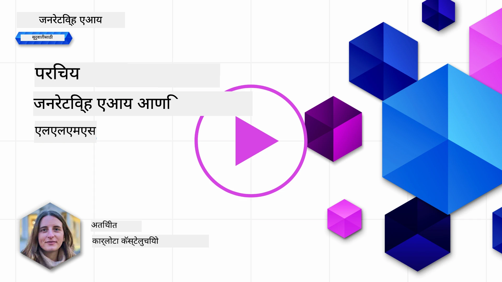
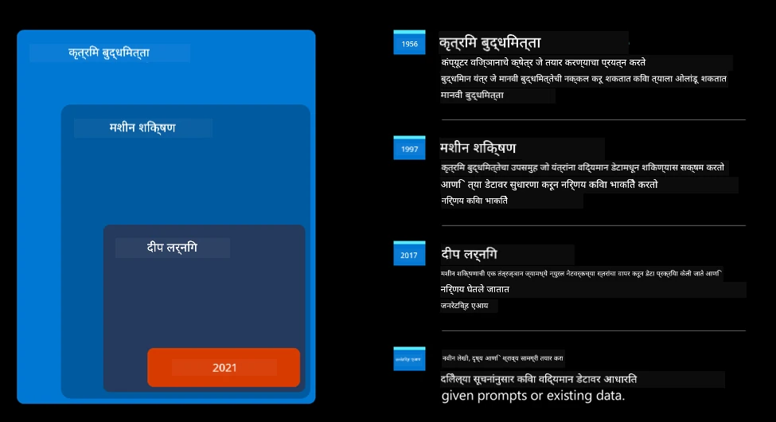
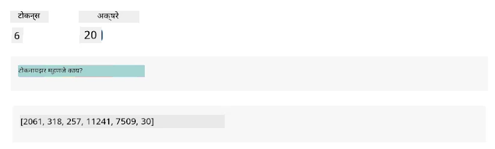
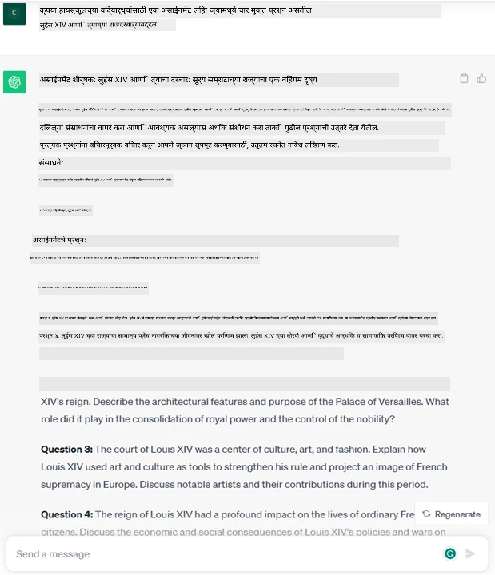
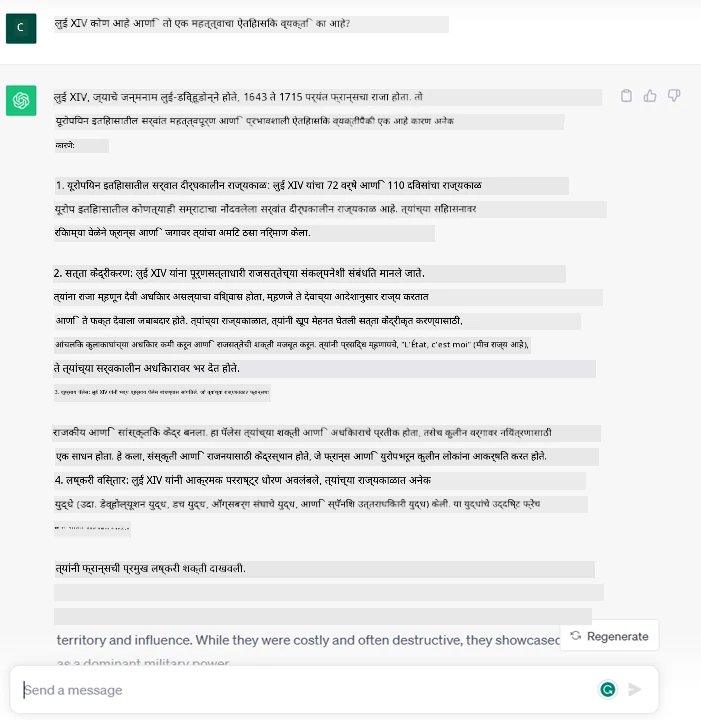
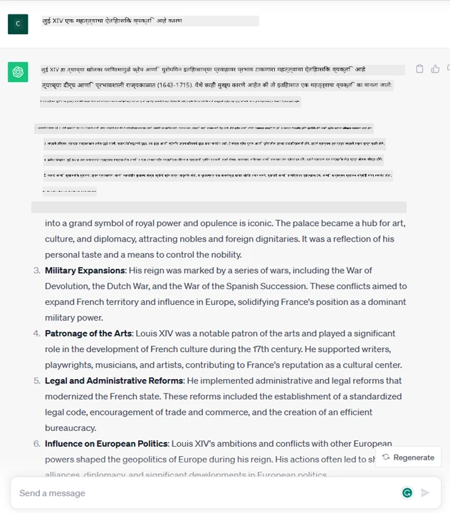
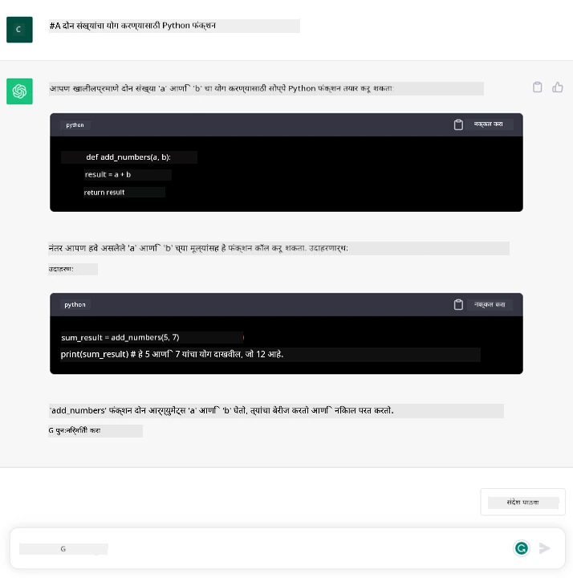

# जनरेटिव AI आणि मोठ्या भाषा मॉडेल्सची ओळख

_(या धड्याचा व्हिडिओ पाहण्यासाठी वरील प्रतिमेवर क्लिक करा)_

जनरेटिव AI म्हणजे असा आर्टिफिशियल इंटेलिजन्स जो मजकूर, प्रतिमा आणि इतर प्रकारचा कंटेंट तयार करू शकतो. हे तंत्रज्ञान खूपच विलक्षण ठरते कारण ते AI ला लोकसामान्यांपर्यंत पोहोचवते, कोणीही फक्त एका टेक्स्ट प्रॉम्प्ट, नैसर्गिक भाषेतले एक वाक्य वापरून ते वापरू शकतो. काहीतरी उपयुक्त साध्य करण्यासाठी तुम्हाला Java किंवा SQL सारखी भाषा शिकण्याची गरज नाही, तुम्हाला फक्त तुमची भाषा वापरावी लागते, काय पाहिजे ते सांगावे आणि AI मॉडेलकडून सुचवलेले उत्तर मिळते. यासाठी केल्या जाणाऱ्या अनुप्रयोगांचा आणि परिणामांचा प्रमाण मोठा आहे, तुम्ही अहवाल लिहू शकता किंवा समजू शकता, अर्ज तयार करू शकता आणि बरेच काही, हे सगळे सेकंदांत करण्यात येते.

या अभ्यासक्रमात, आपण पाहणार आहोत की आमचे स्टार्टअप कसे जनरेटिव AI चा वापर करून शिक्षण क्षेत्रात नवीन संधी निर्माण करते आणि त्यासोबत येणाऱ्या सामाजिक परिणामांच्या समस्यांशी आणि तंत्रज्ञानाच्या मर्यादांशी कसे संघर्ष करते.

## परिचय

हा धडा खालील गोष्टी समाविष्ट करेल:

- व्यवसायीय परिदृश्याचे परिचय: आमच्या स्टार्टअपची कल्पना आणि मिशन.
- जनरेटिव AI आणि सध्याच्या तंत्रज्ञानाच्या वातावरणापर्यंत आम्ही कसे पोहोचलो.
- मोठ्या भाषा मॉडेलचं अंतर्गत कार्यप्रणाली.
- मोठ्या भाषा मॉडेल्सच्या मुख्य क्षमता आणि व्यावहारिक वापर प्रकरणे.

## शिक्षणाचे उद्दिष्टे

हा धडा पूर्ण केल्यानंतर, तुम्हाला समजेल:

- जनरेटिव AI काय आहे आणि मोठे भाषा मॉडेल कसे काम करतात.
- वेगवेगळ्या वापर प्रकरणांसाठी मोठे भाषा मॉडेल कसे वापरता येतील, विशेषतः शिक्षणाच्या संदर्भात.

## परिदृश्य: आमचे शैक्षणिक स्टार्टअप

जनरेटिव आर्टिफिशियल इंटेलिजन्स (AI) ही AI तंत्रज्ञानातील सर्वोच्च उंची आहे, जी अगदी शक्य नसलेले देखील शक्य करते. जनरेटिव AI मॉडेल्सकडे अनेक क्षमता आणि अनुप्रयोग आहेत, पण या अभ्यासक्रमात आपण पाहणार आहोत की ते एका काल्पनिक स्टार्टअपने शिक्षण क्षेत्रात कसे क्रांतिकारी बदल घडवत आहे. हा स्टार्टअप आपण _आमच्या स्टार्टअप_ म्हणून उल्लेख करू. आमचा स्टार्टअप शिक्षण क्षेत्रात कार्यरत आहे, ज्याचं ध्येय आहे

> _शिक्षणात जागतिक स्तरावर उपलब्धता सुधारण्याचं, सर्वांसाठी समान प्रवेश सुनिश्चित करण्याचं आणि प्रत्येक शिकणाऱ्याच्या गरजांनुसार वैयक्तिकृत शिक्षण अनुभव प्रदान करण्याचं_.

आमच्या स्टार्टअप टीमला माहीत आहे की, आधुनिक काळातील सर्वात सामर्थ्यशाली साधनांपैकी एक – मोठे भाषा मॉडेल्स (LLMs) वापरूनच आपण हे ध्येय साध्य करू शकू.

जनरेटिव AI आजच्या शिक्षण व शिक्षकांच्या पद्धतीत क्रांती घडवून आणणार आहे, ज्यात विद्यार्थ्यांकडे २४ तास आभासी शिक्षक उपलब्ध असतील ज्यांनी मोठ्या प्रमाणात माहिती आणि उदाहरणे पुरविली जातील, आणि शिक्षक नव्या साधनांचा वापर करून विद्यार्थ्यांचा मूल्यांकन करू शकतील आणि अभिप्राय देऊ शकतील.

सुरुवातीला, आपण काही मूलभूत संकल्पना आणि शब्दसंग्रह परिभाषित करू जे आपण संपूर्ण अभ्यासक्रमात वापरणार आहोत.

## जनरेटिव AI कसा आला?

जनरेटिव AI मॉडेल्सच्या घोषणेनंतर झालेल्या असाधारण चर्चा असूनही, ही तंत्रज्ञान दशकांच्या संशोधनातून तयार झाली आहे, ज्याचा पहिला संशोधन प्रयत्न 60 च्या दशकात झाला होता. आज आपण अशा AI क्षमतेकडे पोहोचलो आहोत ज्यामध्ये मानवी संज्ञात्मक क्षमतांचा समावेश आहे, जसे की संभाषण, उदाहरणार्थ [OpenAI ChatGPT](https://openai.com/chatgpt) किंवा [Microsoft Copilot](https://copilot.microsoft.com/?WT.mc_id=academic-105485-koreyst), जे GPT मॉडेल वापरून वेबवर संवादात्मक शोध अनुभव देते.

थोडक्यात बघतो, AI च्या पहिल्या प्रोटोटाईप्समध्ये टायपुरायटेन चॅटबॉट होते, जे तज्ञांच्या ज्ञानावर आधारित होते आणि संगणकावर सादर होते. ज्ञानकोशातील उत्तरं इनपुट टेक्स्टमधील कीवर्ड्सवर आधारित दिली जात होती.
पण लवकरच समजले की अशा प्रकारे टायपरायटेन चॅटबॉट वापरणं व्यवस्थित प्रमाणात वाढत नाही.

### AI साठी सांख्यिकी दृष्टीकोन: मशीन लर्निंग

९० च्या दशकात, टेक्स्ट विश्लेषणावर सांख्यिकी आधारित दृष्टीकोन स्वीकारल्याने एक वळण आले. त्यातून नवीन अल्गोरिदम्स विकसित केले गेले – जे मशीन लर्निंग म्हणून ओळखले जातात – जे डेटा पासून नमुने शिकू शकतात, कोडिंग न करता. हा दृष्टीकोन मशीनला मानवी भाषा समजून घेण्याचा अनुकरण करण्यास मजबूत करतो: एक सांख्यिकी मॉडेल टेक्स्ट-लेबल जोड्यांवर प्रशिक्षित झालेले असते, जेणेकरून मॉडेल अगदी नव्हता ओळखलेला इनपुट टेक्स्ट पूर्वनिर्धारित लेबलने वर्गीकृत करू शकते.

### न्यूरल नेटवर्क्स आणि आधुनिक आभासी सहाय्यक

गेल्या काही वर्षांत, हार्डवेअरच्या तंत्रज्ञानाचा विकास जास्त डेटा व अधिक जटिल गणनांसाठी सक्षम झाला, ज्यामुळे AI मध्ये संशोधनाला चालना मिळाली, ज्यामुळे नव्या मशीन लर्निंग अल्गोरिदम्स, न्यूरल नेटवर्क्स किंवा डीप लर्निंग अल्गोरिदम्स विकसित झाले.

न्यूरल नेटवर्क्स (विशेषतः पुनरावर्ती न्यूरल नेटवर्क्स – RNNs) नैसर्गिक भाषा प्रक्रियेचा मोठ्या प्रमाणावर सुधारणा करताना, टेक्स्टचा अर्थ अधिक अर्थपूर्ण पद्धतीने मांडण्यास सक्षम झाले, वाक्यातल्या शब्दाच्या संदर्भाला महत्त्व देत.

ही तंत्रज्ञान नव्या शतकाच्या पहिल्या दशकात जन्मलेल्या आभासी सहाय्यकांना सामर्थ्य देते, जे मानवी भाषा समजून घेण्यास सक्षम, गरज ओळखण्यास आणि ती पूर्ण करण्यासाठी क्रिया करत असतात – जसे की पूर्वनिर्धारित स्क्रिप्टने उत्तर देणे किंवा तृतीय पक्ष सेवा वापरणे.

### आजचा काळ, जनरेटिव AI

हीच कारणे आहेत ज्यामुळे आपण आज जनरेटिव AI पर्यंत पोहोचलो आहोत, जो डीप लर्निंगचा एक उपप्रकार मानला जातो.

अनेक दशकांच्या AI संशोधनानंतर, एका नवीन मॉडेल आर्किटेक्चरला – ज्याला _Transformer_ म्हणतात – RNN च्या मर्यादांवर मात केली, आणि तो अधिक मोठ्या टेक्स्ट साखळ्या इनपुट म्हणून घेऊ शकतो. ट्रान्सफॉर्मर्स लक्ष केंद्रीत करण्याच्या यंत्रणेवर आधारित आहेत, ज्यामुळे मॉडेलला प्राप्त होणाऱ्या इनपुट्सना वेगवेगळे वजन देणे शक्य होते, जिथे सर्वात महत्त्वाची माहिती केंद्रित आहे तिथे 'जास्त लक्ष देणे', टेक्स्ट साखळीतील क्रमाची पर्वा न करता.

अलीकडील जनरेटिव AI मॉडेल्स – जे मोठ्या भाषा मॉडेल्स (LLMs) म्हणून ओळखले जातात, कारण ते टेक्स्ट इनपुट आणि आउटपुटवर काम करतात – बऱ्याचसे या आर्किटेक्चरवर आधारित आहेत. या मॉडेल्समध्ये, जे अनलेबल डेटा खूप मोठ्या प्रमाणात पुस्तके, लेख आणि वेबसाइट्स सारख्या विविध स्रोतांवरून घेत आहेत, त्यांना विविध कार्यांसाठी अनुकूल करता येते आणि ते व्याकरणदृष्ट्या बरोबर व रचनात्मक दिसणारे टेक्स्ट तयार करू शकतात. त्यामुळे, त्यांनी मशीनच्या ‘समजण्याची’ क्षमता वाढवलीच नाही, तर मानव भाषेत एक नवीन प्रतिसाद तयार करण्याची क्षमता देखील दिली.

## मोठे भाषा मॉडेल कसे काम करतात?

पुढील अध्यायात आपण वेगवेगळ्या प्रकारच्या जनरेटिव AI मॉडेल्सचा अभ्यास करणार आहोत, पण सध्या आपण मोठे भाषा मॉडेल कसे कार्य करतात यावर लक्ष केंद्रित करू, विशेषतः OpenAI GPT (Generative Pre-trained Transformer) मॉडेल्सवर.

- **टोकनायझर, टेक्स्ट ते संख्या**: मोठे भाषा मॉडेल एक टेक्स्ट इनपुट म्हणून घेतात आणि टेक्स्ट आउटपुट म्हणून निर्माण करतात. तथापि, सांख्यिकी मॉडेल म्हणून, त्यांना टेक्स्ट साखळींपेक्षा संख्या अधिक प्रभावीपणे समजतात. म्हणून, प्रत्येक इनपुट मॉडेलला टोकनायझरद्वारे प्रक्रिया केली जाते, जेणेकरून मुख्य मॉडेल वापरासाठी टोकन्समध्ये विभागले जाते. टोकन म्हणजे टेक्स्टचा एक तुकडा – जो चरित्रांच्या अनियमित संख्येने बनतो, त्यामुळे टोकनायझरचं मुख्य कार्य इनपुटला टोकन्सच्या संचात विभाजित करणं आहे. नंतर, प्रत्येक टोकनला टोकन निर्देशांकाशी मॅप केलं जातं, जो मूळ टेक्स्ट तुकड्याचं पूर्णांक एन्कोडिंग आहे.

- **आउटपुट टोकनचे भविष्यवाणी करणे**: n टोकन्स इनपुट म्हणून दिल्यावर (ज्यामध्ये मॉडेलनुसार कमाल n वेगवेगळं असू शकतं), मॉडेल एक टोकन आउटपुट म्हणून भविष्यवाणी करू शकतो. हा टोकन नंतर पुढील पुनरावृत्तीच्या इनपुटमध्ये समाविष्ट केला जातो, वाढत्या विंडो पद्धतीने, ज्यामुळे वापरकर्त्याला एक किंवा अनेक वाक्यं उत्तर म्हणून मिळतात. त्यामुळे, जर तुम्ही कधी ChatGPT वापरलं असेल तर कधी कधी ते एक वाक्याच्या मधोमध थांबलेलं वाटू शकतं.

- **निवड प्रक्रिया, संभाव्यतेचं वितरण**: आउटपुट टोकन मॉडेलच्या सध्याच्या टेक्स्ट साखळी नंतर येण्याच्या संभाव्यतेनुसार निवडला जातो. कारण मॉडेल सर्व शक्य ‘पुढील टोकन्स’ वर एक संभाव्यतेचं वितरण अनुमानित करतो, जे त्याच्या प्रशिक्षणावर आधारित असतं. पण सर्वात जास्त संभाव्यता असलेला टोकन नेहमीच निवडला जात नाही. या निवडीमध्ये थोडी यादृच्छिकता (randomness) असते, ज्यामुळे मॉडेल एक अनिश्चित (non-deterministic) पद्धतीने काम करतं - आपण त्याच इनपुटसाठी नेहमी सारखं उत्तर मिळत नाही. ही यादृच्छिकता सर्जनशील विचार प्रक्रियेसाठी जोडली जाते आणि temperature नावाच्या मॉडेल पॅरामीटरद्वारे नियंत्रित केली जाऊ शकते.

## आमचा स्टार्टअप मोठ्या भाषा मॉडेल्सचा कसा उपयोग करू शकतो?

आता आपण मोठ्या भाषा मॉडेलच्या अंतर्गत कार्यप्रणालीला समजून घेतल्यामुळे, चला काही व्यावहारिक उदाहरणं पाहूया ज्या सर्वसाधारणपणे या मॉडेल्स चांगल्या प्रकारे करू शकतात, आणि त्याचा आमच्या व्यवसाय परिदृश्यावर कसा वापर करता येईल.
आपण म्हटलं की मोठ्या भाषा मॉडेलची मुख्य क्षमता म्हणजे _प्रारंभिक टेक्स्ट इनपुटवरून पूर्ण नवीन टेक्स्ट तयार करणं_.

पण कोणत्या प्रकारचा टेक्स्ट इनपुट आणि आउटपुट?
मोठ्या भाषा मॉडेलच्या इनपुटला प्रॉम्प्ट म्हणतात, तर आउटपुटला कंप्लीशन म्हणतात, हे मॉडेलच्या पुढील टोकन निर्माण करण्याच्या यंत्रणेचा संदर्भ देते ज्याने वर्तमान इनपुट पूर्ण होतो. आपण प्रॉम्प्ट म्हणजे काय आणि त्याला कसे डिझाइन करायचं जेणेकरून आपण मॉडेलमधून सर्वोत्तम मिळवू शकू या गोष्टीवर खोलवर लक्ष देणार आहोत. सध्या, चला फक्त एवढंच म्हणूया की प्रॉम्प्टमध्ये हे असू शकतात:

- एक **सूचना** जी आपण मॉडेलकडून अपेक्षित आउटपुटचा प्रकार निर्दिष्ट करते. ही सूचना कधी कधी काही उदाहरणे किंवा काही अतिरिक्त डेटा देखील एम्बेड करते.

  1. एखाद्या लेखाचा, पुस्तकाचा, उत्पादन पुनरावलोकनांचा सारांश बनविणे आणि असंरचित डेटामधून अंतर्दृष्टी काढणे.
    
    
  
  2. लेखनातील सर्जनशील कल्पना आणि रचना, निबंध, असाइनमेंट किंवा अन्य काही.
      
     

- एक **प्रश्न**, जो एजंटशी संभाषणाच्या स्वरूपात विचारला जातो.
  
  

- एक **टेक्स्ट पूर्ण करणे**, जे विदितपणे लेखन सहाय्य मागणे असते.
  
  

- एक **कोड**चा तुकडा, त्याचे स्पष्टीकरण आणि दस्तऐवजीकरण करण्यासाठीचा आग्रह, किंवा एक टिप्पणी जी एखादा विशिष्ट कार्य करणारा कोड तयार करण्यास सांगते.
  
  

वरील उदाहरणे अगदी सोपी आहेत आणि मोठ्या भाषा मॉडेल्सच्या क्षमतांचा संपूर्ण आढावा देण्याचा उद्देश नाही. ती जनरेटिव AI च्या, विशेषतः पण केवळ शैक्षणिक संदर्भापुरती नव्हे, वापराच्या शक्यतांचा परिचय देण्यासाठी आहेत.

तसेच, जनरेटिव AI मॉडेलचं आउटपुट पूर्णपणे परिपूर्ण नसतं आणि कधी कधी मॉडेलची सर्जनशीलता त्याविरुद्धही काम करू शकते, ज्यामुळे माणसाला येणारा आउटपुट वास्तवाचा गोंधळ वाटू शकतो किंवा तो असभ्य देखील असू शकतो. जनरेटिव AI बुद्धिमान नाही – कमीत कमी बुद्धिमत्तेच्या व्यापक व्याख्येनुसार, ज्यात समीक्षात्मक आणि सर्जनशील विचार किंवा भावनिक बुद्धिमत्ता यांचा समावेश आहे; ते ठरवणारे नाही आणि त्यावर भरोसा ठेवला जाऊ शकत नाही, कारण चुकीच्या संदर्भ, माहिती आणि विधानांचा समावेश सहजपणे होऊ शकतो, आणि आश्वासक व आत्मविश्वासाने प्रस्तुत केला जातो. पुढील धड्यांत, आपण या सर्व मर्यादांवर चर्चा करू आणि त्यांना कमी करण्यावर विचार करू.

## काम

तुमचं काम आहे [जनरेटिव AI](https://en.wikipedia.org/wiki/Generative_artificial_intelligence?WT.mc_id=academic-105485-koreyst) या विषयावर आणखी वाचन करणं आणि अशा क्षेत्राचा शोध घेणं जिथे तुम्ही आजही जनरेटिव AI आणू शकता आणि तो अजून नाही आहे. "जुन्या पद्धतीने" केल्यापेक्षा फरक काय असेल, तुम्ही आधी जे करू शकत नाही ते तुम्ही करू शकता का, किंवा तुम्ही जलद आहात? तुमच्या स्वप्नातील AI स्टार्टअप कसा दिसेल यावर ३०० शब्दांचा सारांश लिहा आणि "समस्या", "मी AI कसा वापरेल", "प्रभाव" सारखे हेडर समाविष्ट करा आणि ऐच्छिकपणे व्यवसाय योजना लिहा.

जर तुम्ही हे काम केलं असेल, तर तुम्ही मायक्रोसॉफ्टच्या इन्क्युबेटर, [Microsoft for Startups Founders Hub](https://www.microsoft.com/startups?WT.mc_id=academic-105485-koreyst) मध्ये अर्ज करण्यासाठी तयार असाल; आम्ही Azure, OpenAI, मार्गदर्शन आणि बरेच काही यासाठी क्रेडिट्स देतो, एकदा तपासा!

## ज्ञान तपासणी

मोठ्या भाषा मॉडेल्सबद्दल काय खरं आहे?

1. तुम्हाला प्रत्येक वेळी नेमकं तेच उत्तर मिळतं.
1. ते perfekt प्रकारे काम करतात, संख्या जोडण्यात, काम करणारं कोड तयार करण्यात उत्तम आहेत इत्यादी.
1. त्याच प्रॉम्प्टने दिल्यास उत्तर वेगवेगळं असू शकतं. ते टेक्स्ट किंवा कोडचा पहिला मसुदा देण्यातही उत्तम आहे. पण निकाल सुधारायला लागतो.

A: 3, LLM हे अनिश्चित प्रकारे कार्य करणारे मॉडेल आहेत, उत्तर बदलत असते, मात्र तुम्ही temperature सेटिंगने त्याचा फरक नियंत्रित करू शकता. तुम्ही त्यांच्याकडून सर्वात उत्तम अचूकता अपेक्षित करू नका, ते तुम्हाला जड कामासाठी प्राथमिक प्रयत्न देतात, ज्याचं तुम्हाला हळूहळू सुधारणा करावी लागते.

## छान काम! प्रवास सुरू ठेवा

हा धडा पूर्ण केल्यानंतर, आमच्या [जनरेटिव AI शिकण्याच्या संग्रहास](https://aka.ms/genai-collection?WT.mc_id=academic-105485-koreyst) भेट द्या आणि तुमचं जनरेटिव AI ज्ञान आणखी वाढवा!

धडा 2 कडे चला जिथे आपण [विविध LLM प्रकारांचे अन्वेषण आणि तुलना कशी करावी](../02-exploring-and-comparing-different-llms/README.md?WT.mc_id=academic-105485-koreyst) याकडे पाहणार आहोत!

---

<!-- CO-OP TRANSLATOR DISCLAIMER START -->
**अस्वीकरण**:
हा दस्तऐवज AI भाषांतर सेवा [Co-op Translator](https://github.com/Azure/co-op-translator) चा वापर करून अनुवादित केला आहे. जरी आम्ही अचूकतेसाठी प्रयत्न करतो, तरी कृपया लक्षात घ्या की स्वयंचलित भाषांतरांमध्ये त्रुटी किंवा अचूकतेची कमतरता असू शकते. मूळ दस्तऐवज त्याच्या मूळ भाषेत अधिकृत स्रोत मानला पाहिजे. महत्त्वाची माहिती असल्यास, व्यावसायिक मानवी भाषांतराची शिफारस केली जाते. या भाषांतराच्या वापरामुळे उद्भवणाऱ्या कोणत्याही गैरसमज किंवा चुकीच्या अर्थलावणीसाठी आम्ही जबाबदार नाही.
<!-- CO-OP TRANSLATOR DISCLAIMER END -->