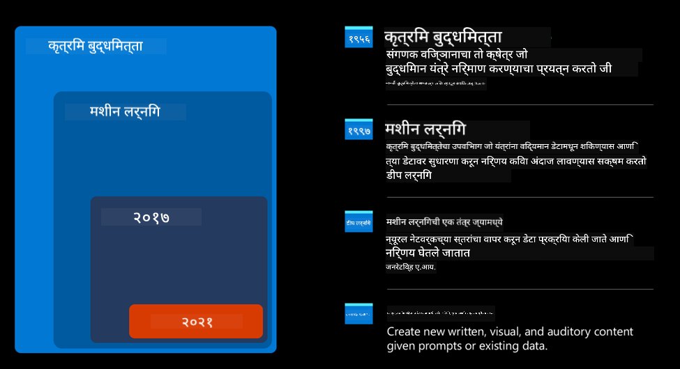
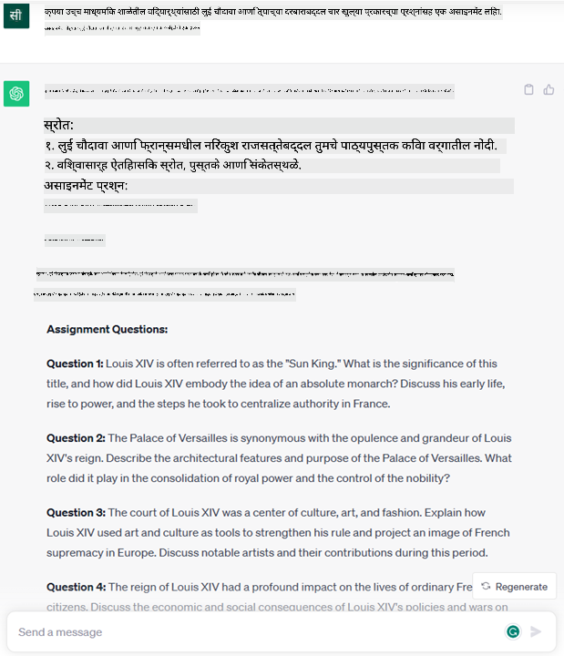
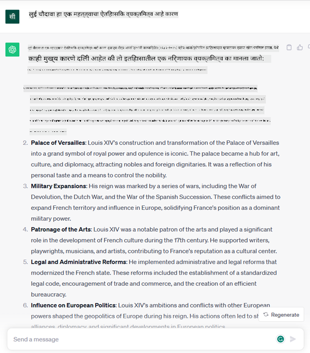

<!--
CO_OP_TRANSLATOR_METADATA:
{
  "original_hash": "f53ba0fa49164f9323043f1c6b11f2b1",
  "translation_date": "2025-07-09T07:48:02+00:00",
  "source_file": "01-introduction-to-genai/README.md",
  "language_code": "mr"
}
-->
# जनरेटिव AI आणि मोठ्या भाषा मॉडेल्सची ओळख

_(या धड्याचा व्हिडिओ पाहण्यासाठी वरील प्रतिमा क्लिक करा)_

जनरेटिव AI म्हणजे असा कृत्रिम बुद्धिमत्ता प्रकार जो मजकूर, प्रतिमा आणि इतर प्रकारची सामग्री तयार करू शकतो. हे तंत्रज्ञान खास कारण म्हणजे ते AI सर्वांसाठी सुलभ करते, कोणत्याही व्यक्तीला फक्त एक साधा मजकूर किंवा नैसर्गिक भाषेत लिहिलेला वाक्य वापरून AI वापरता येतो. Java किंवा SQL सारख्या भाषांमध्ये पारंगत होण्याची गरज नाही, फक्त तुमची भाषा वापरा, तुम्हाला काय हवे ते सांगा आणि AI मॉडेलकडून सुचवलेले उत्तर मिळवा. याचे उपयोग आणि परिणाम फार मोठे आहेत, तुम्ही अहवाल लिहू शकता, समजू शकता, अर्ज लिहू शकता आणि बरेच काही, तेही काही सेकंदांत.

या अभ्यासक्रमात, आपण पाहणार आहोत की आमचे स्टार्टअप जनरेटिव AI कसा वापरतो शिक्षण क्षेत्रात नवीन संधी उघडण्यासाठी आणि त्याच्या सामाजिक परिणामांशी संबंधित आव्हाने आणि तंत्रज्ञानाच्या मर्यादा कशा हाताळतो.

## परिचय

हा धडा खालील गोष्टींचा आढावा घेईल:

- व्यवसायाच्या परिस्थितीची ओळख: आमच्या स्टार्टअपची कल्पना आणि उद्दिष्ट.
- जनरेटिव AI आणि सध्याच्या तंत्रज्ञानाच्या पार्श्वभूमीवर आपली पोहोच.
- मोठ्या भाषा मॉडेलच्या अंतर्गत कार्यपद्धती.
- मोठ्या भाषा मॉडेल्सच्या मुख्य क्षमता आणि व्यावहारिक वापर.

## शिकण्याचे उद्दिष्ट

हा धडा पूर्ण केल्यावर तुम्हाला समजेल:

- जनरेटिव AI म्हणजे काय आणि मोठ्या भाषा मॉडेल्स कसे कार्य करतात.
- विविध वापरासाठी मोठ्या भाषा मॉडेल्स कसे वापरता येतात, विशेषतः शिक्षण क्षेत्रात.

## परिस्थिती: आमचे शैक्षणिक स्टार्टअप

जनरेटिव कृत्रिम बुद्धिमत्ता (AI) ही AI तंत्रज्ञानाची सर्वोच्च पातळी आहे, जी पूर्वी अशक्य वाटणाऱ्या गोष्टी शक्य करते. जनरेटिव AI मॉडेल्सकडे अनेक क्षमता आणि उपयोग आहेत, पण या अभ्यासक्रमात आपण पाहणार आहोत की हे शिक्षण क्षेत्रात कसे क्रांतिकारी बदल घडवत आहे, एका काल्पनिक स्टार्टअपच्या माध्यमातून. आपण या स्टार्टअपला _आमचे स्टार्टअप_ म्हणू. आमचे स्टार्टअप शिक्षण क्षेत्रात काम करते आणि त्याचे ध्येय आहे

> _शिक्षणात जागतिक स्तरावर प्रवेश सुलभ करणे, सर्वांसाठी समान शिक्षणाची संधी देणे आणि प्रत्येक शिकणाऱ्याच्या गरजेनुसार वैयक्तिकृत शिक्षण अनुभव प्रदान करणे._

आमच्या स्टार्टअप टीमला माहीत आहे की हे ध्येय साध्य करण्यासाठी आधुनिक काळातील सर्वात शक्तिशाली साधनांपैकी एक – मोठे भाषा मॉडेल्स (LLMs) – वापरणे आवश्यक आहे.

जनरेटिव AI आजच्या शिक्षण आणि अध्यापनाच्या पद्धतीत क्रांती घडवून आणण्याची अपेक्षा आहे, जिथे विद्यार्थ्यांकडे २४ तास वर्चुअल शिक्षक उपलब्ध असतील जे प्रचंड माहिती आणि उदाहरणे देतील, आणि शिक्षक नविन साधने वापरून विद्यार्थ्यांचे मूल्यमापन आणि अभिप्राय देऊ शकतील.

सुरुवातीला, आपण काही मूलभूत संकल्पना आणि शब्दावली परिभाषित करू ज्यांचा वापर आपण संपूर्ण अभ्यासक्रमात करणार आहोत.

## जनरेटिव AI कसा आला?

अलीकडील जनरेटिव AI मॉडेल्सच्या घोषणेमुळे निर्माण झालेल्या प्रचंड उत्साहाच्या पार्श्वभूमीवर, ही तंत्रज्ञान दशके जुनी आहे, ज्याचे पहिले संशोधन ६० च्या दशकात सुरू झाले होते. आज आपण अशा AI च्या टप्प्यावर आहोत ज्याला मानवी संज्ञानात्मक क्षमता आहेत, जसे की संभाषण, उदाहरणार्थ [OpenAI ChatGPT](https://openai.com/chatgpt) किंवा [Bing Chat](https://www.microsoft.com/edge/features/bing-chat?WT.mc_id=academic-105485-koreyst), जे Bing च्या वेब शोधासाठी GPT मॉडेल वापरते.

थोडक्यात, AI चे पहिले प्रोटोटाइप्स टाइप केलेले चॅटबॉट्स होते, जे तज्ञांच्या ज्ञानावर आधारित होते आणि संगणकात साठवलेले होते. या ज्ञानातले उत्तर कीवर्ड्सवर आधारित दिले जात होते. मात्र, लवकरच लक्षात आले की अशा प्रकारचा टाइप केलेला चॅटबॉट स्केल होऊ शकत नाही.

### AI साठी सांख्यिकी दृष्टिकोन: मशीन लर्निंग

९० च्या दशकात, मजकूर विश्लेषणासाठी सांख्यिकी दृष्टिकोन वापरला गेला. यामुळे नवीन अल्गोरिदम्स विकसित झाले – ज्याला मशीन लर्निंग म्हणतात – जे डेटा मधून नमुने शिकू शकतात, प्रोग्रामिंगशिवाय. या पद्धतीने मशीन मानवी भाषा समजून घेण्याचा प्रयत्न करतात: सांख्यिकी मॉडेल मजकूर-लेबल जोड्यांवर प्रशिक्षित होते, ज्यामुळे ते अनोळखी मजकूराला पूर्वनिर्धारित लेबल देऊ शकते.

### न्यूरल नेटवर्क्स आणि आधुनिक वर्चुअल सहाय्यक

अलीकडील काळात, हार्डवेअरच्या प्रगतीमुळे, ज्यामुळे मोठ्या प्रमाणात डेटा आणि जटिल गणना करता येतात, AI संशोधनाला चालना मिळाली आणि न्यूरल नेटवर्क्स किंवा डीप लर्निंग अल्गोरिदम्स विकसित झाले.

न्यूरल नेटवर्क्स (विशेषतः Recurrent Neural Networks – RNNs) ने नैसर्गिक भाषा प्रक्रिया सुधारली, ज्यामुळे शब्दाचा संदर्भ लक्षात घेऊन मजकूराचा अर्थ अधिक चांगल्या प्रकारे समजून घेता येतो.

ही तंत्रज्ञान नव्या शतकाच्या पहिल्या दशकात जन्मलेल्या वर्चुअल सहाय्यकांना चालना देणारी होती, जे मानवी भाषा समजून घेण्यात, गरज ओळखण्यात आणि ती पूर्ण करण्यात कुशल होते – जसे की पूर्वनिर्धारित स्क्रिप्टने उत्तर देणे किंवा तृतीय पक्ष सेवा वापरणे.

### आजचा काळ, जनरेटिव AI

अशा प्रकारे आपण आजच्या जनरेटिव AI पर्यंत पोहोचलो, जो डीप लर्निंगचा एक उपवर्ग मानला जातो.

AI क्षेत्रातील दशके संशोधनानंतर, एक नवीन मॉडेल आर्किटेक्चर – _Transformer_ – RNN च्या मर्यादा पार करून, खूप लांब मजकूराच्या अनुक्रमांना इनपुट म्हणून घेऊ शकतो. Transformers मध्ये अटेंशन मेकॅनिझम असतो, ज्यामुळे मॉडेलला इनपुटमधील सर्वात महत्त्वाच्या माहितीवर अधिक लक्ष केंद्रित करता येते, मजकूराच्या क्रमाकडे दुर्लक्ष करून.

अलीकडील जनरेटिव AI मॉडेल्स – ज्यांना मोठे भाषा मॉडेल्स (LLMs) म्हणतात, कारण ते मजकूरावर काम करतात – या आर्किटेक्चरवर आधारित आहेत. या मॉडेल्सना विविध स्रोतांमधून मोठ्या प्रमाणात लेबल नसलेला डेटा वापरून प्रशिक्षित केले जाते, जसे की पुस्तके, लेख आणि वेबसाइट्स. त्यामुळे ते विविध कामांसाठी अनुकूल करता येतात आणि व्याकरणदृष्ट्या बरोबर आणि सर्जनशीलतेचा अंश असलेला मजकूर तयार करू शकतात. त्यामुळे, त्यांनी मशीनला फक्त इनपुट समजून घेण्याची क्षमता वाढवली नाही, तर मानवी भाषेत मूळ प्रतिसाद तयार करण्याची क्षमता देखील दिली.

## मोठे भाषा मॉडेल्स कसे कार्य करतात?

पुढील अध्यायात आपण वेगवेगळ्या प्रकारच्या जनरेटिव AI मॉडेल्सचा अभ्यास करू, पण सध्या आपण मोठ्या भाषा मॉडेल्स कसे कार्य करतात हे पाहू, विशेषतः OpenAI GPT (Generative Pre-trained Transformer) मॉडेल्सवर लक्ष केंद्रित करून.

- **Tokenizer, मजकूर ते संख्या**: मोठे भाषा मॉडेल्स मजकूर इनपुट म्हणून घेतात आणि मजकूर आउटपुट म्हणून तयार करतात. मात्र, सांख्यिकी मॉडेल्स असल्यामुळे, त्यांना मजकूरापेक्षा संख्या अधिक सोयीस्कर असतात. म्हणून प्रत्येक इनपुट टोकनायझरद्वारे प्रक्रिया केली जाते. टोकन म्हणजे मजकूराचा एक भाग – ज्यामध्ये अक्षरांची संख्या बदलू शकते, त्यामुळे टोकनायझरचा मुख्य काम इनपुटला टोकन्समध्ये विभागणे आहे. नंतर प्रत्येक टोकनला टोकन इंडेक्स दिला जातो, जो मूळ मजकूराचा पूर्णांक एन्कोडिंग असतो.

- **आउटपुट टोकन्सची भाकिते करणे**: n टोकन्स इनपुट म्हणून दिल्यास (ज्याची कमाल संख्या मॉडेलनुसार वेगळी असू शकते), मॉडेल एक टोकन आउटपुट म्हणून भाकित करू शकते. हा टोकन पुढील पुनरावृत्तीत इनपुटमध्ये समाविष्ट केला जातो, ज्यामुळे वापरकर्त्याला एक किंवा अधिक वाक्ये उत्तर म्हणून मिळतात. म्हणूनच, जर तुम्ही ChatGPT वापरले असेल तर कधी कधी ते वाक्याच्या मध्यभागी थांबल्यासारखे वाटू शकते.

- **निवड प्रक्रिया, संभाव्यता वितरण**: आउटपुट टोकन मॉडेल त्याच्या संभाव्यतेनुसार निवडतो, जो सध्याच्या मजकूरानंतर येण्याची शक्यता दर्शवतो. मॉडेल सर्व संभाव्य ‘पुढील टोकन्स’ वर संभाव्यता वितरण भाकित करते. मात्र, नेहमीच सर्वाधिक संभाव्य टोकन निवडले जात नाही. निवडीत थोडीशी अनिश्चितता (randomness) असते, ज्यामुळे मॉडेल नॉन-डिटर्मिनिस्टिक वागते – म्हणजेच त्याच इनपुटसाठी नेहमीच एकसारखे आउटपुट मिळत नाही. ही अनिश्चितता सर्जनशील विचार प्रक्रियेचे अनुकरण करण्यासाठी असते आणि temperature नावाच्या मॉडेल पॅरामीटरने नियंत्रित केली जाऊ शकते.

## आमचे स्टार्टअप मोठ्या भाषा मॉडेल्सचा कसा वापर करू शकतो?

आता आपण मोठ्या भाषा मॉडेलच्या अंतर्गत कार्यपद्धती समजून घेतली आहे, तर पाहूया काही व्यावहारिक उदाहरणे ज्यात ते चांगले काम करतात, आमच्या व्यवसायाच्या परिस्थितीकडे लक्ष देऊन.

मोठ्या भाषा मॉडेलची मुख्य क्षमता म्हणजे _नैसर्गिक भाषेत लिहिलेल्या इनपुटपासून पूर्णपणे नवीन मजकूर तयार करणे_.

पण कोणत्या प्रकारचा इनपुट आणि आउटपुट?

मोठ्या भाषा मॉडेलचा इनपुट 'prompt' म्हणून ओळखला जातो, तर आउटपुट 'completion' म्हणतात, जो मॉडेलच्या पुढील टोकन तयार करण्याच्या यंत्रणेचा भाग आहे. आपण पुढे पाहणार आहोत की prompt म्हणजे काय आणि ते कसे डिझाइन करावे जेणेकरून मॉडेलचा जास्तीत जास्त उपयोग होईल. सध्या इतकंच समजा की prompt मध्ये खालील गोष्टी असू शकतात:

- एक **सूचना** जी मॉडेलकडून अपेक्षित आउटपुटचा प्रकार स्पष्ट करते. कधी कधी या सूचनेत काही उदाहरणे किंवा अतिरिक्त डेटा असू शकतो.

  1. लेख, पुस्तक, उत्पादन पुनरावलोकन यांचे सारांश तयार करणे, तसेच असंरचित डेटामधून अंतर्दृष्टी काढणे.
    
    
  
  2. लेख, निबंध, असाइनमेंट किंवा इतर सर्जनशील कल्पना आणि रचना तयार करणे.
      
     

- एक **प्रश्न**, जो एजंटशी संभाषणाच्या स्वरूपात विचारला जातो.
  
  

- पूर्ण करण्यासाठी एक **मजकूराचा तुकडा**, जो अप्रत्यक्षपणे लेखन सहाय्य मागतो.
  
  

- **कोडचा तुकडा** ज्यास समजावून सांगणे, दस्तऐवजीकरण करणे किंवा विशिष्ट कार्य करणारा कोड तयार करण्याची विनंती असते.
  
  

वरील उदाहरणे सोपी आहेत आणि मोठ्या भाषा मॉडेल्सच्या क्षमतांचे संपूर्ण प्रदर्शन नाहीत. ती जनरेटिव AI चा उपयोग, विशेषतः शिक्षण क्षेत्रात, कसा होऊ शकतो हे दाखवण्यासाठी आहेत.

तसेच, जनरेटिव AI चे आउटपुट नेहमीच परिपूर्ण नसते आणि कधी कधी मॉडेलची सर्जनशीलता त्याच्या विरोधात काम करू शकते, ज्यामुळे मानवी वापरकर्त्याला ते वास्तवाचा भ्रम वाटू शकते किंवा ते अपमानजनक असू शकते. जनरेटिव AI बुद्धिमान नाही – किमान व्यापक अर्थाने, ज्यात तर्कशक्ती, सर्जनशील विचार किंवा भावनिक बुद्धिमत्ता समाविष्ट आहे; ते निश्चित नाही आणि विश्वासार्ह नाही, कारण चुकीच्या संदर्भांसह, चुकीच्या माहिती आणि विधानांसह योग्य माहिती एकत्र सादर केली जाऊ शकते, आणि तेही आत्मविश्वासाने. पुढील धड्यांमध्ये आपण या सर्व मर्यादांवर चर्चा करू आणि त्यांना कसे कमी करायचे ते पाहू.

## असाइनमेंट

तुमचे असाइनमेंट आहे की [generative AI](https://en.wikipedia.org/wiki/Generative_artificial_intelligence?WT.mc_id=academic-105485-koreyst) बद्दल अधिक वाचा आणि असा एक क्षेत्र शोधा जिथे आज जनरेटिव AI नाही पण तुम्ही ते जोडू शकता. "जुन्या पद्धतीपेक्षा" त्याचा परिणाम कसा वेगळा असेल? तुम्ही काही असे करू शकता जे आधी शक्य नव्हते का? किंवा तुम्ही जलद आहात का? तुमच्या स्वप्नातील AI स्टार्टअप कसा दिसेल यावर ३०० शब्दांचा सारांश लिहा आणि "समस्या", "मी AI कसा वापरेल", "परिणाम" अशा शीर्षकांचा समावेश करा, तसेच इच्छेनुसार व्यवसाय योजना देखील लिहा.

जर तुम्ही हे काम केले असेल, तर तुम्ही Microsoft च्या इनक्युबेटरमध्ये अर्ज करण्यास तयार असाल, [Microsoft for Startups Founders Hub](https://www.microsoft.com/startups?WT.mc_id=academic-105485-koreyst) येथे आम्ही Azure, OpenAI, मार्गदर्शन आणि बरेच काहीसाठी क्रेडिट्स देतो, नक्की तपासा!

## ज्ञान तपासणी

मोठ्या भाषा मॉडेल्सबद्दल खालीलपैकी काय खरे आहे?

1. तुम्हाला प्रत्येक वेळी अगदी सारखेच उत्तर मिळते.
1. ते परिपूर्णपणे काम करतात, संख्या जोडण्यात, कार्यरत कोड तयार करण्यात उत्कृष्ट आहेत.
1. एकाच prompt वापरूनही उत्तर वेगळे असू शकते. ते तुम्हाला एखाद्या गोष्टीचा पहिला मसुदा देण्यातही चांगले आहेत, मग तो मजकूर असो किंवा कोड. पण तुम्हाला निकाल सुधारावे लागतात.

उत्तर: 3, LLM हे नॉन-डिटर्मिनिस्टिक आहे, उत्तर वेगळे असते, पण तुम्ही temperature सेटिंगद्वारे त्याचा फरक नियंत्रित करू शकता. तुम्ही त्याच्याकडून परिपूर्ण काम अपेक्षित करू नये, ते तुमच्यासाठी प्राथमिक प्रयत्न करतात ज्याला तुम्हाला हळूहळू सुधारावे लागते.

## छान काम! प्रवास सुरू ठेवा

हा धडा पूर्ण केल्यावर, आमच्या [Generative AI Learning collection](https://aka.ms/genai-collection?WT.mc_id=academic-105485-koreyst) मध्ये जाऊन तुमचे जनरेटिव AI ज्ञान अधिक वाढवा!
Lesson 2 कडे चला जिथे आपण [वेगवेगळ्या LLM प्रकारांचा शोध घेणे आणि तुलना करणे](../02-exploring-and-comparing-different-llms/README.md?WT.mc_id=academic-105485-koreyst) कसे करायचे ते पाहणार आहोत!

**अस्वीकरण**:  
हा दस्तऐवज AI अनुवाद सेवा [Co-op Translator](https://github.com/Azure/co-op-translator) वापरून अनुवादित केला आहे. आम्ही अचूकतेसाठी प्रयत्नशील असलो तरी, कृपया लक्षात घ्या की स्वयंचलित अनुवादांमध्ये चुका किंवा अचूकतेची कमतरता असू शकते. मूळ दस्तऐवज त्याच्या स्थानिक भाषेत अधिकृत स्रोत मानला जावा. महत्त्वाच्या माहितीसाठी व्यावसायिक मानवी अनुवाद करण्याची शिफारस केली जाते. या अनुवादाच्या वापरामुळे उद्भवलेल्या कोणत्याही गैरसमजुती किंवा चुकीच्या अर्थलागी आम्ही जबाबदार नाही.