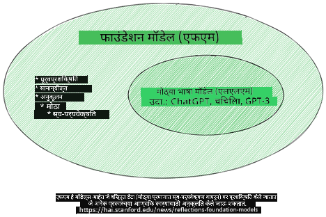
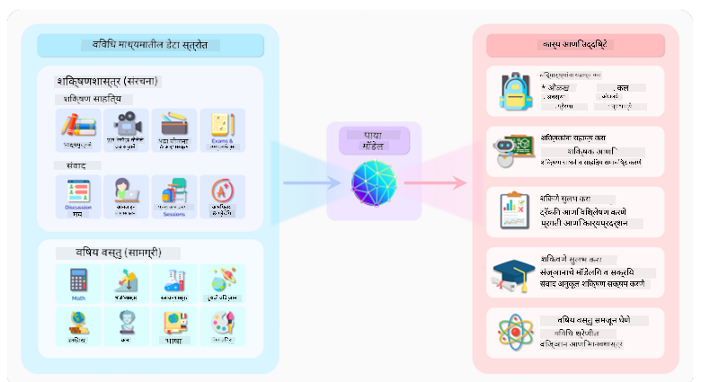
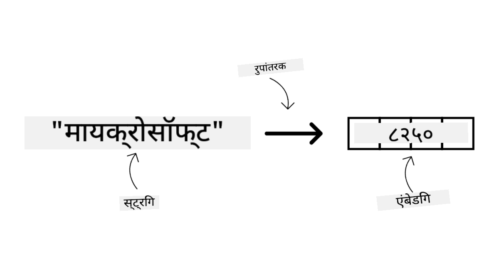
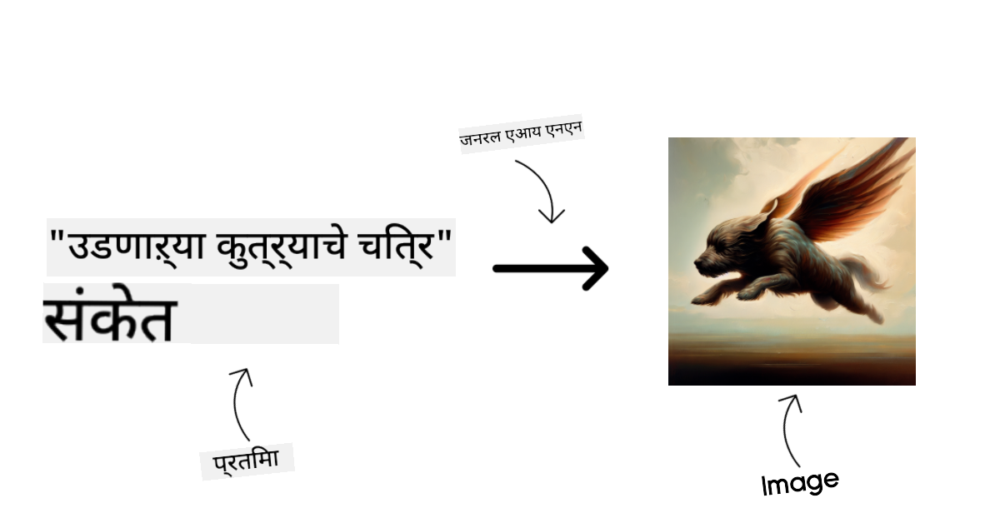
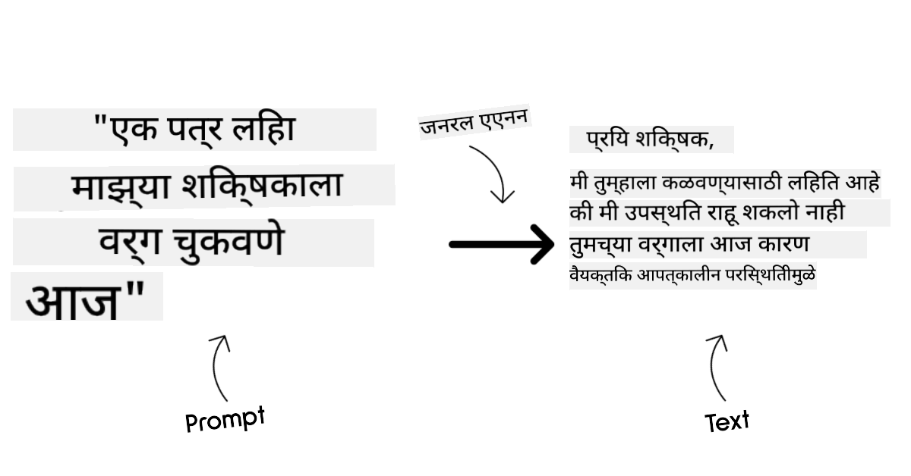
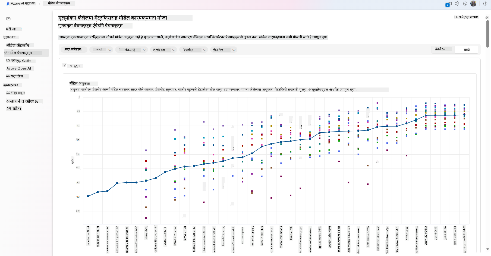
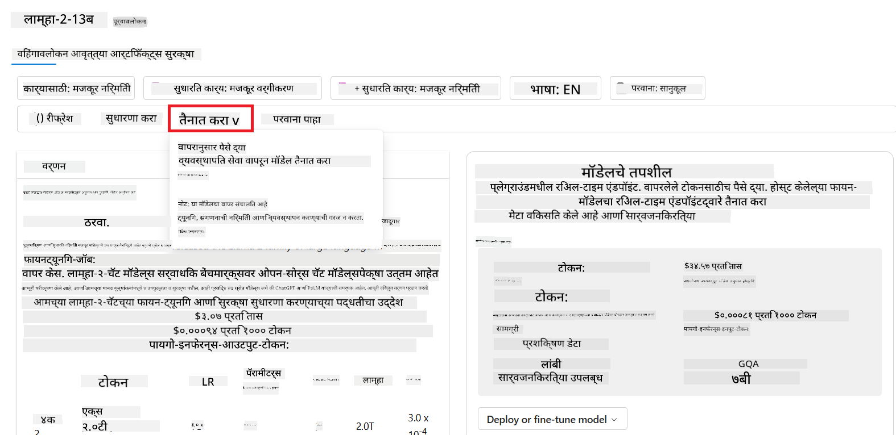

<!--
CO_OP_TRANSLATOR_METADATA:
{
  "original_hash": "e2f686f2eb794941761252ac5e8e090b",
  "translation_date": "2025-05-19T13:51:29+00:00",
  "source_file": "02-exploring-and-comparing-different-llms/README.md",
  "language_code": "mr"
}
-->
# विविध LLMs चा अभ्यास आणि तुलना

> _ही धडा पाहण्यासाठी वरील प्रतिमेवर क्लिक करा_

मागील धड्यात, आम्ही पाहिले की जनरेटिव्ह AI तंत्रज्ञानाच्या क्षेत्रात कसा बदल घडवत आहे, मोठे भाषा मॉडेल्स (LLMs) कसे कार्य करतात आणि आमच्या स्टार्टअपसारख्या व्यवसायांना त्यांच्या उपयोग प्रकरणांमध्ये त्यांचा वापर करून कसे वाढवता येईल! या अध्यायात, आम्ही विविध प्रकारच्या मोठ्या भाषा मॉडेल्सची तुलना करून त्यांचे फायदे आणि तोटे समजून घेणार आहोत.

आमच्या स्टार्टअपच्या प्रवासातील पुढील पाऊल म्हणजे सध्याच्या LLMs च्या क्षेत्राचा अभ्यास करणे आणि कोणते आमच्या उपयोग प्रकरणासाठी योग्य आहेत हे समजून घेणे.

## परिचय

हा धडा कव्हर करेल:

- सध्याच्या क्षेत्रातील विविध प्रकारचे LLMs.
- Azure मध्ये आपल्या उपयोग प्रकरणासाठी विविध मॉडेल्सची चाचणी करणे, पुनरावृत्ती करणे आणि तुलना करणे.
- LLM कसे तैनात करावे.

## शिकण्याची उद्दिष्टे

हा धडा पूर्ण केल्यानंतर, आपण सक्षम असाल:

- आपल्या उपयोग प्रकरणासाठी योग्य मॉडेल निवडणे.
- आपल्या मॉडेलची कार्यक्षमता कशी चाचणी करावी, पुनरावृत्ती करावी आणि सुधारावी हे समजून घेणे.
- व्यवसाय मॉडेल्स कसे तैनात करतात हे जाणून घेणे.

## विविध प्रकारचे LLMs समजून घ्या

LLMs त्यांच्या आर्किटेक्चर, प्रशिक्षण डेटा आणि उपयोग प्रकरणानुसार अनेक श्रेणींमध्ये असू शकतात. या फरकांचे आकलन करणे आमच्या स्टार्टअपला योग्य मॉडेल निवडण्यासाठी आणि कार्यक्षमता सुधारण्यासाठी उपयुक्त ठरेल.

LLM मॉडेल्सचे अनेक प्रकार आहेत, आपला मॉडेल निवड आपल्या उद्दिष्टांवर, डेटावर, किती खर्च करायला तयार आहात आणि इतर गोष्टींवर अवलंबून असतो.

आपण मॉडेल्सचा वापर मजकूर, ऑडिओ, व्हिडिओ, प्रतिमा निर्मितीसाठी करण्याचे उद्दिष्ट ठेवत असल्यास, आपल्याला वेगळ्या प्रकारचे मॉडेल निवडावे लागेल.

- **ऑडिओ आणि स्पीच ओळख**. या उद्देशासाठी, व्हिस्पर-प्रकारचे मॉडेल्स एक उत्तम निवड आहेत कारण ते सामान्य उद्देशासाठी आहेत आणि स्पीच ओळखीसाठी उद्दिष्ट आहेत. हे विविध ऑडिओवर प्रशिक्षण घेतलेले आहे आणि बहुभाषिक स्पीच ओळख करू शकते. [Whisper प्रकारच्या मॉडेल्स बद्दल अधिक जाणून घ्या](https://platform.openai.com/docs/models/whisper?WT.mc_id=academic-105485-koreyst).

- **प्रतिमा निर्मिती**. प्रतिमा निर्मितीसाठी, DALL-E आणि Midjourney हे दोन अत्यंत प्रसिद्ध पर्याय आहेत. DALL-E हे Azure OpenAI द्वारे ऑफर केले जाते. [DALL-E बद्दल अधिक वाचा](https://platform.openai.com/docs/models/dall-e?WT.mc_id=academic-105485-koreyst) आणि या अभ्यासक्रमाच्या 9 व्या अध्यायात देखील.

- **मजकूर निर्मिती**. बहुतेक मॉडेल्स मजकूर निर्मितीवर प्रशिक्षण घेतलेले आहेत आणि आपल्याला GPT-3.5 पासून GPT-4 पर्यंत विविध पर्याय आहेत. ते वेगवेगळ्या खर्चात येतात, GPT-4 सर्वात महाग आहे. [Azure OpenAI playground](https://oai.azure.com/portal/playground?WT.mc_id=academic-105485-koreyst) मध्ये जाऊन कोणते मॉडेल्स आपल्या गरजांनुसार सर्वाधिक योग्य आहेत ते मूल्यांकन करणे उपयुक्त आहे.

- **मल्टी-मोडॅलिटी**. आपण इनपुट आणि आउटपुटमध्ये विविध प्रकारच्या डेटाचे हाताळण करण्याचा विचार करत असल्यास, [gpt-4 turbo with vision किंवा gpt-4o](https://learn.microsoft.com/azure/ai-services/openai/concepts/models#gpt-4-and-gpt-4-turbo-models?WT.mc_id=academic-105485-koreyst) सारख्या मॉडेल्सकडे पाहणे उपयुक्त आहे - OpenAI मॉडेल्सच्या नवीनतम आवृत्त्या - ज्या नैसर्गिक भाषा प्रक्रियेस व्हिज्युअल समजुतीशी जोडण्यास सक्षम आहेत, मल्टी-मोडल इंटरफेसद्वारे संवाद साधण्यास सक्षम आहेत.

मॉडेल निवडणे म्हणजे तुम्हाला काही मूलभूत क्षमता मिळतात, परंतु त्या पुरेशा नसतील. अनेकदा तुम्हाला कंपनी-विशिष्ट डेटा असतो जो तुम्हाला कसेही करून LLM ला सांगावा लागतो. त्या दृष्टिकोनातून काही वेगवेगळे पर्याय आहेत, त्याबद्दल पुढील विभागांमध्ये अधिक.

### फाउंडेशन मॉडेल्स वि. LLMs

फाउंडेशन मॉडेल ही संज्ञा [स्टॅनफोर्ड संशोधकांनी तयार केली](https://arxiv.org/abs/2108.07258?WT.mc_id=academic-105485-koreyst) आणि ती काही निकषांनुसार AI मॉडेल म्हणून परिभाषित केली आहे, जसे की:

- **त्यांचा प्रशिक्षण प्रक्रिया अनसुपरवाइज्ड किंवा स्वयं-प्रशिक्षणाने होते**, म्हणजे ते लेबल नसलेल्या मल्टी-मोडल डेटावर प्रशिक्षण घेतले जातात आणि त्यांच्या प्रशिक्षण प्रक्रियेसाठी मानवी अॅनोटेशन किंवा लेबलिंगची आवश्यकता नसते.
- **ते खूप मोठे मॉडेल्स आहेत**, अतिशय खोल न्यूरल नेटवर्क्सवर आधारित आहेत ज्यांचे प्रशिक्षण अब्जोपर्यंतचे पॅरामीटर्सवर होते.
- **ते सामान्यतः इतर मॉडेल्ससाठी 'फाउंडेशन' म्हणून सेवा देण्यासाठी उद्दिष्ट आहेत**, म्हणजे इतर मॉडेल्स त्यांच्या वर आधारित करून तयार केले जाऊ शकतात, जे फाइन-ट्यूनिंग करून केले जाऊ शकते.

प्रतिमा स्रोत: [Essential Guide to Foundation Models and Large Language Models | by Babar M Bhatti | Medium
](https://thebabar.medium.com/essential-guide-to-foundation-models-and-large-language-models-27dab58f7404)

या फरकाची अधिक स्पष्टता देण्यासाठी, ChatGPT चे उदाहरण घेऊ. ChatGPT चे पहिले आवृत्ती तयार करण्यासाठी, GPT-3.5 नावाचे मॉडेल फाउंडेशन मॉडेल म्हणून वापरले गेले. याचा अर्थ OpenAI ने काही चॅट-विशिष्ट डेटा वापरून GPT-3.5 चे एक ट्यून केलेले आवृत्ती तयार केले जे चॅटबॉट्स सारख्या संवादात्मक परिस्थितीत चांगले कार्य करण्यासाठी विशेष होते.

प्रतिमा स्रोत: [2108.07258.pdf (arxiv.org)](https://arxiv.org/pdf/2108.07258.pdf?WT.mc_id=academic-105485-koreyst)

### ओपन सोर्स वि. मालकीचे मॉडेल्स

LLMs चे आणखी एक वर्गीकरण म्हणजे ते ओपन सोर्स आहेत की मालकीचे.

ओपन सोर्स मॉडेल्स ही मॉडेल्स आहेत जी सार्वजनिकपणे उपलब्ध आहेत आणि कोणत्याही व्यक्तीने वापरू शकतात. त्या सामान्यतः त्या कंपनीद्वारे उपलब्ध केल्या जातात ज्यांनी त्या तयार केल्या आहेत, किंवा संशोधन समुदायाद्वारे. या मॉडेल्सना निरीक्षण, सुधारणा आणि विविध उपयोग प्रकरणांसाठी सानुकूलित करण्याची परवानगी आहे. तथापि, त्या नेहमी उत्पादनासाठी अनुकूलित नसतात आणि कदाचित मालकीच्या मॉडेल्सइतकी कार्यक्षम नसतील. शिवाय, ओपन सोर्स मॉडेल्ससाठी निधी मर्यादित असू शकतो आणि ते दीर्घकालीन राखले जाऊ शकत नाहीत किंवा नवीनतम संशोधनासह अद्यतनित केले जाऊ शकत नाहीत. लोकप्रिय ओपन सोर्स मॉडेल्सची उदाहरणे म्हणजे [Alpaca](https://crfm.stanford.edu/2023/03/13/alpaca.html?WT.mc_id=academic-105485-koreyst), [Bloom](https://huggingface.co/bigscience/bloom) आणि [LLaMA](https://llama.meta.com).

मालकीचे मॉडेल्स ही मॉडेल्स आहेत जी कंपनीच्या मालकीच्या आहेत आणि सार्वजनिकपणे उपलब्ध नाहीत. हे मॉडेल्स उत्पादनासाठी अनुकूलित केलेले आहेत. तथापि, ते निरीक्षण, सुधारणा किंवा विविध उपयोग प्रकरणांसाठी सानुकूलित करण्याची परवानगी देत नाहीत. शिवाय, ते नेहमी विनामूल्य उपलब्ध नसतात आणि त्यांचा वापर करण्यासाठी सदस्यता किंवा पेमेंट आवश्यक असू शकते. युजर्सना मॉडेलच्या प्रशिक्षणासाठी वापरलेल्या डेटावर नियंत्रण नसते, ज्याचा अर्थ ते मॉडेल मालकावर डेटा गोपनीयता आणि AI च्या जबाबदार वापरासाठी विश्वास ठेवायला हवा. लोकप्रिय मालकीच्या मॉडेल्सची उदाहरणे म्हणजे [OpenAI models](https://platform.openai.com/docs/models/overview?WT.mc_id=academic-105485-koreyst), [Google Bard](https://sapling.ai/llm/bard?WT.mc_id=academic-105485-koreyst) किंवा [Claude 2](https://www.anthropic.com/index/claude-2?WT.mc_id=academic-105485-koreyst).

### एम्बेडिंग वि. प्रतिमा निर्मिती वि. मजकूर आणि कोड निर्मिती

LLMs चे वर्गीकरण त्यांच्या निर्माण करणाऱ्या आउटपुटनुसारही केले जाऊ शकते.

एम्बेडिंग्ज ही मॉडेल्सची एक सेट आहे जी मजकूराला संख्यात्मक स्वरूपात, ज्याला एम्बेडिंग म्हणतात, रूपांतरित करू शकते, जे इनपुट मजकूराचे संख्यात्मक प्रतिनिधित्व आहे. एम्बेडिंग्ज मशीनसाठी शब्द किंवा वाक्यांमधील संबंध समजणे सोपे करतात आणि त्यांचा वापर इतर मॉडेल्सद्वारे केला जाऊ शकतो, जसे की वर्गीकरण मॉडेल्स किंवा क्लस्टरिंग मॉडेल्स ज्यांची संख्यात्मक डेटावर चांगली कार्यक्षमता असते. एम्बेडिंग मॉडेल्स सामान्यतः ट्रान्सफर लर्निंगसाठी वापरली जातात, जिथे एका प्रतिनिधी कामासाठी एक मॉडेल तयार केले जाते ज्यासाठी भरपूर डेटा उपलब्ध असतो, आणि नंतर मॉडेलचे वजन (एम्बेडिंग्ज) इतर डाउनस्ट्रीम कार्यांसाठी पुन्हा वापरले जाते. या श्रेणीचे एक उदाहरण म्हणजे [OpenAI embeddings](https://platform.openai.com/docs/models/embeddings?WT.mc_id=academic-105485-koreyst).

प्रतिमा निर्मिती मॉडेल्स ही मॉडेल्स आहेत जी प्रतिमा निर्माण करतात. या मॉडेल्सचा वापर प्रतिमा संपादन, प्रतिमा संश्लेषण आणि प्रतिमा भाषांतरासाठी केला जातो. प्रतिमा निर्मिती मॉडेल्स सामान्यतः प्रतिमांच्या मोठ्या डेटासेट्सवर प्रशिक्षण घेतले जातात, जसे की [LAION-5B](https://laion.ai/blog/laion-5b/?WT.mc_id=academic-105485-koreyst), आणि नवीन प्रतिमा निर्माण करण्यासाठी किंवा विद्यमान प्रतिमा संपादित करण्यासाठी वापरले जाऊ शकतात, इनपेंटिंग, सुपर-रेझोल्यूशन, आणि रंगीतकरण तंत्रांचा वापर करून. उदाहरणे म्हणजे [DALL-E-3](https://openai.com/dall-e-3?WT.mc_id=academic-105485-koreyst) आणि [Stable Diffusion models](https://github.com/Stability-AI/StableDiffusion?WT.mc_id=academic-105485-koreyst).

मजकूर आणि कोड निर्मिती मॉडेल्स ही मॉडेल्स आहेत जी मजकूर किंवा कोड निर्माण करतात. या मॉडेल्सचा वापर मजकूर संक्षेपण, भाषांतर आणि प्रश्न उत्तर देण्यासाठी केला जातो. मजकूर निर्मिती मॉडेल्स सामान्यतः मजकूराच्या मोठ्या डेटासेट्सवर प्रशिक्षण घेतले जातात, जसे की [BookCorpus](https://www.cv-foundation.org/openaccess/content_iccv_2015/html/Zhu_Aligning_Books_and_ICCV_2015_paper.html?WT.mc_id=academic-105485-koreyst), आणि नवीन मजकूर निर्माण करण्यासाठी किंवा प्रश्नांची उत्तरे देण्यासाठी वापरले जाऊ शकतात. कोड निर्मिती मॉडेल्स, जसे की [CodeParrot](https://huggingface.co/codeparrot?WT.mc_id=academic-105485-koreyst), सामान्यतः कोडच्या मोठ्या डेटासेट्सवर प्रशिक्षण घेतले जातात, जसे की GitHub, आणि नवीन कोड निर्माण करण्यासाठी किंवा विद्यमान कोडमधील बग दुरुस्त करण्यासाठी वापरले जाऊ शकतात.

### एन्कोडर-डिकोडर वि. केवळ डिकोडर

LLMs च्या विविध आर्किटेक्चर्सबद्दल बोलण्यासाठी, एक उपमा वापरू.

कल्पना करा की तुमच्या व्यवस्थापकाने तुम्हाला विद्यार्थ्यांसाठी एक क्विझ तयार करण्याचे काम दिले आहे. तुमच्याकडे दोन सहकारी आहेत; एक सामग्री तयार करतो आणि दुसरा ती पुनरावलोकन करतो.

सामग्री तयार करणारा व्यक्ती म्हणजे केवळ डिकोडर मॉडेल सारखा आहे, तो विषय पाहू शकतो आणि तुम्ही आधीच काय लिहिले आहे ते पाहू शकतो आणि त्यानुसार एक कोर्स लिहू शकतो. ते आकर्षक आणि माहितीपूर्ण सामग्री लिहिण्यात खूप चांगले आहेत, परंतु विषय आणि शिकण्याच्या उद्दिष्टांवर समजण्यात फारसे चांगले नाहीत. डिकोडर मॉडेल्सची काही उदाहरणे म्हणजे GPT परिवार मॉडेल्स, जसे की GPT-3.

पुनरावलोकन करणारा व्यक्ती म्हणजे केवळ एन्कोडर मॉडेल सारखा आहे, तो लिहिलेला कोर्स आणि उत्तरे पाहतो, त्यांच्यातील संबंध ओळखतो आणि संदर्भ समजतो, परंतु सामग्री निर्माण करण्यात चांगला नाही. केवळ एन्कोडर मॉडेलचे एक उदाहरण म्हणजे BERT.

कल्पना करा की आमच्याकडे असा एखादा व्यक्ती आहे जो क्विझ तयार आणि पुनरावलोकन करू शकतो, हा एन्कोडर-डिकोडर मॉडेल आहे. काही उदाहरणे म्हणजे BART आणि T5.

### सेवा वि. मॉडेल

आता, सेवा आणि मॉडेलमधील फरकाबद्दल बोलू. सेवा म्हणजे क्लाउड सेवा प्रदात्याद्वारे ऑफर केलेले उत्पादन, आणि हे सहसा मॉडेल्स, डेटा आणि इतर घटकांचा एकत्रितपणे संयोजन असते. मॉडेल हे सेवांचे मुख्य घटक आहे, आणि हे सहसा फाउंडेशन मॉडेल असते, जसे की LLM.

सेवा सहसा उत्पादनासाठी अनुकूलित असतात आणि सहसा मॉडेल्सपेक्षा वापरण्यास सोप्या असतात, ग्राफिकल यूजर इंटरफेसद्वारे. तथापि, सेवा नेहमी विनामूल्य उपलब्ध नसतात, आणि त्यांचा वापर करण्यासाठी सदस्यता किंवा पेमेंट आवश्यक असू शकते, सेवा मालकाच्या उपकरणे आणि संसाधनांचा लाभ घेण्यासाठी, खर्च अनुकूलित करण्यासाठी आणि सहज स्केल करण्यासाठी. सेवांचे एक उदाहरण म्हणजे [Azure OpenAI Service](https://learn.microsoft.com/azure/ai-services/openai/overview?WT.mc_id=academic-105485-koreyst), जे वापरानुसार पैसे देण्याचा दर योजना ऑफर करते, म्हणजे वापरकर्त्यांना ते सेवा किती वापरतात त्यानुसार चार्ज केले जाते. तसेच, Azure OpenAI Service एंटरप्राइझ-ग्रेड सुरक्षा आणि मॉडेल्सच्या क्षमतांवर जबाबदार AI फ्रेमवर्क ऑफर करते.

मॉडेल्स हे फक्त न्यूरल नेटवर्क आहेत, ज्यात पॅरामीटर्स, वजन आणि इतर गोष्टी आहेत. कंपन्यांना स्थानिकरित्या चालविण्याची परवानगी देतात, तथापि, त्यांना उपकरणे खरेदी करावी लागतील, स्केल करण्यासाठी एक संरचना तयार करावी लागेल आणि एक परवाना खरेदी करावा लागेल किंवा एक ओपन सोर्स मॉडेल वापरावे लागेल. LLaMA सारखे मॉडेल उपलब्ध आहे, ज्याचा वापर करण्यासाठी संगणकीय शक्ती आवश्यक आहे.

## Azure वर कार्यक्षमता समजण्यासाठी विविध मॉडेल्सची चाचणी आणि पुनरावृत्ती कशी करावी

आमचा संघ सध्याच्या LLMs क्षेत्राचा अभ्यास करून त्यांच्या परिस्थितीसाठी काही चांगले उमेदवार ओळखल्यानंतर, पुढील पाऊल म्हणजे त्यांच्या डेटावर आणि त्यांच्या वर्कलोडवर त्यांची चाचणी करणे. हे एक पुनरावृत्तीशील प्रक्रिया आहे, जी प्रयोग आणि मोजमापाद्वारे केली जाते.
आपण मागील परिच्छेदांमध्ये उल्लेख केलेले बहुतेक मॉडेल्स (OpenAI मॉडेल्स, Llama2 सारखी ओपन सोर्स मॉडेल्स, आणि Hugging Face transformers) [मॉडेल कॅटलॉग](https://learn
- उद्योगात उपलब्ध असलेल्या मॉडेल्स आणि डेटासेट्सच्या तुलनेत बेंचमार्क्सची तुलना करून कोणते व्यवसाय परिदृश्य पूर्ण करते ते [Model Benchmarks](https://learn.microsoft.com/azure/ai-studio/how-to/model-benchmarks?WT.mc_id=academic-105485-koreyst) पॅनलद्वारे मूल्यांकन करा.

- विशिष्ट कार्यभारामध्ये मॉडेल कार्यक्षमता सुधारण्यासाठी कस्टम प्रशिक्षण डेटावर मॉडेल फाइन-ट्यून करा, Azure AI स्टुडिओच्या प्रयोग आणि ट्रॅकिंग क्षमतांचा लाभ घेत.

- मूळ पूर्व-प्रशिक्षित मॉडेल किंवा फाइन-ट्यून केलेले आवृत्ती रिमोट रिअल टाइम इनफरन्स - व्यवस्थापित संगणन - किंवा सर्व्हरलेस एपीआय एंडपॉइंट - [pay-as-you-go](https://learn.microsoft.com/azure/ai-studio/how-to/model-catalog-overview#model-deployment-managed-compute-and-serverless-api-pay-as-you-go?WT.mc_id=academic-105485-koreyst) - वर तैनात करा जेणेकरून अनुप्रयोग ते वापरू शकतील.

> [!NOTE]
> कॅटलॉगमधील सर्व मॉडेल्स सध्या फाइन-ट्यूनिंग आणि/किंवा pay-as-you-go तैनातीसाठी उपलब्ध नाहीत. मॉडेलच्या क्षमता आणि मर्यादांबद्दल तपशीलांसाठी मॉडेल कार्ड तपासा.

## LLM परिणाम सुधारित करणे

आम्ही आमच्या स्टार्टअप टीमसह विविध प्रकारच्या LLMs आणि क्लाउड प्लॅटफॉर्म (Azure Machine Learning) ची शोध घेतली आहे ज्यामुळे आम्हाला विविध मॉडेल्सची तुलना करण्याची, त्यांचे चाचणी डेटावर मूल्यांकन करण्याची, कार्यक्षमता सुधारण्याची आणि त्यांना इनफरन्स एंडपॉइंट्सवर तैनात करण्याची सुविधा मिळते.

पण तेव्हा त्यांना पूर्व-प्रशिक्षित मॉडेल वापरण्याऐवजी मॉडेल फाइन-ट्यूनिंगचा विचार करावा लागतो? विशिष्ट कार्यभारावर मॉडेल कार्यक्षमता सुधारण्यासाठी इतर काही पद्धती आहेत का?

LLM मधून आवश्यक परिणाम मिळवण्यासाठी व्यवसाय विविध पद्धती वापरू शकतो. उत्पादनामध्ये LLM तैनात करताना वेगवेगळ्या स्तरांच्या प्रशिक्षणासह विविध प्रकारची मॉडेल्स निवडू शकता, ज्यामध्ये वेगवेगळ्या स्तरांची जटिलता, खर्च आणि गुणवत्ता आहे. येथे काही विविध पद्धती आहेत:

- **कंटेक्स्टसह प्रॉम्प्ट इंजिनिअरिंग**. कल्पना अशी आहे की तुम्हाला आवश्यक प्रतिसाद मिळण्यासाठी तुम्ही प्रॉम्प्ट करताना पुरेसा कंटेक्स्ट प्रदान करावा.

- **Retrieval Augmented Generation, RAG**. तुमचा डेटा उदाहरणार्थ डेटाबेस किंवा वेब एंडपॉइंटमध्ये अस्तित्वात असू शकतो, या डेटाचा समावेश प्रॉम्प्ट करताना होईल याची खात्री करण्यासाठी, तुम्ही संबंधित डेटा मिळवू शकता आणि ते वापरकर्त्याच्या प्रॉम्प्टचा भाग बनवू शकता.

- **फाइन-ट्यून केलेले मॉडेल**. येथे, तुम्ही तुमच्या स्वतःच्या डेटावर मॉडेलचे अधिक प्रशिक्षण घेतले ज्यामुळे मॉडेल तुमच्या आवश्यकतांसाठी अधिक अचूक आणि प्रतिसादात्मक बनले परंतु कदाचित खर्चिक असू शकते.

Img source: [Four Ways that Enterprises Deploy LLMs | Fiddler AI Blog](https://www.fiddler.ai/blog/four-ways-that-enterprises-deploy-llms?WT.mc_id=academic-105485-koreyst)

### कंटेक्स्टसह प्रॉम्प्ट इंजिनिअरिंग

पूर्व-प्रशिक्षित LLMs सामान्यीकृत नैसर्गिक भाषा कार्यांवर खूप चांगले कार्य करतात, अगदी त्यांना एका छोट्या प्रॉम्प्टसह कॉल करून, पूर्ण करण्यासाठी एक वाक्य किंवा प्रश्न - तथाकथित "zero-shot" शिक्षण.

तथापि, वापरकर्ता जितके अधिक त्यांची चौकशी फ्रेम करू शकतो, तपशीलवार विनंती आणि उदाहरणांसह - कंटेक्स्ट - उत्तर अधिक अचूक आणि वापरकर्त्याच्या अपेक्षांनुसार जवळचे असेल. या प्रकरणात, जर प्रॉम्प्टमध्ये फक्त एक उदाहरण समाविष्ट असेल तर आम्ही "one-shot" शिक्षणाबद्दल बोलतो आणि जर त्यात एकाधिक उदाहरणे समाविष्ट असतील तर "few shot learning". कंटेक्स्टसह प्रॉम्प्ट इंजिनिअरिंग सुरू करण्यासाठी सर्वात खर्चिक प्रभावी पद्धत आहे.

### Retrieval Augmented Generation (RAG)

LLMs मध्ये मर्यादा आहे की ते उत्तर तयार करण्यासाठी त्यांच्या प्रशिक्षणादरम्यान वापरलेल्या डेटाचा वापर करू शकतात. याचा अर्थ असा आहे की ते त्यांच्या प्रशिक्षण प्रक्रियेनंतर घडलेल्या घटनांबद्दल काहीही जाणत नाहीत आणि ते नॉन-पब्लिक माहिती (जसे की कंपनी डेटा) प्रवेश करू शकत नाहीत.
हे RAG द्वारे ओलांडले जाऊ शकते, एक तंत्र जे प्रॉम्प्टला दस्तऐवजांच्या तुकड्यांच्या स्वरूपात बाह्य डेटासह वाढवते, प्रॉम्प्ट लांबी मर्यादा विचारात घेऊन. हे व्हेक्टर डेटाबेस साधनांद्वारे समर्थित आहे (जसे की [Azure Vector Search](https://learn.microsoft.com/azure/search/vector-search-overview?WT.mc_id=academic-105485-koreyst)) जे विविध पूर्व-परिभाषित डेटा स्रोतांमधून उपयुक्त तुकडे पुनर्प्राप्त करतात आणि त्यांना प्रॉम्प्ट कंटेक्स्टमध्ये जोडतात.

हे तंत्र खूप उपयुक्त आहे जेव्हा व्यवसायाकडे पुरेसा डेटा नसतो, पुरेसा वेळ नसतो किंवा LLM फाइन-ट्यून करण्यासाठी संसाधने नसतात, परंतु विशिष्ट कार्यभारावर कार्यक्षमता सुधारण्यासाठी आणि बनावटपणाचा धोका कमी करण्यासाठी, म्हणजेच वास्तविकतेची मिथ्यांकन किंवा हानिकारक सामग्री.

### फाइन-ट्यून केलेले मॉडेल

फाइन-ट्यूनिंग हा एक प्रक्रिया आहे जो ट्रान्सफर लर्निंगचा लाभ घेतो ज्यामुळे मॉडेल डाउनस्ट्रीम कार्यासाठी 'अॅडॅप्ट' होते किंवा विशिष्ट समस्या सोडवते. few-shot learning आणि RAG पेक्षा वेगळे, याचा परिणाम नवीन मॉडेल तयार करण्यात होतो, अद्यतनित वेट्स आणि बायससह. यासाठी एकल इनपुट (प्रॉम्प्ट) आणि त्याशी संबंधित आउटपुट (पूर्णता) असलेल्या प्रशिक्षण उदाहरणांचा संच आवश्यक आहे.
हे पसंतीची पद्धत असेल जर:

- **फाइन-ट्यून केलेली मॉडेल्स वापरणे**. व्यवसाय उच्च कार्यक्षमता मॉडेल्सऐवजी कमी सक्षम फाइन-ट्यून केलेली मॉडेल्स (जसे की एम्बेडिंग मॉडेल्स) वापरू इच्छित असेल, ज्यामुळे अधिक खर्चिक प्रभावी आणि जलद समाधान मिळते.

- **लेटन्सी विचारात घेणे**. विशिष्ट उपयोगाच्या बाबतीत लेटन्सी महत्त्वाचे आहे, त्यामुळे खूप लांब प्रॉम्प्ट्स वापरणे शक्य नाही किंवा मॉडेलने शिकले पाहिजे अशा उदाहरणांची संख्या प्रॉम्प्ट लांबी मर्यादेशी जुळत नाही.

- **अप टू डेट राहणे**. व्यवसायाकडे खूप उच्च-गुणवत्तेचा डेटा आणि ग्राउंड ट्रुथ लेबल्स आहेत आणि वेळोवेळी हा डेटा अद्ययावत ठेवण्यासाठी आवश्यक संसाधने आहेत.

### प्रशिक्षित मॉडेल

LLMला स्क्रॅचपासून प्रशिक्षण देणे हे निःसंशयपणे सर्वात कठीण आणि अवघड पद्धत आहे ज्यात मोठ्या प्रमाणात डेटा, कुशल संसाधने आणि योग्य संगणन शक्ती आवश्यक आहे. ही पर्याय फक्त त्या परिस्थितीत विचारात घेतली पाहिजे जिथे व्यवसायाकडे डोमेन-विशिष्ट उपयोग प्रकरण आणि मोठ्या प्रमाणात डोमेन-केंद्रित डेटा आहे.

## ज्ञान तपासणी

LLM पूर्णता परिणाम सुधारण्यासाठी चांगली पद्धत काय असू शकते?

1. कंटेक्स्टसह प्रॉम्प्ट इंजिनिअरिंग
1. RAG
1. फाइन-ट्यून केलेले मॉडेल

A:3, जर तुमच्याकडे वेळ आणि संसाधने आणि उच्च गुणवत्तेचा डेटा असेल, तर अद्ययावत राहण्यासाठी फाइन-ट्यूनिंग हा चांगला पर्याय आहे. तथापि, जर तुम्ही गोष्टी सुधारण्याचा विचार करत असाल आणि तुमच्याकडे वेळ कमी असेल तर RAG प्रथम विचारात घेण्यासारखे आहे.

## 🚀 आव्हान

तुमच्या व्यवसायासाठी [RAG कसा वापरायचा](https://learn.microsoft.com/azure/search/retrieval-augmented-generation-overview?WT.mc_id=academic-105485-koreyst) यावर अधिक वाचा.

## उत्तम काम, तुमचे शिक्षण सुरू ठेवा

हे धडा पूर्ण केल्यानंतर, आमच्या [Generative AI Learning collection](https://aka.ms/genai-collection?WT.mc_id=academic-105485-koreyst) वर जाणून घ्या जेणेकरून तुमचे जनरेटिव्ह AI ज्ञान वाढवू शकाल!

धडा 3 वर जा जिथे आम्ही पाहू की [Generative AI जबाबदारीने कसा तयार करायचा](../03-using-generative-ai-responsibly/README.md?WT.mc_id=academic-105485-koreyst)!

**अस्वीकरण**:  
हा दस्तऐवज AI अनुवाद सेवा [Co-op Translator](https://github.com/Azure/co-op-translator) वापरून अनुवादित करण्यात आला आहे. आम्ही अचूकतेसाठी प्रयत्नशील असलो तरी, कृपया लक्षात ठेवा की स्वयंचलित अनुवादांमध्ये त्रुटी किंवा अचूकतेचा अभाव असू शकतो. मूळ भाषेतील दस्तऐवज अधिकृत स्रोत म्हणून विचारात घेतला पाहिजे. महत्त्वपूर्ण माहितीसाठी, व्यावसायिक मानव अनुवादाची शिफारस केली जाते. या अनुवादाचा वापर करून उद्भवणाऱ्या कोणत्याही गैरसमज किंवा चुकीच्या अर्थ लावण्यास आम्ही जबाबदार नाही.