<!--
CO_OP_TRANSLATOR_METADATA:
{
  "original_hash": "6b7629b8ee4d7d874a27213e903d86a7",
  "translation_date": "2025-10-17T13:51:03+00:00",
  "source_file": "02-exploring-and-comparing-different-llms/README.md",
  "language_code": "mr"
}
-->
# विविध LLM शोधणे आणि तुलना करणे

[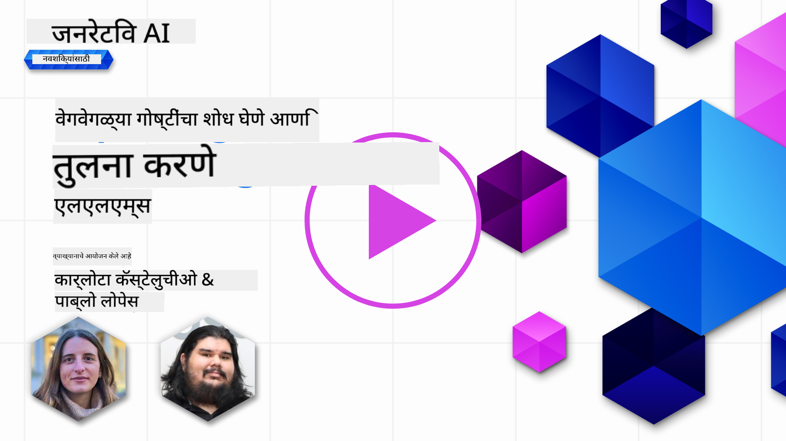](https://youtu.be/KIRUeDKscfI?si=8BHX1zvwzQBn-PlK)

> _वरील प्रतिमेवर क्लिक करा आणि या धड्याचा व्हिडिओ पहा_

मागील धड्यात आपण पाहिले की जनरेटिव्ह AI तंत्रज्ञानाच्या क्षेत्रात कसे बदल घडवत आहे, मोठ्या भाषा मॉडेल्स (LLMs) कसे कार्य करतात आणि व्यवसाय - जसे की आपला स्टार्टअप - त्यांना त्यांच्या उपयोगासाठी कसे लागू करू शकतो आणि वाढवू शकतो! या अध्यायात, आम्ही विविध प्रकारच्या मोठ्या भाषा मॉडेल्सची (LLMs) तुलना आणि विरोधाभास करून त्यांचे फायदे आणि तोटे समजून घेणार आहोत.

आमच्या स्टार्टअपच्या प्रवासातील पुढील टप्पा म्हणजे सध्याच्या LLMs च्या क्षेत्राचा अभ्यास करणे आणि आमच्या उपयोगासाठी योग्य मॉडेल्स समजून घेणे.

## परिचय

या धड्यात आपण शिकणार आहोत:

- सध्याच्या क्षेत्रातील विविध प्रकारचे LLMs.
- Azure मध्ये तुमच्या उपयोगासाठी विविध मॉडेल्सची चाचणी, पुनरावृत्ती आणि तुलना कशी करावी.
- LLM कसे तैनात करावे.

## शिकण्याची उद्दिष्टे

हा धडा पूर्ण केल्यानंतर, तुम्ही:

- तुमच्या उपयोगासाठी योग्य मॉडेल निवडू शकाल.
- तुमच्या मॉडेलची चाचणी, पुनरावृत्ती आणि कार्यक्षमता सुधारण्याची प्रक्रिया समजून घेऊ शकाल.
- व्यवसाय मॉडेल्स कसे तैनात करतात हे जाणून घ्याल.

## विविध प्रकारचे LLMs समजून घ्या

LLMs त्यांच्या आर्किटेक्चर, प्रशिक्षण डेटा आणि उपयोगाच्या आधारे अनेक प्रकारांमध्ये वर्गीकृत केले जाऊ शकतात. या फरकांमुळे आमच्या स्टार्टअपला योग्य परिस्थितीसाठी योग्य मॉडेल निवडण्यास मदत होईल आणि कार्यक्षमता सुधारण्यासाठी चाचणी, पुनरावृत्ती कशी करावी हे समजेल.

LLMs चे अनेक प्रकार आहेत, तुमच्या उद्दिष्टांनुसार, तुमच्या डेटानुसार, आणि तुम्ही किती खर्च करायला तयार आहात यावर आधारित मॉडेल निवडले जाते.

तुम्ही मॉडेल्सचा उपयोग मजकूर, ऑडिओ, व्हिडिओ, प्रतिमा निर्मिती इत्यादीसाठी करायचा असल्यास, तुम्ही वेगळ्या प्रकारचे मॉडेल निवडू शकता.

- **ऑडिओ आणि भाषण ओळख**. या उद्देशासाठी, Whisper प्रकारचे मॉडेल्स उत्कृष्ट पर्याय आहेत कारण ते सामान्य-उद्देशीय आहेत आणि भाषण ओळखीसाठी तयार केले आहेत. हे विविध ऑडिओवर प्रशिक्षित आहे आणि बहुभाषिक भाषण ओळख करू शकते. [Whisper प्रकारच्या मॉडेल्सबद्दल अधिक जाणून घ्या](https://platform.openai.com/docs/models/whisper?WT.mc_id=academic-105485-koreyst).

- **प्रतिमा निर्मिती**. प्रतिमा निर्मितीसाठी, DALL-E आणि Midjourney हे दोन अतिशय प्रसिद्ध पर्याय आहेत. DALL-E Azure OpenAI द्वारे ऑफर केले जाते. [DALL-E बद्दल अधिक वाचा](https://platform.openai.com/docs/models/dall-e?WT.mc_id=academic-105485-koreyst) आणि या अभ्यासक्रमाच्या अध्याय 9 मध्ये.

- **मजकूर निर्मिती**. बहुतेक मॉडेल्स मजकूर निर्मितीसाठी प्रशिक्षित आहेत आणि तुमच्याकडे GPT-3.5 ते GPT-4 पर्यंत अनेक पर्याय आहेत. त्यांची किंमत वेगवेगळी आहे, GPT-4 सर्वात महाग आहे. [Azure OpenAI playground](https://oai.azure.com/portal/playground?WT.mc_id=academic-105485-koreyst) मध्ये जाऊन तुमच्या गरजेनुसार क्षमता आणि खर्चाच्या दृष्टीने कोणते मॉडेल्स योग्य आहेत ते मूल्यांकन करणे योग्य ठरेल.

- **मल्टी-मोडॅलिटी**. जर तुम्ही इनपुट आणि आउटपुटमध्ये अनेक प्रकारच्या डेटाचा सामना करण्याचा विचार करत असाल, तर तुम्ही [gpt-4 turbo with vision किंवा gpt-4o](https://learn.microsoft.com/azure/ai-services/openai/concepts/models#gpt-4-and-gpt-4-turbo-models?WT.mc_id=academic-105485-koreyst) सारख्या मॉडेल्सचा विचार करू शकता - OpenAI मॉडेल्सची नवीनतम आवृत्ती - जी नैसर्गिक भाषा प्रक्रिया व्हिज्युअल समजून घेण्यास सक्षम आहे, मल्टी-मोडल इंटरफेसद्वारे संवाद सक्षम करते.

मॉडेल निवडणे म्हणजे तुम्हाला काही मूलभूत क्षमता मिळतात, परंतु कधीकधी ते पुरेसे नसते. अनेकदा तुमच्याकडे कंपनी-विशिष्ट डेटा असतो जो तुम्हाला काही प्रकारे LLM ला सांगण्याची गरज असते. त्यासाठी काही वेगवेगळे पर्याय आहेत, त्याबद्दल पुढील विभागांमध्ये अधिक माहिती आहे.

### फाउंडेशन मॉडेल्स विरुद्ध LLMs

फाउंडेशन मॉडेल हा शब्द [स्टॅनफोर्ड संशोधकांनी तयार केला](https://arxiv.org/abs/2108.07258?WT.mc_id=academic-105485-koreyst) आणि काही निकषांचे अनुसरण करणारे AI मॉडेल म्हणून परिभाषित केले:

- **ते अनसुपरव्हाइज्ड लर्निंग किंवा सेल्फ-सुपरव्हाइज्ड लर्निंग वापरून प्रशिक्षित केले जातात**, म्हणजे ते लेबल नसलेल्या मल्टी-मोडल डेटावर प्रशिक्षित केले जातात आणि त्यांच्या प्रशिक्षण प्रक्रियेसाठी मानवी अॅनोटेशन किंवा डेटाचे लेबलिंग आवश्यक नसते.
- **ते खूप मोठे मॉडेल्स आहेत**, अतिशय खोल न्यूरल नेटवर्कवर आधारित आहेत जे अब्जो पॅरामीटर्सवर प्रशिक्षित आहेत.
- **ते सामान्यतः इतर मॉडेल्ससाठी 'फाउंडेशन' म्हणून काम करण्यासाठी तयार केले जातात**, म्हणजे त्यांचा उपयोग इतर मॉडेल्स तयार करण्यासाठी सुरुवातीच्या बिंदू म्हणून केला जाऊ शकतो, जे फाइन-ट्यूनिंगद्वारे केले जाऊ शकते.

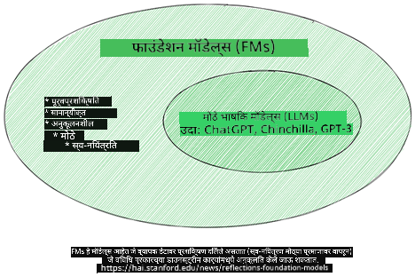

प्रतिमा स्रोत: [फाउंडेशन मॉडेल्स आणि मोठ्या भाषा मॉडेल्ससाठी आवश्यक मार्गदर्शक | बाबर एम भट्टी | Medium](https://thebabar.medium.com/essential-guide-to-foundation-models-and-large-language-models-27dab58f7404)

या फरकाला अधिक स्पष्ट करण्यासाठी, ChatGPT चा एक उदाहरण म्हणून विचार करूया. ChatGPT ची पहिली आवृत्ती तयार करण्यासाठी, GPT-3.5 नावाच्या मॉडेलने फाउंडेशन मॉडेल म्हणून काम केले. याचा अर्थ OpenAI ने काही चॅट-विशिष्ट डेटा वापरून GPT-3.5 ची एक ट्यून केलेली आवृत्ती तयार केली जी चॅटबॉट्ससारख्या संवादात्मक परिस्थितीत चांगली कामगिरी करण्यासाठी विशेषीकृत होती.

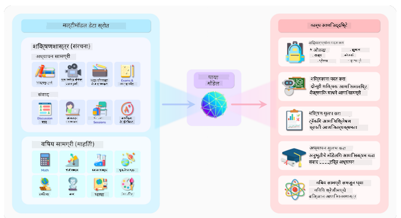

प्रतिमा स्रोत: [2108.07258.pdf (arxiv.org)](https://arxiv.org/pdf/2108.07258.pdf?WT.mc_id=academic-105485-koreyst)

### ओपन सोर्स विरुद्ध मालकीचे मॉडेल्स

LLMs चे आणखी एक वर्गीकरण म्हणजे ते ओपन सोर्स आहेत की मालकीचे.

ओपन-सोर्स मॉडेल्स ही मॉडेल्स आहेत जी सार्वजनिकपणे उपलब्ध आहेत आणि कोणालाही वापरता येतात. ती सामान्यतः ती तयार करणाऱ्या कंपनीने किंवा संशोधन समुदायाने उपलब्ध करून दिली जातात. ही मॉडेल्स तपासली जाऊ शकतात, सुधारित केली जाऊ शकतात आणि LLMs च्या विविध उपयोगांसाठी सानुकूलित केली जाऊ शकतात. तथापि, ती नेहमी उत्पादनासाठी अनुकूलित नसतात आणि मालकीच्या मॉडेल्सइतकी कार्यक्षम नसू शकतात. शिवाय, ओपन-सोर्स मॉडेल्ससाठी निधी मर्यादित असू शकतो आणि ती दीर्घकालीन टिकवली जाऊ शकत नाहीत किंवा नवीनतम संशोधनासह अद्यतनित केली जाऊ शकत नाहीत. लोकप्रिय ओपन-सोर्स मॉडेल्सचे उदाहरणे आहेत [Alpaca](https://crfm.stanford.edu/2023/03/13/alpaca.html?WT.mc_id=academic-105485-koreyst), [Bloom](https://huggingface.co/bigscience/bloom) आणि [LLaMA](https://llama.meta.com).

मालकीचे मॉडेल्स ही मॉडेल्स आहेत जी एखाद्या कंपनीच्या मालकीची आहेत आणि सार्वजनिकपणे उपलब्ध नाहीत. ही मॉडेल्स सामान्यतः उत्पादनासाठी अनुकूलित असतात. तथापि, ती तपासली जाऊ शकत नाहीत, सुधारित केली जाऊ शकत नाहीत किंवा विविध उपयोगांसाठी सानुकूलित केली जाऊ शकत नाहीत. शिवाय, ती नेहमी विनामूल्य उपलब्ध नसतात आणि ती वापरण्यासाठी सदस्यता किंवा पैसे आवश्यक असू शकतात. तसेच, वापरकर्त्यांना मॉडेल प्रशिक्षणासाठी वापरलेल्या डेटावर नियंत्रण नसते, याचा अर्थ मॉडेल मालकाने डेटा गोपनीयता आणि AI चा जबाबदार वापर सुनिश्चित करण्यासाठी वचनबद्धता दाखवावी लागते. लोकप्रिय मालकीच्या मॉडेल्सचे उदाहरणे आहेत [OpenAI मॉडेल्स](https://platform.openai.com/docs/models/overview?WT.mc_id=academic-105485-koreyst), [Google Bard](https://sapling.ai/llm/bard?WT.mc_id=academic-105485-koreyst) किंवा [Claude 2](https://www.anthropic.com/index/claude-2?WT.mc_id=academic-105485-koreyst).

### एम्बेडिंग विरुद्ध प्रतिमा निर्मिती विरुद्ध मजकूर आणि कोड निर्मिती

LLMs त्यांच्याद्वारे तयार केलेल्या आउटपुटनुसार वर्गीकृत केले जाऊ शकतात.

एम्बेडिंग्स ही मॉडेल्सची एक श्रेणी आहे जी मजकूराला संख्यात्मक स्वरूपात, ज्याला एम्बेडिंग म्हणतात, रूपांतरित करू शकते, जे इनपुट मजकूराचे संख्यात्मक प्रतिनिधित्व आहे. एम्बेडिंग्स मशीनला शब्द किंवा वाक्यांमधील संबंध समजून घेणे सोपे बनवतात आणि इतर मॉडेल्सद्वारे इनपुट म्हणून वापरले जाऊ शकतात, जसे की वर्गीकरण मॉडेल्स किंवा क्लस्टरिंग मॉडेल्स ज्यांचे संख्यात्मक डेटावर चांगले कार्यक्षमता असते. एम्बेडिंग मॉडेल्स सामान्यतः ट्रान्सफर लर्निंगसाठी वापरले जातात, जिथे भरपूर डेटासाठी एक मॉडेल तयार केले जाते आणि नंतर मॉडेल वेट्स (एम्बेडिंग्स) इतर डाउनस्ट्रीम कार्यांसाठी पुन्हा वापरले जातात. या श्रेणीचे एक उदाहरण आहे [OpenAI एम्बेडिंग्स](https://platform.openai.com/docs/models/embeddings?WT.mc_id=academic-105485-koreyst).

प्रतिमा निर्मिती मॉडेल्स ही मॉडेल्स आहेत जी प्रतिमा तयार करतात. ही मॉडेल्स सामान्यतः प्रतिमा संपादन, प्रतिमा संश्लेषण आणि प्रतिमा भाषांतरासाठी वापरली जातात. प्रतिमा निर्मिती मॉडेल्स सामान्यतः प्रतिमांच्या मोठ्या डेटासेट्सवर प्रशिक्षित केली जातात, जसे की [LAION-5B](https://laion.ai/blog/laion-5b/?WT.mc_id=academic-105485-koreyst), आणि नवीन प्रतिमा तयार करण्यासाठी किंवा विद्यमान प्रतिमा संपादित करण्यासाठी वापरली जाऊ शकतात. उदाहरणे आहेत [DALL-E-3](https://openai.com/dall-e-3?WT.mc_id=academic-105485-koreyst) आणि [Stable Diffusion मॉडेल्स](https://github.com/Stability-AI/StableDiffusion?WT.mc_id=academic-105485-koreyst).

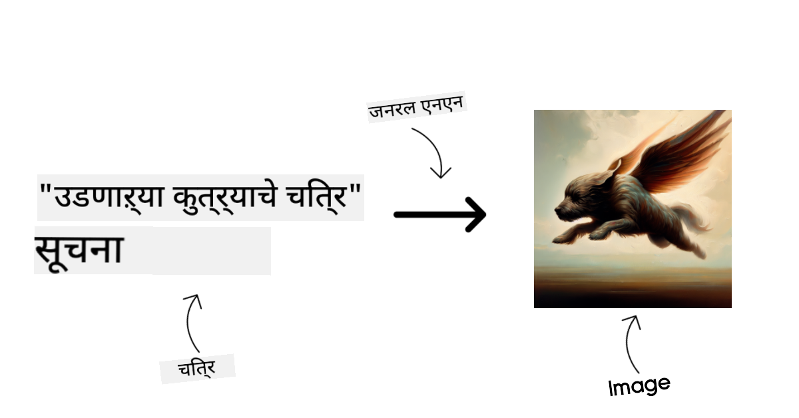

मजकूर आणि कोड निर्मिती मॉडेल्स ही मॉडेल्स आहेत जी मजकूर किंवा कोड तयार करतात. ही मॉडेल्स सामान्यतः मजकूर संक्षेपण, भाषांतर आणि प्रश्नोत्तरासाठी वापरली जातात. मजकूर निर्मिती मॉडेल्स सामान्यतः मजकूराच्या मोठ्या डेटासेट्सवर प्रशिक्षित केली जातात, जसे की [BookCorpus](https://www.cv-foundation.org/openaccess/content_iccv_2015/html/Zhu_Aligning_Books_and_ICCV_2015_paper.html?WT.mc_id=academic-105485-koreyst), आणि नवीन मजकूर तयार करण्यासाठी किंवा प्रश्नांची उत्तरे देण्यासाठी वापरली जाऊ शकतात. कोड निर्मिती मॉडेल्स, जसे की [CodeParrot](https://huggingface.co/codeparrot?WT.mc_id=academic-105485-koreyst), सामान्यतः कोडच्या मोठ्या डेटासेट्सवर प्रशिक्षित केली जातात, जसे की GitHub, आणि नवीन कोड तयार करण्यासाठी किंवा विद्यमान कोडमधील बग्स दुरुस्त करण्यासाठी वापरली जाऊ शकतात.

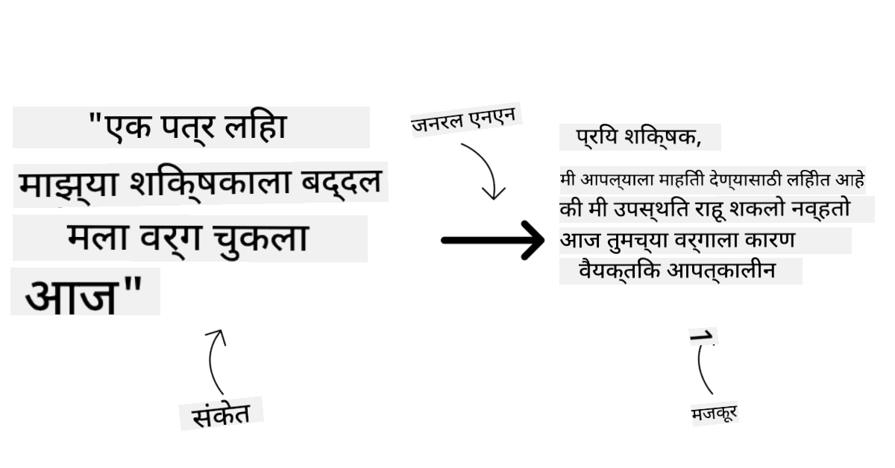

### एन्कोडर-डिकोडर विरुद्ध फक्त डिकोडर

LLMs च्या विविध प्रकारच्या आर्किटेक्चरबद्दल बोलण्यासाठी, एक उपमा वापरूया.

कल्पना करा की तुमच्या व्यवस्थापकाने तुम्हाला विद्यार्थ्यांसाठी एक क्विझ लिहिण्याचे काम दिले आहे. तुमच्याकडे दोन सहकारी आहेत; एक सामग्री तयार करण्याचे काम पाहतो आणि दुसरा त्यांचे पुनरावलोकन करतो.

सामग्री तयार करणारा फक्त डिकोडर मॉडेलसारखा आहे, तो विषय पाहू शकतो आणि तुम्ही आधीच काय लिहिले आहे ते पाहू शकतो आणि त्यावर आधारित एक कोर्स लिहू शकतो. ते आकर्षक आणि माहितीपूर्ण सामग्री लिहिण्यात खूप चांगले आहेत, परंतु विषय आणि शिकण्याच्या उद्दिष्टे समजून घेण्यात ते फारसे चांगले नाहीत. डिकोडर मॉडेल्सचे काही उदाहरणे GPT कुटुंबातील मॉडेल्स आहेत, जसे की GPT-3.

पुनरावलोकन करणारा एन्कोडर मॉडेलसारखा आहे, तो लिहिलेला कोर्स आणि उत्तरे पाहतो, त्यांच्यातील संबंध लक्षात घेतो आणि संदर्भ समजतो, परंतु सामग्री तयार करण्यात चांगला नाही. एन्कोडर मॉडेलचे एक उदाहरण BERT असेल.

कल्पना करा की आपल्याकडे असा कोणीही असू शकतो जो क्विझ तयार करू शकतो आणि पुनरावलोकन करू शकतो, हे एन्कोडर-डिकोडर मॉडेल आहे. काही उदाहरणे BART आणि T5 असतील.

### सेवा विरुद्ध मॉडेल

आता, सेवा आणि मॉडेलमधील फरकाबद्दल बोलूया. सेवा ही क्लाउड सेवा प्रदात्याद्वारे ऑफर केलेली उत्पादने आहेत आणि ती सामान्यतः मॉडेल्स, डेटा आणि इतर घटकांचे संयोजन असते. मॉडेल ही सेवांची मुख्य घटक असते आणि ती सामान्यतः फाउंडेशन मॉडेल असते, जसे की LLM.

सेवा सामान्यतः उत्पादनासाठी अनुकूलित असतात आणि मॉडेल्सच्या तुलनेत वापरण्यास सोपी असतात, ग्राफिकल यूजर इंटरफेसद्वारे. तथापि, सेवा नेहमी विनामूल्य उपलब्ध नसतात आणि ती वापरण्यासाठी सदस्यता किंवा पैसे आवश्यक असू शकतात, सेवा मालकाच्या उपकरणे आणि संसाधने वापरण्यासाठी, खर्च अनुकूलित करण्यासाठी आणि सहजपणे स्केल करण्यासाठी. सेवांचे एक उदाहरण आहे [Azure OpenAI Service](https://learn.microsoft.com/azure/ai-services/openai/overview?WT.mc_id=academic-105485-koreyst), जे पे-एज-यू-गो दर योजना ऑफर करते, म्हणजे वापरकर्त्यांना सेवा किती वापरली जाते याच्या प्रमाणात शुल्क आकारले जाते. तसेच, Azure OpenAI Service एंटरप्राइझ-ग्रेड सुरक्षा आणि मॉडेल्सच्या क्षमतांवर जबाबदार AI फ्रेमवर्क ऑफर करते.

मॉडेल्स फक्त न्यूरल नेटवर्क आहेत, पॅरामीटर्स, वेट्स आणि इतरांसह. कंपन्यांना स्थानिकपणे चालवण्याची परवानगी देणे, तथापि, उपकरणे खरेदी करणे, स्केल करण्यासाठी संरचना तयार करणे आणि परवाना खरेदी करणे किंवा ओपन-सोर्स मॉडेल वापरणे आवश्यक आहे. LLaMA सारखे मॉडेल वापरण्यासाठी उपलब्ध आहे, मॉडेल चालवण्यासाठी संगणकीय शक्ती आवश्यक आहे.

## Azure वर विविध मॉडेल्सची चाचणी आणि पुनरावृत्ती कशी करावी यासाठी कार्यक्षमता समजून घेणे

एकदा आमच्या टीमने सध्याच्या LLMs च्या क्षेत्राचा अभ्यास केला आणि त्यांच्या परिस्थितीसाठी काही चांगले उमेदवार ओळखले, पुढील टप्पा म्हणजे त्यांच्या डेटावर आणि त्यांच्या वर्कलोडवर त्यांची चाचणी करणे. ही एक पुनरावृत्ती प्रक्रिया आहे, प्रयोग आणि मोजमापाद्वारे केली जाते.
आपण मागील परिच्छेदांमध्ये उल्लेख केलेले बहुतेक मॉडेल्स (OpenAI मॉडेल्स, Llama2 सारखी ओपन सोर्स मॉडेल्स, आणि Hugging Face ट्रान्सफॉर्मर्स) [Model Catalog](https://learn.microsoft.com/azure/ai-studio/how-to/model-catalog-overview?WT.mc_id=academic-105485-koreyst) मध्ये [Azure AI Studio](https://ai.azure.com/?WT.mc_id=academic-105485-koreyst) मध्ये उपलब्ध आहेत.

[Azure AI Studio](https://learn.microsoft.com/azure/ai-studio/what-is-ai-studio?WT.mc_id=academic-105485-koreyst) हे एक क्लाउड प्लॅटफॉर्म आहे जे डेव्हलपर्सना जनरेटिव्ह AI अॅप्लिकेशन्स तयार करण्यासाठी आणि संपूर्ण विकास जीवनचक्र व्यवस्थापित करण्यासाठी डिझाइन केले आहे - प्रयोगांपासून ते मूल्यमापनापर्यंत - सर्व Azure AI सेवांना एका सुलभ GUI मध्ये एकत्र करून. Azure AI Studio मधील Model Catalog वापरकर्त्याला खालील गोष्टी सक्षम करते:

- कॅटलॉगमध्ये स्वारस्य असलेल्या Foundation Model शोधा - मालकीचे किंवा ओपन सोर्स, कार्य, परवाना किंवा नावानुसार फिल्टर करून. शोध सुलभ करण्यासाठी, मॉडेल्स संग्रहांमध्ये आयोजित केले जातात, जसे Azure OpenAI संग्रह, Hugging Face संग्रह, आणि अधिक.

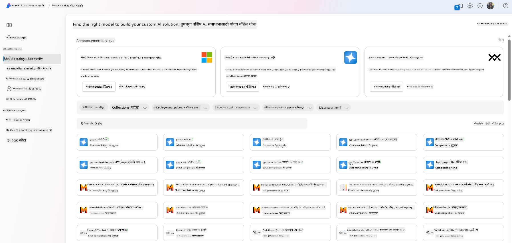

- मॉडेल कार्ड पुनरावलोकन करा, ज्यामध्ये उद्दिष्ट वापर आणि प्रशिक्षण डेटा, कोड नमुने आणि अंतर्गत मूल्यमापन लायब्ररीवरील मूल्यमापन परिणाम यांचा तपशीलवार वर्णन समाविष्ट आहे.

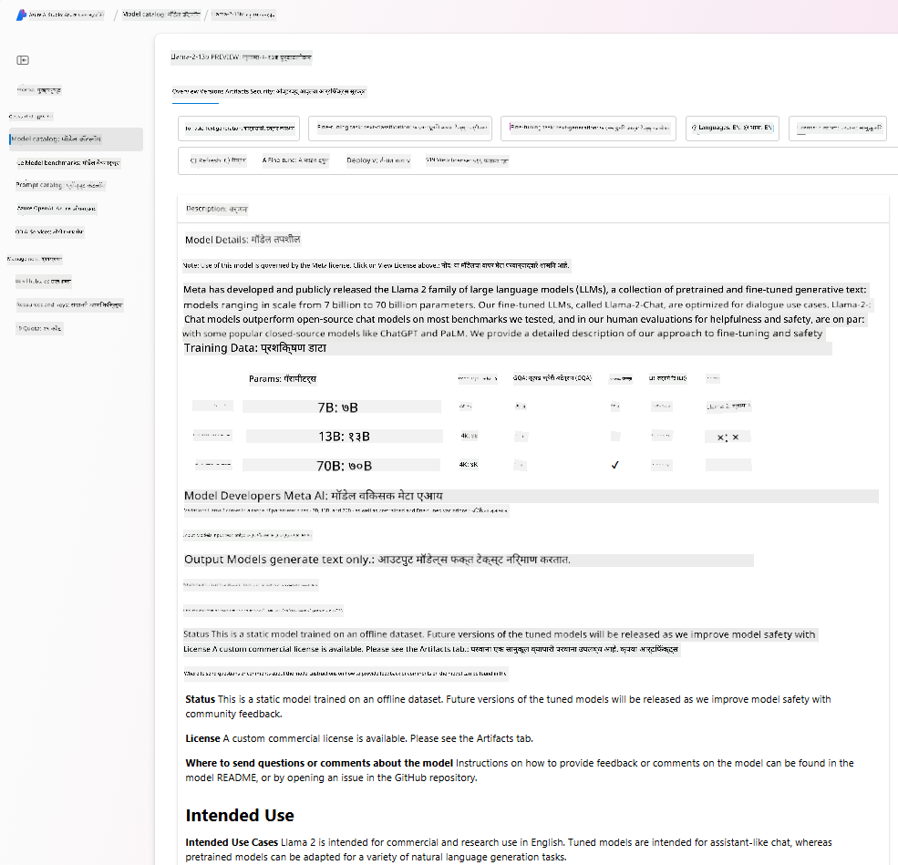

- उद्योगात उपलब्ध मॉडेल्स आणि डेटासेट्समधील बेंचमार्क्सची तुलना करा, [Model Benchmarks](https://learn.microsoft.com/azure/ai-studio/how-to/model-benchmarks?WT.mc_id=academic-105485-koreyst) पॅनद्वारे कोणते व्यवसाय परिदृश्य पूर्ण करते ते मूल्यांकन करण्यासाठी.

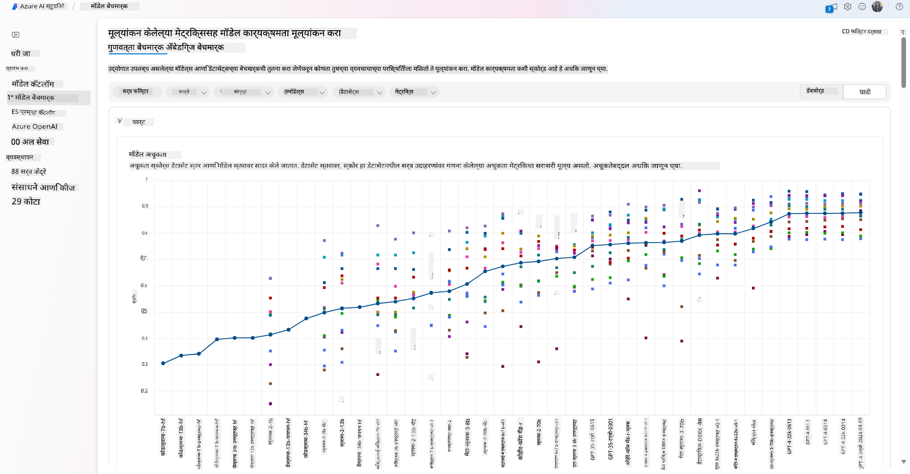

- मॉडेलच्या कार्यक्षमतेत विशिष्ट कार्यभारामध्ये सुधारणा करण्यासाठी सानुकूल प्रशिक्षण डेटावर मॉडेल फाइन-ट्यून करा, Azure AI Studio च्या प्रयोग आणि ट्रॅकिंग क्षमता वापरून.

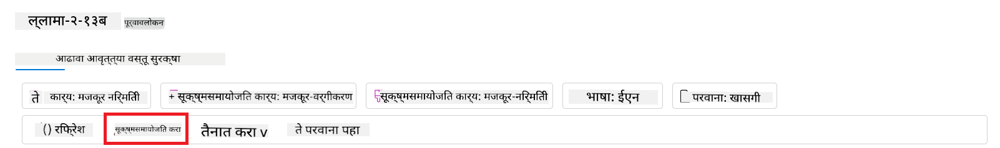

- मूळ प्री-ट्रेन मॉडेल किंवा फाइन-ट्यून केलेल्या आवृत्तीला रिमोट रिअल टाइम इनफरन्स - व्यवस्थापित संगणन - किंवा सर्व्हरलेस API एन्डपॉइंट - [pay-as-you-go](https://learn.microsoft.com/azure/ai-studio/how-to/model-catalog-overview#model-deployment-managed-compute-and-serverless-api-pay-as-you-go?WT.mc_id=academic-105485-koreyst) - वर तैनात करा, जेणेकरून अॅप्लिकेशन्स त्याचा वापर करू शकतील.

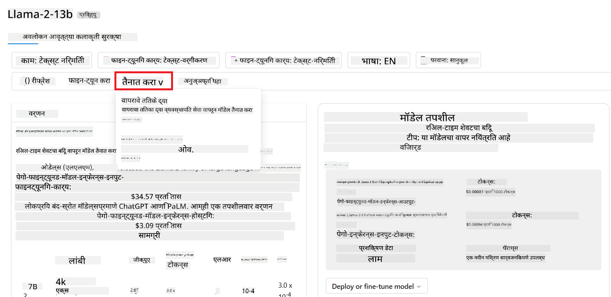

> [!NOTE]
> कॅटलॉगमधील सर्व मॉडेल्स सध्या फाइन-ट्यूनिंग आणि/किंवा pay-as-you-go तैनातीसाठी उपलब्ध नाहीत. मॉडेलच्या क्षमता आणि मर्यादांबद्दल तपशीलांसाठी मॉडेल कार्ड तपासा.

## LLM परिणाम सुधारत आहे

आम्ही आमच्या स्टार्टअप टीमसह विविध प्रकारचे LLMs आणि एक क्लाउड प्लॅटफॉर्म (Azure Machine Learning) शोधले आहे जे आम्हाला विविध मॉडेल्सची तुलना करण्यास, चाचणी डेटावर त्यांचे मूल्यमापन करण्यास, कार्यक्षमता सुधारण्यास आणि त्यांना इनफरन्स एन्डपॉइंट्सवर तैनात करण्यास सक्षम करते.

पण ते प्री-ट्रेन मॉडेल वापरण्याऐवजी मॉडेल फाइन-ट्यूनिंगचा विचार कधी करावा? विशिष्ट कार्यभारावर मॉडेल कार्यक्षमता सुधारण्यासाठी इतर कोणते दृष्टिकोन आहेत?

LLM कडून आवश्यक परिणाम मिळविण्यासाठी व्यवसाय विविध दृष्टिकोन वापरू शकतो. उत्पादनात LLM तैनात करताना वेगवेगळ्या प्रशिक्षण स्तरांसह विविध प्रकारचे मॉडेल्स निवडू शकता, ज्यामध्ये वेगवेगळ्या स्तरांतील गुंतागुंत, खर्च आणि गुणवत्ता असते. येथे काही वेगवेगळे दृष्टिकोन आहेत:

- **कॉन्टेक्स्टसह प्रॉम्प्ट इंजिनिअरिंग**. कल्पना अशी आहे की तुम्हाला आवश्यक प्रतिसाद मिळण्यासाठी प्रॉम्प्ट करताना पुरेसा संदर्भ प्रदान करणे.

- **Retrieval Augmented Generation, RAG**. तुमचा डेटा डेटाबेस किंवा वेब एन्डपॉइंटमध्ये असू शकतो, उदाहरणार्थ, प्रॉम्प्ट करताना हा डेटा किंवा त्याचा उपसंच समाविष्ट केला जावा याची खात्री करण्यासाठी, तुम्ही संबंधित डेटा शोधू शकता आणि तो वापरकर्त्याच्या प्रॉम्प्टचा भाग बनवू शकता.

- **फाइन-ट्यून केलेले मॉडेल**. येथे, तुम्ही तुमच्या स्वतःच्या डेटावर मॉडेल अधिक प्रशिक्षण दिले आहे ज्यामुळे मॉडेल अधिक अचूक आणि तुमच्या गरजांसाठी प्रतिसाद देणारे बनले आहे, परंतु हे महाग असू शकते.

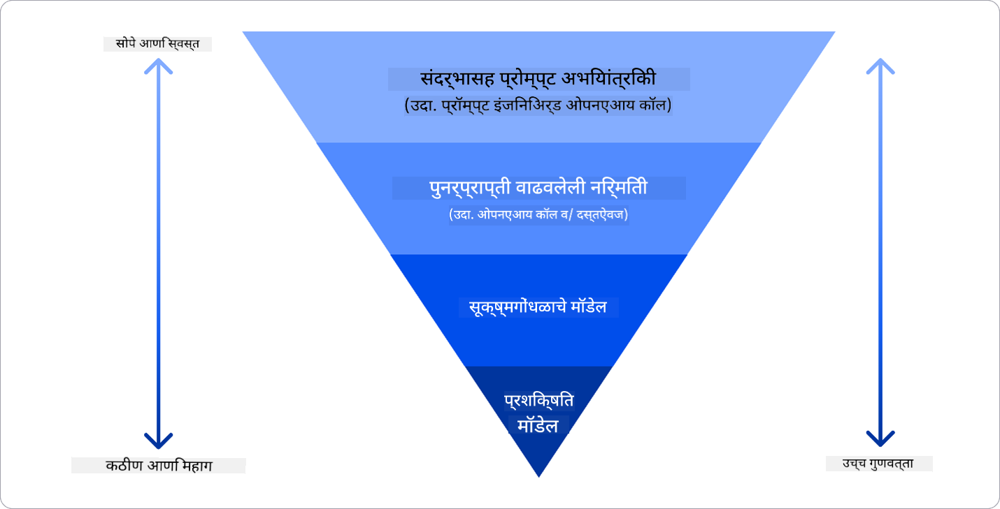

Img source: [Four Ways that Enterprises Deploy LLMs | Fiddler AI Blog](https://www.fiddler.ai/blog/four-ways-that-enterprises-deploy-llms?WT.mc_id=academic-105485-koreyst)

### कॉन्टेक्स्टसह प्रॉम्प्ट इंजिनिअरिंग

प्री-ट्रेन LLMs सामान्यीकृत नैसर्गिक भाषा कार्यांवर खूप चांगले कार्य करतात, अगदी त्यांना एका छोट्या प्रॉम्प्टसह कॉल करून, जसे की पूर्ण करण्यासाठी वाक्य किंवा प्रश्न – ज्याला “zero-shot” लर्निंग म्हणतात.

तथापि, वापरकर्ता त्यांची चौकशी जितकी अधिक फ्रेम करू शकतो, तपशीलवार विनंती आणि उदाहरणांसह – कॉन्टेक्स्ट – उत्तर तितकेच अचूक आणि वापरकर्त्याच्या अपेक्षांनुसार जवळ असेल. या प्रकरणात, जर प्रॉम्प्टमध्ये फक्त एक उदाहरण समाविष्ट असेल तर आम्ही “one-shot” लर्निंगबद्दल बोलतो आणि जर त्यात अनेक उदाहरणे समाविष्ट असतील तर “few-shot” लर्निंगबद्दल बोलतो. कॉन्टेक्स्टसह प्रॉम्प्ट इंजिनिअरिंग हा सुरुवात करण्यासाठी सर्वात खर्च-प्रभावी दृष्टिकोन आहे.

### Retrieval Augmented Generation (RAG)

LLMs मध्ये मर्यादा असते की ते उत्तर तयार करण्यासाठी त्यांच्या प्रशिक्षणादरम्यान वापरलेल्या डेटाचाच वापर करू शकतात. याचा अर्थ असा की त्यांना त्यांच्या प्रशिक्षण प्रक्रियेनंतर घडलेल्या घटनांबद्दल काहीही माहिती नाही आणि ते नॉन-पब्लिक माहिती (जसे की कंपनी डेटा) प्रवेश करू शकत नाहीत.  
हे RAG द्वारे दूर केले जाऊ शकते, एक तंत्र जे प्रॉम्प्टला दस्तऐवजांच्या तुकड्यांच्या स्वरूपात बाह्य डेटासह वाढवते, प्रॉम्प्ट लांबीच्या मर्यादा विचारात घेऊन. हे व्हेक्टर डेटाबेस टूल्सद्वारे समर्थित आहे (जसे [Azure Vector Search](https://learn.microsoft.com/azure/search/vector-search-overview?WT.mc_id=academic-105485-koreyst)) जे विविध पूर्व-परिभाषित डेटा स्रोतांमधून उपयुक्त तुकडे पुनर्प्राप्त करतात आणि त्यांना प्रॉम्प्ट कॉन्टेक्स्टमध्ये जोडतात.

जेव्हा व्यवसायाकडे पुरेसा डेटा, पुरेसा वेळ किंवा LLM फाइन-ट्यून करण्यासाठी संसाधने नसतात, परंतु विशिष्ट कार्यभारावर कार्यक्षमता सुधारण्याची आणि वास्तविकतेची विकृती किंवा हानिकारक सामग्रीचा धोका कमी करण्याची इच्छा असते तेव्हा हे तंत्र खूप उपयुक्त आहे.

### फाइन-ट्यून केलेले मॉडेल

फाइन-ट्यूनिंग हा एक प्रक्रिया आहे जो ट्रान्सफर लर्निंगचा उपयोग करून मॉडेलला डाउनस्ट्रीम टास्कसाठी ‘अॅडॅप्ट’ करण्यासाठी किंवा विशिष्ट समस्या सोडवण्यासाठी वापरतो. few-shot लर्निंग आणि RAG पेक्षा वेगळे, यामुळे नवीन मॉडेल तयार होते, अद्यतनित वजन आणि पूर्वग्रहांसह. यासाठी एक प्रशिक्षण उदाहरणांचा संच आवश्यक आहे ज्यामध्ये एकल इनपुट (प्रॉम्प्ट) आणि त्याशी संबंधित आउटपुट (पूर्णता) समाविष्ट आहे.  
हे प्राधान्य दिलेले दृष्टिकोन असेल जर:

- **फाइन-ट्यून केलेले मॉडेल्स वापरणे**. व्यवसाय कमी सक्षम मॉडेल्स (जसे की एम्बेडिंग मॉडेल्स) वापरण्याची इच्छा बाळगतो, उच्च कार्यक्षमतेच्या मॉडेल्सऐवजी, परिणामी अधिक खर्च-प्रभावी आणि जलद उपाय.

- **लेटन्सी विचारात घेणे**. विशिष्ट उपयोग प्रकरणासाठी लेटन्सी महत्त्वाची आहे, त्यामुळे खूप लांब प्रॉम्प्ट्स वापरणे शक्य नाही किंवा मॉडेलने शिकले पाहिजे अशा उदाहरणांची संख्या प्रॉम्प्ट लांबीच्या मर्यादेत बसत नाही.

- **अप-टू-डेट राहणे**. व्यवसायाकडे उच्च-गुणवत्तेचा डेटा आणि ग्राउंड ट्रुथ लेबल्स आहेत आणि वेळोवेळी हा डेटा अद्ययावत ठेवण्यासाठी आवश्यक संसाधने आहेत.

### प्रशिक्षित मॉडेल

LLM स्क्रॅचपासून प्रशिक्षण देणे हे निःसंशयपणे सर्वात कठीण आणि अवघड दृष्टिकोन आहे, ज्यासाठी प्रचंड प्रमाणात डेटा, कुशल संसाधने आणि योग्य संगणकीय शक्ती आवश्यक आहे. व्यवसायाकडे डोमेन-विशिष्ट उपयोग प्रकरण आणि डोमेन-केंद्रित डेटाचा मोठा प्रमाण असल्यासच हा पर्याय विचारात घेतला पाहिजे.

## ज्ञान तपासणी

LLM पूर्णता परिणाम सुधारण्यासाठी चांगला दृष्टिकोन काय असू शकतो?

1. कॉन्टेक्स्टसह प्रॉम्प्ट इंजिनिअरिंग  
1. RAG  
1. फाइन-ट्यून केलेले मॉडेल  

A:3, जर तुमच्याकडे वेळ आणि संसाधने आणि उच्च-गुणवत्तेचा डेटा असेल, तर अद्ययावत राहण्यासाठी फाइन-ट्यूनिंग हा चांगला पर्याय आहे. तथापि, जर तुम्ही गोष्टी सुधारण्याचा विचार करत असाल आणि तुमच्याकडे वेळ कमी असेल तर RAG प्रथम विचारात घेणे योग्य आहे.

## 🚀 आव्हान

तुमच्या व्यवसायासाठी [RAG वापरण्याबद्दल](https://learn.microsoft.com/azure/search/retrieval-augmented-generation-overview?WT.mc_id=academic-105485-koreyst) अधिक वाचा.

## उत्तम काम, तुमचे शिक्षण सुरू ठेवा

हा धडा पूर्ण केल्यानंतर, आमचा [Generative AI Learning collection](https://aka.ms/genai-collection?WT.mc_id=academic-105485-koreyst) तपासा आणि तुमचे जनरेटिव्ह AI ज्ञान वाढवत रहा!

धडा 3 वर जा जिथे आपण [जनरेटिव्ह AI जबाबदारीने कसे वापरायचे](../03-using-generative-ai-responsibly/README.md?WT.mc_id=academic-105485-koreyst) यावर चर्चा करू!

---

**अस्वीकरण**:  
हा दस्तऐवज AI भाषांतर सेवा [Co-op Translator](https://github.com/Azure/co-op-translator) वापरून भाषांतरित करण्यात आला आहे. आम्ही अचूकतेसाठी प्रयत्नशील असलो तरी, कृपया लक्षात ठेवा की स्वयंचलित भाषांतरे त्रुटी किंवा अचूकतेच्या अभावाने युक्त असू शकतात. मूळ भाषेतील दस्तऐवज हा अधिकृत स्रोत मानला जावा. महत्त्वाच्या माहितीसाठी, व्यावसायिक मानवी भाषांतराची शिफारस केली जाते. या भाषांतराचा वापर करून उद्भवलेल्या कोणत्याही गैरसमज किंवा चुकीच्या अर्थासाठी आम्ही जबाबदार राहणार नाही.