# विविध LLMs अन्वेषण करणे आणि तुलना करणे

[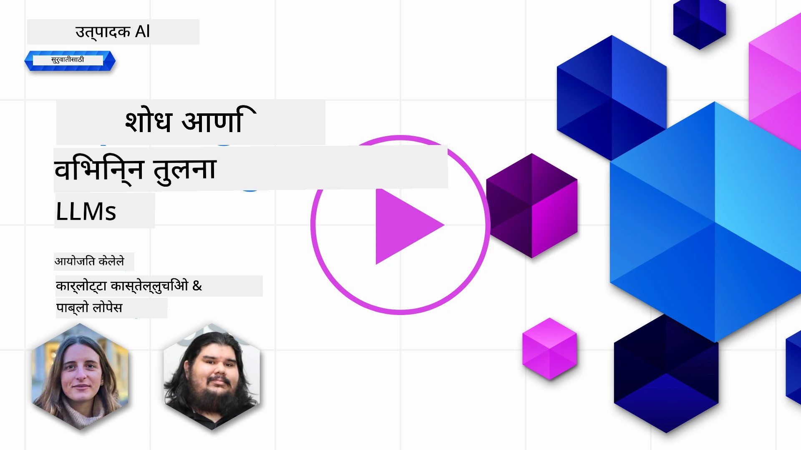](https://youtu.be/KIRUeDKscfI?si=8BHX1zvwzQBn-PlK)

> _या धड्याच्या व्हिडिओसाठी वरच्या प्रतिमेवर क्लिक करा_

मागील धड्यात आपण पाहिले आहे की जेनेरेटिव्ह AI तंत्रज्ञान क्षेत्र कसे बदलत आहे, मोठ्या भाषा मॉडेल्स (LLMs) कसे कार्य करतात आणि आमच्या स्टार्टअपसारख्या व्यवसायासाठी ते त्याच्या वापराच्या बाबतीत कसे लागू करू शकतात आणि वाढू शकतात! या अध्यायात, आपण विविध प्रकारच्या मोठ्या भाषा मॉडेल्सची तुलना व विरोधाभास करून त्यांचे फायदे व तोटे समजून घेऊ.

आमच्या स्टार्टअपच्या प्रवासातील पुढील टप्पा म्हणजे सध्याच्या LLMs चा अभ्यास करणे आणि आमच्या वापरासाठी योग्य कोणते मॉडेल्स आहेत हे समजून घेणे.

## परिचय

हा धडा खालील गोष्टींचा समावेश करेल:

- सध्याच्या परिसंस्थेमध्ये वेगवेगळ्या प्रकारचे LLMs.
- Azure मध्ये तुमच्या वापरासाठी वेगवेगळ्या मॉडेल्सचे परीक्षण, सुधारणा आणि तुलना करणे.
- LLM कसे तैनात करायचे.

## शिकण्याचे उद्दिष्टे

हा धडा पूर्ण केल्यावर, तुम्ही पुढील गोष्टी करू शकाल:

- तुमच्या वापरासाठी योग्य मॉडेल निवडणे.
- तुमच्या मॉडेलचे परीक्षण कसे करायचे, सुधारणा कशी करायची ते समजून घेणे.
- व्यवसाय कसे मॉडेल्स तैनात करतात हे जाणून घेणे.

## वेगवेगळ्या प्रकारचे LLMs समजून घेणे

LLMs चे अनेक वर्गीकरण त्यांची रचना, प्रशिक्षण डेटा आणि वापराच्या आधारावर केले जाऊ शकतात. हे फरक समजून घेणे आमच्या स्टार्टअपला योग्य मॉडेल निवडण्यास आणि मॉडेल कसे टेस्ट/सुधारित/कार्यक्षमता वाढवायची हे समजून घेण्यास मदत करेल.

विविध प्रकारचे LLM मॉडेल्स उपलब्ध आहेत, तुमचा मॉडेलचा निवड तुमच्या वापराच्या उद्दिष्टावर, डेटावर, किती पैसे खर्च करायला तयार आहात यावर अवलंबून आहे.

तुम्ही जर मॉडेल्सला मजकूर, ऑडिओ, व्हिडिओ, प्रतिमा निर्माणासाठी वापरू इच्छित असाल तर कदाचित वेगळ्या प्रकारचे मॉडेल निवडावे लागेल.

- **ऑडिओ आणि भाषण ओळखणे**. व्हिस्पर-स्टाईल मॉडेल्स अजूनही सामान्य उद्देशासाठी वापरले जातात, पण उत्पादनासाठी नवीन भाषण-ते-मजकूर मॉडेल्स जसे की `gpt-4o-transcribe`, `gpt-4o-mini-transcribe` आणि डायरीझेशन व्हेरिएंट्स उपलब्ध आहेत. तुमच्या परिस्थितीसाठी भाषा कव्हरेज, डायरीझेशन, रिअल-टाइम समर्थन, विलंब आणि किंमतीचे मूल्यमापन करा. अधिक माहितीसाठी [OpenAI भाषण-ते-मजकूर दस्तऐवज](https://platform.openai.com/docs/guides/speech-to-text?WT.mc_id=academic-105485-koreyst) पाहा.

- **प्रतिमा निर्मिती**. DALL-E आणि Midjourney परिचित प्रतिमा निर्मिती पर्याय आहेत, परंतु सध्याच्या OpenAI प्रतिमा API GPT प्रतिमा मॉडेल्स जसे की `gpt-image-2` यांवर केंद्रित आहेत, तर Stable Diffusion, Imagen, Flux, आणि इतर मॉडेल कुटुंबेही सामान्य पर्याय आहेत. प्रॉम्प्ट पालन, संपादन समर्थन, शैली नियंत्रण, सुरक्षा आवश्यकता आणि परवाना यांची तुलना करा. अधिक माहितीसाठी [OpenAI प्रतिमा निर्मिती मार्गदर्शक](https://platform.openai.com/docs/guides/images?WT.mc_id=academic-105485-koreyst) आणि या अभ्यासक्रमाचा अध्याय 9 वाचा.

- **मजकूर निर्मिती**. मजकूर मॉडेल्स आता फ्रंटिअर मॉडेल्स, विचारशील मॉडेल्स, लहान निमित्त कमी-लेटन्सी मॉडेल्स, आणि मुक्तवजन मॉडेल्स म्हणून उपलब्ध आहेत. सध्याचे उदाहरणे OpenAI GPT-5.x मॉडेल्स, Anthropic Claude 4.x मॉडेल्स, Google Gemini 3.x मॉडेल्स, Meta Llama 4 मॉडेल्स, आणि Mistral मॉडेल्स आहेत. फक्त प्रकाशन तारीख किंवा किंमत पाहून निवड करू नका; कार्य गुणवत्तेची, विलंब, संदर्भ विंडो, साधनाचा वापर, सुरक्षा वर्तन, प्रादेशिक उपलब्धता आणि एकूण खर्चाची तुलना करा. [Microsoft Foundry मॉडेल कॅटलॉग](https://ai.azure.com/catalog?WT.mc_id=academic-105485-koreyst) Azure वर उपलब्ध मॉडेल्सची चांगली तुलना करते.

- **मल्टी-मोडॅलिटी**. अनेक सध्याचे मॉडेल्स फक्त मजकूर नव्हे तर इतर गोष्टीही प्रक्रिया करू शकतात. काही प्रतिमा, ऑडिओ, किंवा व्हिडिओ इनपुट स्वीकारतात; काही साधने कॉल करू शकतात; आणि विशेष मॉडेल्स प्रतिमा, ऑडिओ, किंवा व्हिडिओ तयार करू शकतात. उदाहरणार्थ, सध्याचे OpenAI मॉडेल्स मजकूर आणि प्रतिमा इनपुटला समर्थन देतात, Gemini मॉडेल्स विविध व्हेरिएंटनुसार मजकूर, कोड, प्रतिमा, ऑडिओ, आणि व्हिडिओ इनपुटला समर्थन देऊ शकतात, आणि Llama 4 Scout आणि Maverick मुक्तवजन नॅटिव्ह मल्टीमोडल मॉडेल्स आहेत. वापरल्या जाणाऱ्या प्रत्येक मॉडेल कार्डवर समर्थित इनपुट आणि आउटपुट मोडालिटीज् तपासा आणि त्यानुसार वर्कफ्लो तयार करा.

मॉडेल निवडल्यावर तुम्हाला काही मूलभूत क्षमता मिळतात, पण कधीकधी ते पुरेसे नसते. सहसा तुमच्याकडे कंपनीच्या विशिष्ट डेटाचा संग्रह असतो ज्याची माहिती तुम्हाला LLM ला द्यावी लागते. यासाठी काही विविध पर्याय उपलब्ध आहेत, त्यावर पुढील विभागांमध्ये अधिक माहिती दिली आहे.

### फाउंडेशन मॉडेल्स विरुद्ध LLMs

"Foundation Model" हा शब्द [स्टॅनफर्ड संशोधकांनी घातला](https://arxiv.org/abs/2108.07258?WT.mc_id=academic-105485-koreyst) असून त्याची व्याख्या अशी आहे की, हे असा AI मॉडेल आहे जे काही निकषांनुसार तयार केले जाते, जसे की:

- **हे अनसुपरवाइज्ड किंवा सेल्फ-सुपरवाइज्ड लर्निंग वापरून प्रशिक्षित केले जातात**, म्हणजे हे लेबल नसलेल्या मल्टी-मोडल डेटावर प्रशिक्षित केले जातात, आणि त्यांच्या प्रशिक्षण प्रक्रियेसाठी मानवी एनोटेशन किंवा लेबलिंग आवश्यक नसते.
- **हे खूप मोठे मॉडेल्स असतात**, जे खोल न्यूरल नेटवर्क्सवर आधारित असतात आणि अब्जावधी पॅरामीटर्सवर प्रशिक्षित केले जातात.
- **हे सामान्यतः ‘फाउंडेशन’ म्हणून इतर मॉडेल्ससाठी वापरले जातात**, म्हणजे इतर मॉडेल्सवर त्यांच्यावर फाइन-ट्युनिंग करून तयार करता येते.

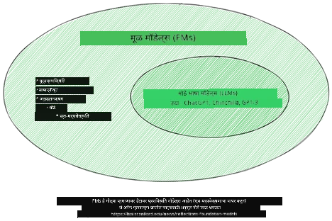

प्रतिमा स्त्रोत: [Essential Guide to Foundation Models and Large Language Models | by Babar M Bhatti | Medium
](https://thebabar.medium.com/essential-guide-to-foundation-models-and-large-language-models-27dab58f7404)

या फरकाची अजून स्पष्टता करण्यासाठी, ChatGPT ला एक ऐतिहासिक उदाहरण म्हणून घेऊया. ChatGPT ची सुरुवातीची आवृत्ती GPT-3.5 फाउंडेशन मॉडेल म्हणून वापरत होती. OpenAI नंतर चॅट-स्पेसिफिक डेटाचा आणि अलाईनमेंट तंत्रांचा वापर करून एक ट्यून केलेलं आवृत्ती तयार केली जी संभाषणात्मक परिस्थितींमध्ये (जसे की चॅटबोट्स) चांगली कामगिरी करत होती. आधुनिक AI सेवा अनेक मॉडेल व्हेरिएंट्स दरम्यान रूटिंग करतात, त्यामुळे सेवा नाव आणि त्याऐकी मॉडेल नाव नेहमी समान नसते.

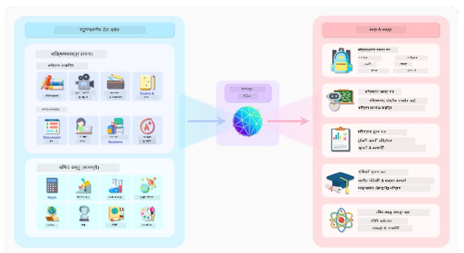

प्रतिमा स्त्रोत: [2108.07258.pdf (arxiv.org)](https://arxiv.org/pdf/2108.07258.pdf?WT.mc_id=academic-105485-koreyst)

### ओपन-वेट/ओपन-सोर्स विरुद्ध स्वामित्व असलेले मॉडेल्स

LLMs चे आणखी एक वर्गीकरण म्हणजे ते ओपन-वेट, ओपन-सोर्स आहेत की स्वामित्व असलेले.

ओपन-सोर्स आणि ओपन-वेट मॉडेल्सची मॉडेल आर्टिफॅक्ट्स तपासणी, डाउनलोड किंवा सानुकूल करण्यासाठी उपलब्ध असतात, पण त्यांचे परवाने वेगळे असतात. काही पूर्णपणे मुक्त स्रोत आहेत, तर काहीतरी वापरावर निर्बंध असलेले ओपन-वेट मॉडेल्स आहेत. जेव्हा व्यवसायाला मोडेल तैनात करण्यावर, डेटा स्थानिकतेवर, खर्चावर किंवा सानुकूलतेवर अधिक नियंत्रण हवे असते तेव्हा हे उपयुक्त ठरू शकतात. तथापि, संघांनी परवाना अटी, सेवा खर्च, देखभाल, सुरक्षा अद्यतने आणि मूल्यांकन गुणवत्ता वापरण्यापूर्वी तपासली पाहिजे. उदाहरणे: [Meta Llama 4](https://ai.meta.com/blog/llama-4-multimodal-intelligence/?WT.mc_id=academic-105485-koreyst), काही [Mistral मॉडेल्स](https://docs.mistral.ai/models/overview?WT.mc_id=academic-105485-koreyst), आणि बरेच मॉडेल्स [Hugging Face](https://huggingface.co/models?WT.mc_id=academic-105485-koreyst) वर उपलब्ध आहेत.

स्वामित्व असलेले मॉडेल्स प्रदात्यांकडून मालकी आणि होस्ट केलेले असतात. या मॉडेल्स सहसा व्यवस्थापित उत्पादनासाठी ऑप्टिमाइझ केलेले असतात आणि मजबूत समर्थन, सुरक्षा प्रणाली, साधन एकत्रीकरण आणि स्केल देऊ शकतात. पण ग्राहकांना सहसा मॉडेलचे वजन तपासण्याची किंवा बदलण्याची परवानगी नसते, आणि त्यांना गोपनीयता, राखणी, अनुपालन आणि स्वीकार्य वापरासाठी पुरवठादार अटी तपासाव्या लागत आहेत. उदाहरणे: [OpenAI मॉडेल्स](https://platform.openai.com/docs/models?WT.mc_id=academic-105485-koreyst), [Google Gemini](https://deepmind.google/models/gemini/pro/?WT.mc_id=academic-105485-koreyst), आणि [Anthropic Claude](https://platform.claude.com/docs/en/about-claude/models/overview?WT.mc_id=academic-105485-koreyst).

### एम्बेडिंग विरुद्ध प्रतिमा निर्मिती विरुद्ध मजकूर आणि कोड निर्मिती

LLMs आउटपुटच्या प्रकारांनी देखील वर्गीकृत केल्या जाऊ शकतात.

एम्बेडिंग्स हे असे मॉडेल्स आहेत जे मजकूराला संख्यात्मक स्वरूपात रूपांतरित करू शकतात, ज्याला एम्बेडिंग म्हणतात, जी इनपुट मजकूराचे संख्यात्मक प्रतिनिधित्व आहे. एम्बेडिंग्समुळे मशीनला शब्द किंवा वाक्यांमधील नाते समजणे सुलभ होते आणि इतर मॉडेल्स, जसे की वर्गीकरण मॉडेल्स किंवा क्लस्टरिंग मॉडेल्सना इनपुट म्हणून वापरले जाऊ शकतात, जे संख्यात्मक डेटावर अधिक चांगले कार्य करतात. एम्बेडिंग मॉडेल्स सहसा ट्रान्सफर लर्निंगसाठी वापरले जातात, ज्यात एक मॉडेल अधिक डेटावर तयार करण्यात येते, आणि नंतर त्याचे वजन (एम्बेडिंग्स) अन्य कार्यांसाठी पुन्हा वापरले जातात. याचा एक उदाहरण म्हणजे [OpenAI एम्बेडिंग्स](https://platform.openai.com/docs/models/embeddings?WT.mc_id=academic-105485-koreyst).

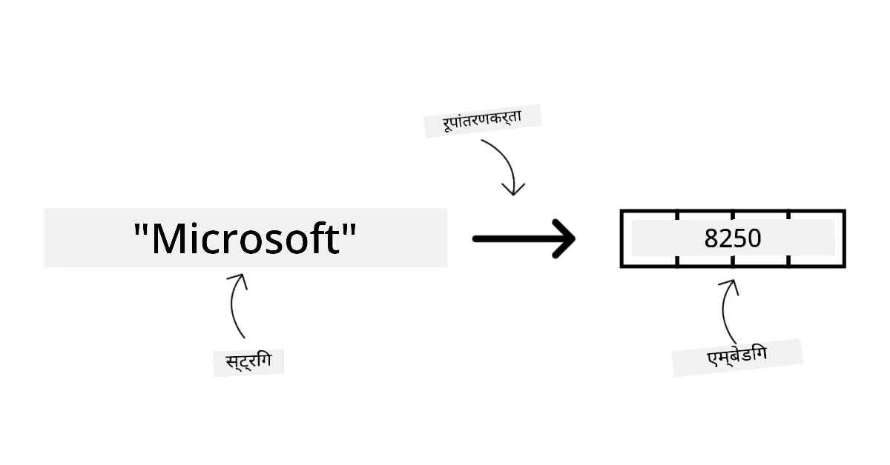

प्रतिमा निर्मिती मॉडेल्स हे प्रतिमा तयार करणारे मॉडेल्स असतात. हे मॉडेल्स प्रतिमा संपादन, प्रतिमा संश्लेषण, आणि प्रतिमा भाषांतरासाठी वापरले जातात. प्रतिमा निर्मिती मॉडेल्सना मोठ्या प्रमाणात प्रतिमा डेटासेट्सवर प्रशिक्षित केले जाते, जसे की [LAION-5B](https://laion.ai/blog/laion-5b/?WT.mc_id=academic-105485-koreyst), आणि ते नवीन प्रतिमा तयार करण्यासाठी किंवा विद्यमान प्रतिमा इनपेंटिंग, सुपर-रिझोल्यूशन, आणि रंगीकरण तंत्रांसह संपादित करण्यासाठी वापरले जाऊ शकतात. उदाहरणे: [GPT Image मॉडेल्स](https://platform.openai.com/docs/guides/images?WT.mc_id=academic-105485-koreyst), [Stable Diffusion मॉडेल्स](https://github.com/Stability-AI/StableDiffusion?WT.mc_id=academic-105485-koreyst), आणि Imagen मॉडेल्स.

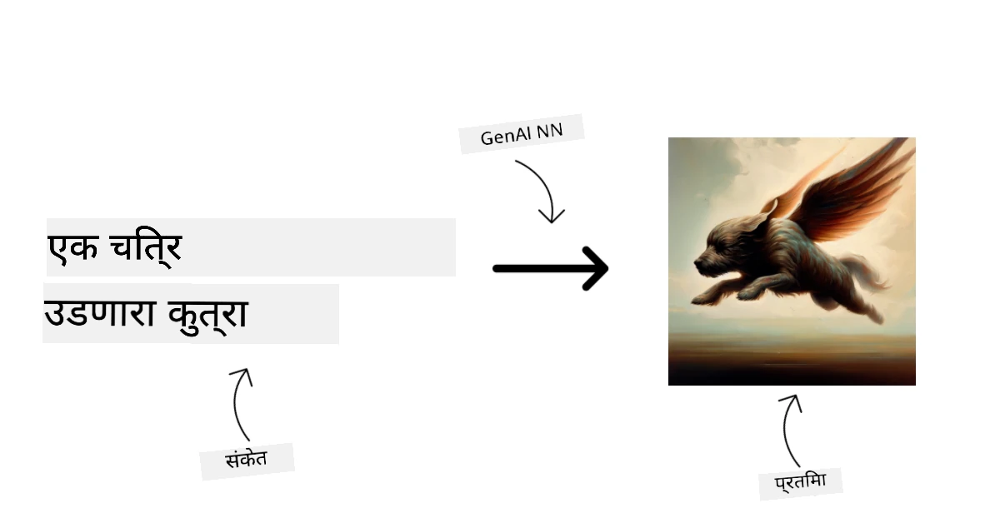

मजकूर आणि कोड निर्मिती मॉडेल्स हे मजकूर किंवा कोड तयार करणारे मॉडेल्स आहेत. हे मॉडेल्स मजकूर संक्षेपण, भाषांतर, आणि प्रश्नोत्तरासाठी वापरले जातात. मजकूर निर्मिती मॉडेल्सना मोठ्या प्रमाणात मजकूर डेटासेट्सवर प्रशिक्षित केले जाते, जसे की [BookCorpus](https://www.cv-foundation.org/openaccess/content_iccv_2015/html/Zhu_Aligning_Books_and_ICCV_2015_paper.html?WT.mc_id=academic-105485-koreyst), आणि त्यांचा वापर नवीन मजकूर तयार करण्यासाठी किंवा प्रश्नांची उत्तरे देण्यासाठी करता येतो. कोड निर्मिती मॉडेल्स, जसे की [CodeParrot](https://huggingface.co/codeparrot?WT.mc_id=academic-105485-koreyst), मोठ्या प्रमाणावर कोड डेटासेट्सवर प्रशिक्षित केले जातात, जसे GitHub, आणि नवीन कोड तयार करण्यासाठी किंवा विद्यमान कोडमधील बग दुरुस्त करण्यासाठी वापरले जातात.

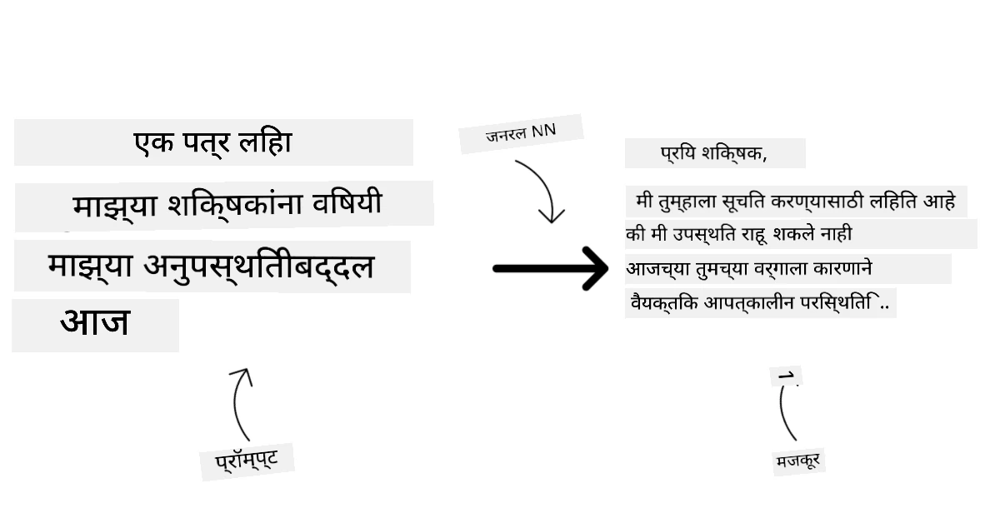

### एन्कोडर-डिकोडर विरुद्ध फक्त डिकोडर

LLMs च्या वेगवेगळ्या रचनांबद्दल बोलण्यासाठी, चला एक तात्विक उदाहरण वापरूया.

समजा तुमच्या व्यवस्थापकाने विद्यार्थ्यांसाठी एक क्विझ लिहिण्यासाठी काम दिले आहे. तुमच्याकडे दोन सहकारी आहेत; एक सामग्री तयार करतो आणि दुसरा त्यांचे पुनरावलोकन करतो.

सामग्री तयार करणारा म्हणजे फक्त डिकोडर मॉडेलसारखा आहे: तो विषय पाहू शकतो, तुम्ही आधी काय लिहिले ते पाहू शकतो, आणि नंतर त्या संदर्भावर आधारित सामग्री पुढे तयार करू शकतो. तो आकर्षक आणि माहितीपूर्ण सामग्री लिहिण्यात खूप चांगला आहे, पण माहिती वर्गीकरण, पुनर्प्राप्ती, किंवा एनकोडिंगसाठी नेहमीच सर्वोत्तम निवड नसतो. डिकोडर-फक्त मॉडेल कुटुंबाचा उदा. म्हणजे GPT आणि Llama मॉडेल्स.

पुनरावलोकक म्हणजे एन्कोडर-फक्त मॉडेलसारखा आहे, तो त्या कोर्सच्या लेखन आणि उत्तरांमध्ये नाते पाहतो आणि संदर्भ समजतो, पण तो सामग्री तयार करण्यात चांगला नाही. एन्कोडर-फक्त मॉडेलचे उदाहरण म्हणजे BERT.

समजा आपल्याकडे असा कोणीतरी असू शकतो जो क्विझ तयार करतो आणि पुनरावलोकनदेखील करतो, हा एन्कोडर-डिकोडर मॉडेल आहे. याचे उदाहरण BART आणि T5 आहेत.

### सेवा विरुद्ध मॉडेल

आता, सेवा आणि मॉडेल यामधील फरकाबद्दल बोलूया. सेवा म्हणजे एक उत्पाद जो क्लाउड सेवा प्रदात्याकडून दिला जातो, आणि तो अनेकदा मॉडेल्स, डेटा आणि इतर घटकांचा संगम असतो. मॉडेल सेवा चा मुख्य घटक असतो, आणि सहसा एक फाउंडेशन मॉडेल जसे की LLM असते.

सेवा सहसा उत्पादनासाठी ऑप्टिमाइझ केल्या जातात आणि ग्राफिकल यूजर इंटरफेसद्वारे वापरण्यास सोपी असतात. तथापि, सेवा नेहमीच मोफत उपलब्ध नसतात आणि वापरासाठी सदस्यता किंवा पेमेंट आवश्यक असू शकते, जे सेवेच्या मालकाच्या उपकरणांचा आणि संसाधनांचा वापर करून, खर्च सुधारणे आणि सहज स्केलिंग करणे शक्य करतं. एक उदाहरण [Azure OpenAI सेवा](https://learn.microsoft.com/azure/ai-foundry/openai/overview?WT.mc_id=academic-105485-koreyst) आहे, जी पे-एज-यू-गो रेट प्लॅन देते, म्हणजे वापरकर्त्यांना तेवढ्याच प्रमाणात शुल्क आकारले जाते जितके ते सेवा वापरतात. Azure OpenAI सेवा मॉडेल्सच्या क्षमतेवर एंटरप्राइझ-ग्रेड सुरक्षा आणि जबाबदार AI चौकट देखील देते.

मॉडेल्स म्हणजे न्यूरल नेटवर्कचे घटक: पॅरामीटर्स, वजन, रचना, टोकनायझर आणि सहाय्यक कॉन्फिगरेशन. स्थानिक किंवा खाजगी वातावरणात मॉडेल चालवण्यासाठी योग्य हार्डवेअर, सेवा इन्फ्रास्ट्रक्चर, मॉनिटरिंग आणि सुसंगत मुक्त स्रोत/ओपन-वेट परवाना किंवा व्यावसायिक परवाना आवश्यक असतो. Llama 4 किंवा Mistral मॉडेल्ससारखे ओपन-वेट मॉडेल्स स्वतः तैनात केले जाऊ शकतात, पण त्यासाठी संगणकीय क्षमता आणि ऑपरेशनल कौशल्य आवश्यक आहे.

## Azure वर वेगवेगळ्या मॉडेल्ससह कार्यप्रदर्शन समजण्यासाठी कसे परीक्षण आणि पुनरावृत्ती करावी

एकदा आमच्या टीमने सध्याच्या LLMs चा आढावा घेतल्यावर आणि त्यांच्या परिस्थितीसाठी काही चांगले उमेदवार ओळखले की, पुढील पाऊल म्हणजे त्यांना त्यांच्या डेटावर आणि कार्यभारावर चाचणी घालणे. ही एक पुनरावृत्ती प्रक्रिया आहे, जी प्रयोग आणि मोजमापांनी केली जाते.
मागील परिच्छेदांमध्ये आम्ही उल्लेख केलेल्या बहुतेक मॉडेल्स (OpenAI मॉडेल्स, Llama 4 आणि Mistral सारखे ओपन-वेट मॉडेल्स, आणि Hugging Face मॉडेल्स) [Microsoft Foundry Models](https://learn.microsoft.com/azure/foundry/concepts/foundry-models-overview?WT.mc_id=academic-105485-koreyst) मध्ये उपलब्ध आहेत.

[Microsoft Foundry](https://learn.microsoft.com/azure/foundry/what-is-foundry?WT.mc_id=academic-105485-koreyst), ज्याला पूर्वी Azure AI Studio/Azure AI Foundry म्हणत होते, हा AI ऍप्स आणि एजंट्स तयार करण्यासाठी एक एकत्रित Azure प्लॅटफॉर्म आहे. हे विकासकांना प्रयोग, मूल्यांकन, तैनाती, मॉनिटरिंग आणि प्रशासन अशी सर्व जीवनचक्रे व्यवस्थापित करण्यात मदत करते. Microsoft Foundry मधील मॉडेल कॅटलॉग वापरकर्त्याला सक्षम करतो:

- कॅटलॉगमध्ये आवडता फाउंडेशन मॉडेल शोधा, ज्यामध्ये Azure ने विकलेले मॉडेल्स तसेच भागीदार आणि समुदाय पुरवठादारांकडून आलेले मॉडेल्स असतात. वापरकर्ते कार्य, पुरवठादार, परवाना, तैनाती पर्याय किंवा नावानुसार फिल्टर करू शकतात.

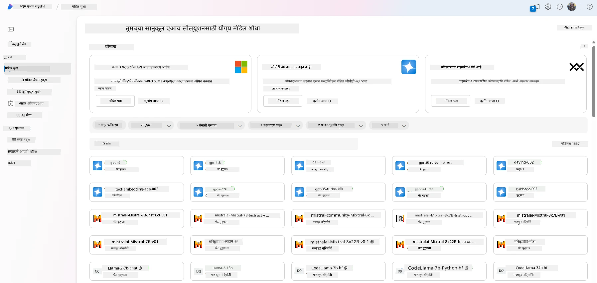

- मॉडेल कार्ड तपासा, ज्यामध्ये वापराचा तपशीलवार वर्णन, प्रशिक्षण डेटा, कोड नमुने आणि अंतर्गत मूल्यांकन परिणाम समाविष्ट असतात.

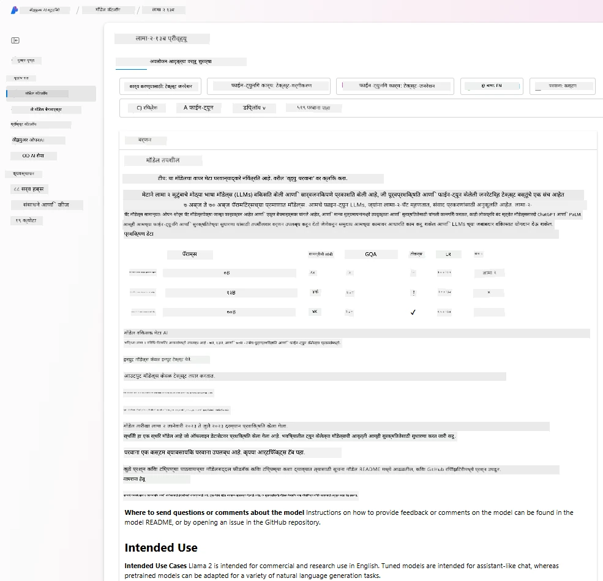

- उद्योगातील उपलब्ध मॉडेल्स आणि डेटासेट्सवर बेंचमार्क्सची तुलना करा ज्यामुळे कोणते मॉडेल तुमच्या व्यवसाय परिस्थितीस अधिक चांगले जुळते हे समजू शकते, [Model Benchmarks](https://learn.microsoft.com/azure/ai-foundry/concepts/model-benchmarks?WT.mc_id=academic-105485-koreyst) पॅनेलद्वारे.

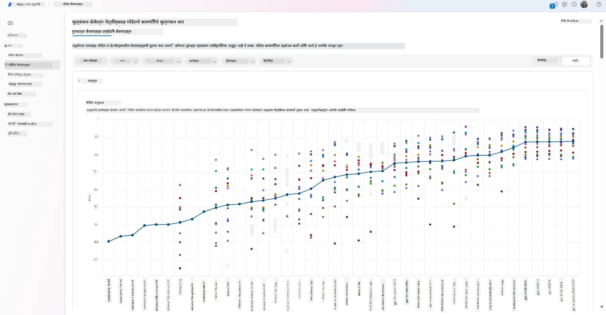

- विशिष्ट कार्यभारात मॉडेलची क्षमता सुधारण्यासाठी सानुकूल प्रशिक्षण डेटावर समर्थित मॉडेल्सचे फाइन-ट्यून करा, Microsoft Foundry च्या प्रयोग आणि ट्रॅकिंग क्षमतांचा वापर करून.

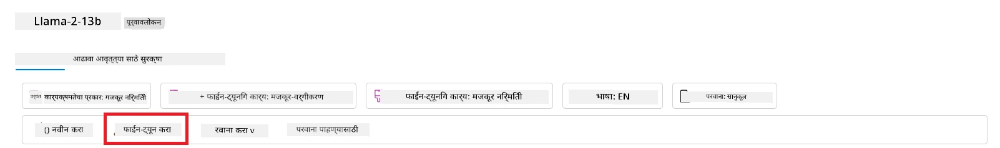

- मूळ प्री-ट्रेन केलेले मॉडेल किंवा फाइन-ट्यून केलेले व्हर्जन दूरच्या रिअल-टाइम इन्फरन्स एंडपॉइंटवर व्यवस्थापित संगणन किंवा सर्भरलेस तैनाती पर्याय वापरून तैनात करा, ज्यामुळे ऍप्लिकेशन्सना ते वापरण्यास परवानगी मिळते.

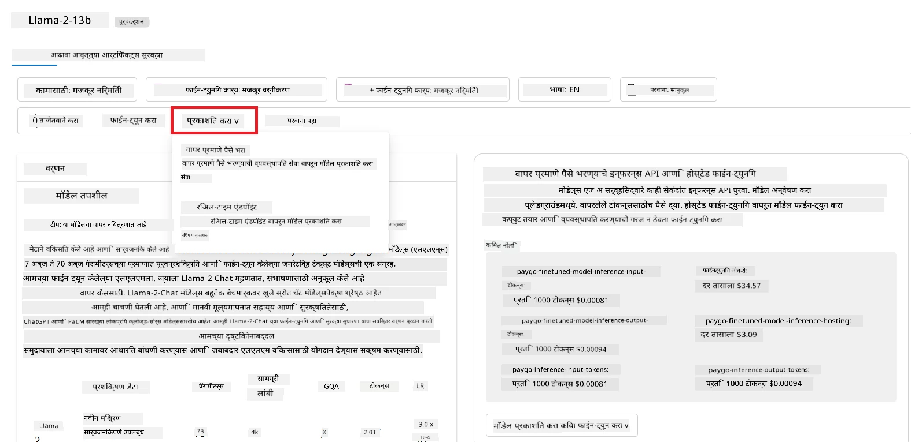

> [!NOTE]
> कॅटलॉगमधील सर्व मॉडेल्स सध्या फाइन-ट्यूनिंग आणि/किंवा पेकडे-आप-गो तैनातीसाठी उपलब्ध नसू शकतात. मॉडेलच्या क्षमता आणि मर्यादा जाणून घेण्यासाठी मॉडेल कार्ड तपासा.

## LLM निकाल सुधारणा

आमच्या स्टार्टअप टीमने वेगवेगळ्या प्रकारचे LLMs आणि क्लाउड प्लॅटफॉर्म (Microsoft Foundry) तपासले आहे ज्यामुळे आम्हाला वेगवेगळ्या मॉडेल्सची तुलना करण्याची, चाचणी डेटावर त्यांचे मूल्यांकन करण्याची, कामगिरी सुधारण्याची आणि इन्फरन्स एंडपॉइंटवर तैनात करण्याची मुभा मिळाली आहे.

पण ते प्री-ट्रेन केलेल्या मॉडेलऐवजी कधी फाइन-ट्यूनिंगचा विचार करावा? विशिष्ट कार्यभारावर मॉडेलची कामगिरी सुधारण्यासाठी इतर कोणत्या दृष्टिकोनांचा वापर करता येतो?

व्यवसाय LLM कडून आवश्यक निकाल मिळवण्यासाठी अनेक दृष्टिकोन वापरू शकतो. उत्पादनात LLM तैनात करताना तुम्ही वेगवेगळ्या प्रकारचे मॉडेल्स निवडू शकता ज्यांच्या प्रशिक्षणाची तीव्रता वेगळी आहे, ज्यामुळे जटिलता, खर्च आणि गुणवत्ता वेगवेगळी असते. येथे काही वेगवेगळे दृष्टिकोन आहेत:

- **संदर्भासह प्रॉम्प्ट इंजिनिअरिंग**. संकल्पना अशी आहे की, तुम्ही जेव्हा प्रॉम्प्ट देता तेव्हा पुरेसा संदर्भ द्या ज्यामुळे तुम्हाला आवश्यक उत्तरे मिळतील.

- **रिट्रीवल ऑगमेंटेड जनरेशन, RAG**. तुमचा डेटा डेटाबेस किंवा वेब एंडपॉइंटवर असू शकतो, उदाहरणार्थ, जेणेकरून प्रॉम्प्ट वेळी हा डेटा किंवा त्याचा एक भाग समाविष्ट होऊ शकेल, तुम्ही संबंधित डेटा शोधून वापरकर्त्याच्या प्रॉम्प्टचा भाग बनवू शकता.

- **फाइन-ट्यून केलेले मॉडेल**. येथे, तुम्ही मॉडेलला तुमच्या स्वतःच्या डेटावर अधिक प्रशिक्षण दिले, ज्यामुळे मॉडेल तुमच्या गरजांसाठी अधिक अचूक आणि प्रतिसादक्षम झाले पण हे महागडे असू शकते.

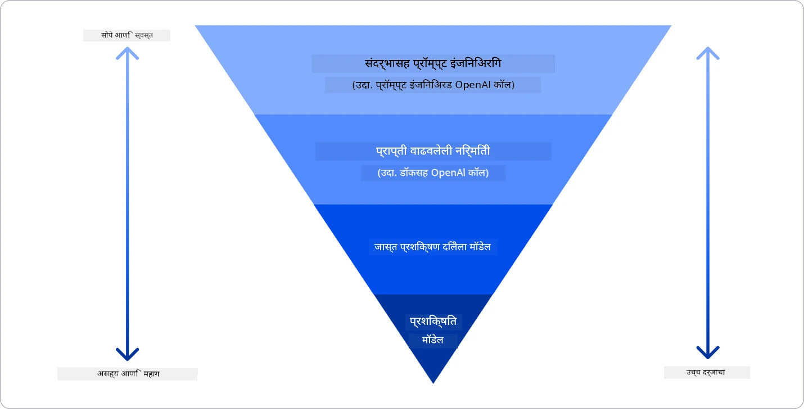

छायाचित्र स्रोत: [Four Ways that Enterprises Deploy LLMs | Fiddler AI Blog](https://www.fiddler.ai/blog/four-ways-that-enterprises-deploy-llms?WT.mc_id=academic-105485-koreyst)

### संदर्भासह प्रॉम्प्ट इंजिनिअरिंग

प्री-ट्रेन केलेले LLMs सामान्य नैसर्गिक भाषा कार्यांवर खूप चांगले काम करतात, अगदी त्यांना लहान प्रॉम्प्टसह कॉल केल्यावरही, जसे वाक्य पूर्ण करणे किंवा प्रश्न विचारणे – ज्याला "झिरो-शॉट" शिक्षण म्हणतात.

परंतु, वापरकर्ता जितका अधिक तपशीलवार विनंती आणि उदाहरणांसह (संदर्भ) आपला क्वेरी संरचित करतो, उत्तर तेवढेच अचूक आणि वापरकर्त्याच्या अपेक्षांच्या जवळ असेल. या प्रकरणात, जर प्रॉम्प्टमध्ये फक्त एक उदाहरण असेल तर याला "वन-शॉट" शिक्षण म्हणतात आणि जर अनेक उदाहरणे असतील तर "फ्यू शॉट" शिक्षण म्हणतात.
संदर्भासह प्रॉम्प्ट इंजिनिअरिंग हे सुरुवात करण्यासाठी सर्वात किफायतशीर दृष्टिकोन आहे.

### रिट्रीवल ऑगमेंटेड जनरेशन (RAG)

LLMs ला अशी मर्यादा आहे की ते केवळ त्यांच्या शिक्षणादरम्यान वापरलेला डेटा वापरून उत्तर तयार करू शकतात. याचा अर्थ असा की ते त्यांच्या प्रशिक्षण प्रक्रियेनंतर घडलेल्या घटनांबद्दल काहीही जाणत नाहीत आणि ते गैर-सार्वजनिक माहिती (जसे की कंपनीचा डेटा) वापरू शकत नाहीत.
हे RAG द्वारे ओलांडता येते, जे एक तंत्रज्ञान आहे जे प्रॉम्प्टमध्ये बाह्य डेटा दस्तऐवजांच्या तुकड्यांच्या स्वरूपात वाढवते, प्रॉम्प्टच्या लांबीच्या मर्यादांचा विचार करून. हे [Azure Vector Search](https://learn.microsoft.com/azure/search/vector-search-overview?WT.mc_id=academic-105485-koreyst) सारख्या व्हेक्टर डेटाबेस साधनांनी समर्थीत केले जाते, जे विविध पूर्वनिर्धारित डेटा स्त्रोतांमधून उपयुक्त तुकडे शोधून प्रॉम्प्ट संदर्भात जोडतात.

हा तंत्र व्यवसायाला मदत करतो जेव्हा त्यांच्याकडे पुरेसा डेटा, वेळ किंवा संसाधने नसतात LLM फाइन-ट्यून करण्यासाठी, तरीही विशिष्ट कार्यभारात कामगिरी सुधारायची असते आणि कल्पनारम्य, जुनी किंवा अप्र समर्थित उत्तरे येण्याचा धोका कमी करायचा असतो.

### फाइन-ट्यून केलेले मॉडेल

फाइन-ट्यूनिंग ही एक प्रक्रिया आहे जी ट्रान्सफर लर्निंगचा वापर करून मॉडेलला खालील कार्यासाठी किंवा विशिष्ट समस्येचे निराकरण करण्यासाठी 'जुळवून' घेते. फ्यू शॉट लर्निंग आणि RAG च्या विपरीत, यामुळे नवीन मॉडेल तयार होते ज्यात अद्ययावत वेट्स आणि बायसेस असतात. यासाठी एक प्रशिक्षण उदाहरणांचा संच आवश्यक आहे ज्यामध्ये एक इनपुट (प्रॉम्प्ट) आणि त्याचा संबंधित आउटपुट (पूर्णता) असतो.
हा दृष्टिकोन पुढील परिस्थितीत प्राधान्य द्यावा:

- **लहान कार्य-विशिष्ट मॉडेल्स वापरणे**. व्यवसाय लहान मॉडेल फाइन-ट्यून करणे इच्छितो का एक विशिष्ट कार्यासाठी ज्यामुळे मोठे फ्रंटियर मॉडेल वारंवार प्रॉम्प्ट करण्यापेक्षा अधिक किफायतशीर आणि जलद उपाय होते.

- **विलंब विचारात घेणे**. विलंब विशिष्ट वापर केसमध्ये महत्त्वाचा आहे, त्यामुळे फार लांब प्रॉम्प्ट वापरणे शक्य नसते किंवा ज्या उदाहरणांपासून मॉडेलने शिकणे अपेक्षित आहे ते प्रॉम्प्टच्या लांबीच्या मर्यादेत बसत नाहीत.

- **स्थिर वर्तन आणणे**. व्यवसायाकडे उच्च-गुणवत्तेची अनेक उदाहरणे असतात आणि त्याला हवे असते की मॉडेल सतत एका कार्याचे नमुना, आउटपुट फॉर्मॅट, टोन किंवा विषय-विशिष्ट शैली पाळावे. जर मुख्य समस्या ताजी माहिती किंवा खाजगी ज्ञान असले ज्यात वारंवार बदल होतो, तर फक्त फाइन-ट्यूनिंगवर अवलंबून न राहता RAG वापरा.

### प्रशिक्षित मॉडेल

सुरवातीपासून LLM चे प्रशिक्षण घेणे हा निश्चितच सर्वात कठीण आणि गुंतागुंतीचा दृष्टिकोन आहे, ज्यासाठी प्रचंड प्रमाणात डेटा, कुशल संसाधने आणि योग्य संगणकीय शक्ती आवश्यक आहे. हा पर्याय केवळ अशा परिस्थितीत विचारात घ्यावा जेथे व्यवसायाला विषय-विशिष्ट वापर केसमध्ये आणि मोठ्या प्रमाणात विषय-केंद्रित डेटा असतो.

## ज्ञान तपासणी

LLM पूर्णता निकाल सुधारण्यासाठी चांगला दृष्टिकोन काय असू शकतो?

1. संदर्भासह प्रॉम्प्ट इंजिनिअरिंग
1. RAG
1. फाइन-ट्यून केलेले मॉडेल

उत्तर: हे तीनही मदत करू शकतात. त्वरीत सुधारणाासाठी संदर्भासह प्रॉम्प्ट इंजिनिअरिंगपासून सुरुवात करा, आणि जेव्हा मॉडेलला सध्याचे तथ्य किंवा खाजगी व्यवसाय डेटा आवश्यक असेल तेव्हा RAG वापरा. आपल्याकडे पुरेशी उच्च-गुणवत्तेची उदाहरणे असतील आणि मॉडेलने कार्य, फॉर्मॅट, टोन किंवा विषय नमुन्यानुसार सातत्याने काम करावे लागेल तेव्हा फाइन-ट्यूनिंग निवडा.

## 🚀 आव्हान

तुमच्या व्यवसायासाठी तुम्ही कसे [RAG वापरू शकता](https://learn.microsoft.com/azure/search/retrieval-augmented-generation-overview?WT.mc_id=academic-105485-koreyst) याचा अधिक अभ्यास करा.

## छान काम, तुमचे शिक्षण सुरू ठेवा

हा धडा पूर्ण केल्यानंतर, आमच्या [Generative AI Learning संग्रह](https://aka.ms/genai-collection?WT.mc_id=academic-105485-koreyst) मध्ये बघा आणि तुमच्या जनरेटिव्ह AI ज्ञानाला पुढे वाढवा!

पुढील धड्यात चला जिथे आपण पाहणार आहोत की [जनरेटिव्ह AI ची जबाबदारीने निर्मिती कशी करावी](../03-using-generative-ai-responsibly/README.md?WT.mc_id=academic-105485-koreyst)!

---

<!-- CO-OP TRANSLATOR DISCLAIMER START -->
**अस्वीकरण**:
हा दस्तऐवज AI भाषांतर सेवा [Co-op Translator](https://github.com/Azure/co-op-translator) चा वापर करून अनुवादित केला आहे. जरी आम्ही अचूकतेसाठी प्रयत्न करतो, तरी कृपया लक्षात घ्या की स्वयंचलित भाषांतरांमध्ये त्रुटी किंवा अचूकतेची कमतरता असू शकते. मूळ दस्तऐवज त्याच्या मूळ भाषेत अधिकृत स्रोत मानला पाहिजे. महत्त्वाची माहिती असल्यास, व्यावसायिक मानवी भाषांतराची शिफारस केली जाते. या भाषांतराच्या वापरामुळे उद्भवणाऱ्या कोणत्याही गैरसमज किंवा चुकीच्या अर्थलावणीसाठी आम्ही जबाबदार नाही.
<!-- CO-OP TRANSLATOR DISCLAIMER END -->