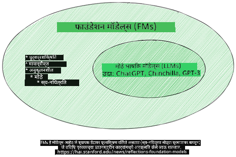
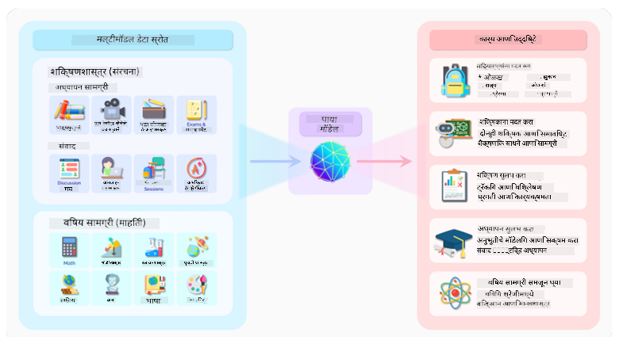
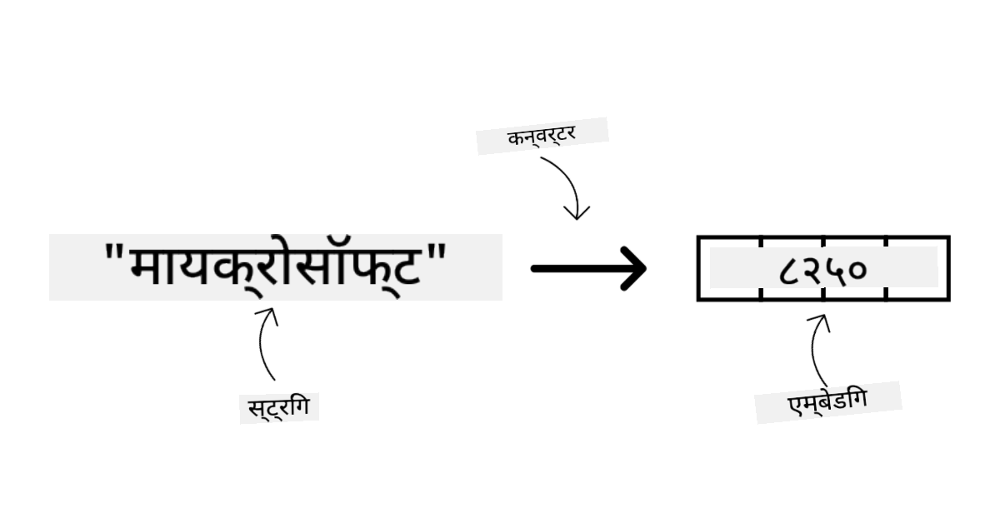
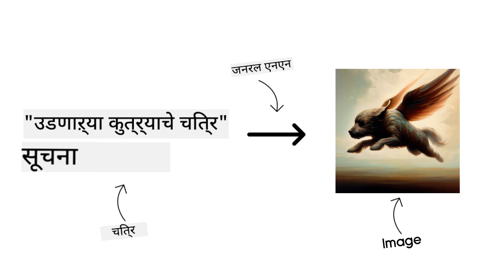
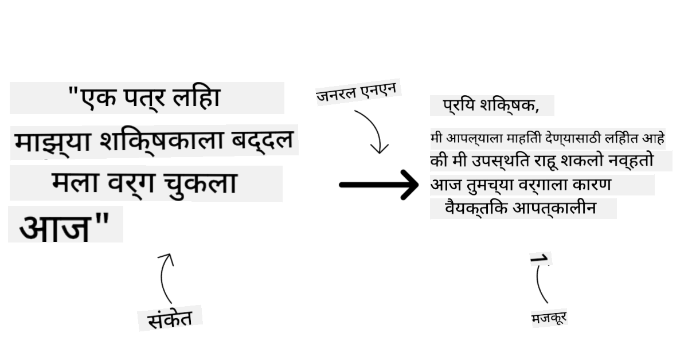
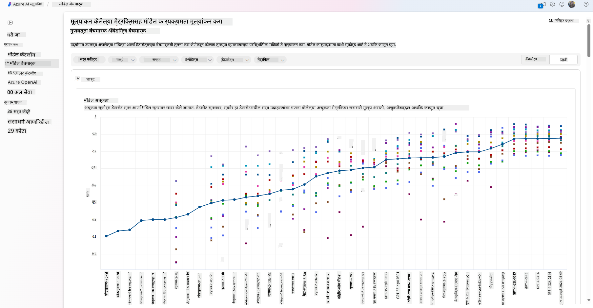
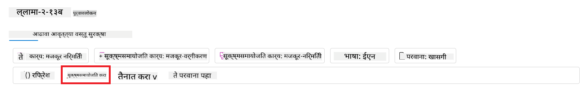
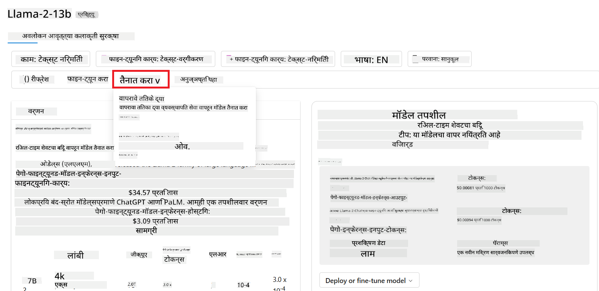
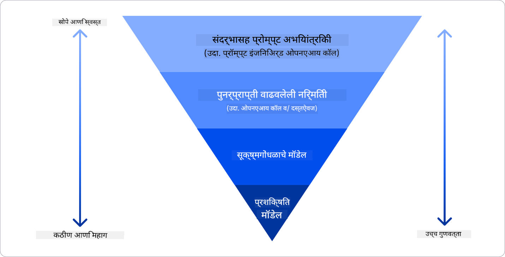

<!--
CO_OP_TRANSLATOR_METADATA:
{
  "original_hash": "e2f686f2eb794941761252ac5e8e090b",
  "translation_date": "2025-06-25T10:30:00+00:00",
  "source_file": "02-exploring-and-comparing-different-llms/README.md",
  "language_code": "mr"
}
-->
# विविध LLMs शोधणे आणि तुलना करणे

> _या धड्याचा व्हिडिओ पाहण्यासाठी वरील प्रतिमेवर क्लिक करा_

मागील धड्यात, आपण पाहिले की जनरेटिव्ह AI तंत्रज्ञानाच्या क्षेत्रात कसा बदल घडवून आणत आहे, मोठे भाषा मॉडेल्स (LLMs) कसे कार्य करतात आणि आमच्या स्टार्टअपसारखा व्यवसाय त्यांना त्यांच्या वापर प्रकरणांमध्ये कसा लागू करू शकतो आणि वाढवू शकतो! या अध्यायात, आम्ही विविध प्रकारच्या मोठ्या भाषा मॉडेल्सची (LLMs) तुलना करण्याचा आणि त्यांचे फायदे आणि तोटे समजून घेण्याचा विचार करत आहोत.

आमच्या स्टार्टअपच्या प्रवासातील पुढचा टप्पा म्हणजे सध्याच्या LLMs च्या लँडस्केपचा शोध घेणे आणि आमच्या वापर प्रकरणासाठी कोणते योग्य आहेत हे समजून घेणे.

## परिचय

हा धडा समाविष्ट करेल:

- सध्याच्या लँडस्केपमधील विविध प्रकारचे LLMs.
- Azure मध्ये तुमच्या वापर प्रकरणासाठी विविध मॉडेल्सची चाचणी करणे, पुनरावृत्ती करणे आणि तुलना करणे.
- LLM कसे तैनात करावे.

## शिकण्याची उद्दिष्टे

हा धडा पूर्ण केल्यानंतर, तुम्ही सक्षम असाल:

- तुमच्या वापर प्रकरणासाठी योग्य मॉडेल निवडणे.
- तुमच्या मॉडेलच्या कामगिरीची चाचणी कशी करावी, पुनरावृत्ती कशी करावी आणि कशी सुधारावी हे समजून घेणे.
- व्यवसाय मॉडेल्स कसे तैनात करतात हे जाणून घेणे.

## विविध प्रकारचे LLMs समजून घ्या

LLMs त्यांच्या आर्किटेक्चर, प्रशिक्षण डेटा आणि वापर प्रकरणाच्या आधारे एकाधिक श्रेणीकरणे असू शकतात. या फरकांना समजून घेणे आमच्या स्टार्टअपला परिस्थितीसाठी योग्य मॉडेल निवडण्यास मदत करेल आणि कामगिरीची चाचणी कशी करावी, पुनरावृत्ती कशी करावी आणि सुधारणा कशी करावी हे समजून घेण्यास मदत करेल.

अनेक भिन्न प्रकारची LLM मॉडेल्स आहेत, तुमच्या मॉडेलची निवड तुम्ही त्यांचा वापर कशासाठी करणार आहात, तुमचा डेटा, तुम्ही किती पैसे देण्यास तयार आहात यावर अवलंबून आहे.

जर तुम्हाला मजकूर, ऑडिओ, व्हिडिओ, प्रतिमा निर्मिती इत्यादींसाठी मॉडेल्स वापरण्याचा उद्देश असेल, तर तुम्ही वेगळ्या प्रकारचे मॉडेल निवडू शकता.

- **ऑडिओ आणि स्पीच ओळख**. या उद्देशासाठी, व्हिस्पर-प्रकारची मॉडेल्स उत्तम पर्याय आहेत कारण ते सामान्य-उद्देशीय आहेत आणि भाषण ओळखीसाठी लक्ष्यित आहेत. ते विविध ऑडिओवर प्रशिक्षित आहे आणि बहुभाषिक भाषण ओळखू शकते. [व्हिस्पर प्रकारच्या मॉडेल्स बद्दल अधिक जाणून घ्या](https://platform.openai.com/docs/models/whisper?WT.mc_id=academic-105485-koreyst).

- **प्रतिमा निर्मिती**. प्रतिमा निर्मितीसाठी, DALL-E आणि Midjourney हे दोन अतिशय प्रसिद्ध पर्याय आहेत. DALL-E Azure OpenAI द्वारे ऑफर केले जाते. [DALL-E बद्दल अधिक वाचा](https://platform.openai.com/docs/models/dall-e?WT.mc_id=academic-105485-koreyst) आणि या अभ्यासक्रमाच्या अध्याय 9 मध्ये देखील.

- **मजकूर निर्मिती**. बहुतेक मॉडेल्स मजकूर निर्मितीवर प्रशिक्षित आहेत आणि तुमच्याकडे GPT-3.5 ते GPT-4 पर्यंत मोठ्या प्रमाणात निवडी आहेत. ते विविध खर्चांसह येतात, GPT-4 सर्वात महाग आहे. [Azure OpenAI प्लेग्राउंड](https://oai.azure.com/portal/playground?WT.mc_id=academic-105485-koreyst) मध्ये तपासणे योग्य आहे की कोणती मॉडेल्स क्षमता आणि खर्चाच्या दृष्टीने तुमच्या गरजांसाठी सर्वोत्तम आहेत.

- **मल्टी-मोडॅलिटी**. जर तुम्ही इनपुट आणि आउटपुटमध्ये एकाधिक प्रकारच्या डेटाचा हाताळणी करण्याचा विचार करत असाल, तर तुम्हाला [gpt-4 turbo with vision किंवा gpt-4o](https://learn.microsoft.com/azure/ai-services/openai/concepts/models#gpt-4-and-gpt-4-turbo-models?WT.mc_id=academic-105485-koreyst) सारख्या मॉडेल्सकडे पाहायचे असू शकते - OpenAI मॉडेल्सची नवीनतम प्रकाशने - जी नैसर्गिक भाषा प्रक्रिया व्हिज्युअल समजून घेण्यास सक्षम आहेत, मल्टी-मोडल इंटरफेसद्वारे संवाद सक्षम करतात.

मॉडेल निवडणे म्हणजे तुम्हाला काही मूलभूत क्षमता मिळतात, ज्या कदाचित पुरेशा नसतील. अनेकदा तुमच्याकडे कंपनी विशिष्ट डेटा असतो ज्याबद्दल तुम्हाला LLM ला काहीतरी सांगण्याची आवश्यकता असते. त्याकडे कसे जावे याबद्दल काही वेगवेगळे पर्याय आहेत, त्याबद्दल पुढील विभागांमध्ये अधिक.

### फाउंडेशन मॉडेल्स विरुद्ध LLMs

फाउंडेशन मॉडेल हा शब्द [स्टॅनफोर्ड संशोधकांनी तयार केला होता](https://arxiv.org/abs/2108.07258?WT.mc_id=academic-105485-koreyst) आणि काही निकषांचे अनुसरण करणारे AI मॉडेल म्हणून परिभाषित केले होते, जसे की:

- **ते अनसुपरवाइज्ड लर्निंग किंवा सेल्फ-सुपरवाइज्ड लर्निंग वापरून प्रशिक्षित केले जातात**, म्हणजे ते लेबल नसलेल्या मल्टी-मोडल डेटावर प्रशिक्षित केले जातात आणि त्यांच्या प्रशिक्षण प्रक्रियेसाठी त्यांना मानवी टिप्पणी किंवा डेटाचे लेबलिंग आवश्यक नसते.
- **ते खूप मोठे मॉडेल्स आहेत**, ज्यांचे प्रशिक्षण अब्जावधी पॅरामीटर्सवर केलेल्या खूप खोल न्यूरल नेटवर्कवर आधारित आहे.
- **ते सामान्यतः इतर मॉडेल्ससाठी 'फाउंडेशन' म्हणून काम करण्याचा हेतू असतात**, म्हणजे त्यांचा वापर इतर मॉडेल्सच्या वर बांधण्यासाठी प्रारंभिक बिंदू म्हणून केला जाऊ शकतो, जे फाइन-ट्यूनिंग करून केले जाऊ शकते.

प्रतिमा स्रोत: [फाउंडेशन मॉडेल्स आणि मोठ्या भाषा मॉडेल्ससाठी आवश्यक मार्गदर्शक | बाबर एम भट्टी | मीडियम](https://thebabar.medium.com/essential-guide-to-foundation-models-and-large-language-models-27dab58f7404)

हा भेद आणखी स्पष्ट करण्यासाठी, ChatGPT हे एक उदाहरण घेऊया. ChatGPT ची पहिली आवृत्ती तयार करण्यासाठी, GPT-3.5 नावाच्या मॉडेलने फाउंडेशन मॉडेल म्हणून काम केले. याचा अर्थ असा की OpenAI ने GPT-3.5 ची एक ट्यून केलेली आवृत्ती तयार करण्यासाठी काही चॅट-विशिष्ट डेटाचा वापर केला जो संभाषणात्मक परिस्थितींमध्ये, जसे की चॅटबॉट्समध्ये चांगले कार्य करण्यासाठी विशेषीकृत होता.

प्रतिमा स्रोत: [2108.07258.pdf (arxiv.org)](https://arxiv.org/pdf/2108.07258.pdf?WT.mc_id=academic-105485-koreyst)

### ओपन सोर्स विरुद्ध मालकीचे मॉडेल्स

LLMs चे वर्गीकरण करण्याचा आणखी एक मार्ग म्हणजे ते ओपन सोर्स आहेत की मालकीचे.

ओपन-सोर्स मॉडेल्स ही मॉडेल्स आहेत जी सार्वजनिकरित्या उपलब्ध केली जातात आणि कोणालाही वापरता येतात. ते सहसा ते तयार करणाऱ्या कंपनीकडून किंवा संशोधन समुदायाद्वारे उपलब्ध करून दिले जातात. LLMs मध्ये विविध वापर प्रकरणांसाठी या मॉडेल्सचे निरीक्षण, सुधारित आणि सानुकूलित करण्याची परवानगी आहे. तथापि, ते नेहमीच उत्पादन वापरासाठी अनुकूलित केलेले नसतात आणि कदाचित मालकीच्या मॉडेल्सइतके कार्यक्षम नसतील. तसेच, ओपन-सोर्स मॉडेल्ससाठी निधी मर्यादित असू शकतो आणि ते दीर्घकालीन देखभाल केले जाऊ शकत नाहीत किंवा नवीनतम संशोधनासह अद्यतनित केले जाऊ शकत नाहीत. लोकप्रिय ओपन सोर्स मॉडेल्सच्या उदाहरणांमध्ये [Alpaca](https://crfm.stanford.edu/2023/03/13/alpaca.html?WT.mc_id=academic-105485-koreyst), [Bloom](https://huggingface.co/bigscience/bloom) आणि [LLaMA](https://llama.meta.com) यांचा समावेश आहे.

मालकीचे मॉडेल्स ही मॉडेल्स आहेत जी कंपनीच्या मालकीची आहेत आणि सार्वजनिकपणे उपलब्ध नाहीत. ही मॉडेल्स अनेकदा उत्पादन वापरासाठी अनुकूलित केली जातात. तथापि, त्यांना विविध वापर प्रकरणांसाठी निरीक्षण, सुधारित किंवा सानुकूलित करण्याची परवानगी नाही. तसेच, ते नेहमीच विनामूल्य उपलब्ध नसतात आणि त्यांचा वापर करण्यासाठी सदस्यता किंवा पेमेंट आवश्यक असू शकते. याशिवाय, मॉडेलच्या प्रशिक्षणासाठी वापरल्या जाणाऱ्या डेटावर वापरकर्त्यांचा नियंत्रण नसतो, याचा अर्थ असा की त्यांना डेटा गोपनीयता आणि AI च्या जबाबदार वापरासह वचनबद्धतेची खात्री करण्यासाठी मॉडेल मालकावर विश्वास ठेवावा लागतो. लोकप्रिय मालकीच्या मॉडेल्सच्या उदाहरणांमध्ये [OpenAI models](https://platform.openai.com/docs/models/overview?WT.mc_id=academic-105485-koreyst), [Google Bard](https://sapling.ai/llm/bard?WT.mc_id=academic-105485-koreyst) किंवा [Claude 2](https://www.anthropic.com/index/claude-2?WT.mc_id=academic-105485-koreyst) यांचा समावेश आहे.

### एम्बेडिंग विरुद्ध प्रतिमा निर्मिती विरुद्ध मजकूर आणि कोड निर्मिती

LLMs त्यांना निर्माण होणाऱ्या आउटपुटद्वारे देखील वर्गीकृत केले जाऊ शकतात.

एम्बेडिंग्ज ही मॉडेल्सची एक संच आहे जी मजकूराला संख्यात्मक स्वरूपात, ज्याला एम्बेडिंग म्हणतात, म्हणजे इनपुट मजकूराचे संख्यात्मक प्रतिनिधित्व. एम्बेडिंग्ज मशीनला शब्द किंवा वाक्यांमधील संबंध समजून घेणे सोपे करतात आणि इतर मॉडेल्सद्वारे इनपुट म्हणून वापरले जाऊ शकतात, जसे की वर्गीकरण मॉडेल्स किंवा क्लस्टरिंग मॉडेल्स ज्यांची संख्यात्मक डेटावर चांगली कामगिरी आहे. एम्बेडिंग मॉडेल्स अनेकदा ट्रान्सफर लर्निंगसाठी वापरली जातात, जिथे मॉडेल भरपूर डेटासह असलेल्या सरोगेट टास्कसाठी तयार केले जाते आणि नंतर मॉडेल वेट्स (एम्बेडिंग्स) इतर डाउनस्ट्रीम कार्यांसाठी पुन्हा वापरले जातात. या श्रेणीचे एक उदाहरण म्हणजे [OpenAI embeddings](https://platform.openai.com/docs/models/embeddings?WT.mc_id=academic-105485-koreyst).

प्रतिमा निर्मिती मॉडेल्स ही मॉडेल्स आहेत जी प्रतिमा निर्माण करतात. ही मॉडेल्स प्रतिमा संपादन, प्रतिमा संश्लेषण आणि प्रतिमा भाषांतरासाठी वापरली जातात. प्रतिमा निर्मिती मॉडेल्स मोठ्या प्रतिमांच्या डेटासेट्सवर प्रशिक्षित केल्या जातात, जसे की [LAION-5B](https://laion.ai/blog/laion-5b/?WT.mc_id=academic-105485-koreyst), आणि नवीन प्रतिमा निर्माण करण्यासाठी किंवा विद्यमान प्रतिमा संपादित करण्यासाठी वापरल्या जाऊ शकतात. इनपेंटिंग, सुपर-रेझोल्यूशन आणि कलरायझेशन तंत्रांसह. उदाहरणांमध्ये [DALL-E-3](https://openai.com/dall-e-3?WT.mc_id=academic-105485-koreyst) आणि [Stable Diffusion models](https://github.com/Stability-AI/StableDiffusion?WT.mc_id=academic-105485-koreyst) यांचा समावेश आहे.

मजकूर आणि कोड निर्मिती मॉडेल्स ही मॉडेल्स आहेत जी मजकूर किंवा कोड निर्माण करतात. ही मॉडेल्स मजकूर संक्षेपण, भाषांतर आणि प्रश्न उत्तरासाठी वापरली जातात. मजकूर निर्मिती मॉडेल्स मोठ्या मजकूराच्या डेटासेट्सवर प्रशिक्षित केल्या जातात, जसे की [BookCorpus](https://www.cv-foundation.org/openaccess/content_iccv_2015/html/Zhu_Aligning_Books_and_ICCV_2015_paper.html?WT.mc_id=academic-105485-koreyst), आणि नवीन मजकूर निर्माण करण्यासाठी किंवा प्रश्नांची उत्तरे देण्यासाठी वापरल्या जाऊ शकतात. कोड निर्मिती मॉडेल्स, जसे की [CodeParrot](https://huggingface.co/codeparrot?WT.mc_id=academic-105485-koreyst), मोठ्या कोडच्या डेटासेट्सवर प्रशिक्षित केल्या जातात, जसे की GitHub, आणि नवीन कोड निर्माण करण्यासाठी किंवा विद्यमान कोडमधील बग्स दुरुस्त करण्यासाठी वापरल्या जाऊ शकतात.

### एनकोडर-डिकोडर विरुद्ध केवळ डिकोडर

LLMs च्या विविध प्रकारच्या आर्किटेक्चरबद्दल बोलण्यासाठी, चला एक उपमा वापरूया.

कल्पना करा की तुमच्या व्यवस्थापकाने तुम्हाला विद्यार्थ्यांसाठी क्विझ लिहिण्याचे काम दिले आहे. तुमच्याकडे दोन सहकारी आहेत; एक सामग्री तयार करण्याचे काम पाहतो आणि दुसरा त्यांचे पुनरावलोकन करतो.

सामग्री निर्मिती करणारा म्हणजे केवळ डिकोडर मॉडेल, ते विषय पाहू शकतात आणि तुम्ही आधीच काय लिहिले आहे आणि त्यानंतर ते त्यावर आधारित एक कोर्स लिहू शकतात. ते आकर्षक आणि माहितीपूर्ण सामग्री लिहिण्यात खूप चांगले आहेत, परंतु ते विषय आणि शिकण्याच्या उद्दिष्टांना समजून घेण्यात खूप चांगले नाहीत. डिकोडर मॉडेल्सच्या काही उदाहरणांमध्ये GPT कुटुंबातील मॉडेल्स, जसे की GPT-3 समाविष्ट आहे.

पुनरावलोकन करणारा म्हणजे केवळ एनकोडर मॉडेल, ते लिहिलेला कोर्स आणि उत्तरे पाहतात, त्यांच्यातील संबंध लक्षात घेतात आणि संदर्भ समजतात, परंतु ते सामग्री निर्माण करण्यात चांगले नाहीत. केवळ एनकोडर मॉडेलचे एक उदाहरण म्हणजे BERT.

कल्पना करा की आपल्याकडे असा कोणी आहे जो क्विझ तयार करू शकतो आणि पुनरावलोकन करू शकतो, हा एनकोडर-डिकोडर मॉडेल आहे. काही उदाहरणांमध्ये BART आणि T5 यांचा समावेश आहे.

### सेवा विरुद्ध मॉडेल

आता, सेवा आणि मॉडेल यांच्यातील फरकाबद्दल बोलूया. सेवा ही एक उत्पादन आहे जी क्लाउड सेवा प्रदात्याद्वारे ऑफर केली जाते आणि ती अनेकदा मॉडेल्स, डेटा आणि इतर घटकांचे संयोजन असते. मॉडेल ही सेवेची मुख्य घटक आहे आणि ती अनेकदा फाउंडेशन मॉडेल असते, जसे की LLM.

सेवा अनेकदा उत्पादन वापरासाठी अनुकूलित केल्या जातात आणि त्या मॉडेल्सपेक्षा वापरण्यास सुलभ असतात, ग्राफिकल यूजर इंटरफेसद्वारे. तथापि, सेवा नेहमीच विनामूल्य उपलब्ध नसतात आणि त्यांचा वापर करण्यासाठी सदस्यता किंवा पेमेंट आवश्यक असू शकते, सेवा मालकाच्या उपकरणांचा आणि संसाधनांचा लाभ घेण्यासाठी, खर्च अनुकूलित करण्यासाठी आणि सहज स्केलिंग करण्यासाठी. सेवाचे एक उदाहरण म्हणजे [Azure OpenAI Service](https://learn.microsoft.com/azure/ai-services/openai/overview?WT.mc_id=academic-105485-koreyst), जे पे-एज-यू-गो दर योजना ऑफर करते, म्हणजे वापरकर्त्यांना ते सेवा किती वापरतात यानुसार शुल्क आकारले जाते. याशिवाय, Azure OpenAI Service एंटरप्राइझ-ग्रेड सुरक्षा आणि मॉडेल्सच्या क्षमतांवर जबाबदार AI फ्रेमवर्क ऑफर करते.

मॉडेल्स फक्त न्यूरल नेटवर्क आहेत, पॅरामीटर्स, वेट्स आणि इतरांसह. कंपन्यांना स्थानिकरित्या चालविण्यास अनुमती देणे, तथापि, उपकरणे खरेदी करणे, स्केल करण्यासाठी एक संरचना तयार करणे आणि एक परवाना खरेदी करणे किंवा एक ओपन-सो
- उद्योगातील मॉडेल आणि डेटासेटवर उपलब्ध असलेल्या बेंचमार्कची तुलना करा आणि कोणते व्यवसाय परिदृश्य पूर्ण करते हे [मॉडेल बेंचमार्क्स](https://learn.microsoft.com/azure/ai-studio/how-to/model-benchmarks?WT.mc_id=academic-105485-koreyst) पॅनलद्वारे मूल्यांकन करा.

- विशिष्ट कार्यभारामध्ये मॉडेलची कार्यक्षमता सुधारण्यासाठी कस्टम प्रशिक्षण डेटावर मॉडेलचे फाइन-ट्यून करा, Azure AI स्टुडिओच्या प्रयोग आणि ट्रॅकिंग क्षमतांचा लाभ घेत.

- मूळ पूर्व-प्रशिक्षित मॉडेल किंवा फाइन-ट्यून केलेले आवृत्ती रिमोट रिअल टाइम इन्फरन्स - व्यवस्थापित संगणना - किंवा सर्व्हरलेस API एंडपॉइंटवर - [पे-एज-यू-गो](https://learn.microsoft.com/azure/ai-studio/how-to/model-catalog-overview#model-deployment-managed-compute-and-serverless-api-pay-as-you-go?WT.mc_id=academic-105485-koreyst) - ऍप्लिकेशन्सला ते वापरण्यासाठी सक्षम करण्यासाठी तैनात करा.

> [!NOTE]
> कॅटलॉगमधील सर्व मॉडेल्स सध्या फाइन-ट्यूनिंग आणि/किंवा पे-एज-यू-गो तैनातीसाठी उपलब्ध नाहीत. मॉडेलच्या क्षमतांचा आणि मर्यादांचा तपशील जाणून घेण्यासाठी मॉडेल कार्ड तपासा.

## LLM परिणाम सुधारित करणे

आमच्या स्टार्टअप टीमने वेगवेगळ्या प्रकारचे LLMs आणि क्लाउड प्लॅटफॉर्म (Azure Machine Learning) शोधले आहेत जे आम्हाला वेगवेगळ्या मॉडेल्सची तुलना करण्यास, त्यांचे चाचणी डेटावर मूल्यांकन करण्यास, कार्यक्षमता सुधारण्यासाठी आणि त्यांना इन्फरन्स एंडपॉइंट्सवर तैनात करण्यास सक्षम करतात.

पण त्यांना पूर्व-प्रशिक्षित मॉडेल वापरण्याऐवजी फाइन-ट्यूनिंग कधी करावे? विशिष्ट कार्यभारावर मॉडेलची कार्यक्षमता सुधारण्यासाठी इतर कोणते दृष्टिकोन आहेत?

व्यवसायाला LLM कडून आवश्यक परिणाम मिळविण्यासाठी अनेक दृष्टिकोनांचा वापर करू शकतो. तुम्ही उत्पादनात LLM तैनात करताना वेगवेगळ्या प्रकारचे मॉडेल्स वेगवेगळ्या प्रशिक्षण पातळीसह निवडू शकता, जटिलता, किंमत आणि गुणवत्तेच्या विविध पातळ्यांसह. येथे काही वेगवेगळे दृष्टिकोन आहेत:

- **संदर्भासह प्रॉम्प्ट इंजिनिअरिंग**. कल्पना अशी आहे की तुम्हाला आवश्यक असलेल्या प्रतिसादाची खात्री करण्यासाठी तुम्ही प्रॉम्प्ट करताना पुरेसा संदर्भ द्या.

- **रीट्रिव्हल ऑगमेंटेड जनरेशन, RAG**. तुमचा डेटा डेटाबेस किंवा वेब एंडपॉइंटमध्ये असू शकतो उदाहरणार्थ, या डेटाची खात्री करण्यासाठी किंवा त्यातील एक उपसमुच्चय प्रॉम्प्ट करताना समाविष्ट केला जातो, तुम्ही संबंधित डेटा मिळवू शकता आणि तो वापरकर्त्याच्या प्रॉम्प्टचा भाग बनवू शकता.

- **फाइन-ट्यून केलेले मॉडेल**. येथे, तुम्ही तुमच्या स्वतःच्या डेटावर मॉडेलचे अधिक प्रशिक्षण घेतले आहे ज्यामुळे मॉडेल अधिक अचूक आणि तुमच्या गरजांसाठी प्रतिसादक्षम बनले आहे परंतु कदाचित महाग असू शकते.

चित्र स्रोत: [एंटरप्राइझेस LLMs कसे तैनात करतात | फिडलर एआय ब्लॉग](https://www.fiddler.ai/blog/four-ways-that-enterprises-deploy-llms?WT.mc_id=academic-105485-koreyst)

### संदर्भासह प्रॉम्प्ट इंजिनिअरिंग

पूर्व-प्रशिक्षित LLMs सामान्यीकृत नैसर्गिक भाषा कार्यांवर खूप चांगले कार्य करतात, अगदी त्यांना एका वाक्याने पूर्ण करण्यासाठी किंवा प्रश्नासह लहान प्रॉम्प्टसह कॉल करून – तथाकथित “शून्य-शॉट” शिक्षण.

तथापि, वापरकर्ता जितका अधिक आपली क्वेरी फ्रेम करू शकतो, सविस्तर विनंती आणि उदाहरणांसह – संदर्भ – उत्तर तितके अधिक अचूक आणि वापरकर्त्याच्या अपेक्षांशी जवळ असेल. अशा परिस्थितीत, जर प्रॉम्प्टमध्ये फक्त एक उदाहरण समाविष्ट असेल तर आपण “वन-शॉट” शिक्षणाबद्दल बोलतो आणि “फ्यू शॉट लर्निंग” जर त्यात एकाधिक उदाहरणे समाविष्ट असतील.
संदर्भासह प्रॉम्प्ट इंजिनिअरिंग ही सुरुवातीसाठी सर्वात किफायतशीर पद्धत आहे.

### रीट्रिव्हल ऑगमेंटेड जनरेशन (RAG)

LLMs ची मर्यादा आहे की ते उत्तर तयार करण्यासाठी त्यांच्या प्रशिक्षणादरम्यान वापरलेला डेटा वापरू शकतात. याचा अर्थ असा आहे की त्यांना त्यांच्या प्रशिक्षण प्रक्रियेनंतर घडलेल्या घटनांबद्दल काहीच माहिती नाही आणि ते सार्वजनिक नसलेल्या माहितीवर प्रवेश करू शकत नाहीत (जसे की कंपनी डेटा).
हे RAG द्वारे ओलांडले जाऊ शकते, एक तंत्र जे दस्तऐवजांच्या तुकड्यांच्या स्वरूपात बाह्य डेटासह प्रॉम्प्ट वाढवते, प्रॉम्प्ट लांबी मर्यादांचा विचार करते. हे व्हेक्टर डेटाबेस साधनांद्वारे समर्थित आहे ([Azure Vector Search](https://learn.microsoft.com/azure/search/vector-search-overview?WT.mc_id=academic-105485-koreyst) सारखे) जे विविध पूर्व-परिभाषित डेटा स्रोतांमधून उपयुक्त तुकडे पुनर्प्राप्त करतात आणि त्यांना प्रॉम्प्ट संदर्भात जोडतात.

जेव्हा एखाद्या व्यवसायाकडे पुरेसा डेटा, पुरेसा वेळ किंवा LLM फाइन-ट्यून करण्यासाठी संसाधने नसतात, परंतु तरीही विशिष्ट कार्यभारावर कार्यक्षमता सुधारण्याची आणि बनावट, म्हणजेच वास्तविकतेची किंवा हानिकारक सामग्रीची मिथ्याकरण कमी करण्याची इच्छा असते तेव्हा हे तंत्र खूप उपयुक्त ठरते.

### फाइन-ट्यून केलेले मॉडेल

फाइन-ट्यूनिंग ही ट्रान्सफर लर्निंगचा लाभ घेणारी प्रक्रिया आहे जी मॉडेलला डाउनस्ट्रीम टास्कसाठी ‘अॅडॉप्ट’ करण्यासाठी किंवा विशिष्ट समस्या सोडवण्यासाठी आहे. फ्यू-शॉट लर्निंग आणि RAG पासून वेगळे, यामुळे नवीन मॉडेल तयार होते, अद्यतनित वेट्स आणि बायसेससह. यासाठी एकल इनपुट (प्रॉम्प्ट) आणि त्यासह असलेले आउटपुट (पूर्णता) असलेल्या प्रशिक्षण उदाहरणांचा संच आवश्यक आहे.
हे पसंतीचे दृष्टिकोन असेल तर:

- **फाइन-ट्यून केलेले मॉडेल वापरणे**. एखाद्या व्यवसायाला उच्च कार्यक्षमता मॉडेल्सऐवजी कमी सक्षम मॉडेल्स (जसे की एम्बेडिंग मॉडेल्स) वापरायचे आहेत, परिणामी अधिक किफायतशीर आणि जलद समाधान मिळते.

- **प्रतिक्रिया वेळ विचारात घेणे**. विशिष्ट वापर प्रकरणासाठी विलंब महत्त्वाचा आहे, त्यामुळे अतिशय लांब प्रॉम्प्ट्स वापरणे शक्य नाही किंवा मॉडेलने शिकले पाहिजे अशी उदाहरणांची संख्या प्रॉम्प्ट लांबी मर्यादेशी जुळत नाही.

- **अप टू डेट राहणे**. एखाद्या व्यवसायाकडे खूप उच्च-गुणवत्तेचा डेटा आणि ग्राउंड ट्रुथ लेबल्स आणि वेळोवेळी हा डेटा अद्ययावत ठेवण्यासाठी आवश्यक संसाधने आहेत.

### प्रशिक्षित मॉडेल

LLM चे प्रशिक्षण पूर्णपणे शून्यातून सुरू करणे हे निःसंशयपणे सर्वात कठीण आणि अवघड दृष्टिकोन आहे, ज्यासाठी मोठ्या प्रमाणात डेटा, कुशल संसाधने आणि योग्य संगणकीय शक्तीची आवश्यकता आहे. एखाद्या व्यवसायाकडे डोमेन-विशिष्ट वापर प्रकरण आणि डोमेन-केंद्रित डेटाचे मोठ्या प्रमाणात असल्यास हा पर्याय फक्त विचारात घेतला पाहिजे.

## ज्ञान तपासणी

LLM पूर्णता परिणाम सुधारण्यासाठी चांगला दृष्टिकोन काय असू शकतो?

1. संदर्भासह प्रॉम्प्ट इंजिनिअरिंग
1. RAG
1. फाइन-ट्यून केलेले मॉडेल

A:3, जर तुमच्याकडे वेळ आणि संसाधने आणि उच्च गुणवत्ता डेटा असेल तर, फाइन-ट्यूनिंग हा अद्ययावत राहण्यासाठी चांगला पर्याय आहे. तथापि, जर तुम्ही गोष्टी सुधारण्यासाठी पहात असाल आणि तुमच्याकडे वेळ कमी असेल तर RAG विचारात घेणे योग्य आहे.

## 🚀 आव्हान

तुमच्या व्यवसायासाठी [RAG वापरण्याबद्दल](https://learn.microsoft.com/azure/search/retrieval-augmented-generation-overview?WT.mc_id=academic-105485-koreyst) अधिक वाचा.

## उत्तम कार्य, तुमचे शिक्षण सुरू ठेवा

हे धडा पूर्ण केल्यानंतर, आमच्या [जनरेटिव्ह AI लर्निंग संग्रह](https://aka.ms/genai-collection?WT.mc_id=academic-105485-koreyst) ला भेट द्या तुमचे जनरेटिव्ह AI ज्ञान वाढवण्यासाठी!

धडा 3 कडे जा जिथे आपण जबाबदारीने [जनरेटिव्ह AI सह तयार करणे](../03-using-generative-ai-responsibly/README.md?WT.mc_id=academic-105485-koreyst) पाहू!

**अस्वीकृती**:  
हे दस्तऐवज AI भाषांतर सेवा [Co-op Translator](https://github.com/Azure/co-op-translator) वापरून अनुवादित केले गेले आहे. आम्ही अचूकतेसाठी प्रयत्नशील असलो तरी कृपया लक्षात ठेवा की स्वयंचलित अनुवादांमध्ये त्रुटी किंवा अशुद्धता असू शकतात. मूळ भाषेतील दस्तऐवज हा प्राधिकृत स्रोत मानला जावा. महत्त्वाच्या माहितीसाठी, व्यावसायिक मानवी भाषांतराची शिफारस केली जाते. या भाषांतराचा वापर केल्याने उद्भवणाऱ्या कोणत्याही गैरसमज किंवा चुकीच्या अर्थासाठी आम्ही जबाबदार नाही.