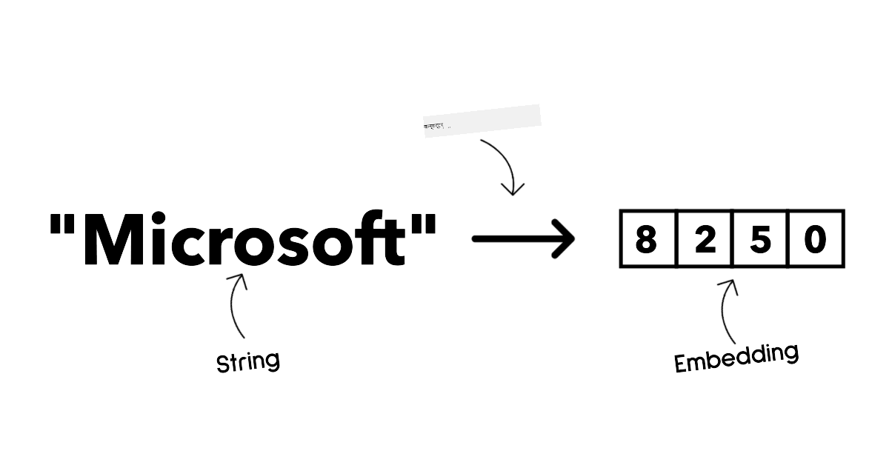
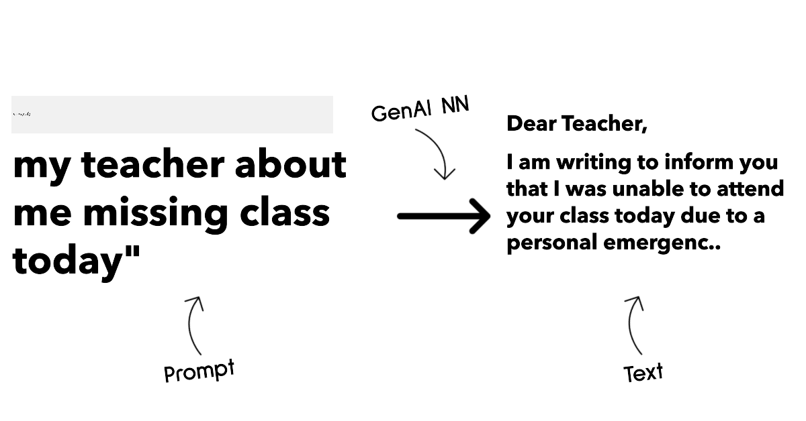
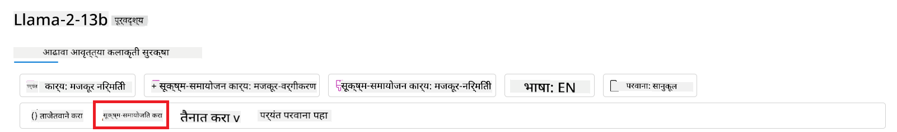
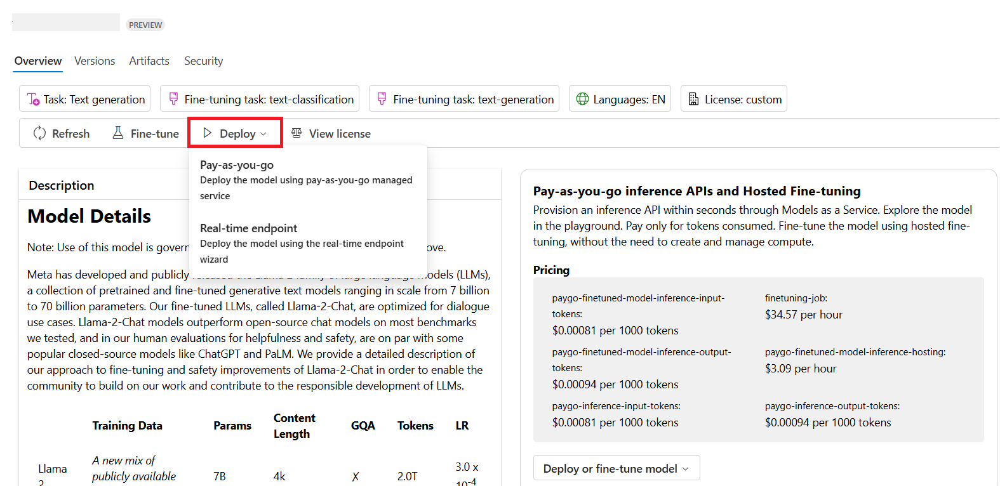

<!--
CO_OP_TRANSLATOR_METADATA:
{
  "original_hash": "e2f686f2eb794941761252ac5e8e090b",
  "translation_date": "2025-07-09T08:19:45+00:00",
  "source_file": "02-exploring-and-comparing-different-llms/README.md",
  "language_code": "mr"
}
-->
# वेगवेगळ्या LLMs चा अभ्यास आणि तुलना

> _या धड्याचा व्हिडिओ पाहण्यासाठी वरील प्रतिमेवर क्लिक करा_

मागील धड्यात आपण पाहिले की Generative AI तंत्रज्ञानाच्या क्षेत्रात कसे बदल घडवत आहे, Large Language Models (LLMs) कसे कार्य करतात आणि एखाद्या व्यवसायाने - जसे की आपला स्टार्टअप - त्यांचा वापर कसा करून आपले उद्दिष्ट साध्य करू शकतो आणि वाढ करू शकतो! या अध्यायात, आपण वेगवेगळ्या प्रकारच्या मोठ्या भाषा मॉडेल्सची तुलना करून त्यांचे फायदे आणि तोटे समजून घेणार आहोत.

आपल्या स्टार्टअपच्या प्रवासातील पुढील टप्पा म्हणजे सध्याच्या LLMs च्या क्षेत्राचा अभ्यास करणे आणि कोणते मॉडेल आपल्यासाठी योग्य आहे हे समजून घेणे.

## परिचय

हा धडा खालील गोष्टींचा आढावा घेईल:

- सध्याच्या क्षेत्रातील वेगवेगळ्या प्रकारचे LLMs.
- Azure मध्ये आपल्या वापरासाठी वेगवेगळ्या मॉडेल्सची चाचणी, पुनरावृत्ती आणि तुलना कशी करावी.
- LLM कसे तैनात करायचे.

## शिकण्याचे उद्दिष्ट

हा धडा पूर्ण केल्यानंतर, आपण सक्षम असाल:

- आपल्या वापरासाठी योग्य मॉडेल निवडू शकणे.
- मॉडेलची चाचणी, पुनरावृत्ती आणि कार्यक्षमता सुधारण्याची प्रक्रिया समजून घेणे.
- व्यवसाय कसे मॉडेल्स तैनात करतात हे जाणून घेणे.

## वेगवेगळ्या प्रकारच्या LLMs समजून घेणे

LLMs चे अनेक वर्गीकरण त्यांच्या आर्किटेक्चर, प्रशिक्षण डेटा आणि वापराच्या आधारावर करता येते. या फरकांना समजून घेणे आपल्या स्टार्टअपला योग्य मॉडेल निवडण्यास मदत करेल, तसेच चाचणी, पुनरावृत्ती आणि कार्यक्षमता सुधारण्याची प्रक्रिया समजेल.

LLM मॉडेल्सचे अनेक प्रकार आहेत, आणि आपला मॉडेल निवडण्याचा निर्णय आपण त्यांचा वापर कशासाठी करणार आहात, आपला डेटा काय आहे, आपण किती खर्च करण्यास तयार आहात यावर अवलंबून असतो.

आपण जर मॉडेल्सचा वापर मजकूर, ऑडिओ, व्हिडिओ, प्रतिमा निर्मितीसाठी करणार असाल, तर वेगळ्या प्रकारच्या मॉडेल्सची निवड करावी लागेल.

- **ऑडिओ आणि भाषण ओळख**. या उद्देशासाठी Whisper प्रकारचे मॉडेल्स उत्तम आहेत कारण ते सामान्य उद्देशासाठी आहेत आणि भाषण ओळखीसाठी डिझाइन केलेले आहेत. हे विविध ऑडिओवर प्रशिक्षित आहेत आणि बहुभाषिक भाषण ओळख करू शकतात. [Whisper प्रकारच्या मॉडेल्सबद्दल अधिक जाणून घ्या](https://platform.openai.com/docs/models/whisper?WT.mc_id=academic-105485-koreyst).

- **प्रतिमा निर्मिती**. प्रतिमा निर्मितीसाठी DALL-E आणि Midjourney हे दोन प्रसिद्ध पर्याय आहेत. DALL-E Azure OpenAI द्वारे उपलब्ध आहे. [DALL-E बद्दल अधिक वाचा](https://platform.openai.com/docs/models/dall-e?WT.mc_id=academic-105485-koreyst) आणि या अभ्यासक्रमाच्या अध्याय 9 मध्येही.

- **मजकूर निर्मिती**. बहुतेक मॉडेल्स मजकूर निर्मितीसाठी प्रशिक्षित केलेले आहेत आणि GPT-3.5 ते GPT-4 पर्यंत विविध पर्याय उपलब्ध आहेत. GPT-4 सर्वात महागडे आहे. आपल्या गरजेनुसार क्षमता आणि खर्च यांचा विचार करून [Azure OpenAI playground](https://oai.azure.com/portal/playground?WT.mc_id=academic-105485-koreyst) मध्ये कोणते मॉडेल योग्य आहे ते तपासणे फायदेशीर ठरेल.

- **मल्टी-मॉडॅलिटी**. जर आपण इनपुट आणि आउटपुटमध्ये अनेक प्रकारचा डेटा हाताळू इच्छित असाल, तर [gpt-4 turbo with vision किंवा gpt-4o](https://learn.microsoft.com/azure/ai-services/openai/concepts/models#gpt-4-and-gpt-4-turbo-models?WT.mc_id=academic-105485-koreyst) सारख्या मॉडेल्सकडे पाहू शकता - हे OpenAI चे नवीनतम मॉडेल्स आहेत जे नैसर्गिक भाषा प्रक्रिया आणि दृश्य समज यांना एकत्र करून मल्टी-मॉडॅल इंटरफेसद्वारे संवाद साधण्यास सक्षम आहेत.

मॉडेल निवडणे म्हणजे तुम्हाला काही मूलभूत क्षमता मिळतात, पण कधीकधी ते पुरेसे नसते. अनेकदा कंपनीकडे विशिष्ट डेटा असतो ज्याबद्दल LLM ला माहिती द्यावी लागते. त्यासाठी काही वेगवेगळे पर्याय आहेत, त्याबद्दल पुढील विभागात अधिक माहिती दिली जाईल.

### Foundation Models आणि LLMs मधील फरक

Foundation Model हा शब्द [Stanford संशोधकांनी तयार केला](https://arxiv.org/abs/2108.07258?WT.mc_id=academic-105485-koreyst) असून तो अशा AI मॉडेलसाठी वापरला जातो जे काही निकष पूर्ण करतात, जसे की:

- **हे मॉडेल्स unsupervised किंवा self-supervised learning वापरून प्रशिक्षित केले जातात**, म्हणजे त्यांना लेबल न केलेल्या मल्टी-मॉडॅल डेटावर प्रशिक्षित केले जाते आणि त्यांना प्रशिक्षणासाठी मानवी अ‍ॅनोटेशनची गरज नसते.
- **हे खूप मोठे मॉडेल्स असतात**, जे खोल न्यूरल नेटवर्क्सवर आधारित असतात आणि अब्जावधी पॅरामीटर्सवर प्रशिक्षित केलेले असतात.
- **हे सामान्यतः इतर मॉडेल्ससाठी ‘मूलाधार’ म्हणून वापरले जातात**, म्हणजे त्यांच्यावर फाइन-ट्यूनिंग करून इतर मॉडेल्स तयार करता येतात.

प्रतिमा स्रोत: [Essential Guide to Foundation Models and Large Language Models | by Babar M Bhatti | Medium](https://thebabar.medium.com/essential-guide-to-foundation-models-and-large-language-models-27dab58f7404)

या फरकाला अधिक स्पष्ट करण्यासाठी, ChatGPT चे उदाहरण घेऊया. ChatGPT चा पहिला आवृत्ती तयार करण्यासाठी GPT-3.5 या मॉडेलचा Foundation Model म्हणून वापर केला गेला. म्हणजे OpenAI ने काही चॅट-विशिष्ट डेटाचा वापर करून GPT-3.5 चे एक ट्यून केलेले आवृत्ती तयार केले, जे संभाषणात्मक परिस्थितींमध्ये चांगले काम करते, जसे की चॅटबॉट्स.

प्रतिमा स्रोत: [2108.07258.pdf (arxiv.org)](https://arxiv.org/pdf/2108.07258.pdf?WT.mc_id=academic-105485-koreyst)

### Open Source आणि Proprietary Models

LLMs चे आणखी एक वर्गीकरण म्हणजे ते open source आहेत की proprietary.

Open-source मॉडेल्स हे सार्वजनिकपणे उपलब्ध असतात आणि कोणतीही व्यक्ती त्यांचा वापर करू शकते. हे मॉडेल्स सहसा त्या कंपनीकडून किंवा संशोधन समुदायाकडून उपलब्ध करून दिले जातात ज्यांनी ते तयार केले आहेत. या मॉडेल्सची तपासणी, सुधारणा आणि सानुकूलन करता येते. मात्र, ते नेहमी उत्पादनासाठी अनुकूल नसू शकतात आणि proprietary मॉडेल्सइतके कार्यक्षम नसू शकतात. तसेच, open-source मॉडेल्ससाठी निधी मर्यादित असू शकतो, त्यामुळे त्यांचे दीर्घकालीन देखभाल किंवा नवीन संशोधनानुसार अद्यतने होणे शक्य नसते. लोकप्रिय open source मॉडेल्समध्ये [Alpaca](https://crfm.stanford.edu/2023/03/13/alpaca.html?WT.mc_id=academic-105485-koreyst), [Bloom](https://huggingface.co/bigscience/bloom) आणि [LLaMA](https://llama.meta.com) यांचा समावेश होतो.

Proprietary मॉडेल्स हे कंपनीच्या मालकीचे असतात आणि सार्वजनिकपणे उपलब्ध नसतात. हे मॉडेल्स सहसा उत्पादनासाठी अनुकूल केलेले असतात. मात्र, त्यांची तपासणी, सुधारणा किंवा सानुकूलन करण्यास परवानगी नसते. तसेच, ते नेहमी मोफत उपलब्ध नसतात आणि वापरासाठी सदस्यता किंवा पैसे द्यावे लागू शकतात. वापरकर्त्यांकडे मॉडेल प्रशिक्षणासाठी वापरल्या जाणाऱ्या डेटावर नियंत्रण नसते, त्यामुळे त्यांना डेटा गोपनीयता आणि जबाबदार AI वापर सुनिश्चित करण्यासाठी मॉडेल मालकावर विश्वास ठेवावा लागतो. लोकप्रिय proprietary मॉडेल्समध्ये [OpenAI मॉडेल्स](https://platform.openai.com/docs/models/overview?WT.mc_id=academic-105485-koreyst), [Google Bard](https://sapling.ai/llm/bard?WT.mc_id=academic-105485-koreyst) आणि [Claude 2](https://www.anthropic.com/index/claude-2?WT.mc_id=academic-105485-koreyst) यांचा समावेश होतो.

### Embedding, Image Generation, Text आणि Code Generation

LLMs त्यांच्या आउटपुटनुसार देखील वर्गीकृत करता येतात.

Embedding मॉडेल्स मजकूराला संख्यात्मक स्वरूपात रूपांतरित करतात, ज्याला embedding म्हणतात, जे इनपुट मजकूराचे संख्यात्मक प्रतिनिधित्व असते. Embeddings मशीन्सना शब्द किंवा वाक्यांमधील संबंध समजून घेणे सोपे करतात आणि इतर मॉडेल्ससाठी इनपुट म्हणून वापरले जाऊ शकतात, जसे की वर्गीकरण मॉडेल्स किंवा क्लस्टरिंग मॉडेल्स जे संख्यात्मक डेटावर चांगले काम करतात. Embedding मॉडेल्स सहसा ट्रान्सफर लर्निंगसाठी वापरले जातात, जिथे एखाद्या उपकार्याकरिता मोठ्या प्रमाणात डेटा असतो आणि नंतर त्या मॉडेलचे वजन (embeddings) इतर कार्यांसाठी पुनर्वापर केले जातात. या वर्गातील उदाहरण म्हणजे [OpenAI embeddings](https://platform.openai.com/docs/models/embeddings?WT.mc_id=academic-105485-koreyst).

प्रतिमा स्रोत: OpenAI

प्रतिमा निर्मिती मॉडेल्स प्रतिमा तयार करतात. हे मॉडेल्स प्रतिमा संपादन, संश्लेषण आणि भाषांतरासाठी वापरले जातात. हे मोठ्या प्रतिमा डेटासेटवर प्रशिक्षित केलेले असतात, जसे की [LAION-5B](https://laion.ai/blog/laion-5b/?WT.mc_id=academic-105485-koreyst), आणि नवीन प्रतिमा तयार करण्यासाठी किंवा विद्यमान प्रतिमा सुधारण्यासाठी वापरले जातात, जसे की इनपेंटिंग, सुपर-रिझोल्यूशन आणि रंगीकरण तंत्रे. उदाहरणे म्हणजे [DALL-E-3](https://openai.com/dall-e-3?WT.mc_id=academic-105485-koreyst) आणि [Stable Diffusion मॉडेल्स](https://github.com/Stability-AI/StableDiffusion?WT.mc_id=academic-105485-koreyst).

मजकूर आणि कोड निर्मिती मॉडेल्स मजकूर किंवा कोड तयार करतात. हे मॉडेल्स मजकूर संक्षेप, भाषांतर आणि प्रश्नोत्तरे यासाठी वापरले जातात. मजकूर निर्मिती मॉडेल्स मोठ्या मजकूर डेटासेटवर प्रशिक्षित केलेले असतात, जसे की [BookCorpus](https://www.cv-foundation.org/openaccess/content_iccv_2015/html/Zhu_Aligning_Books_and_ICCV_2015_paper.html?WT.mc_id=academic-105485-koreyst), आणि नवीन मजकूर तयार करतात किंवा प्रश्नांची उत्तरे देतात. कोड निर्मिती मॉडेल्स, जसे की [CodeParrot](https://huggingface.co/codeparrot?WT.mc_id=academic-105485-koreyst), मोठ्या कोड डेटासेटवर प्रशिक्षित केलेले असतात, जसे GitHub, आणि नवीन कोड तयार करतात किंवा विद्यमान कोडमधील बग दुरुस्त करतात.

### Encoder-Decoder आणि Decoder-only

LLMs च्या वेगवेगळ्या आर्किटेक्चरबद्दल बोलताना, एक उपमा वापरूया.

कल्पना करा की तुमच्या व्यवस्थापकाने तुम्हाला विद्यार्थ्यांसाठी क्विझ लिहिण्याचे काम दिले आहे. तुमचे दोन सहकारी आहेत; एक सामग्री तयार करतो आणि दुसरा ती तपासतो.

सामग्री तयार करणारा म्हणजे Decoder-only मॉडेलसारखा आहे, तो विषय पाहून आधी लिहिलेल्या गोष्टींचा आढावा घेतो आणि त्यानुसार कोर्स लिहितो. ते आकर्षक आणि माहितीपूर्ण सामग्री लिहिण्यात चांगले असतात, पण विषय आणि शिक्षण उद्दिष्टे समजून घेण्यात ते फारसे चांगले नसतात. Decoder मॉडेल्सची उदाहरणे म्हणजे GPT कुटुंबातील मॉडेल्स, जसे GPT-3.

तपासणी करणारा म्हणजे Encoder-only मॉडेलसारखा आहे, तो लिहिलेल्या कोर्स आणि उत्तरे पाहून त्यांच्यातील संबंध समजून घेतो, पण सामग्री तयार करण्यात तो चांगला नसतो. Encoder-only मॉडेलचे उदाहरण म्हणजे BERT.

आता कल्पना करा की आपल्याकडे असा कोणी आहे जो क्विझ तयार करतो आणि तपासतोही, तो Encoder-Decoder मॉडेल आहे. याचे उदाहरण म्हणजे BART आणि T5.

### सेवा आणि मॉडेल यातील फरक

आता, सेवा आणि मॉडेल यातील फरक पाहूया. सेवा म्हणजे क्लाउड सेवा प्रदात्याद्वारे दिलेले उत्पादन असते, जे अनेकदा मॉडेल्स, डेटा आणि इतर घटकांचा संयोग असतो. मॉडेल म्हणजे सेवेचा मुख्य घटक असतो, आणि तो सहसा Foundation Model किंवा LLM असतो.

सेवा सहसा उत्पादनासाठी अनुकूल केलेली असते आणि मॉडेल्सच्या तुलनेत वापरण्यास सोपी असते, विशेषतः ग्राफिकल यूजर इंटरफेसद्वारे. मात्र, सेवा नेहमी मोफत उपलब्ध नसते आणि वापरासाठी सदस्यता किंवा पैसे द्यावे लागू शकतात, ज्यामुळे वापरकर्ते सेवा मालकाच्या उपकरणे आणि संसाधने वापरू शकतात, खर्च कमी करतात आणि सहज स्केल करू शकतात. उदाहरणार्थ, [Azure OpenAI Service](https://learn.microsoft.com/azure/ai-services/openai/overview?WT.mc_id=academic-105485-koreyst) ही सेवा pay-as-you-go दर योजना देते, म्हणजे वापरकर्त्यांना त्यांच्या वापरानुसार शुल्क आकारले जाते. तसेच, Azure OpenAI Service एंटरप्राइझ-ग्रेड सुरक्षा आणि जबाबदार AI फ्रेमवर्क देखील प्रदान करते.

मॉडेल्स म्हणजे फक्त न्यूरल नेटवर्क्स, ज्यात पॅरामीटर्स, वजन आणि इतर घटक असतात. कंपन्यांना स्थानिक पातळीवर चालवायचे असल्यास, त्यांना उपकरणे खरेदी करावी लागतात, स्केलिंगसाठी संरचना तयार करावी लागते आणि परवाना खरेदी करावा लागतो किंवा open-source मॉडेल वापरावे लागते. LLaMA सारखे मॉडेल्स वापरासाठी उपलब्ध आहेत, पण त्यांना चालवण्यासाठी संगणकीय शक्ती आवश्यक असते.

## Azure वर वेगवेगळ्या मॉडेल्सची चाचणी आणि पुनरावृत्ती करून कार्यक्षमता समजून घेणे

एकदा आपल्या टीमने सध्याच्या LLMs चा अभ्यास करून त्यांच्या परिस्थितीसाठी काही चांगले पर्याय ओळखले की, पुढील टप्पा म्हणजे त्यांना त्यांच्या डेटावर आणि कार्यभारावर चाचणी करणे. ही एक पुनरावृत्ती प्रक्रिया आहे, जी प्रयोग आणि मोजमापांद्वारे केली जाते.
आम्ही मागील परिच्छेदांमध्ये उल्लेख केलेल्या बहुतेक मॉडेल्स (OpenAI मॉडेल्स, Llama2 सारखे ओपन सोर्स मॉडेल्स, आणि Hugging Face transformers) [Azure AI Studio](https://ai.azure.com/?WT.mc_id=academic-105485-koreyst) मधील [Model Catalog](https://learn.microsoft.com/azure/ai-studio/how-to/model-catalog-overview?WT.mc_id=academic-105485-koreyst) मध्ये उपलब्ध आहेत.

[Azure AI Studio](https://learn.microsoft.com/azure/ai-studio/what-is-ai-studio?WT.mc_id=academic-105485-koreyst) हा एक क्लाउड प्लॅटफॉर्म आहे जो विकसकांसाठी जनरेटिव्ह AI अॅप्लिकेशन्स तयार करण्यासाठी आणि संपूर्ण विकास जीवनचक्र - प्रयोगापासून मूल्यांकनापर्यंत - व्यवस्थापित करण्यासाठी डिझाइन केला आहे. हे सर्व Azure AI सेवा एका सोप्या GUI असलेल्या हबमध्ये एकत्र करते. Azure AI Studio मधील Model Catalog वापरकर्त्याला खालील सुविधा देते:

- कॅटलॉगमध्ये आवडता Foundation Model शोधा - तो खासगी असो किंवा ओपन सोर्स, कार्य, परवाना किंवा नावानुसार फिल्टर करून. शोध सुलभ करण्यासाठी, मॉडेल्स Azure OpenAI कलेक्शन, Hugging Face कलेक्शन आणि इतर अशा कलेक्शन्समध्ये वर्गीकृत केलेले आहेत.

- मॉडेल कार्ड पाहा, ज्यात वापराचा तपशीलवार वर्णन, प्रशिक्षण डेटा, कोड नमुने आणि अंतर्गत मूल्यांकन लायब्ररीवरील मूल्यांकन निकालांचा समावेश आहे.

- उद्योगातील उपलब्ध मॉडेल्स आणि डेटासेट्सवर आधारित बेंचमार्क्सची तुलना करा, ज्यामुळे कोणता मॉडेल व्यवसायाच्या परिस्थितीसाठी योग्य आहे हे ठरवता येते, [Model Benchmarks](https://learn.microsoft.com/azure/ai-studio/how-to/model-benchmarks?WT.mc_id=academic-105485-koreyst) पॅनलद्वारे.

- Azure AI Studio च्या प्रयोग आणि ट्रॅकिंग क्षमतांचा वापर करून विशिष्ट कामासाठी मॉडेलची कामगिरी सुधारण्यासाठी कस्टम प्रशिक्षण डेटावर मॉडेल फाइन-ट्यून करा.

- मूळ प्री-ट्रेन केलेले मॉडेल किंवा फाइन-ट्यून केलेले मॉडेल रिमोट रिअल-टाइम इन्फरन्स - मॅनेज्ड कॉम्प्युट - किंवा सर्व्हरलेस API एंडपॉइंटवर - [pay-as-you-go](https://learn.microsoft.com/azure/ai-studio/how-to/model-catalog-overview#model-deployment-managed-compute-and-serverless-api-pay-as-you-go?WT.mc_id=academic-105485-koreyst) - तैनात करा, ज्यामुळे अॅप्लिकेशन्सना ते वापरणे शक्य होते.

> [!NOTE]
> कॅटलॉगमधील सर्व मॉडेल्स सध्या फाइन-ट्यूनिंग आणि/किंवा pay-as-you-go तैनातीसाठी उपलब्ध नाहीत. मॉडेलच्या क्षमतांबाबत आणि मर्यादांबाबत तपशीलांसाठी मॉडेल कार्ड तपासा.

## LLM निकाल सुधारण्याबाबत

आम्ही आमच्या स्टार्टअप टीमसह विविध प्रकारचे LLMs आणि Azure Machine Learning या क्लाउड प्लॅटफॉर्मचा वापर करून वेगवेगळे मॉडेल्स तुलना केली, त्यांना चाचणी डेटावर मूल्यांकन केले, कामगिरी सुधारली आणि इन्फरन्स एंडपॉइंटवर तैनात केले.

पण प्री-ट्रेन केलेल्या मॉडेलऐवजी फाइन-ट्यूनिंग कधी करावी? विशिष्ट कामांसाठी मॉडेलची कामगिरी सुधारण्यासाठी इतर कोणते मार्ग आहेत?

व्यवसायाला आवश्यक निकाल मिळवण्यासाठी LLM वापरण्याचे अनेक मार्ग आहेत. उत्पादनात LLM तैनात करताना वेगवेगळ्या प्रकारचे मॉडेल्स निवडता येतात, ज्यात प्रशिक्षणाची वेगवेगळी पातळी, जटिलता, खर्च आणि गुणवत्ता यांचा समावेश असतो. काही वेगळे दृष्टिकोन खालीलप्रमाणे:

- **संदर्भासह प्रॉम्प्ट इंजिनिअरिंग**. प्रॉम्प्ट करताना पुरेसा संदर्भ देणे, ज्यामुळे आवश्यक उत्तरे मिळतील.

- **Retrieval Augmented Generation, RAG**. तुमचा डेटा डेटाबेस किंवा वेब एंडपॉइंटवर असू शकतो, ज्यामुळे प्रॉम्प्ट करताना संबंधित डेटा किंवा त्याचा एक भाग वापरकर्त्याच्या प्रॉम्प्टमध्ये समाविष्ट केला जाऊ शकतो.

- **फाइन-ट्यून केलेले मॉडेल**. येथे, तुम्ही तुमच्या स्वतःच्या डेटावर मॉडेल अधिक प्रशिक्षण दिले आहे, ज्यामुळे मॉडेल अधिक अचूक आणि प्रतिसादक्षम बनते, पण कदाचित खर्चिक ठरू शकते.

Img source: [Four Ways that Enterprises Deploy LLMs | Fiddler AI Blog](https://www.fiddler.ai/blog/four-ways-that-enterprises-deploy-llms?WT.mc_id=academic-105485-koreyst)

### संदर्भासह प्रॉम्प्ट इंजिनिअरिंग

प्री-ट्रेन केलेले LLMs सामान्य नैसर्गिक भाषा कार्यांवर चांगले काम करतात, अगदी लहान प्रॉम्प्टनेही, जसे की पूर्ण करायचा वाक्य किंवा प्रश्न – ज्याला “झिरो-शॉट” लर्निंग म्हणतात.

पण वापरकर्ता जितका अधिक तपशीलवार विनंती आणि उदाहरणांसह (संदर्भासह) प्रश्न मांडेल, तितकी उत्तरे अधिक अचूक आणि अपेक्षांनुसार असतील. जर प्रॉम्प्टमध्ये फक्त एक उदाहरण असेल तर त्याला “वन-शॉट” लर्निंग म्हणतात आणि जर अनेक उदाहरणे असतील तर “फ्यू शॉट लर्निंग” म्हणतात.
संदर्भासह प्रॉम्प्ट इंजिनिअरिंग हा सुरुवात करण्यासाठी सर्वात खर्च-प्रभावी मार्ग आहे.

### Retrieval Augmented Generation (RAG)

LLMs ला फक्त त्यांच्या प्रशिक्षणादरम्यान वापरलेल्या डेटाचा वापर करून उत्तर तयार करता येते. याचा अर्थ, प्रशिक्षणानंतर घडलेल्या घटनांची त्यांना माहिती नसते आणि ते कंपनीच्या गोपनीय माहितीप्रमाणे सार्वजनिक नसलेल्या माहितीपर्यंत पोहोचू शकत नाहीत.
हे RAG या तंत्रज्ञानाद्वारे पार करता येते, जे प्रॉम्प्टमध्ये बाह्य डेटाचे तुकडे (डॉक्युमेंट्सचे भाग) समाविष्ट करते, प्रॉम्प्ट लांबीच्या मर्यादांचा विचार करून. हे Vector डेटाबेस टूल्स (जसे की [Azure Vector Search](https://learn.microsoft.com/azure/search/vector-search-overview?WT.mc_id=academic-105485-koreyst)) द्वारे समर्थित आहे, जे विविध पूर्वनिर्धारित डेटास्रोतांमधून उपयुक्त तुकडे शोधून प्रॉम्प्ट संदर्भात जोडतात.

हा मार्ग व्यवसायासाठी उपयुक्त आहे जेव्हा त्यांच्याकडे पुरेसा डेटा, वेळ किंवा संसाधने नसतात फाइन-ट्यूनिंगसाठी, पण तरीही विशिष्ट कामगिरी सुधारायची असते आणि चुकीच्या माहिती किंवा हानिकारक सामग्रीच्या धोका कमी करायचा असतो.

### फाइन-ट्यून केलेले मॉडेल

फाइन-ट्यूनिंग हा एक प्रक्रिया आहे ज्यात ट्रान्सफर लर्निंगचा वापर करून मॉडेलला विशिष्ट कामासाठी किंवा समस्येचे निराकरण करण्यासाठी ‘जुळवून’ घेतले जाते. फ्यू शॉट लर्निंग आणि RAG पेक्षा वेगळे, यात नवीन मॉडेल तयार होते ज्यात वजन आणि बायस अपडेट केलेले असतात. यासाठी प्रशिक्षण उदाहरणांचा संच आवश्यक असतो ज्यात एक इनपुट (प्रॉम्प्ट) आणि त्याचा संबंधित आउटपुट (पूर्णता) असतो.
हा मार्ग पुढील परिस्थितीत प्राधान्याने वापरला जातो:

- **फाइन-ट्यून केलेले मॉडेल वापरणे**. व्यवसाय कमी क्षमतेचे फाइन-ट्यून केलेले मॉडेल्स (जसे की एम्बेडिंग मॉडेल्स) वापरू इच्छितो, जे जास्त कार्यक्षम मॉडेल्सच्या तुलनेत अधिक किफायतशीर आणि जलद उपाय देतात.

- **लेटन्सीचा विचार**. विशिष्ट वापरासाठी लेटन्सी महत्त्वाची आहे, त्यामुळे फार लांब प्रॉम्प्ट वापरणे शक्य नाही किंवा प्रॉम्प्ट लांबीच्या मर्यादेत येणाऱ्या उदाहरणांची संख्या मॉडेलने शिकणे शक्य नाही.

- **अप-टू-डेट राहणे**. व्यवसायाकडे उच्च दर्जाचा डेटा आणि ग्राउंड ट्रूथ लेबल्स आहेत आणि तो वेळोवेळी अद्ययावत ठेवण्यासाठी आवश्यक संसाधने आहेत.

### प्रशिक्षित मॉडेल

शून्यातून LLM प्रशिक्षण देणे हा निःसंशयपणे सर्वात कठीण आणि गुंतागुंतीचा मार्ग आहे, ज्यासाठी प्रचंड प्रमाणात डेटा, कौशल्य असलेले संसाधने आणि योग्य संगणकीय शक्ती आवश्यक आहे. हा पर्याय फक्त अशा परिस्थितीत विचारात घ्यावा जेथे व्यवसायाकडे विशिष्ट क्षेत्रासाठी वापर आणि मोठ्या प्रमाणात क्षेत्र-केन्द्रित डेटा असतो.

## ज्ञान तपासणी

LLM पूर्णता निकाल सुधारण्यासाठी चांगला मार्ग कोणता असू शकतो?

1. संदर्भासह प्रॉम्प्ट इंजिनिअरिंग  
1. RAG  
1. फाइन-ट्यून केलेले मॉडेल  

उत्तर: 3, जर तुमच्याकडे वेळ, संसाधने आणि उच्च दर्जाचा डेटा असेल तर फाइन-ट्यूनिंग हा अद्ययावत राहण्यासाठी चांगला पर्याय आहे. पण जर वेळ कमी असेल आणि सुधारणा करायची असेल तर प्रथम RAG विचारात घेणे फायदेशीर आहे.

## 🚀 आव्हान

तुमच्या व्यवसायासाठी [RAG कसा वापरायचा](https://learn.microsoft.com/azure/search/retrieval-augmented-generation-overview?WT.mc_id=academic-105485-koreyst) याबद्दल अधिक वाचा.

## छान काम, तुमचे शिक्षण सुरू ठेवा

हा धडा पूर्ण केल्यानंतर, आमच्या [Generative AI Learning collection](https://aka.ms/genai-collection?WT.mc_id=academic-105485-koreyst) मध्ये जाऊन तुमचे Generative AI ज्ञान अधिक वाढवा!

पुढील धडा 3 मध्ये चला, जिथे आपण पाहणार आहोत की [Generative AI जबाबदारीने कसे तयार करायचे](../03-using-generative-ai-responsibly/README.md?WT.mc_id=academic-105485-koreyst)!

**अस्वीकरण**:  
हा दस्तऐवज AI अनुवाद सेवा [Co-op Translator](https://github.com/Azure/co-op-translator) वापरून अनुवादित केला आहे. आम्ही अचूकतेसाठी प्रयत्नशील असलो तरी, कृपया लक्षात घ्या की स्वयंचलित अनुवादांमध्ये चुका किंवा अचूकतेची कमतरता असू शकते. मूळ दस्तऐवज त्याच्या स्थानिक भाषेत अधिकृत स्रोत मानला जावा. महत्त्वाच्या माहितीसाठी व्यावसायिक मानवी अनुवाद करण्याची शिफारस केली जाते. या अनुवादाच्या वापरामुळे उद्भवणाऱ्या कोणत्याही गैरसमजुती किंवा चुकीच्या अर्थलागी आम्ही जबाबदार नाही.