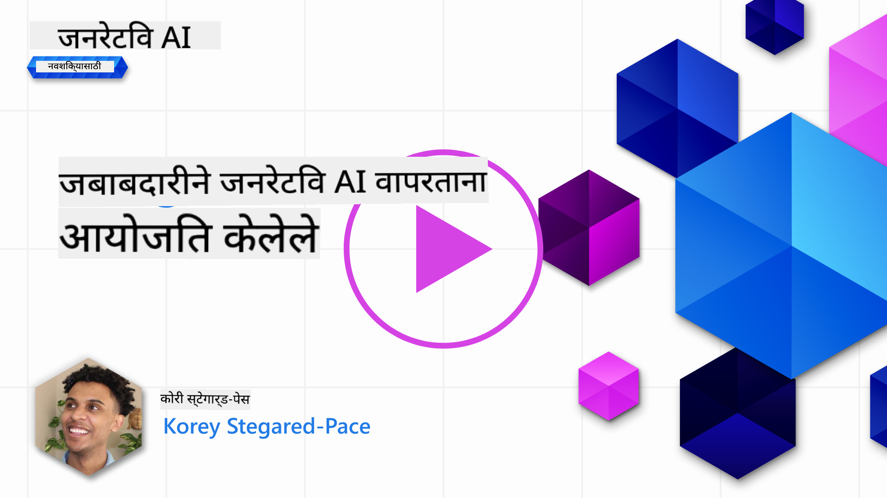
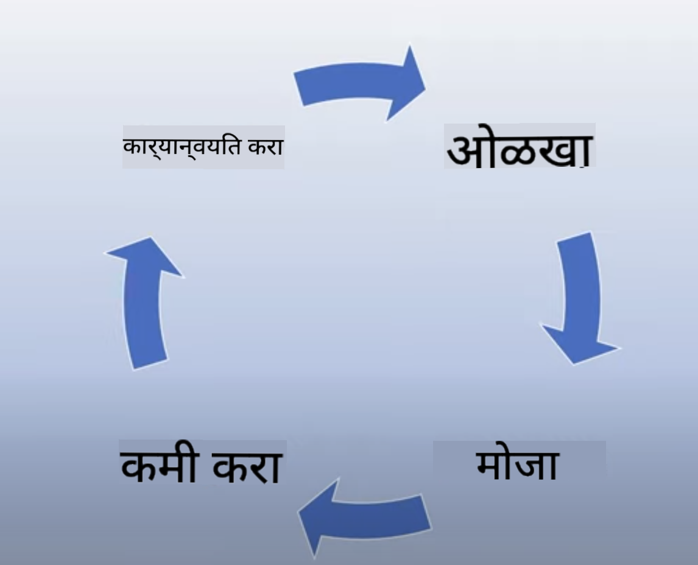
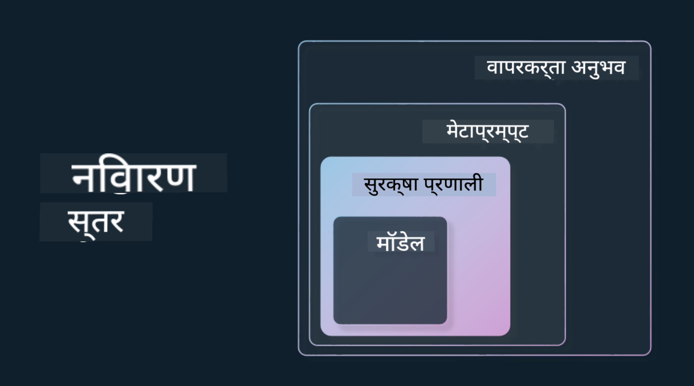

<!--
CO_OP_TRANSLATOR_METADATA:
{
  "original_hash": "13084c6321a2092841b9a081b29497ba",
  "translation_date": "2025-05-19T14:34:24+00:00",
  "source_file": "03-using-generative-ai-responsibly/README.md",
  "language_code": "mr"
}
-->
# जनरेटिव AI जबाबदारीने वापरणे

> _या धड्याचा व्हिडिओ पाहण्यासाठी वरील प्रतिमेवर क्लिक करा_

AI आणि विशेषतः जनरेटिव AI बद्दल आकर्षित होणे सोपे आहे, परंतु तुम्ही ते जबाबदारीने कसे वापराल हे विचारात घेणे आवश्यक आहे. तुम्हाला उत्पादन कसे न्याय्य, अहितकारक नसलेले आणि अधिक सुनिश्चित करायचे आहे यासारख्या गोष्टी विचारात घ्याव्या लागतील. हे प्रकरण तुम्हाला संदर्भ देण्याचे उद्दिष्ट ठेवते, काय विचार करावे आणि तुमच्या AI वापराचा सुधार करण्यासाठी सक्रिय पावले कशी उचलावीत.

## परिचय

हा धडा समाविष्ट करेल:

- जनरेटिव AI अनुप्रयोग तयार करताना जबाबदार AI ला प्राधान्य का द्यावे.
- जबाबदार AI चे मुख्य तत्त्व आणि ते जनरेटिव AI शी कसे संबंधित आहेत.
- रणनीती आणि साधनांच्या माध्यमातून या जबाबदार AI तत्त्वांचा वापर कसा करावा.

## शिकण्याची उद्दिष्टे

हा धडा पूर्ण केल्यानंतर तुम्हाला कळेल:

- जनरेटिव AI अनुप्रयोग तयार करताना जबाबदार AI चे महत्त्व.
- जनरेटिव AI अनुप्रयोग तयार करताना जबाबदार AI चे मुख्य तत्त्व कधी विचारात घ्यावे आणि लागू करावे.
- जबाबदार AI संकल्पनेला प्रत्यक्षात आणण्यासाठी तुम्हाला कोणती साधने आणि रणनीती उपलब्ध आहेत.

## जबाबदार AI तत्त्वे

जनरेटिव AI चा उत्साह कधीही जास्त नव्हता. या उत्साहामुळे या क्षेत्रात अनेक नवीन विकासक, लक्ष आणि निधी आले आहे. हे जनरेटिव AI वापरून उत्पादने आणि कंपन्या तयार करू इच्छिणाऱ्या कोणासाठीही खूप सकारात्मक आहे, परंतु आम्हाला जबाबदारीने पुढे जाणे देखील महत्त्वाचे आहे.

या कोर्समध्ये, आम्ही आमचा स्टार्टअप आणि आमचा AI शिक्षण उत्पादन तयार करण्यावर लक्ष केंद्रित करीत आहोत. आम्ही जबाबदार AI चे तत्त्व वापरू: न्याय, समावेशकता, विश्वासार्हता/सुरक्षा, सुरक्षा आणि गोपनीयता, पारदर्शकता आणि जबाबदारी. या तत्त्वांसह, आम्ही आमच्या उत्पादनांमध्ये जनरेटिव AI च्या वापराशी त्यांचा संबंध कसा आहे हे शोधू.

## तुम्हाला जबाबदार AI ला प्राधान्य का द्यावे

उत्पादन तयार करताना, तुमच्या वापरकर्त्याच्या सर्वोत्तम हिताची काळजी घेऊन मानव-केंद्रित दृष्टिकोन घेणे सर्वोत्तम परिणाम देते.

जनरेटिव AI ची अनोखी क्षमता म्हणजे वापरकर्त्यांसाठी उपयुक्त उत्तर, माहिती, मार्गदर्शन आणि सामग्री तयार करण्याची क्षमता. हे अनेक मॅन्युअल पायऱ्यांशिवाय केले जाऊ शकते जे खूप प्रभावी परिणाम देऊ शकतात. योग्य नियोजन आणि रणनीतीशिवाय, हे दुर्दैवाने तुमच्या वापरकर्त्यांसाठी, तुमच्या उत्पादनासाठी आणि समाजासाठी हानिकारक परिणाम देखील देऊ शकते.

आता आपण या संभाव्य हानिकारक परिणामांपैकी काही (पण सर्व नाही) पाहूया:

### भ्रम

जेव्हा LLM पूर्णपणे अर्थहीन सामग्री तयार करते किंवा ज्याला आपण इतर माहिती स्त्रोतांच्या आधारे वस्तुनिष्ठ चुकीचे मानतो तेव्हा त्याचे वर्णन करण्यासाठी भ्रम हा शब्द वापरला जातो.

उदाहरणार्थ, आपण आमच्या स्टार्टअपसाठी एक वैशिष्ट्य तयार करतो जे विद्यार्थ्यांना मॉडेलला ऐतिहासिक प्रश्न विचारण्याची परवानगी देते. एक विद्यार्थी प्रश्न विचारतो `Who was the sole survivor of Titanic?`

मॉडेल खालीलप्रमाणे प्रतिसाद तयार करते:

> _(स्रोत: [Flying bisons](https://flyingbisons.com?WT.mc_id=academic-105485-koreyst))_

हे खूप आत्मविश्वासपूर्ण आणि सखोल उत्तर आहे. दुर्दैवाने, हे चुकीचे आहे. थोड्या संशोधनासह, एखाद्याला कळेल की टायटॅनिक आपत्तीमध्ये एकापेक्षा जास्त जिवंत होते. या विषयाचा शोध घेण्यास सुरुवात करणाऱ्या विद्यार्थ्यासाठी, हे उत्तर पुरेसे प्रभावी असू शकते ज्यामुळे प्रश्न विचारला जाऊ नये आणि वस्तुस्थिती म्हणून स्वीकारले जावे. याचे परिणाम AI प्रणाली अविश्वसनीय होऊ शकतात आणि आमच्या स्टार्टअपच्या प्रतिष्ठेवर नकारात्मक परिणाम करू शकतात.

कोणत्याही दिलेल्या LLM च्या प्रत्येक पुनरावृत्तीसह, आम्ही भ्रम कमी करण्याच्या कार्यक्षमतेत सुधारणा पाहिली आहे. या सुधारणेसह, अनुप्रयोग निर्माते आणि वापरकर्ते म्हणून आम्हाला या मर्यादांबद्दल जागरूक राहणे आवश्यक आहे.

### हानिकारक सामग्री

आम्ही आधीच्या विभागात कव्हर केले जेव्हा LLM चुकीचे किंवा अर्थहीन प्रतिसाद तयार करते. आणखी एक धोका आपल्याला माहित असणे आवश्यक आहे जेव्हा एखादे मॉडेल हानिकारक सामग्रीसह प्रतिसाद देते.

हानिकारक सामग्रीची व्याख्या खालीलप्रमाणे केली जाऊ शकते:

- आत्महत्येच्या किंवा विशिष्ट गटांच्या हानीच्या सूचना देणे किंवा प्रोत्साहन देणे.
- द्वेषपूर्ण किंवा अपमानजनक सामग्री.
- कोणत्याही प्रकारच्या हल्ल्याचे नियोजन किंवा हिंसक कृत्ये मार्गदर्शन करणे.
- बेकायदेशीर सामग्री शोधण्यासाठी किंवा बेकायदेशीर कृत्ये करण्याच्या सूचना देणे.
- लैंगिकदृष्ट्या स्पष्ट सामग्री प्रदर्शित करणे.

आमच्या स्टार्टअपसाठी, आम्हाला हे सुनिश्चित करायचे आहे की आमच्याकडे विद्यार्थ्यांना हा प्रकारचा कंटेंट पाहण्यापासून रोखण्यासाठी योग्य साधने आणि रणनीती आहेत.

### न्यायाचा अभाव

न्यायाची व्याख्या "एखादी AI प्रणाली पक्षपात आणि भेदभावापासून मुक्त आहे आणि ती सर्वांशी न्याय्य आणि समान वागणूक देते याची खात्री करणे" म्हणून केली जाते. जनरेटिव AI च्या जगात, आम्हाला हे सुनिश्चित करायचे आहे की वंचित गटांच्या बहिष्कृत दृष्टिकोनांची मॉडेलच्या आउटपुटद्वारे पुनरावृत्ती केली जात नाही.

या प्रकारचे आउटपुट केवळ आमच्या वापरकर्त्यांसाठी सकारात्मक उत्पादन अनुभव तयार करण्यास विनाशकारी नाहीत तर ते समाजाला अधिक हानी पोहोचवतात. अनुप्रयोग निर्माते म्हणून, आम्ही जनरेटिव AI सह उपाय तयार करताना नेहमीच विस्तृत आणि विविध वापरकर्ता आधार लक्षात ठेवावा.

## जनरेटिव AI जबाबदारीने कसा वापरायचा

आता आम्ही जबाबदार जनरेटिव AI चे महत्त्व ओळखले आहे, चला चार पावले पाहूया जी आम्ही आमच्या AI समाधानांची जबाबदारीने निर्मिती करण्यासाठी घेऊ शकतो:

### संभाव्य हानिकारक परिणाम मोजा

सॉफ्टवेअर चाचणीमध्ये, आम्ही वापरकर्त्याच्या अनुप्रयोगावर अपेक्षित क्रियांची चाचणी करतो. त्याचप्रमाणे, वापरकर्त्यांनी सर्वात जास्त वापरले जाणारे विविध प्रॉम्प्टस चाचणी करणे संभाव्य हानिकारक परिणाम मोजण्यासाठी एक चांगला मार्ग आहे.

आमचा स्टार्टअप एक शिक्षण उत्पादन तयार करत असल्याने, शिक्षणाशी संबंधित प्रॉम्प्टची यादी तयार करणे चांगले होईल. हे विशिष्ट विषय, ऐतिहासिक तथ्य आणि विद्यार्थी जीवनाविषयी प्रॉम्प्ट कव्हर करण्यासाठी असू शकते.

### संभाव्य हानिकारक परिणाम कमी करा

आता आम्ही मॉडेल आणि त्याच्या प्रतिसादांमुळे होणाऱ्या संभाव्य हानिकारक परिणामांना रोखण्यासाठी किंवा मर्यादित करण्याचे मार्ग शोधण्याची वेळ आली आहे. आम्ही हे चार वेगवेगळ्या स्तरांमध्ये पाहू शकतो:

- **मॉडेल**. योग्य वापरासाठी योग्य मॉडेल निवडणे. मोठे आणि अधिक जटिल मॉडेल्स जसे की GPT-4 लहान आणि अधिक विशिष्ट वापरांवर लागू केल्यास हानिकारक सामग्रीचा अधिक धोका निर्माण करू शकतात. तुमच्या प्रशिक्षण डेटाचा वापर करून फाइन-ट्यून करणे देखील हानिकारक सामग्रीचा धोका कमी करते.

- **सुरक्षा प्रणाली**. सुरक्षा प्रणाली म्हणजे मॉडेल सेवा देणाऱ्या प्लॅटफॉर्मवरील साधने आणि कॉन्फिगरेशन्सचा संच जो हानिकारक परिणाम कमी करण्यास मदत करतो. याचे एक उदाहरण Azure OpenAI सेवेसाठी सामग्री फिल्टरिंग प्रणाली आहे. प्रणालींनी देखील जेलब्रेक हल्ले आणि बॉट्समधून येणाऱ्या विनंत्यांसारखी अवांछित क्रियाकलाप ओळखले पाहिजेत.

- **मेटाप्रॉम्प्ट**. मेटाप्रॉम्प्ट आणि ग्राउंडिंग हे काही वर्तन आणि माहितीच्या आधारे मॉडेलला निर्देशित किंवा मर्यादित करण्याचे मार्ग आहेत. हे मॉडेलच्या काही मर्यादांची व्याख्या करण्यासाठी सिस्टम इनपुट्सचा वापर करणे असू शकते. याव्यतिरिक्त, प्रणालीच्या क्षेत्र किंवा क्षेत्राशी अधिक संबंधित आउटपुट प्रदान करणे.

हे विश्वसनीय स्त्रोतांच्या निवडीमधून फक्त माहिती खेचण्यासाठी मॉडेलला Retrieval Augmented Generation (RAG) सारख्या तंत्रांचा वापर करणे देखील असू शकते. या कोर्समध्ये [शोध अनुप्रयोग तयार करण्यासाठी](../08-building-search-applications/README.md?WT.mc_id=academic-105485-koreyst) एक धडा आहे.

- **वापरकर्ता अनुभव**. अंतिम स्तर म्हणजे वापरकर्ता आमच्या अनुप्रयोगाच्या इंटरफेसद्वारे मॉडेलसह थेट संवाद साधतो. अशा प्रकारे आम्ही UI/UX डिझाइन करू शकतो ज्यामुळे वापरकर्ता मॉडेलला पाठवू शकणाऱ्या इनपुट्सच्या प्रकारांवर मर्यादा घालू शकतो तसेच वापरकर्त्याला प्रदर्शित केलेला मजकूर किंवा प्रतिमा. AI अनुप्रयोग तैनात करताना, आमच्या जनरेटिव AI अनुप्रयोग काय करू शकतो आणि काय करू शकत नाही याबद्दल आम्हाला पारदर्शक असणे आवश्यक आहे.

आमच्याकडे [AI अनुप्रयोगांसाठी UX डिझाइन करणे](../12-designing-ux-for-ai-applications/README.md?WT.mc_id=academic-105485-koreyst) या विषयावर एक संपूर्ण धडा आहे.

- **मॉडेलचे मूल्यांकन करा**. LLM सह काम करणे आव्हानात्मक असू शकते कारण आपल्याकडे नेहमीच मॉडेलवर प्रशिक्षण दिलेल्या डेटाचे नियंत्रण नसते. तरीही, आम्हाला नेहमीच मॉडेलची कार्यक्षमता आणि आउटपुटचे मूल्यांकन करावे लागते. मॉडेलची अचूकता, समानता, ग्राउंडेडनेस आणि आउटपुटची प्रासंगिकता मोजणे अद्याप महत्त्वाचे आहे. हे भागधारक आणि वापरकर्त्यांसाठी पारदर्शकता आणि विश्वास प्रदान करण्यात मदत करते.

### जबाबदार जनरेटिव AI समाधान चालवा

तुमच्या AI अनुप्रयोगांभोवती एक ऑपरेशनल प्रॅक्टिस तयार करणे ही अंतिम अवस्था आहे. यामध्ये आमच्या स्टार्टअपच्या इतर भागांसह भागीदारी करणे समाविष्ट आहे जसे की कायदेशीर आणि सुरक्षा जेणेकरून आम्ही सर्व नियामक धोरणांचे पालन करतो. लाँच करण्यापूर्वी, आम्हाला वितरण, घटना हाताळणे आणि रोलबॅक याभोवती योजना तयार करायच्या आहेत जेणेकरून आमच्या वापरकर्त्यांना वाढ होण्यापासून कोणतीही हानी होऊ नये.

## साधने

जबाबदार AI उपाय विकसित करणे हे काम खूप जास्त वाटू शकते, परंतु हे प्रयत्नांच्या किमतीचे आहे. जनरेटिव AI क्षेत्र वाढत असताना, विकसकांना जबाबदारीने त्यांच्या कार्यप्रवाहात कार्यक्षमतेने एकत्रित करण्यात मदत करण्यासाठी अधिक साधने परिपक्व होतील. उदाहरणार्थ, [Azure AI सामग्री सुरक्षा](https://learn.microsoft.com/azure/ai-services/content-safety/overview?WT.mc_id=academic-105485-koreyst) API विनंतीद्वारे हानिकारक सामग्री आणि प्रतिमा शोधण्यात मदत करू शकते.

## ज्ञान तपासणी

जबाबदार AI वापर सुनिश्चित करण्यासाठी तुम्हाला कोणत्या गोष्टींची काळजी घेणे आवश्यक आहे?

1. उत्तर योग्य आहे की नाही.
2. हानिकारक वापर, AI गुन्हेगारी हेतूंसाठी वापरला जात नाही.
3. AI पक्षपात आणि भेदभावापासून मुक्त आहे याची खात्री करणे.

A: 2 आणि 3 योग्य आहेत. जबाबदार AI तुम्हाला हानिकारक प्रभाव आणि पक्षपात कमी कसे करावे हे विचार करण्यास मदत करते आणि अधिक.

## 🚀 आव्हान

[Azure AI सामग्री सुरक्षा](https://learn.microsoft.com/azure/ai-services/content-safety/overview?WT.mc_id=academic-105485-koreyst) बद्दल वाचा आणि तुमच्या वापरासाठी तुम्ही काय स्वीकारू शकता ते पहा.

## छान काम, तुमचे शिक्षण सुरू ठेवा

हा धडा पूर्ण केल्यानंतर, आमच्या [जनरेटिव AI शिक्षण संग्रह](https://aka.ms/genai-collection?WT.mc_id=academic-105485-koreyst) ला पहा आणि तुमचे जनरेटिव AI ज्ञान वाढवा!

पुढील धड्यात जा जिथे आम्ही [प्रॉम्प्ट इंजिनिअरिंग मूलतत्त्वे](../04-prompt-engineering-fundamentals/README.md?WT.mc_id=academic-105485-koreyst) पाहणार आहोत!

**अस्वीकरण**:  
हा दस्तऐवज AI भाषांतर सेवा [Co-op Translator](https://github.com/Azure/co-op-translator) वापरून अनुवादित करण्यात आला आहे. आम्ही अचूकतेसाठी प्रयत्नशील असलो तरी, कृपया लक्षात ठेवा की स्वयंचलित भाषांतरे त्रुटी किंवा अशुद्धता असू शकतात. मूळ भाषेतील मूळ दस्तऐवज अधिकृत स्रोत म्हणून विचारात घ्यावा. महत्त्वाच्या माहितीसाठी, व्यावसायिक मानव भाषांतराची शिफारस केली जाते. या भाषांतराचा वापर केल्याने उद्भवणाऱ्या कोणत्याही गैरसमजुतींसाठी किंवा चुकीच्या अर्थ लावल्याबद्दल आम्ही जबाबदार नाही.