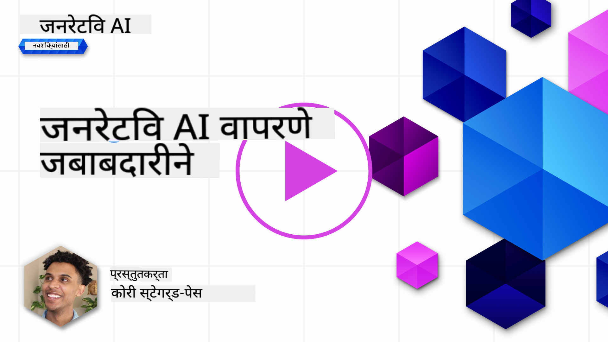
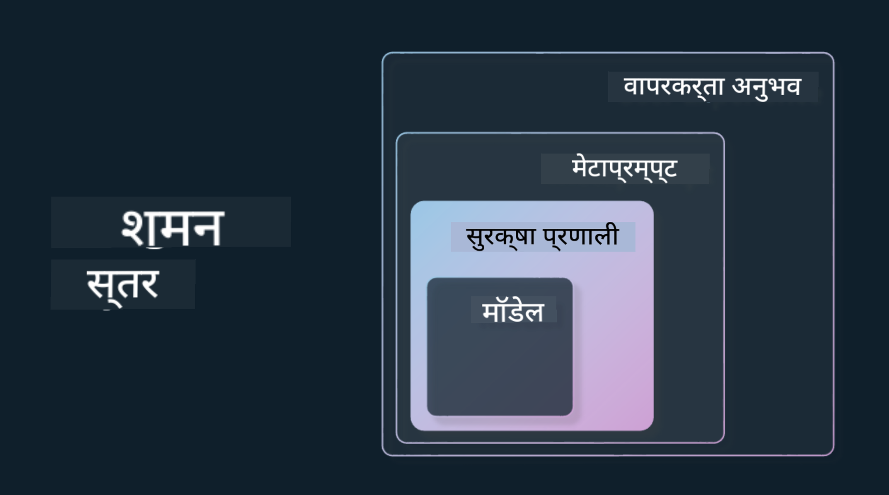

<!--
CO_OP_TRANSLATOR_METADATA:
{
  "original_hash": "4d57fad773cbeb69c5dd62e65c34200d",
  "translation_date": "2025-10-17T13:41:51+00:00",
  "source_file": "03-using-generative-ai-responsibly/README.md",
  "language_code": "mr"
}
-->
# जनरेटिव AI जबाबदारीने वापरणे

> _वरील प्रतिमेवर क्लिक करून या धड्याचा व्हिडिओ पहा_

AI आणि विशेषतः जनरेटिव AI च्या आकर्षणात पडणे सोपे आहे, परंतु तुम्हाला ते जबाबदारीने कसे वापरायचे याचा विचार करणे आवश्यक आहे. तुम्हाला उत्पादन कसे निष्पक्ष, हानिकारक नसलेले आणि अधिक कसे सुनिश्चित करायचे यासारख्या गोष्टींचा विचार करणे आवश्यक आहे. या अध्यायाचा उद्देश तुम्हाला उल्लेख केलेल्या संदर्भ, विचार करण्याच्या गोष्टी आणि AI वापर सुधारण्यासाठी सक्रिय पावले कशी उचलायची याबद्दल मार्गदर्शन करणे आहे.

## परिचय

या धड्यात आपण शिकणार आहोत:

- जनरेटिव AI अॅप्लिकेशन्स तयार करताना जबाबदार AI का प्राधान्य द्यावे.
- जबाबदार AI चे मुख्य तत्त्व आणि ते जनरेटिव AI शी कसे संबंधित आहेत.
- रणनीती आणि साधनांद्वारे जबाबदार AI तत्त्वांचा सराव कसा करायचा.

## शिकण्याची उद्दिष्टे

हा धडा पूर्ण केल्यानंतर तुम्हाला खालील गोष्टी माहित असतील:

- जनरेटिव AI अॅप्लिकेशन्स तयार करताना जबाबदार AI चे महत्त्व.
- जनरेटिव AI अॅप्लिकेशन्स तयार करताना जबाबदार AI चे मुख्य तत्त्व कधी विचारात घ्यावे आणि लागू करावे.
- जबाबदार AI चा संकल्पना प्रत्यक्षात आणण्यासाठी कोणती साधने आणि रणनीती उपलब्ध आहेत.

## जबाबदार AI तत्त्वे

जनरेटिव AI चा उत्साह कधीही जास्त नव्हता. या उत्साहामुळे या क्षेत्रात अनेक नवीन विकसक, लक्ष आणि निधी आला आहे. हे जनरेटिव AI वापरून उत्पादने आणि कंपन्या तयार करू इच्छिणाऱ्या कोणासाठीही खूप सकारात्मक आहे, परंतु जबाबदारीने पुढे जाणे देखील महत्त्वाचे आहे.

या कोर्समध्ये, आम्ही आमचे स्टार्टअप आणि आमचे AI शिक्षण उत्पादन तयार करण्यावर लक्ष केंद्रित करत आहोत. आम्ही जबाबदार AI चे तत्त्व वापरू: निष्पक्षता, समावेशकता, विश्वासार्हता/सुरक्षितता, सुरक्षा आणि गोपनीयता, पारदर्शकता आणि जबाबदारी. या तत्त्वांसह, आम्ही आमच्या उत्पादनांमध्ये जनरेटिव AI चा वापर कसा संबंधित आहे हे शोधू.

## जबाबदार AI का प्राधान्य द्यावे

उत्पादन तयार करताना, मानवी-केंद्रित दृष्टिकोन घेऊन तुमच्या वापरकर्त्याच्या सर्वोत्तम हिताचा विचार केल्याने सर्वोत्तम परिणाम मिळतो.

जनरेटिव AI ची अनोखी क्षमता म्हणजे वापरकर्त्यांसाठी उपयुक्त उत्तर, माहिती, मार्गदर्शन आणि सामग्री तयार करण्याची क्षमता. हे अनेक मॅन्युअल चरणांशिवाय केले जाऊ शकते ज्यामुळे खूप प्रभावी परिणाम मिळू शकतो. योग्य नियोजन आणि रणनीतीशिवाय, यामुळे दुर्दैवाने तुमच्या वापरकर्त्यांसाठी, तुमच्या उत्पादनासाठी आणि समाजासाठी काही हानिकारक परिणाम होऊ शकतात.

चला या संभाव्य हानिकारक परिणामांपैकी काही (पण सर्व नाही) पाहूया:

### भ्रम

भ्रम हा एक शब्द आहे जो LLM पूर्णपणे निरर्थक सामग्री तयार करतो किंवा इतर माहिती स्रोतांवर आधारित आम्हाला माहित असलेल्या तथ्यात्मक चुकीच्या गोष्टींना वर्णन करण्यासाठी वापरला जातो.

उदाहरणार्थ, आपण आमच्या स्टार्टअपसाठी एक वैशिष्ट्य तयार करतो जे विद्यार्थ्यांना ऐतिहासिक प्रश्न मॉडेलला विचारण्याची परवानगी देते. एक विद्यार्थी प्रश्न विचारतो `टायटॅनिकचा एकमेव वाचलेला कोण होता?`

मॉडेल खालीलप्रमाणे उत्तर तयार करते:

> _(स्रोत: [Flying bisons](https://flyingbisons.com?WT.mc_id=academic-105485-koreyst))_

हे उत्तर खूप आत्मविश्वासपूर्ण आणि सखोल आहे. दुर्दैवाने, हे चुकीचे आहे. अगदी कमी प्रमाणात संशोधन करूनही, टायटॅनिक आपत्तीमधून एकापेक्षा जास्त वाचलेले होते हे शोधणे शक्य आहे. या विषयावर संशोधन सुरू करणाऱ्या विद्यार्थ्यासाठी, हे उत्तर पुरेसे प्रभावी असू शकते जेणेकरून प्रश्न विचारला जाऊ नये आणि तथ्य म्हणून घेतले जावे. याचे परिणाम AI प्रणाली अविश्वसनीय होण्यास कारणीभूत ठरू शकतात आणि आमच्या स्टार्टअपच्या प्रतिष्ठेला नकारात्मक परिणाम करू शकतात.

कुठल्याही दिलेल्या LLM च्या प्रत्येक पुनरावृत्तीसह, भ्रम कमी करण्याच्या कार्यक्षमतेत सुधारणा झालेली आहे. या सुधारणेसह, आम्ही अॅप्लिकेशन तयार करणारे आणि वापरकर्ते म्हणून या मर्यादांबद्दल जागरूक राहणे आवश्यक आहे.

### हानिकारक सामग्री

आम्ही पूर्वीच्या विभागात कव्हर केले जेव्हा LLM चुकीचे किंवा निरर्थक प्रतिसाद तयार करते. आणखी एक धोका म्हणजे मॉडेल हानिकारक सामग्रीसह प्रतिसाद देतो.

हानिकारक सामग्रीची व्याख्या खालीलप्रमाणे करता येते:

- स्वत:ला हानी पोहोचवण्याच्या किंवा विशिष्ट गटांना हानी पोहोचवण्याच्या सूचना देणे किंवा प्रोत्साहन देणे.
- द्वेषपूर्ण किंवा अपमानास्पद सामग्री.
- कोणत्याही प्रकारच्या हल्ल्याचे किंवा हिंसक कृत्यांचे नियोजन मार्गदर्शन करणे.
- बेकायदेशीर सामग्री कशी शोधायची किंवा बेकायदेशीर कृत्ये कशी करायची याबद्दल सूचना देणे.
- लैंगिकदृष्ट्या स्पष्ट सामग्री प्रदर्शित करणे.

आमच्या स्टार्टअपसाठी, आम्हाला विद्यार्थ्यांना ही प्रकारची सामग्री दिसण्यापासून रोखण्यासाठी योग्य साधने आणि रणनीती असणे आवश्यक आहे.

### निष्पक्षतेचा अभाव

निष्पक्षतेची व्याख्या "AI प्रणाली पक्षपात आणि भेदभावापासून मुक्त आहे आणि ती प्रत्येकाशी निष्पक्ष आणि समान वागणूक करते याची खात्री करणे" अशी केली जाते. जनरेटिव AI च्या जगात, आम्हाला मॉडेलच्या आउटपुटद्वारे वंचित गटांच्या वगळण्याच्या दृष्टिकोनांना बळकटी देण्याची खात्री करायची आहे.

या प्रकारचे आउटपुट आमच्या वापरकर्त्यांसाठी सकारात्मक उत्पादन अनुभव तयार करण्यासाठी केवळ विनाशकारी नाहीत, तर ते आणखी सामाजिक हानी देखील करतात. अॅप्लिकेशन तयार करणारे म्हणून, जनरेटिव AI सह उपाय तयार करताना आम्ही नेहमीच विस्तृत आणि विविध वापरकर्ता आधार लक्षात ठेवला पाहिजे.

## जनरेटिव AI जबाबदारीने कसा वापरायचा

आता आपण जबाबदार जनरेटिव AI चे महत्त्व ओळखले आहे, चला आपण आमचे AI सोल्यूशन्स जबाबदारीने तयार करण्यासाठी 4 पायऱ्या पाहूया:

### संभाव्य हानी मोजा

सॉफ्टवेअर चाचणीत, आम्ही अॅप्लिकेशनवरील वापरकर्त्याच्या अपेक्षित क्रियांची चाचणी करतो. त्याचप्रमाणे, वापरकर्त्यांनी सर्वात जास्त वापरण्याची शक्यता असलेल्या विविध प्रॉम्प्टची चाचणी करणे संभाव्य हानी मोजण्याचा चांगला मार्ग आहे.

आमचे स्टार्टअप शिक्षण उत्पादन तयार करत असल्याने, शिक्षणाशी संबंधित प्रॉम्प्टची यादी तयार करणे चांगले होईल. हे विशिष्ट विषय, ऐतिहासिक तथ्य आणि विद्यार्थी जीवनाबद्दल प्रॉम्प्ट कव्हर करण्यासाठी असू शकते.

### संभाव्य हानी कमी करा

आता मॉडेल आणि त्याच्या प्रतिसादांमुळे होणारी संभाव्य हानी रोखण्यासाठी किंवा मर्यादित करण्याचे मार्ग शोधण्याची वेळ आली आहे. आपण हे 4 वेगवेगळ्या स्तरांमध्ये पाहू शकतो:

- **मॉडेल**. योग्य उपयोगासाठी योग्य मॉडेल निवडणे. GPT-4 सारखी मोठी आणि अधिक जटिल मॉडेल्स लहान आणि अधिक विशिष्ट उपयोगांवर लागू केल्यास हानिकारक सामग्रीचा अधिक धोका निर्माण करू शकतात. तुमच्या प्रशिक्षण डेटाचा वापर करून फाइन-ट्यूनिंग केल्याने हानिकारक सामग्रीचा धोका कमी होतो.

- **सुरक्षा प्रणाली**. सुरक्षा प्रणाली म्हणजे मॉडेल सर्व्ह करणाऱ्या प्लॅटफॉर्मवरील साधने आणि कॉन्फिगरेशनचा संच जो हानी कमी करण्यास मदत करतो. याचे एक उदाहरण म्हणजे Azure OpenAI सेवेमधील सामग्री फिल्टरिंग प्रणाली. प्रणालींनी जेलब्रेक हल्ले आणि बॉट्ससारख्या अवांछित क्रियाकलापांचा शोध घेतला पाहिजे.

- **मेटाप्रॉम्प्ट**. मेटाप्रॉम्प्ट्स आणि ग्राउंडिंग हे विशिष्ट वर्तन आणि माहितीच्या आधारे मॉडेलला निर्देशित किंवा मर्यादित करण्याचे मार्ग आहेत. हे मॉडेलच्या विशिष्ट मर्यादा परिभाषित करण्यासाठी सिस्टम इनपुट वापरणे असू शकते. याशिवाय, सिस्टमच्या स्कोप किंवा डोमेनशी अधिक संबंधित आउटपुट प्रदान करणे.

हे विश्वसनीय स्रोतांच्या निवडीमधून माहिती फक्त काढण्यासाठी मॉडेलला Retrieval Augmented Generation (RAG) सारख्या तंत्रांचा वापर करणे देखील असू शकते. या कोर्समध्ये [सर्च अॅप्लिकेशन्स तयार करणे](../08-building-search-applications/README.md?WT.mc_id=academic-105485-koreyst) यावर एक धडा आहे.

- **वापरकर्ता अनुभव**. अंतिम स्तर म्हणजे वापरकर्ता आमच्या अॅप्लिकेशनच्या इंटरफेसद्वारे मॉडेलशी थेट संवाद साधतो. अशा प्रकारे आम्ही UI/UX डिझाइन करू शकतो जे वापरकर्त्याला मॉडेलला पाठवू शकणाऱ्या इनपुट प्रकारांवर मर्यादा घालते तसेच वापरकर्त्याला प्रदर्शित केलेला मजकूर किंवा प्रतिमा. AI अॅप्लिकेशन तैनात करताना, आमच्या जनरेटिव AI अॅप्लिकेशन काय करू शकते आणि काय करू शकत नाही याबद्दल आम्ही पारदर्शक असले पाहिजे.

आमच्याकडे [AI अॅप्लिकेशन्ससाठी UX डिझाइन करणे](../12-designing-ux-for-ai-applications/README.md?WT.mc_id=academic-105485-koreyst) यावर एक संपूर्ण धडा आहे.

- **मॉडेलचे मूल्यांकन करा**. LLM सह काम करणे आव्हानात्मक असू शकते कारण आम्हाला नेहमीच मॉडेलवर प्रशिक्षण दिलेल्या डेटावर नियंत्रण नसते. तरीही, आम्ही नेहमीच मॉडेलच्या कार्यप्रदर्शन आणि आउटपुटचे मूल्यांकन केले पाहिजे. मॉडेलची अचूकता, समानता, ग्राउंडेडनेस आणि आउटपुटची संबंधितता मोजणे अद्याप महत्त्वाचे आहे. हे भागधारक आणि वापरकर्त्यांना पारदर्शकता आणि विश्वास प्रदान करण्यात मदत करते.

### जबाबदार जनरेटिव AI सोल्यूशन ऑपरेट करा

तुमच्या AI अॅप्लिकेशन्सभोवती ऑपरेशनल प्रॅक्टिस तयार करणे अंतिम टप्पा आहे. यामध्ये आमच्या स्टार्टअपच्या इतर भागांसोबत भागीदारी करणे समाविष्ट आहे जसे की कायदेशीर आणि सुरक्षा जेणेकरून आम्ही सर्व नियामक धोरणांचे पालन करत आहोत. लॉन्च करण्यापूर्वी, आम्हाला वितरण, घटना हाताळणे आणि रोलबॅक याबद्दल योजना तयार करायच्या आहेत जेणेकरून आमच्या वापरकर्त्यांना होणारी हानी वाढू नये.

## साधने

जबाबदार AI सोल्यूशन्स विकसित करण्याचे काम खूप वाटत असले तरी, ते प्रयत्न करण्यासारखे आहे. जनरेटिव AI क्षेत्र वाढत असताना, जबाबदारी कार्यप्रवाहात कार्यक्षमतेने समाकलित करण्यासाठी विकसकांना मदत करणारी अधिक साधने परिपक्व होतील. उदाहरणार्थ, [Azure AI Content Safety](https://learn.microsoft.com/azure/ai-services/content-safety/overview?WT.mc_id=academic-105485-koreyst) API विनंतीद्वारे हानिकारक सामग्री आणि प्रतिमा शोधण्यात मदत करू शकते.

## ज्ञान तपासणी

जबाबदार AI वापर सुनिश्चित करण्यासाठी तुम्हाला काळजी घेण्याची आवश्यकता असलेल्या काही गोष्टी कोणत्या आहेत?

1. उत्तर योग्य आहे.
1. हानिकारक वापर, AI बेकायदेशीर हेतूसाठी वापरला जात नाही.
1. AI पक्षपात आणि भेदभावापासून मुक्त असल्याची खात्री करणे.

A: 2 आणि 3 योग्य आहेत. जबाबदार AI तुम्हाला हानिकारक परिणाम आणि पक्षपात कमी करण्याचा विचार करण्यास मदत करते आणि अधिक.

## 🚀 आव्हान

[Azure AI Content Safety](https://learn.microsoft.com/azure/ai-services/content-safety/overview?WT.mc_id=academic-105485-koreyst) बद्दल वाचा आणि तुमच्या वापरासाठी तुम्ही काय स्वीकारू शकता ते पहा.

## उत्तम काम, तुमचे शिक्षण सुरू ठेवा

हा धडा पूर्ण केल्यानंतर, आमचा [जनरेटिव AI शिक्षण संग्रह](https://aka.ms/genai-collection?WT.mc_id=academic-105485-koreyst) पहा आणि तुमचे जनरेटिव AI ज्ञान वाढवत रहा!

पुढील धड्याला जा जिथे आपण [प्रॉम्प्ट इंजिनिअरिंग मूलतत्त्वे](../04-prompt-engineering-fundamentals/README.md?WT.mc_id=academic-105485-koreyst) पाहणार आहोत!

---

**अस्वीकरण**:  
हा दस्तऐवज AI भाषांतर सेवा [Co-op Translator](https://github.com/Azure/co-op-translator) वापरून भाषांतरित करण्यात आला आहे. आम्ही अचूकतेसाठी प्रयत्नशील असलो तरी, कृपया लक्षात ठेवा की स्वयंचलित भाषांतरे त्रुटी किंवा अचूकतेच्या अभावाने युक्त असू शकतात. मूळ भाषेतील दस्तऐवज हा अधिकृत स्रोत मानला जावा. महत्त्वाच्या माहितीसाठी, व्यावसायिक मानवी भाषांतराची शिफारस केली जाते. या भाषांतराचा वापर करून उद्भवलेल्या कोणत्याही गैरसमज किंवा चुकीच्या अर्थासाठी आम्ही जबाबदार राहणार नाही.