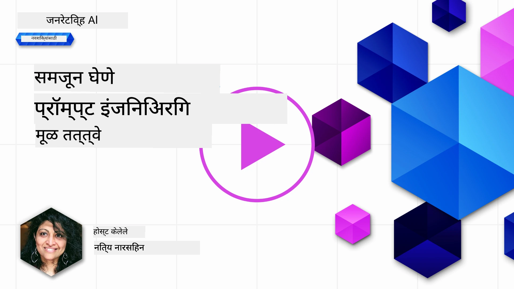
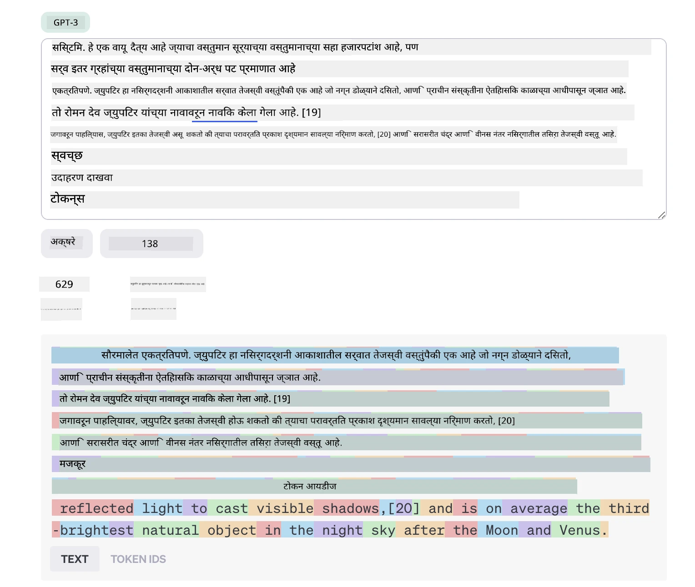
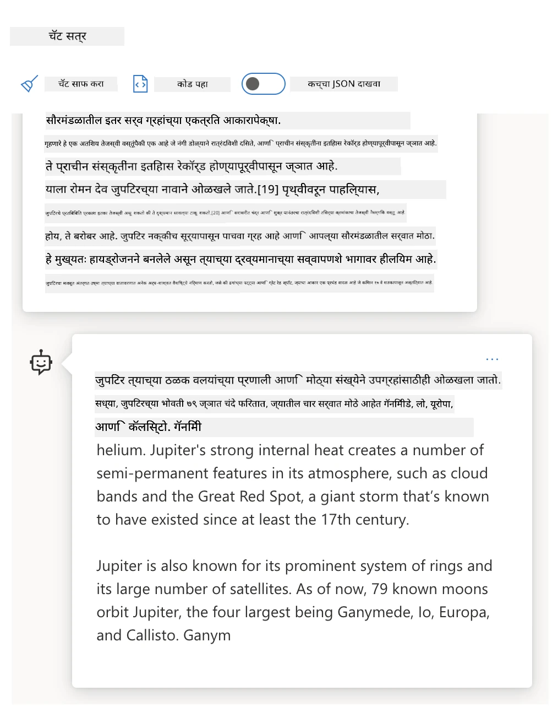
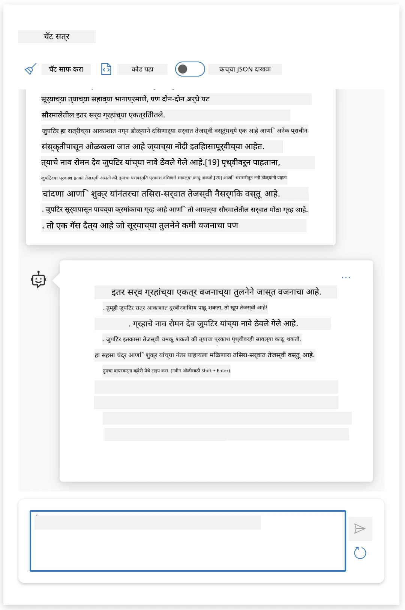
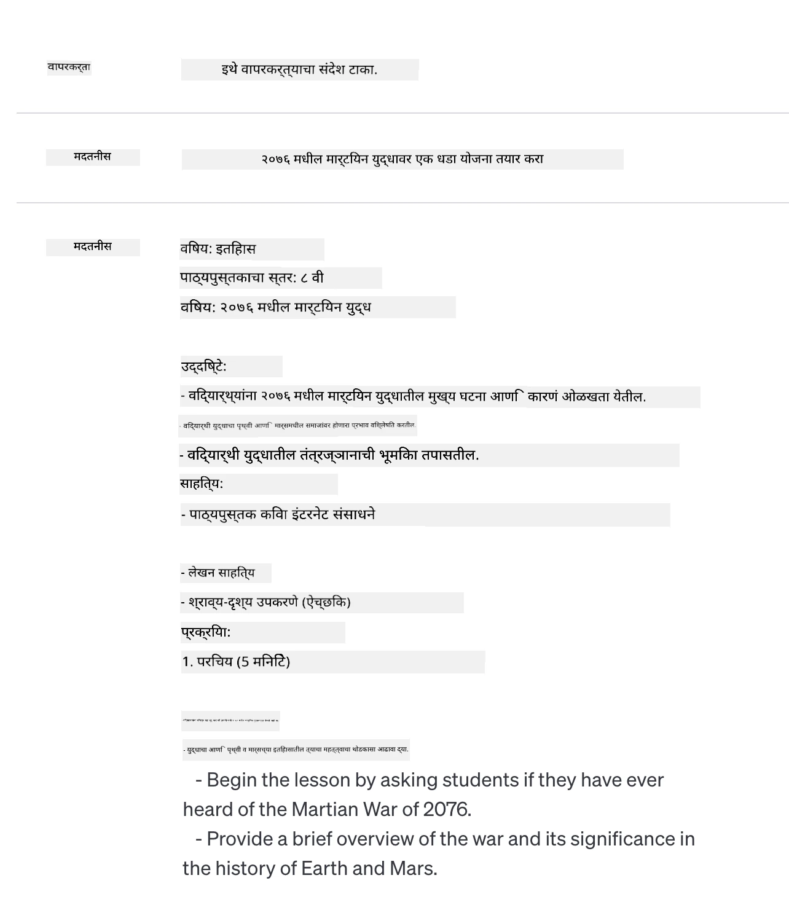
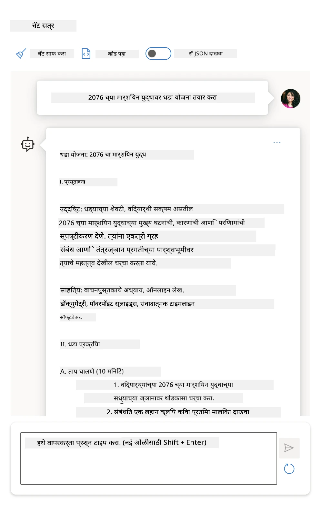
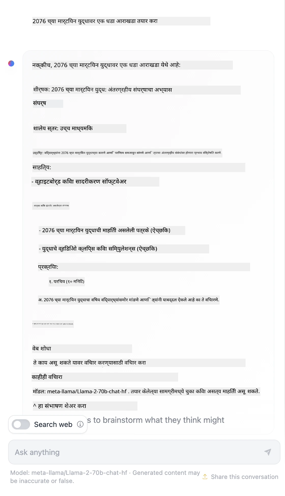

# प्रॉम्प्ट अभियांत्रिकी मूलतत्त्वे

[](https://youtu.be/GElCu2kUlRs?si=qrXsBvXnCW12epb8)

## परिचय
हा मोड्यूल जनरेटिव AI मॉडेल्समध्ये प्रभावी प्रॉम्प्ट तयार करण्यासाठी आवश्यक संकल्पना आणि तंत्रे समाविष्ट करतो. आपण LLM ला जो प्रॉम्प्ट लिहिता तो देखील महत्त्वाचा असतो. काळजीपूर्वक तयार केलेला प्रॉम्प्ट उत्तम प्रतिसाद मिळवू शकतो. पण _प्रॉम्प्ट_ आणि _प्रॉम्प्ट अभियांत्रिकी_ यांसारख्या संज्ञांचा खरोखर अर्थ काय आहे? आणि मी LLM ला पाठवलेला प्रॉम्प्ट _इनपुट_ कसा सुधारू शकतो? या प्रश्नांची उत्तरं आपण या प्रकरणात आणि पुढील प्रकरणात शोधू.

_जनरेटिव AI_ वापरकर्त्यांच्या विनंतीनुसार नवीन सामग्री (उदा., मजकूर, प्रतिमा, ऑडिओ, कोड इ.) तयार करू शकतो. हे OpenAI च्या GPT ("Generative Pre-trained Transformer") सारख्या _मोठ्या भाषा मॉडेल्स_ वापरून साध्य होते, जे नैसर्गिक भाषा आणि कोड वापरण्यासाठी प्रशिक्षित केले जातात.

वापरकर्ते आता टेक्निकल तज्ज्ञता किंवा प्रशिक्षणाशिवाय परिचित पॅराडाइगम्स जसे की चॅट वापरून या मॉडेल्सशी संवाद साधू शकतात. हे मॉडेल्स _प्रॉम्प्ट-आधारित_ आहेत - वापरकर्ता मजकूर इनपुट (प्रॉम्प्ट) पाठवतो आणि AI प्रतिसाद (पूर्ण) परत मिळवतो. त्यानंतर ते "AI सोबत चॅट" करून, अनेक टर्नच्या संभाषणांमध्ये, त्यांचा प्रॉम्प्ट सुधारू शकतात जोपर्यंत प्रतिसाद त्यांच्या अपेक्षांशी जुळत नाही.

"प्रॉम्प्ट" आता जनरेटिव AI अॅप्ससाठी प्राथमिक _प्रोग्रामिंग इंटरफेस_ बनले आहे, जे मॉडेल्सना काय करायचे ते सांगते आणि परत येणाऱ्या प्रतिसादाच्या गुणवत्तेवर परिणाम करते. "प्रॉम्प्ट अभियांत्रिकी" ही एक जलद वाढणारी अभ्यासाची शाखा आहे जी प्रॉम्प्टची _डिझाइन आणि ऑप्टिमायझेशन_ करण्यावर लक्ष केंद्रित करते जेणेकरून मोठ्या प्रमाणावर विश्वसनीय आणि दर्जेदार प्रतिसाद मिळू शकतील.

## शिकण्याच्या उद्दिष्टे

या धड्यात, आपण Prompt Engineering म्हणजे काय, का आवश्यक आहे आणि दिलेल्या मॉडेल व अनुप्रयोग उद्दिष्टासाठी कसे अधिक परिणामकारक प्रॉम्प्ट तयार करायचे याबद्दल शिकू. आपण प्रॉम्प्ट अभियांत्रिकीच्या मूलभूत संकल्पना आणि उत्तम सराव समजून घेऊ - आणि एका इंटरऐक्टिव Jupyter नोटबुक्स "सँडबॉक्स" पर्यावरणाबद्दल जाणून घेऊ जिथे आपण या संकल्पना प्रत्यक्ष उदाहरणांवर वापरलेल्या पाहू शकतो.

या धड्याच्या शेवटी आपण सक्षम होऊ:

1. प्रॉम्प्ट अभियांत्रिकी काय आहे आणि का महत्त्वाची आहे हे स्पष्ट करणे.
2. प्रॉम्प्टचे घटक काय आहेत आणि ते कसे वापरले जातात ते वर्णन करणे.
3. प्रॉम्प्ट अभियांत्रिकीसाठी उत्तम सराव आणि तंत्र शिकणे.
4. शिकलेल्या तंत्रांचा वापर करून OpenAI एंडपॉइंट वापरून प्रत्यक्ष उदाहरणांवर आत्मसात करणे.

## मुख्य संज्ञा

प्रॉम्प्ट अभियांत्रिकी: AI मॉडेल्सना इच्छित आउटपुट तयार करण्यासाठी मार्गदर्शन करण्यासाठी इनपुट्स डिझाइन आणि सुधारण्याची पध्दत.
टोकनायझेशन: मजकूर लहान युनिट्समध्ये (टोकन्स) रूपांतरित करण्याची प्रक्रिया, ज्यांना मॉडेल समजू शकते आणि प्रक्रिया करू शकते.
इंस्ट्रक्शन-ट्यूनड LLMs: विशेष सूचना वापरून अधिक अचूक आणि सुसंगत प्रतिसाद देण्यासाठी फाइन-ट्यून केलेले मोठे भाषा मॉडेल्स.

## शिकण्याचा सँडबॉक्स

प्रॉम्प्ट अभियांत्रिकी सध्या विज्ञानापेक्षा अधिक कला आहे. याची अंतसजाण वाढवण्याचा सर्वोत्तम मार्ग म्हणजे _अधिक सराव_ करणे आणि प्रयोग-आणि-त्रुटी पद्धत स्वीकारणे जी अनुप्रयोग क्षेत्रातील तज्ज्ञता, शिफारस केलेल्या तंत्रांशी आणि मॉडेल-विशिष्ट ऑप्टिमायझेशनसह संमिश्रित आहे.

या धड्यासोबत येणारा Jupyter नोटबुक एक _सँडबॉक्स_ वातावरण पुरवतो जिथे आपण शिकत असतानाच प्रयत्न करू शकता - किंवा शेवटी कोड चॅलेंजचा भाग म्हणून. सराव करण्यासाठी आपल्याला आवश्यक आहे:

1. **एक Azure OpenAI API की** - तैनात केलेल्या LLM साठी सेवा एंडपॉइंट.
2. **पायथन रनटाइम** - ज्यामध्ये नोटबुक चालवता येईल.
3. **स्थानिक पर्यावरणीय चल** - _[SETUP](./../00-course-setup/02-setup-local.md?WT.mc_id=academic-105485-koreyst) या टप्प्यांचे आत्ताच पालन करा_.

नोंदणी नोटबुकमध्ये _स्टार्टर_ व्यायाम येतात - पण आपले स्वतःचे _Markdown_ (वर्णन) आणि _Code_ (प्रॉम्प्ट विनंत्या) विभाग जोडण्यास प्रोत्साहन दिले जाते, जेणेकरून अधिक उदाहरणे किंवा कल्पना तपासून प्रॉम्प्ट डिझाइनची अंतसजाण वाढवता येईल.

## चित्रयुक्त मार्गदर्शक

या धड्यात काय समाविष्ट आहे हे जाणून घ्यायचे आहे का? तर हा चित्रयुक्त मार्गदर्शक पहा, जो आपल्याला मुख्य विषय आणि प्रत्येक विषयातील महत्वाच्या मुद्द्यांचे सारांश देतो ज्यावर विचार करावा. धडा रोडमॅप आपल्याला मूलभूत संकल्पना आणि आव्हाने समजून घेण्यापासून संबंधित प्रॉम्प्ट अभियांत्रिकी तंत्रे आणि सर्वोत्तम सरावांपर्यंत घेऊन चालतो. लक्षात घ्या, या मार्गदर्शकातील "अॅडव्हान्स्ड तंत्र" सेक्शन पुढील प्रकरणातील विषयांशी संबंधित आहे.


## आपले स्टार्टअप

आता, चला पाहूया की _हा विषय_ आपल्या स्टार्टअपने [शिक्षणात AI नवकल्पना आणण्याच्या](https://educationblog.microsoft.com/2023/06/collaborating-to-bring-ai-innovation-to-education?WT.mc_id=academic-105485-koreyst) मिशनशी कसा संबंधित आहे. आपण _वैयक्तिकृत शिक्षण_ यांच्या AI-चालित अनुप्रयोगांची निर्मिती करू इच्छितो - त्यामुळे चला वेगवेगळ्या वापरकर्त्यांनी कसे "प्रॉम्प्ट डिझाइन" केले असावे याबद्दल विचार करू:

- **प्रशासक** AI ला विचारू शकतात की _अभ्यासक्रमाच्या डेटाचा विश्लेषण करून कव्हरेजमधील तूट शोधावी_. AI निकाल सारांशित करू शकते किंवा कोडसह भौतिक रूपात दाखवू शकते.
- **शिक्षक** AI ला विचारू शकतात की _टार्गेट प्रेक्षक आणि विषयासाठी एक धडा योजना तयार करावी_. AI दिलेल्या स्वरूपात वैयक्तिकृत योजना तयार करू शकते.
- **विद्यार्थी** AI ला विचारू शकतात की _त्यांना कठीण विषय शिकवावा_. AI आता विद्यार्थ्यांना त्यांच्या स्तरानुसार धडे, सूचना आणि उदाहरणे देऊन मार्गदर्शन करू शकते.

हे फक्त सुरुवात आहे. [Prompts For Education](https://github.com/microsoft/prompts-for-edu/tree/main?WT.mc_id=academic-105485-koreyst) पहा - शिक्षण तज्ज्ञांनी संकलित केलेला एक मुक्त स्त्रोत प्रॉम्प्ट लायब्ररी - जेथे आपण शक्यतांची विस्तृत कल्पना घेऊ शकता! _त्या प्रॉम्प्ट्सना सँडबॉक्समध्ये किंवा OpenAI Playground मध्ये वापरून पहा, काय होते ते पहा!_

<!--
LESSON TEMPLATE:
This unit should cover core concept #1.
Reinforce the concept with examples and references.

CONCEPT #1:
Prompt Engineering.
Define it and explain why it is needed.
-->

## प्रॉम्प्ट अभियांत्रिकी म्हणजे काय?

या धड्याची सुरुवात आम्ही **प्रॉम्प्ट अभियांत्रिकी** या संज्ञेची व्याख्या करून केली की ती म्हणजे _डिझाइन आणि ऑप्टिमायझेशन_ प्रक्रियेमुळे दिलेल्या अनुप्रयोगाच्या उद्दिष्ट आणि मॉडेलसाठी सातत्यपूर्ण आणि दर्जेदार प्रतिसाद (पूर्ण) देण्यासाठी मजकूर इनपुट्स (प्रॉम्प्ट्स) तयार करणे. आपण हे दोन टप्प्यांत पाहू शकतो:

- दिलेल्या मॉडेल आणि उद्दिष्टासाठी प्रारंभरूप प्रॉम्प्ट _डिझाइन करणे_
- प्रतिसादाच्या गुणवत्तेची सुधारणा करण्यासाठी प्रॉम्प्ट _पुनरावृत्तीने सुधारित करणे_

हा एक अनिवार्यपणे प्रयोग आणि चूक प्रक्रिया आहे ज्यासाठी वापरकर्त्याची अंतसजाण आणि प्रयत्न आवश्यक आहे जेणेकरून सर्वोत्तम निकाल मिळतील. तर ते का महत्त्वाचे आहे? त्याचे उत्तर शोधण्यासाठी आपल्याला प्रथम तीन संकल्पना समजून घ्याव्यात:

- _टोकनायझेशन_ = मॉडेल प्रॉम्प्ट कसे "पाहते"
- _बेस LLMs_ = आधार मॉडेल प्रॉम्प्ट कसे "प्रक्रिया" करतो
- _इंस्ट्रक्शन-ट्यूनड LLMs_ = मॉडेल आता "काम" कसे पाहतो

### टोकनायझेशन

LLM प्रॉम्प्ट्सना _टोकन्सच्या प्रेरणे_ म्हणून पाहते जिथे वेगवेगळे मॉडेल्स (किंवा मॉडेलच्या आवृत्त्या) समान प्रॉम्प्टला भिन्न प्रकारे टोकनमध्ये रूपांतरित करू शकतात. कारण LLM टोकन्सवर प्रशिक्षण घेतलेले असतात (कच्च्या मजकूरावर नाही), प्रॉम्प्ट्स कसे टोकनाइज होतात त्याचा जनरेट केलेल्या प्रतिसादाच्या गुणवत्तेवर थेट परिणाम होतो.

टोकनायझेशन कसा काम करतो याची अंतसजाण वाढवण्यासाठी खाली दिलेले [OpenAI Tokenizer](https://platform.openai.com/tokenizer?WT.mc_id=academic-105485-koreyst) सारखे टूल वापरून पहा. आपला प्रॉम्प्ट कॉपी करा - आणि पाहा तो कसा टोकन्समध्ये रूपांतरित होतो, whitespace character आणि punctuation कसे हाताळले जातात हे लक्षात घ्या. लक्षात ठेवा की हा उदाहरण जुन्या LLM (GPT-3) दर्शवतो - त्यामुळे नवीन मॉडेल वापरल्यास वेगळे निकाल मिळू शकतात.



### संकल्पना: फाउंडेशन मॉडेल्स

प्रॉम्प्ट टोकनाइज केल्यानंतर, ["Base LLM"](https://blog.gopenai.com/an-introduction-to-base-and-instruction-tuned-large-language-models-8de102c785a6?WT.mc_id=academic-105485-koreyst) (किंवा फाउंडेशन मॉडेल) ची प्राथमिक कार्ये त्या सिक्वेन्समधील टोकनची भविष्वाणी करणे आहे. कारण LLM मोठ्या प्रमाणावर मजकूर डेटासेटवर प्रशिक्षित केलेले असून त्यांना टोकन्समधील सांख्यिक नातेसंबंधांचे चांगले ज्ञान असते आणि ते आत्मविश्वासाने भविष्वाणी करू शकतात. हे लक्षात घ्या की त्यांना प्रॉम्प्टमधील शब्दांचे _अर्थ_ समजत नाही; ते फक्त एक पॅटर्न पाहतात ज्याला पुढील भविष्वाणीने "पूर्ण" करू शकतात. वापरकर्ता हस्तक्षेप किंवा पूर्वनियत अटीने थांबवल्याशिवाय ते सिक्वेन्सची भविष्वाणी सुरू ठेवू शकतात.

प्रॉम्प्ट-आधारित पूर्ण कसे कार्य करते हे पाहू इच्छिता? वरील प्रॉम्प्ट Azure OpenAI Studio [_Chat Playground_](https://oai.azure.com/playground?WT.mc_id=academic-105485-koreyst) मध्ये डीफॉल्ट सेटिंगसह टाका. सिस्टीम प्रॉम्प्ट्सना माहितीच्या विनंती म्हणून हाताळण्यासाठी कॉन्फिगर केलेला आहे - त्यामुळे आपल्याला अशा संदर्भात पूर्ण दिसेल.

पण जर वापरकर्त्याला एखादा विशिष्ट निकष किंवा कार्य उद्दिष्ट पूर्ण करणारे काही पाहायचे असेल तर? हेव्हा _इंस्ट्रक्शन-ट्यूनड_ LLMs उपयुक्त ठरतात.



### संकल्पना: इंस्ट्रक्शन ट्यूनड LLMs

[इंस्ट्रक्शन ट्यूनड LLM](https://blog.gopenai.com/an-introduction-to-base-and-instruction-tuned-large-language-models-8de102c785a6?WT.mc_id=academic-105485-koreyst) फाउंडेशन मॉडेलपासून सुरू होतो आणि उदाहरणे किंवा इनपुट/आउटपुट जोड्यांसह (उदा., बहु-टर्न "मेसेजेस") त्याला फाइन-ट्यून करतो ज्यात स्पष्ट सूचना असू शकतात - आणि AI प्रतिमेचा प्रतिसाद त्या सूचनेचे पालन करण्याचा प्रयत्न करतो.

यासाठी मनुष्य प्रतिक्रिया वापरून बळकटीकरण शिक्षण (RLHF) सारखी तंत्रे वापरली जातात जी मॉडेलला _सूचना पाळण्याची_ आणि _प्रतिसादांतून शिकण्याची_ क्षमता देतात जेणेकरून ते व्यावहारिक अनुप्रयोगांकरिता अधिक योग्य आणि वापरकर्त्याच्या उद्दिष्टांसाठी अधिक सुसंगत प्रतिसाद तयार करू शकतात.

चला प्रयत्न करूया - वरील प्रॉम्प्ट पुनरावलोकन करा, पण आता _सिस्टीम मेसेज_ मध्ये खालील सूचना संदर्भ म्हणून द्या:

> _तुम्हाला दिलेली सामग्री दुसऱ्या वर्गाच्या विद्यार्थ्यासाठी सारांश करा. निकाल एका परिच्छेदात 3-5 बुलेट पॉइंट्ससोबत ठेवा._

पाहा, निकाल आता इच्छित उद्दिष्ट आणि स्वरूप प्रतिबिंबित करतो का? शिक्षक आता थेट हा प्रतिसाद त्यांच्या स्लाइडसाठी वापरू शकतो.



## प्रॉम्प्ट अभियांत्रिकी का आवश्यक आहे?

आता आपण जाणतो की LLM प्रॉम्प्ट कसे प्रक्रिया करतात, चला प्रॉम्प्ट अभियांत्रिकी का आवश्यक आहे याबद्दल बोलूया. कारणे सध्याच्या LLM मध्ये असलेल्या अनेक आव्हानांमध्ये आहेत जेणेकरून _विश्वसनीय आणि सातत्यपूर्ण पूर्णांची_ प्राप्ती प्रॉम्प्ट संरचनेत आणि ऑप्टिमायझेशनमध्ये प्रयत्न न केल्याशिवाय कठीण होते. उदा:

1. **मॉडेल प्रतिसाद स्टोकास्टिक असतात.** _सामान्य प्रॉम्प्ट_ वेगवेगळ्या मॉडेल्स किंवा मॉडेल आवृत्त्यांसह वेगळे प्रतिसाद निर्माण करू शकतो. आणि तोच प्रॉम्प्ट समान मॉडेलसोबत वेगवेगळ्या वेळेस वेगळा परिणाम देऊ शकतो. _प्रॉम्प्ट अभियांत्रिकी तंत्रे या फरकांना कमी करून चांगले नियंत्रण देऊ शकतात_.

1. **मॉडेल्स प्रतिसाद निर्माण करू शकतात.** मॉडेल्स _मोठ्या पण मर्यादित_ डेटासेटवर पूर्वप्रशिक्षित आहेत, म्हणजे त्यांना त्या प्रशिक्षण क्षेत्राबाहेरील संकल्पनांची माहिती नसते. परिणामी, ते अचूक नसलेल्या, काल्पनिक किंवा ज्ञात तथ्यांच्या विरोधात असणारे पूर्ण तयार करू शकतात. _प्रॉम्प्ट अभियांत्रिकी वापरकर्त्यांना अशा बनावट माहितीची ओळख आणि प्रतिबंध करण्यात मदत करते, उदा., AI ला संदर्भ किंवा कारण विचारणे_.

1. **मॉडेलची क्षमता वेगळी असू शकते.** नवीन मॉडेल्स किंवा मॉडेल जनरेशनमध्ये अधिक समृद्ध क्षमता असते पण त्यांच्याकडे खर्च व गुंतागुंत यामध्ये अनौपचारिक चुका आणि वैशिष्ट्ये असू शकतात. _प्रॉम्प्ट अभियांत्रिकी विविध मॉडेल आवश्यकतांना जुळवून घेण्यासाठी सर्वोत्तम सराव आणि कार्यप्रवाह विकसित करण्यात मदत करू शकते जे स्केलेबल आणि सहज असतात_.

हे OpenAI किंवा Azure OpenAI Playground मध्ये प्रत्यक्ष पाहूया:

- वेगवेगळ्या LLM तैनातीसह समान प्रॉम्प्ट वापरा (उदा., OpenAI, Azure OpenAI, Hugging Face) - फरक दिसले का?
- समान LLM तैनातीसह (उदा., Azure OpenAI playground) पुनरावृत्तीने समान प्रॉम्प्ट वापरा - या फरकांमध्ये काय फरक होता?

### बनावट सूचना उदाहरण

या कोर्समध्ये, आम्ही **"बनावट"** हा शब्द वापरतो जेव्हा LLM काही वेळा त्यांच्या प्रशिक्षणातील मर्यादा किंवा इतर अडचणींमुळे तथ्यात्मकदृष्ट्या चुकीची माहिती तयार करतात. तुम्हाला हे कधीकधी लोकप्रिय लेखांमध्ये किंवा शोधनिबंधांमध्ये _"हॅल्युसिनेशन्स"_ म्हणून ही ऐकले असेल. तथापि, आम्ही _"बनावट"_ हा शब्द वापरण्याचा जोरदार सल्ला देतो जेणेकरून चुकीने मानवी सारखे वागणूक मशीन-चालित परिणामास लागू करू नये. हे [जबाबदार AI मार्गदर्शक तत्त्वानुसार](https://www.microsoft.com/ai/responsible-ai?WT.mc_id=academic-105485-koreyst) एक योग्य टर्म आहे, जो काही संदर्भात अप्रिय किंवा अपारदर्शक संज्ञा काढून टाकतो.

बनावटे कशी कार्य करतात याची कल्पना हवी आहे का? एखाद्या प्रॉम्प्टचा विचार करा ज्यात AI ला नसलेल्या विषयासाठी (जे प्रशिक्षण डेटासेटमध्ये नाही) सामग्री तयार करण्यास सांगितले आहे. उदा - मी हा प्रॉम्प्ट वापरला:

> **प्रॉम्प्ट:** Martian War of 2076 वर एक धडा योजना तयार करा.
एक वेब शोधाने मला असा असा दिसले की मार्टियन युद्धांवर कथात्मक खात्ये (उदा., टेलिव्हिजन मालिका किंवा पुस्तके) होत्या - परंतु 2076 मध्ये काही नाहीत. सामान्य बुद्धी देखील सांगते की 2076 _भविष्यात_ आहे आणि त्यामुळे, त्याचा खऱ्या घटनेशी काही संबंध नसू शकतो.

तर वेगवेगळ्या LLM प्रदात्यांसह हा प्रॉम्प्ट चालवला तर काय होते?

> **प्रतिसाद 1**: OpenAI प्लेग्राऊंड (GPT-35)



> **प्रतिसाद 2**: Azure OpenAI प्लेग्राऊंड (GPT-35)



> **प्रतिसाद 3**: : Hugging Face Chat प्लेग्राऊंड (LLama-2)



अपेक्षितप्रमाणे, प्रत्येक मॉडेल (किंवा मॉडेल आवृत्ती) थोडे वेगळे प्रतिसाद तयार करते कारण स्टोकास्टिक वर्तन आणि मॉडेल क्षमतांतील फरक. उदाहरणार्थ, एका मॉडेलने 8व्या वर्गातील प्रेक्षकांना लक्षात ठेवले तर दुसऱ्या मॉडेलने उच्च-माध्यमिक विद्यार्थ्याला गृहित धरले. पण सर्व तीन मॉडेल्सनी अशा प्रकारचे प्रतिसाद निर्माण केले जे अनभिज्ञ वापरकर्त्याला घटना खरी वाटू शकते.

प्रॉम्प्ट अभियांत्रिकी तंत्रे जसे की _मेटाप्रॉम्प्टिंग_ आणि _तापमान कॉन्फिगरेशन_ मॉडेल फॅब्रिकेशन्स काही अंशी कमी करू शकतात. नवीन प्रॉम्प्ट अभियांत्रिकी _आर्किटेक्चर_ देखील नवीन टूल्स आणि तंत्रे सहजपणे प्रॉम्प्ट प्रवाहात समाकलित करतात, जे काही परिणाम कमी करण्यासाठी किंवा टाळण्यासाठी उपयुक्त असते.

## केस स्टडी: GitHub Copilot

या विभागाचा समारोप करूया आणि पाहूया की प्रॉम्प्ट अभियांत्रिकी प्रत्यक्ष जगातील उपायांमध्ये कशी वापरली जाते एका केस स्टडी पाहून: [GitHub Copilot](https://github.com/features/copilot?WT.mc_id=academic-105485-koreyst).

GitHub Copilot तुमचा "AI पेअर प्रोग्रामर" आहे - तो मजकूर प्रॉम्प्ट्स कोड पूर्णत्त्वात रूपांतरित करतो आणि तुमच्या विकास पर्यावरणात (उदा., Visual Studio Code) समाकलित आहे जेणेकरून वापरकर्त्याला अखंड अनुभव मिळेल. खालील ब्लॉग मालिकेत प्रमाणित केल्याप्रमाणे, सुरुवातीचा आवृत्ती OpenAI Codex मॉडेलवर आधारित होता - इंजिनिअर्सना लवकर लक्षात आले की मॉडेलला फाइन-ट्यून करण्याची आणि चांगल्या प्रॉम्प्ट अभियांत्रिकी तंत्रांची गरज आहे, ज्यामुळे कोड गुणवत्तेत सुधारणा होईल. जुलै मध्ये, त्यांनी [एक सुधारित AI मॉडेल सादर केला जो Codex पेक्षा अधिक सक्षम आहे](https://github.blog/2023-07-28-smarter-more-efficient-coding-github-copilot-goes-beyond-codex-with-improved-ai-model/?WT.mc_id=academic-105485-koreyst) आणि जास्त जलद सूचना देतो.

त्यांच्या शिकण्याच्या प्रवासाचा मागोवा घेण्यासाठी पोस्ट्स क्रमाने वाचा.

- **मे 2023** | [GitHub Copilot तुमच्या कोडला समजून घेण्यात अधिक चांगला होत आहे](https://github.blog/2023-05-17-how-github-copilot-is-getting-better-at-understanding-your-code/?WT.mc_id=academic-105485-koreyst)
- **मे 2023** | [GitHub मध्ये पाहा: GitHub Copilot मागील LLMs सोबत काम करत आहे](https://github.blog/2023-05-17-inside-github-working-with-the-llms-behind-github-copilot/?WT.mc_id=academic-105485-koreyst).
- **जून 2023** | [GitHub Copilot साठी चांगले प्रॉम्प्ट कसे लिहावे](https://github.blog/2023-06-20-how-to-write-better-prompts-for-github-copilot/?WT.mc_id=academic-105485-koreyst).
- **जुलै 2023** | [.. GitHub Copilot सुधारित AI मॉडेलसह Codex पेक्षा पुढे जात आहे](https://github.blog/2023-07-28-smarter-more-efficient-coding-github-copilot-goes-beyond-codex-with-improved-ai-model/?WT.mc_id=academic-105485-koreyst)
- **जुलै 2023** | [डिव्हलपरसाठी प्रॉम्प्ट अभियांत्रिकी आणि LLMs मार्गदर्शक](https://github.blog/2023-07-17-prompt-engineering-guide-generative-ai-llms/?WT.mc_id=academic-105485-koreyst)
- **सप्टेंबर 2023** | [कंपनीसाठी LLM अॅप कसे तयार करावे: GitHub Copilot कडून शिका](https://github.blog/2023-09-06-how-to-build-an-enterprise-llm-application-lessons-from-github-copilot/?WT.mc_id=academic-105485-koreyst)

तुम्ही त्यांचा [अभियांत्रिकी ब्लॉग](https://github.blog/category/engineering/?WT.mc_id=academic-105485-koreyst) देखील ब्राउझ करू शकता जिथे [अशा प्रकारच्या पोस्ट्स](https://github.blog/2023-09-27-how-i-used-github-copilot-chat-to-build-a-reactjs-gallery-prototype/?WT.mc_id=academic-105485-koreyst) उपलब्ध आहेत ज्या दाखवतात की कसे हे मॉडेल्स आणि तंत्रे प्रत्यक्ष जगातील अनुप्रयोगांना _लागू_ केली जातात.

---

<!--
LESSON TEMPLATE:
This unit should cover core concept #2.
Reinforce the concept with examples and references.

CONCEPT #2:
Prompt Design.
Illustrated with examples.
-->

## प्रॉम्प्ट रचना

आपण पाहिले की प्रॉम्प्ट अभियांत्रिकी का महत्त्वाची आहे - आता समजून घेऊया की प्रॉम्प्ट कसे _रचले_ जातात जेणेकरून आपण वेगवेगळ्या तंत्रांचा वापर करून अधिक प्रभावी प्रॉम्प्ट डिझाइनची मूल्यांकन करू शकू.

### मूलभूत प्रॉम्प्ट

चला मूलभूत प्रॉम्प्टपासून सुरू करूया: मॉडेलला कोणताही इतर संदर्भ न देता पाठवलेला मजकूर इनपुट. येथे एक उदाहरण आहे - जेव्हा आपण US राष्ट्रीय संगीतातील पहिले काही शब्द OpenAI च्या [Completion API](https://platform.openai.com/docs/api-reference/completions?WT.mc_id=academic-105485-koreyst) ला पाठवतो तेव्हा तो लगेच पुढील काही ओळी _पूर्ण_ करतो, मूलभूत भविष्यवाणी वर्तन दाखवितो.

| प्रॉम्प्ट (इनपुट)       | पूर्णत्व (आउटपुट)                                                                                                                  |
| :----------------- | :-------------------------------------------------------------------------------------------------------------------------------------- |
| Oh say can you see | असे वाटते की तुम्ही "The Star-Spangled Banner," अमेरिकेचा राष्ट्रीय गीत, याचे गीत सुरु करत आहात. संपूर्ण गीत असे आहे ... |

### गुंतागुंतीचा प्रॉम्प्ट

आता त्या मूलभूत प्रॉम्प्टमध्ये संदर्भ आणि सूचना जोडा. [Chat Completion API](https://learn.microsoft.com/azure/ai-services/openai/how-to/chatgpt?WT.mc_id=academic-105485-koreyst) आपल्याला _मेसिजेस_ च्या संच स्वरूपात एक गुंतागुंतीचा प्रॉम्प्ट तयार करण्याची परवानगी देतो ज्यामध्ये:

- इनपुट/आउटपुट जोडी जे _वापरकर्ता_ इनपुट आणि _सहायक_ प्रतिसाद प्रतिबिंबित करतात.
- प्रणाली संदेश जो सहाय्यकाच्या वर्तणुकीसाठी किंवा व्यक्तिमत्वासाठी संदर्भ सेट करतो.

आता विनंती खालील स्वरूपात असते, जिथे _टोकनायझेशन_ प्रभावीपणे संदर्भ आणि संभाषणातील संबंधित माहिती कॅप्चर करते. प्रणाली संदर्भ बदलणे पूर्णत्वांच्या गुणवत्तेवर तितकेच परिणाम करू शकते जितके वापरकर्त्याने दिलेल्या इनपुटवर.

```python
response = openai.chat.completions.create(
    model="gpt-3.5-turbo",
    messages=[
        {"role": "system", "content": "You are a helpful assistant."},
        {"role": "user", "content": "Who won the world series in 2020?"},
        {"role": "assistant", "content": "The Los Angeles Dodgers won the World Series in 2020."},
        {"role": "user", "content": "Where was it played?"}
    ]
)
```

### सूचना प्रॉम्प्ट

वरील उदाहरणांमध्ये, वापरकर्ता प्रॉम्प्ट एक साधा टेक्स्ट प्रश्न होता जो माहितीच्या मागणीसाठी अर्थ लावला जाऊ शकतो. _सूचना_ प्रॉम्प्टसह, आपण त्या मजकुराचा वापर करून अधिक तपशीलात काम निर्दिष्ट करू शकतो, ज्यामुळे AI ला चांगले मार्गदर्शन मिळते. एक उदाहरण पाहा:

| प्रॉम्प्ट (इनपुट)                                                                                             | पूर्णत्व (आउटपुट)                                                                                   | सूचना प्रकार          |
| :------------------------------------------------------------------------------------------------------------ | :-------------------------------------------------------------------------------------------------- | :-------------------- |
| Write a description of the Civil War                                                                           | _साधा परिच्छेद परत केला_                                                                            | साधा                  |
| Write a description of the Civil War. Provide key dates and events and describe their significance             | _परिच्छेद आणि महत्त्वाच्या घटनांच्या तारखा यासह यादी परत केली_                                       | गुंतागुंतीचा           |
| Write a description of the Civil War in 1 paragraph. Provide 3 bullet points with key dates and their significance. Provide 3 more bullet points with key historical figures and their contributions. Return the output as a JSON file | _जास्त तपशील एका मजकूराच्या बाकसमवेत परत करतो, जो JSON स्वरूपात असतो आणि तुम्ही फाईलमध्ये कॉपी-पेस्ट करून वैध करू शकता_ | गुंतागुंतीचा. स्वरूपित. |

## प्राथमिक सामग्री

वरील उदाहरणांमध्ये, प्रॉम्प्ट अजूनही तुलनेने खुला होता, ज्यामुळे LLM ला त्याच्या पूर्व-प्रशिक्षित डेटासेटमधून कोणता भाग संबंधित आहे हे ठरवण्याची मुभा मिळाली. _प्राथमिक सामग्री_ डिझाइन पॅटर्नमध्ये, इनपुट मजकूर दोन भागांत विभागले जातो:

- एक सूचना (कार्य)
- संबंधित सामग्री (जी क्रियेला प्रभाव टाकते)

येथे एक उदाहरण आहे जिथे सूचना आहे "हे 2 वाक्यात सारांश करा".

| प्रॉम्प्ट (इनपुट)                                                                                                                                                                                                                                                                                                                                                                                                                                                                                                     | पूर्णत्व (आउटपुट)                                                                                                                                                                                                                                                                                 |
| :------------------------------------------------------------------------------------------------------------------------------------------------------------------------------------------------------------------------------------------------------------------------------------------------------------------------------------------------------------------------------------------------------------------------------------------------------------------------------------------------------------------ | :------------------------------------------------------------------------------------------------------------------------------------------------------------------------------------------------------------------------------------------------------------------------------------------------- |
| Jupiter is the fifth planet from the Sun and the largest in the Solar System. It is a gas giant with a mass one-thousandth that of the Sun, but two-and-a-half times that of all the other planets in the Solar System combined. Jupiter is one of the brightest objects visible to the naked eye in the night sky, and has been known to ancient civilizations since before recorded history. It is named after the Roman god Jupiter.[19] When viewed from Earth, Jupiter can be bright enough for its reflected light to cast visible shadows,[20] and is on average the third-brightest natural object in the night sky after the Moon and Venus. <br/> **Summarize this in 2 short sentences** | Jupiter, the fifth planet from the Sun, is the largest in the Solar System and is known for being one of the brightest objects in the night sky. Named after the Roman god Jupiter, it's a gas giant whose mass is two-and-a-half times that of all other planets in the Solar System combined. |

प्राथमिक सामग्री विभाग विविध प्रकारे वापरून अधिक प्रभावी सूचना दिल्या जाऊ शकतात:

- **उदाहरणे** - मॉडेलला काय करायचे हे स्पष्ट सांगण्याऐवजी बरेच उदाहरणे द्या आणि त्यातून ते पॅटर्न समजून घेऊ द्या.
- **संकेत** - सूचनेनंतर एक "संकेत" द्या जो पूर्णत्व ला दिशा देतो, ज्यामुळे मॉडेल अधिक संबंधित प्रतिसाद देईल.
- **टेम्पलेट्स** - ही पुनरावृत्ती करता येण्यासारखी 'रेसिपी' आहेत ज्यात प्लेसहोल्डर्स (चले) आहेत जे विशिष्ट प्रकरणासाठी डेटा वापरून सानुकूल करता येतात.

चला याचा प्रत्यक्षात उपयोग पहातो.

### उदाहरणांचा वापर

हा एक दृष्टिकोन आहे जिथे तुम्ही प्राथमिक सामग्रीचा वापर करून दिलेल्या सूचनेसाठी अपेक्षित उत्पादनाची काही उदाहरणे "मॉडेलला खाण्यास" देतात आणि मॉडेल त्यातून नमुना समजून घेते. दिलेल्या उदाहरणांच्या संख्येवरून आम्ही झिरो-शॉट प्रॉम्प्टिंग, वन-शॉट प्रॉम्प्टिंग, फ्यू-शॉट प्रॉम्प्टिंग इत्यादी करू शकतो.

प्रॉम्प्ट आता तीन घटकांमध्ये बनलेला आहे:

- एक कार्य वर्णन
- अपेक्षित आउटपुटची काही उदाहरणे
- नवीन उदाहरणाची सुरुवात (जी संवादत: कार्य वर्णन बनते)

| शिक्षण प्रकार | प्रॉम्प्ट (इनपुट)                                                                                                                         | पूर्णत्व (आउटपुट)          |
| :------------ | :---------------------------------------------------------------------------------------------------------------------------------------- | :--------------------------- |
| झिरो-शॉट       | "The Sun is Shining". Translate to Spanish                                                                                               | "El Sol está brillando".     |
| वन-शॉट         | "The Sun is Shining" => ""El Sol está brillando". <br> "It's a Cold and Windy Day" =>                                                    | "Es un día frío y ventoso".  |
| फ्यू-शॉट        | The player ran the bases => Baseball <br/> The player hit an ace => Tennis <br/> The player hit a six => Cricket <br/> The player made a slam-dunk => | Basketball                   |
|               |                                                                                                                                          |                              |

लक्षात घ्या कसे झिरो-शॉट प्रॉम्प्टिंगमध्ये आपण स्पष्ट सूचना ("Spanish मध्ये भाषांतर करा") दिली, पण वन-शॉट उदाहरणात ती सूचनेतून समजली जाते. फ्यू-शॉट उदाहरण व्यक्त करते की अधिक उदाहरणे दिल्याने मॉडेल अधिक अचूक अंदाज लावू शकते, कोणतीही अतिरिक्त सूचना न देता.

### प्रॉम्प्ट संकेत

प्राथमिक सामग्री वापरण्याचा आणखी एक तंत्र म्हणजे उदाहरणांच्या ऐवजी _संकेत_ प्रदान करणे. यामध्ये आपण मॉडेलला योग्य दिशेने _सुचना_ देतो; उदाहरणार्थ, अपेक्षित प्रतिसादाच्या स्वरूपाचा एक तुकडा सुरुवातीला देतो आणि मॉडेल नंतर "त्या संकेताला" घेऊन पुढे उत्तर देते.

| संकेतांची संख्या | प्रॉम्प्ट (इनपुट)                                                                                                                                                                                                                                                                                                                                                                                                                                  | पूर्णत्व (आउटपुट)                                                                                                                                                                                                                                    
|
| :-------------- | :---------------------------------------------------------------------------------------------------------------------------------------------------------------------------------------------------------------------------------------------------------------------------------------------------------------------------------------------------------------------------------------------------------------------------------------------- | :--------------------------------------------------------------------------------------------------------------------------------------------------------------------------------------------------------------------------------------------------------------------------------------------------------------------- |
| 0               | Jupiter is the fifth planet from the Sun and the largest in the Solar System. It is a gas giant with a mass one-thousandth that of the Sun, but two-and-a-half times that of all the other planets in the Solar System combined. Jupiter is one of the brightest objects visible to the naked eye in the night sky, and has been known to ancient civilizations since before recorded history. <br/>**Summarize This**                      | Jupiter is the largest planet in our Solar System and the fifth one from the Sun. It is a gas giant with a mass 1/1000th of the Sun's, but it is heavier than all the other planets combined. Ancient civilizations have known about Jupiter for a long time, and it is easily visible in the night sky..                          |
| 1              | ज्युपिटर हा सूर्यापासून पाचवा ग्रह आहे आणि सौरमालेतील सर्वात मोठा ग्रह आहे. तो एक वायुगोलक आहे ज्याचा द्रव्यमान सूर्याच्या द्रव्यमानाच्या हजारपटांशा एवढा आहे, पण सौरमालेतील इतर सर्व ग्रहांच्या एकत्रित द्रव्यमानाच्या दोन अर्धपट अधिक आहे. ज्युपिटर हा रात्रीच्या आकाशात नंगे डोळ्यांनी दिसणाऱ्या सर्वात चमकदार वस्तूंमध्येला एक आहे, आणि तो नोंदवलेल्या इतिहासापूर्वीपासूनच प्राचीन संस्कृतींना ज्ञात आहे. <br/>**हे सारांश करा** <br/> आपण काय शिकलो ते म्हणजे ज्युपिटर | हा सूर्यापासून पाचवा ग्रह आहे आणि सौरमालेतील सर्वात मोठा ग्रह आहे. तो एक वायुगोलक आहे ज्याचा द्रव्यमान सूर्याच्या द्रव्यमानाच्या हजारपटांशा एवढा आहे, पण सर्व इतर ग्रहांच्या एकत्रित द्रव्यमानाच्या दोन अर्धपट अधिक आहे. तो सहजपणे नंगे डोळ्यांनी दिसतो आणि प्राचीन काळापासून ओळखला जातो.                        |
| 2              | ज्युपिटर हा सूर्यापासून पाचवा ग्रह आहे आणि सौरमालेतील सर्वात मोठा ग्रह आहे. तो एक वायुगोलक आहे ज्याचा द्रव्यमान सूर्याच्या द्रव्यमानाच्या हजारपटांशा एवढा आहे, पण सौरमालेतील इतर सर्व ग्रहांच्या एकत्रित द्रव्यमानाच्या दोन अर्धपट अधिक आहे. ज्युपिटर हा रात्रीच्या आकाशात नंगे डोळ्यांनी दिसणाऱ्या सर्वात चमकदार वस्तूंमध्येला एक आहे, आणि तो नोंदवलेल्या इतिहासापूर्वीपासूनच प्राचीन संस्कृतींना ज्ञात आहे. <br/>**हे सारांश करा** <br/> आपण शिकलेले शीर्ष ३ तथ्ये:         | 1. ज्युपिटर हा सूर्यापासून पाचवा ग्रह आहे आणि सौरमालेतील सर्वात मोठा ग्रह आहे. <br/> 2. तो एक वायुगोलक आहे ज्याचा द्रव्यमान सूर्याच्या द्रव्यमानाच्या हजारपटांशा एवढा आहे...<br/> 3. ज्युपिटर नंगे डोळ्यांनी प्राचीन काळापासून दिसतो ...                                                                       |
|                |                                                                                                                                                                                                                                                                                                                                                                                                                                                              |                                                                                                                                                                                                                                                                                                           |

### Prompt Templates

एक प्रॉम्प्ट टेम्प्लेट म्हणजे _पूर्वनिर्धारित प्रॉम्प्टचा एक नुस्खा_ जो आवश्यकतेनुसार जतन करून पुन्हा वापरता येऊ शकतो, ज्यामुळे मोठ्या प्रमाणात सतत एकसारखे वापरकर्त्यांचे अनुभव मिळू शकतात. त्याच्या सर्वात सोप्या स्वरूपात, तो काही प्रॉम्प्ट उदाहरणांचा संग्रह आहे जसे की [OpenAI कडून हा](https://platform.openai.com/examples?WT.mc_id=academic-105485-koreyst) जो इंटरॅक्टिव प्रॉम्प्ट घटक (वापरकर्ता आणि प्रणाली संदेश) आणि API-चालवलेले विनंती स्वरूप दोन्ही पुरवतो - पुनर्वापराला समर्थन देण्यासाठी.

अधिक गुंतागुंतीच्या स्वरूपात, जसे [LangChain कडून हा उदाहरण](https://python.langchain.com/docs/concepts/prompt_templates/?WT.mc_id=academic-105485-koreyst), यात _प्लेसेहोल्डर्स_ असतात जे विविध स्रोतांमधून (वापरकर्त्याचा इनपुट, प्रणाली संदर्भ, बाह्य डेटा स्रोत इ.) डेटा वापरून प्रॉम्प्ट डायनामिकली तयार करण्यासाठी बदलले जाऊ शकतात. यामुळे आपल्याला पुन्हा वापरता येणाऱ्या प्रॉम्प्ट्सची लायब्ररी तयार करता येते जी **प्रोग्रामॅटिकली** मोठ्या प्रमाणात एकसंध वापरकर्त्यांचे अनुभव तयार करण्यासाठी वापरता येते.

शेवटी, टेम्प्लेट्सचे खरी किमत म्हणजे ते तयार करून प्रकाशित केलेले _प्रॉम्प्ट लायब्ररीज_ जे विशिष्ट Vertical Application Domains साठी बनवल्या जातात - ज्यामध्ये प्रॉम्प्ट टेम्प्लेट आता त्या क्षेत्राशी संबंधित संदर्भ किंवा उदाहरणे परावर्तित करण्यासाठी _ऑप्टिमाईज्ड_ असतात ज्यामुळे लक्षित वापरकर्त्यांच्या गरजा अधिक योग्य व अचूकपणे पूर्ण होतात. [Prompts For Edu](https://github.com/microsoft/prompts-for-edu?WT.mc_id=academic-105485-koreyst) ही या दृष्टिकोनाची एक उत्तम उदाहरण आहे, ज्यात शिक्षण क्षेत्रासाठी प्रॉम्प्ट्सची एक लायब्ररी आहे ज्यात धडा नियोजन, अभ्यासक्रम डिझाइन, विद्यार्थ्यांचे मार्गदर्शन यांसाठी महत्त्वपूर्ण उद्दिष्टांवर भर दिला आहे.

## Supporting Content

जर आपण प्रॉम्प्ट तयार करणं म्हणजे सूचना (कार्य) आणि लक्ष्य (प्राथमिक सामग्री) यांसारखं विचार केला, तर _द्वितीयक सामग्री_ म्हणजे आपल्याला आउटपुटवर काही प्रमाणात प्रभाव टाकण्यासाठी देण्यात आलेले अतिरिक्त संदर्भ असतात. हे ट्यूनिंग पॅरामीटर्स, फॉरमॅटिंग सूचना, विषयवस्तू वर्गीकरण इत्यादी असू शकतात जे मॉडेलला अधिक योग्य प्रतिसाद देण्यासाठी मदत करतात.

उदाहरणार्थ: जर आपल्याकडे कोर्स कॅटलॉग असेल ज्यात सर्व अभ्यासक्रमांची नाव, वर्णन, स्तर, मेटाडेटा टॅग्ज, प्रशिक्षक इत्यादींची विस्तृत माहिती असेल:

- आपण एक सूचना दिली "Fall 2023 साठी कोर्स कॅटलॉगचे सारांश करा"
- आपण प्राथमिक सामग्री म्हणून काही उदाहरणे दिली ज्या स्वरूपात आउटपुट हवे आहे
- आपण द्वितीयक सामग्री म्हणून टॉप ५ "टॅग्ज" निश्चित केली.

आता, मॉडेल दिलेल्या उदाहरणांनुसार सारांश पुरवू शकते - पण जर एखाद्या निकालात अनेक टॅग्ज असतील तर ते द्वितीयक सामग्रीमध्ये ओळखलेले ५ टॅग्ज प्राधान्य देऊ शकते.

---

<!--
LESSON TEMPLATE:
This unit should cover core concept #1.
Reinforce the concept with examples and references.

CONCEPT #3:
Prompt Engineering Techniques.
What are some basic techniques for prompt engineering?
Illustrate it with some exercises.
-->

## Prompting Best Practices

आता जेव्हा आपण जाणतो की प्रॉम्प्ट्स कसे _तयार_ करता येतात, तेव्हा आपण विचार करू शकतो की त्यांना कसे _डिझाईन_ करायचे जेणेकरून उत्तम पद्धती प्रतिबिंबित होतील. आपण याला दोन भागांमध्ये पाहू शकतो - योग्य _माइंडसेट_ आणि योग्य _तंत्रे_ लागू करणे.

### Prompt Engineering Mindset

प्रॉम्प्ट इंजिनिअरिंग ही एक ट्रायल-एंड-एरर प्रक्रिया आहे त्यामुळे तीन महत्त्वाचे मार्गदर्शक मुद्दे लक्षात ठेवा:

1. **डोमेन समज महत्त्वाची आहे.** प्रतिसादाची अचूकता आणि सुसंगतता ही त्या _डोमेन_ वर अवलंबून असते ज्यामध्ये तो अनुप्रयोग किंवा वापरकर्ता काम करतो. आपली अंतर्ज्ञान आणि डोमेन तज्ञता वापरून **तंत्रे अनुकूलित करा**. उदाहरणादाखल, आपल्या प्रणाली प्रॉम्प्ट्समध्ये _डोमेन-विशिष्ट व्यक्तिमत्त्वे_ परिभाषित करा, किंवा वापरकर्ता प्रॉम्प्ट्समध्ये _डोमेन-विशिष्ट टेम्प्लेट्स_ वापरा. द्वितीयक सामग्रीमध्ये डोमेन-विशिष्ट संदर्भ द्या, किंवा मॉडेलला परिचित पद्धतीने मार्गदर्शन करण्यासाठी _डोमेन-विशिष्ट क्यूज आणि उदाहरणे_ वापरा.

2. **मॉडेल समज महत्त्वाची आहे.** आपण जाणतो की मॉडेल नैसर्गिकरित्या स्टोकास्टिक असतात. पण मॉडेलची अंमलबजावणी वेगवेगळ्या प्रशिक्षण डेटासेटवर (पूर्व-प्रशिक्षित ज्ञान), उपलब्ध सुविधा (उदा. API किंवा SDK), आणि कोणत्या प्रकारच्या सामग्रीसाठी ते ऑप्टिमाइझ आहेत (उदा. कोड विरुद्ध प्रतिमा विरुद्ध मजकूर) यावर अवलंबून बदलू शकते. वापरत असलेल्या मॉडेलचे बलस्थान आणि मर्यादा समजून घ्या, आणि त्या जाणिवांचा वापर करून _कार्यांची प्राधान्यक्रम ठरवा_ किंवा _कस्टमाइज्ड टेम्प्लेट्स_ तयार करा जे मॉडेलच्या क्षमतांसाठी अनुरूप असतील.

3. **आव्हान आणि पडताळणी महत्त्वाचे आहेत.** मॉडेल जलद विकसित होत आहेत, तसेच प्रॉम्प्ट इंजिनिअरिंगसाठी तंत्रही. डोमेन एक्सपर्ट म्हणून, आपल्याकडे कदाचित अन्य संदर्भ किंवा निकष असतील ज्यांचा वापर व्यापक समुदायात होणार नाही. प्रॉम्प्ट इंजिनिअरिंगचे साधने व तंत्र वापरा तेव्हा प्रॉम्प्ट तयार करण्यासाठी "जंप स्टार्ट" करा, आणि मग आपल्या अंतर्ज्ञान व डोमेन तज्ञतेने निकालांचे पुनरावलोकन करा आणि प्रमाणित करा. आपले निरीक्षणे नोंदवा आणि एक **ज्ञानकोश** (उदा. प्रॉम्प्ट लायब्ररी) तयार करा जे इतरांसाठी एक नवीन बेसलाइन म्हणून वापरले जाऊ शकते, ज्यामुळे भविष्यात जलद पुनरावृत्ती शक्य होईल.

## Best Practices

आता चला काही सामान्य सर्वोत्तम पद्धती पाहू ज्यांची शिफारस [OpenAI](https://help.openai.com/en/articles/6654000-best-practices-for-prompt-engineering-with-openai-api?WT.mc_id=academic-105485-koreyst) आणि [Azure OpenAI](https://learn.microsoft.com/azure/ai-services/openai/concepts/prompt-engineering#best-practices?WT.mc_id=academic-105485-koreyst) व्यावसायिकांनी केली आहे.

| काय                              | का                                                                                                                                                                                                                                               |
| :-------------------------------- | :------------------------------------------------------------------------------------------------------------------------------------------------------------------------------------------------------------------------------------------------ |
| नवीनतम मॉडेलचे मूल्यमापन करा.       | नवीन मॉडेल जनरेशनमध्ये शक्यतो सुधारित वैशिष्ट्ये आणि गुणवत्ता असतात - पण कदाचित जास्त खर्च होऊ शकतो. प्रभाव तपासा, नंतर स्थलांतराच्या निर्णयावर येा.                                                                                |
| सूचना आणि संदर्भ वेगळे ठेवा.   | तपासा की तुमचे मॉडेल/प्रदाता _डेलिमीटर्स_ वापरतात का जे सूचना, प्राथमिक आणि द्वितीयक सामग्री स्पष्टपणे वेगळे करण्यासाठी. हे मॉडेलला टोकन्सना अधिक अचूक वजन देण्यास मदत करू शकते.                                                         |
| विशिष्ट आणि स्पष्ट राहा.             | इच्छित संदर्भ, निकाल, लांबाई, फॉरमॅट, शैली याबाबत अधिक तपशील द्या. हे प्रतिसादांची गुणवत्ता आणि सुसंगतता सुधारेल. रेसिपी पुन्हा वापरता येणाऱ्या टेम्प्लेट्समध्ये टिपा.                                                          |
| वर्णनात्मक रहा, उदाहरणे वापरा      | मॉडेल "दाखवा आणि सांगा" पद्धतीला चांगले प्रतिसाद देऊ शकतात. प्रारंभी `झिरो-शॉट` पद्धत वापरा जिथे तुम्ही फक्त सूचना देता (उदाहरणे नाहीत), नंतर `काही-शॉट` वापरा जेथे काही उदाहरणे दिली आहेत. उदाहरणे वापरा. |
| किंवदंत्या प्रारंभ करा | इच्छित निकालाकडे मॉडेलला वाट दाखवण्यासाठी काही सुरुवातीचे शब्द किंवा वाक्ये द्या जे ते प्रतिसादासाठी वापरू शकते.                                                                                                               |
| पुन्हा नमूद करा                       | काही वेळा तुम्हाला मॉडेलला स्वतःला पुनरावृत्ती करावी लागू शकते. तुमच्या मुख्य सामग्रीच्या आधी आणि नंतर सूचना द्या, सूचना आणि क्यू दोन्ही वापरा, इ. काय काम करते ते पुनरावृत्ती करून पाहा.                                                         |
| क्रम महत्त्वाचा आहे                     | तुम्ही जे माहिती मॉडेलला देत आहात त्याचा क्रम आउटपुटवर परिणाम करू शकतो, अगदी शिक्षणाच्या उदाहरणांतही, रीसन्सी बायसमुळे. वेगवेगळे पर्याय वापरून पहा काय चांगले चलते.                                                               |
| मॉडेलला "आउट" द्या           | जर ते काम पूर्ण करू शकले नाही तर मॉडेलला _फॅलबॅक_ प्रतिसाद द्या. हे खोटे किंवा बनावट प्रतिसाद निर्माण होण्याची शक्यता कमी करू शकते.                                                         |
|                                   |                                                                                                                                                                                                                                                   |

कुठल्याही सर्वोत्तम पद्धतीप्रमाणे, लक्षात ठेवा की _तुमचा अनुभव वेगळा_ असू शकतो मॉडेल, कार्य व डोमेनवर आधारित. यांना सुरुवातीस म्हणून वापरा आणि काय सर्वोत्तम कार्य करते ते शोधण्यासाठी पुनरावृत्ती करा. नवीन मॉडेल्स आणि साधने उपलब्ध होत असताना प्रॉम्प्ट इंजिनिअरिंग प्रक्रियेचे सतत पुनर्मूल्यांकन करा, प्रक्रियेच्या विस्तारक्षमता आणि प्रतिसादाच्या गुणवत्तेवर लक्ष देत.

<!--
LESSON TEMPLATE:
This unit should provide a code challenge if applicable

CHALLENGE:
Link to a Jupyter Notebook with only the code comments in the instructions (code sections are empty).

SOLUTION:
Link to a copy of that Notebook with the prompts filled in and run, showing what one example could be.
-->

## Assignment

अभिनंदन! तुम्ही धडा संपवला आहे! आता काही संकल्पना आणि तंत्रे प्रत्यक्ष उदाहरणांसह तपासण्याची वेळ आली आहे!

आपल्या असाइनमेंटसाठी, आपण जुपिटर नोटबुक वापरणार आहोत ज्यात तुम्ही व्यायाम interactieveपणे पूर्ण करू शकता. तसेच तुम्ही नोटबुकमध्ये स्वतःचे Markdown आणि कोड सेल्स जोडून कल्पना व तंत्रे स्वतः शोधू शकता.

### सुरू करण्यासाठी, रिपॉजिटरी फोर्क करा, मग

- (शिफारस केलेले) GitHub Codespaces सुरु करा
- (पर्यायी) रिपॉजिटरी स्थानिक उपकरणावर क्लोन करा आणि Docker Desktop सह वापरा
- (पर्यायी) नोटबुक तुमच्या प्राधान्यक्रमीय रनटाइम वातावरणासह उघडा

### पुढे, तुमचे पर्यावरण बदल सेट करा

- रिपॉजिटरीच्या मुळ फोल्डरमधील `.env.copy` फाइलची कॉपी `.env` नावाने तयार करा आणि `AZURE_OPENAI_API_KEY`, `AZURE_OPENAI_ENDPOINT`, आणि `AZURE_OPENAI_DEPLOYMENT` या मूल्यांमध्ये भरा. यासाठी [Learning Sandbox विभाग](../../../04-prompt-engineering-fundamentals) वर परत या.

### नंतर, जुपिटर नोटबुक उघडा

- रनटाइम कर्नेल निवडा. जर 1 किंवा 2 पर्याय वापरत असाल, तर डेव्ह कंटेनरकडून दिलेला डीफॉल्ट Python 3.10.x कर्नेल निवडा.

आपण व्यायाम चालवायला तयार आहात. लक्षात ठेवा इथे _योग्य व चुकीचे_ उत्तर नाहीत - फक्त प्रयोग व अंतर्ज्ञानावर आधारित पर्याय शोधणे आणि तुमच्या मॉडेल व अनुप्रयोग क्षेत्रासाठी काय कार्य करते हे समजून घेणे.

_म्हणून या धड्यात कोड सोल्यूशन विभाग नाहीत. त्याऐवजी, नोटबुकमध्ये "माझे समाधान:" शीर्षक असलेले Markdown सेल्स असतील जे संदर्भासाठी एक उदाहरण दाखवतात._

 <!--
LESSON TEMPLATE:
Wrap the section with a summary and resources for self-guided learning.
-->

## Knowledge check

खालीलपैकी कोणता प्रॉम्प्ट काही योग्य सर्वोत्तम पद्धतींचे पालन करतो?

1. मला लाल कारची प्रतिमा दाखवा
2. मला लाल कारची प्रतिमा दाखवा जी Volvo ब्रँडची आहे आणि मॉडेल XC90 आहे, जी खडकाच्या काठी जवळ पार्क केलेली असून सूर्यास्ताचा देखावा आहे
3. मला लाल कारची प्रतिमा दाखवा जी Volvo ब्रँडची आहे आणि मॉडेल XC90 आहे

उत्तर: 2, हा सर्वोत्तम प्रॉम्प्ट आहे कारण तो "काय पाहिजे" याचे तपशील देते आणि विशेषतः एक विशिष्ट ब्रँड आणि मॉडेल सांगतो तसेच एकूण सेटिंगचा तपशीलही देतो. त्यानंतर 3 हा चांगला आहे कारण त्यातही मौलिक वर्णन खूप आहे.

## 🚀 Challenge

"क्यू" तंत्रज्ञाचा वापर करून प्रॉम्प्ट पूर्ण करा: पूर्ण करा वाक्य "मला लाल कारची प्रतिमा दाखवा जी Volvo ब्रँडची आहे आणि ". त्याचा प्रतिसाद काय येतो, आणि तुम्ही त्याला कसे सुधाराल?

## Great Work! Continue Your Learning

तुम्हाला प्रॉम्प्ट इंजिनिअरिंगच्या विविध संकल्पनांविषयी अधिक जाणून घ्यायचे आहे का? [संकलित शिक्षण पृष्ठावर](https://aka.ms/genai-collection?WT.mc_id=academic-105485-koreyst) जा आणि या विषयावरील इतर उत्कृष्ट संसाधने शोधा.

पुढील धड्यात या, जिथे आपण पाहणार आहोत [प्रगत प्रॉम्प्टिंग तंत्रे](../05-advanced-prompts/README.md?WT.mc_id=academic-105485-koreyst)!

---

<!-- CO-OP TRANSLATOR DISCLAIMER START -->
**सूचना**:
हा दस्तऐवज AI अनुवाद सेवा [Co-op Translator](https://github.com/Azure/co-op-translator) द्वारे अनुवादित केला आहे. आम्ही अचूकतेसाठी प्रयत्नशील असलो तरी, कृपया लक्षात घ्या की स्वयंचलित अनुवादांमध्ये चूका किंवा अचूकतेचा अभाव असू शकतो. मूळ दस्तऐवज त्याच्या स्थानिक भाषेत अधिकृत स्त्रोत मानला जावा. महत्त्वाच्या माहितीसाठी व्यावसायिक मानवी अनुवाद शिफारसीय आहे. या अनुवादाच्या वापरामुळे उद्भवलेल्या कोणत्याही गैरसमजुतीसाठी किंवा चुकीच्या अर्थसंग्रहांसाठी आम्ही जबाबदार नाही.
<!-- CO-OP TRANSLATOR DISCLAIMER END -->