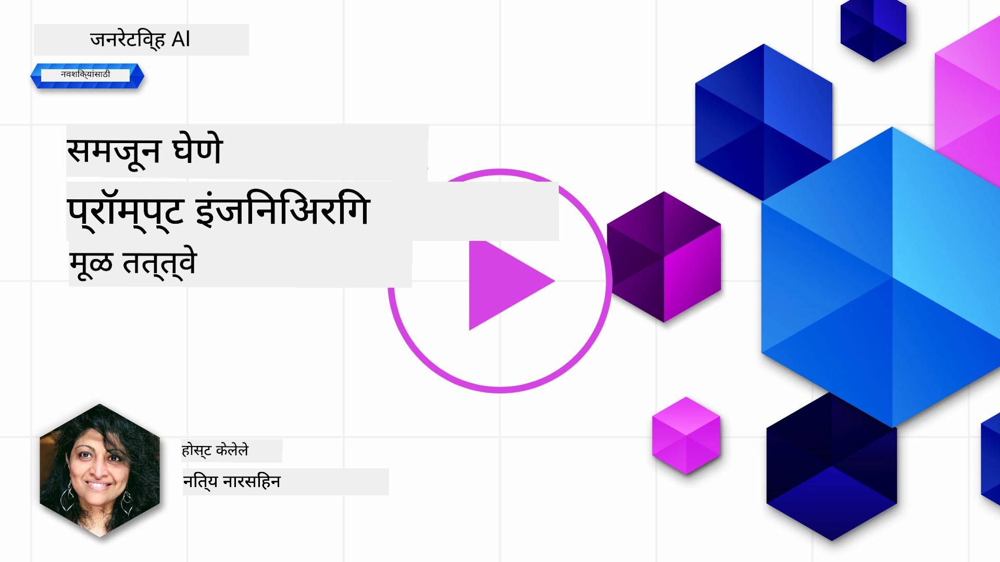
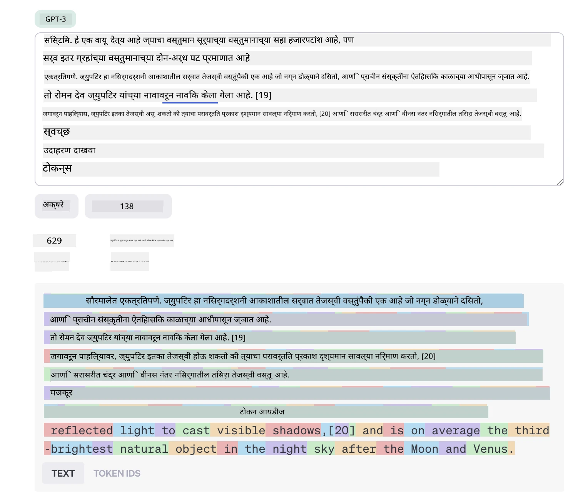
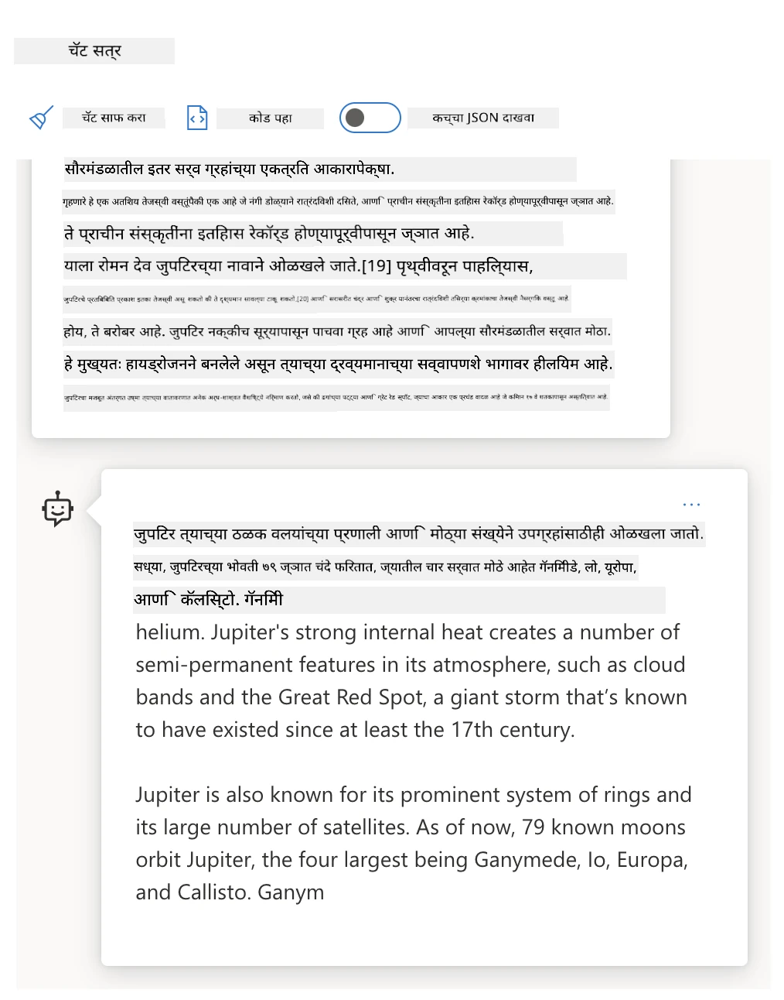
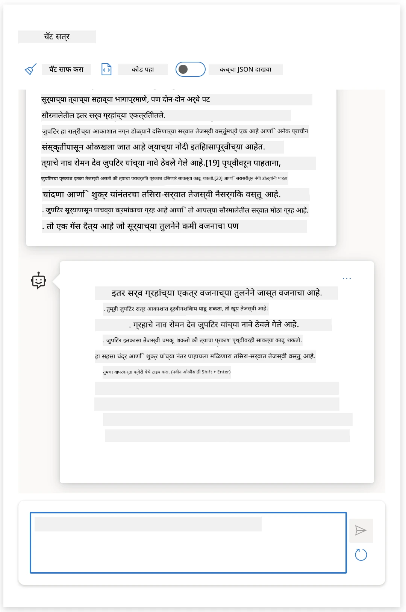
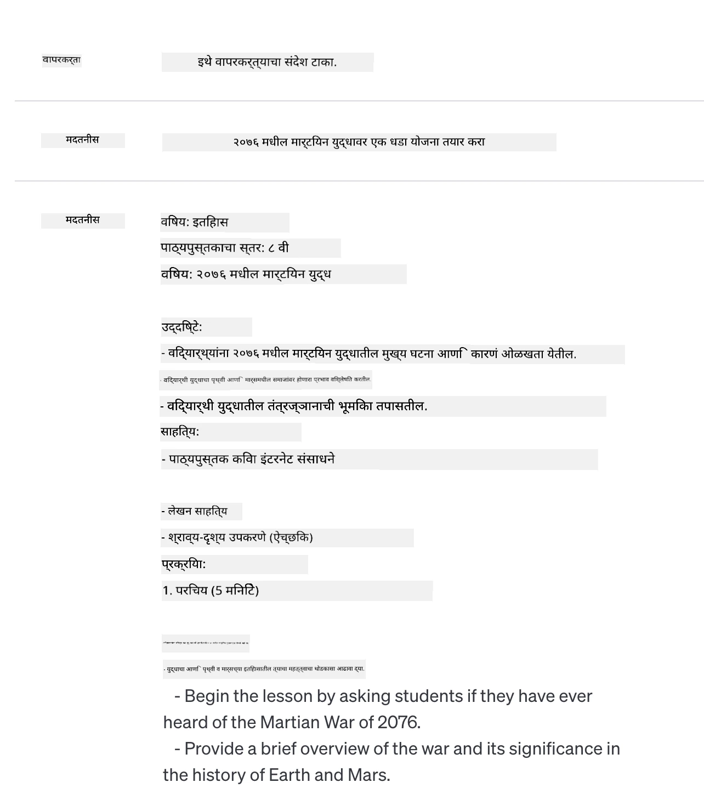
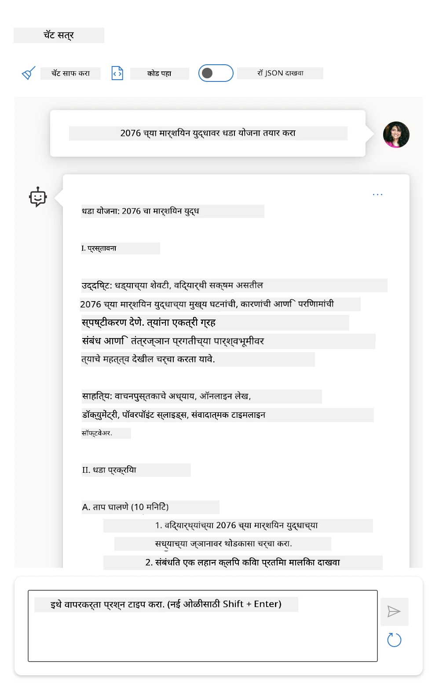
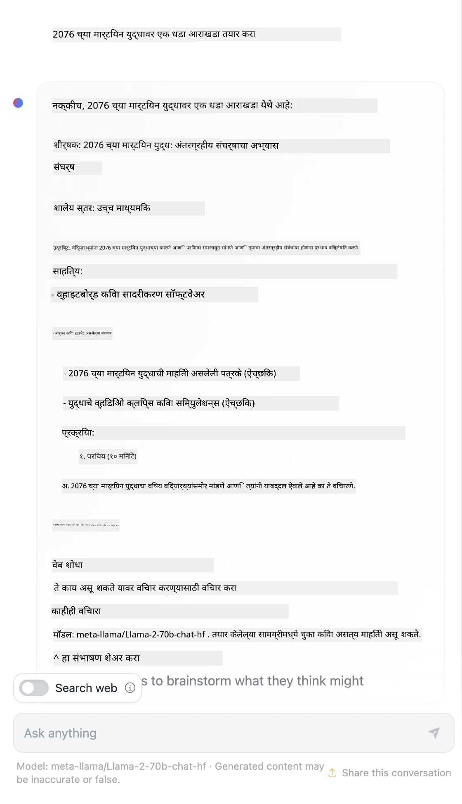

# प्रॉम्प्ट इंजिनीअरिंग मूलतत्त्वे

[](https://youtu.be/GElCu2kUlRs?si=qrXsBvXnCW12epb8)

## परिचय
हा विभाग जनरेटिव्ह AI मॉडेल्समध्ये प्रभावी प्रॉम्प्ट तयार करण्यासाठी आवश्यक संकल्पना आणि तंत्रे समाविष्ट करतो. LLM ला तुमचा प्रॉम्प्ट कसा लिहिला जातो हे देखील महत्वाचे असते. काळजीपूर्वक तयार केलेला प्रॉम्प्ट उत्तम दर्जाचा प्रतिसाद मिळवू शकतो. पण प्रॉम्प्ट आणि प्रॉम्प्ट इंजिनीअरिंग या संज्ञा म्हणजे नक्की काय? आणि मी LLM कडे पाठविलेल्या प्रॉम्प्ट इनपुटमध्ये सुधारणा कशी करू? या प्रश्नांची उत्तरे आपण या अध्यायात आणि पुढील मध्ये शोधू.

_जनरेटिव्ह AI_ नवीन सामग्री (उदा., मजकूर, प्रतिमा, ऑडिओ, कोड इ.) तयार करण्यास सक्षम आहे वापरकर्त्यांच्या विनंत्यांनुसार. हे OpenAI च्या GPT ("Generative Pre-trained Transformer") सारख्या _Large Language Models_ द्वारे साध्य केले आहे जे नैसर्गिक भाषा आणि कोड वापरून प्रशिक्षण घेतलेले आहेत.

वापरकर्ते आता तांत्रिक कौशल्य किंवा प्रशिक्षण न घेता, चॅट सारख्या परिचित पद्धतीने या मॉडेल्सशी संवाद साधू शकतात. मॉडेल्स _प्रॉम्प्ट-आधारित_ आहेत - वापरकर्ता टेक्स्ट इनपुट (प्रॉम्प्ट) पाठवतो आणि AI प्रतिसाद (पूर्णता) प्राप्त करतो. ते नंतर AI सोबत अनेक टप्प्यांत संवाद करू शकतात, त्यांच्या प्रॉम्प्टमध्ये सुधारणा करत प्रतिसाद त्यांच्या अपेक्षांना जुळेपर्यंत.

"प्रॉम्प्ट्स" आता जनरेटिव्ह AI अनुप्रयोगांसाठी प्राथमिक _प्रोग्रामिंग इंटरफेस_ बनले आहेत, जे मॉडेल्सना काय करायचे ते सांगतात आणि परत आलेल्या प्रतिसादांच्या दर्जावर परिणाम करतात. "प्रॉम्प्ट इंजिनीअरिंग" हा अत्यंत वेगाने वाढणारा अभ्यासाचा क्षेत्र आहे जो प्रॉम्प्टची _डिझाइन आणि अनुकूलन_ करून स्थिर व दर्जेदार प्रतिसाद देण्यावर लक्ष केंद्रित करतो.

## शिक्षण उद्दिष्टे

या धड्यामध्ये आपण प्रॉम्प्ट इंजिनीअरिंग म्हणजे काय, का महत्त्वाचे आहे, आणि दिलेल्या मॉडेल आणि अनुप्रयोग उद्दिष्टासाठी अधिक प्रभावी प्रॉम्प्ट कसे तयार करायचे हे शिकू. आपण प्रामुख्य संकल्पना आणि सर्वोत्तम सराव समजून घेऊ - आणि परस्परसंवादी Jupyter Notebooks "सँडबॉक्स" वातावरणाबद्दल जाणून घेऊ जिथे आपण या संकल्पना प्रत्यक्ष उदाहरणांवर पाहू शकतो.

या धड्याच्या शेवटी आपण खालील क्षमता मिळवू:

1. प्रॉम्प्ट इंजिनीअरिंग काय आहे आणि का महत्त्वाचे आहे ते स्पष्ट करा.
2. प्रॉम्प्टचे घटक काय आहेत आणि ते कसे वापरले जातात हे वर्णन करा.
3. प्रॉम्प्ट इंजिनीअरिंगसाठी सर्वोत्तम सल्ले आणि तंत्रे शिका.
4. OpenAI एन्डपॉईंट वापरून शिकलेल्या तंत्रांचा प्रत्यक्ष उदाहरणांवर वापर करा.

## मुख्य संज्ञा

प्रॉम्प्ट इंजिनीअरिंग: AI मॉडेल्सना इच्छित आउटपुट निर्माण करण्यासाठी मार्गदर्शन करण्यासाठी इनपुट डिझाइन व सुधारण्याचा सराव.
टोकनायझेशन: मजकूर लहान युनिट्स (टोकन्स) मध्ये रूपांतरित करण्याची प्रक्रिया, ज्याला मॉडेल समजू शकतो आणि प्रक्रिया करू शकतो.
इन्स्ट्रक्शन-ट्यूनड LLMs: मोठे भाषा मॉडेल्स ज्यांना विशिष्ट सूचनांसह सुधारित केले गेले आहे जेणेकरुन त्यांची प्रतिसाद अचूकता आणि सुसंगतता वाढेल.

## शिक्षण सँडबॉक्स

प्रॉम्प्ट इंजिनीअरिंग सध्या विज्ञानापेक्षा कला जास्त आहे. त्याचा अनुभव वाढवण्यासाठी सर्वोत्तम मार्ग म्हणजे _अधिक सराव करणे_ आणि चाचणी-तपासणीची पद्धत अवलंबणे जी अनुप्रयोग क्षेत्रातील तज्ञतेसह शिफारस केलेल्या तंत्रे आणि मॉडेल-विशिष्ट सुधारणांशी संमिश्रित असते.

या धड्यासोबत दिलेला Jupyter Notebook आपल्याला शिकत असताना किंवा शेवटी दिलेल्या कोड अँड चॅलेंजच्या भाग म्हणून प्रयत्न करण्यासाठी _सँडबॉक्स_ वातावरण पुरवतो. व्यायाम करण्यासाठी आपल्याला आवश्यक आहे:

1. **एक Azure OpenAI API की** - तैनात केलेल्या LLM साठी सेवा एन्डपॉईंट.
2. **एक Python Runtime** - ज्यात Notebook चालवता येईल.
3. **स्थानिक पर्यावरण चल** - _[SETUP](./../00-course-setup/02-setup-local.md?WT.mc_id=academic-105485-koreyst) पावले पूर्ण करा आणि तयार व्हा_.

Notebook मध्ये _स्टार्टर_ व्यायाम समाविष्ट आहेत - पण आपण आपले स्वतःचे _Markdown_ (वर्णन) आणि _Code_ (प्रॉम्प्ट विनंत्या) विभाग जोडण्यास प्रोत्साहित आहात - अधिक उदाहरणे किंवा कल्पना तपासण्यासाठी - आणि प्रॉम्प्ट डिझाइनसाठी आपली जाण वाढवण्यासाठी.

## प्रतिमात्मक मार्गदर्शक

हा धडा काय व्यापतो याचा संपूर्ण आढावा घ्यायचा आहे का? तर या प्रतिमात्मक मार्गदर्शकाशी ओळख करा, ज्यात मुख्य विषयांची रूपरेषा आणि प्रत्येकासाठी मुख्य मुद्दे दिलेले आहेत. धडा आपल्या समजुतीत महत्त्वाच्या संकल्पना आणि आव्हाने घेऊन सरावासाठी संबंधित प्रॉम्प्ट इंजिनीअरिंग तंत्रे आणि सर्वोत्तम पद्धतींना जोडतो. लक्षात घ्या की या मार्गदर्शकातील "अत्याधुनिक तंत्रे" विभाग या अभ्यासक्रमाच्या _पुढील_ अध्यायात दिलेल्या विषयाला संदर्भित करतो.


## आपली स्टार्टअप

आता, चला पाहूया की _हा विषय_ आपल्या स्टार्टअपच्या मिशनशी कसा जोडतो ज्यात [शिक्षणात AI नवकल्पना आणण्याचा](https://educationblog.microsoft.com/2023/06/collaborating-to-bring-ai-innovation-to-education?WT.mc_id=academic-105485-koreyst) आमचा उद्देश आहे. आम्हाला _वैयक्तिकृत शिक्षणाचे_ AI-चालित अनुप्रयोग तयार करायचे आहेत - त्यामुळे चला पाहूया आमच्या अनुप्रयोगाचे वेगवेगळे वापरकर्ते कसे "प्रॉम्प्ट" डिझाइन करू शकतात:

- **प्रशासक** AI ला _शैक्षणिक अभ्यासक्रमातील ढग ओळखण्यासाठी विश्लेषण करण्यास_ सांगू शकतात. AI निकालांचे सारांश देऊ शकतो किंवा कोडसह त्यांचे दृश्यरूप प्रदान करू शकतो.
- **शिक्षक** AI ला _लक्ष्य प्रेक्षक आणि विषयासाठी धडा योजना तयार करण्यासाठी_ विचारू शकतात. AI एक निर्दिष्ट फॉरमॅटमध्ये वैयक्तिकित योजना तयार करू शकतो.
- **विद्यार्थी** AI ला _एखाद्या कठीण विषयात शिकविण्यासाठी_ विचारू शकतात. AI आता विद्यार्थ्यांना त्यांच्या पातळीप्रमाणे धडे, संकेत व उदाहरणांनी मार्गदर्शन करू शकतो.

हे तर फक्त सुरुवातीचे उदाहरण आहे. [Prompts For Education](https://github.com/microsoft/prompts-for-edu/tree/main?WT.mc_id=academic-105485-koreyst) बघा - शिक्षण तज्ञांनी तयार केलेली ओपन-सोर्स प्रॉम्प्ट्स लायब्ररी - जे तुम्हाला अधिक शक्यता कळू शकेल! _त्या प्रॉम्प्ट्सना सँडबॉक्समध्ये किंवा OpenAI Playground मध्ये चालवून पाहा आणि काय होते ते पहा!_

<!--
LESSON TEMPLATE:
This unit should cover core concept #1.
Reinforce the concept with examples and references.

CONCEPT #1:
Prompt Engineering.
Define it and explain why it is needed.
-->

## प्रॉम्प्ट इंजिनीअरिंग म्हणजे काय?

आपण या धड्याची सुरुवात केली होती **प्रॉम्प्ट इंजिनीअरिंग** या संकल्पनेची व्याख्या करून ज्यामध्ये _डिझाइनिंग_ आणि _ऑप्टिमायझेशन_ द्वारे टेक्स्ट इनपुट्स (प्रॉम्प्ट्स) तयार करणे व सुधारणे समाविष्ट आहे जे दिलेल्या अनुप्रयोग उद्दिष्ट आणि मॉडेलसाठी स्थिर व उच्च-प्रमाणित प्रतिसाद (पूर्णता) प्रदान करतात. आपण हे दोन टप्प्यातील प्रक्रिया मानू शकतो:

- दिलेल्या मॉडेल व उद्दिष्टासाठी प्रारंभिक प्रॉम्प्ट _डिझाइन करणे_  
- प्रतिसादाच्या गुणवत्तेत सुधारणा करण्यासाठी प्रॉम्प्टची पुनरावृत्तीने _सुधारणा करणे_

ही अनिवार्यपणे एक चाचणी-चुक प्रक्रिया आहे जी सर्वोत्तम निकालांसाठी वापरकर्त्याच्या अंतर्ज्ञान आणि प्रयत्नांची आवश्यकता असते. तर मग हे का महत्त्वाचे आहे? त्याचे उत्तर देण्यासाठी आपल्याला तीन संकल्पना समजून घ्याव्या लागतील:

- _टोकनायझेशन_ = मॉडेल प्रॉम्प्ट कसे "पाहते"
- _बेस LLMs_ = फाउंडेशन मॉडेल प्रॉम्प्ट कसे "प्रक्रिया" करतो
- _इन्स्ट्रक्शन-ट्यूनड LLMs_ = आता मॉडेल "कार्य" कसे पाहू शकतो

### टोकनायझेशन

LLM प्रॉम्प्ट्सना _टोकन्सच्या मालिके_ स्वरूपात पाहतो जिथे वेगवेगळे मॉडेल्स (किंवा मॉडेलच्या आवृत्त्या) ते एकसारखे प्रॉम्प्ट वेगवेगळ्या पद्धतीने टोकनायझ करू शकतात. कारण LLM ला कच्च्या मजकूराऐवजी टोकन्सवर प्रशिक्षण दिले जाते, प्रॉम्प्ट्स कसे टोकनायझ होतात याचा तयार प्रतिसादाच्या गुणवत्तेवर थेट परिणाम होतो.

टोकनायझेशन कसे काम करते याचा अर्थ लावण्यासाठी, [OpenAI Tokenizer](https://platform.openai.com/tokenizer?WT.mc_id=academic-105485-koreyst) सारखे साधन वापरून पाहा. तुमचा प्रॉम्प्ट कॉपी करा - आणि तो कसा टोकन्समध्ये परिवर्तित होतो ते पहा, विशेषतः रिकाम्या जागा आणि विरामचिन्हे कशी हाताळली जातात याकडे लक्ष द्या. लक्षात घ्या की हा उदाहरण जुना LLM (GPT-3) दर्शवतो - त्यामुळे नवीन मॉडेलवर प्रयत्न केल्यास वेगळा परिणाम मिळू शकतो.



### संकल्पना: फाउंडेशन मॉडेल्स

प्रॉम्प्ट टोकनायझ केल्यानंतर, ["बेस LLM"](https://blog.gopenai.com/an-introduction-to-base-and-instruction-tuned-large-language-models-8de102c785a6?WT.mc_id=academic-105485-koreyst) (किंवा फाउंडेशन मॉडेल) चे मुख्य कार्य त्या मालिकेतील पुढचा टोकन भाकीत करणे आहे. LLM मोठ्या मजकूर डेटासेटवर प्रशिक्षित असल्यामुळे त्यांना टोकन्समधील सांख्यिकीय संबंधांची चांगली जाणीव असते आणि ते आत्मविश्वासाने अंदाज लावू शकतात. लक्षात ठेवा की ते प्रॉम्प्ट किंवा टोकनमधील शब्दांचे _अर्थ_ समजून घेत नाहीत; त्यांना केवळ तो नमुना दिसतो जो ते पुढच्या भाकीताने "पूर्ण" करू शकतात. वापरकर्त्याच्या हस्तक्षेपाने किंवा पूर्वनिर्धारित अटीने थांबवले न जाता ते असे अंदाज चालू ठेवू शकतात.

प्रॉम्प्ट-आधारित पूर्णता कशी काम करते हे पहायचे आहे का? वर दिलेला प्रॉम्प्ट Azure OpenAI Studio मधील [_Chat Playground_](https://oai.azure.com/playground?WT.mc_id=academic-105485-koreyst) मध्ये डिफॉल्ट सेटिंग्जसह टाका. सिस्टम प्रॉम्प्ट्सना माहितीच्या विनंती म्हणून हाताळण्यासाठी सेट केलेले आहे - त्यामुळे हे संदर्भ पूर्ण करणारा प्रतिसाद तुम्हाला पाहायला मिळेल.

पण वापरकर्ता एखाद्या ठराविक निकष किंवा कार्य उद्दिष्टाशी जुळणारे काही पाहू इच्छित असल्यास काय? तेव्हा _इन्स्ट्रक्शन-ट्यूनड_ LLM चे महत्त्व वाढते.



### संकल्पना: इन्स्ट्रक्शन ट्यूनड LLMs

[इन्स्ट्रक्शन ट्यूनड LLM](https://blog.gopenai.com/an-introduction-to-base-and-instruction-tuned-large-language-models-8de102c785a6?WT.mc_id=academic-105485-koreyst) ही फाउंडेशन मॉडेल घेऊन ती उदाहरणे किंवा इनपुट/आउटपुट जोड्यांनी (उदा., बहु-टप्प्याचे "संदेश") फाइन-ट्यून केली जाते जिथे स्पष्ट सूचना दिलेल्या असतात - आणि AI द्वारे दिलेला प्रतिसाद त्या सूचनेचे पालन करण्याचा प्रयत्न करतो.

हा Reinforcement Learning with Human Feedback (RLHF) सारखा तंत्रज्ञान वापरतो जे मॉडेलला _सूचना पाळण्यास_ आणि _फीडबॅक मधून शिकण्यास_ प्रशिक्षित करतो ज्यामुळे तो वास्तविक अनुप्रयोगांसाठी जास्त उपयुक्त आणि वापरकर्त्याच्या उद्दिष्टांशी अधिक संबंधित प्रतिसाद तयार करतो.

चला याचा अनुभव घेऊ - वरील प्रॉम्प्ट पुन्हा वापरा, पण आता _सिस्टम मेसेज_ मध्ये खालील सूचना संदर्भ म्हणून द्या:

> _तुम्हाला पुरवलेली माहिती दुसऱ्या वर्गातील विद्यार्थ्यांसाठी सारांश करा. निकाल एका परिच्छेदात ३-५ बुलेट पॉइंट्ससह ठेवा._

पहा कसे निकाल आता इच्छित उद्दिष्ट आणि स्वरूपाशी सुसंगत झाला आहे? शिक्षक नक्कीच हा प्रतिसाद त्यांच्या वर्गातील स्लाईडमध्ये थेट वापरू शकतात.



## प्रॉम्प्ट इंजिनीअरिंग का आवश्यक आहे?

आता आपण समजून घेतले की LLM कसे प्रॉम्प्ट प्रक्रिया करतात, तर प्रॉम्प्ट इंजिनीअरिंग का आवश्यक आहे ते पाहूया. याचे कारण आहे की सध्याचे LLM अनेक आव्हाने मांडतात ज्यामुळे _विश्वसनीय आणि सुसंगत पूर्णता_ मिळवणे प्रॉम्प्ट बांधणी आणि ऑप्टिमायझेशन शिवाय कठीण होते. काही मुद्दे खालीलप्रमाणे:

1. **मॉडेल प्रतिसाद यादृच्छिक आहेत.** _त्याच प्रॉम्प्ट_ ला भिन्न मॉडेल किंवा मॉडेलच्या भिन्न आवृत्त्यांवर वेगवेगळे प्रतिसाद मिळू शकतात. तसेच _त्याच मॉडेलवर_ वेगवेगळ्या वेळी वेगळे परिणाम येऊ शकतात. _प्रॉम्प्ट इंजिनीअरिंग तंत्रे या बदलांवर नियंत्रण ठेवण्यासाठी मदत करतात_.

1. **मॉडेल्स कधी कधी चुकीचे प्रतिसाद तयार करतात.** मॉडेल्स मोठ्या परंतु मर्यादीत डेटासेटवर प्रशिक्षित असल्यामुळे त्यांना अशा संकल्पनांची माहिती नसू शकते जी त्या प्रशिक्षणाच्या बाहेर आहेत. म्हणून ते चुकीची, काल्पनिक किंवा प्रत्यक्ष विदित तथ्यांना विरोधी असलेली पूर्णता तयार करू शकतात. _प्रॉम्प्ट इंजिनीअरिंग तंत्रे वापरकर्त्यांना अशी बनावट माहिती ओळखण्यात आणि प्रतिबंधित करण्यात मदत करतात उदा., AI कडून संदर्भ किंवा कारण विचारून_.

1. **मॉडेल क्षमतांमध्ये फरक असतो.** नवीन मॉडेल्स किंवा मॉडेल पिढ्या अधिक समृद्ध क्षमता आणतात, पण त्याचबरोबर खर्च व क्लिष्टतेत अनोख्या अडचणी आणि धोरणे आणतात. _प्रॉम्प्ट इंजिनीअरिंग आपल्याला सर्वोत्तम सल्ले आणि कार्यप्रणाली विकसित करण्यात मदत करतो जी फरक लपवून मॉडेल-विशिष्ट गरजांसाठी मापानुसार सुलभ बनवतात_.

हे OpenAI किंवा Azure OpenAI Playground मध्ये पाहूया:

- वेगवेगळ्या LLM तैनातींसह (उदा., OpenAI, Azure OpenAI, Hugging Face) एकसारखा प्रॉम्प्ट वापरून पाहा - तुम्हाला फरक दिसले का?
- _त्याच_ LLM तैनातीसह (उदा., Azure OpenAI playground) प्रॉम्प्ट अनेकदा पुन्हा वापरा - फरक कसा होता?

### बनावट माहितीचे उदाहरण

या कोर्समध्ये आपण **"बनावट"** हा शब्द LLM कधी कधी प्रशिक्षणाच्या मर्यादा किंवा इतर अडचणींमुळे तथ्यदृष्ट्या चुकीची माहिती तयार करण्याच्या घटनेसाठी वापरतो. तुम्हाला कदाचित हे लोकप्रिय लेख किंवा संशोधन कागदांमध्ये _"हॅल्युसिनेशन्स"_ म्हणूनही ऐकायला मिळाले असेल. मात्र, आम्ही "बनावट" हा शब्द वापरण्याचा जोरदार सल्ला देतो जेणेकरून आपण हे वर्तन मानवीसारखे रूप देऊन गैरसमज करून घेणार नाही, कारण हे मशीन चालित परिणाम आहेत. हे [उत्तरदायी AI मार्गदर्शक](https://www.microsoft.com/ai/responsible-ai?WT.mc_id=academic-105485-koreyst) च्या दृष्टिकोनातूनही महत्त्वाचे आहे, जे अशा शब्दांचा वापर टाळते जे अपमानास्पद किंवा गैरसमावेशक समजले जाऊ शकतात.

बनावट माहिती कशी काम करते याचा अंदाज घ्यायचा आहे का? असा प्रॉम्प्ट विचार करा ज्यात AI ला एक अस्तित्वात नसलेल्या विषयावर सामग्री तयार करण्याचा निर्देश दिला जातो (जेणेकरून ते प्रशिक्षण डेटासेटमध्ये नसावे). उदाहरणार्थ - मी असा प्रॉम्प्ट वापरला:

> **प्रॉम्प्ट:**  Martian War of 2076 विषयी धडा योजना तयार करा.
एक वेब शोधात मला असे समजले की मार्टियन युद्धांवर काल्पनिक कथा (उदा., टेलिव्हिजन सिरिज किंवा पुस्तके) आहेत - पण २०७६ मध्ये काही नाहीत. सामान्य समज सांगते की २०७६ हा _भविष्यात_ आहे आणि त्यामुळे तो खऱ्या घटनेशी जोडता येत नाही.

तर वेगवेगळ्या LLM प्रदात्यांसह हा प्रॉम्प्ट चालवल्यावर काय होते?

> **उत्तर १**: OpenAI Playground (GPT-35)



> **उत्तर २**: Azure OpenAI Playground (GPT-35)



> **उत्तर ३**: : Hugging Face Chat Playground (LLama-2)



अपेक्षेनुसार, प्रत्येक मॉडेल (किंवा मॉडेल आवृत्ती) थोडक्याफार वेगवेगळे प्रतिसाद तयार करतात, ज्यामुळे स्टोकास्टिक वर्तन आणि मॉडेल क्षमतांमधील फरक दिसून येतो. उदाहरणार्थ, एक मॉडेल ८वी इयत्तेच्या विद्यार्थ्यांसाठी उद्देशीत आहे, तर दुसरे उच्च माध्यमिक विद्यार्थ्यांसाठी धरते. पण या तीनही मॉडेलांनी असे प्रतिसाद दिले जे अनुप्रचित वापरकर्त्यास ठोसपणे हे घटना खर्याचे वाटण्यास भाग पाडू शकतात.

_मेटाप्रोम्प्टिंग_ आणि _टेम्परेचर कॉन्फिगरेशन_ सारख्या प्रॉम्प्ट अभियांत्रिकी तंत्रांमुळे मॉडेल निर्मित गैरवास्तविकता काही प्रमाणात कमी होऊ शकते. नवीन प्रॉम्प्ट अभियांत्रिकी _संचना_ देखील नवीन साधने आणि तंत्रांचा सहज प्रवाहामध्ये समावेश करतात, ज्यामुळे ह्या परिणामांपैकी काही कमी होतात.

## केस स्टडी: GitHub Copilot

चला हा विभाग GitHub Copilot ही एक रिअल-वर्ल्ड साधन असून प्रॉम्प्ट अभियांत्रिकी कशी वापरली जाते हे पाहून संपवूया: [GitHub Copilot](https://github.com/features/copilot?WT.mc_id=academic-105485-koreyst).

GitHub Copilot हा तुमचा "AI जोडीदार प्रोग्रामर" आहे - तो टेक्स्ट प्रॉम्प्ट्सना कोड पूर्णतेत रूपांतरित करतो आणि तुमच्या विकास वातावरणात (उदा., Visual Studio Code) समाकलित आहे जेणेकरून वापरकर्ता अनुभव सुरळीत होतो. खाली नमूद केलेल्या ब्लॉग मालिकेत दस्तऐवजीकरणानुसार, सुरुवातीची आवृत्ती OpenAI Codex मॉडेलवर आधारित होती - अभियंत्यांनी लवकरच मॉडेलचे सुधारणा करण्याची गरज ओळखली आणि कोड गुणवत्ता सुधारण्यासाठी उत्तम प्रॉम्प्ट अभियांत्रिकी तंत्र विकसित केली. जुलैमध्ये, त्यांनी [Codex पेक्षा पुढे जाणारे एक सुधारित AI मॉडेल](https://github.blog/2023-07-28-smarter-more-efficient-coding-github-copilot-goes-beyond-codex-with-improved-ai-model/?WT.mc_id=academic-105485-koreyst) सादर केले जे जलद शिफारसी देतो.

त्यांच्या शिकण्याच्या प्रवासासाठी पोस्ट्स क्रमाने वाचा.

- **मे २०२३** | [GitHub Copilot तुमचा कोड अधिक चांगल्या प्रकारे समजून घेऊ लागला आहे](https://github.blog/2023-05-17-how-github-copilot-is-getting-better-at-understanding-your-code/?WT.mc_id=academic-105485-koreyst)
- **मे २०२३** | [GitHub Copilot मागे असलेल्या LLMs सह काम करताना](https://github.blog/2023-05-17-inside-github-working-with-the-llms-behind-github-copilot/?WT.mc_id=academic-105485-koreyst)
- **जून २०२३** | [GitHub Copilot साठी चांगले प्रॉम्प्ट कसे लिहावे](https://github.blog/2023-06-20-how-to-write-better-prompts-for-github-copilot/?WT.mc_id=academic-105485-koreyst)
- **जुलै २०२३** | [.. GitHub Copilot सुधारित AI मॉडेलसह Codex पेक्षा पुढे जाते](https://github.blog/2023-07-28-smarter-more-efficient-coding-github-copilot-goes-beyond-codex-with-improved-ai-model/?WT.mc_id=academic-105485-koreyst)
- **जुलै २०२३** | [प्रॉम्प्ट अभियांत्रिकी आणि LLMs साठी विकासक मार्गदर्शक](https://github.blog/2023-07-17-prompt-engineering-guide-generative-ai-llms/?WT.mc_id=academic-105485-koreyst)
- **सप्टेंबर २०२३** | [एंटरप्राइज LLM अ‍ॅप कसे तयार करावे: GitHub Copilot कडून धडे](https://github.blog/2023-09-06-how-to-build-an-enterprise-llm-application-lessons-from-github-copilot/?WT.mc_id=academic-105485-koreyst)

तुम्ही त्यांच्या [अभियांत्रिकी ब्लॉग](https://github.blog/category/engineering/?WT.mc_id=academic-105485-koreyst) मध्ये अधिक अशा पोस्ट्सची माहिती घेऊ शकता जसे की [ही पोस्ट](https://github.blog/2023-09-27-how-i-used-github-copilot-chat-to-build-a-reactjs-gallery-prototype/?WT.mc_id=academic-105485-koreyst) जी दाखवते की हे मॉडेल्स आणि तंत्रज्ञान कसे _वास्तविक जगातील_ अनुप्रयोगांसाठी वापरले जात आहे.

---

<!--
LESSON TEMPLATE:
This unit should cover core concept #2.
Reinforce the concept with examples and references.

CONCEPT #2:
Prompt Design.
Illustrated with examples.
-->

## प्रॉम्प्ट बांधणी

आपण पाहिले की प्रॉम्प्ट अभियांत्रिकी का महत्त्वाची आहे - आता आपण समजून घेऊ की प्रॉम्प्ट कशा प्रकारे _रचले_ जातात जेणेकरून आपण अधिक प्रभावी प्रॉम्प्ट डिझाइनसाठी विविध तंत्रांचा आढावा घेऊ शकू.

### मूलभूत प्रॉम्प्ट

चला मूलभूत प्रॉम्प्ट पासून सुरुवात करूया: मॉडेलला पाठवलेला एक टेक्स्ट इनपुट ज्यात कोणताही अतिरिक्त संदर्भ नाही. इथे एक उदाहरण आहे - जेव्हा आपण US राष्ट्रीय गीताच्या पहिल्या काही शब्दांना OpenAI [Completion API](https://platform.openai.com/docs/api-reference/completions?WT.mc_id=academic-105485-koreyst) कडे पाठवतो तेव्हा ते लगेच पुढील काही ओळींचे _पूर्ण_ उत्तर देते, ज्यामुळे मूलभूत भविष्यवाणी वर्तन स्पष्ट होते.

| प्रॉम्प्ट (इनपुट)       | पूर्ण (आउटपुट)                                                                                                                             |
| :--------------------- | :----------------------------------------------------------------------------------------------------------------------------------------- |
| Oh say can you see     | असे वाटते की तुम्ही "The Star-Spangled Banner," अमेरिकेचा राष्ट्रीय गीत याचे शब्द सुरू करत आहात. पूर्ण गीत शब्द पुढीलप्रमाणे आहेत...          |

### अवघड प्रॉम्प्ट

आता त्या मूलभूत प्रॉम्प्ट मध्ये संदर्भ आणि सूचना जोडूया. [Chat Completion API](https://learn.microsoft.com/azure/ai-services/openai/how-to/chatgpt?WT.mc_id=academic-105485-koreyst) आपल्याला प्रॉम्प्ट एक _संवाद संदेशांचे_ संच म्हणून तयार करण्यास परवानगी देते, जे खालील प्रमाणे:

- इनपुट/आउटपुट जोडी जे _वापरकर्त्याचा_ इनपुट आणि _सहाय्यकाचा_ प्रतिसाद दर्शवते.
- सिस्टिम संदेश ज्यामुळे सहाय्यकाच्या वर्तन किंवा व्यक्तिमत्त्वाचा संदर्भ सेट होतो.

आता विनंती खालील स्वरूपात आहे, जिथे _टोकनायझेशन_ संदर्भ आणि संभाषणातून संबंधित माहिती प्रभावीरीत्या पकडते. सिस्टिम संदर्भ बदलल्याने पूर्णतेच्या दर्जावर तितकाच परिणाम होतो जितका वापरकर्त्याचे इनपुट बदलल्याने होतो.

```python
response = openai.chat.completions.create(
    model="gpt-3.5-turbo",
    messages=[
        {"role": "system", "content": "You are a helpful assistant."},
        {"role": "user", "content": "Who won the world series in 2020?"},
        {"role": "assistant", "content": "The Los Angeles Dodgers won the World Series in 2020."},
        {"role": "user", "content": "Where was it played?"}
    ]
)
```

### सूचना प्रॉम्प्ट

वरील उदाहरणांमध्ये, वापरकर्त्याचा प्रॉम्प्ट एक सोपा टेक्स्ट विचारणा होती, ज्याला माहितीची विनंती म्हणून समजले जाऊ शकते. _सूचना_ प्रॉम्प्टसह आपण त्या टेक्स्टचा वापर करून AI ला करताय त्या कार्यास अधिक तपशीलवार निर्दिष्ट करू शकतो, अधिक चांगले मार्गदर्शन देण्यासाठी. इथे एक उदाहरण:

| प्रॉम्प्ट (इनपुट)                                                                                                                                                                                                                         | पूर्ण (आउटपुट)                                                                                                        | सूचना प्रकार         |
| :------------------------------------------------------------------------------------------------------------------------------------------------------------------------------------------------------------------------------------- | :------------------------------------------------------------------------------------------------------------------------- | :------------------ |
| Write a description of the Civil War                                                                                                                                                                                                   | _सोप्या परिच्छेदात प्रतिसाद दिला_                                                                                        | सोपा                 |
| Write a description of the Civil War. Provide key dates and events and describe their significance                                                                                                                                     | _परिच्छेदासोबत मुख्य घटनांची नावे आणि वर्णने दिली_                                                                       | जटिल                 |
| Write a description of the Civil War in 1 paragraph. Provide 3 bullet points with key dates and their significance. Provide 3 more bullet points with key historical figures and their contributions. Return the output as a JSON file | _जास्त सविस्तर माहिती JSON स्वरूपात दिली ज्याला कॉपी-पेस्ट करून फाइलमध्ये जतन आणि पडताळणी करता येईल_                         | जटिल. स्वरूपित.      |

## प्राथमिक सामग्री

वरील उदाहरणांमध्ये, प्रॉम्प्ट अजूनही तुलनेने खुला होता, ज्यामुळे LLM आपल्याला त्याच्या प्री-ट्रेंड डेटासेटमधून कोणता भाग संबंधित वाटतो ते ठरवू शकतो. _प्राथमिक सामग्री_ डिझाइन पॅटर्नमध्ये, इनपुट टेक्स्ट दोन भागांमध्ये विभागला जातो:

- एक सूचना (क्रिया)
- संबंधित सामग्री (जी क्रियेला प्रभाव टाकते)

इथे एक उदाहरण आहे जिथे सूचना "हे २ वाक्यांत सारांश करा" आहे.

| प्रॉम्प्ट (इनपुट)                                                                                                                                                                                                                                                                                                                                                                                                                                                                                                                                                                                                                                                                                      | पूर्ण (आउटपुट)                                                                                                                                                                                                                                                                             |
| :-------------------------------------------------------------------------------------------------------------------------------------------------------------------------------------------------------------------------------------------------------------------------------------------------------------------------------------------------------------------------------------------------------------------------------------------------------------------------------------------------------------------------------------------------------------------------------------------------------------------------------------------------------------------------------------------------- | :---------------------------------------------------------------------------------------------------------------------------------------------------------------------------------------------------------------------------------------------------------------------------------------------- |
| Jupiter हा सूर्यापासून पाचवा ग्रह आहे आणि सौरमंडळातील सर्वांत मोठा ग्रह आहे. हा एक वायू महामारी आहे ज्याचे गुरुत्वफळ सूर्याच्या गुरुत्वाच्या हजारांशांश आहे, पण सौरमंडळातील इतर सर्व ग्रहांच्या एकत्रित गुरुत्वफळाच्या दोन अर्ध्यांपेक्षा अधिक आहे. Jupiter हा नग्न डोळ्यांनी पाहता येणाऱ्या प्रकाशमान वस्तूंमध्ये एक आहे, आणि तो प्राचीन संस्कृतींपासून ज्ञात आहे. त्याला रोमन देव Jupiter यांचे नाव आहे.[१९] पृथ्वीवरून पाहिल्यास, Jupiter इतका तेजस्वी असू शकतो की त्याच्या परावर्तित प्रकाशामुळे सावल्या दिसू शकतात,[२०] आणि सामान्यतः चंद्र आणि शुक्रयानंतर तिसऱ्या क्रमांकाचा प्रकाशमान नैसर्गिक वस्तु आहे. <br/> **हे २ लहान वाक्यांत सारांश करा** | Jupiter, सूर्यापासून पाचवा ग्रह, सौरमंडळातील सर्वांत मोठा ग्रह आहे आणि रात्री आकाशातील सर्वांत तेजस्वी वस्तूंमध्ये एक आहे. रोमन देव Jupiter च्या नावाने ओळखला जाणारा हा एक वायू महामारी आहे ज्याचे गुरुत्वफळ सौरमंडळातील इतर ग्रहांच्या एकत्रित गुरुत्वफळाच्या दोन्ही अर्ध्या पेक्षा जास्त आहे. |

प्राथमिक सामग्री विभाग वेगवेगळ्या पद्धतींनी अधिक प्रभावी सूचना देण्यासाठी वापरला जाऊ शकतो:

- **उदाहरणे** - मॉडेलला स्पष्ट सूचना न देता, त्याला काय करायचे आहे हे बोध देण्यासाठी काही उदाहरणे देणे.
- **संकेत** - सूचनेनंतर असे "संकेत" देणे जे पूर्णतेसाठी मार्गदर्शन करते, ज्यामुळे मॉडेल अधिक संबंधित प्रतिसाद देते.
- **टेम्पलेट्स** - हे पुनरावृत्ती करता येणाऱ्या 'रेसिपी' सारखे असतात ज्यात स्थानधारक (व्हेरिएबल्स) असतात, जे विशिष्ट वापरासाठी व्यवस्थीत करता येतात.

चला याचे प्रयोग पाहूया.

### उदाहरणांचा वापर

हा एक पद्धत आहे जिथे आपण प्राथमिक सामग्री म्हणून इच्छित आउटपुटची काही उदाहरणे मॉडेलला "खाण्यास" देतो आणि ते नमुन्यावरून आउटपुट कसे द्यायचे ते ठरवते. उदाहरणांच्या संख्येनुसार, आपण झीरो-शॉट, वन-शॉट, फ्यू-शॉट प्रॉम्प्टिंग करू शकतो.

प्रॉम्प्ट आता तीन भागांचा समावेश करतो:

- कार्याचे वर्णन
- इच्छित आउटपुटची काही उदाहरणे
- नवीन उदाहरणाची सुरुवात (जी अप्रत्यक्षपणे कार्याचे वर्णन करते)

| शिकण्याचा प्रकार        | प्रॉम्प्ट (इनपुट)                                                                                                                                  | पूर्ण (आउटपुट)           |
| :--------------------- | :------------------------------------------------------------------------------------------------------------------------------------------------ | :------------------------- |
| झीरो-शॉट              | "The Sun is Shining". हे स्पॅनिशमध्ये भाषांतर करा                                                                                                  | "El Sol está brillando".    |
| वन-शॉट                | "The Sun is Shining" => ""El Sol está brillando". <br> "It's a Cold and Windy Day" =>                                                               | "Es un día frío y ventoso". |
| फ्यू-शॉट               | The player ran the bases => Baseball <br/> The player hit an ace => Tennis <br/> The player hit a six => Cricket <br/> The player made a slam-dunk => | Basketball                  |
|                        |                                                                                                                                                   |                            |

ध्यानात ठेवा झीरो-शॉट प्रॉम्प्टिंगमध्ये स्पष्ट सूचना ("हे स्पॅनिशमध्ये भाषांतर करा") द्यावी लागली, पण वन-शॉट प्रॉम्प्टिंगमध्ये ती अप्रत्यक्षपणे समजते. फ्यू-शॉट उदाहरण दर्शवते की अधिक उदाहरणे देऊन मॉडेल अचूक अनुमान लावू शकतात, जरी कोणतीही सूचना दिलेली नसेल तरी.

### प्रॉम्प्ट संकेत

प्राथमिक सामग्री वापरण्याचा आणखी एक तंत्र _संकेत_ पुरवणे आहे, उदाहरणांच्या ऐवजी. या पद्धतीत आपण मॉडेलला योग्य दिशेने _सुरुवात करणारा_ छोटा तुकडा देतो, जो इच्छित प्रतिसादाच्या स्वरूपाशी सुसंगत असतो. मॉडेल त्यानंतर त्या शैलीत पुढे चालते.

| संकेतांची संख्या       | प्रॉम्प्ट (इनपुट)                                                                                                                                                                                                                                                                                                                                                                                                                                               | पूर्ण (आउटपुट)                                                                                                                                                                                                                                                                                       |
| :-------------------- | :----------------------------------------------------------------------------------------------------------------------------------------------------------------------------------------------------------------------------------------------------------------------------------------------------------------------------------------------------------------------------------------------------------------------------------------------------------- | :-------------------------------------------------------------------------------------------------------------------------------------------------------------------------------------------------------------------------------------------------------------------------------------------------------- |
| ०                     | Jupiter हा सूर्यापासून पाचवा ग्रह आहे आणि सौरमंडळातील सर्वांत मोठा ग्रह आहे. हा एक वायू महामारी आहे ज्याचे गुरुत्वफळ सूर्याच्या गुरुत्वाच्या हजारांशांश आहे, पण सौरमंडळातील इतर सर्व ग्रहांच्या एकत्रित गुरुत्वफळाच्या दोन अर्ध्यांपेक्षा अधिक आहे. Jupiter हा नग्न डोळ्यांनी पाहता येणाऱ्या प्रकाशमान वस्तूंमध्ये एक आहे, आणि तो प्राचीन संस्कृतींपासून ज्ञात आहे. <br/>**हे सारांश करा**                                       | Jupiter हा आपल्या सौरमंडळातील सर्वांत मोठा ग्रह आहे आणि सूर्यापासून पाचवा ग्रह आहे. हा वायू महामारी असून त्याचे गुरुत्वफळ सूर्याच्या हजारांशाच्या इतके आहे, पण इतर ग्रहांच्या एकत्रित गुरुत्वफळापेक्षा जास्त आहे. प्राचीन संस्कृतींना Jupiter परिचित आहे आणि तो रात्री आकाशात सहज दिसणारा आहे. |
| 1              | बृहस्पति हा सूर्यापासून पाचव्या क्रमांकाचा ग्रह आहे आणि सौरमंडळातील सर्वात मोठा ग्रह आहे. हा एक वायू दैत्य आहे ज्याचा द्रव्यमान सूर्याच्या द्रव्यमानाच्या हजारपट्याशी तुलनात्मक आहे, परंतु इतर सर्व ग्रहांच्या एकत्रित द्रव्यमानाच्या दोन अर्धेपटींपेक्षा जास्त आहे. बृहस्पति हा रात्रीच्या आकाशात नंग्या डोळ्याने दिसणाऱ्या सर्वात तेजस्वी वस्तूंपैकी एक आहे, आणि तो प्राचीन संस्कृतींना इतिहासाच्या पूर्वीपासूनच ज्ञात आहे. <br/>**हे सारांश करा** <br/> आपण पाहिले की बृहस्पति | हा सूर्यापासून पाचव्या क्रमांकाचा ग्रह आहे आणि सौरमंडळातील सर्वात मोठा ग्रह आहे. हा एक वायू दैत्य आहे ज्याचा द्रव्यमान सूर्याच्या द्रव्यमानाच्या हजारपट्याशी तुलनात्मक आहे, परंतु सर्व इतर ग्रहांच्या एकत्रित द्रव्यमानाच्या दोन अर्धेपटींपेक्षा जास्त आहे. तो सहजपणे नंग्या डोळ्याने दिसतो आणि प्राचीन काळापासून ज्ञात आहे.                        |
| 2              | बृहस्पति हा सूर्यापासून पाचव्या क्रमांकाचा ग्रह आहे आणि सौरमंडळातील सर्वात मोठा ग्रह आहे. हा एक वायू दैत्य आहे ज्याचा द्रव्यमान सूर्याच्या द्रव्यमानाच्या हजारपट्याशी तुलनात्मक आहे, परंतु इतर सर्व ग्रहांच्या एकत्रित द्रव्यमानाच्या दोन अर्धेपटींपेक्षा जास्त आहे. बृहस्पति हा रात्रीच्या आकाशात नंग्या डोळ्याने दिसणाऱ्या सर्वात तेजस्वी वस्तूंपैकी एक आहे, आणि तो प्राचीन संस्कृतींना इतिहासाच्या पूर्वीपासूनच ज्ञात आहे. <br/>**हे सारांश करा** <br/> आपण शिकलेले शीर्ष ३ तथ्ये:         | 1. बृहस्पति हा सूर्यापासून पाचव्या क्रमांकाचा ग्रह आहे आणि सौरमंडळातील सर्वात मोठा ग्रह आहे. <br/> 2. तो एक वायू दैत्य आहे ज्याचा द्रव्यमान सूर्याच्या द्रव्यमानाच्या हजारपट्याशी तुलनात्मक आहे...<br/> 3. प्राचीन काळापासून बृहस्पति नंग्या डोळ्याने दिसतो ...                                                                       |
|                |                                                                                                                                                                                                                                                                                                                                                                                                                                                              |                                                                                                                                                                                                                                                                                                           |

### प्रॉम्प्ट टेम्प्लेट्स

प्रॉम्प्ट टेम्प्लेट म्हणजे _प्रॉम्प्टसाठी आधीच तयार केलेली रेसिपी_ जी साठवून ठेवता येते आणि आवश्यकतेनुसार पुन्हा वापरता येते, ज्यामुळे मोठ्या प्रमाणावर वापरकर्त्यांना एकसारखे अनुभव देता येतात. सर्वात सोप्या स्वरुपात, हे प्रॉम्प्ट उदाहरणांचा संग्रह आहे जसे की [OpenAI कडील हे एक उदाहरण](https://cookbook.openai.com/examples/gpt4-1_prompting_guide?WT.mc_id=academic-105485-koreyst) जे इंटरएक्टिव्ह प्रॉम्प्ट घटक (वापरकर्ता आणि सिस्टम संदेश) आणि API-आधारित विनंती फॉरमॅट दोन्ही प्रदान करते - जे पुनर्वापरास मदत करते.

जास्त क्लिष्ट स्वरुपात जसे की [LangChain कडील हे उदाहरण](https://python.langchain.com/docs/concepts/prompt_templates/?WT.mc_id=academic-105485-koreyst), ते _प्लेसहोल्डर_ असते ज्यामध्ये विविध स्रोतांमधून (वापरकर्ता इनपुट, सिस्टम संदर्भ, बाह्य डेटा स्त्रोत इ.) डेटा भरून प्रॉम्प्ट डायनामिकली तयार केला जातो. यामुळे आपल्याला सतत आणि सुसंगत वापरकर्ता अनुभवासाठी पुन्हा वापरता येणाऱ्या प्रॉम्प्ट लायब्ररी तयार करता येतात.

शेवटी, टेम्प्लेट्सची खऱ्या किमया म्हणजे _प्रॉम्प्ट लायब्ररी_ तयार करणे आणि प्रकाशित करणे, जी उद्योग-विशिष्ट संदर्भ किंवा उदाहरणांवर आधारित अधिक सुसंगत आणि अचूक प्रतिसादांसाठी तयार केली जाते. [Prompts For Edu](https://github.com/microsoft/prompts-for-edu?WT.mc_id=academic-105485-koreyst) हा या दृष्टिकोनाचा एक उत्तम उदाहरण आहे, जो शिक्षण क्षेत्रासाठी प्रॉम्प्ट्सचे संग्रह सादर करतो, जिथे धडे नियोजन, अभ्यासक्रम डिझाईन, विद्यार्थ्यांचे ट्यूटरिंग हे प्रमुख उद्दिष्ट असतात.

## समर्थन करणारे संदर्भ

जर आपण प्रॉम्प्ट तयार करणे हा एक सूचना (कार्य) आणि एक लक्ष्य (प्राथमिक सामग्री) अशी प्रक्रिया मानली तर _द्वितीयक सामग्री_ म्हणजे अतिरिक्त संदर्भ जे आपण उपलब्ध करून देतो जेणेकरून **आउटपुटवर काहीही प्रभाव पडू शकतो**. यात ट्यूनिंग पॅरामीटर्स, फॉरमॅटिंग सूचना, विषय वर्गीकरण इ. असू शकतात, जे मॉडेलला अपेक्षित वापरकर्त्याच्या उद्दिष्टानुसार आपला प्रतिसाद कसा द्यायचा हे मार्गदर्शन करतात.

उदाहरणार्थ: जर आपल्या कडे अभ्यासक्रम निर्देशिका (कोर्स कॅटलॉग) आहे ज्यात सगळ्या अभ्यासक्रमांची विस्तृत मेटाडेटा (नाव, वर्णन, स्तर, मेटाडेटा टॅग्स, शिक्षक इ.) दिली आहे:

- आपण "फॉल २०२३ साठी कोर्स कॅटलॉगचा सारांश करा" ही सूचना देऊ शकतो
- प्राथमिक सामग्री म्हणून काही उदाहरणांद्वारे इच्छित परिणाम दर्शवू शकतो
- द्वितीयक सामग्री मध्ये टॉप ५ "टॅग्ज" निवडू शकतो

आता मॉडेल दिलेल्या काही उदाहरणांसारखी सारांश प्रदान करू शकते - पण जर एखाद्या निकालात अनेक टॅग्ज असतील तर द्वितीयक सामग्रीत दिलेल्या ५ टॅग्जना प्राधान्य देईल.

---

<!--
LESSON TEMPLATE:
हा इकाई मुख्य संकल्पना #1 कव्हर करायला हवी.
संकल्पना उदाहरणे आणि संदर्भांसह मजबूत करा.

CONCEPT #3:
प्रॉम्प्ट इंजिनीअरिंग तंत्र.
प्रॉम्प्ट इंजिनीअरिंगसाठी काही मूलभूत तंत्र कोणती आहेत?
त्याचे काही सराव दाखवा.
-->

## प्रॉम्प्टिंग सर्वोत्तम पद्धती

आता जेव्हा आपल्याला कसे प्रॉम्प्ट तयार करता येतात हे समजले आहे, तेव्हा आपण ते कसे _डिझाइन_ करायचे हे विचारू शकतो जेणेकरून सर्वोत्तम पद्धती प्रतिबिंबित होतील. हे दोन भागांत पाहू शकतो - योग्य _मनोवृत्ती_ आणि योग्य _तंत्रांचा_ वापर.

### प्रॉम्प्ट इंजिनीअरिंग मनोवृत्ती

प्रॉम्प्ट इंजिनीअरिंग हा एक प्रयोग-आणि-चूक प्रक्रिया आहे, म्हणून खालील तीन व्यापक मार्गदर्शक गोष्टी लक्षात ठेवा:

1. **डोमेनचे ज्ञान महत्त्वाचे आहे.** प्रतिसादाची अचूकता आणि सुसंगतता त्या _डोमेन_ वर अवलंबून असते जिथे तो वापरकर्ता किंवा अनुप्रयोग कार्यरत असतो. आपला अंतर्ज्ञान आणि डोमेन विशेषज्ञता वापरून **तंत्रांना सानुकूलित करा**. उदाहरणार्थ, आपल्याच्या सिस्टम प्रॉम्प्टमध्ये _डोमेन-विशिष्ट व्यक्तिमत्वे_ ठेवा, किंवा वापरकर्ता प्रॉम्प्टमध्ये _डोमेन-विशिष्ट टेम्प्लेट्स_ वापरा. डोमेन-विशिष्ट संदर्भांनी द्वितीयक सामग्री द्या, किंवा वापरासाठी परिचित पद्धतीत मार्गदर्शन करण्यासाठी _डोमेन-विशिष्ट संकेत आणि उदाहरणे_ वापरा.

2. **मॉडेलची समज महत्त्वाची आहे.** आपल्याला माहित आहे की मॉडेल्स मूलतः संभाव्यतापूर्वक चुकीचे असू शकतात. पण मॉडेलची अंमलबजावणी वापरलेल्या प्रशिक्षण संच (पूर्व-प्रशिक्षित ज्ञान), प्रदान केलेल्या क्षमतांनुसार (उदा., API किंवा SDK द्वारे) आणि ते कोणत्या प्रकारच्या कंटेंटसाठी ऑप्टिमाइझ्ड आहे (उदा., कोड, चित्रे, मजकूर) यावर वेगळी असू शकते. आपण वापरत असलेल्या मॉडेलच्या सामर्थ्य आणि मर्यादा समजून घेत, त्या ज्ञानाचा वापर करून _कामांना प्राधान्य द्या_ किंवा _संपूर्ण सानुकूल टेम्प्लेट्स_ तयार करा ज्यामुळे मॉडेलच्या क्षमतांचा सर्वोत्तम वापर होईल.

3. **आकृती आणि पडताळणी महत्त्वाची आहे.** मॉडेल्स जलद विकसित होत आहेत, तसेच प्रॉम्प्ट इंजिनीअरिंगसाठी तंत्रदेखील. एक डोमेन विशेषज्ञ म्हणून, आपल्याकडे कदाचित इतर संदर्भ किंवा निकष असू शकतात जे _आपल्या_ विशिष्ट अनुप्रयोगासाठी लागतात, पण सर्वसामान्य समुदायासाठी आवश्यक नाहीत. प्रॉम्प्ट इंजिनीअरिंग उपकरणे आणि तंत्रे वापरून "प्रॉम्प्ट तयार करण्याची सुरुवात करा", नंतर आपले अंतर्ज्ञान आणि डोमेन विशेषज्ञता वापरून परिणामांची पडताळणी करा. आपली माहिती नोंदवा आणि **ज्ञानसंग्रह** तयार करा (उदा., प्रॉम्प्ट लायब्ररीज) जे इतरांसाठी नवीन सुरुवात बनतील, ज्यामुळे भविष्यात वेगाने फेर आवृत्त्या करता येतील.

## सर्वोत्तम पद्धती

आता आपण [OpenAI](https://help.openai.com/en/articles/6654000-best-practices-for-prompt-engineering-with-openai-api?WT.mc_id=academic-105485-koreyst) आणि [Azure OpenAI](https://learn.microsoft.com/azure/ai-services/openai/concepts/prompt-engineering#best-practices?WT.mc_id=academic-105485-koreyst) व्यावसायिकांनी शिफारस केलेल्या सामान्य सर्वोत्तम पद्धती पाहूया.

| काय                               | का                                                                                              |
| :-------------------------------- | :--------------------------------------------------------------------------------------------- |
| नवीनतम मॉडेल्सचे मूल्यमापन करा. | नवीन मॉडेल जनरेशनमध्ये सुधारित वैशिष्ट्ये आणि गुणवत्ता असू शकते - पण त्याचा खर्च जास्तही असू शकतो. त्यांचा परिणाम तपासा आणि नंतर स्थलांतरीत होण्याचा निर्णय घ्या.                  |
| सूचना व संदर्भ विभाजित करा       | आपल्या मॉडेल/प्रदाता ने _डेलिमिटर्स_ दिले असल्यास तपासा जेणेकरून सूचना, प्राथमिक व द्वितीयक सामग्री स्पष्टपणे वेगळी करता येतील. हे मॉडेलला महत्व देणे अधिक अचूक करायला मदत करेल.        |
| विशिष्ट आणि स्पष्ट बोला           | इच्छित संदर्भ, परिणाम, लांबी, फॉरमॅट, शैली याबद्दल अधिक तपशील द्या. यामुळे प्रतिसादांची गुणवत्ता आणि सुसंगतता सुधारेल. रेसिपीज पुन्हा वापरता येणाऱ्या टेम्प्लेट्समध्ये जतन करा.         |
| वर्णनात्मक रहा, उदाहरणे वापरा     | मॉडेल्स "दाखवा आणि सांगा" पद्धतीला चांगल्या प्रकारे प्रतिसाद देऊ शकतात. `झीरो-शॉट` पद्धती वापरून सुरुवात करा जिथे फक्त सूचना द्या (किंवा कोणतेही उदाहरण नाही) नंतर `फ्यू-शॉट` वापरा जिथे काही उदाहरणे द्या. अनुरुपता दाखवण्यासाठी उपमा वापरा. |
| प्रतिसाद सुरू करण्यासाठी संकेत वापरा | प्रारंभिक शब्द किंवा वाक्यांश देऊन त्याला हव्या असलेल्या परिणामाकडे वळवा.                                                                                     |
| दुप्पट करा                         | कधी कधी आपल्याला मॉडेलला स्वतःला पुन्हा पुन्हा सांगावे लागेल. प्राथमिक सामग्रीच्या अगोदर व नंतर सूचना द्या, किंवा सूचना सोबत संकेत द्या. प्रयोग करा आणि फायदे तपासा.              |
| क्रम महत्त्वाचा आहे                | आपण दिलेली माहिती कोणत्या क्रमाने दिली जाते याचा परिणाम आउटपुटवर होऊ शकतो, अभ्यास उदाहरणांतही, ज्यामुळे नवीनतम माहितीवर अधिक भर पडतो. वेगवेगळ्या पर्यायांना प्रयत्न करा.       |
| मॉडेलसाठी "आउट" द्या             | जर कोणत्याही कारणास्तव मॉडेल कार्य पूर्ण करू शकत नसेल तर ते पूर्ण केलेले प्रतिसाद देण्याचा पर्याय द्या. यामुळे खोटे किंवा तयार केलेले प्रतिसाद होण्याची शक्यता कमी होते.                |
|                                   |                                                                                              |

कोणतीही सर्वोत्तम पद्धत वापरताना लक्षात ठेवा की _आपला अनुभव वेगळा असू शकतो_ मॉडेल, कार्य आणि डोमेननुसार. यांचा प्रारंभिक म्हणून वापर करा आणि आपल्यासाठी काय सर्वोत्तम कार्य करेल हे शोधण्यासाठी प्रयत्नमग्न रहा. जेव्हा नवीन मॉडेल्स आणि उपकरणे उपलब्ध होतील तेव्हा आपली प्रॉम्प्ट इंजिनीअरिंग प्रक्रिया पुन्हा पुनर्मूल्यांकन करा, विशेषतः प्रक्रियेचा कडकपणा आणि प्रतिसादाची गुणवत्ता लक्षात घ्या.

<!--
LESSON TEMPLATE:
हा विभाग कोड चॅलेंज द्यायला हवी

चॅलेंज:
एक Jupyter Notebook द्या ज्यात केवळ कोड टिप्पणी देण्यात आली आहेत (कोड विभाग रिकामे आहेत).

सोल्यूशन:
त्या Notebookची एक प्रत द्या ज्यात प्रॉम्प्ट भरण्यात आले आहेत आणि चालवले गेले आहेत, ज्यात एक उदाहरण आउटपुट दाखवलेले आहे.
-->

## कामगिरी

अभिनंदन! आपण हा धडा पूर्ण केला आहे! आता काही संकल्पना आणि तंत्र अमलात आणण्याची वेळ आली आहे!

आपल्या कामगिरीसाठी, आपण एक Jupyter Notebook वापरणार आहोत ज्यात तुम्ही संवादात्मकपणे व्यायाम पूर्ण करू शकता. आपण आपल्या स्वतःच्या Markdown आणि Code सेल्सने Notebook वाढवून नवीन संकल्पना आणि तंत्रांवर प्रयोग करू शकता.

### सुरुवात करण्यासाठी, रिपॉजिटरी फोर्क करा, नंतर

- (शिफारस केलेले) GitHub Codespaces सुरू करा
- (पर्यायी) रिपॉजिटरी आपल्या स्थानिक डिव्हाइसवर क्लोन करा आणि Docker Desktop सह वापरा
- (पर्यायी) आपल्या प्राधान्याच्या Notebook रनटाइम वातावरणात Notebook उघडा.

### नंतर, आपले पर्यावरणीय चल सेट करा

- रिपॉजिटरीच्या मूळत `.env.copy` फाईल कॉपी करा `.env` मध्ये आणि `AZURE_OPENAI_API_KEY`, `AZURE_OPENAI_ENDPOINT` आणि `AZURE_OPENAI_DEPLOYMENT` मूल्ये भरा. मग परत [Learning Sandbox विभागाला](#शिक्षण-सँडबॉक्स) जा आणि कसे करावे ते शिका.

### नंतर, Jupyter Notebook उघडा

- रनटाइम कर्नल निवडा. जर आपण पर्याय 1 किंवा 2 वापरत असाल तर फक्त डिफॉल्ट Python 3.10.x कर्नल निवडा जो डेव्ह कंटेनरबरोबर येतो.

आपण व्यायाम चालू करण्यासाठी सज्ज आहात. येथे _योग्य किंवा चूक_ उत्तर नाहीत - केवळ प्रयोग आणि ऍप्लिकेशन डोमेनसाठी मॉडेलसाठी काय चांगले काम करते हे समजून घेणे आवश्यक आहे.

_या कारणास्तव यामध्ये कोड सोल्यूशन विभाग नाहीत. त्याऐवजी, Notebook मधील Markdown सेल्स "माझे समाधान:" या शीर्षकाखाली एक उदाहरणात्मक आउटपुट दर्शवतात._

 <!--
LESSON TEMPLATE:
या विभागाला सारांश आणि स्व-अध्ययनासाठी संसाधने द्या.
-->

## ज्ञान तपासणी

खालीलपैकी कोणता प्रॉम्प्ट काही तार्किक सर्वोत्तम पद्धतींचे पालन करतो?

1. मला लाल कारची एक प्रतिमा दाखवा
2. मला लाल कारची एक प्रतिमा दाखवा जी Volvo ब्रँडची आहे आणि XC90 मॉडेलची आहे, जी समुद्रकिनारी उभी आहे आणि सूर्य मावळत आहे
3. मला लाल कारची एक प्रतिमा दाखवा जी Volvo ब्रँडची आहे आणि XC90 मॉडेलची आहे

उत्तर: 2, हा सर्वोत्तम प्रॉम्प्ट आहे कारण यामध्ये "काय" ह्याचं तपशीलवार वर्णन आहे आणि विशिष्ट ब्रँड व मॉडेल दिले आहेत तसेच एक संपूर्ण पार्श्वभूमी देखील वर्णन केली आहे. 3 हा दुसर्‍या क्रमांकाचा आहे कारण त्यातही पुरेसे वर्णन आहे.

## 🚀 आव्हान

"cue" तंत्र वापरून प्रॉम्प्ट तपासा: वाक्य पूर्ण करा "मला लाल कारची एक प्रतिमा दाखवा जी Volvo ब्रँडची आहे आणि ". उत्तर काय येते आणि तुम्ही कसे सुधारणार?

## उत्कृष्ट काम! आपले शिक्षण सुरू ठेवा

वेगवेगळ्या प्रॉम्प्ट इंजिनीअरिंग संकल्पनांविषयी अधिक जाणून घेऊ इच्छिता? [सतत शिक्षण पृष्ठावर](https://aka.ms/genai-collection?WT.mc_id=academic-105485-koreyst) जा आणि या विषयावर इतर चांगले स्रोत शोधा.

पाठक्रम ५ कडे जा जिथे आपण [प्रगत प्रॉम्प्टिंग तंत्र](../05-advanced-prompts/README.md?WT.mc_id=academic-105485-koreyst) पाहणार आहोत!

---

<!-- CO-OP TRANSLATOR DISCLAIMER START -->
**अस्वीकरण**:
हा दस्तऐवज AI भाषांतर सेवा [Co-op Translator](https://github.com/Azure/co-op-translator) चा वापर करून अनुवादित केला आहे. जरी आम्ही अचूकतेसाठी प्रयत्न करतो, तरी कृपया लक्षात घ्या की स्वयंचलित भाषांतरांमध्ये त्रुटी किंवा अचूकतेची कमतरता असू शकते. मूळ दस्तऐवज त्याच्या मूळ भाषेत अधिकृत स्रोत मानला पाहिजे. महत्त्वाची माहिती असल्यास, व्यावसायिक मानवी भाषांतराची शिफारस केली जाते. या भाषांतराच्या वापरामुळे उद्भवणाऱ्या कोणत्याही गैरसमज किंवा चुकीच्या अर्थलावणीसाठी आम्ही जबाबदार नाही.
<!-- CO-OP TRANSLATOR DISCLAIMER END -->