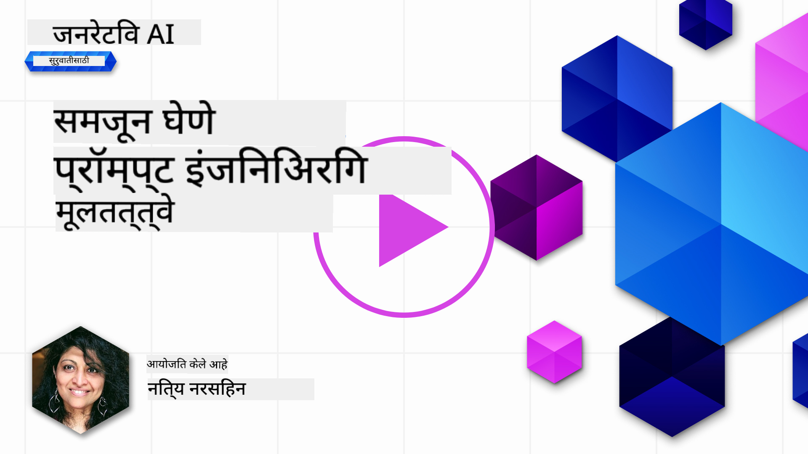
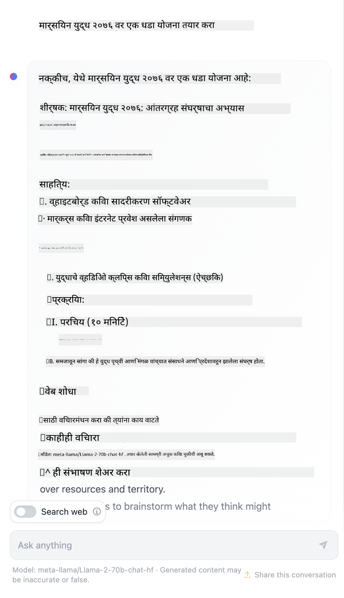

<!--
CO_OP_TRANSLATOR_METADATA:
{
  "original_hash": "a45c318dc6ebc2604f35b8b829f93af2",
  "translation_date": "2025-07-09T09:53:10+00:00",
  "source_file": "04-prompt-engineering-fundamentals/README.md",
  "language_code": "mr"
}
-->
# Prompt Engineering Fundamentals

[](https://aka.ms/gen-ai-lesson4-gh?WT.mc_id=academic-105485-koreyst)

## परिचय  
हा मॉड्यूल जनरेटिव AI मॉडेल्समध्ये प्रभावी प्रॉम्प्ट तयार करण्यासाठी आवश्यक संकल्पना आणि तंत्रे समजावून सांगतो. LLM कडे प्रॉम्प्ट कसे लिहिले जाते हे देखील महत्त्वाचे असते. काळजीपूर्वक तयार केलेला प्रॉम्प्ट उत्तम दर्जाचा प्रतिसाद मिळवू शकतो. पण _प्रॉम्प्ट_ आणि _प्रॉम्प्ट इंजिनिअरिंग_ या संज्ञा नेमक्या काय अर्थ लावतात? आणि मी LLM कडे पाठवणाऱ्या प्रॉम्प्ट _इनपुट_ मध्ये कसे सुधारणा करू शकतो? या प्रश्नांची उत्तरे आपण या आणि पुढील अध्यायात शोधणार आहोत.

_जनरेटिव AI_ वापरकर्त्यांच्या विनंत्यांनुसार नवीन सामग्री (उदा., मजकूर, प्रतिमा, ऑडिओ, कोड इ.) तयार करू शकतो. हे OpenAI च्या GPT ("Generative Pre-trained Transformer") सारख्या _Large Language Models_ चा वापर करून साध्य होते, जे नैसर्गिक भाषा आणि कोड वापरण्यासाठी प्रशिक्षित केलेले असतात.

वापरकर्ते आता या मॉडेल्सशी परिचित संवाद पद्धतींनी, जसे की चॅट, संवाद साधू शकतात, ज्यासाठी त्यांना तांत्रिक कौशल्य किंवा प्रशिक्षणाची गरज नाही. हे मॉडेल्स _प्रॉम्प्ट-आधारित_ असतात - वापरकर्ता मजकूर इनपुट (प्रॉम्प्ट) पाठवतो आणि AI प्रतिसाद (पूर्णता) प्राप्त करतो. नंतर ते "AI सोबत चॅट" करत, अनेक टप्प्यांमध्ये संवाद साधून, आपला प्रॉम्प्ट सुधारत जातात जोपर्यंत प्रतिसाद त्यांच्या अपेक्षांशी जुळत नाही.

"प्रॉम्प्ट" आता जनरेटिव AI अ‍ॅप्ससाठी मुख्य _प्रोग्रामिंग इंटरफेस_ बनले आहेत, जे मॉडेल्सना काय करायचे ते सांगतात आणि परत मिळणाऱ्या प्रतिसादांच्या गुणवत्तेवर प्रभाव टाकतात. "Prompt Engineering" हा एक वेगाने वाढणारा अभ्यासक्षेत्र आहे जो प्रॉम्प्ट डिझाइन आणि ऑप्टिमायझेशनवर लक्ष केंद्रित करतो, ज्यामुळे प्रमाणबद्ध आणि दर्जेदार प्रतिसाद मिळतात.

## शिकण्याचे उद्दिष्ट

या धड्यात आपण Prompt Engineering म्हणजे काय, ते का महत्त्वाचे आहे, आणि दिलेल्या मॉडेल व अ‍ॅप्लिकेशन उद्दिष्टासाठी अधिक प्रभावी प्रॉम्प्ट कसे तयार करायचे हे शिकू. आपण प्रॉम्प्ट इंजिनिअरिंगसाठी मूलभूत संकल्पना आणि सर्वोत्तम पद्धती समजून घेऊ - तसेच एक इंटरएक्टिव Jupyter Notebook "sandbox" वातावरणाबद्दल जाणून घेऊ जिथे आपण या संकल्पनांचा प्रत्यक्ष उदाहरणांवर वापर पाहू शकतो.

या धड्याच्या शेवटी आपण सक्षम होऊ:

1. प्रॉम्प्ट इंजिनिअरिंग म्हणजे काय आणि ते का महत्त्वाचे आहे हे समजावून सांगणे.  
2. प्रॉम्प्टचे घटक काय आहेत आणि ते कसे वापरले जातात हे वर्णन करणे.  
3. प्रॉम्प्ट इंजिनिअरिंगसाठी सर्वोत्तम पद्धती आणि तंत्रे शिकणे.  
4. शिकलेल्या तंत्रांचा वापर करून OpenAI endpoint वापरून प्रत्यक्ष उदाहरणांवर लागू करणे.

## मुख्य संज्ञा

Prompt Engineering: AI मॉडेल्सना इच्छित आउटपुट तयार करण्यासाठी मार्गदर्शन करण्यासाठी इनपुट डिझाइन आणि सुधारण्याची प्रक्रिया.  
Tokenization: मजकूर लहान घटकांमध्ये (टोकन्स) रूपांतरित करण्याची प्रक्रिया, ज्याला मॉडेल समजू शकते आणि प्रक्रिया करू शकते.  
Instruction-Tuned LLMs: विशिष्ट सूचना वापरून सुधारित केलेले Large Language Models, ज्यामुळे त्यांची प्रतिसाद अचूकता आणि सुसंगतता वाढते.

## शिकण्याचा Sandbox

प्रॉम्प्ट इंजिनिअरिंग सध्या विज्ञानापेक्षा अधिक कला आहे. त्याबाबत आपली अंतर्ज्ञान सुधारण्याचा सर्वोत्तम मार्ग म्हणजे _अधिक सराव_ करणे आणि एक प्रयोगात्मक दृष्टिकोन स्वीकारणे, ज्यात अ‍ॅप्लिकेशन क्षेत्रातील तज्ञता, शिफारस केलेल्या तंत्रांचा वापर आणि मॉडेल-विशिष्ट ऑप्टिमायझेशनचा समावेश असतो.

या धड्यासोबत दिलेला Jupyter Notebook एक _sandbox_ वातावरण प्रदान करतो जिथे आपण शिकलेले त्वरित वापरून पाहू शकता - धड्यादरम्यान किंवा शेवटी दिलेल्या कोड चॅलेंजचा भाग म्हणून. व्यायाम करण्यासाठी आपल्याला आवश्यक आहे:

1. **Azure OpenAI API की** - तैनात केलेल्या LLM साठी सेवा एंडपॉइंट.  
2. **Python Runtime** - ज्यात Notebook चालवता येईल.  
3. **स्थानिक पर्यावरणीय चल (Local Env Variables)** - _आता [SETUP](./../00-course-setup/SETUP.md?WT.mc_id=academic-105485-koreyst) चरण पूर्ण करा_.

Notebook मध्ये _प्रारंभिक_ व्यायाम दिलेले आहेत - पण आपण स्वतःचे _Markdown_ (वर्णन) आणि _Code_ (प्रॉम्प्ट विनंत्या) विभाग जोडून अधिक उदाहरणे किंवा कल्पना वापरून पाहण्यास प्रोत्साहित आहोत - आणि प्रॉम्प्ट डिझाइनसाठी आपली अंतर्ज्ञान वाढवा.

## चित्रात्मक मार्गदर्शक

या धड्यात काय शिकवले जाईल याचा एक मोठा आढावा पाहू इच्छिता? हा चित्रात्मक मार्गदर्शक पहा, जो मुख्य विषय आणि प्रत्येक विषयासाठी महत्त्वाच्या मुद्द्यांची झलक देतो. धडा आपल्याला मूलभूत संकल्पना आणि आव्हाने समजून घेण्यापासून सुरुवात करून, संबंधित प्रॉम्प्ट इंजिनिअरिंग तंत्रे आणि सर्वोत्तम पद्धती वापरून त्यावर मात करण्यापर्यंत घेऊन जातो. लक्षात ठेवा की या मार्गदर्शकातील "Advanced Techniques" विभाग हा या अभ्यासक्रमाच्या _पुढील_ अध्यायातील विषयांशी संबंधित आहे.


## आमचे स्टार्टअप

आता, चला पाहूया की _हा विषय_ आमच्या स्टार्टअपच्या [शिक्षणात AI नवकल्पना आणण्याच्या](https://educationblog.microsoft.com/2023/06/collaborating-to-bring-ai-innovation-to-education?WT.mc_id=academic-105485-koreyst) मिशनशी कसा संबंधित आहे. आम्हाला _वैयक्तिकृत शिक्षण_ साठी AI-चालित अ‍ॅप्लिकेशन्स तयार करायच्या आहेत - तर चला विचार करूया की आमच्या अ‍ॅप्लिकेशनचे विविध वापरकर्ते प्रॉम्प्ट कसे "डिझाइन" करू शकतात:

- **प्रशासक** AI ला _अभ्यासक्रम डेटा विश्लेषण करून कव्हरेजमधील अंतर शोधण्यास_ सांगू शकतात. AI निकालांचे सारांश तयार करू शकतो किंवा कोडसह त्यांचे दृश्यात्मक सादरीकरण करू शकतो.  
- **शिक्षक** AI ला _लक्ष्यित प्रेक्षक आणि विषयासाठी धडा योजना तयार करण्यास_ सांगू शकतात. AI निर्दिष्ट स्वरूपात वैयक्तिकृत योजना तयार करू शकतो.  
- **विद्यार्थी** AI ला _अडचणीच्या विषयात शिकवण्यास_ सांगू शकतात. AI आता विद्यार्थ्यांना त्यांच्या स्तरानुसार धडे, सूचना आणि उदाहरणे देऊन मार्गदर्शन करू शकतो.

हे फक्त सुरुवात आहे. [Prompts For Education](https://github.com/microsoft/prompts-for-edu/tree/main?WT.mc_id=academic-105485-koreyst) पहा - शिक्षण तज्ञांनी तयार केलेली एक मुक्त स्रोत प्रॉम्प्ट लायब्ररी - ज्यातून शक्यतांचा विस्तृत आढावा मिळेल! _sandbox मध्ये किंवा OpenAI Playground मध्ये काही प्रॉम्प्ट चालवून पाहा आणि काय होते ते पहा!_

<!--  
LESSON TEMPLATE:  
This unit should cover core concept #1.  
Reinforce the concept with examples and references.  

CONCEPT #1:  
Prompt Engineering.  
Define it and explain why it is needed.  
-->

## प्रॉम्प्ट इंजिनिअरिंग म्हणजे काय?

या धड्याची सुरुवात आपण **Prompt Engineering** या संज्ञेची व्याख्या करून केली होती, ज्याचा अर्थ आहे दिलेल्या अ‍ॅप्लिकेशन उद्दिष्ट आणि मॉडेलसाठी सातत्यपूर्ण आणि दर्जेदार प्रतिसाद (पूर्णता) देण्यासाठी मजकूर इनपुट (प्रॉम्प्ट) डिझाइन आणि ऑप्टिमायझेशन करणे. आपण याला दोन टप्प्यांमध्ये पाहू शकतो:

- दिलेल्या मॉडेल आणि उद्दिष्टासाठी प्रारंभिक प्रॉम्प्ट _डिझाइन_ करणे  
- प्रतिसादाच्या गुणवत्तेत सुधारणा करण्यासाठी प्रॉम्प्ट _पुनरावृत्तीने सुधारित_ करणे  

हा एक प्रयोगात्मक प्रक्रिया आहे ज्यासाठी वापरकर्त्याची अंतर्ज्ञान आणि प्रयत्न आवश्यक असतात जेणेकरून सर्वोत्तम निकाल मिळू शकतील. तर हे का महत्त्वाचे आहे? त्याचे उत्तर शोधण्यासाठी आपल्याला तीन संकल्पना समजून घ्याव्या लागतील:

- _Tokenization_ = मॉडेल प्रॉम्प्ट कसे "पाहते"  
- _Base LLMs_ = मूलभूत मॉडेल प्रॉम्प्ट कसे "प्रक्रिया" करते  
- _Instruction-Tuned LLMs_ = मॉडेल आता "कार्य" कसे पाहू शकते  

### Tokenization

LLM प्रॉम्प्ट्सना _टोकन्सच्या अनुक्रमणिके_ म्हणून पाहते, जिथे वेगवेगळे मॉडेल्स (किंवा मॉडेलच्या आवृत्त्या) एकाच प्रॉम्प्टला वेगवेगळ्या प्रकारे टोकनाइझ करू शकतात. कारण LLMs टोकन्सवर प्रशिक्षित केलेले असतात (कच्च्या मजकूरावर नाही), प्रॉम्प्ट कसे टोकनाइझ होतात याचा थेट परिणाम तयार होणाऱ्या प्रतिसादाच्या गुणवत्तेवर होतो.

Tokenization कसे कार्य करते याची कल्पना मिळवण्यासाठी, खालीलप्रमाणे [OpenAI Tokenizer](https://platform.openai.com/tokenizer?WT.mc_id=academic-105485-koreyst) सारखे टूल वापरून पाहा. आपला प्रॉम्प्ट कॉपी करा आणि तो कसा टोकन्समध्ये रूपांतरित होतो ते पहा, विशेषतः रिक्त जागा आणि विरामचिन्हे कशी हाताळली जातात याकडे लक्ष द्या. लक्षात ठेवा की हा उदाहरण जुना LLM (GPT-3) दर्शवतो - त्यामुळे नवीन मॉडेलसह वापरल्यास वेगळा परिणाम मिळू शकतो.


### संकल्पना: फाउंडेशन मॉडेल्स

एकदा प्रॉम्प्ट टोकनाइझ झाला की, ["Base LLM"](https://blog.gopenai.com/an-introduction-to-base-and-instruction-tuned-large-language-models-8de102c785a6?WT.mc_id=academic-105485-koreyst) (किंवा फाउंडेशन मॉडेल) ची मुख्य भूमिका त्या अनुक्रमातील पुढील टोकनची भाकीत करणे असते. LLMs मोठ्या मजकूर डेटासेटवर प्रशिक्षित असल्यामुळे, त्यांना टोकन्समधील सांख्यिकीय संबंधांची चांगली कल्पना असते आणि ते आत्मविश्वासाने भाकीत करू शकतात. लक्षात ठेवा की त्यांना प्रॉम्प्टमधील शब्दांचा _अर्थ_ समजत नाही; ते फक्त एक नमुना पाहतात ज्याला ते पुढील भाकीताने "पूर्ण" करू शकतात. ते वापरकर्त्याच्या हस्तक्षेपाने किंवा पूर्वनिर्धारित अटीने थांबवले जात नाही तोपर्यंत अनुक्रम भाकीत करत राहू शकतात.

प्रॉम्प्ट-आधारित पूर्णता कशी कार्य करते हे पाहू इच्छिता? वर दिलेला प्रॉम्प्ट Azure OpenAI Studio च्या [_Chat Playground_](https://oai.azure.com/playground?WT.mc_id=academic-105485-koreyst) मध्ये डीफॉल्ट सेटिंग्जसह टाका. सिस्टम प्रॉम्प्ट्सना माहितीच्या विनंती म्हणून हाताळते - त्यामुळे आपल्याला त्या संदर्भात समाधानकारक पूर्णता दिसेल.

पण जर वापरकर्त्याला काही विशिष्ट निकष किंवा कार्य उद्दिष्ट पूर्ण करणारे उत्तर पाहिजे असेल तर? यासाठी _instruction-tuned_ LLMs मदतीला येतात.


### संकल्पना: Instruction Tuned LLMs

[Instruction Tuned LLM](https://blog.gopenai.com/an-introduction-to-base-and-instruction-tuned-large-language-models-8de102c785a6?WT.mc_id=academic-105485-koreyst) फाउंडेशन मॉडेलपासून सुरू होतो आणि उदाहरणे किंवा इनपुट/आउटपुट जोड्यांसह (उदा., बहु-टप्प्यांचे "मेसेजेस") सूचनांसह त्याचे फाइन-ट्यूनिंग करतो, ज्यात स्पष्ट सूचना असू शकतात - आणि AI त्यानुसार प्रतिसाद देण्याचा प्रयत्न करतो.

हे Reinforcement Learning with Human Feedback (RLHF) सारख्या तंत्रांचा वापर करते, ज्यामुळे मॉडेल _सूचना पाळणे_ आणि _फीडबॅकवरून शिकणे_ शिकते, ज्यामुळे ते व्यावहारिक अ‍ॅप्लिकेशन्ससाठी अधिक योग्य आणि वापरकर्त्यांच्या उद्दिष्टांसाठी अधिक सुसंगत प्रतिसाद तयार करू शकते.

चला प्रयत्न करूया - वरचा प्रॉम्प्ट पुन्हा वापरा, पण आता _system message_ मध्ये खालील सूचना संदर्भ म्हणून द्या:

> _आपल्याला दिलेली सामग्री दुसऱ्या वर्गाच्या विद्यार्थ्यासाठी संक्षेप करा. निकाल ३-५ बुलेट पॉइंट्ससह एका परिच्छेदात ठेवा._

पहा कसे निकाल आता इच्छित उद्दिष्ट आणि स्वरूपाशी जुळतो? शिक्षक आता हा प्रतिसाद थेट त्यांच्या स्लाइडसाठी वापरू शकतो.


## प्रॉम्प्ट इंजिनिअरिंग का आवश्यक आहे?

आता आपण समजले की LLMs प्रॉम्प्ट कसे प्रक्रिया करतात, तर पाहूया _का_ प्रॉम्प्ट इंजिनिअरिंग आवश्यक आहे. कारण सध्याचे LLMs काही आव्हाने निर्माण करतात ज्यामुळे _विश्वसनीय आणि सातत्यपूर्ण पूर्णता_ मिळवणे कठीण होते, जर प्रॉम्प्ट तयार करण्यासाठी आणि ऑप्टिमायझेशनसाठी प्रयत्न न केले तर. उदाहरणार्थ:

1. **मॉडेल प्रतिसाद अनिश्चित असतात.** _समान प्रॉम्प्ट_ वेगवेगळ्या मॉडेल्स किंवा मॉडेल आवृत्त्यांमध्ये वेगवेगळे प्रतिसाद देऊ शकतो. तसेच _समान मॉडेल_ वेगवेगळ्या वेळा वेगळे निकाल देऊ शकते. _प्रॉम्प्ट इंजिनिअरिंग तंत्रे या फरकांना कमी करण्यासाठी चांगले मार्गदर्शक तयार करतात_.

2. **मॉडेल्स चुकीचे प्रतिसाद तयार करू शकतात.** मॉडेल्स मोठ्या पण मर्यादित डेटासेटवर प्रशिक्षित असतात, ज्यामुळे त्यांना प्रशिक्षणाच्या बाहेरच्या संकल्पनांची माहिती नसते. परिणामी, ते चुकीचे, काल्पनिक किंवा ज्ञात तथ्यांशी विरोधी पूर्णता तयार करू शकतात. _प्रॉम्प्ट इंजिनिअरिंग वापरकर्त्यांना अशा चुकींची ओळख पटवून त्यांना कमी करण्यास मदत करते, उदा., AI कडून संदर्भ किंवा कारण विचारणे_.

3. **मॉडेलची क्षमता वेगळी असू शकते.** नवीन मॉडेल्स किंवा मॉडेलच्या नवीन पिढ्या अधिक क्षमता देतात पण त्यांच्यासोबत वेगळे वैशिष्ट्ये, खर्च आणि गुंतागुंत देखील येतात. _प्रॉम्प्ट इंजिनिअरिंग सर्वोत्तम पद्धती आणि कार्यप्रवाह विकसित करण्यात मदत करते, जे वेगळेपण दूर करून मॉडेल-विशिष्ट गरजांशी सुसंगत असतात_.

हे OpenAI किंवा Azure OpenAI Playground मध्ये प्रत्यक्ष पाहूया:

- वेगवेगळ्या LLM तैनातींसह (उदा., OpenAI, Azure OpenAI, Hugging Face) समान प्रॉम्प्ट वापरा - फरक दिसले का?  
- _समान_ LLM तैनातीसह (उदा., Azure OpenAI playground) समान प्रॉम्प्ट वारंवार वापरा - फरक कसे होते?

### Fabrications चे उदाहरण

या कोर्समध्ये, आपण **"fabrication"** हा शब्द वापरतो जेव्हा LLMs त्यांच्या प्रशिक्षणातील मर्यादा किंवा इतर कारणांमुळे कधीकधी तथ्यात्मकदृष्ट्या चुकीची माहिती तयार करतात. तुम्ही हे _"hallucinations"_ म्हणूनही ऐकले असेल, जे लोकप्रिय लेख किंवा संशोधन पेपरमध्ये वापरले जाते. मात्र, आम्ही _"fabrication"_ हा शब्द वापरण्याचा आग्रह धरतो कारण यामुळे आपण मशीन-चालित परिणामाला मानवी वैशिष्ट्य देण्यापास
# 2076 च्या मार्शियन युद्धावर धडा योजना

## धडा उद्दिष्टे
- 2076 च्या मार्शियन युद्धाची पार्श्वभूमी समजून घेणे
- युद्धाच्या मुख्य कारणांची ओळख करणे
- युद्धातील महत्त्वाच्या घटना आणि परिणामांचे विश्लेषण करणे
- युद्धाचा मानवजातीवर आणि मंगळावर झालेल्या परिणामांचा आढावा घेणे

## धडा कालावधी
- एक तास (60 मिनिटे)

## आवश्यक सामग्री
- युद्धाच्या नकाशा आणि टाइमलाइन
- युद्धातील प्रमुख व्यक्तींची माहिती
- व्हिडिओ क्लिप्स किंवा चित्रपटांचे अंश (जर उपलब्ध असतील तर)
- प्रश्नोत्तरे आणि चर्चा सत्रासाठी नोट्स

## धडा रचना

### 1. परिचय (10 मिनिटे)
- 2076 च्या मार्शियन युद्धाची थोडक्यात ओळख
- युद्धाची पार्श्वभूमी आणि मंगळावर मानवी वसाहतींचा विकास
- युद्धाचे मुख्य कारणे काय होती यावर चर्चा

### 2. युद्धाची मुख्य घटना (20 मिनिटे)
- युद्धाची सुरुवात कशी झाली?
- प्रमुख लढाया आणि रणनीती
- महत्त्वाच्या व्यक्ती आणि त्यांची भूमिका
- युद्धातील तंत्रज्ञान आणि यंत्रसामग्री

### 3. युद्धाचा परिणाम (15 मिनिटे)
- मानवी आणि मंगळावर झालेल्या नुकसानाचा आढावा
- युद्धानंतरचे राजकीय आणि सामाजिक बदल
- युद्धाचा भविष्यातील अंतराळ संशोधनावर होणारा परिणाम

### 4. चर्चा आणि प्रश्नोत्तरे (10 मिनिटे)
- विद्यार्थ्यांना युद्धाबद्दल विचारलेले प्रश्न
- युद्धाच्या नैतिक आणि तांत्रिक पैलूंवर चर्चा
- भविष्यात अशा युद्धांपासून कसे टाळता येईल यावर विचार

### 5. सारांश आणि गृहपाठ (5 मिनिटे)
- धड्याचा सारांश
- गृहपाठ म्हणून युद्धावर एक निबंध लिहिण्यास सांगणे किंवा युद्धाच्या परिणामांवर एक प्रेझेंटेशन तयार करणे

## अतिरिक्त टिपा
- युद्धाच्या ऐतिहासिक संदर्भासाठी विश्वसनीय स्रोत वापरा
- विद्यार्थ्यांना युद्धाच्या विविध पैलूंवर विचार करण्यास प्रोत्साहित करा
- शक्य असल्यास युद्धाशी संबंधित चित्रपट किंवा डॉक्युमेंट्री दाखवा ज्यामुळे समज अधिक सखोल होईल
वेब शोधात मला असे आढळले की मार्टियन युद्धांवर (उदा., टेलिव्हिजन मालिका किंवा पुस्तके) काल्पनिक कथा आहेत - पण 2076 मध्ये नाहीत. सामान्य समज देखील सांगते की 2076 हा _भविष्यातील_ वर्ष आहे आणि त्यामुळे तो कोणत्याही वास्तविक घटनेशी संबंधित असू शकत नाही.

तर वेगवेगळ्या LLM प्रदात्यांसह हा प्रॉम्प्ट चालविल्यास काय होते?

> **Response 1**: OpenAI Playground (GPT-35)


> **Response 2**: Azure OpenAI Playground (GPT-35)


> **Response 3**: : Hugging Face Chat Playground (LLama-2)



अपेक्षेप्रमाणे, प्रत्येक मॉडेल (किंवा मॉडेल आवृत्ती) थोडक्याफार वेगळ्या प्रतिसाद देतात, ज्यामागे स्टोकास्टिक वर्तन आणि मॉडेल क्षमतांतील फरक असतो. उदाहरणार्थ, एक मॉडेल ८वी इयत्तेतील प्रेक्षकांसाठी उद्दिष्ट ठेवते तर दुसरे उच्च माध्यमिक विद्यार्थ्याला लक्षात घेते. पण या तीनही मॉडेलांनी अशा प्रतिसादांची निर्मिती केली जी अनभिज्ञ वापरकर्त्याला ही घटना खरी असल्याचा भास देऊ शकतात.

_मेटाप्रॉम्प्टिंग_ आणि _टेम्परेचर कॉन्फिगरेशन_ सारख्या प्रॉम्प्ट इंजिनिअरिंग तंत्रांनी मॉडेलच्या बनावट प्रतिसादांवर काही प्रमाणात नियंत्रण ठेवता येऊ शकते. नवीन प्रॉम्प्ट इंजिनिअरिंग _आर्किटेक्चर्स_ देखील नवीन साधने आणि तंत्रे सहजपणे प्रॉम्प्टच्या प्रवाहात समाविष्ट करतात, ज्यामुळे या परिणामांवर नियंत्रण किंवा कमी करण्यास मदत होते.

## केस स्टडी: GitHub Copilot

या विभागाचा आढावा घेऊया आणि पाहूया की प्रॉम्प्ट इंजिनिअरिंग प्रत्यक्षात कशा प्रकारे वापरली जाते, एका केस स्टडीद्वारे: [GitHub Copilot](https://github.com/features/copilot?WT.mc_id=academic-105485-koreyst).

GitHub Copilot हा तुमचा "AI जोडीदार प्रोग्रामर" आहे - तो टेक्स्ट प्रॉम्प्ट्सना कोड पूर्ण करण्यामध्ये रूपांतरित करतो आणि तुमच्या विकास वातावरणात (उदा., Visual Studio Code) सहज वापरासाठी समाकलित आहे. खालील ब्लॉग मालिकेत दस्तऐवजीकरणानुसार, सुरुवातीची आवृत्ती OpenAI Codex मॉडेलवर आधारित होती - ज्यामुळे अभियंत्यांना लवकरच लक्षात आले की मॉडेलचे फाइन-ट्यूनिंग आणि चांगल्या प्रॉम्प्ट इंजिनिअरिंग तंत्रांचा विकास करणे आवश्यक आहे, जेणेकरून कोडची गुणवत्ता सुधारता येईल. जुलैमध्ये त्यांनी [Codex पेक्षा अधिक प्रगत AI मॉडेल सादर केले](https://github.blog/2023-07-28-smarter-more-efficient-coding-github-copilot-goes-beyond-codex-with-improved-ai-model/?WT.mc_id=academic-105485-koreyst), जे अजून जलद सूचना देऊ शकते.

त्यांच्या शिकण्याच्या प्रवासाचा मागोवा घेण्यासाठी खालील पोस्ट्स क्रमाने वाचा.

- **मे 2023** | [GitHub Copilot तुमचा कोड समजून घेण्यात अधिक चांगला होत आहे](https://github.blog/2023-05-17-how-github-copilot-is-getting-better-at-understanding-your-code/?WT.mc_id=academic-105485-koreyst)
- **मे 2023** | [GitHub मध्ये: GitHub Copilot मागील LLMs सोबत काम करताना](https://github.blog/2023-05-17-inside-github-working-with-the-llms-behind-github-copilot/?WT.mc_id=academic-105485-koreyst)
- **जून 2023** | [GitHub Copilot साठी चांगले प्रॉम्प्ट कसे लिहावे](https://github.blog/2023-06-20-how-to-write-better-prompts-for-github-copilot/?WT.mc_id=academic-105485-koreyst)
- **जुलै 2023** | [GitHub Copilot Codex पेक्षा पुढे जातो सुधारित AI मॉडेलसह](https://github.blog/2023-07-28-smarter-more-efficient-coding-github-copilot-goes-beyond-codex-with-improved-ai-model/?WT.mc_id=academic-105485-koreyst)
- **जुलै 2023** | [प्रॉम्प्ट इंजिनिअरिंग आणि LLMs साठी विकसक मार्गदर्शक](https://github.blog/2023-07-17-prompt-engineering-guide-generative-ai-llms/?WT.mc_id=academic-105485-koreyst)
- **सप्टेंबर 2023** | [एंटरप्राइझ LLM अॅप कसे तयार करावे: GitHub Copilot कडून धडे](https://github.blog/2023-09-06-how-to-build-an-enterprise-llm-application-lessons-from-github-copilot/?WT.mc_id=academic-105485-koreyst)

तुम्ही त्यांच्या [इंजिनिअरिंग ब्लॉग](https://github.blog/category/engineering/?WT.mc_id=academic-105485-koreyst) मध्ये अशा आणखी पोस्ट्स पाहू शकता जसे की [ही पोस्ट](https://github.blog/2023-09-27-how-i-used-github-copilot-chat-to-build-a-reactjs-gallery-prototype/?WT.mc_id=academic-105485-koreyst) जी दाखवते की या मॉडेल्स आणि तंत्रांचा प्रत्यक्ष जगातील अॅप्लिकेशन्ससाठी कसा वापर केला जातो.

---

<!--
LESSON TEMPLATE:
This unit should cover core concept #2.
Reinforce the concept with examples and references.

CONCEPT #2:
Prompt Design.
Illustrated with examples.
-->

## प्रॉम्प्ट बांधणी

आपण पाहिले की प्रॉम्प्ट इंजिनिअरिंग का महत्त्वाची आहे - आता समजून घेऊया की प्रॉम्प्ट कसे _बांधले_ जातात जेणेकरून आपण वेगवेगळ्या तंत्रांचा वापर करून अधिक प्रभावी प्रॉम्प्ट डिझाइन कसे करता येईल हे तपासू शकू.

### मूलभूत प्रॉम्प्ट

चला मूलभूत प्रॉम्प्टपासून सुरुवात करूया: मॉडेलला कोणताही अतिरिक्त संदर्भ न देता पाठवलेला टेक्स्ट इनपुट. उदाहरणार्थ, जेव्हा आपण US राष्ट्रीय गाण्याच्या सुरुवातीच्या काही शब्दांना OpenAI [Completion API](https://platform.openai.com/docs/api-reference/completions?WT.mc_id=academic-105485-koreyst) कडे पाठवतो, तेव्हा ते लगेच पुढील ओळी पूर्ण करते, ज्यामुळे मूलभूत भविष्यवाणी वर्तन स्पष्ट होते.

| प्रॉम्प्ट (इनपुट)     | पूर्णता (आउटपुट)                                                                                                                        |
| :----------------- | :----------------------------------------------------------------------------------------------------------------------------------------- |
| Oh say can you see | असं वाटतं तुम्ही "The Star-Spangled Banner," म्हणजेच अमेरिकेचा राष्ट्रीय गाण्याचा सुरुवात करत आहात. पूर्ण गाणं असं आहे ... |

### गुंतागुंतीचा प्रॉम्प्ट

आता त्या मूलभूत प्रॉम्प्टमध्ये संदर्भ आणि सूचना जोडूया. [Chat Completion API](https://learn.microsoft.com/azure/ai-services/openai/how-to/chatgpt?WT.mc_id=academic-105485-koreyst) आपल्याला प्रॉम्प्ट एकत्रित करण्याची परवानगी देते, ज्यात _संदेश_ असतात:

- इनपुट/आउटपुट जोड्या ज्या _वापरकर्ता_ इनपुट आणि _सहायक_ प्रतिसाद दर्शवतात.
- सिस्टम संदेश जो सहाय्यकाच्या वर्तन किंवा व्यक्तिमत्त्वाचा संदर्भ सेट करतो.

आता विनंती खालील स्वरूपात असते, जिथे _टोकनायझेशन_ संदर्भ आणि संभाषणातून संबंधित माहिती प्रभावीपणे कॅप्चर करते. सिस्टम संदर्भ बदलल्यास पूर्णतेच्या गुणवत्तेवर तितकाच परिणाम होतो जितका वापरकर्त्याच्या इनपुटवर.

```python
response = openai.chat.completions.create(
    model="gpt-3.5-turbo",
    messages=[
        {"role": "system", "content": "You are a helpful assistant."},
        {"role": "user", "content": "Who won the world series in 2020?"},
        {"role": "assistant", "content": "The Los Angeles Dodgers won the World Series in 2020."},
        {"role": "user", "content": "Where was it played?"}
    ]
)
```

### सूचना प्रॉम्प्ट

वरील उदाहरणांमध्ये, वापरकर्त्याचा प्रॉम्प्ट एक सोपा टेक्स्ट प्रश्न होता जो माहिती मागणी म्हणून समजला जाऊ शकतो. _सूचना_ प्रॉम्प्ट्समध्ये, आपण त्या टेक्स्टचा वापर करून एखादे कार्य अधिक तपशीलवार निर्दिष्ट करू शकतो, ज्यामुळे AI ला चांगली मार्गदर्शने मिळतात. उदाहरण:

| प्रॉम्प्ट (इनपुट)                                                                                                                                                                                                                         | पूर्णता (आउटपुट)                                                                                                        | सूचना प्रकार    |
| :------------------------------------------------------------------------------------------------------------------------------------------------------------------------------------------------------------------------------------- | :------------------------------------------------------------------------------------------------------------------------- | :------------------ |
| Write a description of the Civil War                                                                                                                                                                                                   | _सोप्या परिच्छेदात परत केले_                                                                                              | सोपा              |
| Write a description of the Civil War. Provide key dates and events and describe their significance                                                                                                                                     | _परिच्छेदानंतर मुख्य घटना आणि त्यांची महत्त्वाची तारीखांची यादी दिली_                                             | गुंतागुंतीचा             |
| Write a description of the Civil War in 1 paragraph. Provide 3 bullet points with key dates and their significance. Provide 3 more bullet points with key historical figures and their contributions. Return the output as a JSON file | _अधिक तपशीलांसह JSON स्वरूपात आउटपुट दिले, जे तुम्ही कॉपी-पेस्ट करून फाइलमध्ये वापरू शकता आणि आवश्यकतेनुसार पडताळणी करू शकता_ | गुंतागुंतीचा. स्वरूपित. |

## प्राथमिक सामग्री

वरील उदाहरणांमध्ये, प्रॉम्प्ट अजूनही तुलनेने खुला होता, ज्यामुळे LLM ला त्याच्या पूर्व-प्रशिक्षित डेटासेटमधून कोणता भाग संबंधित आहे हे ठरवता येत होते. _प्राथमिक सामग्री_ डिझाइन पॅटर्नमध्ये, इनपुट टेक्स्ट दोन भागांमध्ये विभागलेला असतो:

- एक सूचना (क्रिया)
- संबंधित सामग्री (जी क्रियेला प्रभावित करते)

उदाहरणार्थ, सूचना आहे "हे २ वाक्यांत सारांश करा".

| प्रॉम्प्ट (इनपुट)                                                                                                                                                                                                                                                                                                                                                                                                                                                                                                                                                                                                                                                                                      | पूर्णता (आउटपुट)                                                                                                                                                                                                                                                                             |
| :-------------------------------------------------------------------------------------------------------------------------------------------------------------------------------------------------------------------------------------------------------------------------------------------------------------------------------------------------------------------------------------------------------------------------------------------------------------------------------------------------------------------------------------------------------------------------------------------------------------------------------------------------------------------------------------------------- | :---------------------------------------------------------------------------------------------------------------------------------------------------------------------------------------------------------------------------------------------------------------------------------------------- |
| Jupiter is the fifth planet from the Sun and the largest in the Solar System. It is a gas giant with a mass one-thousandth that of the Sun, but two-and-a-half times that of all the other planets in the Solar System combined. Jupiter is one of the brightest objects visible to the naked eye in the night sky, and has been known to ancient civilizations since before recorded history. It is named after the Roman god Jupiter.[19] When viewed from Earth, Jupiter can be bright enough for its reflected light to cast visible shadows,[20] and is on average the third-brightest natural object in the night sky after the Moon and Venus. <br/> **Summarize this in 2 short sentences** | Jupiter, सूर्यापासून पाचवा ग्रह, सौरमालेतील सर्वात मोठा ग्रह आहे आणि तो रात्र आकाशातील सर्वात तेजस्वी वस्तूंपैकी एक आहे. तो रोमन देव Jupiter च्या नावाने ओळखला जातो आणि त्याचा द्रव्यमान सौरमालेतील इतर सर्व ग्रहांच्या एकत्रित द्रव्यमानाच्या दोन-आणि-अर्ध्या पट आहे. |

प्राथमिक सामग्री विभाग विविध प्रकारे वापरला जाऊ शकतो ज्यामुळे अधिक प्रभावी सूचना देता येतात:

- **उदाहरणे** - मॉडेलला स्पष्ट सूचना देण्याऐवजी, त्याला काय करायचे आहे याची उदाहरणे द्या आणि त्याला नमुना समजून घेऊ द्या.
- **संकेत** - सूचनेनंतर "संकेत" द्या ज्यामुळे पूर्णता अधिक संबंधित प्रतिसादाकडे वळेल.
- **टेम्पलेट्स** - हे पुनरावृत्ती करता येणारे 'रेसिपी' आहेत ज्यात प्लेसहोल्डर्स (व्हेरिएबल्स) असतात, जे विशिष्ट वापरासाठी डेटा वापरून सानुकूल करता येतात.

चला याचा वापर प्रत्यक्षात पाहूया.

### उदाहरणांचा वापर

हा एक असा दृष्टिकोन आहे जिथे तुम्ही प्राथमिक सामग्री वापरून मॉडेलला इच्छित आउटपुटची काही उदाहरणे देता आणि त्याला नमुना समजून घेऊ देता. उदाहरणांच्या संख्येनुसार, आपण झिरो-शॉट, वन-शॉट, फ्यू-शॉट प्रॉम्प्टिंग करू शकतो.

प्रॉम्प्ट आता तीन घटकांचा समावेश करतो:

- कार्याचे वर्णन
- इच्छित आउटपुटची काही उदाहरणे
- नवीन उदाहरणाची सुरुवात (जी अप्रत्यक्ष कार्य वर्णन बनते)

| शिकण्याचा प्रकार | प्रॉम्प्ट (इनपुट)                                                                                                                                        | पूर्णता (आउटपुट)         |
| :------------ | :---------------------------------------------------------------------------------------------------------------------------------------------------- | :-------------------------- |
| झिरो-शॉट     | "The Sun is Shining". स्पॅनिशमध्ये भाषांतर करा                                                                                                            | "El Sol está brillando".    |
| वन-शॉट      | "The Sun is Shining" => ""El Sol está brillando". <br> "It's a Cold and Windy Day" =>                                                                 | "Es un día frío y ventoso". |
| फ्यू-शॉट      | The player ran the bases => Baseball <br/> The player hit an ace => Tennis <br/> The player hit a six => Cricket <br/> The player made a slam-dunk => | Basketball                  |
|               |                                                                                                                                                       |                             |

झिरो-शॉट प्रॉम्प्टिंगमध्ये आपल्याला स्पष्ट सूचना ("स्पॅनिशमध्ये भाषांतर करा") द्यावी लागते, पण वन-शॉट प्रॉम्प्टिंगमध्ये ती सूचना अप्रत्यक्षपणे समजते. फ्यू-शॉट उदाहरणात अधिक उदाहरणे देऊन मॉडेल अधिक अचूक अनुमान लावू शकते, कोणतीही अतिरिक्त सूचना न देता.

### प्रॉम्प्ट संकेत

प्राथमिक सामग्री वापरण्याचा आणखी एक तंत्र म्हणजे _संकेत_ देणे. या प्रकरणात, आपण मॉडेलला इच्छित प्रतिसादाच्या स्वरूपाचा एक छोटा तुकडा देऊन सुरुवात करतो. मॉडेल नंतर त्या संकेताचा वापर करून पुढे चालू ठेवते.

| संकेतांची संख्या | प्रॉम्प्ट (इनपुट)                                                                                                                                                                                                                                                                                                                                                                                                                                               | पूर्णता (आउटपुट)                                                                                                                                                                                                                                                                                       |
| :------------- | :----------------------------------------------------------------------------------------------------------------------------------------------------------------------------------------------------------------------------------------------------------------------------------------------------------------------------------------------------------------------------------------------------------------------------------------------------------- | :-------------------------------------------------------------------------------------------------------------------------------------------------------------------------------------------------------------------------------------------------------------------------------------------------------- |
| 0              | Jupiter is the fifth planet from the Sun and the largest in the Solar System. It is a gas giant with a mass one-thousandth that of the Sun, but two-and-a-half times that of all the other planets in the Solar System combined. Jupiter is one of the brightest objects visible to the naked eye in the night sky, and has been known to ancient civilizations since before recorded history.

**Summarize This**                                       | ज्युपिटर आपल्या सौरमालेतील सर्वात मोठा ग्रह आहे आणि सूर्यापासून पाचवा ग्रह आहे. तो एक वायवीय दैत्य आहे ज्याचे द्रव्यमान सूर्याच्या द्रव्यमानाच्या १/१००० भागाचे आहे, पण तो इतर सर्व ग्रहांच्या एकत्रित द्रव्यमानापेक्षा जास्त जड आहे. प्राचीन संस्कृतींना ज्युपिटर बद्दल खूप पूर्वीपासून माहिती आहे, आणि तो रात्रीच्या आकाशात सहज दिसतो.. |
| 1              | ज्युपिटर सूर्यापासून पाचवा ग्रह आहे आणि सौरमालेतील सर्वात मोठा ग्रह आहे. तो एक वायवीय दैत्य आहे ज्याचे द्रव्यमान सूर्याच्या द्रव्यमानाच्या १/१००० भागाचे आहे, पण सौरमालेतील इतर सर्व ग्रहांच्या एकत्रित द्रव्यमानाच्या दोन अर्ध्यांपेक्षा जास्त आहे. ज्युपिटर हा रात्रीच्या आकाशात नंग्या डोळ्यांनी दिसणाऱ्या सर्वात तेजस्वी वस्तूंपैकी एक आहे, आणि तो प्राचीन संस्कृतींना इतिहासाच्या नोंदी होण्यापूर्वीपासून ज्ञात आहे. <br/>**Summarize This** <br/> आपण जे शिकलो ते म्हणजे ज्युपिटर | सूर्यापासून पाचवा ग्रह आहे आणि सौरमालेतील सर्वात मोठा ग्रह आहे. तो एक वायवीय दैत्य आहे ज्याचे द्रव्यमान सूर्याच्या द्रव्यमानाच्या १/१००० भागाचे आहे, पण इतर सर्व ग्रहांच्या एकत्रित द्रव्यमानाच्या दोन अर्ध्यांपेक्षा जास्त आहे. तो सहज नंग्या डोळ्यांनी दिसतो आणि प्राचीन काळापासून ज्ञात आहे.                        |
| 2              | ज्युपिटर सूर्यापासून पाचवा ग्रह आहे आणि सौरमालेतील सर्वात मोठा ग्रह आहे. तो एक वायवीय दैत्य आहे ज्याचे द्रव्यमान सूर्याच्या द्रव्यमानाच्या १/१००० भागाचे आहे, पण सौरमालेतील इतर सर्व ग्रहांच्या एकत्रित द्रव्यमानाच्या दोन अर्ध्यांपेक्षा जास्त आहे. ज्युपिटर हा रात्रीच्या आकाशात नंग्या डोळ्यांनी दिसणाऱ्या सर्वात तेजस्वी वस्तूंपैकी एक आहे, आणि तो प्राचीन संस्कृतींना इतिहासाच्या नोंदी होण्यापूर्वीपासून ज्ञात आहे. <br/>**Summarize This** <br/> आपण शिकलोले टॉप ३ तथ्ये:         | १. ज्युपिटर सूर्यापासून पाचवा ग्रह आहे आणि सौरमालेतील सर्वात मोठा ग्रह आहे. <br/> २. तो एक वायवीय दैत्य आहे ज्याचे द्रव्यमान सूर्याच्या द्रव्यमानाच्या १/१००० भागाचे आहे...<br/> ३. ज्युपिटर प्राचीन काळापासून नंग्या डोळ्यांनी दिसतो ...                                                                       |
|                |                                                                                                                                                                                                                                                                                                                                                                                                                                                              |                                                                                                                                                                                                                                                                                                           |

### Prompt Templates

प्रॉम्प्ट टेम्प्लेट म्हणजे _पूर्वनिर्धारित प्रॉम्प्टसाठीची रेसिपी_ जी आवश्यकतेनुसार संग्रहित करून पुन्हा वापरता येते, ज्यामुळे वापरकर्त्यांना अधिक सुसंगत अनुभव मिळतात. सोप्या भाषेत, हे प्रॉम्प्ट उदाहरणांचा संग्रह आहे जसे की [OpenAI कडून हे उदाहरण](https://platform.openai.com/examples?WT.mc_id=academic-105485-koreyst) जे इंटरऐक्टिव्ह प्रॉम्प्ट घटक (वापरकर्ता आणि सिस्टम संदेश) आणि API-आधारित विनंती स्वरूप दोन्ही पुरवते - ज्यामुळे पुनर्वापर शक्य होतो.

थोडे अधिक गुंतागुंतीच्या स्वरूपात, जसे की [LangChain कडून हे उदाहरण](https://python.langchain.com/docs/concepts/prompt_templates/?WT.mc_id=academic-105485-koreyst) मध्ये, यात _प्लेसहोल्डर्स_ असतात जे विविध स्रोतांमधून (वापरकर्ता इनपुट, सिस्टम संदर्भ, बाह्य डेटा स्रोत इ.) डेटा भरून प्रॉम्प्ट डायनॅमिकली तयार करतात. यामुळे आपण पुनर्वापरासाठी प्रॉम्प्ट्सची लायब्ररी तयार करू शकतो जी प्रोग्रामॅटिक पद्धतीने वापरकर्त्यांना सुसंगत अनुभव देऊ शकते.

शेवटी, टेम्प्लेट्सचे खरे महत्त्व म्हणजे _प्रॉम्प्ट लायब्ररी_ तयार करणे आणि प्रकाशित करणे, जे विशिष्ट अनुप्रयोग क्षेत्रांसाठी ऑप्टिमाइझ केलेले असतात - जिथे प्रॉम्प्ट टेम्प्लेट त्या क्षेत्राच्या संदर्भानुसार किंवा उदाहरणांनुसार अधिक संबंधित आणि अचूक प्रतिसाद देतात. [Prompts For Edu](https://github.com/microsoft/prompts-for-edu?WT.mc_id=academic-105485-koreyst) हे याचे उत्तम उदाहरण आहे, जे शिक्षण क्षेत्रासाठी प्रॉम्प्ट्सची लायब्ररी तयार करते, ज्यात धडे नियोजन, अभ्यासक्रम डिझाइन, विद्यार्थी ट्युटोरिंग यांसारख्या मुख्य उद्दिष्टांवर भर दिला आहे.

## Supporting Content

जर आपण प्रॉम्प्ट तयार करणे म्हणजे एक सूचना (कार्य) आणि एक लक्ष्य (प्राथमिक सामग्री) असणे समजले, तर _द्वितीयक सामग्री_ म्हणजे अतिरिक्त संदर्भ जो आपण आउटपुटवर काही प्रकारे प्रभाव टाकण्यासाठी पुरवतो. यात ट्यूनिंग पॅरामीटर्स, फॉरमॅटिंग सूचना, विषय वर्गीकरण इत्यादी असू शकतात, जे मॉडेलला प्रतिसाद वापरकर्त्याच्या अपेक्षा किंवा उद्दिष्टांनुसार सानुकूल करण्यास मदत करतात.

उदाहरणार्थ: जर आपल्याकडे अभ्यासक्रम कॅटलॉग असेल ज्यात सर्व उपलब्ध अभ्यासक्रमांची विस्तृत मेटाडेटा (नाव, वर्णन, स्तर, मेटाडेटा टॅग्ज, प्रशिक्षक इ.) असेल:

- आपण "Fall 2023 साठी अभ्यासक्रम कॅटलॉगचे सारांश करा" अशी सूचना देऊ शकतो
- प्राथमिक सामग्री म्हणून इच्छित आउटपुटची काही उदाहरणे देऊ शकतो
- द्वितीयक सामग्री म्हणून टॉप ५ "टॅग्ज" ओळखू शकतो.

आता, मॉडेल काही उदाहरणांमध्ये दाखवलेल्या स्वरूपात सारांश देऊ शकते - पण जर निकालात अनेक टॅग्ज असतील, तर ते द्वितीयक सामग्रीत ओळखलेल्या ५ टॅग्जना प्राधान्य देऊ शकते.

---

<!--
LESSON TEMPLATE:
हा युनिट मुख्य संकल्पना #1 कव्हर करेल.
संकल्पना उदाहरणे आणि संदर्भांसह मजबूत करा.

CONCEPT #3:
प्रॉम्प्ट इंजिनिअरिंग तंत्र.
प्रॉम्प्ट इंजिनिअरिंगसाठी काही मूलभूत तंत्र कोणती आहेत?
काही सरावांसह स्पष्ट करा.
-->

## Prompting Best Practices

आता आपण जाणतो की प्रॉम्प्ट कसे _तयार_ करता येतात, आपण त्यांना _डिझाइन_ कसे करावे हे विचारू शकतो जेणेकरून सर्वोत्तम पद्धती प्रतिबिंबित होतील. हे दोन भागांत विचारता येईल - योग्य _मनस्थिती_ असणे आणि योग्य _तंत्र_ वापरणे.

### Prompt Engineering Mindset

प्रॉम्प्ट इंजिनिअरिंग हा एक प्रयोग आणि चुका करण्याचा प्रक्रिया आहे, म्हणून तीन महत्त्वाचे मार्गदर्शक घटक लक्षात ठेवा:

1. **डोमेन समज महत्त्वाची आहे.** प्रतिसादाची अचूकता आणि सुसंगतता त्या _डोमेन_ वर अवलंबून असते ज्यात अनुप्रयोग किंवा वापरकर्ता कार्य करतो. आपली अंतर्ज्ञान आणि डोमेन तज्ञता वापरून **तंत्र अधिक सानुकूल करा**. उदाहरणार्थ, आपल्या सिस्टम प्रॉम्प्टमध्ये _डोमेन-विशिष्ट व्यक्तिमत्त्वे_ ठरवा, किंवा वापरकर्ता प्रॉम्प्टमध्ये _डोमेन-विशिष्ट टेम्प्लेट्स_ वापरा. द्वितीयक सामग्री पुरवा जी डोमेन-विशिष्ट संदर्भ दर्शवते, किंवा _डोमेन-विशिष्ट संकेत आणि उदाहरणे_ वापरून मॉडेलला परिचित वापर पद्धतींकडे मार्गदर्शन करा.

2. **मॉडेल समज महत्त्वाची आहे.** आपण जाणतो की मॉडेल्स नैसर्गिकरित्या संभाव्यतावादी (stochastic) असतात. पण मॉडेलची अंमलबजावणी वापरलेल्या प्रशिक्षण डेटासेट (पूर्व-प्रशिक्षित ज्ञान), त्याच्या क्षमता (उदा., API किंवा SDK द्वारे) आणि त्यासाठी ऑप्टिमाइझ केलेल्या सामग्रीच्या प्रकारानुसार (उदा., कोड, प्रतिमा, मजकूर) वेगवेगळी असू शकते. आपण वापरत असलेल्या मॉडेलच्या ताकदी आणि मर्यादा समजून घ्या, आणि त्या ज्ञानाचा वापर करून _कार्यांना प्राधान्य द्या_ किंवा _सानुकूल टेम्प्लेट्स_ तयार करा जे मॉडेलच्या क्षमतांसाठी ऑप्टिमाइझ केलेले असतील.

3. **पुनरावृत्ती आणि पडताळणी महत्त्वाची आहे.** मॉडेल्स वेगाने विकसित होत आहेत, तसेच प्रॉम्प्ट इंजिनिअरिंगसाठी तंत्रेही. डोमेन तज्ञ म्हणून, आपल्याकडे कदाचित इतर संदर्भ किंवा निकष असू शकतात जे व्यापक समुदायासाठी लागू नसतील. प्रॉम्प्ट इंजिनिअरिंग साधने आणि तंत्रे वापरून प्रॉम्प्ट तयार करण्यास "जंप स्टार्ट" करा, नंतर आपली अंतर्ज्ञान आणि डोमेन तज्ञता वापरून पुनरावृत्ती करा आणि निकालांची पडताळणी करा. आपले निरीक्षणे नोंदवा आणि एक **ज्ञान भांडार** (उदा., प्रॉम्प्ट लायब्ररी) तयार करा जे इतरांसाठी नवीन आधार म्हणून वापरले जाऊ शकते, ज्यामुळे भविष्यात जलद पुनरावृत्ती शक्य होईल.

## Best Practices

आता आपण [OpenAI](https://help.openai.com/en/articles/6654000-best-practices-for-prompt-engineering-with-openai-api?WT.mc_id=academic-105485-koreyst) आणि [Azure OpenAI](https://learn.microsoft.com/azure/ai-services/openai/concepts/prompt-engineering#best-practices?WT.mc_id=academic-105485-koreyst) तज्ञांनी शिफारस केलेल्या सामान्य सर्वोत्तम पद्धती पाहूया.

| काय                              | का                                                                                                                                                                                                                                               |
| :-------------------------------- | :------------------------------------------------------------------------------------------------------------------------------------------------------------------------------------------------------------------------------------------------ |
| नवीनतम मॉडेल्सचे मूल्यमापन करा.       | नवीन मॉडेल पिढ्यांमध्ये सुधारित वैशिष्ट्ये आणि गुणवत्ता असण्याची शक्यता असते - पण त्यासाठी जास्त खर्चही येऊ शकतो. त्यांचा परिणाम तपासा आणि मग स्थलांतराचे निर्णय घ्या.                                                                                |
| सूचना आणि संदर्भ वेगळे ठेवा.   | तपासा की तुमचा मॉडेल/प्रदाता सूचना, प्राथमिक आणि द्वितीयक सामग्री वेगळ्या करण्यासाठी _डेलिमीटर्स_ वापरतो का. यामुळे मॉडेलला टोकन्सना अधिक अचूक वजन देण्यास मदत होते.                                                         |
| स्पष्ट आणि विशिष्ट रहा.             | इच्छित संदर्भ, निकाल, लांबी, फॉरमॅट, शैली याबाबत अधिक तपशील द्या. यामुळे प्रतिसादांची गुणवत्ता आणि सुसंगतता सुधारेल. रेसिपी reusable टेम्प्लेट्समध्ये नोंदवा.                                                          |
| वर्णनात्मक रहा, उदाहरणे वापरा.      | मॉडेल्स "दाखवा आणि सांगा" पद्धतीला चांगले प्रतिसाद देऊ शकतात. सुरुवातीला `zero-shot` पद्धत वापरा जिथे तुम्ही फक्त सूचना देता (कोणतीही उदाहरणे नाहीत), नंतर `few-shot` वापरून इच्छित आउटपुटची काही उदाहरणे द्या. उपमा वापरा. |
| प्रतिसाद सुरू करण्यासाठी संकेत वापरा | इच्छित निकालाकडे वळवण्यासाठी काही सुरुवातीचे शब्द किंवा वाक्ये द्या ज्याचा वापर मॉडेल प्रतिसाद सुरू करण्यासाठी करू शकेल.                                                                                                               |
| पुनरावृत्ती करा                       | कधी कधी तुम्हाला मॉडेलला स्वतःला पुन्हा सांगावे लागते. प्राथमिक सामग्रीच्या आधी आणि नंतर सूचना द्या, सूचना आणि संकेत वापरा, इत्यादी. काय कार्य करते ते पाहण्यासाठी पुनरावृत्ती करा आणि पडताळणी करा.                                                         |
| क्रम महत्त्वाचा आहे                     | तुम्ही मॉडेलला माहिती कशी सादर करता त्याचा परिणाम आउटपुटवर होऊ शकतो, अगदी शिकण्याच्या उदाहरणांमध्येही, कारण अलीकडील माहितीला अधिक महत्त्व दिले जाते. काय चांगले कार्य करते ते पाहण्यासाठी वेगवेगळे पर्याय वापरून पहा.                                                               |
| मॉडेलला "बाहेर पडण्याचा" पर्याय द्या           | जर मॉडेल कोणत्याही कारणास्तव कार्य पूर्ण करू शकत नसेल तर त्याला एक _फॉलबॅक_ प्रतिसाद द्या. यामुळे चुकीचे किंवा बनावट प्रतिसाद निर्माण होण्याची शक्यता कमी होते.                                                         |
|                                   |                                                                                                                                                                                                                                                   |

कोणतीही सर्वोत्तम पद्धत वापरताना लक्षात ठेवा की _तुमचा अनुभव वेगळा असू शकतो_ मॉडेल, कार्य आणि डोमेननुसार. यांना सुरुवातीस म्हणून वापरा आणि काय चांगले कार्य करते ते शोधण्यासाठी पुनरावृत्ती करा. नवीन मॉडेल्स आणि साधने उपलब्ध होत राहिल्याने तुमचा प्रॉम्प्ट इंजिनिअरिंग प्रक्रिया सतत पुनर्मूल्यांकन करा, प्रक्रियेच्या प्रमाणबद्धतेवर आणि प्रतिसादाच्या गुणवत्तेवर लक्ष केंद्रित करून.

<!--
LESSON TEMPLATE:
हा युनिट कोड चॅलेंज पुरवेल जर लागू असेल तर

CHALLENGE:
फक्त कोड टिप्पण्यांसह Jupyter Notebook ला लिंक करा (कोड विभाग रिकामे असतील).

SOLUTION:
त्या Notebook ची एक प्रत लिंक करा ज्यात प्रॉम्प्ट्स भरलेले आहेत आणि चालवलेले आहेत, एक उदाहरण आउटपुट दाखविते.
-->

## Assignment

अभिनंदन! तुम्ही धड्याच्या शेवटी पोहोचलात! आता त्या संकल्पना आणि तंत्रांचा वापर प्रत्यक्ष उदाहरणांसह करून पाहण्याची वेळ आहे!

आपल्या असाइनमेंटसाठी, आपण Jupyter Notebook वापरणार आहोत ज्यात तुम्ही इंटरऐक्टिव्ह पद्धतीने सराव पूर्ण करू शकता. तुम्ही स्वतःच्या Markdown आणि Code सेल्सने Notebook विस्तृत करू शकता आणि स्वतःच्या कल्पना आणि तंत्रे तपासू शकता.

### सुरुवात करण्यासाठी, रेपो फोर्क करा, नंतर

- (शिफारस केलेले) GitHub Codespaces सुरू करा
- (पर्यायी) रेपो तुमच्या स्थानिक डिव्हाइसवर क्लोन करा आणि Docker Desktop सह वापरा
- (पर्यायी) तुमच्या पसंतीच्या Notebook रनटाइम वातावरणात Notebook उघडा.

### नंतर, तुमचे पर्यावरणीय चल सेट करा

- रेपोच्या मूळ फोल्डरमधील `.env.copy` फाइल `.env` मध्ये कॉपी करा आणि `AZURE_OPENAI_API_KEY`, `AZURE_OPENAI_ENDPOINT` आणि `AZURE_OPENAI_DEPLOYMENT` मूल्ये भरा. कसे करायचे ते जाणून घेण्यासाठी [Learning Sandbox विभाग](../../../04-prompt-engineering-fundamentals/04-prompt-engineering-fundamentals) वर परत या.

### नंतर, Jupyter Notebook उघडा

- रनटाइम कर्नल निवडा. जर पर्याय 1 किंवा 2 वापरत असाल, तर डेव्ह कंटेनरद्वारे दिलेला डीफॉल्ट Python 3.10.x कर्नल निवडा.

तुम्ही सराव चालवायला तयार आहात. लक्षात ठेवा की येथे _योग्य किंवा चुकीचे_ उत्तर नाहीत - फक्त प्रयोग करून आणि अंतर्ज्ञान वाढवून पाहणे आहे की कोणते पर्याय दिलेल्या मॉडेल आणि अनुप्रयोग डोमेनसाठी चांगले कार्य करतात.

_याच कारणास्तव या धड्यात कोड सोल्यूशन विभाग नाहीत. त्याऐवजी, Notebook मध्ये "My Solution:" नावाचे Markdown सेल्स असतील जे संदर्भासाठी एक उदाहरण आउटपुट दाखवतील._

 <!--
LESSON TEMPLATE:
या विभागाचा सारांश आणि स्व-अध्ययनासाठी संसाधने द्या.
-->

## Knowledge check

खालीलपैकी कोणता प्रॉम्प्ट काही प्रमाणात सर्वोत्तम पद्धतींचे पालन करतो?

1. मला लाल कारची प्रतिमा दाखवा
2. मला लाल कारची प्रतिमा दाखवा, जी Volvo कंपनीची XC90 मॉडेल आहे आणि ती सूर्यास्ताच्या वेळी खडकाजवळ पार्क केलेली आहे
3. मला लाल कारची प्रतिमा दाखवा, जी Volvo कंपनीची XC90 मॉडेल आहे

उत्तर: 2, हा सर्वोत्तम प्रॉम्प्ट आहे कारण तो "काय" हे तपशीलवार सांगतो आणि विशिष्ट मॉडेल आणि सेटिंगचे वर्णन करतो. 3 दुसऱ्या क्रमांकावर आहे कारण त्यातही भरपूर वर्णन आहे.

## 🚀 Challenge

"cue" तंत्र वापरून प्रॉम्प्ट पूर्ण करा: "Show me an image of red car of make Volvo and ". मॉडेल काय प्रतिसाद देते, आणि तुम्ही ते कसे सुधाराल?

## Great Work! Continue Your Learning

प्रॉम्प्ट इंजिनिअरिंगच्या विविध संकल्पनांबद्दल अधिक जाणून घ्यायचे आहे का? [सतत शिकण्याच्या पृष्ठावर](https://aka.ms/genai-collection?WT.mc_id=academic-105485-koreyst) जा आणि या विषयावर

**अस्वीकरण**:  
हा दस्तऐवज AI अनुवाद सेवा [Co-op Translator](https://github.com/Azure/co-op-translator) वापरून अनुवादित केला आहे. आम्ही अचूकतेसाठी प्रयत्नशील असलो तरी, कृपया लक्षात घ्या की स्वयंचलित अनुवादांमध्ये चुका किंवा अचूकतेची कमतरता असू शकते. मूळ दस्तऐवज त्याच्या स्थानिक भाषेत अधिकृत स्रोत मानला जावा. महत्त्वाच्या माहितीसाठी व्यावसायिक मानवी अनुवाद करण्याची शिफारस केली जाते. या अनुवादाच्या वापरामुळे उद्भवणाऱ्या कोणत्याही गैरसमजुती किंवा चुकीच्या अर्थलागी आम्ही जबाबदार नाही.