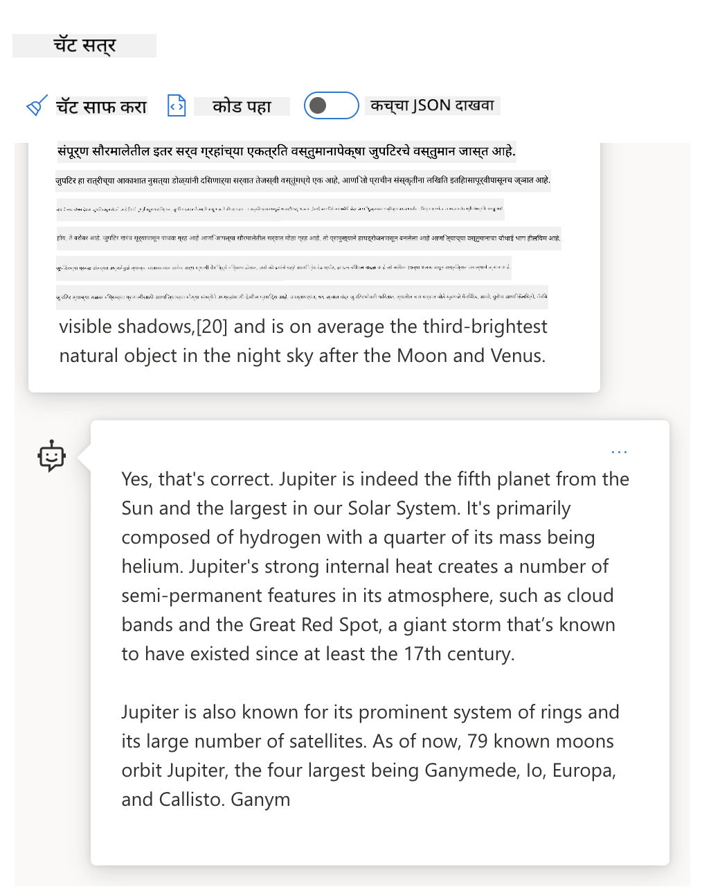
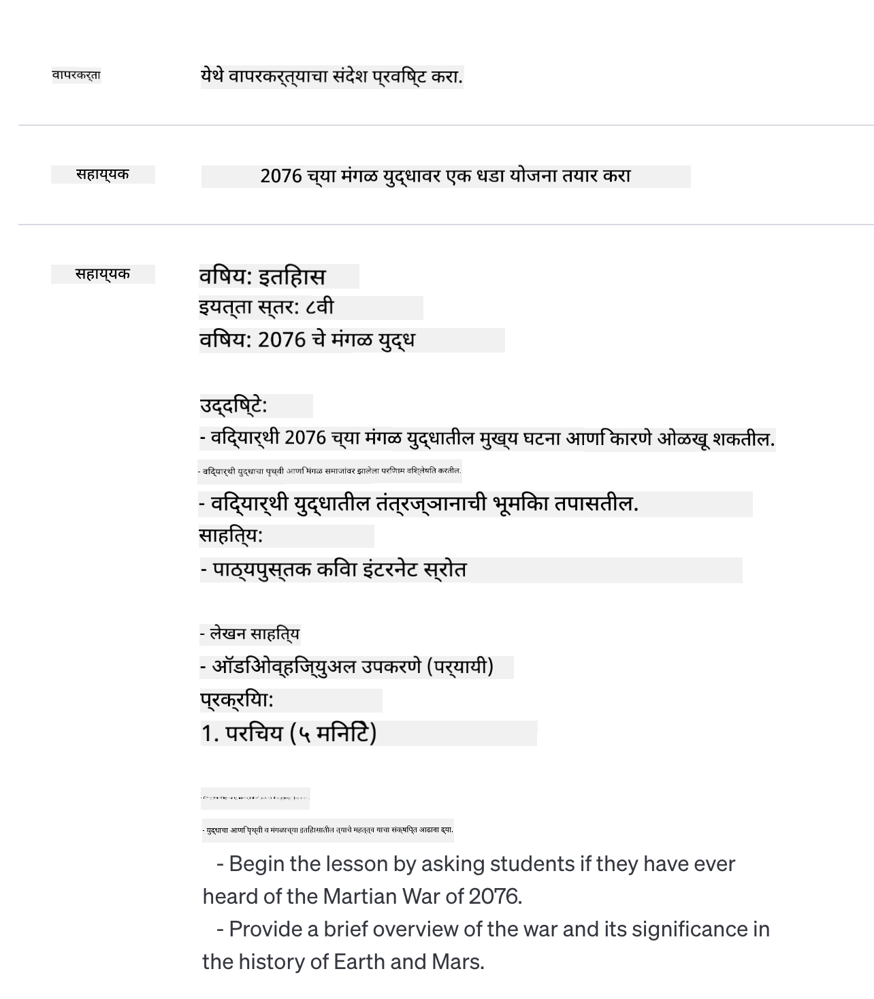
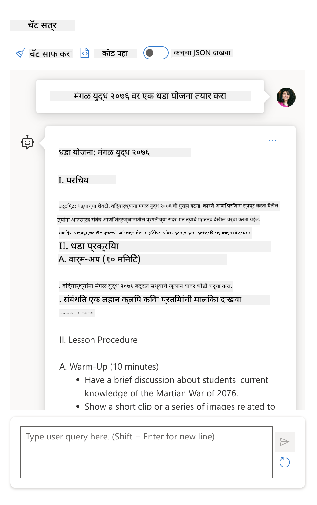

<!--
CO_OP_TRANSLATOR_METADATA:
{
  "original_hash": "0135e6c271f3ece8699050d4debbce88",
  "translation_date": "2025-10-17T13:42:26+00:00",
  "source_file": "04-prompt-engineering-fundamentals/README.md",
  "language_code": "mr"
}
-->
# प्रॉम्प्ट इंजिनिअरिंग मूलभूत गोष्टी

[](https://youtu.be/GElCu2kUlRs?si=qrXsBvXnCW12epb8)

## परिचय
या मॉड्यूलमध्ये जनरेटिव्ह AI मॉडेल्ससाठी प्रभावी प्रॉम्प्ट तयार करण्यासाठी आवश्यक संकल्पना आणि तंत्रांचा समावेश आहे. LLM ला दिलेला प्रॉम्प्ट कसा लिहिला जातो हे देखील महत्त्वाचे आहे. काळजीपूर्वक तयार केलेला प्रॉम्प्ट उत्तम दर्जाचा प्रतिसाद मिळवू शकतो. पण _प्रॉम्प्ट_ आणि _प्रॉम्प्ट इंजिनिअरिंग_ यासारख्या संज्ञा नेमक्या काय आहेत? आणि मी LLM ला पाठवलेला प्रॉम्प्ट _इनपुट_ कसा सुधारू शकतो? या अध्यायात आणि पुढील अध्यायात आपण या प्रश्नांची उत्तरे शोधण्याचा प्रयत्न करू.

_जनरेटिव्ह AI_ नवीन सामग्री (उदा. मजकूर, प्रतिमा, ऑडिओ, कोड इ.) तयार करण्यास सक्षम आहे जी वापरकर्त्याच्या विनंतीला प्रतिसाद देते. हे OpenAI च्या GPT ("Generative Pre-trained Transformer") मालिकेसारख्या _लार्ज लँग्वेज मॉडेल्स_ चा वापर करून साध्य केले जाते, जे नैसर्गिक भाषा आणि कोड वापरण्यासाठी प्रशिक्षित आहेत.

वापरकर्ते आता चॅटसारख्या परिचित पद्धतींचा वापर करून या मॉडेल्सशी संवाद साधू शकतात, ज्यासाठी कोणत्याही तांत्रिक कौशल्याची किंवा प्रशिक्षणाची आवश्यकता नाही. मॉडेल्स _प्रॉम्प्ट-आधारित_ आहेत - वापरकर्ते मजकूर इनपुट (प्रॉम्प्ट) पाठवतात आणि AI प्रतिसाद (पूर्णता) परत मिळवतात. ते नंतर "AI सोबत चॅट" करू शकतात, बहु-टर्न संभाषणांमध्ये, त्यांच्या अपेक्षांशी जुळणारा प्रतिसाद मिळेपर्यंत प्रॉम्प्ट सुधारित करू शकतात.

"प्रॉम्प्ट्स" आता जनरेटिव्ह AI अॅप्ससाठी प्राथमिक _प्रोग्रामिंग इंटरफेस_ बनले आहेत, जे मॉडेल्सला काय करायचे आहे ते सांगतात आणि परत मिळालेल्या प्रतिसादाच्या गुणवत्तेवर प्रभाव टाकतात. "प्रॉम्प्ट इंजिनिअरिंग" ही एक वेगाने वाढणारी अभ्यासाची शाखा आहे जी _डिझाइन आणि ऑप्टिमायझेशन_ वर लक्ष केंद्रित करते जे मोठ्या प्रमाणावर सातत्यपूर्ण आणि गुणवत्तापूर्ण प्रतिसाद वितरीत करते.

## शिकण्याची उद्दिष्टे

या धड्यात, आपण प्रॉम्प्ट इंजिनिअरिंग म्हणजे काय, ते का महत्त्वाचे आहे आणि दिलेल्या मॉडेल आणि अनुप्रयोगाच्या उद्दिष्टासाठी अधिक प्रभावी प्रॉम्प्ट कसे तयार करता येतील हे शिकू. प्रॉम्प्ट इंजिनिअरिंगसाठी मुख्य संकल्पना आणि सर्वोत्तम पद्धती समजून घेऊ - आणि एक परस्परसंवादी जुपिटर नोटबुक "सँडबॉक्स" वातावरणाबद्दल शिकू जिथे आपण या संकल्पना वास्तविक उदाहरणांवर लागू झालेल्या पाहू शकतो.

या धड्याच्या शेवटी आपण हे करू शकू:

1. प्रॉम्प्ट इंजिनिअरिंग म्हणजे काय आणि ते का महत्त्वाचे आहे हे स्पष्ट करा.
2. प्रॉम्प्टचे घटक काय आहेत आणि ते कसे वापरले जातात हे वर्णन करा.
3. प्रॉम्प्ट इंजिनिअरिंगसाठी सर्वोत्तम पद्धती आणि तंत्रे शिका.
4. शिकलेल्या तंत्रांचा वापर करून OpenAI एन्डपॉइंटसह वास्तविक उदाहरणांवर लागू करा.

## मुख्य संज्ञा

प्रॉम्प्ट इंजिनिअरिंग: AI मॉडेल्सला इच्छित आउटपुट तयार करण्यासाठी मार्गदर्शन करण्यासाठी इनपुट्स डिझाइन आणि सुधारित करण्याची पद्धत.
टोकनायझेशन: मजकूर लहान युनिट्समध्ये रूपांतरित करण्याची प्रक्रिया, ज्याला टोकन्स म्हणतात, जे मॉडेल समजू शकते आणि प्रक्रिया करू शकते.
इन्स्ट्रक्शन-ट्यूनड LLMs: मोठ्या लँग्वेज मॉडेल्स (LLMs) जे विशिष्ट सूचना देऊन त्यांच्या प्रतिसादाची अचूकता आणि संबंधितता सुधारण्यासाठी ट्यून केले गेले आहेत.

## शिकण्याचे सँडबॉक्स

प्रॉम्प्ट इंजिनिअरिंग सध्या विज्ञानापेक्षा कला अधिक आहे. यासाठी आपली अंतर्ज्ञान सुधारण्यासाठी _जास्त सराव_ करणे आणि शिफारस केलेल्या तंत्रांसह अनुप्रयोग डोमेन कौशल्य आणि मॉडेल-विशिष्ट ऑप्टिमायझेशन एकत्रित करणारी चाचणी-आणि-त्रुटी पद्धत स्वीकारणे सर्वोत्तम आहे.

या धड्याशी संबंधित जुपिटर नोटबुक एक _सँडबॉक्स_ वातावरण प्रदान करते जिथे आपण शिकत असताना किंवा शेवटच्या कोड चॅलेंजचा भाग म्हणून आपण शिकलेले प्रयत्न करू शकता. व्यायाम पूर्ण करण्यासाठी, आपल्याला आवश्यक असेल:

1. **Azure OpenAI API की** - तैनात LLM साठी सेवा एन्डपॉइंट.
2. **Python Runtime** - ज्यामध्ये नोटबुक चालवता येईल.
3. **स्थानिक पर्यावरण व्हेरिएबल्स** - _[SETUP](./../00-course-setup/02-setup-local.md?WT.mc_id=academic-105485-koreyst) चरण पूर्ण करा_ आता तयार होण्यासाठी.

नोटबुकमध्ये _स्टार्टर_ व्यायाम आहेत - परंतु आपण स्वतःचे _Markdown_ (वर्णन) आणि _Code_ (प्रॉम्प्ट विनंत्या) विभाग जोडून अधिक उदाहरणे किंवा कल्पना प्रयत्न करण्यासाठी प्रोत्साहित आहात - आणि प्रॉम्प्ट डिझाइनसाठी आपली अंतर्ज्ञान तयार करा.

## चित्रात्मक मार्गदर्शक

या धड्याने कव्हर केलेल्या मुख्य विषयांचा मोठा चित्र मिळवायचा आहे का? या चित्रात्मक मार्गदर्शकावर एक नजर टाका, जो तुम्हाला कव्हर केलेल्या मुख्य विषयांचा आणि प्रत्येकामध्ये विचार करण्यासाठी मुख्य मुद्द्यांचा अर्थ देतो. धड्याचा रोडमॅप तुम्हाला मुख्य संकल्पना आणि आव्हाने समजून घेण्यापासून संबंधित प्रॉम्प्ट इंजिनिअरिंग तंत्र आणि सर्वोत्तम पद्धतींसह त्यांना संबोधित करण्यापर्यंत घेऊन जातो. लक्षात ठेवा की या मार्गदर्शकातील "प्रगत तंत्र" विभाग या अभ्यासक्रमाच्या _पुढील_ अध्यायात कव्हर केलेल्या सामग्रीचा संदर्भ देतो.


## आमचा स्टार्टअप

आता, _हा विषय_ शिक्षणामध्ये AI नवकल्पना आणण्याच्या [आमच्या स्टार्टअप मिशनशी](https://educationblog.microsoft.com/2023/06/collaborating-to-bring-ai-innovation-to-education?WT.mc_id=academic-105485-koreyst) कसा संबंधित आहे याबद्दल बोलूया. आम्हाला _वैयक्तिकृत शिक्षण_ च्या AI-सक्षम अनुप्रयोगांची निर्मिती करायची आहे - त्यामुळे आपल्या अनुप्रयोगाचे वेगवेगळे वापरकर्ते "प्रॉम्प्ट्स" कसे डिझाइन करू शकतात याचा विचार करूया:

- **प्रशासक** AI ला _आवश्यकतेच्या कव्हरेजमधील अंतर ओळखण्यासाठी अभ्यासक्रम डेटा विश्लेषण करण्यास_ सांगू शकतात. AI परिणामांचे सारांश देऊ शकतो किंवा कोडसह त्यांचे व्हिज्युअलायझेशन करू शकतो.
- **शिक्षक** AI ला _लक्ष्य प्रेक्षक आणि विषयासाठी पाठ योजना तयार करण्यास_ सांगू शकतात. AI निर्दिष्ट स्वरूपात वैयक्तिकृत योजना तयार करू शकतो.
- **विद्यार्थी** AI ला _कठीण विषयात त्यांना शिकवण्यास_ सांगू शकतात. AI आता विद्यार्थ्यांना त्यांच्या स्तरानुसार धडे, सूचनां आणि उदाहरणांसह मार्गदर्शन करू शकतो.

हे फक्त सुरुवात आहे. [शिक्षणासाठी प्रॉम्प्ट्स](https://github.com/microsoft/prompts-for-edu/tree/main?WT.mc_id=academic-105485-koreyst) - शिक्षण तज्ञांनी तयार केलेल्या ओपन-सोर्स प्रॉम्प्ट्स लायब्ररीवर एक नजर टाका - शक्यतांचा व्यापक अर्थ मिळवण्यासाठी! _सँडबॉक्समध्ये किंवा OpenAI प्लेग्राउंडमध्ये काही प्रॉम्प्ट्स चालवून काय होते ते पाहा!_

<!--
LESSON TEMPLATE:
This unit should cover core concept #1.
Reinforce the concept with examples and references.

CONCEPT #1:
Prompt Engineering.
Define it and explain why it is needed.
-->

## प्रॉम्प्ट इंजिनिअरिंग म्हणजे काय?

आम्ही **प्रॉम्प्ट इंजिनिअरिंग** ची व्याख्या _मजकूर इनपुट्स (प्रॉम्प्ट्स) डिझाइन आणि ऑप्टिमायझेशन_ प्रक्रिया म्हणून केली आहे जी दिलेल्या अनुप्रयोगाच्या उद्दिष्टासाठी आणि मॉडेलसाठी सातत्यपूर्ण आणि गुणवत्तापूर्ण प्रतिसाद (पूर्णता) वितरीत करते. आम्ही याला 2-चरणीय प्रक्रिया म्हणून विचार करू शकतो:

- दिलेल्या मॉडेल आणि उद्दिष्टासाठी प्रारंभिक प्रॉम्प्ट _डिझाइन करणे_
- प्रतिसादाची गुणवत्ता सुधारण्यासाठी प्रॉम्प्ट _पुनरावृत्तीने सुधारित करणे_

हे आवश्यकतः एक चाचणी-आणि-त्रुटी प्रक्रिया आहे ज्यासाठी वापरकर्त्याची अंतर्ज्ञान आणि सर्वोत्तम परिणाम मिळवण्यासाठी प्रयत्न आवश्यक आहेत. तर हे महत्त्वाचे का आहे? त्या प्रश्नाचे उत्तर देण्यासाठी, आपल्याला प्रथम तीन संकल्पना समजून घेणे आवश्यक आहे:

- _टोकनायझेशन_ = मॉडेल प्रॉम्प्ट कसे "पाहते"
- _बेस LLMs_ = फाउंडेशन मॉडेल प्रॉम्प्ट कसे "प्रक्रिया" करते
- _इन्स्ट्रक्शन-ट्यूनड LLMs_ = मॉडेल आता "कार्ये" कशी पाहू शकते

### टोकनायझेशन

LLM प्रॉम्प्ट्सला _टोकन्सच्या अनुक्रम_ म्हणून पाहतो जिथे वेगवेगळे मॉडेल्स (किंवा मॉडेलचे आवृत्त्या) समान प्रॉम्प्ट वेगवेगळ्या प्रकारे टोकनाइझ करू शकतात. कारण LLMs टोकन्सवर (कच्च्या मजकूरावर नाही) प्रशिक्षित केले जातात, प्रॉम्प्ट्स कसे टोकनाइझ केले जातात याचा थेट परिणाम तयार केलेल्या प्रतिसादाच्या गुणवत्तेवर होतो.

टोकनायझेशन कसे कार्य करते याची अंतर्ज्ञान मिळवण्यासाठी, [OpenAI Tokenizer](https://platform.openai.com/tokenizer?WT.mc_id=academic-105485-koreyst) सारखी साधने वापरून पहा. तुमचा प्रॉम्प्ट कॉपी करा - आणि तो टोकन्समध्ये कसा रूपांतरित होतो ते पहा, पांढऱ्या जागेच्या वर्णांवर आणि विरामचिन्हांवर कसे हाताळले जाते याकडे लक्ष द्या. लक्षात ठेवा की हे उदाहरण जुने LLM (GPT-3) दर्शवते - त्यामुळे नवीन मॉडेलसह प्रयत्न केल्यास वेगळा परिणाम होऊ शकतो.


### संकल्पना: फाउंडेशन मॉडेल्स

एकदा प्रॉम्प्ट टोकनाइझ झाल्यावर, ["बेस LLM"](https://blog.gopenai.com/an-introduction-to-base-and-instruction-tuned-large-language-models-8de102c785a6?WT.mc_id=academic-105485-koreyst) (किंवा फाउंडेशन मॉडेल) चे प्राथमिक कार्य त्या अनुक्रमातील टोकनची भविष्यवाणी करणे आहे. कारण LLMs मोठ्या मजकूर डेटासेट्सवर प्रशिक्षित केले जातात, त्यांना टोकन्समधील सांख्यिकीय संबंधांची चांगली जाणीव असते आणि ते काही आत्मविश्वासाने ती भविष्यवाणी करू शकतात. लक्षात ठेवा की त्यांना प्रॉम्प्ट किंवा टोकनमधील शब्दांचा _अर्थ_ समजत नाही; ते फक्त एक नमुना पाहतात ज्याला ते त्यांच्या पुढील भविष्यवाणीसह "पूर्ण" करू शकतात. ते वापरकर्त्याच्या हस्तक्षेपाने किंवा काही पूर्व-स्थापित अटींनी समाप्त होईपर्यंत अनुक्रमाची भविष्यवाणी करत राहू शकतात.

प्रॉम्प्ट-आधारित पूर्णता कशी कार्य करते हे पाहायचे आहे का? वरील प्रॉम्प्ट Azure OpenAI Studio [_Chat Playground_](https://oai.azure.com/playground?WT.mc_id=academic-105485-koreyst) मध्ये डीफॉल्ट सेटिंग्जसह प्रविष्ट करा. प्रणाली प्रॉम्प्ट्सला माहितीच्या विनंती म्हणून मानण्यास कॉन्फिगर केली आहे - त्यामुळे तुम्हाला या संदर्भात समाधानकारक पूर्णता दिसायला हवी.

पण जर वापरकर्त्याला काही विशिष्ट गोष्टी पाहायच्या असतील ज्या काही निकष किंवा कार्याच्या उद्दिष्टाशी जुळतात? येथे _इन्स्ट्रक्शन-ट्यूनड_ LLMs चित्रात येतात.



### संकल्पना: इन्स्ट्रक्शन ट्यूनड LLMs

[इन्स्ट्रक्शन ट्यूनड LLM](https://blog.gopenai.com/an-introduction-to-base-and-instruction-tuned-large-language-models-8de102c785a6?WT.mc_id=academic-105485-koreyst) फाउंडेशन मॉडेलसह सुरू होते आणि स्पष्ट सूचना असलेल्या उदाहरणे किंवा इनपुट/आउटपुट जोड्यांसह (उदा., मल्टि-टर्न "मेसजेस") ट्यून केले जाते - आणि AI चा प्रतिसाद त्या सूचनांचे अनुसरण करण्याचा प्रयत्न करतो.

यामध्ये Reinforcement Learning with Human Feedback (RLHF) सारख्या तंत्रांचा वापर केला जातो ज्यामुळे मॉडेलला _सूचना अनुसरण_ आणि _प्रतिक्रियेपासून शिकणे_ शक्य होते जेणेकरून ते व्यावहारिक अनुप्रयोगांसाठी अधिक योग्य आणि वापरकर्त्याच्या उद्दिष्टांसाठी अधिक संबंधित प्रतिसाद तयार करू शकते.

चला प्रयत्न करूया - वरील प्रॉम्प्ट पुन्हा पहा, परंतु आता _सिस्टम मेसेज_ बदलून खालील सूचना संदर्भ म्हणून प्रदान करा:

> _तुम्हाला दिलेली सामग्री दुसऱ्या वर्गातील विद्यार्थ्यासाठी संक्षेप करा. परिणाम एका परिच्छेदात 3-5 बुलेट पॉइंट्ससह ठेवा._

पहा की परिणाम आता इच्छित उद्दिष्ट आणि स्वरूप प्रतिबिंबित करण्यासाठी ट्यून केला आहे का? शिक्षक आता त्यांच्या वर्गासाठी स्लाइड्समध्ये थेट हा प्रतिसाद वापरू शकतो.


## प्रॉम्प्ट इंजिनिअरिंग का आवश्यक आहे?

आता आपल्याला माहित आहे की LLMs प्रॉम्प्ट्स कसे प्रक्रिया करतात, चला _का_ प्रॉम्प्ट इंजिनिअरिंग आवश्यक आहे याबद्दल बोलूया. उत्तर असे आहे की सध्याचे LLMs काही आव्हाने निर्माण करतात ज्यामुळे _विश्वसनीय आणि सातत्यपूर्ण पूर्णता_ साध्य करणे अधिक कठीण होते, प्रॉम्प्ट बांधणी आणि ऑप्टिमायझेशनमध्ये प्रयत्न न करता. उदाहरणार्थ:

1. **मॉडेल प्रतिसाद स्टोकेस्टिक आहेत.** _समान प्रॉम्प्ट_ वेगवेगळ्या मॉडेल्स किंवा मॉडेल आवृत्त्यांसह वेगवेगळे प्रतिसाद तयार करेल. आणि ते _समान मॉडेल_ वेगवेगळ्या वेळी देखील वेगळे परिणाम तयार करू शकते. _प्रॉम्प्ट इंजिनिअरिंग तंत्रे आम्हाला चांगल्या गार्डरेल्स प्रदान करून या बदलांना कमी करण्यात मदत करू शकतात_.

1. **मॉडेल्स प्रतिसाद तयार करू शकतात.** मॉडेल्स _मोठ्या पण मर्यादित_ डेटासेट्ससह प्री-ट्रेन केले जातात, म्हणजे त्यांना त्या प्रशिक्षणाच्या कक्षेबाहेरील संकल्पनांबद्दल ज्ञान नसते. परिणामी, ते पूर्णता तयार करू शकतात जी अचूक, काल्पनिक किंवा ज्ञात तथ्यांशी थेट विरोधाभासी असते. _प्रॉम्प्ट इंजिनिअरिंग तंत्र वापरकर्त्यांना अशा बनावट गोष्टी ओळखण्यात आणि कमी करण्यात मदत करतात उदा., AI ला संदर्भ किंवा युक्तिवाद विचारून_.

1. **मॉडेल्सची क्षमता वेगवेगळी असेल.** नवीन मॉडेल्स किंवा मॉडेल पिढ्या समृद्ध क्षमता असतील परंतु खर्च आणि जटिलतेत अद्वितीय विचित्रता आणि व्यापार देखील आणतील. _प्रॉम्प्ट इंजिनिअरिंग आम्हाला सर्वोत्तम पद्धती आणि कार्यप्रवाह विकसित करण्यात मदत करू शकते जे
वेब शोधातून मला कळले की मंगळ ग्रहावरील युद्धांवर काल्पनिक कथा (उदा. दूरचित्रवाणी मालिका किंवा पुस्तके) आहेत - पण 2076 मध्ये नाहीत. सामान्य ज्ञानानेही सांगितले की 2076 हे _भविष्यातील_ वर्ष आहे आणि त्यामुळे ते कोणत्याही वास्तविक घटनेशी संबंधित असू शकत नाही.

तर वेगवेगळ्या LLM प्रदात्यांसह हा प्रॉम्प्ट चालवला तर काय होते?

> **प्रतिक्रिया 1**: OpenAI Playground (GPT-35)



> **प्रतिक्रिया 2**: Azure OpenAI Playground (GPT-35)



> **प्रतिक्रिया 3**: Hugging Face Chat Playground (LLama-2)


अपेक्षेप्रमाणे, प्रत्येक मॉडेल (किंवा मॉडेल आवृत्ती) थोड्या वेगळ्या प्रतिसादांची निर्मिती करते, कारण स्टोकेस्टिक वर्तन आणि मॉडेल क्षमतेतील फरक. उदाहरणार्थ, एक मॉडेल 8वी इयत्तेच्या प्रेक्षकांना लक्ष्य करते तर दुसरे उच्च माध्यमिक विद्यार्थ्यांना लक्षात घेते. पण तिन्ही मॉडेल्सने असे प्रतिसाद तयार केले जे अशिक्षित वापरकर्त्याला ही घटना खरी असल्याचे पटवून देऊ शकतात.

_मेटाप्रॉम्प्टिंग_ आणि _तापमान कॉन्फिगरेशन_ यासारख्या प्रॉम्प्ट इंजिनिअरिंग तंत्रांमुळे मॉडेलच्या चुकीच्या माहितीची निर्मिती काही प्रमाणात कमी होऊ शकते. नवीन प्रॉम्प्ट इंजिनिअरिंग _आर्किटेक्चर_ नवीन साधने आणि तंत्रे सहजपणे प्रॉम्प्ट फ्लोमध्ये समाविष्ट करतात, ज्यामुळे या प्रभावांना कमी करण्यासाठी मदत होते.

## केस स्टडी: GitHub Copilot

या विभागाचा शेवट प्रॉम्प्ट इंजिनिअरिंगचा वापर प्रत्यक्षात कसा केला जातो हे समजून घेण्यासाठी एका केस स्टडीकडे पाहून करूया: [GitHub Copilot](https://github.com/features/copilot?WT.mc_id=academic-105485-koreyst).

GitHub Copilot हा तुमचा "AI Pair Programmer" आहे - तो मजकूर प्रॉम्प्ट्सला कोड पूर्णतेमध्ये रूपांतरित करतो आणि तुमच्या विकासाच्या वातावरणात (उदा. Visual Studio Code) एकत्रित केला जातो, ज्यामुळे वापरकर्ता अनुभव सहज होतो. खालील ब्लॉग मालिकेत दस्तऐवजीकरण केल्याप्रमाणे, सुरुवातीची आवृत्ती OpenAI Codex मॉडेलवर आधारित होती - ज्यामुळे अभियंत्यांना मॉडेलला सुधारण्यासाठी आणि कोड गुणवत्तेत सुधारणा करण्यासाठी चांगल्या प्रॉम्प्ट इंजिनिअरिंग तंत्रांचा विकास करण्याची गरज लवकर लक्षात आली. जुलैमध्ये त्यांनी [Codex पेक्षा पुढे जाणारे सुधारित AI मॉडेल सादर केले](https://github.blog/2023-07-28-smarter-more-efficient-coding-github-copilot-goes-beyond-codex-with-improved-ai-model/?WT.mc_id=academic-105485-koreyst) जे अधिक वेगवान सूचना देते.

त्यांच्या शिकण्याच्या प्रवासाचे अनुसरण करण्यासाठी पोस्ट्स क्रमाने वाचा.

- **मे 2023** | [GitHub Copilot तुमच्या कोडला समजून घेण्यात अधिक चांगला होत आहे](https://github.blog/2023-05-17-how-github-copilot-is-getting-better-at-understanding-your-code/?WT.mc_id=academic-105485-koreyst)
- **मे 2023** | [GitHub मध्ये: GitHub Copilot मागील LLMs सह काम करणे](https://github.blog/2023-05-17-inside-github-working-with-the-llms-behind-github-copilot/?WT.mc_id=academic-105485-koreyst).
- **जून 2023** | [GitHub Copilot साठी चांगले प्रॉम्प्ट्स कसे लिहावे](https://github.blog/2023-06-20-how-to-write-better-prompts-for-github-copilot/?WT.mc_id=academic-105485-koreyst).
- **जुलै 2023** | [GitHub Copilot सुधारित AI मॉडेलसह Codex पेक्षा पुढे जात आहे](https://github.blog/2023-07-28-smarter-more-efficient-coding-github-copilot-goes-beyond-codex-with-improved-ai-model/?WT.mc_id=academic-105485-koreyst)
- **जुलै 2023** | [डेव्हलपरसाठी प्रॉम्प्ट इंजिनिअरिंग आणि LLMs मार्गदर्शक](https://github.blog/2023-07-17-prompt-engineering-guide-generative-ai-llms/?WT.mc_id=academic-105485-koreyst)
- **सप्टेंबर 2023** | [एंटरप्राइझ LLM अॅप कसे तयार करावे: GitHub Copilot मधील धडे](https://github.blog/2023-09-06-how-to-build-an-enterprise-llm-application-lessons-from-github-copilot/?WT.mc_id=academic-105485-koreyst)

तुम्ही त्यांचा [इंजिनिअरिंग ब्लॉग](https://github.blog/category/engineering/?WT.mc_id=academic-105485-koreyst) देखील ब्राउझ करू शकता, जसे की [हा पोस्ट](https://github.blog/2023-09-27-how-i-used-github-copilot-chat-to-build-a-reactjs-gallery-prototype/?WT.mc_id=academic-105485-koreyst) जो दाखवतो की हे मॉडेल्स आणि तंत्रे प्रत्यक्ष अनुप्रयोगांसाठी कसे वापरले जातात.

---

## प्रॉम्प्ट बांधणी

आम्ही पाहिले की प्रॉम्प्ट इंजिनिअरिंग का महत्त्वाचे आहे - आता प्रॉम्प्ट्स कसे _बांधले_ जातात ते समजून घेऊया, जेणेकरून अधिक प्रभावी प्रॉम्प्ट डिझाइनसाठी विविध तंत्रांचा अभ्यास करता येईल.

### मूलभूत प्रॉम्प्ट

मूलभूत प्रॉम्प्टपासून सुरुवात करूया: मॉडेलला पाठवलेला मजकूर इनपुट ज्यामध्ये कोणताही अतिरिक्त संदर्भ नसतो. येथे एक उदाहरण आहे - जेव्हा आम्ही अमेरिकेच्या राष्ट्रीय गाण्याच्या सुरुवातीच्या काही शब्दांना OpenAI [Completion API](https://platform.openai.com/docs/api-reference/completions?WT.mc_id=academic-105485-koreyst) कडे पाठवतो, तेव्हा ते लगेच पुढील ओळी _पूर्ण_ करते, ज्यामुळे मूलभूत अंदाज वर्तन स्पष्ट होते.

| प्रॉम्प्ट (इनपुट)     | पूर्णता (आउटपुट)                                                                                                                        |
| :----------------- | :----------------------------------------------------------------------------------------------------------------------------------------- |
| Oh say can you see | असे वाटते की तुम्ही "The Star-Spangled Banner," अमेरिकेचे राष्ट्रीय गाणे, याचे गीत सुरू करत आहात. संपूर्ण गीत असे आहे ... |

### जटिल प्रॉम्प्ट

आता त्या मूलभूत प्रॉम्प्टमध्ये संदर्भ आणि सूचना जोडूया. [Chat Completion API](https://learn.microsoft.com/azure/ai-services/openai/how-to/chatgpt?WT.mc_id=academic-105485-koreyst) आम्हाला _messages_ च्या संग्रह म्हणून जटिल प्रॉम्प्ट तयार करण्याची परवानगी देते:

- इनपुट/आउटपुट जोड्या ज्यामध्ये _वापरकर्ता_ इनपुट आणि _सहायक_ प्रतिसाद प्रतिबिंबित होतो.
- सहायक वर्तन किंवा व्यक्तिमत्त्वासाठी संदर्भ सेट करणारा सिस्टम संदेश.

आता विनंती खालील स्वरूपात आहे, जिथे _tokenization_ प्रभावीपणे संदर्भ आणि संभाषणातून संबंधित माहिती कॅप्चर करते. आता, सिस्टम संदर्भ बदलणे पूर्णतेच्या गुणवत्तेवर तितकेच प्रभावी होऊ शकते जितके वापरकर्त्याने दिलेले इनपुट.

```python
response = openai.chat.completions.create(
    model="gpt-3.5-turbo",
    messages=[
        {"role": "system", "content": "You are a helpful assistant."},
        {"role": "user", "content": "Who won the world series in 2020?"},
        {"role": "assistant", "content": "The Los Angeles Dodgers won the World Series in 2020."},
        {"role": "user", "content": "Where was it played?"}
    ]
)
```

### सूचना प्रॉम्प्ट

वरील उदाहरणांमध्ये, वापरकर्ता प्रॉम्प्ट एक साधा मजकूर क्वेरी होता जो माहितीच्या विनंती म्हणून व्याख्या केली जाऊ शकतो. _सूचना_ प्रॉम्प्ट्ससह, आम्ही त्या मजकूराचा वापर AI ला चांगले मार्गदर्शन देण्यासाठी अधिक तपशीलवार कार्य निर्दिष्ट करण्यासाठी करू शकतो. येथे एक उदाहरण आहे:

| प्रॉम्प्ट (इनपुट)                                                                                                                                                                                                                         | पूर्णता (आउटपुट)                                                                                                        | सूचना प्रकार    |
| :------------------------------------------------------------------------------------------------------------------------------------------------------------------------------------------------------------------------------------- | :------------------------------------------------------------------------------------------------------------------------- | :------------------ |
| Write a description of the Civil War                                                                                                                                                                                                   | _सोप्या परिच्छेदासह परत_                                                                                              | सोपे              |
| Write a description of the Civil War. Provide key dates and events and describe their significance                                                                                                                                     | _परिच्छेदासह परत आणि महत्त्वाच्या घटनांच्या तारखांची यादी_                                             | जटिल             |
| Write a description of the Civil War in 1 paragraph. Provide 3 bullet points with key dates and their significance. Provide 3 more bullet points with key historical figures and their contributions. Return the output as a JSON file | _अधिक विस्तृत तपशील परत, JSON स्वरूपात_ | जटिल. स्वरूपित. |

## प्राथमिक सामग्री

वरील उदाहरणांमध्ये, प्रॉम्प्ट अजूनही बराचसा खुला होता, ज्यामुळे LLM ला त्याच्या पूर्व-प्रशिक्षित डेटासेटचा कोणता भाग संबंधित आहे हे ठरवण्याची परवानगी मिळाली. _प्राथमिक सामग्री_ डिझाइन पॅटर्नसह, इनपुट मजकूर दोन भागांमध्ये विभागला जातो:

- एक सूचना (क्रिया)
- संबंधित सामग्री (जी क्रियेला प्रभावित करते)

येथे एक उदाहरण आहे जिथे सूचना आहे "याचा 2 वाक्यांमध्ये सारांश द्या".

| प्रॉम्प्ट (इनपुट)                                                                                                                                                                                                                                                                                                                                                                                                                                                                                                                                                                                                                                                                                      | पूर्णता (आउटपुट)                                                                                                                                                                                                                                                                             |
| :-------------------------------------------------------------------------------------------------------------------------------------------------------------------------------------------------------------------------------------------------------------------------------------------------------------------------------------------------------------------------------------------------------------------------------------------------------------------------------------------------------------------------------------------------------------------------------------------------------------------------------------------------------------------------------------------------- | :---------------------------------------------------------------------------------------------------------------------------------------------------------------------------------------------------------------------------------------------------------------------------------------------- |
| Jupiter is the fifth planet from the Sun and the largest in the Solar System. It is a gas giant with a mass one-thousandth that of the Sun, but two-and-a-half times that of all the other planets in the Solar System combined. Jupiter is one of the brightest objects visible to the naked eye in the night sky, and has been known to ancient civilizations since before recorded history. It is named after the Roman god Jupiter.[19] When viewed from Earth, Jupiter can be bright enough for its reflected light to cast visible shadows,[20] and is on average the third-brightest natural object in the night sky after the Moon and Venus. <br/> **Summarize this in 2 short sentences** | Jupiter, the fifth planet from the Sun, is the largest in the Solar System and is known for being one of the brightest objects in the night sky. Named after the Roman god Jupiter, it's a gas giant whose mass is two-and-a-half times that of all other planets in the Solar System combined. |

प्राथमिक सामग्री विभाग अधिक प्रभावी सूचना देण्यासाठी विविध प्रकारे वापरला जाऊ शकतो:

- **उदाहरणे** - मॉडेलला स्पष्ट सूचना देण्याऐवजी, त्याला काय करायचे आहे याचे उदाहरणे द्या आणि त्याला नमुन्याचा अंदाज लावू द्या.
- **सूचना** - सूचनांनंतर "सूचना" द्या जी पूर्णतेला प्रोत्साहित करते, मॉडेलला अधिक संबंधित प्रतिसादांकडे मार्गदर्शन करते.
- **टेम्पलेट्स** - हे प्रॉम्प्ट्ससाठी पुनरावृत्ती 'रेसिपी' आहेत ज्यामध्ये प्लेसहोल्डर्स (व्हेरिएबल्स) असतात जे विशिष्ट उपयोगांसाठी डेटा सह सानुकूलित केले जाऊ शकतात.

चला हे कृतीत पाहूया.

### उदाहरणांचा वापर

ही एक पद्धत आहे जिथे तुम्ही प्राथमिक सामग्रीचा वापर करून मॉडेलला दिलेल्या सूचनेसाठी अपेक्षित आउटपुटचे काही उदाहरणे "खाऊ घालता" आणि अपेक्षित आउटपुटसाठी नमुना काढण्याची परवानगी देता. दिलेल्या उदाहरणांच्या संख्येवर आधारित, आपल्याकडे झिरो-शॉट प्रॉम्प्टिंग, वन-शॉट प्रॉम्प्टिंग, फ्यू-शॉट प्रॉम्प्टिंग इत्यादी असू शकते.

प्रॉम्प्ट आता तीन घटकांमध्ये बनलेला आहे:

- कार्याचे वर्णन
- अपेक्षित आउटपुटचे काही उदाहरणे
- नवीन उदाहरणाची सुरुवात (जे अप्रत्यक्ष कार्याचे वर्णन बनते)

| शिकण्याचा प्रकार | प्रॉम्प्ट (इनपुट)                                                                                                                                        | पूर्णता (आउटपुट)         |
| :------------ | :---------------------------------------------------------------------------------------------------------------------------------------------------- | :-------------------------- |
| झिरो-शॉट     | "The Sun is Shining". Translate to Spanish                                                                                                            | "El Sol está brillando".    |
| वन-शॉट      | "The Sun is Shining" => ""El Sol está brillando". <br> "It's a Cold and Windy Day" =>                                                                 | "Es un día frío y ventoso". |
| फ्यू-शॉट      | The player ran the bases => Baseball <br/> The player hit an ace => Tennis <br/> The player hit a six => Cricket <br/> The player made a slam-dunk => | Basketball                  |
|               |                                                                                                                                                       |                             |

झिरो-शॉट प्रॉम्प्टिंगमध्ये आम्हाला स्पष्ट सूचना ("Translate to Spanish") द्यावी लागली, पण वन-शॉट प्रॉम्प्टिंग उदाहरणात ती सूचित होते. फ्यू-शॉट उदाहरण दाखवते की अधिक उदाहरणे जोडल्याने मॉडेल्स अधिक अचूक अंदाज लावू शकतात, कोणत्याही अतिरिक्त सूचनांशिवाय.

### प्रॉम्प्ट सूचना

प्राथमिक सामग्री वापरण्याची आणखी एक पद्धत म्हणजे _सूचना_ देणे. या प्रकरणात, आम्ही मॉडेलला _योग्य दिशेने_ हलवण्यासाठी एक तुकडा देतो जो अपेक्षित प्रतिसाद स्वरूप प्रतिबिंबित करतो. मॉडेल नंतर "सूचना घेते" आणि त्या प्रकारात पुढे जाते.

| सूचनांची संख्या | प्रॉम्प्ट (इनपुट)                                                                                                                                                                                                                                                                                                                                                                                                                                               | पूर्णता (आउटपुट)                                                                                                                                                                                                                                                                                       |
| :------------- | :----------------------------------------------------------------------------------------------------------------------------------------------------------------------------------------------------------------------------------------------------------------------------------------------------------------------------------------------------------------------------------------------------------------------------------------------------------- | :-------------------------------------------------------------------------------------------------------------------------------------------------------------------------------------------------------------------------------------------------------------------------------------------------------- |
| 0              | Jupiter is the fifth planet from the Sun and the largest in the Solar System. It is a gas giant with a mass one-thousandth that of the Sun, but two-and-a-half times that of all the other planets in the Solar System combined. Jupiter is one of the brightest objects visible to the naked eye in the night sky, and has been known to ancient civilizations since before recorded history. <br/>**Summarize This**                                       | Jupiter is the largest planet in our Solar System and the fifth one from the Sun. It is a gas giant with a mass 1/1000th of the Sun's, but it is heavier than all the other planets combined. Ancient civilizations have known about Jupiter for a long time, and it is easily visible in the night sky.. |
| 1              | ज्युपिटर सूर्यापासून पाचवा ग्रह आहे आणि सौरमालेतील सर्वात मोठा ग्रह आहे. हा एक वायू-विशाल ग्रह आहे ज्याचा वजन सूर्याच्या वजनाच्या एक हजारव्या भागाइतका आहे, पण सौरमालेतील इतर सर्व ग्रहांच्या वजनाच्या दोन-अर्धा पट आहे. ज्युपिटर रात्रीच्या आकाशात डोळ्यांना सहज दिसणाऱ्या सर्वात तेजस्वी वस्तूंमध्ये आहे आणि प्राचीन काळापासून ज्ञात आहे. <br/>**याचा सारांश द्या** <br/> आपण काय शिकलो ते म्हणजे ज्युपिटर | सूर्यापासून पाचवा ग्रह आहे आणि सौरमालेतील सर्वात मोठा ग्रह आहे. हा एक वायू-विशाल ग्रह आहे ज्याचा वजन सूर्याच्या वजनाच्या एक हजारव्या भागाइतका आहे, पण सौरमालेतील इतर सर्व ग्रहांच्या वजनाच्या दोन-अर्धा पट आहे. तो डोळ्यांना सहज दिसतो आणि प्राचीन काळापासून ज्ञात आहे.                        |
| 2              | ज्युपिटर सूर्यापासून पाचवा ग्रह आहे आणि सौरमालेतील सर्वात मोठा ग्रह आहे. हा एक वायू-विशाल ग्रह आहे ज्याचा वजन सूर्याच्या वजनाच्या एक हजारव्या भागाइतका आहे, पण सौरमालेतील इतर सर्व ग्रहांच्या वजनाच्या दोन-अर्धा पट आहे. ज्युपिटर रात्रीच्या आकाशात डोळ्यांना सहज दिसणाऱ्या सर्वात तेजस्वी वस्तूंमध्ये आहे आणि प्राचीन काळापासून ज्ञात आहे. <br/>**याचा सारांश द्या** <br/> आम्ही शिकलोले टॉप 3 तथ्य:         | 1. ज्युपिटर सूर्यापासून पाचवा ग्रह आहे आणि सौरमालेतील सर्वात मोठा ग्रह आहे. <br/> 2. हा एक वायू-विशाल ग्रह आहे ज्याचा वजन सूर्याच्या वजनाच्या एक हजारव्या भागाइतका आहे...<br/> 3. ज्युपिटर प्राचीन काळापासून डोळ्यांना सहज दिसतो ...                                                                       |
|                |                                                                                                                                                                                                                                                                                                                                                                                                                                                              |                                                                                                                                                                                                                                                                                                           |

### प्रॉम्प्ट टेम्पलेट्स

प्रॉम्प्ट टेम्पलेट म्हणजे _प्रॉम्प्टसाठी पूर्व-निर्धारित कृती_ जी साठवून ठेवली जाऊ शकते आणि आवश्यकतेनुसार पुन्हा वापरली जाऊ शकते, ज्यामुळे मोठ्या प्रमाणावर अधिक सुसंगत वापरकर्ता अनुभव मिळतो. याच्या सर्वात सोप्या स्वरूपात, हे [OpenAI](https://platform.openai.com/examples?WT.mc_id=academic-105485-koreyst) मधील उदाहरणासारखे प्रॉम्प्ट घटक (वापरकर्ता आणि प्रणाली संदेश) आणि API-चालित विनंती स्वरूप प्रदान करणारे प्रॉम्प्ट उदाहरणांचे संग्रह आहे - पुन्हा वापरण्यास समर्थन देण्यासाठी.

याच्या अधिक जटिल स्वरूपात [LangChain](https://python.langchain.com/docs/concepts/prompt_templates/?WT.mc_id=academic-105485-koreyst) मधील उदाहरणासारखे, यात _प्लेसहोल्डर्स_ असतात जे विविध स्रोतांमधून (वापरकर्ता इनपुट, प्रणाली संदर्भ, बाह्य डेटा स्रोत इ.) डेटा बदलून प्रॉम्प्ट गतिशीलपणे तयार करण्यासाठी वापरले जाऊ शकतात. यामुळे आम्हाला पुन्हा वापरण्यायोग्य प्रॉम्प्ट्सची लायब्ररी तयार करता येते जी **प्रोग्रामॅटिकली** मोठ्या प्रमाणावर सुसंगत वापरकर्ता अनुभव निर्माण करण्यासाठी वापरली जाऊ शकते.

शेवटी, टेम्पलेट्सचे खरे मूल्य _प्रॉम्प्ट लायब्ररी_ तयार आणि प्रकाशित करण्याच्या क्षमतेत आहे, जिथे प्रॉम्प्ट टेम्पलेट आता _अनुप्रयोग-विशिष्ट संदर्भ_ किंवा उदाहरणे प्रतिबिंबित करण्यासाठी _ऑप्टिमाइझ_ केले जाते, ज्यामुळे प्रतिसाद लक्ष्यित वापरकर्ता प्रेक्षकांसाठी अधिक संबंधित आणि अचूक होतात. [Prompts For Edu](https://github.com/microsoft/prompts-for-edu?WT.mc_id=academic-105485-koreyst) रिपॉझिटरी हे शिक्षण क्षेत्रासाठी प्रॉम्प्ट्सची लायब्ररी क्युरेट करण्याच्या दृष्टिकोनाचे एक उत्तम उदाहरण आहे, ज्यामध्ये धडे नियोजन, अभ्यासक्रम डिझाइन, विद्यार्थी ट्यूटोरिंग इत्यादीसारख्या प्रमुख उद्दिष्टांवर भर दिला जातो.

## सहाय्यक सामग्री

जर आपण प्रॉम्प्ट बांधणीला सूचना (कार्य) आणि लक्ष्य (प्राथमिक सामग्री) असणे मानले, तर _दुय्यम सामग्री_ म्हणजे आम्ही आउटपुटवर काही प्रकारे प्रभाव टाकण्यासाठी दिलेला अतिरिक्त संदर्भ आहे. हे ट्यूनिंग पॅरामीटर्स, स्वरूपन सूचना, विषय वर्गीकरण इत्यादी असू शकते जे मॉडेलला प्रतिसाद _वापरकर्ता उद्दिष्टे किंवा अपेक्षांसाठी योग्य_ बनविण्यास मदत करू शकते.

उदाहरणार्थ: जर अभ्यासक्रम कॅटलॉगमध्ये सर्व उपलब्ध अभ्यासक्रमांच्या नाव, वर्णन, स्तर, मेटाडेटा टॅग, प्रशिक्षक इत्यादींच्या विस्तृत मेटाडेटासह माहिती असेल:

- आपण "Fall 2023 साठी अभ्यासक्रम कॅटलॉगचे सारांश द्या" अशी सूचना परिभाषित करू शकतो.
- आपण काही उदाहरणे प्रदान करून इच्छित आउटपुट दर्शविण्यासाठी प्राथमिक सामग्री वापरू शकतो.
- आपण दुय्यम सामग्री वापरून शीर्ष 5 "टॅग्स" ओळखू शकतो.

आता, मॉडेल काही उदाहरणांनी दर्शविलेल्या स्वरूपात सारांश प्रदान करू शकते - परंतु जर एखाद्या परिणामात अनेक टॅग्स असतील, तर ते दुय्यम सामग्रीमध्ये ओळखलेल्या 5 टॅग्सना प्राधान्य देऊ शकते.

---

<!--
पाठ टेम्पलेट:
या युनिटमध्ये मुख्य संकल्पना #1 कव्हर करावी.
उदाहरणे आणि संदर्भांसह संकल्पना मजबूत करा.

संकल्पना #3:
प्रॉम्प्ट इंजिनिअरिंग तंत्र.
प्रॉम्प्ट इंजिनिअरिंगसाठी काही मूलभूत तंत्रे कोणती आहेत?
त्याचे काही सराव उदाहरणांसह चित्रण करा.
-->

## प्रॉम्प्टिंग सर्वोत्तम पद्धती

आता आपल्याला प्रॉम्प्ट्स कसे _बांधले_ जाऊ शकतात हे माहित आहे, आपण त्यांना सर्वोत्तम पद्धतींना प्रतिबिंबित करण्यासाठी कसे _डिझाइन_ करू शकतो याचा विचार सुरू करू शकतो. आपण याचा विचार दोन भागांमध्ये करू शकतो - योग्य _मनःस्थिती_ ठेवणे आणि योग्य _तंत्रे_ लागू करणे.

### प्रॉम्प्ट इंजिनिअरिंग मनःस्थिती

प्रॉम्प्ट इंजिनिअरिंग हा एक ट्रायल-एंड-एरर प्रक्रिया आहे, त्यामुळे तीन व्यापक मार्गदर्शक घटक लक्षात ठेवा:

1. **डोमेन समज महत्त्वाचा आहे.** प्रतिसादाची अचूकता आणि संबंधितता ही त्या अनुप्रयोग किंवा वापरकर्ता कार्यरत असलेल्या _डोमेन_ चे कार्य आहे. आपली अंतर्ज्ञान आणि डोमेन तज्ज्ञता वापरून तंत्रे **अधिक सानुकूलित** करा. उदाहरणार्थ, आपल्या प्रणाली प्रॉम्प्ट्समध्ये _डोमेन-विशिष्ट व्यक्तिमत्त्वे_ परिभाषित करा, किंवा आपल्या वापरकर्ता प्रॉम्प्ट्समध्ये _डोमेन-विशिष्ट टेम्पलेट्स_ वापरा. डोमेन-विशिष्ट संदर्भ प्रतिबिंबित करणारी दुय्यम सामग्री प्रदान करा, किंवा मॉडेलला परिचित वापर पद्धतींकडे मार्गदर्शन करण्यासाठी _डोमेन-विशिष्ट संकेत आणि उदाहरणे_ वापरा.

2. **मॉडेल समज महत्त्वाचा आहे.** आपल्याला माहित आहे की मॉडेल्स स्वाभाविकपणे स्टोकेस्टिक आहेत. परंतु मॉडेल अंमलबजावणी त्यांच्या वापरलेल्या प्रशिक्षण डेटासेट (पूर्व-प्रशिक्षित ज्ञान), ते प्रदान करतात त्या क्षमता (उदा., API किंवा SDK द्वारे) आणि ते ऑप्टिमाइझ केलेल्या सामग्रीच्या प्रकारानुसार (उदा., कोड विरुद्ध प्रतिमा विरुद्ध मजकूर) देखील बदलू शकतात. आपण वापरत असलेल्या मॉडेलच्या ताकदी आणि मर्यादा समजून घ्या आणि त्या ज्ञानाचा वापर करून _कार्यांना प्राधान्य_ द्या किंवा मॉडेलच्या क्षमतांसाठी ऑप्टिमाइझ केलेले _सानुकूलित टेम्पलेट्स_ तयार करा.

3. **पुनरावृत्ती आणि सत्यापन महत्त्वाचा आहे.** मॉडेल्स वेगाने विकसित होत आहेत, आणि प्रॉम्प्ट इंजिनिअरिंगसाठी तंत्रे देखील विकसित होत आहेत. डोमेन तज्ज्ञ म्हणून, आपल्याकडे इतर संदर्भ किंवा निकष असू शकतात जे _आपल्या_ विशिष्ट अनुप्रयोगासाठी लागू होतात, जे व्यापक समुदायासाठी लागू होणार नाहीत. प्रॉम्प्ट इंजिनिअरिंग साधने आणि तंत्रे वापरून प्रॉम्प्ट बांधणी "झपाट्याने सुरू" करा, नंतर आपल्या स्वतःच्या अंतर्ज्ञान आणि डोमेन तज्ज्ञता वापरून परिणामांची पुनरावृत्ती आणि सत्यापन करा. आपली अंतर्दृष्टी नोंदवा आणि एक **ज्ञान आधार** तयार करा (उदा., प्रॉम्प्ट लायब्ररी) जी इतरांद्वारे नवीन बेसलाइन म्हणून वापरली जाऊ शकते, भविष्यातील जलद पुनरावृत्तीसाठी.

## सर्वोत्तम पद्धती

आता [OpenAI](https://help.openai.com/en/articles/6654000-best-practices-for-prompt-engineering-with-openai-api?WT.mc_id=academic-105485-koreyst) आणि [Azure OpenAI](https://learn.microsoft.com/azure/ai-services/openai/concepts/prompt-engineering#best-practices?WT.mc_id=academic-105485-koreyst) तज्ञांनी शिफारस केलेल्या सामान्य सर्वोत्तम पद्धती पाहूया.

| काय                              | का                                                                                                                                                                                                                                               |
| :-------------------------------- | :------------------------------------------------------------------------------------------------------------------------------------------------------------------------------------------------------------------------------------------------ |
| नवीनतम मॉडेल्सचे मूल्यांकन करा.       | नवीन मॉडेल पिढ्या सुधारित वैशिष्ट्ये आणि गुणवत्ता असण्याची शक्यता आहे - परंतु उच्च खर्च देखील होऊ शकतो. प्रभावासाठी त्यांचे मूल्यांकन करा, नंतर स्थलांतर निर्णय घ्या.                                                                                |
| सूचना आणि संदर्भ वेगळे करा.   | आपले मॉडेल/प्रदाता _डेलीमीटर_ परिभाषित करतो का ते तपासा जे सूचनांना, प्राथमिक आणि दुय्यम सामग्रीला अधिक स्पष्टपणे वेगळे करते. हे मॉडेल्सना टोकनला अधिक अचूक वजन देण्यास मदत करू शकते.                                                         |
| विशिष्ट आणि स्पष्ट रहा.             | इच्छित संदर्भ, परिणाम, लांबी, स्वरूप, शैली इत्यादीबद्दल अधिक तपशील द्या. यामुळे प्रतिसादांची गुणवत्ता आणि सुसंगतता सुधारेल. पुन्हा वापरण्यायोग्य टेम्पलेट्समध्ये कृतींचे दस्तऐवजीकरण करा.                                                          |
| वर्णनात्मक व्हा, उदाहरणे वापरा.      | मॉडेल्स "दाखवा आणि सांगा" दृष्टिकोनाला चांगले प्रतिसाद देऊ शकतात. `शून्य-शॉट` दृष्टिकोनाने प्रारंभ करा जिथे आपण त्याला सूचना देता (पण कोणतेही उदाहरण नाही) नंतर `काही-शॉट` सुधारणा म्हणून प्रयत्न करा, इच्छित आउटपुटची काही उदाहरणे प्रदान करा. उपमा वापरा. |
| पूर्ण करण्यासाठी संकेत वापरा. | प्रतिसादासाठी प्रारंभ बिंदू म्हणून वापरता येणारे काही अग्रगण्य शब्द किंवा वाक्यांश देऊन इच्छित परिणामाकडे ढकलून द्या.                                                                                                               |
| पुन्हा जोर द्या.                       | कधीकधी आपल्याला मॉडेलला पुन्हा सांगावे लागेल. प्राथमिक सामग्रीच्या आधी आणि नंतर सूचना द्या, सूचना आणि संकेत वापरा इत्यादी. पुनरावृत्ती करा आणि सत्यापन करा की काय कार्य करते.                                                         |
| क्रम महत्त्वाचा आहे.                     | मॉडेलला माहिती सादर करण्याचा क्रम आउटपुटवर परिणाम करू शकतो, अगदी शिकण्याच्या उदाहरणांमध्ये, अलीकडील पूर्वग्रहांमुळे. काय कार्य करते ते पाहण्यासाठी विविध पर्यायांचा प्रयत्न करा.                                                               |
| मॉडेलला "बाहेर" द्या.           | मॉडेलला _फॉलबॅक_ पूर्ण प्रतिसाद द्या जो तो कोणत्याही कारणास्तव कार्य पूर्ण करू शकत नसल्यास प्रदान करू शकतो. यामुळे मॉडेल्स चुकीचे किंवा बनावट प्रतिसाद निर्माण करण्याच्या शक्यतेला कमी करू शकते.                                                         |
|                                   |                                                                                                                                                                                                                                                   |

कोणत्याही सर्वोत्तम पद्धतीप्रमाणे, लक्षात ठेवा की _आपला अनुभव बदलू शकतो_ मॉडेल, कार्य आणि डोमेनवर आधारित. याचा प्रारंभ बिंदू म्हणून वापरा आणि आपल्यासाठी काय कार्य करते ते शोधण्यासाठी पुनरावृत्ती करा. नवीन मॉडेल्स आणि साधने उपलब्ध होत असताना आपल्या प्रॉम्प्ट इंजिनिअरिंग प्रक्रियेचे सतत पुनर्मूल्यांकन करा, प्रक्रियेची स्केलेबिलिटी आणि प्रतिसाद गुणवत्ता यावर लक्ष केंद्रित करा.

<!--
पाठ टेम्पलेट:
जर लागू असेल तर या युनिटमध्ये कोड आव्हान प्रदान करावे.

आव्हान:
सूचनांमध्ये फक्त कोड टिप्पण्यांसह Jupyter Notebook ला लिंक करा (कोड विभाग रिक्त आहेत).

उपाय:
प्रॉम्प्ट्स भरून आणि चालवून त्या Notebook ची एक प्रत लिंक करा, एक उदाहरण काय असू शकते ते दर्शवित आहे.
-->

## असाइनमेंट

अभिनंदन! तुम्ही धड्याच्या शेवटपर्यंत पोहोचलात! वास्तविक उदाहरणांसह काही संकल्पना आणि तंत्रे तपासण्यासाठी आता त्यांची चाचणी घेण्याची वेळ आली आहे!

आमच्या असाइनमेंटसाठी, आम्ही Jupyter Notebook वापरणार आहोत ज्यामध्ये तुम्ही परस्परपणे व्यायाम पूर्ण करू शकता. तुम्ही स्वतःच्या कल्पना आणि तंत्रांचा शोध घेण्यासाठी Notebook मध्ये स्वतःचे Markdown आणि Code सेल्स देखील वाढवू शकता.

### सुरुवात करण्यासाठी, रिपॉझिटरी फोर्क करा, नंतर

- (शिफारस केलेले) GitHub Codespaces लाँच करा
- (पर्यायी) रिपॉझिटरी आपल्या स्थानिक डिव्हाइसवर क्लोन करा आणि Docker Desktop सह वापरा
- (पर्यायी) Notebook आपल्या पसंतीच्या Notebook रनटाइम वातावरणासह उघडा.

### पुढे, तुमचे पर्यावरणीय व्हेरिएबल्स कॉन्फिगर करा

- रिपॉझिटरी रूटमधील `.env.copy` फाइल `.env` मध्ये कॉपी करा आणि `AZURE_OPENAI_API_KEY`, `AZURE_OPENAI_ENDPOINT` आणि `AZURE_OPENAI_DEPLOYMENT` मूल्ये भरा. [Learning Sandbox section](../../../04-prompt-engineering-fundamentals/04-prompt-engineering-fundamentals) वर परत जा आणि कसे करायचे ते शिका.

### पुढे, Jupyter Notebook उघडा

- रनटाइम कर्नल निवडा. पर्याय 1 किंवा 2 वापरत असल्यास, dev कंटेनरद्वारे प्रदान केलेला default Python 3.10.x कर्नल निवडा.

तुम्ही व्यायाम चालवण्यासाठी तयार आहात. येथे _योग्य आणि चुकीचे_ उत्तर नाहीत - फक्त ट्रायल-एंड-एररद्वारे पर्याय शोधणे आणि दिलेल्या मॉडेल आणि अनुप्रयोग डोमेनसाठी काय कार्य करते यासाठी अंतर्ज्ञान तयार करणे.

_या कारणास्तव या धड्यात कोड सोल्यूशन विभाग नाहीत. त्याऐवजी, Notebook मध्ये "My Solution:" शीर्षक असलेले Markdown सेल्स असतील जे संदर्भासाठी एक उदाहरण आउटपुट दर्शवतील._

 <!--
पाठ टेम्पलेट:
सारांश आणि स्व-मार्गदर्शित शिक्षणासाठी संसाधनांसह विभाग लपेटा.
-->

## ज्ञान तपासणी

खालीलपैकी कोणता प्रॉम्प्ट काही वाजवी सर्वोत्तम पद्धतींनुसार चांगला आहे?

1. मला लाल कारचे चित्र दाखवा
2. मला लाल कारचे चित्र दाखवा ज्याचा मेक Volvo आणि मॉडेल XC90 आहे, ती सूर्यास्ताच्या वेळी कड्यावर पार्क केलेली आहे
3. मला लाल कारचे चित्र दाखवा ज्याचा मेक Volvo आणि मॉडेल XC90 आहे

उत्तर: 2, हा सर्वोत्तम प्रॉम्प्ट आहे कारण तो "काय" यावर तपशील प्रदान करतो आणि विशिष्टतेकडे जातो (फक्त कोणतीही कार नाही तर विशिष्ट मेक आणि मॉडेल) आणि तो एकूण सेटिंगचे वर्णन देखील करतो. 3 पुढील सर्वोत्तम आहे कारण त्यात देखील बरेच वर्णन आहे.

## 🚀 आव्हान

"मला लाल कारचे चित्र दाखवा ज्याचा मेक Volvo आणि " वाक्य पूर्ण करण्याच्या प्रॉम्प्टसह "संकेत" तंत्राचा लाभ घेऊ शकता का ते पहा. त्याने काय प्रतिसाद दिला आणि तुम्ही ते कसे सुधाराल?

## उत्तम काम! तुमचे शिक्षण सुरू ठेवा

विविध प्रॉम्प्ट इंजिनिअरिंग संकल्पनांबद्दल अधिक जाणून घ्यायचे आहे का? [सतत शिकण्याचे पृष्ठ](https://aka.ms/genai-collection?WT.mc_id=academic-105485-koreyst) वर जा आणि या विषयावर इतर उत्तम संसाधने शोधा.

पाठ 5 वर जा जिथे आपण [प्रगत प्रॉम्प्टिंग तंत्रे](../05-advanced-prompts/README.md?WT.mc_id

---

**अस्वीकरण**:  
हा दस्तऐवज AI भाषांतर सेवा [Co-op Translator](https://github.com/Azure/co-op-translator) वापरून भाषांतरित करण्यात आला आहे. आम्ही अचूकतेसाठी प्रयत्नशील असलो तरी, कृपया लक्षात ठेवा की स्वयंचलित भाषांतरांमध्ये त्रुटी किंवा अचूकतेचा अभाव असू शकतो. मूळ भाषेतील दस्तऐवज हा अधिकृत स्रोत मानला जावा. महत्त्वाच्या माहितीसाठी व्यावसायिक मानवी भाषांतराची शिफारस केली जाते. या भाषांतराचा वापर करून निर्माण झालेल्या कोणत्याही गैरसमज किंवा चुकीच्या अर्थासाठी आम्ही जबाबदार राहणार नाही.