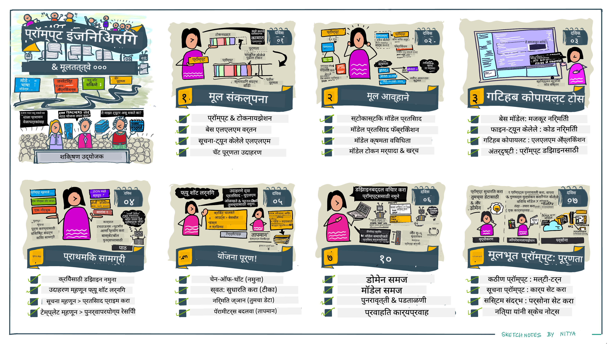
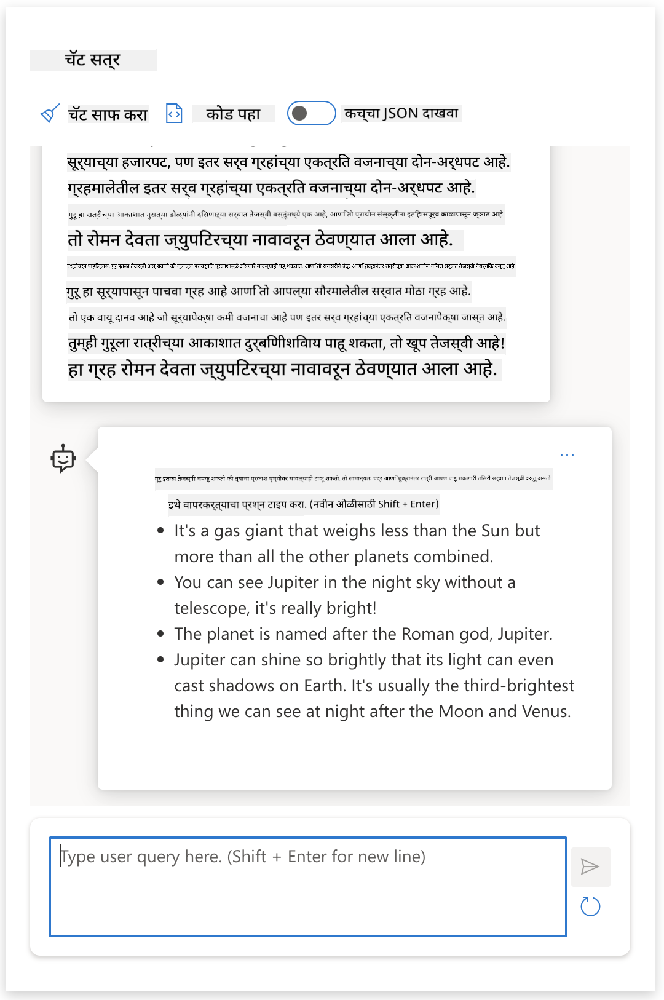

<!--
CO_OP_TRANSLATOR_METADATA:
{
  "original_hash": "dcbaaae026cb50fee071e690685b5843",
  "translation_date": "2025-08-26T15:47:10+00:00",
  "source_file": "04-prompt-engineering-fundamentals/README.md",
  "language_code": "mr"
}
-->
# प्रॉम्प्ट इंजिनिअरिंग मूलतत्त्वे

[](https://aka.ms/gen-ai-lesson4-gh?WT.mc_id=academic-105485-koreyst)

## परिचय
या मॉड्यूलमध्ये जनरेटिव्ह AI मॉडेल्ससाठी प्रभावी प्रॉम्प्ट तयार करण्यासाठी आवश्यक संकल्पना आणि तंत्रांचा समावेश आहे. तुम्ही LLM ला पाठवणारा प्रॉम्प्ट कसा लिहिता हे देखील महत्त्वाचे आहे. काळजीपूर्वक तयार केलेला प्रॉम्प्ट उत्तम दर्जाचा प्रतिसाद मिळवू शकतो. पण नेमके _प्रॉम्प्ट_ आणि _प्रॉम्प्ट इंजिनिअरिंग_ या संज्ञा म्हणजे काय? आणि मी LLM ला पाठवणाऱ्या प्रॉम्प्ट _इनपुट_ मध्ये सुधारणा कशी करू शकतो? या आणि पुढील अध्यायात आपण या प्रश्नांची उत्तरे शोधणार आहोत.

_जनरेटिव्ह AI_ वापरकर्त्याच्या विनंतीनुसार नवीन मजकूर, प्रतिमा, ऑडिओ, कोड इ. तयार करू शकते. हे OpenAI च्या GPT ("Generative Pre-trained Transformer") मालिकेसारख्या _Large Language Models_ वापरून साध्य केले जाते, जे नैसर्गिक भाषा आणि कोड वापरण्यासाठी प्रशिक्षित केलेले असतात.

वापरकर्ते आता चॅटसारख्या परिचित पद्धतींनी या मॉडेल्सशी संवाद साधू शकतात, त्यासाठी कोणतीही तांत्रिक कौशल्ये किंवा प्रशिक्षण आवश्यक नाही. हे मॉडेल्स _प्रॉम्प्ट-आधारित_ आहेत - वापरकर्ता मजकूर इनपुट (प्रॉम्प्ट) पाठवतो आणि AI कडून प्रतिसाद (completion) मिळतो. वापरकर्ता मग "AI सोबत चॅट" करू शकतो, अनेक टप्प्यांमध्ये प्रॉम्प्ट सुधारू शकतो, जोपर्यंत अपेक्षित प्रतिसाद मिळत नाही.

"प्रॉम्प्ट" आता जनरेटिव्ह AI अ‍ॅप्ससाठी मुख्य _प्रोग्रामिंग इंटरफेस_ बनले आहेत, जे मॉडेल्सना काय करायचे ते सांगतात आणि मिळणाऱ्या प्रतिसादाच्या गुणवत्तेवर परिणाम करतात. "प्रॉम्प्ट इंजिनिअरिंग" हे वेगाने वाढणारे क्षेत्र आहे, जे मोठ्या प्रमाणावर सातत्यपूर्ण आणि दर्जेदार प्रतिसाद मिळवण्यासाठी प्रॉम्प्टच्या _डिझाइन आणि ऑप्टिमायझेशन_ वर लक्ष केंद्रित करते.

## शिकण्याची उद्दिष्टे

या धड्यात आपण प्रॉम्प्ट इंजिनिअरिंग म्हणजे काय, ते का महत्त्वाचे आहे, आणि दिलेल्या मॉडेल व अ‍ॅप्लिकेशनच्या उद्दिष्टासाठी अधिक प्रभावी प्रॉम्प्ट कसे तयार करायचे हे शिकणार आहोत. आपण प्रॉम्प्ट इंजिनिअरिंगसाठी मुख्य संकल्पना आणि सर्वोत्तम पद्धती समजून घेऊ - आणि एक इंटरॅक्टिव्ह Jupyter Notebooks "sandbox" वातावरणाबद्दल जाणून घेऊ, जिथे आपण या संकल्पना प्रत्यक्ष उदाहरणांवर लागू झालेल्या पाहू शकतो.

या धड्याच्या शेवटी आपण हे करू शकू:

1. प्रॉम्प्ट इंजिनिअरिंग म्हणजे काय आणि ते का महत्त्वाचे आहे हे स्पष्टपणे सांगता येईल.
2. प्रॉम्प्टचे घटक आणि त्यांचा वापर कसा केला जातो हे सांगता येईल.
3. प्रॉम्प्ट इंजिनिअरिंगसाठी सर्वोत्तम पद्धती आणि तंत्रे शिकता येतील.
4. शिकलेल्या तंत्रांचा वापर प्रत्यक्ष उदाहरणांवर करता येईल, OpenAI endpoint वापरून.

## मुख्य संज्ञा

Prompt Engineering: AI मॉडेल्सना अपेक्षित आउटपुट मिळवण्यासाठी इनपुट्स डिझाइन आणि सुधारण्याची प्रक्रिया.
Tokenization: मजकूराचे छोटे घटक, म्हणजे टोकन्स, मध्ये रूपांतर करण्याची प्रक्रिया, जे मॉडेल समजू आणि प्रक्रिया करू शकते.
Instruction-Tuned LLMs: मोठ्या भाषा मॉडेल्स (LLMs) जे विशिष्ट सूचनांसह अधिक अचूक आणि संबंधित प्रतिसाद मिळवण्यासाठी फाइन-ट्यून केलेले असतात.

## Learning Sandbox

प्रॉम्प्ट इंजिनिअरिंग सध्या विज्ञानापेक्षा कला आहे. यासाठी आपली समज वाढवण्याचा सर्वोत्तम मार्ग म्हणजे _जास्त सराव_ करणे आणि प्रयत्न-चूक पद्धतीने डोमेन कौशल्य, शिफारस केलेली तंत्रे आणि मॉडेल-विशिष्ट ऑप्टिमायझेशन एकत्र करणे.

या धड्यासोबतचा Jupyter Notebook तुम्हाला एक _sandbox_ वातावरण पुरवतो, जिथे तुम्ही शिकलेले ताबडतोब वापरून पाहू शकता - शिकताना किंवा शेवटी दिलेल्या code challenge मध्ये. हे एक्सरसाइज चालवण्यासाठी तुम्हाला लागेल:

1. **Azure OpenAI API key** - डिप्लॉय केलेल्या LLM साठी सर्व्हिस endpoint.
2. **Python Runtime** - ज्यात Notebook चालवता येईल.
3. **Local Env Variables** - _[SETUP](./../00-course-setup/02-setup-local.md?WT.mc_id=academic-105485-koreyst) मधील स्टेप्स पूर्ण करा आणि तयार व्हा_.

Notebook मध्ये _starter_ एक्सरसाइजेस दिल्या आहेत - पण तुम्ही स्वतःची _Markdown_ (वर्णन) आणि _Code_ (प्रॉम्प्ट विनंती) विभाग जोडू शकता, अधिक उदाहरणे किंवा कल्पना वापरून पाहू शकता - आणि प्रॉम्प्ट डिझाइनसाठी तुमची समज वाढवू शकता.

## चित्रमय मार्गदर्शक

या धड्यात काय समाविष्ट आहे हे आधीच मोठ्या चित्रात पाहायचे आहे? हा चित्रमय मार्गदर्शक पाहा, ज्यात मुख्य विषय आणि प्रत्येकात विचार करण्यासारखी महत्त्वाची मुद्दे दिली आहेत. धड्याचा रोडमॅप तुम्हाला मुख्य संकल्पना आणि आव्हाने समजावून सांगतो, आणि त्यांना संबंधित प्रॉम्प्ट इंजिनिअरिंग तंत्रे व सर्वोत्तम पद्धतींनी कसे हाताळायचे हे दाखवतो. लक्षात ठेवा, या मार्गदर्शकातील "Advanced Techniques" विभाग पुढील अध्यायात समाविष्ट केलेल्या विषयांना संदर्भित करतो.



## आमचा स्टार्टअप

आता, _हा विषय_ आपल्या स्टार्टअपच्या [शिक्षण क्षेत्रात AI नवकल्पना आणण्याच्या](https://educationblog.microsoft.com/2023/06/collaborating-to-bring-ai-innovation-to-education?WT.mc_id=academic-105485-koreyst) मिशनशी कसा संबंधित आहे ते पाहूया. आम्हाला _personalized learning_ साठी AI-आधारित अ‍ॅप्लिकेशन्स तयार करायच्या आहेत - तर आपल्या अ‍ॅप्लिकेशनचे वेगवेगळे वापरकर्ते प्रॉम्प्ट कसे "डिझाइन" करतील हे विचार करूया:

- **प्रशासक** AI ला _पाठ्यक्रमातील डेटा विश्लेषण करून कव्हरेजमधील गॅप्स ओळखायला_ सांगू शकतात. AI निकाल संक्षिप्तपणे सांगू शकते किंवा कोड वापरून त्याचे व्हिज्युअलायझेशन करू शकते.
- **शिक्षक** AI ला _ठराविक प्रेक्षक आणि विषयासाठी धडा योजना तयार करायला_ सांगू शकतात. AI दिलेल्या फॉरमॅटमध्ये वैयक्तिकृत योजना तयार करू शकते.
- **विद्यार्थी** AI ला _कठीण विषयात मार्गदर्शन करायला_ सांगू शकतात. AI आता विद्यार्थ्यांना त्यांच्या पातळीला अनुरूप धडे, हिंट्स आणि उदाहरणे देऊन मार्गदर्शन करू शकते.

हे तर फक्त सुरुवात आहे. [Prompts For Education](https://github.com/microsoft/prompts-for-edu/tree/main?WT.mc_id=academic-105485-koreyst) - शिक्षण तज्ञांनी तयार केलेली ओपन-सोर्स प्रॉम्प्ट्स लायब्ररी - पाहा, आणि शक्यतांचा मोठा आवाका समजून घ्या! _या प्रॉम्प्ट्स sandbox मध्ये किंवा OpenAI Playground मध्ये चालवून पाहा आणि काय होते ते बघा!_

<!--
LESSON TEMPLATE:
This unit should cover core concept #1.
Reinforce the concept with examples and references.

CONCEPT #1:
Prompt Engineering.
Define it and explain why it is needed.
-->

## प्रॉम्प्ट इंजिनिअरिंग म्हणजे काय?

आपण या धड्याची सुरुवात **Prompt Engineering** ही प्रक्रिया म्हणजे _टेक्स्ट इनपुट्स (प्रॉम्प्ट्स) डिझाइन आणि ऑप्टिमाइझ_ करून दिलेल्या अ‍ॅप्लिकेशनच्या उद्दिष्टासाठी सातत्यपूर्ण आणि दर्जेदार प्रतिसाद (completions) मिळवणे, असे सांगून केली. आपण हे दोन टप्प्यांमध्ये पाहू शकतो:

- दिलेल्या मॉडेल आणि उद्दिष्टासाठी सुरुवातीचा प्रॉम्प्ट _डिझाइन_ करणे
- प्रतिसादाची गुणवत्ता सुधारण्यासाठी प्रॉम्प्ट _पुनःपुन्हा सुधारणे_

हे एक प्रयत्न-चूक प्रक्रिया आहे, ज्यासाठी वापरकर्त्याची समज आणि मेहनत आवश्यक असते, जेणेकरून उत्तम परिणाम मिळवता येतील. मग हे महत्त्वाचे का आहे? हे समजण्यासाठी आपल्याला तीन संकल्पना समजून घ्याव्या लागतील:

- _Tokenization_ = मॉडेल प्रॉम्प्ट कसे "पाहते"
- _Base LLMs_ = फाउंडेशन मॉडेल प्रॉम्प्ट कसे "प्रक्रिया" करते
- _Instruction-Tuned LLMs_ = मॉडेल आता "tasks" कसे पाहू शकते

### Tokenization

LLM प्रॉम्प्ट्सना _टोकन्सच्या अनुक्रम_ म्हणून पाहते, जिथे वेगवेगळ्या मॉडेल्स (किंवा त्याच्या आवृत्त्या) एकाच प्रॉम्प्टला वेगवेगळ्या पद्धतीने tokenize करू शकतात. कारण LLMs टोकन्सवर प्रशिक्षित केलेले असतात (कच्च्या मजकूरावर नाही), प्रॉम्प्ट कसे tokenize होते याचा थेट परिणाम तयार होणाऱ्या प्रतिसादाच्या गुणवत्तेवर होतो.

Tokenization कसे काम करते याची समज मिळवण्यासाठी [OpenAI Tokenizer](https://platform.openai.com/tokenizer?WT.mc_id=academic-105485-koreyst) सारखी साधने वापरून पाहा. तुमचा प्रॉम्प्ट कॉपी करा - आणि तो टोकन्समध्ये कसा रूपांतरित होतो ते पाहा, विशेषतः व्हाईटस्पेस आणि पंक्च्युएशन कसे हाताळले जाते ते बघा. लक्षात ठेवा, हे उदाहरण जुन्या LLM (GPT-3) साठी आहे - त्यामुळे नवीन मॉडेल वापरल्यास वेगळा परिणाम मिळू शकतो.


### संकल्पना: फाउंडेशन मॉडेल्स

प्रॉम्प्ट tokenize झाल्यावर ["Base LLM"](https://blog.gopenai.com/an-introduction-to-base-and-instruction-tuned-large-language-models-8de102c785a6?WT.mc_id=academic-105485-koreyst) (किंवा Foundation model) चे मुख्य कार्य म्हणजे त्या अनुक्रमातील पुढील टोकनची भविष्यवाणी करणे. LLMs मोठ्या मजकूर डेटासेट्सवर प्रशिक्षित असल्यामुळे, त्यांना टोकन्समधील सांख्यिकीय संबंधांची चांगली समज असते आणि ते ही भविष्यवाणी आत्मविश्वासाने करू शकतात. लक्षात ठेवा, त्यांना प्रॉम्प्टमधील शब्दांचा _अर्थ_ समजत नाही; ते फक्त पॅटर्न पाहतात आणि पुढील टोकन "complete" करतात. ते वापरकर्त्याच्या हस्तक्षेपाने किंवा पूर्वनिर्धारित अटीने थांबवले जाईपर्यंत अनुक्रमाची भविष्यवाणी करत राहू शकतात.

प्रॉम्प्ट-आधारित completion कसे काम करते हे पाहायचे आहे? वरील प्रॉम्प्ट Azure OpenAI Studio च्या [_Chat Playground_](https://oai.azure.com/playground?WT.mc_id=academic-105485-koreyst) मध्ये default सेटिंग्ससह टाका. सिस्टम प्रॉम्प्ट्सना माहितीच्या विनंती म्हणून वागवते - त्यामुळे तुम्हाला त्या संदर्भात समाधानकारक completion दिसेल.

पण वापरकर्त्याला काही विशिष्ट निकष किंवा task objective पूर्ण करणारे काही पाहायचे असेल तर? इथेच _instruction-tuned_ LLMs उपयोगी पडतात.


### संकल्पना: Instruction Tuned LLMs

[Instruction Tuned LLM](https://blog.gopenai.com/an-introduction-to-base-and-instruction-tuned-large-language-models-8de102c785a6?WT.mc_id=academic-105485-koreyst) फाउंडेशन मॉडेलपासून सुरुवात करून त्याला उदाहरणे किंवा इनपुट/आउटपुट जोड्या (जसे, मल्टी-टर्न "messages") देऊन फाइन-ट्यून केले जाते, ज्यात स्पष्ट सूचना असतात - आणि AI त्यानुसार प्रतिसाद देण्याचा प्रयत्न करते.

यासाठी Reinforcement Learning with Human Feedback (RLHF) सारखी तंत्रे वापरली जातात, ज्यामुळे मॉडेल _सूचना पाळायला_ आणि _feedback मधून शिकायला_ शिकते, त्यामुळे ते अधिक उपयुक्त आणि वापरकर्त्याच्या उद्दिष्टाशी संबंधित प्रतिसाद तयार करते.

चला वापरून पाहूया - वरील प्रॉम्प्ट पुन्हा वापरा, पण आता _system message_ मध्ये खालील सूचना द्या:

> _तुम्हाला दिलेल्या मजकुराचा दुसरीच्या विद्यार्थ्यासाठी सारांश तयार करा. निकाल एका परिच्छेदात ठेवा आणि ३-५ बुलेट पॉइंट्स द्या._

पहा, आता निकाल अपेक्षित उद्दिष्ट आणि फॉरमॅटला अनुरूप आहे का? शिक्षक आता हा प्रतिसाद थेट त्यांच्या वर्गासाठी स्लाइड्समध्ये वापरू शकतात.



## प्रॉम्प्ट इंजिनिअरिंग का आवश्यक आहे?

आता आपल्याला प्रॉम्प्ट्स LLMs कसे process करतात हे कळले, तर _प्रॉम्प्ट इंजिनिअरिंग का आवश्यक आहे_ हे पाहूया. कारण सध्याच्या LLMs मध्ये अनेक आव्हाने आहेत, ज्यामुळे _विश्वसनीय आणि सातत्यपूर्ण completions_ मिळवणे कठीण होते, जर प्रॉम्प्ट तयार करण्यात आणि ऑप्टिमायझेशनमध्ये प्रयत्न न केला तर. उदाहरणार्थ:

1. **मॉडेलचे प्रतिसाद stochastic असतात.** _एकच प्रॉम्प्ट_ वेगवेगळ्या मॉडेल्स किंवा त्याच्या आवृत्त्यांमध्ये वेगवेगळे प्रतिसाद देईल. आणि कधी कधी _एकाच मॉडेल_ मध्येही वेगवेगळ्या वेळी वेगळे परिणाम मिळू शकतात. _प्रॉम्प्ट इंजिनिअरिंग तंत्रे या फरकांना कमी करण्यात मदत करतात, चांगले guardrails देतात_.

1. **मॉडेल्स चुकीचे प्रतिसाद तयार करू शकतात.** मॉडेल्स मोठ्या पण मर्यादित डेटासेटवर प्रशिक्षित असतात, त्यामुळे त्यांना त्या प्रशिक्षणाच्या बाहेरील संकल्पनांची माहिती नसते. त्यामुळे ते चुकीचे, काल्पनिक किंवा ज्ञात तथ्यांना विरोधी completions तयार करू शकतात. _प्रॉम्प्ट इंजिनिअरिंग तंत्रे वापरकर्त्यांना अशा fabrication ओळखण्यात आणि कमी करण्यात मदत करतात, जसे AI ला citations किंवा reasoning विचारणे_.

1. **मॉडेल्सची क्षमता वेगळी असेल.** नवीन मॉडेल्स किंवा त्याच्या पिढ्या अधिक क्षमता आणतील, पण त्यासोबत वेगळ्या quirks आणि खर्च/कॉम्प्लेक्सिटीचे tradeoffs येतील. _प्रॉम्प्ट इंजिनिअरिंगमुळे आपण सर्वोत्तम पद्धती आणि workflows तयार करू शकतो, जे फरक abstract करतात आणि मॉडेल-विशिष्ट गरजांना स्केलेबल, seamless पद्धतीने adapt करतात_.

हे OpenAI किंवा Azure OpenAI Playground मध्ये प्रत्यक्ष पाहूया:

- एकाच प्रॉम्प्ट वेगवेगळ्या LLM deployments (उदा. OpenAI, Azure OpenAI, Hugging Face) मध्ये वापरा - फरक दिसला का?
- एकाच प्रॉम्प्ट _एकाच_ LLM deployment मध्ये वारंवार वापरा (उदा. Azure OpenAI playground) - या फरकात काय बदल दिसला?

### Fabrications उदाहरण

या कोर्समध्ये आपण **"fabrication"** ही संज्ञा वापरतो, जेव्हा LLMs त्यांच्या प्रशिक्षणातील मर्यादा किंवा इतर constraints मुळे कधी कधी तथ्यात्मकदृष्ट्या चुकीची माहिती तयार करतात. तुम्ही हे _"hallucinations"_ म्हणूनही ऐकले असेल, पण आम्ही _"fabrication"_ ही संज्ञा वापरण्याची शिफारस करतो, जेणेकरून आपण मशीनच्या वर्तनाला मानवी गुणधर्म देण्याची चूक टाळू. हे [Responsible AI guidelines](https://www.microsoft.com/ai/responsible-ai?WT.mc_id=academic-105485-koreyst) च्या दृष्टीनेही योग्य आहे, कारण काही संदर्भात offensive किंवा non-inclusive संज्ञा टाळता येतात.

Fabrications कसे काम करतात हे पाहायचे आहे? असा प्रॉम्प्ट विचार करा
2076 मधील मंगळ ग्रहावरील युद्धावर धडा योजना

# उद्दिष्टे
- विद्यार्थ्यांना 2076 मधील मंगळ ग्रहावरील युद्धाची पार्श्वभूमी समजावून सांगणे
- युद्धाचे मुख्य कारणे, घडामोडी आणि परिणाम यांचा अभ्यास करणे
- विद्यार्थ्यांना युद्धाच्या ऐतिहासिक महत्त्वाची जाणीव करून देणे

# परिचय
2076 मध्ये मंगळ ग्रहावर मानव आणि रोबोटिक वसाहतींमध्ये मोठे युद्ध झाले. या युद्धाने अंतराळातील राजकारण, तंत्रज्ञान आणि मानवतेच्या भवितव्यावर मोठा प्रभाव टाकला.

## मुख्य मुद्दे
- मंगळ ग्रहावरील वसाहतींची स्थापना आणि वाढ
- पृथ्वी आणि मंगळ यांच्यातील तणावाची कारणे
- युद्धाची सुरुवात: प्रमुख घटना आणि नेते
- तंत्रज्ञानाचा वापर: शस्त्रास्त्रे, संरक्षण यंत्रणा, आणि कृत्रिम बुद्धिमत्ता
- युद्धाचे परिणाम: सामाजिक, आर्थिक आणि राजकीय बदल

# क्रियाकलाप
1. **गट चर्चा:** विद्यार्थ्यांनी युद्धाची कारणे आणि परिणाम यावर चर्चा करावी.
2. **नकाशा तयार करणे:** मंगळ ग्रहावरील प्रमुख युद्धस्थळे दर्शवणारा नकाशा तयार करावा.
3. **भूमिका निभावणे:** काही विद्यार्थी युद्धातील प्रमुख नेत्यांची भूमिका साकारतील.
4. **प्रश्नोत्तरे:** शिक्षक विद्यार्थ्यांना युद्धाशी संबंधित प्रश्न विचारतील.

# मूल्यांकन
- गट चर्चेत सहभाग
- नकाशा आणि भूमिका निभावण्याची गुणवत्ता
- प्रश्नोत्तर सत्रातील उत्तरांची अचूकता

# गृहपाठ
- 2076 मधील मंगळ ग्रहावरील युद्धावर 300 शब्दांचे निबंध लिहा.
- युद्धानंतर मंगळ ग्रहावर झालेल्या बदलांचा अभ्यास करा.

# निष्कर्ष
या धड्यातून विद्यार्थ्यांना 2076 मधील मंगळ ग्रहावरील युद्धाची सखोल माहिती मिळेल आणि त्याचा मानवजातीवर झालेला परिणाम समजेल.
वेब शोधातून मला कळले की मंगळ ग्रहावरील युद्धांवर काल्पनिक कथा (उदा. टीव्ही मालिका किंवा पुस्तके) आहेत - पण 2076 मध्ये काहीच नाही. सामान्य बुद्धी सांगते की 2076 हे _भविष्यातील_ वर्ष आहे, त्यामुळे ते प्रत्यक्ष घडलेल्या घटनेशी जोडता येत नाही.

तर वेगवेगळ्या LLM प्रदात्यांसह हा प्रॉम्प्ट चालवला तर काय होते?

> **Response 1**: OpenAI Playground (GPT-35)


> **Response 2**: Azure OpenAI Playground (GPT-35)


> **Response 3**: : Hugging Face Chat Playground (LLama-2)


अपेक्षेप्रमाणे, प्रत्येक मॉडेल (किंवा त्याची आवृत्ती) थोड्या वेगळ्या प्रतिक्रिया देते, कारण stochastic वर्तन आणि मॉडेल क्षमतेतील फरक. उदाहरणार्थ, एक मॉडेल आठवीच्या विद्यार्थ्यांसाठी लिहिते, तर दुसरे उच्च माध्यमिक विद्यार्थ्यांसाठी. पण तिन्ही मॉडेल्सनी अशा प्रतिक्रिया दिल्या ज्या अनभिज्ञ वापरकर्त्याला ही घटना खरी वाटू शकते.

प्रॉम्प्ट इंजिनिअरिंगमधील तंत्रे जसे की _मेटाप्रॉम्प्टिंग_ आणि _टेम्परेचर कॉन्फिगरेशन_ काही प्रमाणात मॉडेलच्या काल्पनिक उत्तरांना आळा घालू शकतात. नवीन प्रॉम्प्ट इंजिनिअरिंग _आर्किटेक्चर_ देखील नवीन साधने आणि तंत्रे सहजपणे प्रॉम्प्ट फ्लोमध्ये समाविष्ट करतात, जेणेकरून अशा परिणामांना कमी करता येईल.

## केस स्टडी: GitHub Copilot

या विभागाचा शेवट आपण प्रत्यक्षात प्रॉम्प्ट इंजिनिअरिंग कसा वापरला जातो हे पाहून करूया, एका केस स्टडीद्वारे: [GitHub Copilot](https://github.com/features/copilot?WT.mc_id=academic-105485-koreyst).

GitHub Copilot हा तुमचा "AI Pair Programmer" आहे - तो मजकूर प्रॉम्प्ट्सना कोड पूर्णत्वात रूपांतरित करतो आणि तुमच्या विकासाच्या वातावरणात (उदा. Visual Studio Code) समाकलित केला जातो, जेणेकरून वापरकर्ता अनुभव सुलभ होतो. खालील ब्लॉग मालिकेत दाखवल्याप्रमाणे, सुरुवातीची आवृत्ती OpenAI Codex मॉडेलवर आधारित होती - पण इंजिनिअर्सना लवकरच मॉडेलला फाइन-ट्यून करण्याची आणि उत्तम प्रॉम्प्ट इंजिनिअरिंग तंत्रे विकसित करण्याची गरज जाणवली, जेणेकरून कोडची गुणवत्ता सुधारता येईल. जुलैमध्ये त्यांनी [Codex पेक्षा पुढे जाणारे सुधारित AI मॉडेल सादर केले](https://github.blog/2023-07-28-smarter-more-efficient-coding-github-copilot-goes-beyond-codex-with-improved-ai-model/?WT.mc_id=academic-105485-koreyst) जे आणखी वेगवान सूचना देते.

त्यांचा शिकण्याचा प्रवास समजून घेण्यासाठी हे पोस्ट्स क्रमाने वाचा.

- **मे 2023** | [GitHub Copilot तुमचा कोड समजण्यात अधिक चांगला होत आहे](https://github.blog/2023-05-17-how-github-copilot-is-getting-better-at-understanding-your-code/?WT.mc_id=academic-105485-koreyst)
- **मे 2023** | [GitHub मध्ये: GitHub Copilot मागील LLMs सोबत काम करणे](https://github.blog/2023-05-17-inside-github-working-with-the-llms-behind-github-copilot/?WT.mc_id=academic-105485-koreyst).
- **जून 2023** | [GitHub Copilot साठी उत्तम प्रॉम्प्ट्स कसे लिहावेत](https://github.blog/2023-06-20-how-to-write-better-prompts-for-github-copilot/?WT.mc_id=academic-105485-koreyst).
- **जुलै 2023** | [.. GitHub Copilot सुधारित AI मॉडेलसह Codex पेक्षा पुढे जातो](https://github.blog/2023-07-28-smarter-more-efficient-coding-github-copilot-goes-beyond-codex-with-improved-ai-model/?WT.mc_id=academic-105485-koreyst)
- **जुलै 2023** | [डेव्हलपरसाठी प्रॉम्प्ट इंजिनिअरिंग आणि LLMs मार्गदर्शिका](https://github.blog/2023-07-17-prompt-engineering-guide-generative-ai-llms/?WT.mc_id=academic-105485-koreyst)
- **सप्टेंबर 2023** | [एंटरप्राइज LLM अ‍ॅप कसे तयार करावे: GitHub Copilot मधून धडे](https://github.blog/2023-09-06-how-to-build-an-enterprise-llm-application-lessons-from-github-copilot/?WT.mc_id=academic-105485-koreyst)

त्यांचा [Engineering blog](https://github.blog/category/engineering/?WT.mc_id=academic-105485-koreyst) देखील वाचू शकता, जसे की [हे पोस्ट](https://github.blog/2023-09-27-how-i-used-github-copilot-chat-to-build-a-reactjs-gallery-prototype/?WT.mc_id=academic-105485-koreyst) जे दाखवते की हे मॉडेल्स आणि तंत्रे प्रत्यक्षात कशी वापरली जातात.

---

<!--
पाठाचा साचा:
हा युनिट मुख्य संकल्पना #2 कव्हर करेल.
उदाहरणे आणि संदर्भांसह संकल्पना स्पष्ट करा.

संकल्पना #2:
प्रॉम्प्ट डिझाइन.
उदाहरणांसह स्पष्ट केलेले.
-->

## प्रॉम्प्ट बांधणी

आपण पाहिले की प्रॉम्प्ट इंजिनिअरिंग का महत्त्वाचे आहे - आता पाहूया की प्रॉम्प्ट्स _कसे तयार केले जातात_, जेणेकरून वेगवेगळ्या तंत्रांचा अभ्यास करून अधिक प्रभावी प्रॉम्प्ट डिझाइन करता येईल.

### बेसिक प्रॉम्प्ट

सुरुवात करूया बेसिक प्रॉम्प्टपासून: मॉडेलला पाठवलेला साधा मजकूर, कोणताही अतिरिक्त संदर्भ नाही. उदाहरणार्थ - जेव्हा आपण अमेरिकेच्या राष्ट्रीय गीताची सुरुवातीची काही शब्दे OpenAI [Completion API](https://platform.openai.com/docs/api-reference/completions?WT.mc_id=academic-105485-koreyst) ला पाठवतो, तेव्हा ते लगेच पुढील ओळी पूर्ण करते, ज्यातून बेसिक अंदाज वर्तन दिसून येते.

| प्रॉम्प्ट (इनपुट)     | पूर्णत्व (आउटपुट)                                                                                                                        |
| :----------------- | :----------------------------------------------------------------------------------------------------------------------------------------- |
| Oh say can you see | असे वाटते की तुम्ही "The Star-Spangled Banner" या अमेरिकेच्या राष्ट्रीय गीताची सुरुवात करत आहात. संपूर्ण गीत असे आहे ... |

### क्लिष्ट प्रॉम्प्ट

आता त्या बेसिक प्रॉम्प्टमध्ये संदर्भ आणि सूचना जोडूया. [Chat Completion API](https://learn.microsoft.com/azure/ai-services/openai/how-to/chatgpt?WT.mc_id=academic-105485-koreyst) आपल्याला क्लिष्ट प्रॉम्प्ट तयार करण्याची सुविधा देते, ज्यात _messages_ चा संग्रह असतो:

- इनपुट/आउटपुट जोड्या, ज्या _user_ चा इनपुट आणि _assistant_ चा प्रतिसाद दर्शवतात.
- System message, जो assistant च्या वर्तनाचा किंवा व्यक्तिमत्वाचा संदर्भ सेट करतो.

आता विनंती खालील स्वरूपात आहे, जिथे _tokenization_ संदर्भ आणि संभाषणातील संबंधित माहिती पकडते. आता, system संदर्भ बदलल्यास पूर्णत्वाच्या गुणवत्तेवर तितकाच परिणाम होतो, जितका वापरकर्त्याच्या इनपुटवर.

```python
response = openai.chat.completions.create(
    model="gpt-3.5-turbo",
    messages=[
        {"role": "system", "content": "You are a helpful assistant."},
        {"role": "user", "content": "Who won the world series in 2020?"},
        {"role": "assistant", "content": "The Los Angeles Dodgers won the World Series in 2020."},
        {"role": "user", "content": "Where was it played?"}
    ]
)
```

### सूचना प्रॉम्प्ट

वरील उदाहरणांमध्ये, वापरकर्त्याचा प्रॉम्प्ट साधा मजकूर होता, जो माहितीची विनंती म्हणून समजला जाऊ शकतो. _सूचना_ प्रॉम्प्ट्समध्ये, आपण त्या मजकुराचा वापर अधिक तपशीलवार कार्य सांगण्यासाठी करू शकतो, जेणेकरून AI ला अधिक चांगले मार्गदर्शन मिळेल. उदाहरण:

| प्रॉम्प्ट (इनपुट)                                                                                                                                                                                                                         | पूर्णत्व (आउटपुट)                                                                                                        | सूचना प्रकार    |
| :------------------------------------------------------------------------------------------------------------------------------------------------------------------------------------------------------------------------------------- | :------------------------------------------------------------------------------------------------------------------------- | :------------------ |
| Write a description of the Civil War                                                                                                                                                                                                   | _सोप्या परिच्छेदात उत्तर दिले_                                                                                              | साधे              |
| Write a description of the Civil War. Provide key dates and events and describe their significance                                                                                                                                     | _परिच्छेदानंतर महत्वाच्या घटना आणि तारीख यांची यादी दिली_                                             | क्लिष्ट             |
| Write a description of the Civil War in 1 paragraph. Provide 3 bullet points with key dates and their significance. Provide 3 more bullet points with key historical figures and their contributions. Return the output as a JSON file | _अधिक तपशीलवार माहिती दिली, जी JSON स्वरूपात आहे आणि फाईलमध्ये कॉपी-पेस्ट करता येईल_ | क्लिष्ट. स्वरूपित. |

## मुख्य सामग्री

वरील उदाहरणांमध्ये, प्रॉम्प्ट अजूनही खुले होते, त्यामुळे LLM ला त्याच्या प्री-ट्रेंड डेटासेटमधून काय संबंधित आहे हे ठरवता येत होते. _मुख्य सामग्री_ डिझाइन पॅटर्नमध्ये, इनपुट मजकूर दोन भागांत विभागला जातो:

- एक सूचना (action)
- संबंधित सामग्री (जी कृतीवर परिणाम करते)

उदाहरणार्थ, सूचना आहे "हे दोन वाक्यांत संक्षिप्त करा".

| प्रॉम्प्ट (इनपुट)                                                                                                                                                                                                                                                                                                                                                                                                                                                                                                                                                                                                                                                                                      | पूर्णत्व (आउटपुट)                                                                                                                                                                                                                                                                             |
| :-------------------------------------------------------------------------------------------------------------------------------------------------------------------------------------------------------------------------------------------------------------------------------------------------------------------------------------------------------------------------------------------------------------------------------------------------------------------------------------------------------------------------------------------------------------------------------------------------------------------------------------------------------------------------------------------------- | :---------------------------------------------------------------------------------------------------------------------------------------------------------------------------------------------------------------------------------------------------------------------------------------------- |
| Jupiter is the fifth planet from the Sun and the largest in the Solar System. It is a gas giant with a mass one-thousandth that of the Sun, but two-and-a-half times that of all the other planets in the Solar System combined. Jupiter is one of the brightest objects visible to the naked eye in the night sky, and has been known to ancient civilizations since before recorded history. It is named after the Roman god Jupiter.[19] When viewed from Earth, Jupiter can be bright enough for its reflected light to cast visible shadows,[20] and is on average the third-brightest natural object in the night sky after the Moon and Venus. <br/> **Summarize this in 2 short sentences** | Jupiter, सूर्यापासून पाचवा ग्रह, सौरमालेतील सर्वात मोठा आहे आणि रात्रीच्या आकाशातील सर्वात तेजस्वी वस्तूंमध्ये गणला जातो. रोमन देव Jupiterच्या नावावरून ओळखला जाणारा हा वायूग्रह आहे, ज्याचे वजन सौरमालेतील इतर सर्व ग्रहांच्या एकत्रित वजनाच्या दोन-अडीच पट आहे. |

मुख्य सामग्री विभाग वेगवेगळ्या प्रकारे वापरता येतो, जेणेकरून सूचना अधिक प्रभावीपणे दिल्या जाऊ शकतात:

- **उदाहरणे** - मॉडेलला स्पष्ट सूचना देण्याऐवजी, अपेक्षित आउटपुटची उदाहरणे द्या आणि त्यातून पॅटर्न समजून घेऊ द्या.
- **सूचक संकेत (Cues)** - सूचनानंतर "cue" द्या, जे पूर्णत्वासाठी दिशा दाखवते आणि मॉडेलला अधिक संबंधित प्रतिसाद देण्यास मदत करते.
- **टेम्पलेट्स** - हे पुनरावृत्त 'रेसिपीज' आहेत, ज्यात placeholders (variables) असतात, जे विशिष्ट वापरासाठी डेटा घालून सानुकूल करता येतात.

चला हे प्रत्यक्षात पाहूया.

### उदाहरणांचा वापर

ही अशी पद्धत आहे जिथे तुम्ही मुख्य सामग्रीमध्ये काही अपेक्षित आउटपुटची उदाहरणे देता आणि मॉडेलला त्या पॅटर्ननुसार नवीन आउटपुट तयार करू देता. दिलेल्या उदाहरणांच्या संख्येनुसार, zero-shot, one-shot, few-shot prompting असे प्रकार असू शकतात.

प्रॉम्प्ट आता तीन घटकांचा बनतो:

- कार्याचे वर्णन
- अपेक्षित आउटपुटची काही उदाहरणे
- नवीन उदाहरणाची सुरुवात (जी implicit task description बनते)

| शिकण्याचा प्रकार | प्रॉम्प्ट (इनपुट)                                                                                                                                        | पूर्णत्व (आउटपुट)         |
| :------------ | :---------------------------------------------------------------------------------------------------------------------------------------------------- | :-------------------------- |
| Zero-shot     | "The Sun is Shining". Translate to Spanish                                                                                                            | "El Sol está brillando".    |
| One-shot      | "The Sun is Shining" => ""El Sol está brillando". <br> "It's a Cold and Windy Day" =>                                                                 | "Es un día frío y ventoso". |
| Few-shot      | The player ran the bases => Baseball <br/> The player hit an ace => Tennis <br/> The player hit a six => Cricket <br/> The player made a slam-dunk => | Basketball                  |
|               |                                                                                                                                                       |                             |

लक्षात घ्या, zero-shot मध्ये स्पष्ट सूचना ("Translate to Spanish") द्यावी लागली, पण one-shot मध्ये ती सूचित होते. Few-shot उदाहरणात, अधिक उदाहरणे दिल्याने मॉडेल्सना अधिक अचूक निष्कर्ष काढता येतात, अतिरिक्त सूचना न देता.

### प्रॉम्प्ट संकेत (Cues)

मुख्य सामग्री वापरण्याचा आणखी एक मार्ग म्हणजे उदाहरणे न देता _सूचक संकेत_ देणे. या पद्धतीत, आपण मॉडेलला अपेक्षित प्रतिसादाच्या स्वरूपाची सुरुवात करून "नजाकत" देतो. मॉडेल मग त्या संकेतावरून पुढे प्रतिसाद तयार करते.

| संकेतांची संख्या | प्रॉम्प्ट (इनपुट)                                                                                                                                                                                                                                                                                                                                                                                                                                               | पूर्णत्व (आउटपुट)                                                                                                                                                                                                                                                                                       |
| :------------- | :----------------------------------------------------------------------------------------------------------------------------------------------------------------------------------------------------------------------------------------------------------------------------------------------------------------------------------------------------------------------------------------------------------------------------------------------------------- | :-------------------------------------------------------------------------------------------------------------------------------------------------------------------------------------------------------------------------------------------------------------------------------------------------------- |
| 0              | Jupiter is the fifth planet from the Sun and the largest in the Solar System. It is a gas giant with a mass one-thousandth that of the Sun, but two-and-a-half times that of all the other planets in the Solar System combined. Jupiter is one of the brightest objects visible to the naked eye in the night sky, and has been known to ancient civilizations since before recorded history.

**हे संक्षिप्त करा**                                       | गुरू हा आपल्या सौरमालेतील सर्वात मोठा ग्रह आहे आणि सूर्यापासून पाचवा आहे. हा एक वायूचा महाकाय ग्रह आहे, ज्याचे वस्तुमान सूर्याच्या 1/1000 आहे, पण इतर सर्व ग्रहांच्या एकत्रित वस्तुमानापेक्षा जास्त आहे. प्राचीन संस्कृतींना गुरू ग्रहाची माहिती खूप पूर्वीपासून होती आणि तो रात्रीच्या आकाशात सहज दिसतो. |
| 1              | गुरू हा सूर्यापासून पाचवा आणि सौरमालेतील सर्वात मोठा ग्रह आहे. हा एक वायूचा महाकाय ग्रह आहे, ज्याचे वस्तुमान सूर्याच्या एक हजाराव्या भागाइतके आहे, पण सौरमालेतील इतर सर्व ग्रहांच्या एकत्रित वस्तुमानाच्या दोन-आडी अर्धा पट आहे. गुरू हा रात्रीच्या आकाशात नुसत्या डोळ्यांनी दिसणाऱ्या सर्वात तेजस्वी वस्तूंमध्ये एक आहे, आणि तो प्राचीन काळापासून माणसांना माहिती आहे. <br/>**हे संक्षिप्त करा** <br/> आपण काय शिकलो ते म्हणजे गुरू | सूर्यापासून पाचवा आणि सौरमालेतील सर्वात मोठा ग्रह आहे. हा एक वायूचा महाकाय ग्रह आहे, ज्याचे वस्तुमान सूर्याच्या एक हजाराव्या भागाइतके आहे, पण इतर सर्व ग्रहांच्या एकत्रित वस्तुमानाच्या दोन-आडी अर्धा पट आहे. तो नुसत्या डोळ्यांनी सहज दिसतो आणि प्राचीन काळापासून माणसांना माहिती आहे.                        |
| 2              | गुरू हा सूर्यापासून पाचवा आणि सौरमालेतील सर्वात मोठा ग्रह आहे. हा एक वायूचा महाकाय ग्रह आहे, ज्याचे वस्तुमान सूर्याच्या एक हजाराव्या भागाइतके आहे, पण सौरमालेतील इतर सर्व ग्रहांच्या एकत्रित वस्तुमानाच्या दोन-आडी अर्धा पट आहे. गुरू हा रात्रीच्या आकाशात नुसत्या डोळ्यांनी दिसणाऱ्या सर्वात तेजस्वी वस्तूंमध्ये एक आहे, आणि तो प्राचीन काळापासून माणसांना माहिती आहे. <br/>**हे संक्षिप्त करा** <br/> शिकलोले टॉप ३ तथ्य:         | 1. गुरू हा सूर्यापासून पाचवा आणि सौरमालेतील सर्वात मोठा ग्रह आहे. <br/> 2. हा एक वायूचा महाकाय ग्रह आहे, ज्याचे वस्तुमान सूर्याच्या एक हजाराव्या भागाइतके आहे...<br/> 3. गुरू ग्रह प्राचीन काळापासून नुसत्या डोळ्यांनी दिसतो ...                                                                       |
|                |                                                                                                                                                                                                                                                                                                                                                                                                                                                              |                                                                                                                                                                                                                                                                                                           |

### प्रॉम्प्ट टेम्पलेट्स

प्रॉम्प्ट टेम्पलेट म्हणजे _प्रोम्प्टसाठी पूर्वनिश्चित रेसिपी_ जी साठवून ठेवता येते आणि गरजेनुसार पुन्हा वापरता येते, ज्यामुळे मोठ्या प्रमाणावर वापरकर्त्यांना एकसारखा अनुभव मिळतो. सर्वात सोप्या स्वरूपात, हे फक्त प्रॉम्प्टच्या उदाहरणांचा संग्रह असतो, जसे [OpenAI चे हे उदाहरण](https://platform.openai.com/examples?WT.mc_id=academic-105485-koreyst) ज्यात संवादात्मक प्रॉम्प्ट घटक (वापरकर्ता आणि सिस्टम संदेश) आणि API-आधारित विनंती स्वरूप दिलेले असते - जे पुनर्वापरास मदत करते.

याच्या अधिक क्लिष्ट स्वरूपात, जसे [LangChain चे हे उदाहरण](https://python.langchain.com/docs/concepts/prompt_templates/?WT.mc_id=academic-105485-koreyst), यात _प्लेसहोल्डर्स_ असतात जे विविध स्रोतांमधून (वापरकर्ता इनपुट, सिस्टम संदर्भ, बाह्य डेटा स्रोत इ.) डेटा घेऊन प्रॉम्प्ट डायनॅमिक तयार करू शकतात. यामुळे आपण पुन्हा वापरता येणाऱ्या प्रॉम्प्ट्सची लायब्ररी तयार करू शकतो, जी मोठ्या प्रमाणावर एकसारखा वापरकर्ता अनुभव **प्रोग्रामेटिकली** देऊ शकते.

शेवटी, टेम्पलेट्सचे खरे मूल्य म्हणजे _प्रॉम्प्ट लायब्ररी_ तयार करणे, जिथे प्रॉम्प्ट टेम्पलेट आता विशिष्ट क्षेत्रासाठी _ऑप्टिमाइझ_ केलेले असते, ज्यामुळे त्या क्षेत्रातील वापरकर्त्यांसाठी उत्तरे अधिक संबंधित आणि अचूक होतात. [Prompts For Edu](https://github.com/microsoft/prompts-for-edu?WT.mc_id=academic-105485-koreyst) हे याचे उत्तम उदाहरण आहे, जिथे शिक्षण क्षेत्रासाठी प्रॉम्प्ट्सची लायब्ररी तयार केली आहे, जसे की धडे नियोजन, अभ्यासक्रम डिझाईन, विद्यार्थ्यांना मार्गदर्शन इ.

## सहाय्यक सामग्री

जर आपण प्रॉम्प्ट तयार करणे म्हणजे एक सूचना (कार्य) आणि एक लक्ष्य (मुख्य सामग्री) असे मानले, तर _दुय्यम सामग्री_ म्हणजे आपण **आउटपुटवर परिणाम घडवण्यासाठी** दिलेली अतिरिक्त माहिती. यात ट्यूनिंग पॅरामीटर्स, फॉरमॅटिंग सूचना, विषय वर्गीकरण इ. असू शकतात, जे मॉडेलला त्याचे उत्तर वापरकर्त्याच्या अपेक्षेनुसार _जुळवून घेण्यास_ मदत करतात.

उदाहरणार्थ: जर अभ्यासक्रम सूचीमध्ये सर्व अभ्यासक्रमांची विस्तृत मेटाडेटा (नाव, वर्णन, स्तर, टॅग्ज, शिक्षक इ.) दिली असेल:

- आपण "Fall 2023 साठी अभ्यासक्रम सूचीचे संक्षिप्त वर्णन करा" अशी सूचना देऊ शकतो
- मुख्य सामग्रीमध्ये अपेक्षित आउटपुटची काही उदाहरणे देऊ शकतो
- दुय्यम सामग्रीमध्ये आवडीचे टॉप ५ "टॅग्ज" ओळखू शकतो

आता, मॉडेल दिलेल्या उदाहरणांप्रमाणे संक्षिप्त वर्णन देऊ शकते - पण जर एखाद्या निकालात अनेक टॅग्ज असतील, तर ते दुय्यम सामग्रीत दिलेल्या ५ टॅग्जना प्राधान्य देऊ शकते.

---

<!--
पाठाचा टेम्पलेट:
या युनिटमध्ये मुख्य संकल्पना #1 समाविष्ट असावी.
उदाहरणे आणि संदर्भांसह संकल्पना बळकट करा.

संकल्पना #3:
प्रॉम्प्ट इंजिनिअरिंग तंत्र.
प्रॉम्प्ट इंजिनिअरिंगसाठी काही मूलभूत तंत्रे कोणती?
त्याचे काही सरावांसह स्पष्टीकरण द्या.
-->

## प्रॉम्प्टिंगसाठी सर्वोत्तम पद्धती

आता आपल्याला माहिती आहे की प्रॉम्प्ट्स _कसे तयार करायचे_, आपण आता _डिझाईन_ कसे करायचे याचा विचार करू शकतो, जेणेकरून सर्वोत्तम पद्धतींचा वापर करता येईल. हे दोन भागांत विचारता येईल - योग्य _दृष्टीकोन_ ठेवणे आणि योग्य _तंत्रे_ वापरणे.

### प्रॉम्प्ट इंजिनिअरिंगचा दृष्टीकोन

प्रॉम्प्ट इंजिनिअरिंग हा ट्रायल-एंड-एररचा (प्रयत्न आणि चुका) प्रवास आहे, म्हणून तीन मुख्य गोष्टी लक्षात ठेवा:

1. **क्षेत्राची समज महत्त्वाची आहे.** उत्तराची अचूकता आणि संबंधितता हे त्या _क्षेत्रावर_ अवलंबून असते, जिथे ती अ‍ॅप्लिकेशन किंवा वापरकर्ता कार्यरत असतो. आपली अंतर्दृष्टी आणि क्षेत्रातील तज्ज्ञता वापरून **तंत्रे सानुकूलित** करा. उदाहरणार्थ, आपल्या सिस्टम प्रॉम्प्ट्समध्ये _क्षेत्र-विशिष्ट व्यक्तिमत्वे_ ठरवा, किंवा वापरकर्ता प्रॉम्प्ट्समध्ये _क्षेत्र-विशिष्ट टेम्पलेट्स_ वापरा. दुय्यम सामग्रीमध्ये क्षेत्राशी संबंधित संदर्भ द्या, किंवा _क्षेत्र-विशिष्ट संकेत आणि उदाहरणे_ वापरून मॉडेलला परिचित वापर पद्धतीकडे मार्गदर्शन करा.

2. **मॉडेलची समज महत्त्वाची आहे.** आपल्याला माहिती आहे की मॉडेल्स स्वभावतः यादृच्छिक (stochastic) असतात. पण मॉडेल्सची अंमलबजावणी वेगवेगळ्या प्रशिक्षण डेटासेटवर (पूर्व-प्रशिक्षित ज्ञान), दिलेल्या क्षमतांवर (उदा. API किंवा SDK) आणि ज्या प्रकारच्या सामग्रीसाठी ती ऑप्टिमाइझ केलेली आहे (उदा. कोड, प्रतिमा, मजकूर) यावरही अवलंबून असते. आपण वापरत असलेल्या मॉडेलच्या ताकदी आणि मर्यादा समजून घ्या, आणि त्या ज्ञानाचा वापर _कार्यांना प्राधान्य_ देण्यासाठी किंवा _सानुकूलित टेम्पलेट्स_ तयार करण्यासाठी करा.

3. **पुनरावृत्ती आणि पडताळणी महत्त्वाची आहे.** मॉडेल्स झपाट्याने बदलत आहेत, आणि प्रॉम्प्ट इंजिनिअरिंगची तंत्रेही. एक क्षेत्रतज्ज्ञ म्हणून, आपल्याकडे इतर संदर्भ किंवा निकष असू शकतात जे _आपल्या_ विशिष्ट अ‍ॅप्लिकेशनसाठी लागू असतील, पण सर्वांसाठी नाहीत. प्रॉम्प्ट इंजिनिअरिंगची साधने आणि तंत्रे वापरून प्रॉम्प्ट तयार करणे सुरू करा, मग आपल्या अंतर्दृष्टीने आणि तज्ज्ञतेने निकाल तपासा आणि सुधारित करा. आपले निरीक्षण नोंदवा आणि एक **ज्ञानसंग्रह** (उदा. प्रॉम्प्ट लायब्ररी) तयार करा, जे इतरांसाठी नवीन बेसलाइन म्हणून वापरता येईल, आणि भविष्यात जलद पुनरावृत्ती करता येईल.

## सर्वोत्तम पद्धती

आता आपण [OpenAI](https://help.openai.com/en/articles/6654000-best-practices-for-prompt-engineering-with-openai-api?WT.mc_id=academic-105485-koreyst) आणि [Azure OpenAI](https://learn.microsoft.com/azure/ai-services/openai/concepts/prompt-engineering#best-practices?WT.mc_id=academic-105485-koreyst) तज्ञांनी सुचवलेल्या काही सामान्य सर्वोत्तम पद्धती पाहू.

| काय                              | का                                                                                                                                                                                                                                               |
| :-------------------------------- | :------------------------------------------------------------------------------------------------------------------------------------------------------------------------------------------------------------------------------------------------ |
| नवीनतम मॉडेल्सचे मूल्यांकन करा.       | नवीन मॉडेल्समध्ये सुधारित वैशिष्ट्ये आणि गुणवत्ता असू शकते - पण किंमतही जास्त असू शकते. त्यांचा परिणाम तपासा आणि मग स्थलांतराचा निर्णय घ्या.                                                                                |
| सूचना आणि संदर्भ वेगळे ठेवा   | आपले मॉडेल/प्रोव्हायडर सूचना, मुख्य आणि दुय्यम सामग्री वेगळी करण्यासाठी _डिलिमिटर्स_ वापरते का ते तपासा. यामुळे मॉडेल्सना टोकन्सना योग्य वजन द्यायला मदत होते.                                                         |
| स्पष्ट आणि विशिष्ट रहा             | अपेक्षित संदर्भ, परिणाम, लांबी, फॉरमॅट, शैली इ. बद्दल अधिक तपशील द्या. यामुळे उत्तरे अधिक दर्जेदार आणि एकसारखी मिळतात. रेसिपीज पुन्हा वापरता येतील अशा टेम्पलेट्समध्ये साठवा.                                                          |
| वर्णनात्मक रहा, उदाहरणे द्या      | मॉडेल्सना "दाखवा आणि सांगा" पद्धत अधिक चांगली कळते. सुरुवातीला `zero-shot` पद्धतीने फक्त सूचना द्या (पण उदाहरणे नाहीत), मग `few-shot` म्हणून काही अपेक्षित आउटपुटची उदाहरणे द्या. उपमा वापरा. |
| संकेत वापरा, उत्तराला दिशा द्या | काही सुरुवातीचे शब्द किंवा वाक्यांश द्या, ज्यामुळे मॉडेलला उत्तराची सुरुवात करता येईल.                                                                                                               |
| पुन्हा ठामपणे सांगा                       | कधी कधी मॉडेलला एकाच सूचना पुन्हा द्यावी लागते. मुख्य सामग्रीच्या आधी आणि नंतर सूचना द्या, सूचना आणि संकेत दोन्ही वापरा. पुनरावृत्ती करा आणि काय काम करते ते तपासा.                                                         |
| क्रम महत्त्वाचा                     | आपण माहिती कोणत्या क्रमाने देता हे आउटपुटवर परिणाम करू शकते, अगदी उदाहरणांमध्येही, कारण मॉडेलला अलीकडील माहितीवर जास्त भर असतो. वेगवेगळे पर्याय वापरून काय उत्तम आहे ते पहा.                                                               |
| मॉडेलला "आउट" द्या           | जर कोणत्याही कारणाने कार्य पूर्ण करता आले नाही, तर मॉडेलला _फॉलबॅक_ उत्तर द्या. यामुळे चुकीची किंवा बनावट उत्तरे येण्याची शक्यता कमी होते.                                                         |
|                                   |                                                                                                                                                                                                                                                   |

प्रत्येक सर्वोत्तम पद्धतीप्रमाणे, लक्षात ठेवा की _आपला अनुभव वेगळा असू शकतो_ - हे मॉडेल, कार्य आणि क्षेत्रावर अवलंबून असते. हे सुरुवातीसाठी वापरा, आणि आपल्यासाठी काय उत्तम आहे ते शोधण्यासाठी पुनरावृत्ती करा. नवीन मॉडेल्स आणि साधने उपलब्ध होत असताना, आपल्या प्रॉम्प्ट इंजिनिअरिंग प्रक्रियेचे पुन्हा मूल्यांकन करा, आणि प्रक्रिया स्केलेबिलिटी व उत्तराच्या गुणवत्तेवर लक्ष केंद्रित करा.

<!--
पाठाचा टेम्पलेट:
जर लागू असेल तर कोड चॅलेंज द्या

चॅलेंज:
Jupyter Notebook ला लिंक द्या, ज्यात फक्त कोड कमेंट्समध्ये सूचना आहेत (कोड विभाग रिकामे आहेत).

सोल्यूशन:
त्या Notebook ची एक प्रत द्या, ज्यात प्रॉम्प्ट्स भरलेले आणि चालवलेले आहेत, एक उदाहरण म्हणून.
-->

## असाइनमेंट

अभिनंदन! आपण धड्याच्या शेवटी पोहोचलात! आता या संकल्पना आणि तंत्रांचा वापर प्रत्यक्ष उदाहरणांसह करून पाहूया!

या असाइनमेंटसाठी आपण Jupyter Notebook वापरणार आहोत, ज्यात आपण इंटरॅक्टिव्ह सराव करू शकता. आपण Notebook मध्ये आपले स्वतःचे Markdown आणि Code सेल्स घालून नवीन कल्पना आणि तंत्रेही तपासू शकता.

### सुरुवात करण्यासाठी, रेपो fork करा, मग

- (शिफारस) GitHub Codespaces सुरू करा
- (पर्यायी) रेपो आपल्या स्थानिक डिव्हाइसवर क्लोन करा आणि Docker Desktop वापरा
- (पर्यायी) आपल्याला आवडणाऱ्या Notebook रनटाइममध्ये Notebook उघडा

### पुढे, आपले environment variables सेट करा

- रेपोच्या मूळ फोल्डरमधील `.env.copy` फाइलची प्रत `env` नावाने घ्या आणि `AZURE_OPENAI_API_KEY`, `AZURE_OPENAI_ENDPOINT` आणि `AZURE_OPENAI_DEPLOYMENT` या मूल्यांसह भरा. [Learning Sandbox विभागात](../../../04-prompt-engineering-fundamentals/04-prompt-engineering-fundamentals) परत जा आणि कसे करायचे ते शिका.

### पुढे, Jupyter Notebook उघडा

- रनटाइम कर्नल निवडा. पर्याय 1 किंवा 2 वापरत असल्यास, dev container ने दिलेला default Python 3.10.x कर्नल निवडा.

आता आपण सराव सुरू करू शकता. येथे _योग्य किंवा अयोग्य_ उत्तरे नाहीत - फक्त वेगवेगळे पर्याय तपासून पाहणे आणि कोणत्या मॉडेलसाठी, कोणत्या क्षेत्रासाठी काय काम करते याची अंतर्दृष्टी मिळवणे हेच उद्दिष्ट आहे.

_या कारणासाठी या धड्यात कोड सोल्यूशन विभाग नाही. त्याऐवजी, Notebook मध्ये "My Solution:" नावाचे Markdown सेल्स असतील, ज्यात एक उदाहरण उत्तर दिलेले असेल._

 <!--
पाठाचा टेम्पलेट:
या विभागाचा सारांश द्या आणि स्व-अभ्यासासाठी संसाधने द्या.
-->

## ज्ञान तपासणी

खालीलपैकी कोणता प्रॉम्प्ट काही प्रमाणात सर्वोत्तम पद्धतींचे पालन करतो?

1. Show me an image of red car
2. Show me an image of red car of make Volvo and model XC90 parked by a cliff with the sun setting
3. Show me an image of red car of make Volvo and model XC90

उत्तर: 2, हा सर्वोत्तम प्रॉम्प्ट आहे कारण यात "काय" हे स्पष्टपणे सांगितले आहे आणि तपशीलवार माहिती दिली आहे (फक्त कुठलाही कार नाही, तर विशिष्ट कंपनी आणि मॉडेल), तसेच संपूर्ण सेटिंगचे वर्णन केले आहे. 3 हे पुढील सर्वोत्तम आहे कारण त्यातही बरीच माहिती आहे.

## 🚀 चॅलेंज

"cue" तंत्र वापरून पहा: Complete the sentence "Show me an image of red car of make Volvo and ". त्याचे उत्तर काय येते, आणि तुम्ही ते कसे सुधाराल?

## छान काम! पुढे शिका

Prompt Engineering मधील वेगवेगळ्या संकल्पनांबद्दल अधिक जाणून घ्यायचे आहे? [continued learning page](https://aka.ms/genai-collection?WT.mc_id=academic-105485-koreyst) वर जा आणि या विषयावरील इतर उत्तम संसाधने पहा.

पुढील धडा 5 मध्ये जा, जिथे आपण [प्रगत प्रॉम्प्टिंग तंत्रे](../05-advanced-prompts/README.md?WT.mc_id=academic-105485-koreyst) पाहणार आहोत!

---

**अस्वीकरण**:
हे दस्तऐवज AI भाषांतर सेवा [Co-op Translator](https://github.com/Azure/co-op-translator) वापरून भाषांतरित केले आहे. आम्ही अचूकतेसाठी प्रयत्नशील असलो तरी, कृपया लक्षात घ्या की स्वयंचलित भाषांतरांमध्ये चुका किंवा अपूर्णता असू शकतात. मूळ दस्तऐवज त्याच्या मूळ भाषेत अधिकृत स्रोत मानावा. अत्यावश्यक माहितीसाठी, व्यावसायिक मानवी भाषांतराची शिफारस केली जाते. या भाषांतराचा वापर करून झालेल्या कोणत्याही गैरसमज किंवा चुकीच्या अर्थासाठी आम्ही जबाबदार राहणार नाही.