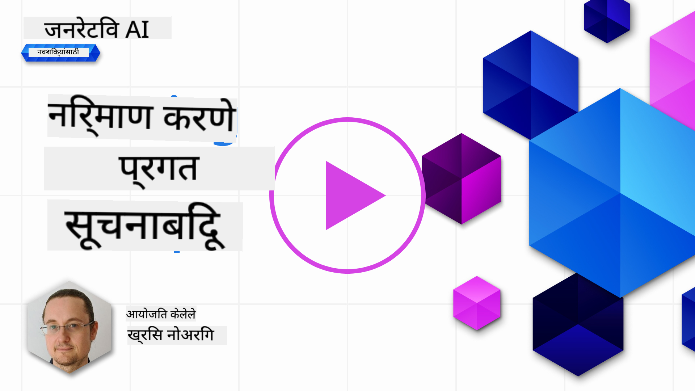

<!--
CO_OP_TRANSLATOR_METADATA:
{
  "original_hash": "b2651fb16bcfbc62b8e518751ed90fdb",
  "translation_date": "2025-10-18T00:25:03+00:00",
  "source_file": "05-advanced-prompts/README.md",
  "language_code": "mr"
}
-->
# प्रगत प्रॉम्प्ट तयार करणे

[](https://youtu.be/BAjzkaCdRok?si=NmUIyRf7-cDgbjtt)

आधीच्या अध्यायातील काही शिकवणुकींचा आढावा घेऊया:

> प्रॉम्प्ट _इंजिनिअरिंग_ ही प्रक्रिया आहे ज्याद्वारे आपण **मॉडेलला अधिक संबंधित प्रतिसाद देण्यासाठी मार्गदर्शन करतो** अधिक उपयुक्त सूचना किंवा संदर्भ प्रदान करून.

प्रॉम्प्ट लिहिण्यासाठी दोन पायऱ्या आहेत: प्रॉम्प्ट तयार करणे, संबंधित संदर्भ प्रदान करून, आणि _ऑप्टिमायझेशन_, म्हणजे प्रॉम्प्ट हळूहळू सुधारणे.

या टप्प्यावर, आपल्याला प्रॉम्प्ट कसे लिहायचे याची मूलभूत समज आहे, परंतु आपल्याला अधिक खोलवर जाण्याची आवश्यकता आहे. या अध्यायात, तुम्ही विविध प्रॉम्प्ट्स वापरण्यापासून सुरुवात करून एक प्रॉम्प्ट दुसऱ्यापेक्षा का चांगला आहे हे समजून घेण्यापर्यंत जाल. तुम्ही काही मूलभूत तंत्रे अनुसरून प्रॉम्प्ट्स कसे तयार करायचे ते शिकाल, जे कोणत्याही LLM वर लागू करता येतील.

## परिचय

या अध्यायात, आपण खालील विषयांचा समावेश करू:

- प्रॉम्प्ट इंजिनिअरिंगचे ज्ञान वाढवा आणि तुमच्या प्रॉम्प्ट्सवर विविध तंत्रे लागू करा.
- तुमच्या प्रॉम्प्ट्सचे आउटपुट बदलण्यासाठी त्यांची कॉन्फिगरेशन करा.

## शिकण्याची उद्दिष्टे

हे धडे पूर्ण केल्यानंतर, तुम्ही हे करू शकाल:

- प्रॉम्प्ट इंजिनिअरिंग तंत्रे लागू करा जी तुमच्या प्रॉम्प्ट्सच्या परिणामांना सुधारतात.
- प्रॉम्प्टिंग करा जे विविध किंवा निश्चित असू शकते.

## प्रॉम्प्ट इंजिनिअरिंग

प्रॉम्प्ट इंजिनिअरिंग ही प्रक्रिया आहे ज्याद्वारे इच्छित परिणाम देणारे प्रॉम्प्ट तयार केले जातात. प्रॉम्प्ट इंजिनिअरिंग म्हणजे फक्त मजकूर प्रॉम्प्ट लिहिणे नाही. प्रॉम्प्ट इंजिनिअरिंग ही अभियांत्रिकी शिस्त नाही, तर तुम्हाला इच्छित परिणाम मिळविण्यासाठी लागू करता येणाऱ्या तंत्रांचा संच आहे.

### प्रॉम्प्टचे एक उदाहरण

चला अशा मूलभूत प्रॉम्प्टचा विचार करूया:

> भूगोलावर 10 प्रश्न तयार करा.

या प्रॉम्प्टमध्ये, तुम्ही प्रत्यक्षात विविध प्रॉम्प्ट तंत्रे लागू करत आहात.

चला याचे विश्लेषण करू.

- **संदर्भ**, तुम्ही निर्दिष्ट करता की ते "भूगोल" बद्दल असावे.
- **आउटपुट मर्यादित करणे**, तुम्हाला 10 पेक्षा जास्त प्रश्न नको आहेत.

### साध्या प्रॉम्प्टिंगची मर्यादा

तुम्हाला अपेक्षित परिणाम मिळेल किंवा मिळणार नाही. तुम्हाला तुमचे प्रश्न तयार होतील, परंतु भूगोल हा मोठा विषय आहे आणि तुम्हाला हवे ते मिळेलच असे नाही, यासाठी खालील कारणे असू शकतात:

- **मोठा विषय**, तुम्हाला माहित नाही की ते देश, राजधानी, नद्या इत्यादींबद्दल असतील.
- **स्वरूप**, जर तुम्हाला प्रश्न विशिष्ट स्वरूपात हवे असतील तर काय?

जसे तुम्ही पाहू शकता, प्रॉम्प्ट तयार करताना विचार करण्यासारखे बरेच काही आहे.

आतापर्यंत, आपण एक साधा प्रॉम्प्ट उदाहरण पाहिले आहे, परंतु जनरेटिव्ह एआय लोकांना विविध भूमिका आणि उद्योगांमध्ये मदत करण्यासाठी खूप काही करण्यास सक्षम आहे. पुढे काही मूलभूत तंत्रे एक्सप्लोर करूया.

### प्रॉम्प्टिंगसाठी तंत्रे

सर्वप्रथम, आपल्याला समजून घेणे आवश्यक आहे की प्रॉम्प्टिंग हे LLM चे _उद्भवणारे_ गुणधर्म आहे, म्हणजे हे मॉडेलमध्ये अंगभूत वैशिष्ट्य नाही तर काहीतरी आहे जे आपण मॉडेल वापरत असताना शोधतो.

LLM ला प्रॉम्प्ट करण्यासाठी आपण काही मूलभूत तंत्रे वापरू शकतो. चला त्यांचा अभ्यास करूया.

- **झिरो-शॉट प्रॉम्प्टिंग**, हे प्रॉम्प्टिंगचे सर्वात मूलभूत स्वरूप आहे. हे एकच प्रॉम्प्ट आहे जे LLM कडून केवळ त्याच्या प्रशिक्षण डेटावर आधारित प्रतिसादाची विनंती करते.
- **फ्यू-शॉट प्रॉम्प्टिंग**, या प्रकारचे प्रॉम्प्टिंग LLM ला मार्गदर्शन करते ज्यामध्ये 1 किंवा अधिक उदाहरणे दिली जातात ज्यावर ते त्याचा प्रतिसाद तयार करण्यासाठी अवलंबून राहू शकते.
- **चेन-ऑफ-थॉट**, प्रॉम्प्टिंगचा हा प्रकार LLM ला समस्या टप्प्याटप्प्याने कशी सोडवायची ते सांगतो.
- **जनरेटेड नॉलेज**, प्रॉम्प्टचा प्रतिसाद सुधारण्यासाठी, तुम्ही तुमच्या प्रॉम्प्टमध्ये अतिरिक्त तथ्ये किंवा ज्ञान प्रदान करू शकता.
- **लीस्ट टू मोस्ट**, चेन-ऑफ-थॉट प्रमाणे, हे तंत्र समस्या टप्प्याटप्प्याने तोडण्याबद्दल आहे आणि नंतर या टप्प्यांनुसार कार्य करण्यास सांगते.
- **सेल्फ-रिफाइन**, हे तंत्र LLM च्या आउटपुटचे परीक्षण करण्याबद्दल आहे आणि नंतर त्यास सुधारण्यास सांगते.
- **माययूटिक प्रॉम्प्टिंग**, येथे तुम्हाला LLM चा उत्तर योग्य आहे याची खात्री करायची आहे आणि तुम्ही उत्तराच्या विविध भागांचे स्पष्टीकरण विचारता. हे सेल्फ-रिफाइनचे एक प्रकार आहे.

### झिरो-शॉट प्रॉम्प्टिंग

प्रॉम्प्टिंगची ही शैली खूप सोपी आहे, ती एकच प्रॉम्प्ट असते. हे तंत्र कदाचित तुम्ही LLM बद्दल शिकण्यास सुरुवात करत असताना वापरत असाल. येथे एक उदाहरण आहे:

- प्रॉम्प्ट: "अल्जेब्रा म्हणजे काय?"
- उत्तर: "अल्जेब्रा ही गणिताची एक शाखा आहे जी गणितीय चिन्हे आणि या चिन्हे हाताळण्याचे नियम अभ्यासते."

### फ्यू-शॉट प्रॉम्प्टिंग

प्रॉम्प्टिंगची ही शैली मॉडेलला विनंतीसह काही उदाहरणे प्रदान करून मदत करते. यात एकच प्रॉम्प्ट असतो ज्यामध्ये अतिरिक्त कार्य-विशिष्ट डेटा असतो. येथे एक उदाहरण आहे:

- प्रॉम्प्ट: "शेक्सपियरच्या शैलीतील एक कविता लिहा. येथे शेक्सपियरियन सॉनेट्सची काही उदाहरणे आहेत:
  सॉनेट 18: 'शाल आय कंपेअर थी टू अ समर'स डे? थाऊ आर्ट मोर लव्हली अँड मोर टेम्परेट...'
  सॉनेट 116: 'लेट मी नॉट टू द मॅरेज ऑफ ट्रू माइंड्स अडमिट इम्पेडिमेंट्स. लव्ह इज नॉट लव्ह विच ऑल्टर्स व्हेन इट ऑल्टरेशन फाइंड्स...'
  सॉनेट 132: 'थाइन आयज आय लव्ह, अँड दे, अ‍ॅज पिटींग मी, नोइंग थाय हार्ट टॉरमेंट मी विथ डिस्डेन,...'
  आता, चंद्राच्या सौंदर्याबद्दल एक सॉनेट लिहा."
- उत्तर: "अपॉन द स्काय, द मून डोथ सॉफ्टली ग्लिम, इन सिल्व'री लाइट दॅट कास्ट्स इट्स जेंटल ग्रेस,..."

उदाहरणे LLM ला इच्छित आउटपुटचा संदर्भ, स्वरूप किंवा शैली समजून घेण्यास मदत करतात. ते मॉडेलला विशिष्ट कार्य समजून घेण्यास आणि अधिक अचूक आणि संबंधित प्रतिसाद तयार करण्यास मदत करतात.

### चेन-ऑफ-थॉट

चेन-ऑफ-थॉट हे एक खूपच मनोरंजक तंत्र आहे कारण ते LLM ला टप्प्याटप्प्याने घेऊन जाण्याबद्दल आहे. कल्पना अशी आहे की LLM ला काहीतरी कसे करायचे ते समजावून सांगावे. खालील उदाहरण विचार करा, चेन-ऑफ-थॉटसह आणि त्याशिवाय:

    - प्रॉम्प्ट: "अ‍ॅलिसकडे 5 सफरचंद आहेत, ती 3 सफरचंद फेकते, 2 बॉबला देते आणि बॉब एक परत देतो, अ‍ॅलिसकडे किती सफरचंद आहेत?"
    - उत्तर: 5

LLM 5 उत्तर देते, जे चुकीचे आहे. योग्य उत्तर 1 सफरचंद आहे, दिलेल्या गणनेनुसार (5 -3 -2 + 1 = 1).

तर आपण LLM ला हे योग्य प्रकारे कसे शिकवू शकतो?

चला चेन-ऑफ-थॉट वापरून पाहूया. चेन-ऑफ-थॉट लागू करणे म्हणजे:

1. LLM ला समान उदाहरण द्या.
1. गणना दाखवा आणि ती योग्य प्रकारे कशी करायची ते दाखवा.
1. मूळ प्रॉम्प्ट प्रदान करा.

हे असे आहे:

- प्रॉम्प्ट: "लिसाकडे 7 सफरचंद आहेत, ती 1 सफरचंद फेकते, 4 सफरचंद बार्टला देते आणि बार्ट एक परत देतो:
  7 -1 = 6
  6 -4 = 2
  2 +1 = 3  
  अ‍ॅलिसकडे 5 सफरचंद आहेत, ती 3 सफरचंद फेकते, 2 बॉबला देते आणि बॉब एक परत देतो, अ‍ॅलिसकडे किती सफरचंद आहेत?"
  उत्तर: 1

लक्षात घ्या की आम्ही आणखी एक उदाहरण, एक गणना आणि नंतर मूळ प्रॉम्प्टसह लक्षणीय लांब प्रॉम्प्ट लिहिले आहे आणि आम्ही योग्य उत्तर 1 वर पोहोचलो आहोत.

जसे तुम्ही पाहू शकता चेन-ऑफ-थॉट हे एक खूप शक्तिशाली तंत्र आहे.

### जनरेटेड नॉलेज

अनेक वेळा जेव्हा तुम्हाला प्रॉम्प्ट तयार करायचा असतो, तेव्हा तुम्हाला तुमच्या स्वतःच्या कंपनीच्या डेटाचा वापर करून ते करायचे असते. तुम्हाला प्रॉम्प्टचा एक भाग कंपनीकडून हवा असतो आणि दुसरा भाग तुम्हाला स्वारस्य असलेल्या प्रॉम्प्टचा असावा.

उदाहरण म्हणून, जर तुम्ही विमा व्यवसायात असाल तर तुमचा प्रॉम्प्ट असा दिसू शकतो:

```text
{{company}}: {{company_name}}
{{products}}:
{{products_list}}
Please suggest an insurance given the following budget and requirements:
Budget: {{budget}}
Requirements: {{requirements}}
```

वरील उदाहरणात, तुम्ही पाहू शकता की प्रॉम्प्ट टेम्पलेट वापरून तयार केले आहे. टेम्पलेटमध्ये काही व्हेरिएबल्स आहेत, `{{variable}}` ने दर्शविलेले, जे कंपनी API मधून वास्तविक मूल्यांनी बदलले जातील.

जेव्हा व्हेरिएबल्स कंपनीच्या सामग्रीने बदलले जातात तेव्हा प्रॉम्प्ट कसे दिसू शकते याचे उदाहरण येथे आहे:

```text
Insurance company: ACME Insurance
Insurance products (cost per month):
- Car, cheap, 500 USD
- Car, expensive, 1100 USD
- Home, cheap, 600 USD
- Home, expensive, 1200 USD
- Life, cheap, 100 USD

Please suggest an insurance given the following budget and requirements:
Budget: $1000
Requirements: Car, Home, and Life insurance
```

हा प्रॉम्प्ट LLM द्वारे चालवल्यानंतर खालीलप्रमाणे प्रतिसाद मिळतो:

```output
Given the budget and requirements, we suggest the following insurance package from ACME Insurance:
- Car, cheap, 500 USD
- Home, cheap, 600 USD
- Life, cheap, 100 USD
Total cost: $1,200 USD
```

जसे तुम्ही पाहू शकता, ते लाइफ इन्शुरन्स सुचवते, जे ते सुचवायला नको होते. हा परिणाम प्रॉम्प्ट अधिक स्पष्ट करण्यासाठी बदलण्याची आवश्यकता दर्शवतो. काही _प्रयत्न आणि चुका_ केल्यानंतर, आम्ही खालील प्रॉम्प्टवर पोहोचतो:

```text
Insurance company: ACME Insurance
Insurance products (cost per month):
- type: Car, cheap, cost: 500 USD
- type: Car, expensive, cost: 1100 USD
- type: Home, cheap, cost: 600 USD
- type: Home, expensive, cost: 1200 USD
- type: Life, cheap, cost: 100 USD

Please suggest an insurance given the following budget and requirements:
Budget: $1000 restrict choice to types: Car, Home
```

लक्षात घ्या की _प्रकार_ आणि _खर्च_ जोडणे आणि _मर्यादित_ हा कीवर्ड वापरणे LLM ला आपण काय हवे आहे ते समजून घेण्यास मदत करते.

आता आम्हाला खालील प्रतिसाद मिळतो:

```output
Given the budget and requirements, we suggest the Car, Cheap insurance product which costs 500 USD per month.
```

या उदाहरणाचा मुद्दा असा होता की जरी आपण _जनरेटेड नॉलेज_ सारखे मूलभूत तंत्र वापरत असलो तरी, आपल्याला बहुतेक प्रकरणांमध्ये इच्छित परिणाम मिळविण्यासाठी प्रॉम्प्ट ऑप्टिमाइझ करणे आवश्यक आहे.

### लीस्ट-टू-मोस्ट

लीस्ट-टू-मोस्ट प्रॉम्प्टिंगची कल्पना मोठ्या समस्येला उपप्रश्नांमध्ये विभागणे आहे. अशा प्रकारे, तुम्ही LLM ला मोठ्या समस्येवर "जिंकण्यासाठी" मार्गदर्शन करण्यात मदत करता. डेटा सायन्ससाठी एक चांगले उदाहरण असू शकते जिथे तुम्ही LLM ला असे विचारू शकता:

> प्रॉम्प्ट: डेटा सायन्स 5 टप्प्यांमध्ये कसे करावे?

तुमचा एआय सहाय्यक खालीलप्रमाणे उत्तर देईल:

1. डेटा गोळा करा
1. डेटा स्वच्छ करा
1. डेटा विश्लेषण करा
1. डेटा प्लॉट करा
1. डेटा सादर करा

### सेल्फ-रिफाइन, परिणामांचे परीक्षण करा

जनरेटिव्ह एआय आणि LLM सह, तुम्ही आउटपुटवर विश्वास ठेवू शकत नाही. तुम्हाला ते सत्यापित करणे आवश्यक आहे. शेवटी, LLM तुम्हाला फक्त पुढे काय म्हणायचे आहे ते सादर करत आहे, योग्य काय आहे ते नाही. म्हणून, LLM ला स्वतःचे परीक्षण करण्यास सांगणे ही चांगली कल्पना आहे, ज्यामुळे आपल्याला सेल्फ-रिफाइन तंत्राकडे नेले जाते.

हे कसे कार्य करते ते खालील चरणांचे अनुसरण करते:

1. LLM ला समस्या सोडवण्यास सांगणारा प्रारंभिक प्रॉम्प्ट
1. LLM उत्तर देते
1. तुम्ही उत्तराचे परीक्षण करता आणि एआयला सुधारण्यास सांगता
1. LLM पुन्हा उत्तर देते, यावेळी परीक्षण विचारात घेऊन आणि सुचवलेले उपाय सुचवते

तुम्ही ही प्रक्रिया जितक्या वेळा हवी तितक्या वेळा पुन्हा करू शकता.

या तंत्राचा वापर करून एक उदाहरण येथे आहे:

> प्रॉम्प्ट: "प्रॉडक्ट्स आणि कस्टमर्स रूट्ससह एक Python वेब API तयार करा"

AI उत्तर:

```python
import flask
app = Flask(__name__)

@app.route('/products')
def products():
    return 'Products'

@app.route('/customers')
def customers():
    return 'Customers'
```

> प्रॉम्प्ट: वरील कोडमध्ये 3 सुधारणा सुचवा

AI उत्तर:

```text
Sure, here are three suggestions to improve the code:

Import the correct module: The first line should import Flask instead of flask. The correct import statement should be from flask import Flask.

Add a main function: Add a if __name__ == '__main__': block to the end of the file to run the application when the file is executed.

Use f-strings: Use f-strings to format the return statements in the route functions. For example, return 'Products' can be changed to return f'This is the {request.path} page'.
```

```python
from flask import Flask, request

app = Flask(__name__)

@app.route('/products')
def products():
    return f'This is the {request.path} page'

@app.route('/customers')
def customers():
    return f'This is the {request.path} page'

if __name__ == '__main__':
    app.run()
```

जसे तुम्ही पाहू शकता, वरील AI प्रतिसादाने पहिल्या सुचवलेल्या कोडमध्ये सुधारणा केल्या आहेत, ज्यामुळे पहिल्या उत्तराचे परीक्षण केले गेले.

### माययूटिक प्रॉम्प्टिंग

माययूटिक प्रॉम्प्टिंग हे तंत्र सेल्फ-रिफाइनसारखे आहे परंतु ते LLM ला स्वतःचे स्पष्टीकरण देण्यास सांगण्याबद्दल अधिक आहे. LLM च्या आउटपुटमधील विसंगती कमी करण्यासाठी आणि योग्य उत्तर मिळविण्यासाठी हे तंत्र वापरले जाते. अनुसरण करण्यासाठी कार्यप्रवाह खालीलप्रमाणे आहे:

1. LLM ला प्रश्नाचे उत्तर देण्यास सांगा
1. उत्तराच्या प्रत्येक भागासाठी, LLM ला अधिक सखोल स्पष्टीकरण विचारा.
1. जर विसंगती असतील तर, विसंगत भाग नाकारावे.

2 आणि 3 पुन्हा करा जोपर्यंत तुम्ही सर्व भागांमधून गेलात आणि उत्तरावर समाधानी आहात.

येथे एक उदाहरण प्रॉम्प्ट आहे:

> प्रॉम्प्ट: महामारी कमी करण्यासाठी संकट योजना तयार करण्यासाठी 5 टप्पे कसे तयार करायचे?
> LLM उत्तर:

```text
1. Identify the risks
1. Identify the stakeholders
1. Identify the resources
1. Identify the actions
1. Identify the communication channels
```

त्याने 5 टप्पे ओळखले आहेत, परंतु हे योग्य आहे का हे आपण ठरवू शकतो का? चला LLM ला प्रत्येक टप्प्याचे अधिक सविस्तर स्पष्टीकरण विचारूया:

> प्रॉम्प्ट: पहिल्या टप्प्याचे अधिक सविस्तर वर्णन करा, महामारीसह तपशीलवार जोखीम काय आहेत?

```text
The risks are the following:

- Loss of life
- Loss of business
- Loss of reputation
- Loss of customers
- Loss of employees
```

या टप्प्यावर, आम्हाला खात्री करायची आहे की LLM योग्य आहे म्हणून आम्ही त्याला पहिल्या जोखमीचे अधिक सविस्तर वर्णन करण्यास सांगतो आणि आशा करतो की ते वरील उत्तराशी सुसंगत आहे:

> प्रॉम्प्ट: महामारीमध्ये, सर्वात मोठा धोका कोणता आहे आणि का?

```text
The biggest risk is loss of life because it's the most important thing to protect.
```

> महामारीमध्ये दोन सर्वात मोठे धोके कोणते आहेत?

```text
The two biggest risks are loss of life and loss of business.
```

या टप्प्यावर, LLM सुसंगत आहे आणि "जीवन" आणि "व्यवसाय" हे दोन प्रमुख धोके म्हणून उल्लेख करते. आता आपण पुढील टप्प्यावर जाऊ शकतो आणि स्वतःला पुरेसे आत्मविश्वास वाटतो. तथापि, आपल्याला LLM वर अंध विश्वास ठेवू नये, आपल्याला नेहमी आउटपुट सत्यापित करणे आवश्यक आहे.

## तुमचे आउटपुट बदलवा

LLMs स्वभावतः अनिश्चित असतात, म्हणजे तुम्ही समान प्रॉम्प्ट पुन्हा चालवला तरी तुम्हाला प्रत्येक वेळी वेगवेगळे परिणाम मिळतील. खालील प्रॉम्प्ट वापरून पहा:

> "Python वेब API साठी कोड तयार करा"

```python
# Import necessary modules
import flask
from flask import request, jsonify

# Create a Flask app
app = flask.Flask(__name__)

# Create a route for the API
@app.route('/api', methods=['GET'])
def api():
    # Get the data from the request
    data = request.args

    # Process the data
    result = process_data(data)

    # Return the result as JSON
    return jsonify(result)

# Function to process the data
def process_data(data):
    # Do something with the data
    result = data + 1

    # Return the result
    return result

# Run the app
if __name__ == '__main__':
    app.run()

```

समान प्रॉम्प्ट पुन्हा चालवल्यास थोडासा वेगळा प्रतिसाद मिळतो:

```python
#import necessary packages
import flask
from flask import request, jsonify

#create the Flask application
app = flask.Flask(__name__)
app.config["DEBUG"] = True

#create a list of books
books = [
    {'id': 0,
     'title': 'A Fire Upon the Deep',
     'author': 'Vernor Vinge',
     'first_sentence': 'The coldsleep itself was dreamless.',
     'year_published': '1992'},
    {'id': 1,
     'title': 'The Ones Who Walk Away From Omelas',
     'author': 'Ursula K. Le Guin',
     'first_sentence': 'With a clamor of bells that set the swallows soaring, the Festival of Summer came to the city Omelas, bright-towered by the sea.',
     'published': '1973'},
    {'id': 2,
     'title': 'Dhalgren',
     'author': 'Samuel R. Delany',
     'first_sentence': 'to wound the autumnal city.',
     'published': '1975'}
]

#create an endpoint for the API
@app.route('/', methods=['GET'])
def home():
    return '''<h1>Books API</h1>
<p>A prototype API for retrieving books.</p>'''

#create an endpoint to return all books
@app.route('/api/v1/resources/books/all', methods=['GET'])
def api_all():
    return jsonify(books)

#create an endpoint to return a single book
@app.route('/api/v1/resources/books', methods=['GET'])
def api_id():
    #check if an ID was provided as part of the URL
    #if ID is provided, assign it to a variable
    #if no ID is provided, display an error
    if 'id' in request.args:
        id = int(request.args['id'])
    else:
        return "Error: No id field provided. Please specify an id."

    #create an empty list for our results
    results = []

    #loop through the data and match results that fit the requested ID
    #IDs are unique, but other fields might return many results
    for book in books:
        if book['id'] == id:
            results.append(book)

    #use the jsonify function from Flask to convert our list of
    #Python dictionaries to the JSON format
    return jsonify(results)

app.run()
```

> तर बदललेला आउटपुट समस्या आहे का?

तुम्ही काय करण्याचा प्रयत्न करत आहात यावर अवलंबून आहे. जर तुम्हाला विशिष्ट प्रतिसाद हवा असेल
जसे तुम्ही पाहू शकता, परिणाम अधिक विविध असू शकत नाहीत.

> लक्षात ठेवा, अजूनही अनेक पॅरामीटर्स आहेत ज्यांना तुम्ही बदलू शकता ज्यामुळे आउटपुटमध्ये विविधता येते, जसे की top-k, top-p, repetition penalty, length penalty आणि diversity penalty, परंतु हे या अभ्यासक्रमाच्या कक्षेबाहेर आहे.

## चांगल्या पद्धती

तुम्हाला हवे असलेले परिणाम मिळवण्यासाठी तुम्ही अनेक पद्धती लागू करू शकता. तुम्ही जसे जसे अधिकाधिक प्रॉम्प्टिंग वापराल, तसे तुम्हाला स्वतःची शैली सापडेल.

आम्ही कव्हर केलेल्या तंत्रांव्यतिरिक्त, LLM ला प्रॉम्प्ट करताना काही चांगल्या पद्धती विचारात घेण्यासारख्या आहेत.

येथे काही चांगल्या पद्धती विचारात घ्या:

- **संदर्भ निर्दिष्ट करा**. संदर्भ महत्त्वाचा आहे, जितके अधिक तुम्ही डोमेन, विषय इत्यादी निर्दिष्ट करू शकता तितके चांगले.
- आउटपुट मर्यादित करा. तुम्हाला विशिष्ट संख्येची आयटम्स किंवा विशिष्ट लांबी हवी असल्यास, ती निर्दिष्ट करा.
- **काय आणि कसे दोन्ही निर्दिष्ट करा**. तुम्हाला काय हवे आहे आणि ते कसे हवे आहे हे सांगणे लक्षात ठेवा, उदाहरणार्थ "Python Web API तयार करा ज्यामध्ये routes products आणि customers असतील, ते 3 फाइल्समध्ये विभाजित करा".
- **टेम्पलेट्स वापरा**. अनेकदा, तुम्हाला तुमच्या कंपनीच्या डेटासह तुमच्या प्रॉम्प्ट्स समृद्ध करायचे असते. हे करण्यासाठी टेम्पलेट्स वापरा. टेम्पलेट्समध्ये व्हेरिएबल्स असू शकतात ज्यांना तुम्ही वास्तविक डेटासह बदलू शकता.
- **योग्य स्पेलिंग करा**. LLM तुम्हाला योग्य उत्तर देऊ शकते, परंतु तुम्ही योग्य स्पेलिंग केल्यास तुम्हाला चांगले उत्तर मिळेल.

## असाइनमेंट

Flask वापरून एक साधा API तयार करण्यासाठी Python मधील कोड येथे आहे:

```python
from flask import Flask, request

app = Flask(__name__)

@app.route('/')
def hello():
    name = request.args.get('name', 'World')
    return f'Hello, {name}!'

if __name__ == '__main__':
    app.run()
```

GitHub Copilot किंवा ChatGPT सारख्या AI सहाय्यकाचा वापर करा आणि "self-refine" तंत्र लागू करून कोड सुधारण्याचा प्रयत्न करा.

## उपाय

कोडमध्ये योग्य प्रॉम्प्ट्स जोडून असाइनमेंट सोडवण्याचा प्रयत्न करा.

> [!TIP]
> सुधारणा करण्यासाठी विचारण्यासाठी प्रॉम्प्ट तयार करा, किती सुधारणा करायच्या आहेत यावर मर्यादा घालणे चांगले आहे. तुम्ही ते विशिष्ट प्रकारे सुधारण्यास सांगू शकता, उदाहरणार्थ आर्किटेक्चर, कार्यक्षमता, सुरक्षा इत्यादी.

[उपाय](../../../05-advanced-prompts/python/aoai-solution.py)

## ज्ञान तपासणी

मी chain-of-thought प्रॉम्प्टिंग का वापरावे? मला 1 योग्य उत्तर आणि 2 चुकीची उत्तरे दाखवा.

1. LLM ला समस्या सोडवायला शिकवण्यासाठी.
1. B, LLM ला कोडमधील चुका शोधायला शिकवण्यासाठी.
1. C, LLM ला वेगवेगळ्या उपायांसह येण्यासाठी सांगण्यासाठी.

A: 1, कारण chain-of-thought म्हणजे LLM ला समस्या सोडवण्याचा मार्ग दाखवणे, त्यासाठी चरणांची मालिका प्रदान करणे, आणि समान समस्या कशा सोडवल्या गेल्या हे दाखवणे.

## 🚀 आव्हान

तुम्ही नुकतेच असाइनमेंटमध्ये self-refine तंत्र वापरले. तुम्ही तयार केलेला कोणताही प्रोग्राम घ्या आणि त्यात कोणत्या सुधारणा लागू करायच्या आहेत याचा विचार करा. आता प्रस्तावित बदल लागू करण्यासाठी self-refine तंत्र वापरा. तुम्हाला काय वाटले, परिणाम चांगला झाला की वाईट?

## उत्तम काम! तुमचे शिक्षण सुरू ठेवा

हा धडा पूर्ण केल्यानंतर, आमच्या [Generative AI Learning collection](https://aka.ms/genai-collection?WT.mc_id=academic-105485-koreyst) वर जा आणि तुमचे Generative AI ज्ञान वाढवा!

पुढील धडा 6 वर जा जिथे आपण प्रॉम्प्ट इंजिनिअरिंगचे ज्ञान वापरून [text generation apps तयार करू](../06-text-generation-apps/README.md?WT.mc_id=academic-105485-koreyst).

---

**अस्वीकरण**:  
हा दस्तऐवज AI भाषांतर सेवा [Co-op Translator](https://github.com/Azure/co-op-translator) वापरून भाषांतरित करण्यात आला आहे. आम्ही अचूकतेसाठी प्रयत्नशील असलो तरी, कृपया लक्षात ठेवा की स्वयंचलित भाषांतरे त्रुटी किंवा अचूकतेच्या अभावासह असू शकतात. मूळ भाषेतील दस्तऐवज हा अधिकृत स्रोत मानला जावा. महत्त्वाच्या माहितीसाठी, व्यावसायिक मानवी भाषांतराची शिफारस केली जाते. या भाषांतराचा वापर करून निर्माण झालेल्या कोणत्याही गैरसमज किंवा चुकीच्या अर्थासाठी आम्ही जबाबदार राहणार नाही.