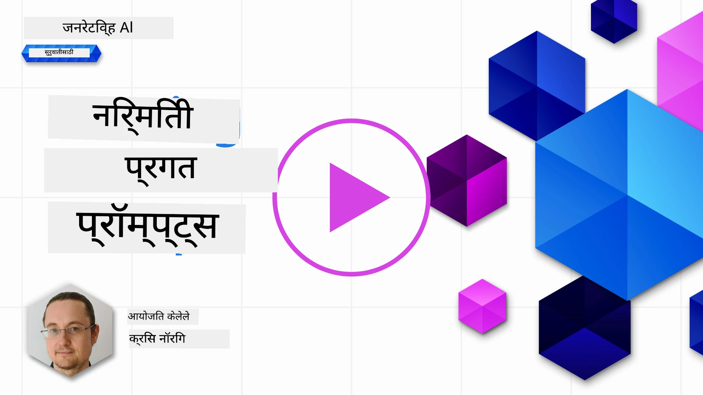

# प्रगत प्रॉम्प्ट तयार करणे

[](https://youtu.be/BAjzkaCdRok?si=NmUIyRf7-cDgbjtt)

चला मागील अध्यायातून काही शिकवणींचा आढावा घेऊया:

> प्रॉम्प्ट _इंजीनियरिंग_ ही अशी प्रक्रिया आहे ज्याद्वारे आपण मोडेलला अधिक संबंधित प्रतिसादांकडे **मार्गदर्शन करतो** उपयुक्त सूचना किंवा संदर्भ देऊन.

प्रॉम्प्ट लिहिण्याच्या दोन पायऱ्या देखील आहेत: प्रॉम्प्ट तयार करणे, संबंधित संदर्भ देऊन, आणि _ऑप्टिमायझेशन_, म्हणजे प्रॉम्प्ट हळूहळू सुधारण्याची पद्धत.

या टप्प्यावर, आपल्याला प्रॉम्प्ट कसे लिहायचे याची मूलभूत समज आहे, पण आपण अधिक खोलात जावे लागेल. या अध्यायात, आपण विविध प्रॉम्प्ट आजमावण्यापासून एक प्रॉम्प्ट दुसऱ्या पेक्षा का चांगला आहे हे समजण्याकडे पुढे जाल. आपण काही मूलभूत तंत्रे जाणून घेणार आहात जी कोणत्याही LLM ला लागू केली जाऊ शकतात.

## परिचय

या अध्यायात आपण खालील विषयावर चर्चा करू:

- वेगवेगळ्या तंत्रांचा वापर करून प्रॉम्प्ट इंजिनियरिंगमध्ये आपले ज्ञान वाढवा.
- आउटपुट वेगवेगळे करण्यासाठी प्रॉम्प्ट्स कॉन्फिगर करणे.

## शिक्षण उद्दिष्टे

हा धडा पूर्ण केल्यानंतर, आपण सक्षम असाल:

- आपल्या प्रॉम्प्टच्या निकालांमध्ये सुधारणा करणारी प्रॉम्प्ट इंजिनियरिंग तंत्रे वापरणे.
- विविध किंवा निश्चित निकाल देणारे प्रॉम्प्टिंग करणे.

## प्रॉम्प्ट इंजिनियरिंग

प्रॉम्प्ट इंजिनियरिंग ही अशी प्रक्रिया आहे ज्यात आपल्याला हवे असलेले निकाल देणारे प्रॉम्प्ट तयार करतात. प्रॉम्प्ट इंजिनियरिंग म्हणजे फक्त एक मजकूर प्रॉम्प्ट लिहिण्याइतकंच नाही. हे इंजिनियरिंग क्षेत्र नाही, तर उपलब्ध निकाल मिळवण्यासाठी वापरल्या जाणाऱ्या तंत्रांचा संच आहे.

### प्रॉम्प्टचे उदाहरण

चला एक सोपा प्रॉम्प्ट पाहूया:

> भूगोलावर 10 प्रश्न तयार करा.

या प्रॉम्प्टमध्ये तुम्ही प्रत्यक्षात काही वेगळे प्रॉम्प्ट तंत्र वापरत आहात.

चला तो विभागून पाहूया.

- **संदर्भ**, तुम्ही यावर लक्ष केंद्रीत केले आहे की "भूगोल" बद्दल असले पाहिजे.
- **आउटपुट मर्यादित करणे**, तुम्हाला 10 पेक्षा जास्त प्रश्न हवे नाहीत.

### सोप्या प्रॉम्प्टिंगच्या मर्यादा

तुम्हाला इच्छित निकाल मिळेलही किंवा नसेलही. प्रश्न तयार होतील, पण भूगोल हा एक मोठा विषय आहे म्हणून तुम्हाला हवे तसे प्रश्न मिळणार नाहीत खालील कारणांमुळे:

- **मोठा विषय**, तुम्हाला माहिती नाही की तो देश, राजधानी, नद्या वगैरे विषयांवर असणार आहे की नाही.
- **फॉर्मॅट**, जर तुम्हाला प्रश्न विशिष्ट प्रकारे फॉर्मॅट केलेले हवे असतील तर?

जसा आपण पाहतो, प्रॉम्प्ट तयार करताना बरेच काही लक्षात घ्यावे लागते.

आतापर्यंत आपण सोप्या प्रॉम्प्टचे उदाहरण पाहिले आहे, पण जनरेटिव्ह AI खूप अधिक सक्षम आहे ज्यामुळे विविध भूमिका आणि उद्योगांमध्ये लोकांना मदत होते. चला पुढे काही मूलभूत तंत्र पाहू.

### प्रॉम्प्टिंगसाठी तंत्रे

प्रथम, आपल्याला समजून घ्यावे लागेल की प्रॉम्प्टिंग हा LLM चा एक _उद्भवणारी_ वैशिष्ट्य आहे म्हणजे हा मोडेलमध्ये अंगभूत साधन नाही, तर वापरून असताना आपल्याला सापडणारी काही क्षमता आहे.

आपण वापरू शकणारी काही मूलभूत प्रॉम्प्टिंग तंत्रे आहेत. त्यांचा परिचय घेऊया.

- **झीरो-शॉट प्रॉम्प्टिंग**, हा प्रॉम्प्टिंगचा सर्वात सोपा प्रकार आहे. हा एकल प्रॉम्प्ट आहे जो केवळ प्रशिक्षण डेटावर आधारित प्रतिसाद मागतो.
- **फ्यू-शॉट प्रॉम्प्टिंग**, या प्रकारात LLM ला 1 किंवा अधिक उदाहरणे दिली जातात ज्यावर तो त्याचा प्रतिसाद तयार करू शकतो.
- **चेन-ऑफ-थॉट**, या प्रकारात LLM ला समस्या टप्प्याटप्प्याने कशी सुटवायची हे समजवले जाते.
- **निर्मित ज्ञान**, उत्तम प्रतिसादासाठी तुम्ही तुमच्या प्रॉम्प्टसोबत निर्मित तथ्ये किंवा ज्ञान देऊ शकता.
- **कमीतकमी ते जास्त**, चेन-ऑफ-थॉट सारखे, ही पद्धत समस्या टप्पे करून सोडवण्याची आहे आणि विविध टप्पे क्रमाने विचारून करायचे आहेत.
- **स्वत: सुधारणा**, या तंत्रात LLM चा प्रतिसाद तपासून त्याला सुधारण्यास म्हणतात.
- **माययुटिक प्रॉम्प्टिंग**. ह्याचा हेतू आहे की LLM चा उत्तर बरोबर आहे की नाही हे तपासणे आणि त्याचे विविध भाग समजावून सांगणे. हा स्वरूपातील स्वतः सुधारणा आहे.

### झीरो-शॉट प्रॉम्प्टिंग

हा प्रकार खूप सोपा आहे, एकच प्रॉम्प्ट असतो. बहुधा तुम्ही ज्या प्रमाणे LLM वापरणे सुरू केलेय तसाच हा आहे. उदाहरण:

- प्रॉम्प्ट: "अल्जेब्रा म्हणजे काय?"
- उत्तर: "अल्जेब्रा म्हणजे गणिताचा एक शाखा जी गणितीय चिन्हे आणि त्यावर काम करण्याच्या नियमांचा अभ्यास करते."

### फ्यू-शॉट प्रॉम्प्टिंग

या प्रकारात, मॉडेलला काही उदाहरणांसह प्रॉम्प्ट दिला जातो. हा एकल प्रॉम्प्ट असून त्यात अतिरिक्त कामाशी संबंधित डेटा दिला जातो. उदाहरण:

- प्रॉम्प्ट: "शेक्सपिअर शैलीतील कविता लिहा. येथे काही शेक्सपिअरियन सोननेट्स आहेत:
  सोननेट 18: 'मी तुला उन्हाळ्याच्या दिवसाशी तुलना करू का? तू अधिक सुंदर आणि सौम्य आहेस...'
  सोननेट 116: 'खऱ्या मनांच्या विवाहाला मी अडथळे स्वीकारत नाही. प्रेम म्हणजे तोच प्रेम नाही जो बदलेला जाणारा...'
  सोननेट 132: 'तुझे डोळे मला आवडतात, आणि ते तसेच दया करीत आहेत, जाणून की तुझे हृदय मला तिरस्काराने त्रास देत आहे,...'
  आता, चंद्राच्या सौंदर्यावर एक सोननेट लिहा."
- उत्तर: "आकाशावर, चंद्र मऊ प्रकाशाने चमकतो, रजतमय प्रकाशामध्ये त्याचे सौम्य तेज झळकतं,..."

उदाहरणे LLM ला संदर्भ, फॉर्मॅट किंवा शैली देतात. त्यामुळे मॉडेल कार्य अधिक अचूक आणि संबंधित प्रतिसाद तयार करते.

### चेन-ऑफ-थॉट

चेन-ऑफ-थॉट एक गंमतीदार तंत्र आहे कारण यात LLM ला टप्प्याटप्प्याने समस्या सोडवायची कळवतात. कल्पना अशी आहे की LLM ला कोणतीही क्रिया कशी पार पाडायची हे शिकवायचे आहे. पुढील उदाहरण पाहा, आणि त्यामध्ये चेन-ऑफ-थॉट वापरले जात नाही आणि वापरले जाते असे:

    - प्रॉम्प्ट: "ऍलिस कडे 5 सफरचंदे आहेत, ती 3 फेकते, बॉबसाठी 2 देते आणि बॉब 1 परत देतो, तर ऍलिसकडे किती सफरचंदे उरतात?"
    - उत्तर: 5

LLM उत्तर 5 देते, जे चुकीचे आहे. बरोबर उत्तर आहे 1 सफरचंद (5 - 3 - 2 + 1 = 1).

तर आपण LLM ला हे कसे योग्यरित्या शिकवू?

चला चेन-ऑफ-थॉट वापरून पाहू. चेन-ऑफ-थॉट म्हणजे:

1. LLM ला एक समांतर उदाहरण द्या.
1. गणना दाखवा आणि ती कशी योग्य करावी हे दाखवा.
1. मूलभूत प्रॉम्प्ट द्या.

असे:

- प्रॉम्प्ट: "लिसा कडे 7 सफरचंदे आहेत, ती 1 फेकते, बार्टला 4 देते आणि बार्ट 1 परत देतो:
  7 -1 = 6
  6 -4 = 2
  2 +1 = 3  
  एलिस कडे 5 सफरचंदे आहेत, ती 3 फेकते, बॉबसाठी 2 देते आणि बॉब 1 परत देतो, तर एलिसकडे किती सफरचंदे आहेत?"
  उत्तर: 1

आपण पाहू शकता की, आपण लांबट प्रॉम्प्ट लिहितो ज्यात दुसरे उदाहरण, गणना आणि नंतर मूलभूत प्रॉम्प्ट दिला जातो आणि योग्य उत्तर 1 मिळते.

चेन-ऑफ-थॉट एक अत्यंत शक्तिशाली तंत्र आहे.

### निर्मित ज्ञान

काहीवेळा तुम्हाला प्रॉम्प्ट तयार करताना तुमच्या स्वतःच्या कंपनीच्या डेटाचा वापर करायचा असतो. प्रॉम्प्टचा एक भाग कंपनीचा असतो आणि दुसरा भाग तुम्हाला खऱ्या प्रॉम्प्टमध्ये हवे असते.

उदाहरणार्थ, तुमचा प्रॉम्प्ट असे दिसू शकतो जर तुम्ही विमा व्यवसायात असाल:

```text
{{company}}: {{company_name}}
{{products}}:
{{products_list}}
Please suggest an insurance given the following budget and requirements:
Budget: {{budget}}
Requirements: {{requirements}}
```

वरीलप्रमाणे, प्रॉम्प्ट टेम्पलेट वापरून तयार केला जातो. टेम्पलेटमध्ये `{{variable}}` असे अनेक चल (variables) असतात, जे कंपनीच्या API मधून वास्तविक मूल्यांनी बदलले जातात.

एकदा चल वस्तू सामग्रीने बदललेल्या नंतर प्रॉम्प्ट असे दिसू शकतो:

```text
Insurance company: ACME Insurance
Insurance products (cost per month):
- Car, cheap, 500 USD
- Car, expensive, 1100 USD
- Home, cheap, 600 USD
- Home, expensive, 1200 USD
- Life, cheap, 100 USD

Please suggest an insurance given the following budget and requirements:
Budget: $1000
Requirements: Car, Home, and Life insurance
```

या प्रॉम्प्टला LLM मध्ये चालविल्यास प्रतिसाद असा येईल:

```output
Given the budget and requirements, we suggest the following insurance package from ACME Insurance:
- Car, cheap, 500 USD
- Home, cheap, 600 USD
- Life, cheap, 100 USD
Total cost: $1,200 USD
```

आपण पाहू शकता, येथे आयुष्य विमाही सुचवले आहे, जे नाही व्हायला हवे. हा परिणाम सूचीत करतो की आपण प्रॉम्प्ट ऑप्टिमायझेशन करणे आवश्यक आहे म्हणजे प्रॉम्प्ट अधिक स्पष्ट करणे की काय अनुमती आहे. काही _प्रयत्न-त्रुटी_ नंतर, आपण खालीलप्रमाणे प्रॉम्प्ट बनवतो:

```text
Insurance company: ACME Insurance
Insurance products (cost per month):
- type: Car, cheap, cost: 500 USD
- type: Car, expensive, cost: 1100 USD
- type: Home, cheap, cost: 600 USD
- type: Home, expensive, cost: 1200 USD
- type: Life, cheap, cost: 100 USD

Please suggest an insurance given the following budget and requirements:
Budget: $1000 restrict choice to types: Car, Home
```

कसे _प्रकार_ आणि _खर्च_ जोडल्याने आणि _प्रतिबंधित_ हा कीवर्ड वापरल्याने LLM ला समजण्यास मदत होते की काय अपेक्षित आहे.

आता आपल्याला पुढील प्रतिसाद मिळतो:

```output
Given the budget and requirements, we suggest the Car, Cheap insurance product which costs 500 USD per month.
```

या उदाहरणामुळे दर्शवले गेले की जरी आपण _निर्मित ज्ञान_ सारखे मूलभूत तंत्र वापरत असलो, तरी बहुतेक वेळा प्रॉम्प्ट ऑप्टिमायझेशन आवश्यक आहे इच्छित निकालासाठी.

### कमीतकमी ते जास्त

कमीतकमी ते जास्त प्रॉम्प्टिंगची कल्पना म्हणजे मोठ्या समस्येला उपसमस्यांमध्ये तोडणे. यामुळे तुम्ही LLM ला मोठी समस्या "कशी जिंकायची" हे सोप्या पद्धतीने मार्गदर्शन करू शकता. डेटा सायंससाठी चांगले उदाहरण असू शकते जिथे तुम्ही LLM ला समस्या अशा प्रकारे विभागण्यासाठी विचारता:

> प्रॉम्प्ट: पाच टप्प्यांत डेटा सायंस कशी करायची?

तुमच्या AI सहाय्यकाकडून उत्तर म्हणून:

1. डेटा गोळा करा
1. डेटा साफ करा
1. डेटा विश्लेषण करा
1. डेटा प्लॉट करा
1. डेटा सादर करा

### स्वत: सुधारणा, निकालांचे परीक्षण करा

जनरेटिव्ह AI आणि LLM प्रतिसाद विश्वास ठेवण्याजोगे नसतात. तुम्हाला ते पडताळावे लागेल. शेवटी, LLM काय पुढे काय बोलायचे ते मोजून सांगते, काय बरोबर आहे ते नाही. त्यामुळे, चांगली कल्पना आहे कि LLM स्वतःचे परीक्षण करावे, ज्यामुळे स्वत: सुधारणा तंत्र वापरले जाते.

हे कसे चालते:

1. प्रारंभी प्रॉम्प्ट देऊन समस्या सोडवायला सांगणे.
1. LLM प्रतिसाद देते.
1. तुम्ही उत्तराचं परीक्षण करता आणि सुधारणा सांगता.
1. LLM पुन्हा उत्तर देते, परीक्षण विचारात घेऊन आणि सुचना देते.

ही प्रक्रिया तुम्ही कितीही वेळा पुनरावृत्ती करू शकता.

या तंत्राचा वापर करून उदाहरण:

> प्रॉम्प्ट: "प्रॉडक्ट्स आणि कस्टमर्स रूटसह Python वेब API तयार करा"

AI उत्तर:

```python
import flask
app = Flask(__name__)

@app.route('/products')
def products():
    return 'Products'

@app.route('/customers')
def customers():
    return 'Customers'
```

> प्रॉम्प्ट: वरच्या कोडसाठी 3 सुधारणा सुचवा

AI उत्तर:

```text
Sure, here are three suggestions to improve the code:

Import the correct module: The first line should import Flask instead of flask. The correct import statement should be from flask import Flask.

Add a main function: Add a if __name__ == '__main__': block to the end of the file to run the application when the file is executed.

Use f-strings: Use f-strings to format the return statements in the route functions. For example, return 'Products' can be changed to return f'This is the {request.path} page'.
```

```python
from flask import Flask, request

app = Flask(__name__)

@app.route('/products')
def products():
    return f'This is the {request.path} page'

@app.route('/customers')
def customers():
    return f'This is the {request.path} page'

if __name__ == '__main__':
    app.run()
```

वरील AI प्रतिसाद पहा, प्रथम दिलेल्या कोडमध्ये सुधारणा करण्यात आहे कारण प्रथम उत्तरावर परीक्षण केले.

### माययुटिक प्रॉम्प्टिंग

माययुटिक प्रॉम्प्टिंग हे स्वतः सुधारणा प्रमाणेच आहे पण यात LLM ला स्वतः समजावून सांगायचे असते. उद्दिष्ट आहे LLM च्या आउटपुटमधील विसंगती कमी करणे ज्यामुळे योग्य उत्तराकडे पोहोचता येईल. प्रक्रिया अशी आहे:

1. प्रश्नाचे उत्तर म्हणून LLM ला विचारणे.
1. उतराच्या प्रत्येक भागासाठी LLM कडून अधिक सखोल स्पष्टीकरण मागणे.
1. विसंगत भाग असल्यास ते वगळणे.

2 आणि 3 पुन्हा करा तोपर्यंत की आपण सर्व भाग तपासाल आणि उत्तर आवडेल.

उदाहरण प्रॉम्प्ट:

> प्रॉम्प्ट: पाच टप्प्यांत महामारी व्यवस्थापनासाठी संकट योजना कशी तयार करायची?
> LLM उत्तर:

```text
1. Identify the risks
1. Identify the stakeholders
1. Identify the resources
1. Identify the actions
1. Identify the communication channels
```

5 टप्पे ओळखले आहेत, पण आपण ते बरोबर आहेत की नाही हे कसे ठरवू? चला LLM ला प्रत्येक टप्पा अधिक तपशीलवार समजवून सांगण्यास म्हणू:

> प्रॉम्प्ट: पहिला टप्पा अधिक सविस्तर समजावून सांगा, महामारीमध्ये धोके कसे आहेत?

```text
The risks are the following:

- Loss of life
- Loss of business
- Loss of reputation
- Loss of customers
- Loss of employees
```

या टप्प्यावर, आपण खात्री करायची की LLM बरोबर आहे म्हणून प्रथम धोका अधिक तपशीलवार समजावून सांगण्यास म्हणतो आणि आशा करतो की तो आधीच्या उत्तराशी सुसंगत असेल:

> प्रॉम्प्ट: महामारीत सगळ्यात मोठा धोका कोणता आहे आणि का?

```text
The biggest risk is loss of life because it's the most important thing to protect.
```

> महामारीत दोन सगळ्यात मोठे धोके कोणते?

```text
The two biggest risks are loss of life and loss of business.
```

या टप्प्यावर LLM सुसंगत आहे आणि "जीवन" आणि "व्यवसाय" या दोन प्रमुख धोके म्हणून सांगते. आपण पुढील टप्प्याकडे पुढे जाऊ शकतो आणि चांगले आत्मविश्वास बाळगू शकतो. मात्र, LLM वर अंध श्रद्धा ठेवू नका, नेहमीच आउटपुट पडताळा.

## तुमचा आउटपुट वेगळा करा

LLM मूलतः निरनिराळा परिणाम देतात, म्हणजेच प्रत्येक वेळेस एकच प्रॉम्प्ट चालवल्यात वेगवेगळा परिणाम मिळेल. हे प्रॉम्प्ट वापरून बघा:

> "Python वेब API साठी कोड तयार करा"

```python
# आवश्यक मोड्यूल्स आयात करा
import flask
from flask import request, jsonify

# Flask अॅप तयार करा
app = flask.Flask(__name__)

# API साठी एक रूट तयार करा
@app.route('/api', methods=['GET'])
def api():
    # विनंतीतून डेटा मिळवा
    data = request.args

    # डेटा प्रक्रिया करा
    result = process_data(data)

    # निकाल JSON स्वरूपात परत करा
    return jsonify(result)

# डेटा प्रक्रिया करण्यासाठी फंक्शन
def process_data(data):
    # डेटावर काहीतरी करा
    result = data + 1

    # निकाल परत करा
    return result

# अॅप चालवा
if __name__ == '__main__':
    app.run()

```

साचाच प्रॉम्प्ट पुन्हा चालवल्यानंतर थोडकासा वेगळा प्रतिसाद येतो:

```python
#आवश्यक पॅकेज इम्पोर्ट करा
import flask
from flask import request, jsonify

#Flask अॅप्लिकेशन तयार करा
app = flask.Flask(__name__)
app.config["DEBUG"] = True

#पुस्तके यादी तयार करा
books = [
    {'id': 0,
     'title': 'A Fire Upon the Deep',
     'author': 'Vernor Vinge',
     'first_sentence': 'The coldsleep itself was dreamless.',
     'year_published': '1992'},
    {'id': 1,
     'title': 'The Ones Who Walk Away From Omelas',
     'author': 'Ursula K. Le Guin',
     'first_sentence': 'With a clamor of bells that set the swallows soaring, the Festival of Summer came to the city Omelas, bright-towered by the sea.',
     'published': '1973'},
    {'id': 2,
     'title': 'Dhalgren',
     'author': 'Samuel R. Delany',
     'first_sentence': 'to wound the autumnal city.',
     'published': '1975'}
]

#API साठी एंडपॉइंट तयार करा
@app.route('/', methods=['GET'])
def home():
    return '''<h1>Books API</h1>
<p>A prototype API for retrieving books.</p>'''

#सर्व पुस्तके परत करण्यासाठी एंडपॉइंट तयार करा
@app.route('/api/v1/resources/books/all', methods=['GET'])
def api_all():
    return jsonify(books)

#एक पुस्तक परत करण्यासाठी एंडपॉइंट तयार करा
@app.route('/api/v1/resources/books', methods=['GET'])
def api_id():
    #URL चा भाग म्हणून ID दिलेली आहे का ते तपासा
    #जर ID दिलेली असेल तर ती एका चलावर द्या
    #जर ID दिलेली नसेल तर एक त्रुटी दाखवा
    if 'id' in request.args:
        id = int(request.args['id'])
    else:
        return "Error: No id field provided. Please specify an id."

    #आमच्या निकालांसाठी एक रिकामी यादी तयार करा
    results = []

    #डेटामध्ये लूप करा आणि विनंती केलेल्या ID शी जुळणारे निकाल मिळवा
    #ID स्वतंत्र असतात, परंतु इतर फील्ड अनेक निकाल देऊ शकतात
    for book in books:
        if book['id'] == id:
            results.append(book)

    #Flask मधील jsonify फंक्शन वापरून आमची यादी
    #Python शब्दकोश JSON स्वरूपात रूपांतरित करा
    return jsonify(results)

app.run()
```

> मग वेगळे आउटपुट ही समस्या आहे का?

काय करायचं त्यावर अवलंबून. जर तुम्हाला विशिष्ट उत्तर हवे असेल तर समस्या आहे. परंतु जर तुम्हाला "भूगोलावर कोणतेही 3 प्रश्न तयार करा" सारखा वेगळा आउटपुट चालेल असेल तर समस्या नाही.

### तुमच्या आउटपुटला वेगळेपणा देण्यासाठी टेम्परेचर वापरणे

ठीक आहे, आपण ठरवले की आउटपुट अधिक निश्चित व्हावे, म्हणजे अधिक निर्धारित असले पाहिजे. हे कसे साध्य कराल?

टेम्परेचर 0 ते 1 दरम्यान किंमत आहे, 0 हा सर्वात निश्चित आणि 1 हा सर्वात विविध असतो. डीफॉल्ट किंमत 0.7 असते. चला ते कसे बदलते बघू दोन वेळा एकसाच प्रॉम्प्ट तापमान=0.1 वर करून:

> "Python वेब API साठी कोड तयार करा"

```python
#आवश्यक लायब्ररी आयात करा
import flask
from flask import request, jsonify

#Flask वर्गाचा एक उदाहरण तयार करा
app = flask.Flask(__name__)

#API साठी एक एंडपॉइंट तयार करा
@app.route('/api/v1/endpoint', methods=['GET'])
def api_endpoint():
    #विनंती डेटा मिळवा
    data = request.get_json()

    #डेटावर प्रक्रिया करा
    result = process_data(data)

    #परिणाम परत करा
    return jsonify(result)

#डेटा प्रक्रियेसाठी फंक्शन
def process_data(data):
    #डेटावर प्रक्रिया करा
    result = {'result': 'success'}

    #परिणाम परत करा
    return result

#Flask अ‍ॅप चालवा
if __name__ == '__main__':
    app.run()

```

हा प्रॉम्प्ट पुन्हा चालवल्यावर मिळालेला परिणाम:

```python
#आवश्यक लायब्ररी आयात करा
import flask
from flask import request, jsonify

#Flask अॅप तयार करा
app = flask.Flask(__name__)

#API साठी रूट तयार करा
@app.route('/api', methods=['GET'])
def api_call():
    #विनंतीतून डेटा मिळवा
    data = request.get_json()

    #डेटावर प्रक्रिया करा
    result = process_data(data)

    #निकाल परत करा
    return jsonify(result)

#process_data फंक्शन परिभाषित करा
def process_data(data):
    #डेटावर काहीतरी करा
    result = data + 1

    #निकाल परत करा
    return result

#अॅप चालवा
if __name__ == '__main__':
    app.run()

```

या दोन आउटपुटमध्ये फारच सामान्य फरक आहे. उलटपक्षी, या वेळी टेम्परेचर 0.9 सेट करूया:

```python
# आवश्यक लायब्ररी आयात करा
import flask
from flask import request, jsonify

# Flask अॅप तयार करा
app = flask.Flask(__name__)

# API साठी एक मार्ग तयार करा
@app.route('/api', methods=['GET'])
def api_call():
    # विनंतीमधून डेटा मिळवा
    data = request.args

    # डेटा प्रक्रिया करा
    result = process_data(data)

    # निकाल परत करा
    return jsonify(result)

# डेटा प्रक्रिया करण्यासाठी फंक्शन
def process_data(data):
    # डेटासोबत काहीतरी करा
    result = data + 1

    # निकाल परत करा
    return result

# अॅप चालवा
if __name__ == '__main__':
    app.run()

```

आणि टेम्परेचर 0.9 सह दुसऱ्या प्रयत्नात:

```python
import flask
from flask import request, jsonify

# फ्लास्क अॅप तयार करा
app = flask.Flask(__name__)
app.config['DEBUG'] = True

# काही चाचणी डेटा तयार करा
books = [
    {'id': 0, 'title': 'A Fire Upon The Deep', 'author': 'Vernor Vinge', 'first_sentence': 'The coldsleep itself was dreamless.', 'year_published': '1992'},
    {'id': 1, 'title': 'The Ones Who Walk Away From Omelas', 'author': 'Ursula K. Le Guin', 'first_sentence': 'With a clamor of bells that set the swallows soaring, the Festival of Summer came to the city Omelas, bright-towered by the sea.', 'published': '1973'},
    {'id': 2, 'title': 'Dhalgren', 'author': 'Samuel R. Delany', 'first_sentence': 'to wound the autumnal city.', 'published': '1975'}
]

# एक एंडपॉइंट तयार करा
@app.route('/', methods=['GET'])
def home():
    return '''<h1>Welcome to our book API!</h1>'''

@app.route('/api/v1/resources/books

```

जसे तुम्ही पाहता, निकाल खूपच वेगळे आहेत.
> लक्षात ठेवा, आउटपुट बदलण्यासाठी तुम्ही आणखी अनेक पॅरामीटर्स बदलू शकता, जसे की top-k, top-p, repetition penalty, length penalty आणि diversity penalty पण हे या अभ्यासक्रमाच्या बाहेर आहेत.

## चांगल्या प्रॅक्टिसेस

काय हवे आहे ते मिळवण्यासाठी तुम्ही अनेक पद्धती वापरू शकता. जितका तुम्ही प्रॉम्प्टिंग वापराल तितक्या तुम्हाला तुमची स्वतःची शैली सापडेल.

आम्ही जे तंत्रज्ञान हाताळलं त्याशिवाय, LLM ला प्रॉम्प्ट करताना काही चांगल्या प्रॅक्टिसेस विचारात घेणे आवश्यक आहे.

येथे काही चांगल्या प्रॅक्टिसेस आहेत ज्याचा विचार करायला हवा:

- **संदर्भ स्पष्ट करा**. संदर्भ महत्त्वाचा आहे, तुम्ही जास्तीत जास्त डोमेन, विषय इत्यादी स्पष्ट करू शकता तितकं चांगलं.
- आउटपुट मर्यादित करा. जर तुम्हाला विशिष्ट आयटम्सची संख्या किंवा विशिष्ट लांबी हवी असेल तर ती नमूद करा.
- **काय आणि कसे दोन्ही स्पष्ट करा**. काय हवं आहे आणि ते कसे हवं हे दोन्ही सांगायला विसरू नका, उदा. "Create a Python Web API with routes products and customers, divide it into 3 files".
- **टेम्पलेट्स वापरा**. अनेकदा तुम्हाला तुमच्या कंपनीच्या डेटाने प्रॉम्प्ट्स समृद्ध करायचे असतात. त्यासाठी टेम्पलेट्स वापरा. टेम्पलेट्समध्ये वेरिएबल्स असू शकतात ज्या तुम्ही प्रत्यक्ष डेटाने बदलू शकता.
- **योग्य स्पेलिंग वापरा**. LLMs तुम्हाला बरोबर उत्तर देऊ शकतात, पण जर तुम्ही बरोबर स्पेलिंग केले तर उत्तर आणखी चांगले मिळेल.

## अ‍ॅसाइनमेंट

Flask वापरून साधं API कसं तयार करायचं हे दाखवणारा Python कोड येथे आहे:

```python
from flask import Flask, request

app = Flask(__name__)

@app.route('/')
def hello():
    name = request.args.get('name', 'World')
    return f'Hello, {name}!'

if __name__ == '__main__':
    app.run()
```

GitHub Copilot किंवा ChatGPT सारखा AI असिस्टंट वापरा आणि "self-refine" तंत्रज्ञानाचा वापर करून कोड सुधारण्याचा प्रयत्न करा.

## सोल्यूशन

कोडमध्ये योग्य प्रॉम्प्ट्स जोडून अ‍ॅसाइनमेंट सोडवण्याचा प्रयत्न करा.

> [!TIP]
> सुधारणा करण्यासाठी प्रॉम्प्ट कसा करायचा हे मांडणे चांगले, सुधारणा किती करायच्या हे मर्यादित करणं चांगलं. तुम्ही एखाद्या विशिष्ट प्रकारे सुधारणा करण्यासाठी देखील विचारू शकता, उदा. आर्किटेक्चर, परफॉर्मन्स, सिक्युरिटी, इत्यादी.

[Solution](../../../05-advanced-prompts/python/aoai-solution.py)

## ज्ञान चाचणी

मी chain-of-thought prompting का वापरावे? एक योग्य उत्तर आणि दोन चुकलेली उत्तरे दाखवा.

1. LLM ला समस्या सोडवायला शिकवण्यासाठी.
1. B, LLM ला कोडमध्ये त्रुटी शोधायला शिकवण्यासाठी.
1. C, LLM ला वेगवेगळ्या उपाययोजना सुचवायला सांगण्यासाठी.

उत्तर: 1, कारण chain-of-thought हे LLM ला समस्या सोडवायची पद्धत एक मालिकेच्या पावले दाखवून शिकवण्याबाबत आहे, तसेच समान समस्या कशा सोडवल्या गेल्या त्याबद्दल.

## 🚀 आव्हान

तुम्ही नुकतंच अ‍ॅसाइनमेंटमध्ये self-refine तंत्र वापरलं. तुम्ही बनवलेले कोणतेही प्रोग्राम घ्या आणि त्यावर कोणत्या सुधारणा कराल याचा विचार करा. आता self-refine तंत्र वापरून प्रस्तावित बदल करा. परिणाम कसा आहे, चांगला की खराब?

## छान काम! तुमचं शिक्षण सुरू ठेवा

हा धडा पूर्ण केल्यानंतर, आमच्या [Generative AI Learning collection](https://aka.ms/genai-collection?WT.mc_id=academic-105485-koreyst) मध्ये बघा आणि तुमचं Generative AI ज्ञान पुढे वाढवा!

लेसन ६ कडे जा जिथे आपण Prompt Engineering च्या ज्ञानाचा उपयोग करून [टेक्स्ट जनरेशन अ‍ॅप्स तयार करू](../06-text-generation-apps/README.md?WT.mc_id=academic-105485-koreyst)

---

<!-- CO-OP TRANSLATOR DISCLAIMER START -->
**अस्वीकरण**:
हा दस्तऐवज AI भाषांतर सेवा [Co-op Translator](https://github.com/Azure/co-op-translator) चा वापर करून अनुवादित केला आहे. जरी आम्ही अचूकतेसाठी प्रयत्न करतो, तरी कृपया लक्षात घ्या की स्वयंचलित भाषांतरांमध्ये त्रुटी किंवा अचूकतेची कमतरता असू शकते. मूळ दस्तऐवज त्याच्या मूळ भाषेत अधिकृत स्रोत मानला पाहिजे. महत्त्वाची माहिती असल्यास, व्यावसायिक मानवी भाषांतराची शिफारस केली जाते. या भाषांतराच्या वापरामुळे उद्भवणाऱ्या कोणत्याही गैरसमज किंवा चुकीच्या अर्थलावणीसाठी आम्ही जबाबदार नाही.
<!-- CO-OP TRANSLATOR DISCLAIMER END -->