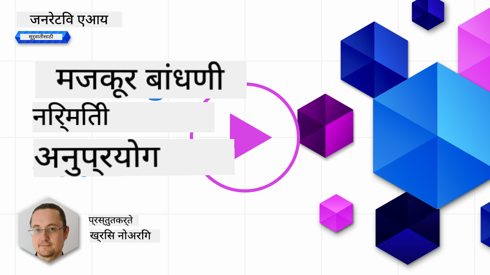

<!--
CO_OP_TRANSLATOR_METADATA:
{
  "original_hash": "5ec6c92b629564538ef397c550adb73e",
  "translation_date": "2025-05-19T16:48:21+00:00",
  "source_file": "06-text-generation-apps/README.md",
  "language_code": "mr"
}
-->
# टेक्स्ट जनरेशन अनुप्रयोग तयार करणे

[](https://aka.ms/gen-ai-lesson6-gh?WT.mc_id=academic-105485-koreyst)

> _(ही धडा पाहण्यासाठी वरील प्रतिमेवर क्लिक करा)_

आत्तापर्यंत तुम्ही या अभ्यासक्रमातून पाहिले आहे की, प्रॉम्प्ट्ससारख्या मुख्य संकल्पना आहेत आणि "प्रॉम्प्ट इंजिनियरिंग" नावाचे एक पूर्ण शास्त्र आहे. ChatGPT, Office 365, Microsoft Power Platform आणि इतर अनेक साधने, तुम्हाला काहीतरी साध्य करण्यासाठी प्रॉम्प्ट्स वापरण्यास समर्थन देतात.

तुम्हाला अॅपमध्ये असा अनुभव जोडण्यासाठी, तुम्हाला प्रॉम्प्ट्स, पूर्णता यांसारख्या संकल्पना समजून घ्याव्या लागतील आणि काम करण्यासाठी एक लायब्ररी निवडावी लागेल. याच गोष्टी तुम्ही या अध्यायात शिकाल.

## परिचय

या अध्यायात तुम्ही:

- openai लायब्ररी आणि तिच्या मुख्य संकल्पनांबद्दल जाणून घ्या.
- openai वापरून एक टेक्स्ट जनरेशन अॅप तयार करा.
- प्रॉम्प्ट, तापमान, आणि टोकन्ससारख्या संकल्पना कशा वापरायच्या हे समजून घ्या.

## शिकण्याची उद्दिष्टे

या धड्याच्या शेवटी, तुम्ही सक्षम असाल:

- टेक्स्ट जनरेशन अॅप म्हणजे काय हे स्पष्ट करा.
- openai वापरून टेक्स्ट जनरेशन अॅप तयार करा.
- तुमच्या अॅपला अधिक किंवा कमी टोकन्स वापरण्यासाठी आणि तापमान बदलण्यासाठी कॉन्फिगर करा, विविध परिणामांसाठी.

## टेक्स्ट जनरेशन अॅप म्हणजे काय?

सामान्यतः जेव्हा तुम्ही अॅप तयार करता तेव्हा त्यात खालीलप्रमाणे काही प्रकारचे इंटरफेस असते:

- कमांड-आधारित. कन्सोल अॅप्स हे सामान्यतः कमांड-आधारित अॅप्स आहेत जिथे तुम्ही एक कमांड टाइप करता आणि ते कार्य पार पाडतात. उदाहरणार्थ, `git` हे एक कमांड-आधारित अॅप आहे.
- युजर इंटरफेस (UI). काही अॅप्समध्ये ग्राफिकल युजर इंटरफेस (GUIs) असतात जिथे तुम्ही बटणे क्लिक करता, मजकूर इनपुट करता, पर्याय निवडता आणि बरेच काही करता.

### कन्सोल आणि UI अॅप्स मर्यादित आहेत

ते एका कमांड-आधारित अॅपशी तुलना करा जिथे तुम्ही एक कमांड टाइप करता:

- **हे मर्यादित आहे**. तुम्ही कोणताही कमांड टाइप करू शकत नाही, फक्त तेच जे अॅप समर्थन करते.
- **भाषा विशेष**. काही अॅप्स अनेक भाषांना समर्थन देतात, परंतु डिफॉल्टनुसार अॅप एक विशिष्ट भाषेसाठी तयार केले जाते, जरी तुम्ही अधिक भाषा समर्थन जोडू शकता.

### टेक्स्ट जनरेशन अॅप्सचे फायदे

तर टेक्स्ट जनरेशन अॅप कसे वेगळे आहे?

टेक्स्ट जनरेशन अॅपमध्ये, तुम्हाला अधिक लवचिकता मिळते, तुम्ही एक कमांड किंवा विशिष्ट इनपुट भाषेच्या संचावर मर्यादित नसता. त्याऐवजी, तुम्ही अॅपशी संवाद साधण्यासाठी नैसर्गिक भाषा वापरू शकता. आणखी एक फायदा म्हणजे तुम्ही आधीच एका डेटासोर्सशी संवाद साधत आहात ज्याचे विशाल माहितीवर प्रशिक्षण दिले गेले आहे, जेथे पारंपारिक अॅप एका डेटाबेसमधील माहितीवर मर्यादित असू शकते.

### टेक्स्ट जनरेशन अॅपसह मी काय तयार करू शकतो?

तुम्ही अनेक गोष्टी तयार करू शकता. उदाहरणार्थ:

- **चॅटबॉट**. तुमच्या कंपनी आणि तिच्या उत्पादनांबद्दल प्रश्नांची उत्तरे देणारा चॅटबॉट चांगला जुळू शकतो.
- **मदतनीस**. LLMs मजकूर संक्षेप करणे, मजकूरातून अंतर्दृष्टी मिळवणे, रेज्युमेसारखा मजकूर तयार करणे आणि बरेच काही करण्यात उत्कृष्ट आहेत.
- **कोड सहाय्यक**. तुम्ही वापरत असलेल्या भाषा मॉडेलच्या आधारावर, तुम्ही कोड लिहिण्यात मदत करणारा कोड सहाय्यक तयार करू शकता. उदाहरणार्थ, तुम्ही GitHub Copilot तसेच ChatGPT सारख्या उत्पादनांचा वापर करून कोड लिहिण्यात मदत करू शकता.

## मी कसे सुरुवात करू शकतो?

तर, तुम्हाला LLM सह एकत्रिकरण करण्याचा एक मार्ग शोधावा लागेल जो सहसा खालील दोन दृष्टिकोनांचा समावेश करतो:

- API वापरा. येथे तुम्ही तुमच्या प्रॉम्प्टसह वेब विनंत्या तयार करत आहात आणि तयार केलेला मजकूर परत मिळवा.
- लायब्ररी वापरा. लायब्ररी API कॉल्स संक्षेपित करण्यात मदत करतात आणि त्यांचा वापर सुलभ करतात.

## लायब्ररी/SDKs

LLMs सह काम करण्यासाठी काही प्रसिद्ध लायब्ररी आहेत जसे की:

- **openai**, ही लायब्ररी तुमच्या मॉडेलशी कनेक्ट होणे आणि प्रॉम्प्ट्स पाठवणे सोपे करते.

त्यानंतर अशा लायब्ररी आहेत ज्या उच्च स्तरावर कार्य करतात जसे की:

- **Langchain**. Langchain प्रसिद्ध आहे आणि Python ला समर्थन देते.
- **Semantic Kernel**. Semantic Kernel ही Microsoft ची लायब्ररी आहे जी C#, Python, आणि Java भाषांना समर्थन देते.

## openai वापरून पहिला अॅप

चला पाहूया की आपण आपला पहिला अॅप कसा तयार करू शकतो, आपल्याला कोणत्या लायब्ररीची आवश्यकता आहे, किती आवश्यक आहे आणि इतर गोष्टी.

### openai इंस्टॉल करा

OpenAI किंवा Azure OpenAI सह संवाद साधण्यासाठी अनेक लायब्ररी उपलब्ध आहेत. अनेक प्रोग्रामिंग भाषांचा वापर करणे देखील शक्य आहे जसे की C#, Python, JavaScript, Java आणि बरेच काही. आम्ही `openai` Python लायब्ररी वापरणे निवडले आहे, त्यामुळे आम्ही `pip` वापरून ते इंस्टॉल करू.

```bash
pip install openai
```

### संसाधन तयार करा

तुम्हाला खालील पायऱ्या पूर्ण कराव्या लागतील:

- Azure वर एक खाते तयार करा [https://azure.microsoft.com/free/](https://azure.microsoft.com/free/?WT.mc_id=academic-105485-koreyst).
- Azure OpenAI मध्ये प्रवेश मिळवा. [https://learn.microsoft.com/azure/ai-services/openai/overview#how-do-i-get-access-to-azure-openai](https://learn.microsoft.com/azure/ai-services/openai/overview#how-do-i-get-access-to-azure-openai?WT.mc_id=academic-105485-koreyst) येथे जा आणि प्रवेशाची विनंती करा.

  > [!NOTE]
  > लिहिण्याच्या वेळी, तुम्हाला Azure OpenAI साठी प्रवेशासाठी अर्ज करावा लागेल.

- Python इंस्टॉल करा <https://www.python.org/>
- Azure OpenAI सेवा संसाधन तयार केले आहे. [संसाधन तयार कसे करावे](https://learn.microsoft.com/azure/ai-services/openai/how-to/create-resource?pivots=web-portal?WT.mc_id=academic-105485-koreyst) हे मार्गदर्शक पहा.

### API की आणि एंडपॉइंट शोधा

या टप्प्यावर, तुम्हाला तुमच्या `openai` लायब्ररीला कोणती API की वापरायची हे सांगावे लागेल. तुमची API की शोधण्यासाठी, Azure OpenAI संसाधनाच्या "Keys and Endpoint" विभागात जा आणि "Key 1" मूल्य कॉपी करा.


आता तुमच्याकडे ही माहिती कॉपी केली आहे, चला लायब्ररींना ती वापरण्याचे निर्देश देऊया.

> [!NOTE]
> तुमची API की तुमच्या कोडपासून वेगळी ठेवणे योग्य आहे. तुम्ही पर्यावरणीय चलांचा वापर करून असे करू शकता.
>
> - पर्यावरणीय चल `OPENAI_API_KEY` to your API key.
>   `export OPENAI_API_KEY='sk-...'` सेट करा

### Azure कॉन्फिगरेशन सेटअप

जर तुम्ही Azure OpenAI वापरत असाल, तर कॉन्फिगरेशन कसे सेट करायचे ते येथे आहे:

```python
openai.api_type = 'azure'
openai.api_key = os.environ["OPENAI_API_KEY"]
openai.api_version = '2023-05-15'
openai.api_base = os.getenv("API_BASE")
```

वरील मध्ये आम्ही खालील सेट करत आहोत:

- `api_type` to `azure`. This tells the library to use Azure OpenAI and not OpenAI.
- `api_key`, this is your API key found in the Azure Portal.
- `api_version`, this is the version of the API you want to use. At the time of writing, the latest version is `2023-05-15`.
- `api_base`, this is the endpoint of the API. You can find it in the Azure Portal next to your API key.

> [!NOTE] > `os.getenv` is a function that reads environment variables. You can use it to read environment variables like `OPENAI_API_KEY` and `API_BASE`. Set these environment variables in your terminal or by using a library like `dotenv`.

## Generate text

The way to generate text is to use the `Completion` वर्ग. येथे एक उदाहरण आहे:

```python
prompt = "Complete the following: Once upon a time there was a"

completion = openai.Completion.create(model="davinci-002", prompt=prompt)
print(completion.choices[0].text)
```

वरील कोडमध्ये, आम्ही एक पूर्णता वस्तु तयार करतो आणि आम्हाला वापरायचे मॉडेल आणि प्रॉम्प्ट पास करतो. नंतर आम्ही तयार केलेला मजकूर प्रिंट करतो.

### चॅट पूर्णता

आत्तापर्यंत, तुम्ही पाहिले आहे की आम्ही `Completion` to generate text. But there's another class called `ChatCompletion` वापरत आहोत जे चॅटबॉट्ससाठी अधिक योग्य आहे. त्याचा वापर कसा करायचा हे येथे एक उदाहरण आहे:

```python
import openai

openai.api_key = "sk-..."

completion = openai.ChatCompletion.create(model="gpt-3.5-turbo", messages=[{"role": "user", "content": "Hello world"}])
print(completion.choices[0].message.content)
```

या कार्यक्षमतेवर अधिक माहिती आगामी अध्यायात मिळेल.

## व्यायाम - तुमचा पहिला टेक्स्ट जनरेशन अॅप

आता आपण openai सेटअप आणि कॉन्फिगर कसे करावे हे शिकले आहे, आता तुमचा पहिला टेक्स्ट जनरेशन अॅप तयार करण्याची वेळ आली आहे. तुमचा अॅप तयार करण्यासाठी, या पायऱ्या अनुसरा:

1. एक वर्चुअल वातावरण तयार करा आणि openai इंस्टॉल करा:

   ```bash
   python -m venv venv
   source venv/bin/activate
   pip install openai
   ```

   > [!NOTE]
   > जर तुम्ही Windows वापरत असाल तर `venv\Scripts\activate` instead of `source venv/bin/activate`.

   > [!NOTE]
   > Locate your Azure OpenAI key by going to [https://portal.azure.com/](https://portal.azure.com/?WT.mc_id=academic-105485-koreyst) and search for `Open AI` and select the `Open AI resource` and then select `Keys and Endpoint` and copy the `Key 1` मूल्य टाइप करा.

1. एक _app.py_ फाइल तयार करा आणि त्यात खालील कोड द्या:

   ```python
   import openai

   openai.api_key = "<replace this value with your open ai key or Azure OpenAI key>"

   openai.api_type = 'azure'
   openai.api_version = '2023-05-15'
   openai.api_base = "<endpoint found in Azure Portal where your API key is>"
   deployment_name = "<deployment name>"

   # add your completion code
   prompt = "Complete the following: Once upon a time there was a"
   messages = [{"role": "user", "content": prompt}]

   # make completion
   completion = openai.chat.completions.create(model=deployment_name, messages=messages)

   # print response
   print(completion.choices[0].message.content)
   ```

   > [!NOTE]
   > जर तुम्ही Azure OpenAI वापरत असाल, तर तुम्हाला `api_type` to `azure` and set the `api_key` तुमच्या Azure OpenAI कीवर सेट करावे लागेल.

   तुम्हाला खालीलप्रमाणे आउटपुट दिसेल:

   ```output
    very unhappy _____.

   Once upon a time there was a very unhappy mermaid.
   ```

## विविध गोष्टींसाठी विविध प्रकारचे प्रॉम्प्ट्स

आता तुम्ही प्रॉम्प्ट वापरून मजकूर कसा तयार करायचा हे पाहिले आहे. तुमच्याकडे एक प्रोग्रामही चालू आहे ज्यात तुम्ही सुधारणा करू शकता आणि विविध प्रकारचे मजकूर तयार करण्यासाठी बदल करू शकता.

प्रॉम्प्ट्स सर्व प्रकारच्या कार्यांसाठी वापरले जाऊ शकतात. उदाहरणार्थ:

- **एका प्रकारचा मजकूर तयार करा**. उदाहरणार्थ, तुम्ही एक कविता तयार करू शकता, क्विझसाठी प्रश्न इत्यादी.
- **माहिती शोधा**. तुम्ही प्रॉम्प्ट्स वापरून माहिती शोधू शकता जसे की 'वेब विकासात CORS म्हणजे काय?'.
- **कोड तयार करा**. तुम्ही प्रॉम्प्ट्स वापरून कोड तयार करू शकता, उदाहरणार्थ ईमेल्सची वैधता तपासण्यासाठी वापरले जाणारे नियमित अभिव्यक्ती विकसित करणे किंवा का नाही एक संपूर्ण प्रोग्राम तयार करणे, जसे की एक वेब अॅप?

## एक अधिक व्यावहारिक उपयोग प्रकरण: एक रेसिपी जनरेटर

कल्पना करा की तुमच्याकडे घरी घटक आहेत आणि तुम्हाला काहीतरी शिजवायचे आहे. त्यासाठी, तुम्हाला एक रेसिपी हवी आहे. रेसिपी शोधण्याचा एक मार्ग म्हणजे सर्च इंजिनचा वापर करणे किंवा तुम्ही LLM चा वापर करून ते करू शकता.

तुम्ही असा प्रॉम्प्ट लिहू शकता:

> "माझ्याकडे असलेल्या घटकांसह डिशसाठी 5 रेसिपी दाखवा: चिकन, बटाटे, आणि गाजर. प्रत्येक रेसिपीसाठी, वापरलेले सर्व घटक सूचीबद्ध करा"

वरील प्रॉम्प्ट दिल्यास, तुम्हाला असा प्रतिसाद मिळू शकतो:

```output
1. Roasted Chicken and Vegetables:
Ingredients:
- 4 chicken thighs
- 2 potatoes, cut into cubes
- 2 carrots, cut into cubes
- 2 tablespoons olive oil
- 2 cloves garlic, minced
- 1 teaspoon dried thyme
- 1 teaspoon dried oregano
- Salt and pepper, to taste

2. Chicken and Potato Stew:
Ingredients:
- 2 tablespoons olive oil
- 1 onion, diced
- 2 cloves garlic, minced
- 2 chicken breasts, cut into cubes
- 2 potatoes, cut into cubes
- 2 carrots, cut into cubes
- 1 teaspoon dried oregano
- 1 teaspoon dried thyme
- 1 cup chicken broth
- Salt and pepper, to taste

3. Chicken and Potato Bake:
Ingredients:
- 2 tablespoons olive oil
- 2 chicken breasts, cut into cubes
- 2 potatoes, cut into cubes
- 2 carrots, cut into cubes
- 1 onion, diced
- 2 cloves garlic, minced
- 1 teaspoon dried oregano
- 1 teaspoon dried thyme
- 1 cup chicken broth
- Salt and pepper, to taste

4. Chicken and Potato Soup:
Ingredients:
- 2 tablespoons olive oil
- 1 onion, diced
- 2 cloves garlic, minced
- 2 chicken breasts, cut into cubes
- 2 potatoes, cut into cubes
- 2 carrots, cut into cubes
- 1 teaspoon dried oregano
- 1 teaspoon dried thyme
- 4 cups chicken broth
- Salt and pepper, to taste

5. Chicken and Potato Hash:
Ingredients:
- 2 tablespoons olive oil
- 2 chicken breasts, cut into cubes
- 2 potatoes, cut into cubes
- 2 carrots, cut into cubes
- 1 onion, diced
- 2 cloves garlic, minced
- 1 teaspoon dried oregano
```

हा परिणाम उत्तम आहे, मला काय शिजवायचे ते माहित आहे. या टप्प्यावर, उपयुक्त सुधारणा काय असू शकतात:

- मला आवडत नाहीत किंवा ज्यांना मी अलर्जिक आहे असे घटक फिल्टर करणे.
- खरेदी यादी तयार करा, जर माझ्याकडे सर्व घटक घरी नसतील तर.

वरील प्रकरणांसाठी, चला एक अतिरिक्त प्रॉम्प्ट जोडूया:

> "कृपया लसूण असलेल्या रेसिपी काढा कारण मला लसूणची अलर्जी आहे आणि काहीतरी दुसऱ्याने बदला. तसेच, कृपया रेसिपीसाठी खरेदी यादी तयार करा, माझ्याकडे आधीच चिकन, बटाटे आणि गाजर आहेत हे लक्षात घेऊन."

आता तुमच्याकडे एक नवीन परिणाम आहे, म्हणजे:

```output
1. Roasted Chicken and Vegetables:
Ingredients:
- 4 chicken thighs
- 2 potatoes, cut into cubes
- 2 carrots, cut into cubes
- 2 tablespoons olive oil
- 1 teaspoon dried thyme
- 1 teaspoon dried oregano
- Salt and pepper, to taste

2. Chicken and Potato Stew:
Ingredients:
- 2 tablespoons olive oil
- 1 onion, diced
- 2 chicken breasts, cut into cubes
- 2 potatoes, cut into cubes
- 2 carrots, cut into cubes
- 1 teaspoon dried oregano
- 1 teaspoon dried thyme
- 1 cup chicken broth
- Salt and pepper, to taste

3. Chicken and Potato Bake:
Ingredients:
- 2 tablespoons olive oil
- 2 chicken breasts, cut into cubes
- 2 potatoes, cut into cubes
- 2 carrots, cut into cubes
- 1 onion, diced
- 1 teaspoon dried oregano
- 1 teaspoon dried thyme
- 1 cup chicken broth
- Salt and pepper, to taste

4. Chicken and Potato Soup:
Ingredients:
- 2 tablespoons olive oil
- 1 onion, diced
- 2 chicken breasts, cut into cubes
- 2 potatoes, cut into cubes
- 2 carrots, cut into cubes
- 1 teaspoon dried oregano
- 1 teaspoon dried thyme
- 4 cups chicken broth
- Salt and pepper, to taste

5. Chicken and Potato Hash:
Ingredients:
- 2 tablespoons olive oil
- 2 chicken breasts, cut into cubes
- 2 potatoes, cut into cubes
- 2 carrots, cut into cubes
- 1 onion, diced
- 1 teaspoon dried oregano

Shopping List:
- Olive oil
- Onion
- Thyme
- Oregano
- Salt
- Pepper
```

ही तुमची पाच रेसिपी आहेत, ज्यात लसूणचा उल्लेख नाही आणि तुमच्याकडे आधीपासूनच घरात असलेल्या गोष्टींचा विचार करून तुमच्याकडे एक खरेदी यादी आहे.

## व्यायाम - एक रेसिपी जनरेटर तयार करा

आता आपण एक परिदृश्य खेळले आहे, चला दर्शवलेल्या परिदृश्याशी जुळण्यासाठी कोड लिहूया. तसे करण्यासाठी, या पायऱ्या अनुसरा:

1. विद्यमान _app.py_ फाइलचा प्रारंभ बिंदू म्हणून वापरा
1. `prompt` चल शोधा आणि त्याचा कोड खालीलप्रमाणे बदला:

   ```python
   prompt = "Show me 5 recipes for a dish with the following ingredients: chicken, potatoes, and carrots. Per recipe, list all the ingredients used"
   ```

   आता तुम्ही कोड चालवता, तुम्हाला खालीलप्रमाणे आउटपुट दिसेल:

   ```output
   -Chicken Stew with Potatoes and Carrots: 3 tablespoons oil, 1 onion, chopped, 2 cloves garlic, minced, 1 carrot, peeled and chopped, 1 potato, peeled and chopped, 1 bay leaf, 1 thyme sprig, 1/2 teaspoon salt, 1/4 teaspoon black pepper, 1 1/2 cups chicken broth, 1/2 cup dry white wine, 2 tablespoons chopped fresh parsley, 2 tablespoons unsalted butter, 1 1/2 pounds boneless, skinless chicken thighs, cut into 1-inch pieces
   -Oven-Roasted Chicken with Potatoes and Carrots: 3 tablespoons extra-virgin olive oil, 1 tablespoon Dijon mustard, 1 tablespoon chopped fresh rosemary, 1 tablespoon chopped fresh thyme, 4 cloves garlic, minced, 1 1/2 pounds small red potatoes, quartered, 1 1/2 pounds carrots, quartered lengthwise, 1/2 teaspoon salt, 1/4 teaspoon black pepper, 1 (4-pound) whole chicken
   -Chicken, Potato, and Carrot Casserole: cooking spray, 1 large onion, chopped, 2 cloves garlic, minced, 1 carrot, peeled and shredded, 1 potato, peeled and shredded, 1/2 teaspoon dried thyme leaves, 1/4 teaspoon salt, 1/4 teaspoon black pepper, 2 cups fat-free, low-sodium chicken broth, 1 cup frozen peas, 1/4 cup all-purpose flour, 1 cup 2% reduced-fat milk, 1/4 cup grated Parmesan cheese

   -One Pot Chicken and Potato Dinner: 2 tablespoons olive oil, 1 pound boneless, skinless chicken thighs, cut into 1-inch pieces, 1 large onion, chopped, 3 cloves garlic, minced, 1 carrot, peeled and chopped, 1 potato, peeled and chopped, 1 bay leaf, 1 thyme sprig, 1/2 teaspoon salt, 1/4 teaspoon black pepper, 2 cups chicken broth, 1/2 cup dry white wine

   -Chicken, Potato, and Carrot Curry: 1 tablespoon vegetable oil, 1 large onion, chopped, 2 cloves garlic, minced, 1 carrot, peeled and chopped, 1 potato, peeled and chopped, 1 teaspoon ground coriander, 1 teaspoon ground cumin, 1/2 teaspoon ground turmeric, 1/2 teaspoon ground ginger, 1/4 teaspoon cayenne pepper, 2 cups chicken broth, 1/2 cup dry white wine, 1 (15-ounce) can chickpeas, drained and rinsed, 1/2 cup raisins, 1/2 cup chopped fresh cilantro
   ```

   > लक्षात ठेवा, तुमचा LLM अनिश्चित आहे, त्यामुळे तुम्हाला प्रोग्राम चालवताना प्रत्येक वेळी वेगवेगळे परिणाम मिळू शकतात.

   छान, चला पाहूया की आपण गोष्टी कशा सुधारू शकतो. गोष्टी सुधारण्यासाठी, आम्हाला कोड लवचिक असल्याचे सुनिश्चित करायचे आहे, त्यामुळे घटक आणि रेसिपींच्या संख्येत सुधारणा आणि बदल होऊ शकतात.

1. चला कोड खालीलप्रमाणे बदलूया:

   ```python
   no_recipes = input("No of recipes (for example, 5): ")

   ingredients = input("List of ingredients (for example, chicken, potatoes, and carrots): ")

   # interpolate the number of recipes into the prompt an ingredients
   prompt = f"Show me {no_recipes} recipes for a dish with the following ingredients: {ingredients}. Per recipe, list all the ingredients used"
   ```

   चाचणीसाठी कोड घेणे, असे दिसू शकते:

   ```output
   No of recipes (for example, 5): 3
   List of ingredients (for example, chicken, potatoes, and carrots): milk,strawberries

   -Strawberry milk shake: milk, strawberries, sugar, vanilla extract, ice cubes
   -Strawberry shortcake: milk, flour, baking powder, sugar, salt, unsalted butter, strawberries, whipped cream
   -Strawberry milk: milk, strawberries, sugar, vanilla extract
   ```

### फिल्टर आणि खरेदी यादी जोडून सुधारणा करा

आता आमच्याकडे रेसिपी तयार करण्यास सक्षम काम करणारा अॅप आहे आणि तो लवचिक आहे कारण तो वापरकर्त्याच्या इनपुटवर अवलंबून आहे, रेसिपींच्या संख्येवर आणि वापरलेल्या घटकांवर.

ते पुढे सुधारण्यासाठी, आम्हाला खालील गोष्टी जोडायच्या आहेत:

- **घटक फिल्टर करा**. आम्हाला आवडत नसलेल्या किंवा ज्यांना आम्हाला अलर्जी आहे अशा घटकांना फिल्टर करण्यास सक्षम व्हायचे आहे. हे बदल साध्य करण्यासाठी, आम्ही आमच्या विद्यमान प्रॉम्प्टमध्ये संपादन करू शकतो आणि त्याच्या शेवटी एक फिल्टर अट जोडू शकतो:

  ```python
  filter = input("Filter (for example, vegetarian, vegan, or gluten-free): ")

  prompt = f"Show me {no_recipes} recipes for a dish with the following ingredients: {ingredients}. Per recipe, list all the ingredients used, no {filter}"
  ```

  वरील मध्ये, आम्ही `{filter}` प्रॉम्प्टच्या शेवटी जोडतो आणि आम्ही वापरकर्त्यापासून फिल्टर मूल्य देखील घेतो.

  प्रोग्राम चालवण्याचे उदाहरण इनपुट आता असे दिसू शकते:

  ```output
  No of recipes (for example, 5): 3
  List of ingredients (for example, chicken, potatoes, and carrots): onion,milk
  Filter (for example, vegetarian, vegan, or gluten-free): no milk

  1. French Onion Soup

  Ingredients:

  -1 large onion, sliced
  -3 cups beef broth
  -1 cup milk
  -6 slices french bread
  -1/4 cup shredded Parmesan cheese
  -1 tablespoon butter
  -1 teaspoon dried thyme
  -1/4 teaspoon salt
  -1/4 teaspoon black pepper

  Instructions:

  1. In a large pot, sauté onions in butter until golden brown.
  2. Add beef broth, milk, thyme, salt, and pepper. Bring to a boil.
  3. Reduce heat and simmer for 10 minutes.
  4. Place french bread slices on soup bowls.
  5. Ladle soup over bread.
  6. Sprinkle with Parmesan cheese.

  2. Onion and Potato Soup

  Ingredients:

  -1 large onion, chopped
  -2 cups potatoes, diced
  -3 cups vegetable broth
  -1 cup milk
  -1/4 teaspoon black pepper

  Instructions:

  1. In a large pot, sauté onions in butter until golden brown.
  2. Add potatoes, vegetable broth, milk, and pepper. Bring to a boil.
  3. Reduce heat and simmer for 10 minutes.
  4. Serve hot.

  3. Creamy Onion Soup

  Ingredients:

  -1 large onion, chopped
  -3 cups vegetable broth
  -1 cup milk
  -1/4 teaspoon black pepper
  -1/4 cup all-purpose flour
  -1/2 cup shredded Parmesan cheese

  Instructions:

  1. In a large pot, sauté onions in butter until golden brown.
  2. Add vegetable broth, milk, and pepper. Bring to a boil.
  3. Reduce heat and simmer for 10 minutes.
  4. In a small bowl, whisk together flour and Parmesan cheese until smooth.
  5. Add to soup and simmer for an additional 5 minutes, or until soup has thickened.
  ```

  जसे तुम्ही पाहू शकता, त्यात दूध असलेल्या कोणत्याही रेसिपी फिल्टर केल्या गेल्या आहेत. परंतु, जर तुम्हाला लॅक्टोजची असहिष्णुता असेल, तर तुम्हाला त्यात चीज असलेल्या रेसिपी देखील फिल्टर करायच्या असतील, त्यामुळे स्पष्टता आवश्यक आहे.

- **खरेदी यादी तयार करा**. आम्हाला आधीपासूनच घरी असलेल्या गोष्टींचा विचार करून खरेदी यादी तयार करायची आहे.

  या कार्यक्षमतेसाठी, आम्ही एकाच प्रॉम्प्टमध्ये सर्व काही सोडवण्याचा प्रयत्न करू शकतो किंवा आम्ही ते दोन प्रॉम्प्टमध्ये विभाजित करू शकतो. चला दुसऱ्या दृष्टिकोनाचा प्रयत्न करूया. येथे आम्ही एक अतिरिक्त प्रॉम्प्ट जोडण्याचा सुचवतो आहोत, परंतु ते कार्य करण्यासाठी, आम्हाला पहिल्या प्रॉम्प्टच्या परिणामास नवीन प्रॉम्प्टच्या संदर्भ म्हणून जोडावे लागेल.

  पहिल्या प्रॉम्प्टच्या परिणामावरून परिणाम प्रिंट करणाऱ्या कोडच्या भागाला शोधा आणि खालील कोड जोडा:

  ```python
  old_prompt_result = completion.choices[0].message.content
  prompt = "Produce a shopping list for the generated recipes and please don't include ingredients that I already have."

  new_prompt = f"{old_prompt_result} {prompt}"
  messages = [{"role": "user", "content": new_prompt}]
  completion = openai.Completion.create(engine=deployment_name, messages=messages, max_tokens=1200)

  # print response
  print("Shopping list:")
  print(completion.choices[0].message.content)
  ```

  खालील गोष्टी लक्षात ठेवा:

  1. आम्ही नवीन प्रॉम्प्ट तयार करत आहोत जे पहिल्या

**अस्वीकृति**:  
हा दस्तऐवज AI अनुवाद सेवा [Co-op Translator](https://github.com/Azure/co-op-translator) वापरून अनुवादित करण्यात आला आहे. आम्ही अचूकतेसाठी प्रयत्नशील असलो तरी कृपया लक्षात ठेवा की स्वयंचलित अनुवादांमध्ये त्रुटी किंवा अपूर्णता असू शकते. मूळ भाषेतील दस्तऐवज हा अधिकारिक स्रोत मानला जावा. महत्त्वपूर्ण माहितीच्या बाबतीत, व्यावसायिक मानवी अनुवादाची शिफारस केली जाते. या अनुवादाचा वापर करून उद्भवणाऱ्या कोणत्याही गैरसमज किंवा चुकीच्या अर्थासाठी आम्ही जबाबदार नाही.