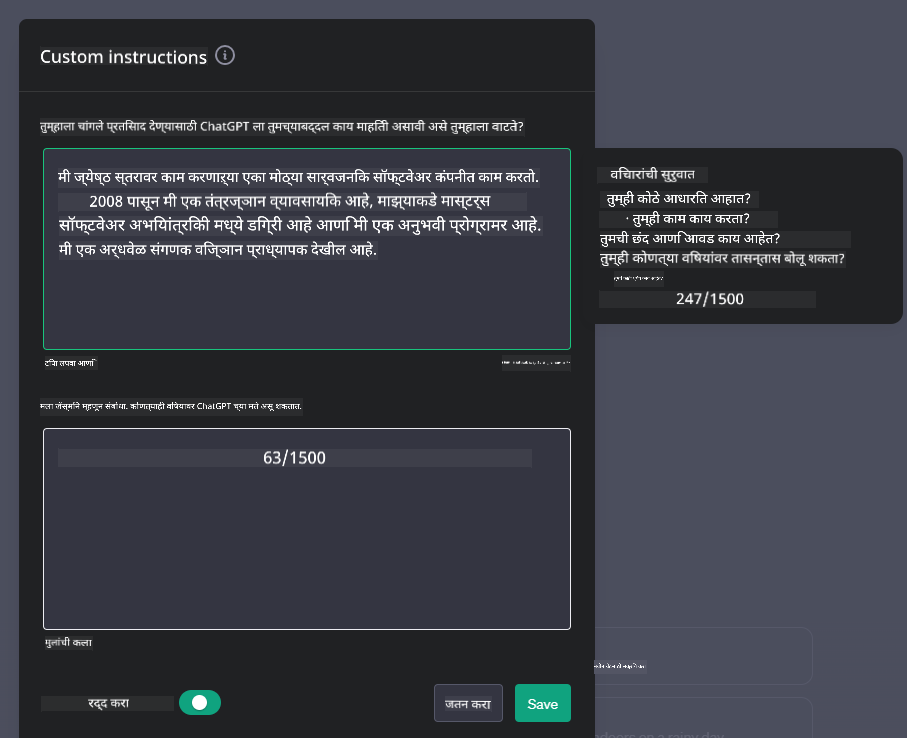
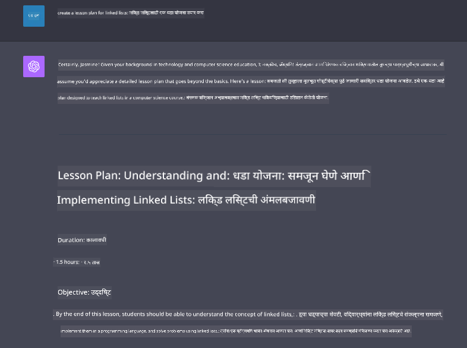

<!--
CO_OP_TRANSLATOR_METADATA:
{
  "original_hash": "ea4bbe640847aafbbba14dae4625e9af",
  "translation_date": "2025-05-19T17:41:56+00:00",
  "source_file": "07-building-chat-applications/README.md",
  "language_code": "mr"
}
-->
# जनरेटिव AI-सक्षम चॅट अनुप्रयोग तयार करणे

[](https://aka.ms/gen-ai-lessons7-gh?WT.mc_id=academic-105485-koreyst)

> _(या धड्याचा व्हिडिओ पाहण्यासाठी वरच्या प्रतिमेवर क्लिक करा)_

आता आपण पाहिले आहे की टेक्स्ट-जनरेशन अॅप्स कसे तयार करायचे, चला चॅट अॅप्लिकेशन्सकडे पाहूया.

चॅट अनुप्रयोग आमच्या दैनंदिन जीवनात एकत्रित झाले आहेत, केवळ साध्या संभाषणाच्या माध्यमापेक्षा अधिक देत आहेत. ते ग्राहक सेवा, तांत्रिक समर्थन आणि अगदी परिष्कृत सल्लागार प्रणालींचे अविभाज्य भाग आहेत. कदाचित तुम्हाला काही काळापूर्वी चॅट अनुप्रयोगातून काही मदत मिळाली असेल. जेव्हा आपण या प्लॅटफॉर्ममध्ये जनरेटिव AI सारख्या अधिक प्रगत तंत्रज्ञानाचे एकत्रीकरण करतो, तेव्हा जटिलता वाढते आणि त्यामुळे आव्हानेही वाढतात.

काही प्रश्न ज्यांची उत्तरे आपल्याला मिळायला हवीत:

- **अॅप तयार करणे**. आम्ही विशिष्ट वापर प्रकरणांसाठी या AI-सक्षम अनुप्रयोगांना कार्यक्षमतेने कसे तयार करतो आणि अखंडपणे एकत्रित करतो?
- **निगराणी**. तैनात केल्यानंतर, कार्यक्षमता आणि [जबाबदार AI चे सहा तत्त्वे](https://www.microsoft.com/ai/responsible-ai?WT.mc_id=academic-105485-koreyst) पाळून अनुप्रयोग उच्च दर्जाच्या कार्यरत आहेत याची आम्ही कशी खात्री करू शकतो?

जसे आपण स्वयंचलितता आणि अखंड मानवी-मशीन संवादाने परिभाषित केलेल्या युगाकडे जातो, जनरेटिव AI चॅट अनुप्रयोगांच्या व्याप्ती, खोली आणि अनुकूलतेला कसे रूपांतरित करते हे समजून घेणे आवश्यक आहे. हा धडा या गुंतागुंतीच्या प्रणालींना समर्थन देणाऱ्या आर्किटेक्चरच्या पैलूंची चौकशी करेल, त्यांना डोमेन-विशिष्ट कार्यांसाठी ट्यून करण्याच्या पद्धतींची तपासणी करेल आणि जबाबदार AI तैनाती सुनिश्चित करण्यासाठी संबंधित मेट्रिक्स आणि विचारांचा आढावा घेईल.

## परिचय

हा धडा समाविष्ट करतो:

- चॅट अनुप्रयोग कार्यक्षमतेने तयार करण्यासाठी आणि एकत्रित करण्याच्या तंत्रांचा अभ्यास.
- अनुप्रयोगांमध्ये सानुकूलन आणि ट्यूनिंग लागू कसे करावे.
- चॅट अनुप्रयोग प्रभावीपणे कसे मॉनिटर करावे यासाठी धोरणे आणि विचार.

## शिकण्याची उद्दिष्टे

या धड्याच्या शेवटी, आपण सक्षम असाल:

- विद्यमान प्रणालींमध्ये चॅट अनुप्रयोग तयार करण्यासाठी आणि एकत्रित करण्यासाठी विचार करण्यायोग्य बाबी वर्णन करा.
- विशिष्ट वापर प्रकरणांसाठी चॅट अनुप्रयोग सानुकूलित करा.
- AI-सक्षम चॅट अनुप्रयोगांची गुणवत्ता प्रभावीपणे मॉनिटर आणि राखण्यासाठी प्रमुख मेट्रिक्स आणि विचार ओळखा.
- चॅट अनुप्रयोग AI जबाबदारीने वापरतात याची खात्री करा.

## चॅट अनुप्रयोगांमध्ये जनरेटिव AI चे एकत्रीकरण

जनरेटिव AI द्वारे चॅट अनुप्रयोग उंचावणे केवळ त्यांना अधिक हुशार बनवण्यावर केंद्रित नाही; हे त्यांची आर्किटेक्चर, कार्यक्षमता आणि वापरकर्ता इंटरफेस अनुकूलित करण्याबद्दल आहे जेणेकरून दर्जेदार वापरकर्ता अनुभव प्रदान करता येईल. यामध्ये आर्किटेक्चरल फाउंडेशन, API एकत्रीकरण आणि वापरकर्ता इंटरफेस विचारांची तपासणी करणे समाविष्ट आहे. ही विभाग तुम्हाला या जटिल लँडस्केप्समधून मार्गदर्शन करण्यासाठी एक सर्वसमावेशक रोडमॅप ऑफर करण्याचे उद्दिष्ट ठेवते, तुम्ही त्यांना विद्यमान प्रणालींमध्ये प्लग करत असाल किंवा स्टँड-अलोन प्लॅटफॉर्म म्हणून तयार करत असाल.

या विभागाच्या शेवटी, तुम्ही चॅट अनुप्रयोग कार्यक्षमतेने तयार आणि समाविष्ट करण्यासाठी आवश्यक तज्ज्ञतेने सुसज्ज असाल.

### चॅटबॉट किंवा चॅट अनुप्रयोग?

चॅट अनुप्रयोग तयार करण्यापूर्वी, 'चॅटबॉट्स' विरुद्ध 'AI-सक्षम चॅट अनुप्रयोग' यांची तुलना करूया, जे वेगवेगळ्या भूमिका आणि कार्ये बजावतात. चॅटबॉटचे मुख्य उद्दिष्ट विशिष्ट संभाषणात्मक कार्ये स्वयंचलित करणे आहे, जसे की वारंवार विचारले जाणारे प्रश्नांची उत्तरे देणे किंवा पॅकेज ट्रॅक करणे. हे सहसा नियम-आधारित लॉजिक किंवा जटिल AI अल्गोरिदमद्वारे नियंत्रित केले जाते. याउलट, AI-सक्षम चॅट अनुप्रयोग हे एक खूपच विस्तृत वातावरण आहे जे मानवी वापरकर्त्यांमधील विविध प्रकारच्या डिजिटल संवादांना सुलभ करण्यासाठी डिझाइन केलेले आहे, जसे की टेक्स्ट, व्हॉईस आणि व्हिडिओ चॅट्स. याचे परिभाषित वैशिष्ट्य म्हणजे जनरेटिव AI मॉडेलचे एकत्रीकरण जे सूक्ष्म, मानवीसारख्या संभाषणांचे अनुकरण करते, विविध प्रकारच्या इनपुट आणि संदर्भात्मक संकेतांवर आधारित प्रतिसाद तयार करते. जनरेटिव AI-सक्षम चॅट अनुप्रयोग खुले-डोमेन चर्चेत सहभागी होऊ शकतो, विकसित होणाऱ्या संभाषणाच्या संदर्भांशी जुळवून घेऊ शकतो आणि अगदी सर्जनशील किंवा जटिल संवाद देखील तयार करू शकतो.

खालील तक्ता डिजिटल संवादातील त्यांच्या अद्वितीय भूमिकांचे समजून घेण्यासाठी मुख्य फरक आणि साम्य रेखाटतो.

| चॅटबॉट                              | जनरेटिव AI-सक्षम चॅट अनुप्रयोग        |
| ------------------------------------- | -------------------------------------- |
| कार्य-केंद्रित आणि नियम-आधारित     | संदर्भ-जागरूक                          |
| मोठ्या प्रणालींमध्ये सहसा समाविष्ट  | एक किंवा अनेक चॅटबॉट्स होस्ट करू शकतो |
| प्रोग्राम केलेल्या कार्यांपुरते मर्यादित | जनरेटिव AI मॉडेल्स समाविष्ट करतो      |
| विशेषीकृत आणि संरचित संवाद          | खुले-डोमेन चर्चेसाठी सक्षम            |

### SDKs आणि APIs सह पूर्व-निर्मित कार्यक्षमतेचा लाभ घेणे

चॅट अनुप्रयोग तयार करताना, एक उत्तम पहिला टप्पा म्हणजे बाहेर काय आहे ते मूल्यांकन करणे. SDKs आणि APIs चा वापर करून चॅट अनुप्रयोग तयार करणे विविध कारणांमुळे एक फायदेशीर धोरण आहे. चांगले दस्तऐवजीकृत SDKs आणि APIs एकत्रित करून, तुम्ही दीर्घकालीन यशासाठी तुमच्या अनुप्रयोगाचे धोरणात्मकपणे स्थान निश्चित करत आहात, स्केलेबिलिटी आणि देखभाल समस्यांचे निराकरण करत आहात.

- **विकास प्रक्रिया गती वाढवते आणि ओव्हरहेड कमी करते**: स्वतःच तयार करण्याच्या महागड्या प्रक्रियेच्या ऐवजी पूर्व-निर्मित कार्यक्षमतेवर अवलंबून राहणे तुम्हाला तुमच्या अनुप्रयोगाच्या इतर पैलूंवर लक्ष केंद्रित करण्यास अनुमती देते, जसे की व्यवसाय लॉजिक.
- **चांगली कार्यक्षमता**: जेव्हा तुम्ही शून्यातून कार्यक्षमता तयार करता, तेव्हा तुम्ही स्वतःला विचाराल "हे कसे स्केल होते? हे अनुप्रयोग वापरकर्त्यांच्या अचानक वाढीला हाताळण्यास सक्षम आहे का?" चांगले देखरेख केलेले SDK आणि API सहसा या समस्यांसाठी अंगभूत उपाय आहेत.
- **सुलभ देखभाल**: अद्यतने आणि सुधारणा व्यवस्थापित करणे सोपे आहे कारण बहुतेक APIs आणि SDKs ला फक्त लायब्ररी अद्यतनाची आवश्यकता असते जेव्हा नवीन आवृत्ती रिलीज केली जाते.
- **अत्याधुनिक तंत्रज्ञानाचा प्रवेश**: विस्तृत डेटासेटवर दंड-ट्यून केलेले आणि प्रशिक्षित मॉडेल्सचा लाभ घेणे तुमच्या अनुप्रयोगाला नैसर्गिक भाषा क्षमता प्रदान करते.

SDK किंवा API ची कार्यक्षमता ऍक्सेस करणे सहसा प्रदान केलेल्या सेवांचा वापर करण्याची परवानगी मिळविण्यात समाविष्ट असते, जे अनेकदा अद्वितीय की किंवा प्रमाणीकरण टोकनच्या वापराद्वारे असते. आम्ही OpenAI Python लायब्ररीचा वापर करून हे कसे दिसते ते शोधू. तुम्ही स्वतः देखील खालील [OpenAI साठी नोटबुक](../../../07-building-chat-applications/python/oai-assignment.ipynb) किंवा [Azure OpenAI सेवांसाठी नोटबुक](../../../07-building-chat-applications/python/aoai-assignment.ipynb) मध्ये प्रयत्न करू शकता.

```python
import os
from openai import OpenAI

API_KEY = os.getenv("OPENAI_API_KEY","")

client = OpenAI(
    api_key=API_KEY
    )

chat_completion = client.chat.completions.create(model="gpt-3.5-turbo", messages=[{"role": "user", "content": "Suggest two titles for an instructional lesson on chat applications for generative AI."}])
```

वरील उदाहरणात GPT-3.5 टर्बो मॉडेलचा वापर करून प्रॉम्प्ट पूर्ण केला आहे, परंतु लक्षात घ्या की API की सेट करण्यापूर्वी आहे. जर तुम्ही की सेट केली नाही तर तुम्हाला त्रुटी मिळेल.

## वापरकर्ता अनुभव (UX)

सामान्य UX तत्त्वे चॅट अनुप्रयोगांना लागू होतात, परंतु मशीन लर्निंग घटकांमुळे काही अतिरिक्त विचार विशेषतः महत्त्वाचे होतात.

- **अस्पष्टता दूर करण्याचा यंत्रणा**: जनरेटिव AI मॉडेल्स कधीकधी अस्पष्ट उत्तर तयार करतात. वापरकर्त्यांना स्पष्टीकरण विचारण्याची परवानगी देणारी वैशिष्ट्य उपयुक्त ठरू शकते.
- **संदर्भ धारणा**: प्रगत जनरेटिव AI मॉडेल्समध्ये संभाषणाच्या संदर्भात लक्षात ठेवण्याची क्षमता आहे, जी वापरकर्ता अनुभवासाठी आवश्यक असू शकते. वापरकर्त्यांना संदर्भ नियंत्रित आणि व्यवस्थापित करण्याची क्षमता देणे वापरकर्ता अनुभव सुधारते, परंतु संवेदनशील वापरकर्ता माहिती टिकवून ठेवण्याचा धोका आणते. या माहितीचे किती काळ संग्रहित केले जाते यासाठी विचार करण्यासारखे, जसे की धारणा धोरण सादर करणे, गोपनीयतेविरुद्ध संदर्भाची गरज संतुलित करू शकते.
- **वैयक्तिकरण**: शिकण्याची आणि जुळवून घेण्याची क्षमता असलेल्या AI मॉडेल्स वापरकर्त्यासाठी वैयक्तिक अनुभव देतात. वापरकर्ता प्रोफाइल सारख्या वैशिष्ट्यांद्वारे वापरकर्ता अनुभवाला अनुरूप करणे केवळ वापरकर्त्याला समजलेले वाटत नाही, तर विशिष्ट उत्तरे शोधण्याच्या त्यांच्या प्रयत्नांना मदत करते, अधिक कार्यक्षम आणि समाधानकारक संवाद तयार करते.

OpenAI च्या ChatGPT मधील "सानुकूल सूचना" सेटिंग्जचे एक उदाहरण आहे. हे तुम्हाला तुमच्या प्रॉम्प्टसाठी महत्त्वाचा संदर्भ असू शकतो अशी तुमच्याबद्दलची माहिती प्रदान करण्याची परवानगी देते. सानुकूल सूचना एक उदाहरण येथे आहे.



हे "प्रोफाइल" ChatGPT ला लिंक्ड लिस्टवर धडा योजना तयार करण्यास प्रवृत्त करते. लक्षात घ्या की ChatGPT लक्षात घेतो की वापरकर्त्याला तिच्या अनुभवावर आधारित अधिक सखोल धडा योजना हवी असू शकते.



### मोठ्या भाषा मॉडेल्ससाठी मायक्रोसॉफ्टचा सिस्टम मेसेज फ्रेमवर्क

[मायक्रोसॉफ्टने मार्गदर्शन प्रदान केले आहे](https://learn.microsoft.com/azure/ai-services/openai/concepts/system-message#define-the-models-output-format?WT.mc_id=academic-105485-koreyst) LLM कडून प्रतिसाद तयार करताना प्रभावी प्रणाली संदेश लिहिण्यासाठी 4 क्षेत्रांमध्ये विभागले गेले:

1. मॉडेल कोणासाठी आहे तसेच त्याच्या क्षमता आणि मर्यादा परिभाषित करणे.
2. मॉडेलच्या आउटपुट स्वरूपाचे परिभाषित करणे.
3. मॉडेलच्या इच्छित वर्तनाचे प्रदर्शन करणारी विशिष्ट उदाहरणे प्रदान करणे.
4. अतिरिक्त वर्तनात्मक गार्डरेल प्रदान करणे.

### प्रवेशयोग्यता

वापरकर्त्याला व्हिज्युअल, श्रवण, मोटर किंवा संज्ञानात्मक दुर्बलता असो, एक चांगले डिझाइन केलेले चॅट अनुप्रयोग सर्वांनी वापरण्यायोग्य असावे. खालील सूची विविध वापरकर्त्यांच्या दुर्बलतेसाठी प्रवेशयोग्यता वाढविण्यासाठी उद्दिष्ट असलेल्या विशिष्ट वैशिष्ट्यांचे विघटन करते.

- **दृष्टी दुर्बलतेसाठी वैशिष्ट्ये**: उच्च कॉन्ट्रास्ट थीम आणि आकार बदलणारा मजकूर, स्क्रीन रीडर सुसंगतता.
- **श्रवण दुर्बलतेसाठी वैशिष्ट्ये**: टेक्स्ट-टू-स्पीच आणि स्पीच-टू-टेक्स्ट फंक्शन्स, ऑडिओ सूचना साठी व्हिज्युअल संकेत.
- **मोटर दुर्बलतेसाठी वैशिष्ट्ये**: कीबोर्ड नेव्हिगेशन समर्थन, व्हॉइस कमांड.
- **संज्ञानात्मक दुर्बलतेसाठी वैशिष्ट्ये**: सोप्या भाषेचे पर्याय.

## डोमेन-विशिष्ट भाषा मॉडेल्ससाठी सानुकूलन आणि ट्यूनिंग

कल्पना करा की एक चॅट अनुप्रयोग जो तुमच्या कंपनीची भाषा समजतो आणि त्याच्या वापरकर्ता बेसला सामान्यत: असलेल्या विशिष्ट प्रश्नांची अपेक्षा करतो. उल्लेख करण्यायोग्य दोन दृष्टिकोन आहेत:

- **DSL मॉडेल्सचा लाभ घेणे**. DSL म्हणजे डोमेन विशिष्ट भाषा. तुम्ही तथाकथित DSL मॉडेलचा लाभ घेऊ शकता जो विशिष्ट डोमेनवर प्रशिक्षित केलेला आहे त्याच्या संकल्पना आणि परिस्थिती समजून घेण्यासाठी.
- **ट्यूनिंग लागू करा**. ट्यूनिंग ही तुमच्या मॉडेलला विशिष्ट डेटासह पुढे प्रशिक्षण देण्याची प्रक्रिया आहे.

## सानुकूलन: DSL वापरणे

डोमेन-विशिष्ट भाषा मॉडेल्स (DSL मॉडेल्स) चा लाभ घेणे वापरकर्ता सहभाग वाढवू शकतो आणि विशेष, संदर्भानुसार संबंधित संवाद प्रदान करून. हे एक मॉडेल आहे जे विशिष्ट क्षेत्र, उद्योग किंवा विषयाशी संबंधित मजकूर समजून घेण्यासाठी आणि तयार करण्यासाठी प्रशिक्षित किंवा ट्यून केले जाते. DSL मॉडेल वापरण्याचे पर्याय शून्यातून एक प्रशिक्षण देण्यापासून ते SDKs आणि APIs द्वारे आधीपासून अस्तित्वात असलेले वापरण्यापर्यंत भिन्न असू शकतात. आणखी एक पर्याय म्हणजे ट्यूनिंग, ज्यामध्ये विद्यमान पूर्व-प्रशिक्षित मॉडेल घेणे आणि विशिष्ट डोमेनसाठी त्याचे रुपांतर करणे समाविष्ट आहे.

## सानुकूलन: ट्यूनिंग लागू करा

जेव्हा पूर्व-प्रशिक्षित मॉडेल विशेष डोमेन किंवा विशिष्ट कार्यात अपयशी ठरते तेव्हा ट्यूनिंगचा विचार केला जातो.

उदाहरणार्थ, वैद्यकीय क्वेरी जटिल असतात आणि त्यांना भरपूर संदर्भाची आवश्यकता असते. जेव्हा वैद्यकीय व्यावसायिक रुग्णाचे निदान करतात तेव्हा ते जीवनशैली किंवा पूर्व-अस्तित्व असलेल्या परिस्थिती सारख्या विविध घटकांवर आधारित असते आणि त्यांच्या निदानाची पुष्टी करण्यासाठी अलीकडील वैद्यकीय जर्नल्सवर देखील अवलंबून असते. अशा सूक्ष्म परिस्थितींमध्ये, सामान्य-उद्देशीय AI चॅट अनुप्रयोग एक विश्वसनीय स्त्रोत असू शकत नाही.

### परिस्थिती: एक वैद्यकीय अनुप्रयोग

वैद्यकीय व्यावसायिकांना उपचार मार्गदर्शक तत्त्वे, औषध परस्पर क्रिया किंवा अलीकडील संशोधन निष्कर्षांवर जलद संदर्भ प्रदान करून सहाय्य करण्यासाठी डिझाइन केलेले चॅट अनुप्रयोग विचारात घ्या.

सामान्य-उद्देशीय मॉडेल मूलभूत वैद्यकीय प्रश्नांची उत्तरे देण्यासाठी किंवा सामान्य सल्ला देण्यासाठी पुरेसे असू शकते, परंतु ते खालील गोष्टींमध्ये संघर्ष करू शकते:

- **अत्यंत विशिष्ट किंवा जटिल प्रकरणे**. उदाहरणार्थ, न्यूरोलॉजिस्ट अनुप्रयोगाला विचारू शकतो, "बालरोग रुग्णांमध्ये औषध-प्रतिरोधक मिरगी व्यवस्थापित करण्यासाठी सध्याच्या सर्वोत्तम पद्धती कोणत्या आहेत?"
- **अलीकडील प्रगतीचा अभाव**. सामान्य-उद्देशीय मॉडेलला न्यूरोलॉजी आणि फार्माकोलॉजीमधील सर्वात अलीकडील प्रगतीचा समावेश असलेले सध्याचे उत्तर देण्यास संघर्ष होऊ शकतो.

अशा प्रसंगी, विशेष वैद्यकीय डेटासेटसह मॉडेलचे ट्यूनिंग करणे या गुंतागुंतीच्या वैद्यकीय चौकशी अधिक अचूकपणे आणि विश्वासार्हपणे हाताळण्याची

**अस्वीकृती**:  
हा दस्तऐवज AI अनुवाद सेवा [Co-op Translator](https://github.com/Azure/co-op-translator) वापरून अनुवादित करण्यात आला आहे. आम्ही अचूकतेसाठी प्रयत्नशील असलो तरी कृपया लक्षात ठेवा की स्वयंचलित अनुवादांमध्ये चुका किंवा अचूकतेचा अभाव असू शकतो. मूळ भाषेतील दस्तऐवज अधिकृत स्रोत म्हणून विचारात घेतला पाहिजे. महत्त्वपूर्ण माहितीसाठी, व्यावसायिक मानवी अनुवादाची शिफारस केली जाते. या अनुवादाच्या वापरामुळे उद्भवलेल्या कोणत्याही गैरसमजुतींसाठी किंवा चुकीच्या अर्थ लावण्यास आम्ही जबाबदार नाही.