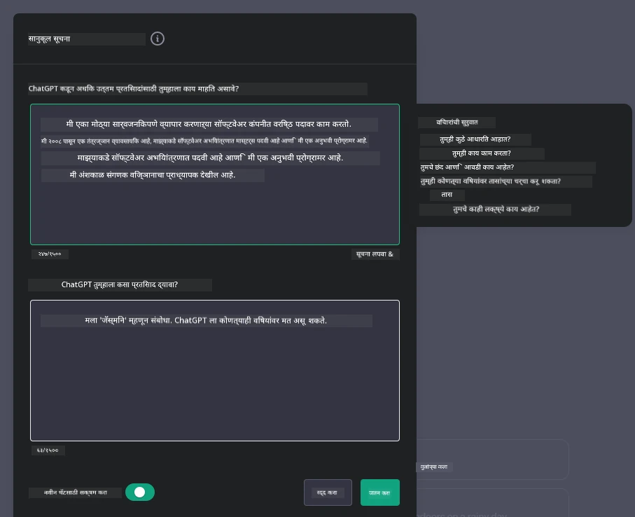
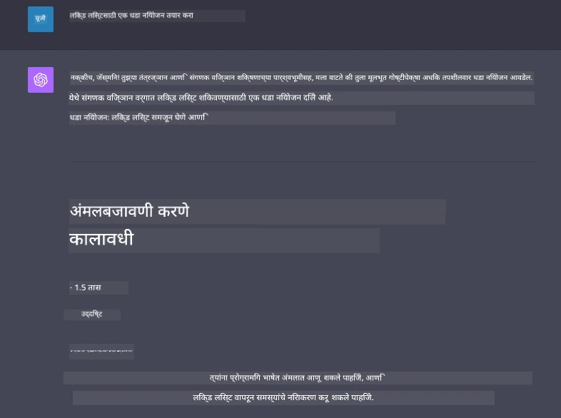

# जनरेटिव्ह AI-संचालित चॅट अनुप्रयोग तयार करणे

[](https://youtu.be/R9V0ZY1BEQo?si=IHuU-fS9YWT8s4sA)

> _(या धड्याचे व्हिडिओ पाहण्यासाठी वरील प्रतिमावर क्लिक करा)_

आता आपण टेक्स्ट-जनरेशन अॅप्स कसे तयार करू शकतो हे पाहिल्यानंतर, चॅट अनुप्रयोगांकडे पाहूया.

चॅट अनुप्रयोग आपल्याच्या दररोजच्या आयुष्यात समाविष्ट झाले आहेत, केवळ सामान्य संभाषणाचा माध्यम नसून. ते ग्राहक सेवा, तांत्रिक समर्थन आणि अगदी प्रगत सल्लागार प्रणालींचा एक अविभाज्य भाग आहेत. कदाचित तुम्हाला काही काळापूर्वीच एका चॅट अनुप्रयोगाकडून मदत मिळाली असेल. आपण जनरेटिव्ह AI सारख्या प्रगत तंत्रज्ञानांचा वापर या प्लॅटफॉर्ममध्ये करत असताना, गुंतागुंत वाढते आणि त्यासोबत आव्हाने सुध्दा वाढतात.

काही प्रश्नांची उत्तरे आपल्याला शोधायची आहेत:

- **अॅप तयार करणे.** विशिष्ट वापर प्रकरणांसाठी या AI-संचालित अनुप्रयोगांना कार्यक्षमपणे कसे तयार आणि अखंडपणे एकत्रित करावे?
- **निगराणी.** तैनात केल्यानंतर, अनुप्रयोग कार्यक्षमतेच्या आणि [जबाबदार AI च्या सहा तत्त्वांचे](https://www.microsoft.com/ai/responsible-ai?WT.mc_id=academic-105485-koreyst) पालनाच्या दृष्टीने उच्च गुणवत्तेवर चालत आहे याची कशी देखरेख करायची?

आपण स्वयंचलन आणि अखंड मानव-यंत्र संवादांनी परिभाषित काळात पुढे जात असताना, जनरेटिव्ह AI चॅट अनुप्रयोगांच्या व्याप्ती, सखोलता आणि समायोजित क्षमतेत कशी बदल घडवुन आणतो हे समजून घेणे आवश्यक होते. हा धडा अशा प्रणालींना आधार देणाऱ्या आर्किटेक्चरच्या बाबींचा अभ्यास करेल, विशिष्ट कार्यांसाठी त्यांचे फाइन-ट्यूनिंग कसे करायचे हे पाहील, आणि जबाबदार AI तैनात करण्यासाठी संबंधित मेट्रिक्स आणि विचारसरणीचे मूल्यमापन करेल.

## परिचय

हा धडा खालील विषयांचा समावेश करतो:

- चॅट अनुप्रयोग कार्यक्षमपणे तयार करण्याच्या आणि एकत्रित करण्याच्या तंत्रांचा आढावा.
- अनुप्रयोगांवर सानुकूलन आणि फाइन-ट्यूनिंग लागू करण्याचे मार्ग.
- चॅट अनुप्रयोगांची प्रभावीपणे देखरेख करण्यासाठी धोरणे आणि विचारसरणी.

## शिकण्याचे उद्दिष्टे

या धड्याच्या शेवटी, तुम्हाला खालील गोष्टी करता येतील:

- चॅट अनुप्रयोग तयार करताना आणि विद्यमान प्रणालींमध्ये एकत्रित करताना विचार करण्याच्या बाबी वर्णन करणे.
- विशिष्ट वापर प्रकरणांसाठी चॅट अनुप्रयोग सानुकूलित करणे.
- AI-संचालित चॅट अनुप्रयोगांची गुणवत्ता प्रभावीरीत्या देखरेख करण्यासाठी महत्वाच्या मेट्रिक्स आणि विचारसरणी ओळखणे.
- चॅट अनुप्रयोग AI जबाबदारीने वापरतात याची खात्री करणे.

## चॅट अनुप्रयोगांमध्ये जनरेटिव्ह AI चे एकत्रीकरण

जनरेटिव्ह AI च्या माध्यमातून चॅट अनुप्रयोग वाढविणे म्हणजे केवळ त्यांना अधिक हुशार बनविणे नाही; तर त्यांची आर्किटेक्चर, कार्यक्षमता आणि वापरकर्ता इंटरफेस ऑप्टिमाइझ करणे आहे जेणेकरून दर्जेदार वापरकर्ता अनुभव मिळू शकेल. यात आर्किटेक्चरल मूलभूत तत्त्वांचा, API इंटिग्रेशन्स आणि वापरकर्ता इंटरफेस विचारांची तपासणी समाविष्ट आहे. हा विभाग तुम्हाला या गुंतागुंतीच्या क्षेत्रातून मार्गदर्शन करण्यासाठी एक व्यापक नकाशा देण्याचा प्रयत्न करतो, मग तुम्ही त्यांना विद्यमान प्रणालींमध्ये जोडत असो किंवा स्वतंत्र प्लॅटफॉर्म म्हणून तयार करत असो.

या विभागाच्या शेवटी, तुम्हाला चॅट अनुप्रयोग कार्यक्षमपणे तयार आणि समाकलित करण्यासाठी आवश्यक तज्ञता मिळेल.

### चॅटबॉट की चॅट अनुप्रयोग?

चॅट अनुप्रयोग तयार करण्यापूर्वी, 'चॅटबॉट' आणि 'AI-संचालित चॅट अनुप्रयोग' यांच्या तुलनेवर चर्चा करूया, जे वेगवेगळ्या भूमिका आणि कार्यक्षमता बजावतात. चॅटबॉटची मुख्य उद्दिष्ट विशिष्ट संभाषणात्मक कार्यांना स्वयंचलित करणे आहे, जसे की नेहमी विचारले जाणारे प्रश्नांची उत्तरे देणे किंवा पॅकेज ट्रॅक करणे. त्याला सहसा नियमाधारित लॉजिक किंवा गुंतागुंतीचे AI अल्गोरिदम नियंत्रित करतात. त्याच्या उलट, AI-संचालित चॅट अनुप्रयोग हा एक जास्त व्यापक वातावरण आहे जो मानवी वापरकर्त्यांमधील मजकूर, आवाज, आणि व्हिडिओ चॅट सारख्या विविध डिजिटल संवाद सुविधा प्रदान करतो. त्याची विशेषता म्हणजे जनरेटिव्ह AI मॉडेल एकत्र करणे, जे सूक्ष्म, मानवी-सरखे संभाषण साकारतो, विविध इनपुट आणि संदर्भात्मक संकेतांवर आधारित प्रतिसाद तयार करतो. जनरेटिव्ह AI संचालित चॅट अनुप्रयोग मुक्त-डोमेन चर्चा करू शकतो, बदलत्या संभाषण संदर्भानुसार अनुकूलित होऊ शकतो, आणि क्रिएटिव्ह किंवा गुंतागुंतीच्या संवादांची निर्मिती करू शकतो.

खालील तक्ता आपल्याला त्यांची डिजिटल संवादातील अनन्य भूमिका समजून घेण्यासाठी मुख्य फरक आणि साम्ये दर्शवितो.

| चॅटबॉट                               | जनरेटिव्ह AI-संचालित चॅट अनुप्रयोग |
| ------------------------------------- | -------------------------------------- |
| कार्य-केंद्रित आणि नियमाधारित          | संदर्भ-जाणकार                              |
| अनेकदा मोठ्या प्रणालींमध्ये एकत्रित    | एक किंवा अनेक चॅटबॉट होस्ट करू शकतो       |
| प्रोग्राम केलेल्या कार्यांपुरते मर्यादित    | जनरेटिव्ह AI मॉडेल समाविष्ट करतो           |
| विशेषीकृत आणि संरचित संवाद                | मुक्त-डोमेन चर्चांस सक्षम                   |

### SDKs आणि APIs सह पूर्व-निर्मित कार्यक्षमता वापरणे

चॅट अनुप्रयोग तयार करताना, आधीच उपलब्ध असलेल्या गोष्टींचे मूल्यांकन करणे एक उत्तम पहिला टप्पा आहे. SDKs आणि APIs वापरून चॅट अनुप्रयोग तयार करणे विविध कारणांसाठी फायदेशीर धोरण आहे. व्यवस्थित दस्तऐवजीकृत SDKs आणि APIs समाकलित करून, तुम्ही तुमच्या अनुप्रयोगाला दीर्घकालीन यशासाठी धोरणात्मक स्थान देत आहात, ज्यामुळे प्रमाणभूतता आणि देखभाल संबंधित अडचणी दूर होतात.

- **विकसन प्रक्रियेला वेग देते आणि ओव्हरहेड कमी करते**: स्वतः तयार करण्याच्या महागड्या प्रक्रियेऐवजी पूर्वनिर्मित कार्यक्षमता वापरणे तुम्हाला तुमच्या अनुप्रयोगाच्या इतर महत्त्वाच्या भागांवर लक्ष केंद्रित करण्यास परवानगी देते, जसे व्यवसाय लॉजिक.
- **चांगली कामगिरी**: कार्यक्षमता सुरुवातीपासून तयार करताना, तुम्ही नंतर "हे किती प्रमाणात वाढू शकते? अचानक वापरकर्त्यांची संख्या वाढल्यास हे अनुप्रयोग हाताळू शकते का?" असा प्रश्न विचाराल. चांगल्या देखरेखीचे SDKs आणि APIs यासाठी अंतर्निर्मित उपाय असतात.
- **सुलभ देखभाल**: भरभराटी आणि सुधारणा सोप्या होतात कारण बहुतेक APIs आणि SDKs नवीन आवृत्ती रिलीज केल्यावर फक्त लायब्ररी अद्यतनित करणे आवश्यक असते.
- **अत्याधुनिक तंत्रज्ञानाचा प्रवेश**: विस्तृत डेटा संचावर फाइन-ट्यूनिंग आणि प्रशिक्षण केलेले मॉडेल वापरल्यामुळे तुमच्या अनुप्रयोगाला नैसर्गिक भाषा क्षमतांचा लाभ मिळतो.

SDK किंवा API ची कार्यक्षमता वापरण्यासाठी साधारणपणे दिलेल्या सेवांसाठी परवानगी मिळवणे आवश्यक असते, जी सहसा अनन्य की किंवा प्रमाणीकरण टोकनच्या माध्यमातून होते. आम्ही OpenAI Python लायब्ररी वापरून याची चाचणी करणार आहोत. तुम्ही स्वतःसाठी पुढील [OpenAI साठी नोटबुक](./python/oai-assignment.ipynb?WT.mc_id=academic-105485-koreyst) किंवा [Azure OpenAI Services साठी नोटबुक](./python/aoai-assignment.ipynb?WT.mc_id=academic-105485-koreys) या धड्यासाठी प्रयत्न करू शकता.

```python
import os
from openai import OpenAI

API_KEY = os.getenv("OPENAI_API_KEY","")

client = OpenAI(
    api_key=API_KEY
    )

response = client.responses.create(model="gpt-4o-mini", input="Suggest two titles for an instructional lesson on chat applications for generative AI.", store=False)
print(response.output_text)
```

वरील उदाहरणात GPT-4o मिनी मॉडेल Responses API सह प्रॉम्प्ट पूर्ण करण्यासाठी वापरले आहे, परंतु लक्षात घ्या की API की सेट केल्यानंतरच हे होते. की सेट न केल्यास तुम्हाला त्रुटी मिळेल.

## वापरकर्ता अनुभव (UX)

सर्वसाधारण UX तत्त्वे चॅट अनुप्रयोगांवर लागू होतात, पण येथे काही अतिरिक्त बाबी महत्त्वाच्या ठरतात कारण त्यात मशीन लर्निंग घटकांचा समावेश आहे.

- **अस्पष्टतेवर उपाय करण्याचा यंत्रणा**: जनरेटिव्ह AI मॉडेल कधी कधी अस्पष्ट उत्तरे तयार करतात. वापरकर्त्यांना स्पष्टीकरण विचारण्याची सुविधा असणे उपयुक्त ठरू शकते.
- **संदर्भ हाताळणी**: प्रगत जनरेटिव्ह AI मॉडेल संभाषणातील संदर्भ लक्षात ठेवू शकतात, जे वापरकर्ता अनुभवासाठी आवश्यक आहे. वापरकर्त्यांना संदर्भ नियंत्रित करण्याचा अधिकार देणे चांगला अनुभव देते, पण संवेदनशील माहिती राखण्याचा धोका असतो. माहिती किती काळ जपायची यासाठी धोरण अवलंबल्यास संदर्भ आणि गोपनीयता यामध्ये संतुलन राखता येते.
- **वैयक्तिकीकरण**: शिकण्याची आणि अनुकूल होण्याची क्षमता असलेले AI मॉडेल वापरकर्त्यासाठी वैयक्तिक अनुभव देऊ शकतात. वापरकर्ता प्रोफाइल सारख्या सुविधांमुळे वापरकर्त्यास समजून घेण्यात येते आणि योग्य उत्तरे शोधण्यास मदत होते, ज्यामुळे संवाद अधिक कार्यक्षम आणि समाधानकारक होतो.

अशा वैयक्तिकीकरणाचा एक उदाहरण OpenAI च्या ChatGPT मधील "कस्टम निर्देश" सेटिंग्जचा आहे. यात तुम्ही तुमच्या संदर्भासाठी महत्त्वाची माहिती देऊ शकता. खाली कस्टम निर्देशाचा उदाहरण दिले आहे.



हा "प्रोफाईल" ChatGPT ला लिंक्ड लिस्टवर अध्याय योजना तयार करण्यासाठी प्रोत्साहित करतो. लक्षात घ्या ChatGPT वापरकर्त्याच्या अनुभवावर आधारित अधिक सखोल योजना तयार करण्याचा विचार करतो.



### मोठ्या भाषा मॉडेलसाठी Microsoft चे सिस्टम मेसेज फ्रेमवर्क

[Microsoft ने मार्गदर्शन दिले आहे](https://learn.microsoft.com/azure/ai-services/openai/concepts/system-message#define-the-models-output-format?WT.mc_id=academic-105485-koreyst) LLM द्वारे प्रतिसाद तयार करताना प्रभावी सिस्टम मेसेज लिहिण्यासाठी, जे ४ भागांमध्ये विभागले आहे:

1. मॉडेल कोणासाठी आहे आणि त्याच्या क्षमतांची आणि मर्यादांची व्याख्या करणे.
2. मॉडेलच्या आउटपुट फॉरमॅटची व्याख्या करणे.
3. मॉडेलच्या अपेक्षित वर्तनाचे विशिष्ट उदाहरणे देणे.
4. अतिरिक्त वर्तनात्मक गार्डरिल्स प्रदान करणे.

### प्रवेशयोग्यता

वापरकर्त्याला दृष्टी, श्रवण, मोटर किंवा संज्ञानात्मक अडचणी असतील तरी, एक चांगले डिझाइन केलेले चॅट अनुप्रयोग सर्वांद्वारे वापरता येण्याजोगे असावे. खालील यादी विविध वापरकर्ता अडचणींसाठी प्रवेशयोग्यता सुधारण्यासाठी लक्ष्यित वैशिष्ट्ये दाखवते.

- **दृष्टी अडचणींसाठी वैशिष्ट्ये**: उच्च कॉन्ट्रास्ट थिम्स आणि आकार बदलता येणारा मजकूर, स्क्रीन रीडरची सुसंवाद्यता.
- **श्रवण अडचणींसाठी वैशिष्ट्ये**: मजकूर-ते-ध्वनी आणि ध्वनी-ते-मजकूर कार्ये, ऑडिओ सूचना साठी दृश्य संकेत.
- **मोटर अडचणींसाठी वैशिष्ट्ये**: कीबोर्ड नेव्हिगेशन समर्थन, आवाज आदेश.
- **संज्ञानात्मक अडचणींसाठी वैशिष्ट्ये**: सोपा भाषा पर्याय.

## डोमेन-विशिष्ट भाषा मॉडेलसाठी सानुकूलन आणि फाइन-ट्यूनिंग

कल्पना करा की एक चॅट अनुप्रयोग तुमच्या कंपनीच्या शब्दसंग्रहाला समजतो आणि वापरकर्त्यांच्या सामान्य प्रश्नांची अपेक्षा करतो. काही दृष्टिकोन उल्लेख करण्यासारखे आहेत:

- **DSL मॉडेलचा वापर.** DSL म्हणजे डोमेन विशिष्ट भाषा. तुम्ही विशिष्ट डोमेनवर प्रशिक्षित DSL मॉडेल वापरू शकता जे त्याचे संकल्पना आणि परिस्थिती समजतो.
- **फाइन-ट्यूनिंग लागू करा.** फाइन-ट्यूनिंग म्हणजे तुमच्या मॉडेलला विशिष्ट डेटावर पुढील प्रशिक्षण देण्याची प्रक्रिया.

## सानुकूलन: DSL वापरणे

डोमेन-विशिष्ट भाषा मॉडेल (DSL मॉडेल) वापरल्यास वापरकर्ता सहभाग वाढवतो कारण ते विशेषीकृत, संदर्भानुसार संबंधित संवाद प्रदान करतात. हा एक असा मॉडेल आहे ज्याला विशिष्ट क्षेत्र, उद्योग किंवा विषयाशी संबंधित मजकूर समजून घेण्यासाठी किंवा तयार करण्यासाठी प्रशिक्षित किंवा फाइन-ट्यून केलेले आहे. DSL मॉडेल वापरण्याचे पर्याय आहेत - सुरुवातीपासून प्रशिक्षण घेणे किंवा SDKs आणि APIs द्वारे आधीपासून अस्तित्वात असलेले वापरणे. दुसरा पर्याय म्हणजे फाइन-ट्यूनिंग, ज्यामध्ये अस्तित्वात असलेले पूर्व-प्रशिक्षित मॉडेल विशिष्ट डोमेनसाठी रूपांतरित केले जाते.

## सानुकूलन: फाइन-ट्यूनिंग लागू करा

जेव्हा एक पूर्व-प्रशिक्षित मॉडेल विशिष्ट डोमेन किंवा कार्यासाठी अपूर्ण ठरतो, तेव्हा फाइन-ट्यूनिंगचा विचार केला जातो.

उदाहरणार्थ, वैद्यकीय प्रश्न गुंतागुंतीचे असतात आणि खूप संदर्भ आवश्यक असतो. जेव्हा वैद्यकीय व्यावसायिक रुग्णाचे निदान करतात तेव्हा ते जीवनशैली, आधीच्या स्थितींसारख्या विविध घटकांवर आधारित असते आणि कधी कधी नसलेल्या चिकित्सकीय जर्नल्सवर देखील अवलंबून असू शकते. अशा सूक्ष्म परिस्थितींमध्ये, सामान्य हेतू असलेले AI चॅट अनुप्रयोग एक विश्वासार्ह स्रोत असू शकत नाही.

### दृश्य: वैद्यकीय अनुप्रयोग

वैद्यकीय व्यावसायिकांना उपचार मार्गदर्शक तत्त्वे, औषधांच्या परस्परसंबंधांबाबत किंवा अलीकडील संशोधन निष्कर्षांबाबत त्वरीत संदर्भ देण्याचा उद्दिष्ट ठेवणारे एक चॅट अनुप्रयोग विचारात घ्या.

सामान्य हेतूचे मॉडेल प्राथमिक वैद्यकीय प्रश्नांची उत्तरे देण्यासाठी किंवा सामान्य सल्ला देण्यासाठी पुरेसे असू शकते, पण ते खालील बाबतीत अडचणीत येऊ शकते:

- **अत्यंत विशिष्ट किंवा गुंतागुंतीच्या बाबी**. उदाहरणार्थ, न्यूरोलॉजिस्ट जर विचारले की "बालरुग्णांमधील औषध-प्रतिरोधक दृष्टीकोनासाठी विद्यमान सर्वोत्तम पद्धती काय आहेत?"
- **अलीकडील प्रगतीचा अभाव**. सामान्य हेतूचे मॉडेल न्यूरोलॉजी आणि औषधशास्त्रातील सर्वात अलीकडील प्रगतींचा समावेश करणारे सध्याचे उत्तर देण्यात कठीणाईची शक्यता आहे.

अशा परिस्थितींमध्ये, विशेष वैद्यकीय डेटासेटवर फाइन-ट्यूनिंग केल्याने मॉडेलच्या या सखोल वैद्यकीय चौकशांना अधिक अचूक आणि विश्वासार्ह पणे हाताळण्याची क्षमता वाढते. यासाठी मोठ्या आणि संबंधित डेटासेटमध्ये प्रवेश आवश्यक असतो जो डोमेन-विशिष्ट आव्हाने आणि प्रश्न प्रतिनिधित्व करतो.

## उच्च दर्जाचा AI-चालित चॅट अनुभवासाठी विचारणा

या विभागात "उच्च दर्जा" चॅट अनुप्रयोगांसाठी निकषांचा आढावा दिला आहे, ज्यामध्ये क्रियाशील मेट्रिक्सची जप्ती आणि जबाबदार AI तंत्रज्ञानाच्या चौकटीचे पालन समाविष्ट आहे.

### मुख्य मेट्रिक्स

अनुप्रयोगाची उच्च-गुणवत्तेची कामगिरी राखण्यासाठी मुख्य मेट्रिक्स आणि विचारसरणींचे निरीक्षण आवश्यक आहे. हे मोजमाप केवळ अनुप्रयोगाच्या कार्यक्षमता सुनिश्चित करत नाहीत तर AI मॉडेल आणि वापरकर्ता अनुभवाची गुणवत्ता देखील तपासतात. खाली प्राथमिक, AI आणि वापरकर्ता अनुभवाशी संबंधित मेट्रिक्स यादी दिली आहे.

| मेट्रिक                        | व्याख्या                                                                                                             | चॅट डेव्हलपर साठी विचार                                                      |
| ----------------------------- | ---------------------------------------------------------------------------------------------------------------------- | ------------------------------------------------------------------------- |
| **उपलब्धता**                    | अनुप्रयोग ऑपरेशनल आणि वापरकर्त्यांसाठी उपलब्ध असलेला वेळ मोजतो.                                                      | तुम्ही डाउनटाइम कसा कमी कराल?                                           |
| **प्रतिक्रिया वेळ**              | वापरकर्त्याच्या प्रश्नाला अनुप्रयोगाने उत्तर देण्याचा वेळ.                                                              | प्रतिसाद वेळ सुधारण्यासाठी प्रश्न प्रक्रिया कशी ऑप्टिमाइझ कराल?           |
| **प्रिसिजन**                    | खऱ्या सकारात्मक भविष्यवाण्यांचा एकूण सकारात्मक भविष्यवाण्यांशी गुणोत्तर.                                            | तुमच्या मॉडेलच्या प्रिसिजनची पडताळणी कशी कराल?                        |
| **रिकॉल (संवेदनशीलता)**        | खऱ्या सकारात्मक भविष्यवाण्यांचा प्रत्यक्ष सकारात्मक घटनांशी गुणोत्तर.                                               | तुमचा रिकॉल कसा मोजाल आणि सुधाराल?                                  |
| **F1 स्कोर**                   | प्रिसिजन आणि रिकॉलचा सामंजस्यक गुंतागुंतीचा सरासरी.                                                                    | तुमचा लक्ष्य F1 स्कोर काय आहे? तुम्ही प्रिसिजन आणि रिकॉल कसे संतुलित कराल?  |
| **पर्लेक्सिटी**                | मॉडेलने भविष्यवाणी केलेल्या संभाव्यतेचा डेटाच्या प्रत्यक्ष वितरणाशी किती जुळवून घेतला आहे हे मोजते.                   | तुम्ही पर्लेक्सिटी कशी कमी कराल?                                         |
| **वापरकर्ता समाधान मेट्रिक्स** | अनुप्रयोगाविषयी वापरकर्त्याची धारणा मोजते. बहुतेक वेळा सर्वेक्षणांद्वारे काढले जाते.                                     | आपण किती वेळा वापरकर्ता अभिप्राय गोळा कराल? त्यानुसार कसे बदलाल?         |
| **त्रुटी दर**                  | समजून घेण्यात किंवा आउटपुटमध्ये मॉडेलच्या चुका होण्याचे प्रमाण.                                                        | त्रुटी दर कमी करण्यासाठी तुमच्याकडे कोणती धोरणे आहेत?               |
| **पुनर्प्रशिक्षण चक्र**        | मॉडेल नवीन डेटा आणि माहिती समाकलित करण्यासाठी किती वेळा अद्यतनित केले जाते.                                          | तुम्ही किती वेळा मॉडेल पुनर्प्रशिक्षित कराल? पुनर्प्रशिक्षण चक्र कोणत्या कारणास्तव सुरू होतो?   |

| **अनियमितता शोध**         | असामान्य नमुने ओळखण्यासाठी साधने आणि तंत्रज्ञान जे अपेक्षित वर्तनाशी जुळत नाहीत.                        | तुम्ही अनियमिततेला कसे प्रतिसाद द्याल?                                        |

### संवाद अनुप्रयोगांमध्ये जबाबदार AI पद्धती राबविणे

मायक्रोसॉफ्टचं जबाबदार AI संदर्भातील दृष्टीकोन सहा तत्त्वे ओळखतो ज्यांनी AI विकास आणि वापराचे मार्गदर्शन करावे. खाली तत्त्वे, त्यांची व्याख्या आणि चॅट विकसकाने काय विचार करावयाचा आणि का गंभीरपणे घ्यावा याबाबत माहिती दिली आहे.

| तत्त्वे             | मायक्रोसॉफ्टची व्याख्या                                | चॅट विकसकासाठी विचार करण्यासारखे                                      | महत्त्वाचे का आहे                                                                     |
| ---------------------- | ----------------------------------------------------- | ---------------------------------------------------------------------- | -------------------------------------------------------------------------------------- |
| न्याय्यपणा               | AI प्रणालींनी सर्व लोकांना समान न्यायाने वागवले पाहिजे.            | चॅट अनुप्रयोग वापरकर्ता डेटाच्या आधारावर भेदभाव करू नये याची खात्री करा.  | वापरकर्त्यांमध्ये विश्वास आणि समावेश सुनिश्चित करण्यासाठी; कायदेशीर परिणाम टाळण्यासाठी.                |
| विश्वासार्हता आणि सुरक्षा | AI प्रणालींनी विश्वसनीय आणि सुरक्षितपणे काम केले पाहिजे.        | त्रुटी आणि धोका कमी करण्यासाठी चाचणी व फेल-सेफ्स लागू करा.         | वापरकर्त्याचा समाधान सुनिश्चित करतो आणि संभाव्य हानी टाळतो.                                 |
| गोपनीयता आणि सुरक्षा   | AI प्रणाली सुरक्षित असाव्यात व गोपनीयतेचा सन्मान करावा.      | मजबूत एन्क्रिप्शन आणि डेटा संरक्षणासाठी उपाय करा.              | संवेदनशील वापरकर्ता डेटा सुरक्षित राखण्यासाठी व गोपनीयता कायद्यांचे पालन करण्यासाठी.                         |
| समावेशकता          | AI प्रणाली सर्वांना सामर्थ्य देऊ शकतील व लोकांना गुंतवून ठेवतील. | विविध प्रेक्षकांसाठी सुलभ आणि वापरायला सोपी UI/UX डिझाइन करा. | अनुप्रयोग अधिक लोक वापरू शकतील याची खात्री देते.                   |
| पारदर्शकता           | AI प्रणाली समजण्यायोग्य असाव्यात.                  | AI प्रतिसादासाठी स्पष्ट दस्तऐवजीकरण आणि तर्क प्रदान करा.            | वापरकर्ते निर्णय प्रक्रिया समजल्यास सिस्टमवर अधिक विश्वास ठेवतात. |
| जबाबदारी         | लोकांना AI प्रणालींसाठी जबाबदार धरले जावे.          | AI निर्णयांच्या ऑडिटिंग आणि सुधारणा करण्यासाठी स्पष्ट प्रक्रिया तयार करा.     | चुका झाल्यास सुधारणा आणि शिस्तीची मोजणी सुनिश्चित होते.               |

## कार्य

[assignment](../../../07-building-chat-applications/python) पाहा. हे तुम्हाला पहिल्या संवाद प्रॉम्प्ट पासून, मजकूर वर्गीकरण आणि सारांश तयार करण्यासह अनेक व्यायामांमधून घेऊन जाईल. लक्षात ठेवा की कार्ये वेगवेगळ्या प्रोग्रामिंग भाषांमध्ये उपलब्ध आहेत!

## छान काम! प्रवास सुरू ठेवा

ह्या धड्याचे पूर्ण केल्यानंतर, आमच्या [Generative AI Learning collection](https://aka.ms/genai-collection?WT.mc_id=academic-105485-koreyst) वर जा आणि आपली जनरेटिव AI ज्ञान वाढवत रहा!

धडा 8 वर जा आणि पहा की तुम्ही कसे [शोध अनुप्रयोग तयार करू शकता](../08-building-search-applications/README.md?WT.mc_id=academic-105485-koreyst)!

---

<!-- CO-OP TRANSLATOR DISCLAIMER START -->
**अस्वीकरण**:
हा दस्तऐवज AI भाषांतर सेवा [Co-op Translator](https://github.com/Azure/co-op-translator) चा वापर करून अनुवादित केला आहे. जरी आम्ही अचूकतेसाठी प्रयत्न करतो, तरी कृपया लक्षात घ्या की स्वयंचलित भाषांतरांमध्ये त्रुटी किंवा अचूकतेची कमतरता असू शकते. मूळ दस्तऐवज त्याच्या मूळ भाषेत अधिकृत स्रोत मानला पाहिजे. महत्त्वाची माहिती असल्यास, व्यावसायिक मानवी भाषांतराची शिफारस केली जाते. या भाषांतराच्या वापरामुळे उद्भवणाऱ्या कोणत्याही गैरसमज किंवा चुकीच्या अर्थलावणीसाठी आम्ही जबाबदार नाही.
<!-- CO-OP TRANSLATOR DISCLAIMER END -->