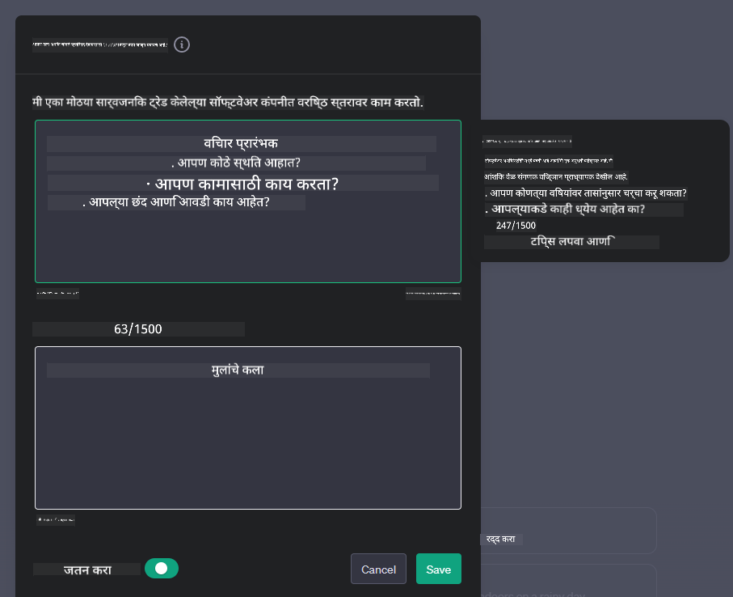

<!--
CO_OP_TRANSLATOR_METADATA:
{
  "original_hash": "ea4bbe640847aafbbba14dae4625e9af",
  "translation_date": "2025-06-25T15:21:56+00:00",
  "source_file": "07-building-chat-applications/README.md",
  "language_code": "mr"
}
-->
# जनरेटिव AI-चालित चॅट अनुप्रयोग तयार करणे

आता आपण पाहिले आहे की आपण टेक्स्ट जनरेशन अॅप्स कसे तयार करू शकतो, चला चॅट अॅप्लिकेशन्सकडे पाहूया.

चॅट अॅप्लिकेशन्स आमच्या दैनंदिन जीवनाचा एक भाग बनले आहेत, जे फक्त साध्या संवादापेक्षा अधिक काही ऑफर करतात. ते ग्राहक सेवा, तांत्रिक समर्थन, आणि अगदी प्रगत सल्लागार प्रणालींचे अविभाज्य भाग आहेत. तुम्हाला काही काळापूर्वी चॅट अॅप्लिकेशनमधून काही मदत मिळाली असेल. जसे आपण या प्लॅटफॉर्ममध्ये जनरेटिव AI सारख्या प्रगत तंत्रज्ञानाचा समावेश करतो, तसतसे जटिलता वाढते आणि आव्हानेही वाढतात.

आम्हाला उत्तर द्यायचे असलेले काही प्रश्न आहेत:

- **अॅप तयार करणे**. विशिष्ट वापर प्रकरणांसाठी या AI-चालित अॅप्लिकेशन्सला कार्यक्षमतेने कसे तयार करावे आणि अखंडपणे एकत्रित कसे करावे?
- **मॉनिटरिंग**. एकदा तैनात केल्यावर, आम्ही कसे मॉनिटर करू शकतो आणि सुनिश्चित करू शकतो की अनुप्रयोग कार्यक्षमतेच्या दृष्टीने आणि [जबाबदार AI च्या सहा तत्त्वांचे](https://www.microsoft.com/ai/responsible-ai?WT.mc_id=academic-105485-koreyst) पालन करून उच्च दर्जाच्या स्तरावर कार्यरत आहेत?

ऑटोमेशन आणि अखंड मानव-मशीन संवादाने परिभाषित केलेल्या युगात पुढे जात असताना, जनरेटिव AI चॅट अॅप्लिकेशन्सच्या व्याप्ती, खोली आणि अनुकूलतेचे रूपांतर कसे करते हे समजून घेणे आवश्यक बनते. हे धडे या जटिल प्रणालींना समर्थन देणाऱ्या आर्किटेक्चरच्या पैलूंची चौकशी करेल, त्यांना डोमेन-विशिष्ट कार्यांसाठी सूक्ष्मतेने ट्यून करण्याच्या पद्धतींची तपासणी करेल आणि जबाबदार AI तैनाती सुनिश्चित करण्यासाठी संबंधित मेट्रिक्स आणि विचारांचे मूल्यांकन करेल.

## परिचय

हा धडा कव्हर करतो:

- चॅट अॅप्लिकेशन्स कार्यक्षमतेने तयार करण्याच्या आणि एकत्रित करण्याच्या तंत्र.
- अनुप्रयोगांवर सानुकूलन आणि सूक्ष्म-ट्यूनिंग कसे लागू करावे.
- चॅट अॅप्लिकेशन्सचे प्रभावीपणे मॉनिटरिंग करण्यासाठी रणनीती आणि विचार.

## शिकण्याची उद्दिष्टे

या धड्याच्या शेवटी, आपण सक्षम असाल:

- विद्यमान प्रणालींमध्ये चॅट अॅप्लिकेशन्स तयार करण्यासाठी आणि एकत्रित करण्यासाठी विचारांचे वर्णन करा.
- विशिष्ट वापर प्रकरणांसाठी चॅट अॅप्लिकेशन्स सानुकूलित करा.
- AI-चालित चॅट अॅप्लिकेशन्सची गुणवत्ता प्रभावीपणे मॉनिटर आणि राखण्यासाठी प्रमुख मेट्रिक्स आणि विचार ओळखा.
- चॅट अॅप्लिकेशन्स AI जबाबदारीने कसे वापरतात हे सुनिश्चित करा.

## चॅट अॅप्लिकेशन्समध्ये जनरेटिव AI समाकलित करणे

जनरेटिव AI च्या माध्यमातून चॅट अॅप्लिकेशन्स उंचावणे केवळ त्यांना अधिक स्मार्ट बनवण्यावर केंद्रित नाही; गुणवत्ता वापरकर्ता अनुभव वितरीत करण्यासाठी त्यांची आर्किटेक्चर, कार्यप्रदर्शन आणि वापरकर्ता इंटरफेस ऑप्टिमाइझ करण्याबद्दल आहे. यामध्ये आर्किटेक्चरल फाउंडेशन, API इंटिग्रेशन आणि वापरकर्ता इंटरफेस विचारांची चौकशी करणे समाविष्ट आहे. हे विभाग तुम्हाला या जटिल लँडस्केप्समध्ये नेव्हिगेट करण्यासाठी एक व्यापक रोडमॅप ऑफर करण्याचे उद्दिष्ट ठेवते, मग तुम्ही त्यांना विद्यमान प्रणालींमध्ये प्लग करत असाल किंवा त्यांना स्वतंत्र प्लॅटफॉर्म म्हणून तयार करत असाल.

या विभागाच्या शेवटी, तुम्हाला चॅट अॅप्लिकेशन्स कार्यक्षमतेने तयार आणि समाकलित करण्यासाठी आवश्यक असलेले कौशल्य मिळेल.

### चॅटबॉट किंवा चॅट अॅप्लिकेशन?

चॅट अॅप्लिकेशन्स तयार करण्याआधी, 'चॅटबॉट्स' विरुद्ध 'AI-चालित चॅट अॅप्लिकेशन्स' ची तुलना करूया, जे वेगवेगळ्या भूमिका आणि कार्ये बजावतात. चॅटबॉटचा मुख्य उद्देश विशिष्ट संभाषणात्मक कार्ये स्वयंचलित करणे आहे, जसे की वारंवार विचारले जाणारे प्रश्न उत्तर देणे किंवा पॅकेज ट्रॅक करणे. हे सामान्यतः नियम-आधारित लॉजिक किंवा जटिल AI अल्गोरिदमद्वारे नियंत्रित केले जाते. त्याउलट, AI-चालित चॅट अॅप्लिकेशन हे एक खूपच विस्तृत वातावरण आहे जे मानवी वापरकर्त्यांमध्ये विविध प्रकारच्या डिजिटल संवादांना सुलभ करण्यासाठी डिझाइन केलेले आहे, जसे की मजकूर, आवाज आणि व्हिडिओ चॅट्स. त्याचे परिभाषित वैशिष्ट्य म्हणजे एक जनरेटिव AI मॉडेलचा समावेश जो सूक्ष्म, मानवीसारख्या संभाषणांचे अनुकरण करतो, विविध प्रकारच्या इनपुट आणि संदर्भात्मक संकेतांवर आधारित प्रतिसाद निर्माण करतो. एक जनरेटिव AI संचालित चॅट अॅप्लिकेशन ओपन-डोमेन चर्चांमध्ये गुंतू शकते, विकसित होणाऱ्या संभाषणाच्या संदर्भांशी जुळवून घेऊ शकते आणि अगदी सर्जनशील किंवा जटिल संवाद तयार करू शकते.

खालील तक्ता डिजिटल संवादात त्यांच्या अद्वितीय भूमिकांचे समजून घेण्यासाठी मुख्य फरक आणि समानता दर्शवतो.

| चॅटबॉट                             | जनरेटिव AI-पॉवर्ड चॅट अॅप्लिकेशन |
| ---------------------------------- | --------------------------------- |
| कार्य-केंद्रित आणि नियम-आधारित   | संदर्भ-सजग                       |
| मोठ्या प्रणालींमध्ये समाकलित      | एक किंवा एकाधिक चॅटबॉट्स होस्ट करू शकते |
| प्रोग्राम केलेल्या कार्यांपुरते मर्यादित | जनरेटिव AI मॉडेल्स समाविष्ट करते |
| विशेषीकृत आणि संरचित संवाद        | ओपन-डोमेन चर्चेस सक्षम           |

### SDKs आणि APIs सह पूर्व-निर्मित कार्यक्षमतेचा लाभ घेणे

चॅट अॅप्लिकेशन तयार करताना, एक उत्तम पहिला चरण म्हणजे आधीपासून काय उपलब्ध आहे हे मूल्यांकन करणे. SDKs आणि APIs वापरून चॅट अॅप्लिकेशन्स तयार करणे विविध कारणांसाठी एक फायदेशीर धोरण आहे. चांगले दस्तऐवजीकरण केलेल्या SDKs आणि APIs एकत्रित करून, तुम्ही तुमच्या अॅप्लिकेशनला दीर्घकालीन यशासाठी धोरणात्मकदृष्ट्या स्थान देत आहात, स्केलेबिलिटी आणि देखभाल चिंतेचा सामना करत आहात.

- **विकास प्रक्रिया वेगवान करते आणि ओव्हरहेड कमी करते**: स्वतः तयार करण्याच्या महागड्या प्रक्रियेऐवजी पूर्व-निर्मित कार्यक्षमतेवर अवलंबून राहिल्यामुळे तुम्हाला तुमच्या अॅप्लिकेशनच्या इतर पैलूंवर लक्ष केंद्रित करण्यास अनुमती मिळते, जसे की व्यावसायिक लॉजिक.
- **चांगले कार्यप्रदर्शन**: जेव्हा तुम्ही स्क्रॅचपासून कार्यक्षमता तयार करता, तेव्हा तुम्ही स्वतःला शेवटी विचाराल "ते कसे स्केल करते? हे अॅप्लिकेशन वापरकर्त्यांच्या अचानक वाढीला हाताळण्यास सक्षम आहे का?" चांगले देखरेख केलेले SDK आणि API यासाठी सहसा अंगभूत उपाय असतात.
- **सुलभ देखभाल**: अद्यतने आणि सुधारणा व्यवस्थापित करणे सोपे आहे कारण बहुतेक API आणि SDK फक्त एक लायब्ररी अद्यतन आवश्यक आहे जेव्हा एक नवीन आवृत्ती जारी केली जाते.
- **आधुनिक तंत्रज्ञानाचा प्रवेश**: विस्तृत डेटासेटवर सूक्ष्म-ट्यून आणि प्रशिक्षित केलेले मॉडेल्स तुमच्या अॅप्लिकेशनला नैसर्गिक भाषा क्षमता प्रदान करतात.

SDK किंवा API ची कार्यक्षमता प्रवेश करणे सामान्यतः दिलेल्या सेवांचा वापर करण्याची परवानगी मिळविण्यात समाविष्ट असते, जे बहुतेक वेळा अद्वितीय की किंवा प्रमाणीकरण टोकनच्या वापराद्वारे असते. आम्ही हे कसे दिसते ते एक्सप्लोर करण्यासाठी OpenAI Python लायब्ररी वापरू. तुम्ही खालील [OpenAI साठी नोटबुक](../../../07-building-chat-applications/python/oai-assignment.ipynb) किंवा [Azure OpenAI Services साठी नोटबुक](../../../07-building-chat-applications/python/aoai-assignment.ipynb) मध्ये स्वतः प्रयत्न करू शकता.

```python
import os
from openai import OpenAI

API_KEY = os.getenv("OPENAI_API_KEY","")

client = OpenAI(
    api_key=API_KEY
    )

chat_completion = client.chat.completions.create(model="gpt-3.5-turbo", messages=[{"role": "user", "content": "Suggest two titles for an instructional lesson on chat applications for generative AI."}])
```

वरील उदाहरण GPT-3.5 टर्बो मॉडेलचा वापर प्रॉम्प्ट पूर्ण करण्यासाठी करते, परंतु लक्षात घ्या की API की आधी सेट केली जाते. तुम्हाला की सेट न केल्यास त्रुटी मिळेल.

## वापरकर्ता अनुभव (UX)

सामान्य UX तत्त्वे चॅट अॅप्लिकेशन्सवर लागू होतात, परंतु येथे काही अतिरिक्त विचार आहेत जे मशीन लर्निंग घटकांमुळे विशेषतः महत्वाचे बनतात.

- **अस्पष्टतेचा सामना करण्यासाठी यंत्रणा**: जनरेटिव AI मॉडेल्स कधीकधी अस्पष्ट उत्तरे निर्माण करतात. वापरकर्त्यांना स्पष्टता मागण्यासाठी एक वैशिष्ट्य उपयुक्त ठरू शकते.
- **संदर्भ राखणे**: प्रगत जनरेटिव AI मॉडेल्समध्ये संभाषणाच्या संदर्भात लक्षात ठेवण्याची क्षमता असते, जी वापरकर्ता अनुभवासाठी आवश्यक असू शकते. वापरकर्त्यांना संदर्भ नियंत्रित आणि व्यवस्थापित करण्याची क्षमता देणे वापरकर्ता अनुभव सुधारते, परंतु संवेदनशील वापरकर्ता माहिती राखण्याचा धोका देखील निर्माण करते. ही माहिती किती काळ साठवली जाते यासाठी विचार, जसे की धारणा धोरण सादर करणे, गोपनीयतेच्या विरुद्ध संदर्भाची आवश्यकता संतुलित करू शकते.
- **वैयक्तिकरण**: शिकण्याची आणि जुळवून घेण्याची क्षमता असल्याने, AI मॉडेल्स वापरकर्त्यासाठी एक वैयक्तिकृत अनुभव ऑफर करतात. वापरकर्ता प्रोफाइलसारख्या वैशिष्ट्यांद्वारे वापरकर्ता अनुभव सानुकूलित करणे केवळ वापरकर्त्याला समजले जाते असे वाटते, परंतु ते विशिष्ट उत्तरे शोधण्याच्या त्यांच्या प्रयत्नांना देखील मदत करते, अधिक कार्यक्षम आणि समाधानकारक संवाद तयार करते.

वैयक्तिकरणाचे एक उदाहरण म्हणजे OpenAI च्या ChatGPT मधील "कस्टम सूचना" सेटिंग्ज. हे तुम्हाला तुमच्या प्रॉम्प्टसाठी महत्त्वाचा संदर्भ असू शकणारी तुमची माहिती प्रदान करण्याची परवानगी देते. कस्टम निर्देशाचे एक उदाहरण येथे आहे.



हे "प्रोफाइल" ChatGPT ला लिंक्ड लिस्ट्सवर धडा योजना तयार करण्यास प्रवृत्त करते. लक्षात घ्या की ChatGPT लक्षात घेतो की वापरकर्त्याला तिच्या अनुभवावर आधारित अधिक सखोल धडा योजना हवी असू शकते.


### मोठ्या भाषा मॉडेलसाठी मायक्रोसॉफ्टचे सिस्टम मेसेज फ्रेमवर्क

[मायक्रोसॉफ्टने मार्गदर्शन प्रदान केले आहे](https://learn.microsoft.com/azure/ai-services/openai/concepts/system-message#define-the-models-output-format?WT.mc_id=academic-105485-koreyst) LLMs कडून प्रतिसाद तयार करताना प्रभावी प्रणाली संदेश लिहिण्यासाठी 4 क्षेत्रांमध्ये विभागले आहे:

1. मॉडेल कोणासाठी आहे, तसेच त्याच्या क्षमतांचा आणि मर्यादांचा परिभाषित करणे.
2. मॉडेलच्या आउटपुट स्वरूपाचे परिभाषित करणे.
3. मॉडेलच्या इच्छित वर्तनाचे प्रदर्शन करणारी विशिष्ट उदाहरणे प्रदान करणे.
4. अतिरिक्त वर्तनात्मक गार्डरेल्स प्रदान करणे.

### प्रवेशयोग्यता

वापरकर्त्याला दृश्य, श्रवण, मोटर किंवा संज्ञानात्मक कमजोरी असो वा नसो, चांगल्या डिझाइन केलेल्या चॅट अॅप्लिकेशनचा सर्वांनी वापर करता येईल. खालील यादी विविध वापरकर्ता कमतरतेसाठी प्रवेशयोग्यता वाढवण्यासाठी उद्दिष्ट ठेवलेल्या विशिष्ट वैशिष्ट्यांचा विघटन करते.

- **दृश्य कमजोरीसाठी वैशिष्ट्ये**: उच्च कॉन्ट्रास्ट थीम आणि पुनरावृत्ती करण्यायोग्य मजकूर, स्क्रीन रीडर सुसंगतता.
- **श्रवण कमजोरीसाठी वैशिष्ट्ये**: मजकूर-ते-भाषण आणि भाषण-ते-मजकूर कार्ये, ऑडिओ सूचनाांसाठी दृश्य संकेत.
- **मोटर कमजोरीसाठी वैशिष्ट्ये**: कीबोर्ड नेव्हिगेशन समर्थन, आवाज आदेश.
- **संज्ञानात्मक कमजोरीसाठी वैशिष्ट्ये**: सरलीकृत भाषा पर्याय.

## डोमेन-विशिष्ट भाषा मॉडेल्ससाठी सानुकूलन आणि सूक्ष्म-ट्यूनिंग

तुमच्या कंपनीच्या शब्दावलीला समजून घेणारे आणि त्याच्या वापरकर्ता बेसला सामान्यतः असलेल्या विशिष्ट प्रश्नांची अपेक्षा करणारे चॅट अॅप्लिकेशनची कल्पना करा. उल्लेख करण्यासाठी दोन दृष्टिकोन आहेत:

- **DSL मॉडेल्सचा लाभ घेणे**. DSL म्हणजे डोमेन-विशिष्ट भाषा. तुम्ही तथाकथित DSL मॉडेलचा लाभ घेऊ शकता जो विशिष्ट डोमेनवर प्रशिक्षित केला जातो जेणेकरून त्याच्या संकल्पना आणि परिस्थिती समजून घेता येतील.
- **सूक्ष्म-ट्यूनिंग लागू करा**. सूक्ष्म-ट्यूनिंग ही तुमच्या मॉडेलला विशिष्ट डेटासह पुढे प्रशिक्षण देण्याची प्रक्रिया आहे.

## सानुकूलन: DSL वापरणे

डोमेन-विशिष्ट भाषा मॉडेल्स (DSL मॉडेल्स) वापरकर्त्याच्या सहभागास वाढवू शकतात आणि विशेष, संदर्भाशी संबंधित संवाद प्रदान करून. हे एक मॉडेल आहे जे विशिष्ट क्षेत्र, उद्योग किंवा विषयाशी संबंधित मजकूर समजून घेण्यासाठी आणि तयार करण्यासाठी प्रशिक्षित किंवा सूक्ष्म-ट्यून केलेले आहे. DSL मॉडेल वापरण्याचे पर्याय एक स्क्रॅचपासून प्रशिक्षण देण्यापासून ते SDKs आणि APIs द्वारे पूर्व-विद्यमान एक वापरण्यापर्यंत बदलू शकतात. आणखी एक पर्याय म्हणजे सूक्ष्म-ट्यूनिंग, ज्यामध्ये विद्यमान पूर्व-प्रशिक्षित मॉडेल घेणे आणि ते विशिष्ट डोमेनसाठी अनुकूल करणे समाविष्ट आहे.

## सानुकूलन: सूक्ष्म-ट्यूनिंग लागू करा

जेव्हा पूर्व-प्रशिक्षित मॉडेल विशेष डोमेन किंवा विशिष्ट कार्यात कमी पडते तेव्हा सूक्ष्म-ट्यूनिंगचा विचार केला जातो.

उदाहरणार्थ, वैद्यकीय प्रश्न जटिल असतात आणि त्यांना बरेच संदर्भ आवश्यक असतात. जेव्हा वैद्यकीय व्यावसायिक रुग्णाचे निदान करतो तेव्हा ते जीवनशैली किंवा पूर्व-विद्यमान परिस्थिती सारख्या विविध घटकांवर आधारित असते आणि कधीकधी त्यांच्या निदानाची वैधता सिद्ध करण्यासाठी अलीकडील वैद्यकीय जर्नल्सवर अवलंबून असते. अशा सूक्ष्म परिस्थितीत, सामान्य-उद्देश AI चॅट अॅप्लिकेशन विश्वासार्ह स्रोत असू शकत नाही.

### परिस्थिती: वैद्यकीय अनुप्रयोग

वैद्यकीय व्यावसायिकांना उपचार मार्गदर्शक तत्त्वे, औषधांच्या परस्परसंवाद किंवा अलीकडील संशोधन निष्कर्षांसाठी द्रुत संदर्भ प्रदान करून मदत करण्यासाठी डिझाइन केलेले चॅट अॅप्लिकेशन विचारात घ्या.

सामान्य-उद्देश मॉडेल मूलभूत वैद्यकीय प्रश्नांची उत्तरे देण्यासाठी किंवा सामान्य सल्ला प्रदान करण्यासाठी पुरेसे असू शकते, परंतु ते खालील गोष्टींसह संघर्ष करू शकते:

- **अत्यंत विशिष्ट किंवा जटिल प्रकरणे**. उदाहरणार्थ, एक न्यूरोलॉजिस्ट अनुप्रयोगाला विचारू शकतो, "लहान मुलांमध्ये औषध-प्रतिरोधक एपिलेप्सी व्यवस्थापित करण्यासाठी सध्याच्या सर्वोत्तम पद्धती कोणत्या आहेत?"
- **अलीकडील प्रगतीचा अभाव**. सामान्य-उद्देश मॉडेल न्यूरोलॉजी आणि फार्माकोलॉजीमधील सर्वात अलीकडील प्रगती समाविष्ट करणारे सध्याचे उत्तर प्रदान करण्यात अडचणीत असू शकते.

अशा उदाहरणांमध्ये, विशेष वैद्यकीय डेटासेटसह मॉडेलला सूक्ष्म-ट्यून करणे या गुंतागुंतीच्या वैद्यकीय चौ

**अस्वीकरण**:  
हा दस्तऐवज AI अनुवाद सेवा [Co-op Translator](https://github.com/Azure/co-op-translator) वापरून अनुवादित करण्यात आला आहे. आम्ही अचूकतेसाठी प्रयत्नशील असलो तरी कृपया लक्षात घ्या की स्वयंचलित अनुवादांमध्ये त्रुटी किंवा अशुद्धता असू शकतात. मूळ भाषेतील मूळ दस्तऐवज हा प्राधिकृत स्रोत मानला पाहिजे. महत्त्वाच्या माहितीसाठी, व्यावसायिक मानवी अनुवादाची शिफारस केली जाते. या अनुवादाच्या वापरातून उद्भवणाऱ्या कोणत्याही गैरसमज किंवा चुकीच्या अर्थासाठी आम्ही जबाबदार नाही.