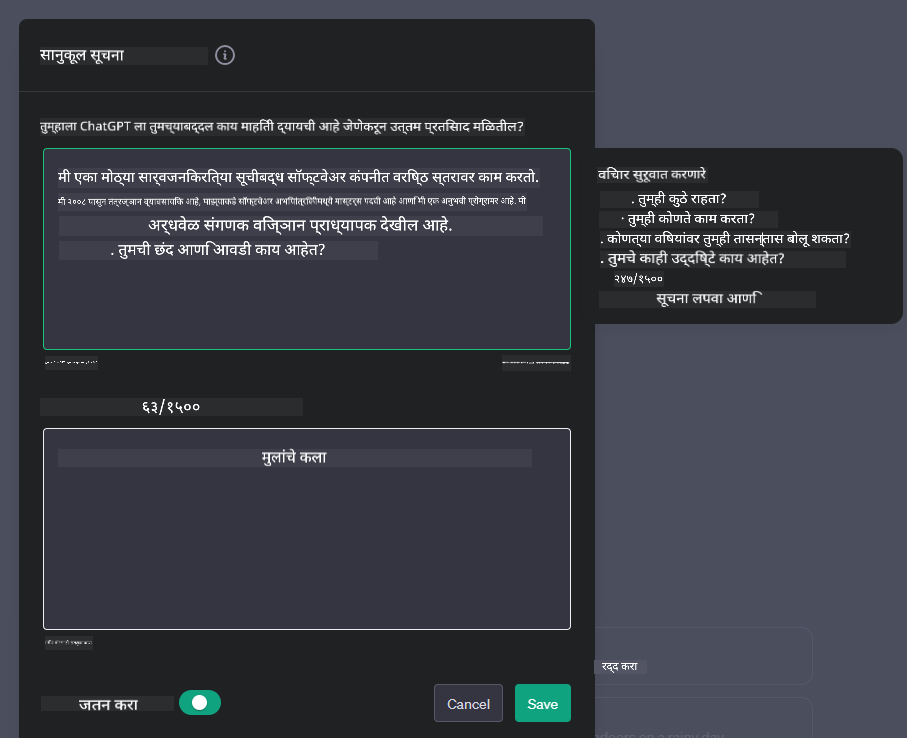

<!--
CO_OP_TRANSLATOR_METADATA:
{
  "original_hash": "a5308963a56cfbad2d73b0fa99fe84b3",
  "translation_date": "2025-10-18T00:27:41+00:00",
  "source_file": "07-building-chat-applications/README.md",
  "language_code": "mr"
}
-->
# जनरेटिव AI-सक्षम चॅट अनुप्रयोग तयार करणे

[](https://youtu.be/R9V0ZY1BEQo?si=IHuU-fS9YWT8s4sA)

> _(वरील प्रतिमेवर क्लिक करून या धड्याचा व्हिडिओ पहा)_

आता आपण टेक्स्ट जनरेशन अॅप्स कसे तयार करू शकतो हे पाहिले आहे, चला चॅट अॅप्लिकेशन्सकडे पाहूया.

चॅट अॅप्लिकेशन्स आपल्या दैनंदिन जीवनाचा एक भाग बनले आहेत, जे फक्त सामान्य संभाषणाचे माध्यम म्हणून कार्य करत नाहीत तर ग्राहक सेवा, तांत्रिक सहाय्य आणि अगदी प्रगत सल्लागार प्रणालींचा अविभाज्य भाग बनले आहेत. तुम्हाला अलीकडेच चॅट अॅप्लिकेशनकडून काही मदत मिळाली असेल अशी शक्यता आहे. जेव्हा आपण या प्लॅटफॉर्ममध्ये जनरेटिव AI सारख्या प्रगत तंत्रज्ञानाचा समावेश करतो, तेव्हा जटिलता वाढते आणि आव्हाने देखील वाढतात.

आपल्याला उत्तर देण्याची आवश्यकता असलेल्या काही प्रश्न आहेत:

- **अॅप तयार करणे**. विशिष्ट उपयोग प्रकरणांसाठी या AI-सक्षम अॅप्लिकेशन्सला कार्यक्षमतेने कसे तयार करावे आणि अखंडपणे कसे समाकलित करावे?
- **मॉनिटरिंग**. एकदा तैनात केल्यानंतर, अॅप्लिकेशन्स कार्यक्षमतेच्या उच्चतम स्तरावर कार्य करत आहेत आणि [जबाबदार AI च्या सहा तत्त्वांचे](https://www.microsoft.com/ai/responsible-ai?WT.mc_id=academic-105485-koreyst) पालन करत आहेत याची खात्री कशी करावी?

जसे आपण ऑटोमेशन आणि अखंड मानवी-मशीन संवादाने परिभाषित केलेल्या युगाकडे अधिक पुढे जातो, जनरेटिव AI चॅट अॅप्लिकेशन्सच्या व्याप्ती, खोली आणि अनुकूलतेला कसे बदलते हे समजून घेणे आवश्यक बनते. हा धडा या जटिल प्रणालींना समर्थन देणाऱ्या आर्किटेक्चरच्या पैलूंचा तपास करेल, डोमेन-विशिष्ट कार्यांसाठी त्यांना सूक्ष्म-ट्यून करण्याच्या पद्धतींमध्ये खोलवर जाईल आणि जबाबदार AI तैनाती सुनिश्चित करण्यासाठी संबंधित मेट्रिक्स आणि विचारांचे मूल्यांकन करेल.

## परिचय

या धड्यात समाविष्ट आहे:

- चॅट अॅप्लिकेशन्स कार्यक्षमतेने तयार करण्यासाठी आणि समाकलित करण्यासाठी तंत्र.
- अॅप्लिकेशन्समध्ये सानुकूलन आणि सूक्ष्म-ट्यूनिंग कसे लागू करावे.
- चॅट अॅप्लिकेशन्स प्रभावीपणे मॉनिटर करण्यासाठी रणनीती आणि विचार.

## शिकण्याची उद्दिष्टे

या धड्याच्या शेवटी, तुम्ही सक्षम असाल:

- विद्यमान प्रणालींमध्ये चॅट अॅप्लिकेशन्स तयार करण्यासाठी आणि समाकलित करण्यासाठी विचारांचे वर्णन करा.
- विशिष्ट उपयोग प्रकरणांसाठी चॅट अॅप्लिकेशन्स सानुकूलित करा.
- AI-सक्षम चॅट अॅप्लिकेशन्सची गुणवत्ता प्रभावीपणे मॉनिटर आणि राखण्यासाठी महत्त्वाचे मेट्रिक्स आणि विचार ओळखा.
- चॅट अॅप्लिकेशन्स जबाबदारीने AI चा लाभ घेत असल्याची खात्री करा.

## चॅट अॅप्लिकेशन्समध्ये जनरेटिव AI समाकलित करणे

जनरेटिव AI च्या माध्यमातून चॅट अॅप्लिकेशन्स उंचावणे हे केवळ त्यांना अधिक स्मार्ट बनवण्यावर केंद्रित नाही; हे त्यांच्या आर्किटेक्चर, कार्यप्रदर्शन आणि वापरकर्ता इंटरफेस अनुकूलित करण्याबद्दल आहे जेणेकरून दर्जेदार वापरकर्ता अनुभव प्रदान करता येईल. यामध्ये आर्किटेक्चरल फाउंडेशन, API समाकलन आणि वापरकर्ता इंटरफेस विचार तपासणे समाविष्ट आहे. ही विभाग तुम्हाला या जटिल लँडस्केप्ससाठी व्यापक रोडमॅप ऑफर करण्याचे उद्दिष्ट ठेवते, तुम्ही त्यांना विद्यमान प्रणालींमध्ये प्लग करत असाल किंवा स्टँड-अलोन प्लॅटफॉर्म म्हणून तयार करत असाल.

या विभागाच्या शेवटी, तुम्हाला चॅट अॅप्लिकेशन्स कार्यक्षमतेने तयार करण्यासाठी आणि समाकलित करण्यासाठी आवश्यक असलेली तज्ञता मिळेल.

### चॅटबॉट किंवा चॅट अॅप्लिकेशन?

चॅट अॅप्लिकेशन्स तयार करण्यापूर्वी, 'चॅटबॉट्स' आणि 'AI-सक्षम चॅट अॅप्लिकेशन्स' यांची तुलना करूया, जे वेगवेगळ्या भूमिका आणि कार्ये बजावतात. चॅटबॉटचा मुख्य उद्देश विशिष्ट संभाषणात्मक कार्ये स्वयंचलित करणे आहे, जसे की वारंवार विचारल्या जाणाऱ्या प्रश्नांची उत्तरे देणे किंवा पॅकेज ट्रॅक करणे. हे सामान्यतः नियम-आधारित लॉजिक किंवा जटिल AI अल्गोरिदमद्वारे नियंत्रित केले जाते. याउलट, AI-सक्षम चॅट अॅप्लिकेशन हे मानवी वापरकर्त्यांमध्ये मजकूर, व्हॉइस आणि व्हिडिओ चॅटसारख्या विविध प्रकारच्या डिजिटल संवादांना सुलभ करण्यासाठी डिझाइन केलेले एक विस्तृत वातावरण आहे. त्याची परिभाषित वैशिष्ट्ये म्हणजे जनरेटिव AI मॉडेलचे समाकलन जे सूक्ष्म, मानवी-सारख्या संभाषणांचे अनुकरण करते, विविध प्रकारच्या इनपुट आणि संदर्भात्मक संकेतांवर आधारित प्रतिसाद निर्माण करते. जनरेटिव AI-सक्षम चॅट अॅप्लिकेशन ओपन-डोमेन चर्चेत गुंतू शकते, विकसित होत असलेल्या संभाषणात्मक संदर्भांशी जुळवून घेऊ शकते आणि अगदी सर्जनशील किंवा जटिल संवाद तयार करू शकते.

खालील तक्ता डिजिटल संवादामध्ये त्यांच्या अद्वितीय भूमिका समजून घेण्यासाठी मुख्य फरक आणि साम्य स्पष्ट करतो.

| चॅटबॉट                              | जनरेटिव AI-सक्षम चॅट अॅप्लिकेशन         |
| ------------------------------------ | --------------------------------------- |
| कार्य-केंद्रित आणि नियम-आधारित      | संदर्भ-जाणकार                          |
| मोठ्या प्रणालींमध्ये समाकलित केलेले | एक किंवा अनेक चॅटबॉट्स होस्ट करू शकते  |
| प्रोग्राम केलेल्या कार्यांपुरते मर्यादित | जनरेटिव AI मॉडेल्स समाविष्ट करते       |
| विशेषीकृत आणि संरचित संवाद          | ओपन-डोमेन चर्चेसाठी सक्षम              |

### SDKs आणि APIs सह पूर्व-निर्मित कार्यक्षमतेचा लाभ घेणे

चॅट अॅप्लिकेशन तयार करताना, आधीपासून काय उपलब्ध आहे ते मूल्यांकन करणे हा एक उत्तम पहिला टप्पा आहे. चॅट अॅप्लिकेशन्स तयार करण्यासाठी SDKs आणि APIs वापरणे विविध कारणांसाठी फायदेशीर धोरण आहे. चांगल्या प्रकारे दस्तऐवजीकरण केलेल्या SDKs आणि APIs समाकलित करून, तुम्ही दीर्घकालीन यशासाठी तुमचे अॅप्लिकेशन रणनीतिकदृष्ट्या स्थानबद्ध करत आहात, स्केलेबिलिटी आणि देखभाल चिंतेचे निराकरण करत आहात.

- **विकास प्रक्रिया गतीने पूर्ण होते आणि खर्च कमी होतो**: स्वतःच कार्यक्षमता तयार करण्याच्या महागड्या प्रक्रियेऐवजी पूर्व-निर्मित कार्यक्षमतेवर अवलंबून राहिल्याने तुम्हाला तुमच्या अॅप्लिकेशनच्या इतर पैलूंवर लक्ष केंद्रित करता येते, जसे की व्यवसाय लॉजिक.
- **चांगले कार्यप्रदर्शन**: जेव्हा तुम्ही स्क्रॅचपासून कार्यक्षमता तयार करता, तेव्हा तुम्ही शेवटी स्वतःला विचाराल "हे कसे स्केल करते? हे अॅप्लिकेशन वापरकर्त्यांच्या अचानक वाढीला हाताळण्यास सक्षम आहे का?" चांगल्या प्रकारे देखभाल केलेल्या SDK आणि APIs मध्ये या चिंतेसाठी अनेकदा अंगभूत उपाय असतात.
- **सुलभ देखभाल**: अद्यतने आणि सुधारणा व्यवस्थापित करणे सोपे आहे कारण बहुतेक APIs आणि SDKs नवीन आवृत्ती रिलीज झाल्यावर लायब्ररी अद्यतनित करणे आवश्यक आहे.
- **आधुनिक तंत्रज्ञानाचा प्रवेश**: विस्तृत डेटासेटवर सूक्ष्म-ट्यून केलेल्या आणि प्रशिक्षित केलेल्या मॉडेल्सचा लाभ घेणे तुमच्या अॅप्लिकेशनला नैसर्गिक भाषा क्षमता प्रदान करते.

SDK किंवा API च्या कार्यक्षमतेचा प्रवेश सामान्यतः प्रदान केलेल्या सेवांचा वापर करण्याची परवानगी मिळवणे यामध्ये समाविष्ट असतो, जे अनेकदा अद्वितीय की किंवा प्रमाणीकरण टोकनच्या वापराद्वारे असते. आपण OpenAI Python Library वापरून हे कसे दिसते ते एक्सप्लोर करू. तुम्ही खालील [OpenAI साठी नोटबुक](./python/oai-assignment.ipynb?WT.mc_id=academic-105485-koreyst) किंवा [Azure OpenAI Services साठी नोटबुक](./python/aoai-assignment.ipynb?WT.mc_id=academic-105485-koreys) या धड्यासाठी स्वतः प्रयत्न करू शकता.

```python
import os
from openai import OpenAI

API_KEY = os.getenv("OPENAI_API_KEY","")

client = OpenAI(
    api_key=API_KEY
    )

chat_completion = client.chat.completions.create(model="gpt-3.5-turbo", messages=[{"role": "user", "content": "Suggest two titles for an instructional lesson on chat applications for generative AI."}])
```

वरील उदाहरण GPT-3.5 Turbo मॉडेलचा वापर करून प्रॉम्प्ट पूर्ण करण्यासाठी करते, परंतु लक्षात ठेवा की API की सेट केली जाते. जर तुम्ही की सेट केली नाही तर तुम्हाला त्रुटी मिळेल.

## वापरकर्ता अनुभव (UX)

सामान्य UX तत्त्वे चॅट अॅप्लिकेशन्ससाठी लागू होतात, परंतु मशीन लर्निंग घटकांमुळे विशेषतः महत्त्वाचे ठरणारे काही अतिरिक्त विचार येथे आहेत.

- **अस्पष्टतेला संबोधित करण्याचा यंत्रणा**: जनरेटिव AI मॉडेल्स कधीकधी अस्पष्ट उत्तरे तयार करतात. वापरकर्त्यांना स्पष्टीकरण मागण्याची परवानगी देणारी सुविधा उपयुक्त ठरू शकते.
- **संदर्भ टिकवून ठेवणे**: प्रगत जनरेटिव AI मॉडेल्समध्ये संभाषणात संदर्भ लक्षात ठेवण्याची क्षमता असते, जी वापरकर्ता अनुभवासाठी आवश्यक असू शकते. वापरकर्त्यांना संदर्भ नियंत्रित आणि व्यवस्थापित करण्याची क्षमता देणे अनुभव सुधारते, परंतु संवेदनशील वापरकर्ता माहिती टिकवून ठेवण्याचा धोका निर्माण करते. ही माहिती किती काळ साठवली जाते यासाठी विचार, जसे की धारणा धोरण सादर करणे, गोपनीयतेच्या विरोधात संदर्भाची आवश्यकता संतुलित करू शकते.
- **वैयक्तिकरण**: शिकण्याची आणि जुळवून घेण्याची क्षमता असलेल्या AI मॉडेल्स वापरकर्त्यासाठी वैयक्तिकृत अनुभव देतात. वापरकर्त्याच्या प्रोफाइलसारख्या वैशिष्ट्यांद्वारे वापरकर्ता अनुभव सानुकूलित करणे केवळ वापरकर्त्याला समजले जाते असे वाटते, तर त्यांना विशिष्ट उत्तरे शोधण्यात मदत करते, अधिक कार्यक्षम आणि समाधानकारक संवाद निर्माण करते.

वैयक्तिकरणाचा एक उदाहरण म्हणजे OpenAI च्या ChatGPT मधील "कस्टम निर्देश" सेटिंग्ज. हे तुम्हाला तुमच्याबद्दल माहिती प्रदान करण्याची परवानगी देते जी तुमच्या प्रॉम्प्टसाठी महत्त्वाचा संदर्भ असू शकतो. कस्टम निर्देशाचे एक उदाहरण येथे आहे.



हे "प्रोफाइल" ChatGPT ला लिंक्ड लिस्ट्सवर धडा योजना तयार करण्यास प्रवृत्त करते. लक्षात घ्या की ChatGPT वापरकर्त्याच्या अनुभवावर आधारित अधिक सखोल धडा योजना तयार करू इच्छित आहे.


### मोठ्या भाषा मॉडेल्ससाठी Microsoft चा सिस्टम मेसेज फ्रेमवर्क

[Microsoft ने मार्गदर्शन प्रदान केले आहे](https://learn.microsoft.com/azure/ai-services/openai/concepts/system-message#define-the-models-output-format?WT.mc_id=academic-105485-koreyst) जे LLMs कडून प्रतिसाद निर्माण करताना प्रभावी सिस्टम मेसेजेस लिहिण्यासाठी 4 क्षेत्रांमध्ये विभागले आहे:

1. मॉडेल कोणासाठी आहे तसेच त्याची क्षमता आणि मर्यादा परिभाषित करणे.
2. मॉडेलचा आउटपुट स्वरूप परिभाषित करणे.
3. मॉडेलच्या इच्छित वर्तनाचे प्रदर्शन करणारे विशिष्ट उदाहरणे प्रदान करणे.
4. अतिरिक्त वर्तनात्मक गार्डरेल्स प्रदान करणे.

### प्रवेशयोग्यता

वापरकर्त्याला व्हिज्युअल, श्रवण, मोटर किंवा संज्ञानात्मक अडचणी असल्या तरी, चांगल्या प्रकारे डिझाइन केलेले चॅट अॅप्लिकेशन सर्वांसाठी वापरण्यायोग्य असावे. खालील यादी विविध वापरकर्ता अडचणींसाठी प्रवेशयोग्यता वाढवण्यासाठी उद्दिष्ट असलेल्या विशिष्ट वैशिष्ट्यांचे विघटन करते.

- **व्हिज्युअल अडचणीसाठी वैशिष्ट्ये**: उच्च कॉन्ट्रास्ट थीम आणि पुन्हा आकार देण्यायोग्य मजकूर, स्क्रीन रीडर सुसंगतता.
- **श्रवण अडचणीसाठी वैशिष्ट्ये**: टेक्स्ट-टू-स्पीच आणि स्पीच-टू-टेक्स्ट फंक्शन्स, ऑडिओ सूचना साठी व्हिज्युअल संकेत.
- **मोटर अडचणीसाठी वैशिष्ट्ये**: कीबोर्ड नेव्हिगेशन समर्थन, व्हॉइस कमांड्स.
- **संज्ञानात्मक अडचणीसाठी वैशिष्ट्ये**: सोप्या भाषेचे पर्याय.

## डोमेन-विशिष्ट भाषा मॉडेल्ससाठी सानुकूलन आणि सूक्ष्म-ट्यूनिंग

तुमच्या कंपनीच्या जार्गनला समजून घेणारे आणि त्याच्या वापरकर्त्यांच्या सामान्यतः असलेल्या विशिष्ट चौकशींची अपेक्षा करणारे चॅट अॅप्लिकेशन कल्पना करा. उल्लेख करण्यासारखे दोन दृष्टिकोन आहेत:

- **DSL मॉडेल्सचा लाभ घेणे**. DSL म्हणजे डोमेन स्पेसिफिक लँग्वेज. तुम्ही विशिष्ट डोमेनच्या संकल्पना आणि परिस्थिती समजून घेण्यासाठी प्रशिक्षित केलेल्या तथाकथित DSL मॉडेलचा लाभ घेऊ शकता.
- **सूक्ष्म-ट्यूनिंग लागू करा**. सूक्ष्म-ट्यूनिंग ही प्रक्रिया आहे ज्यामध्ये तुमच्या मॉडेलला विशिष्ट डेटासह पुढील प्रशिक्षण दिले जाते.

## सानुकूलन: DSL वापरणे

डोमेन-स्पेसिफिक लँग्वेज मॉडेल्स (DSL मॉडेल्स) वापरणे वापरकर्त्याच्या सहभागाला वाढवू शकते आणि विशेष, संदर्भाने संबंधित संवाद प्रदान करून. हे एक मॉडेल आहे जे विशिष्ट क्षेत्र, उद्योग किंवा विषयाशी संबंधित मजकूर समजून घेण्यासाठी आणि तयार करण्यासाठी प्रशिक्षित किंवा सूक्ष्म-ट्यून केले जाते. DSL मॉडेल वापरण्याचे पर्याय स्क्रॅचपासून एक प्रशिक्षण देणे, SDKs आणि APIs द्वारे पूर्व-विद्यमान मॉडेल्स वापरणे यामध्ये बदलू शकतात. आणखी एक पर्याय म्हणजे सूक्ष्म-ट्यूनिंग, ज्यामध्ये विद्यमान पूर्व-प्रशिक्षित मॉडेल घेऊन विशिष्ट डोमेनसाठी अनुकूल करणे समाविष्ट आहे.

## सानुकूलन: सूक्ष्म-ट्यूनिंग लागू करा

जेव्हा पूर्व-प्रशिक्षित मॉडेल विशेष डोमेन किंवा विशिष्ट कार्यामध्ये कमी पडते तेव्हा सूक्ष्म-ट्यूनिंगचा विचार केला जातो.

उदाहरणार्थ, वैद्यकीय चौकशी जटिल असते आणि त्यासाठी खूप संदर्भ आवश्यक असतो. जेव्हा वैद्यकीय व्यावसायिक रुग्णाचे निदान करतो तेव्हा ते जीवनशैली किंवा पूर्वस्थिती यासारख्या विविध घटकांवर आधारित असते आणि त्यांचे निदान सत्यापित करण्यासाठी अलीकडील वैद्यकीय जर्नल्सवर देखील अवलंबून असते. अशा सूक्ष्म परिस्थितीत, सामान्य-उद्देश AI चॅट अॅप्लिकेशन विश्वसनीय स्रोत असू शकत नाही.

### परिस्थिती: एक वैद्यकीय अॅप्लिकेशन

वैद्यकीय व्यावसायिकांना उपचार मार्गदर्शक तत्त्वे, औषध परस्परसंवाद किंवा अलीकडील संशोधन शोधण्यात जलद संदर्भ प्रदान करून मदत करण्यासाठी डिझाइन केलेल्या चॅट अॅप्लिकेशनचा विचार करा.

सामान्य-उद्देश मॉडेल मूलभूत वैद्यकीय प्रश्नांची उत्तरे देण्यासाठी किंवा सामान्य सल्ला देण्यासाठी पुरेसे असू शकते, परंतु ते खालील गोष्टींमध्ये संघर्ष करू शकते:

- **अत्यंत विशिष्ट किंवा जटिल प्रकरणे**. उदाहरणार्थ, न्यूरोलॉजिस्ट अॅप्लिकेशनला विचारू शकतो, "पेडियाट्रिक रुग्णांमध्ये औषध-प्रतिरोधक एपिलेप्सी व्यवस्थापित करण्यासाठी सध्याच्या सर्वोत्तम
| **अनोमली डिटेक्शन**         | असामान्य नमुने ओळखण्यासाठी साधने आणि तंत्रे जी अपेक्षित वर्तनाशी जुळत नाहीत.                        | तुम्ही अनोमलीला कसे प्रतिसाद द्याल?                                        |

### चॅट अ‍ॅप्लिकेशन्समध्ये जबाबदार AI पद्धती लागू करणे

मायक्रोसॉफ्टच्या जबाबदार AI च्या दृष्टिकोनाने AI च्या विकास आणि वापरासाठी मार्गदर्शन करणारे सहा तत्त्वे ओळखली आहेत. खाली तत्त्वे, त्यांची व्याख्या, चॅट डेव्हलपरने विचारात घ्यायच्या गोष्टी आणि त्यांना गंभीरपणे का घ्यावे याची माहिती दिली आहे.

| तत्त्वे                 | मायक्रोसॉफ्टची व्याख्या                                | चॅट डेव्हलपरसाठी विचार करण्याच्या गोष्टी                                      | हे का महत्त्वाचे आहे                                                                     |
| ---------------------- | ----------------------------------------------------- | ---------------------------------------------------------------------- | -------------------------------------------------------------------------------------- |
| न्याय                  | AI प्रणालीने सर्व लोकांशी न्यायाने वागले पाहिजे.            | चॅट अ‍ॅप्लिकेशन वापरकर्त्याच्या डेटाच्या आधारे भेदभाव करत नाही याची खात्री करा.  | वापरकर्त्यांमध्ये विश्वास आणि समावेशकता निर्माण करण्यासाठी; कायदेशीर परिणाम टाळते.                |
| विश्वासार्हता आणि सुरक्षा | AI प्रणालीने विश्वासार्ह आणि सुरक्षितपणे कार्य केले पाहिजे.        | त्रुटी आणि जोखीम कमी करण्यासाठी चाचणी आणि फेल-सेफ्स लागू करा.         | वापरकर्त्याचे समाधान सुनिश्चित करते आणि संभाव्य हानी टाळते.                                 |
| गोपनीयता आणि सुरक्षा   | AI प्रणाली सुरक्षित असावी आणि गोपनीयतेचा आदर करावा.      | मजबूत एन्क्रिप्शन आणि डेटा संरक्षण उपाय लागू करा.              | संवेदनशील वापरकर्ता डेटा सुरक्षित ठेवण्यासाठी आणि गोपनीयता कायद्यांचे पालन करण्यासाठी.                         |
| समावेशकता             | AI प्रणालीने प्रत्येकाला सशक्त केले पाहिजे आणि लोकांना सहभागी केले पाहिजे. | विविध प्रेक्षकांसाठी UI/UX डिझाइन करा जे प्रवेशयोग्य आणि वापरण्यास सोपे आहे. | सुनिश्चित करते की अधिक लोक प्रभावीपणे अ‍ॅप्लिकेशन वापरू शकतात.                   |
| पारदर्शकता           | AI प्रणाली समजण्यासारखी असावी.                  | AI प्रतिसादांसाठी स्पष्ट दस्तऐवज आणि कारणे प्रदान करा.            | वापरकर्ते प्रणालीवर अधिक विश्वास ठेवतात जर त्यांना निर्णय कसे घेतले जातात हे समजले तर. |
| जबाबदारी             | AI प्रणालीसाठी लोक जबाबदार असले पाहिजेत.          | AI निर्णयांचे ऑडिटिंग आणि सुधारणा करण्यासाठी स्पष्ट प्रक्रिया स्थापित करा.     | चुका झाल्यास सतत सुधारणा आणि सुधारात्मक उपाय सक्षम करते.               |

## असाइनमेंट

[असाइनमेंट](../../../07-building-chat-applications/python) पहा. हे तुम्हाला तुमचे पहिले चॅट प्रॉम्प्ट चालवण्यापासून, मजकूर वर्गीकरण आणि संक्षेपण करण्यापर्यंत विविध व्यायामांमधून मार्गदर्शन करेल. लक्षात ठेवा की असाइनमेंट्स वेगवेगळ्या प्रोग्रामिंग भाषांमध्ये उपलब्ध आहेत!

## उत्तम काम! प्रवास सुरू ठेवा

हा धडा पूर्ण केल्यानंतर, आमचा [जनरेटिव AI लर्निंग संग्रह](https://aka.ms/genai-collection?WT.mc_id=academic-105485-koreyst) पहा, तुमचे जनरेटिव AI ज्ञान वाढवण्यासाठी!

पुढील धडा 8 वर जा आणि [सर्च अ‍ॅप्लिकेशन्स तयार करणे](../08-building-search-applications/README.md?WT.mc_id=academic-105485-koreyst) कसे सुरू करावे ते पहा!

---

**अस्वीकरण**:  
हा दस्तऐवज AI भाषांतर सेवा [Co-op Translator](https://github.com/Azure/co-op-translator) वापरून भाषांतरित करण्यात आला आहे. आम्ही अचूकतेसाठी प्रयत्नशील असलो तरी कृपया लक्षात ठेवा की स्वयंचलित भाषांतरे त्रुटी किंवा अचूकतेच्या अभावाने युक्त असू शकतात. मूळ भाषेतील दस्तऐवज हा अधिकृत स्रोत मानला जावा. महत्त्वाच्या माहितीसाठी व्यावसायिक मानवी भाषांतराची शिफारस केली जाते. या भाषांतराचा वापर करून उद्भवलेल्या कोणत्याही गैरसमज किंवा चुकीच्या अर्थासाठी आम्ही जबाबदार राहणार नाही.