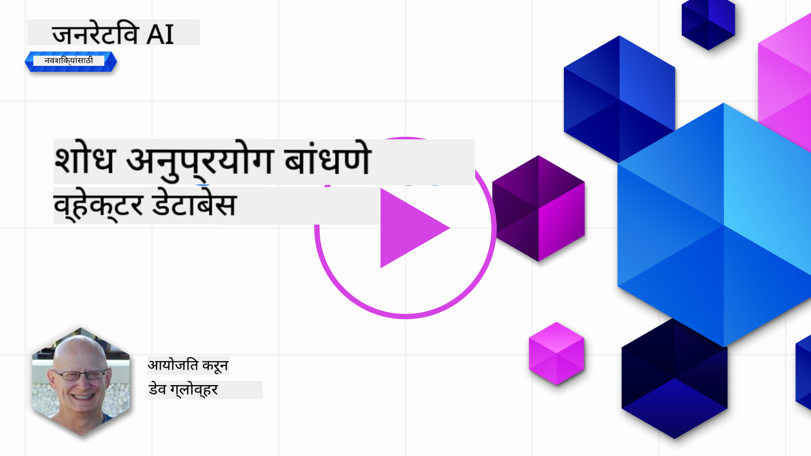
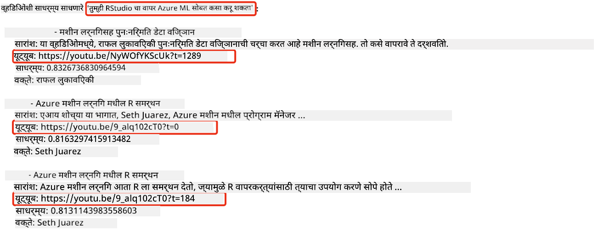
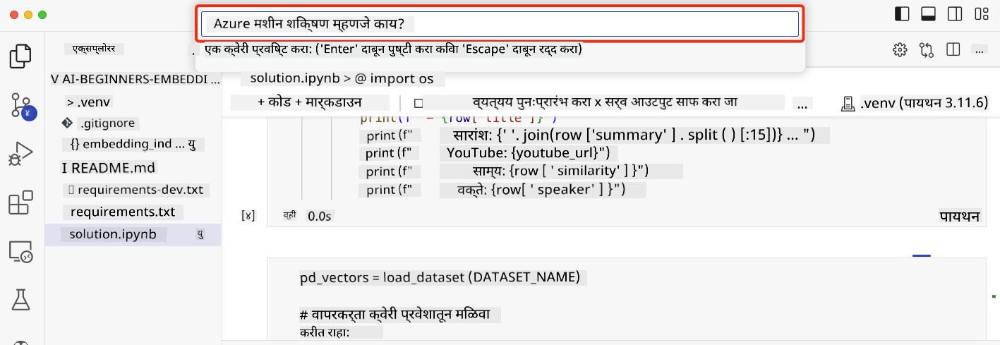

<!--
CO_OP_TRANSLATOR_METADATA:
{
  "original_hash": "d46aad0917a1a342d613e2c13d457da5",
  "translation_date": "2025-05-19T18:24:15+00:00",
  "source_file": "08-building-search-applications/README.md",
  "language_code": "mr"
}
-->
# शोध अनुप्रयोग तयार करणे

[](https://aka.ms/gen-ai-lesson8-gh?WT.mc_id=academic-105485-koreyst)

> > _या धड्याचा व्हिडिओ पाहण्यासाठी वरील प्रतिमेवर क्लिक करा_

LLMs मध्ये चॅटबॉट्स आणि मजकूर निर्मितीपेक्षा अधिक आहे. एम्बेडिंग्ज वापरून शोध अनुप्रयोग तयार करणे देखील शक्य आहे. एम्बेडिंग्ज म्हणजे डेटा चे संख्यात्मक प्रतिनिधित्व, ज्यांना व्हेक्टर्स म्हणून ओळखले जाते आणि डेटा साठी अर्थपूर्ण शोधासाठी वापरले जाऊ शकते.

या धड्यात, तुम्ही आमच्या शैक्षणिक स्टार्टअपसाठी शोध अनुप्रयोग तयार करणार आहात. आमचे स्टार्टअप एक ना-नफा संस्था आहे जी विकसनशील देशांतील विद्यार्थ्यांना मोफत शिक्षण प्रदान करते. आमच्या स्टार्टअपकडे बरीच यूट्यूब व्हिडिओ आहेत ज्याचा वापर विद्यार्थी AI बद्दल शिकण्यासाठी करू शकतात. आमचे स्टार्टअप एक शोध अनुप्रयोग तयार करू इच्छित आहे जो विद्यार्थ्यांना प्रश्न टाइप करून यूट्यूब व्हिडिओ शोधण्याची परवानगी देतो.

उदाहरणार्थ, एक विद्यार्थी 'जुपिटर नोटबुक्स काय आहेत?' किंवा 'Azure ML काय आहे' असा प्रश्न विचारू शकतो आणि शोध अनुप्रयोग त्या प्रश्नाशी संबंधित यूट्यूब व्हिडिओंची यादी परत करेल, आणि अजून चांगले म्हणजे, शोध अनुप्रयोग व्हिडिओमधील त्या ठिकाणी लिंक परत करेल जिथे प्रश्नाचे उत्तर आहे.

## परिचय

या धड्यात, आम्ही खालील गोष्टींचे कव्हर करणार आहोत:

- अर्थपूर्ण विरुद्ध कीवर्ड शोध.
- मजकूर एम्बेडिंग्ज म्हणजे काय.
- मजकूर एम्बेडिंग्ज इंडेक्स तयार करणे.
- मजकूर एम्बेडिंग्ज इंडेक्समध्ये शोध घेणे.

## शिकण्याची उद्दिष्टे

हा धडा पूर्ण केल्यानंतर, तुम्ही सक्षम असाल:

- अर्थपूर्ण आणि कीवर्ड शोधातील फरक सांगणे.
- मजकूर एम्बेडिंग्ज काय आहेत ते समजावून सांगणे.
- एम्बेडिंग्ज वापरून डेटा शोधण्यासाठी अनुप्रयोग तयार करणे.

## शोध अनुप्रयोग का तयार करायचा?

शोध अनुप्रयोग तयार केल्याने तुम्हाला एम्बेडिंग्ज वापरून डेटा शोधण्यासाठी कसे वापरायचे ते समजेल. तुम्ही असेही शिकाल की विद्यार्थ्यांना माहिती पटकन शोधण्यासाठी कसा शोध अनुप्रयोग तयार करायचा.

या धड्यात Microsoft [AI Show](https://www.youtube.com/playlist?list=PLlrxD0HtieHi0mwteKBOfEeOYf0LJU4O1) यूट्यूब चॅनलसाठी यूट्यूब प्रतिलेखांचा एम्बेडिंग इंडेक्स समाविष्ट आहे. AI शो हा यूट्यूब चॅनल आहे जो तुम्हाला AI आणि मशीन लर्निंगबद्दल शिकवतो. एम्बेडिंग इंडेक्समध्ये ऑक्टोबर 2023 पर्यंत प्रत्येक यूट्यूब प्रतिलेखासाठी एम्बेडिंग्ज आहेत. तुम्ही आमच्या स्टार्टअपसाठी शोध अनुप्रयोग तयार करण्यासाठी एम्बेडिंग इंडेक्स वापरणार आहात. शोध अनुप्रयोग व्हिडिओमधील त्या ठिकाणी लिंक परत करतो जिथे प्रश्नाचे उत्तर आहे. विद्यार्थ्यांना त्यांना हवी असलेली माहिती पटकन शोधण्यासाठी हा एक उत्तम मार्ग आहे.

'तुम्ही Azure ML सह rstudio वापरू शकता का?' या प्रश्नासाठी अर्थपूर्ण क्वेरीचे एक उदाहरण खालीलप्रमाणे आहे. यूट्यूब URL तपासा, तुम्हाला URL मध्ये एक टाइमस्टॅम्प दिसेल जो तुम्हाला व्हिडिओमध्ये त्या ठिकाणी घेऊन जाईल जिथे प्रश्नाचे उत्तर आहे.



## अर्थपूर्ण शोध म्हणजे काय?

आता तुम्हाला आश्चर्य वाटेल, अर्थपूर्ण शोध म्हणजे काय? अर्थपूर्ण शोध ही एक शोध तंत्र आहे जी क्वेरीतील शब्दांचे अर्थ किंवा अर्थ वापरून संबंधित परिणाम परत करते.

इथे अर्थपूर्ण शोधाचे एक उदाहरण आहे. समजा तुम्ही कार खरेदी करण्याचा विचार करत आहात, तुम्ही 'माझी स्वप्नातील कार' असे शोधू शकता, अर्थपूर्ण शोध समजतो की तुम्ही कारबद्दल `dreaming` करत नाही, तर तुम्ही तुमची `ideal` कार खरेदी करण्याचा विचार करत आहात. अर्थपूर्ण शोध तुमच्या हेतूला समजतो आणि संबंधित परिणाम परत करतो. पर्याय म्हणजे `keyword search` जे अक्षरशः कारच्या स्वप्नांसाठी शोधेल आणि अनेकदा असंबद्ध परिणाम परत करेल.

## मजकूर एम्बेडिंग्ज म्हणजे काय?

[मजकूर एम्बेडिंग्ज](https://en.wikipedia.org/wiki/Word_embedding?WT.mc_id=academic-105485-koreyst) ही [नैसर्गिक भाषा प्रक्रिया](https://en.wikipedia.org/wiki/Natural_language_processing?WT.mc_id=academic-105485-koreyst) मध्ये वापरली जाणारी मजकूर प्रतिनिधित्व तंत्रे आहेत. मजकूर एम्बेडिंग्ज म्हणजे मजकूराचे अर्थपूर्ण संख्यात्मक प्रतिनिधित्व. एम्बेडिंग्ज डेटा अशा प्रकारे दर्शवण्यासाठी वापरले जातात जे मशीनला समजण्यास सोपे आहे. मजकूर एम्बेडिंग्ज तयार करण्यासाठी अनेक मॉडेल्स आहेत, या धड्यात आपण OpenAI एम्बेडिंग मॉडेल वापरून एम्बेडिंग्ज तयार करण्यावर लक्ष केंद्रित करू.

इथे एक उदाहरण आहे, कल्पना करा की खालील मजकूर AI शो यूट्यूब चॅनलवरील एका एपिसोडच्या प्रतिलेखात आहे:

```text
Today we are going to learn about Azure Machine Learning.
```

आम्ही मजकूर OpenAI एम्बेडिंग API ला पाठवू आणि ते 1536 संख्यांचा समावेश असलेला खालील एम्बेडिंग परत करेल ज्याला व्हेक्टर म्हणून ओळखले जाते. व्हेक्टरमधील प्रत्येक संख्या मजकूराच्या वेगळ्या पैलूचे प्रतिनिधित्व करते. संक्षिप्ततेसाठी, व्हेक्टरमधील पहिल्या 10 संख्यांकडे येथे लक्ष दिले आहे.

```python
[-0.006655829958617687, 0.0026128944009542465, 0.008792596869170666, -0.02446001023054123, -0.008540431968867779, 0.022071078419685364, -0.010703742504119873, 0.003311325330287218, -0.011632772162556648, -0.02187200076878071, ...]
```

## एम्बेडिंग इंडेक्स कसा तयार केला जातो?

या धड्यासाठी एम्बेडिंग इंडेक्स पायथॉन स्क्रिप्ट्सच्या मालिकेद्वारे तयार केला गेला होता. तुम्हाला या धड्यासाठी 'स्क्रिप्ट्स' फोल्डरमध्ये [README](./scripts/README.md?WT.mc_id=academic-105485-koreyst) मध्ये स्क्रिप्ट्स आणि सूचनांसह आढळतील. तुम्हाला हा धडा पूर्ण करण्यासाठी या स्क्रिप्ट्स चालवण्याची गरज नाही कारण एम्बेडिंग इंडेक्स तुम्हाला प्रदान केला जातो.

स्क्रिप्ट्स खालील ऑपरेशन्स करतात:

1. [AI शो](https://www.youtube.com/playlist?list=PLlrxD0HtieHi0mwteKBOfEeOYf0LJU4O1) प्लेलिस्टमधील प्रत्येक यूट्यूब व्हिडिओसाठी प्रतिलेख डाउनलोड केले जाते.
2. [OpenAI फंक्शन्स](https://learn.microsoft.com/azure/ai-services/openai/how-to/function-calling?WT.mc_id=academic-105485-koreyst) वापरून, यूट्यूब प्रतिलेखाच्या पहिल्या 3 मिनिटांतून वक्त्याचे नाव काढण्याचा प्रयत्न केला जातो. प्रत्येक व्हिडिओसाठी वक्त्याचे नाव `embedding_index_3m.json` नावाच्या एम्बेडिंग इंडेक्समध्ये संग्रहित केले जाते.
3. प्रतिलेख मजकूर नंतर **3 मिनिटांच्या मजकूर विभागांमध्ये** विभागला जातो. विभागात एम्बेडिंग विभाग कापला जाऊ नये आणि चांगल्या शोध संदर्भासाठी पुढील विभागातील सुमारे 20 शब्द ओव्हरलॅपिंग असतात.
4. प्रत्येक मजकूर विभाग OpenAI चॅट API कडे मजकूर 60 शब्दांमध्ये सारांशित करण्यासाठी पाठवला जातो. सारांश देखील एम्बेडिंग इंडेक्स `embedding_index_3m.json` मध्ये संग्रहित केला जातो.
5. शेवटी, विभाग मजकूर OpenAI एम्बेडिंग API कडे पाठवला जातो. एम्बेडिंग API विभागाचे अर्थपूर्ण प्रतिनिधित्व करणाऱ्या 1536 संख्यांचा व्हेक्टर परत करते. विभाग OpenAI एम्बेडिंग व्हेक्टरसह एम्बेडिंग इंडेक्स `embedding_index_3m.json` मध्ये संग्रहित केला जातो.

### व्हेक्टर डेटाबेस

धड्याच्या साधेपणासाठी, एम्बेडिंग इंडेक्स एका JSON फाईलमध्ये `embedding_index_3m.json` नावाने संग्रहित केला जातो आणि पांडा डेटा फ्रेममध्ये लोड केला जातो. तथापि, उत्पादनामध्ये, एम्बेडिंग इंडेक्स [Azure Cognitive Search](https://learn.microsoft.com/training/modules/improve-search-results-vector-search?WT.mc_id=academic-105485-koreyst), [Redis](https://cookbook.openai.com/examples/vector_databases/redis/readme?WT.mc_id=academic-105485-koreyst), [Pinecone](https://cookbook.openai.com/examples/vector_databases/pinecone/readme?WT.mc_id=academic-105485-koreyst), [Weaviate](https://cookbook.openai.com/examples/vector_databases/weaviate/readme?WT.mc_id=academic-105485-koreyst) सारख्या व्हेक्टर डेटाबेसमध्ये संग्रहित केला जाईल, काहींच्या नावांसाठी.

## कोसाइन साम्य समजून घेणे

आपण मजकूर एम्बेडिंग्जबद्दल शिकलो आहोत, पुढील पायरी म्हणजे मजकूर एम्बेडिंग्ज वापरून डेटा कसा शोधायचा आणि विशेषतः दिलेल्या क्वेरीसाठी सर्वात समान एम्बेडिंग्ज कसे शोधायचे ते कोसाइन साम्य वापरून शिकणे.

### कोसाइन साम्य म्हणजे काय?

कोसाइन साम्य हे दोन व्हेक्टरमधील साम्याचे मापन आहे, तुम्ही हे `nearest neighbor search` म्हणूनही ऐकाल. कोसाइन साम्य शोध करण्यासाठी तुम्हाला OpenAI एम्बेडिंग API वापरून _क्वेरी_ मजकूरासाठी _व्हेक्टराइज_ करणे आवश्यक आहे. नंतर क्वेरी व्हेक्टर आणि एम्बेडिंग इंडेक्समधील प्रत्येक व्हेक्टरमधील _कोसाइन साम्य_ कॅल्क्युलेट करा. लक्षात ठेवा, एम्बेडिंग इंडेक्समध्ये प्रत्येक यूट्यूब प्रतिलेख मजकूर विभागासाठी एक व्हेक्टर आहे. शेवटी, कोसाइन साम्याने निकाल क्रमवारीत लावा आणि ज्या मजकूर विभागांचा कोसाइन साम्य सर्वाधिक आहे ते क्वेरीशी सर्वात समान आहेत.

गणिताच्या दृष्टिकोनातून, कोसाइन साम्य दोन व्हेक्टरच्या कोनाचा कोसाइन मोजतो जो बहुविमीय जागेत प्रोजेक्ट केलेला असतो. हे मोजमाप फायदेशीर आहे, कारण जर दोन दस्तऐवज आकारामुळे युक्लिडियन अंतराने दूर असतील, तर त्यांच्यामध्ये अजूनही एक लहान कोन असू शकतो आणि त्यामुळे उच्च कोसाइन साम्य असू शकतो. कोसाइन साम्य समीकरणांबद्दल अधिक माहितीसाठी, [कोसाइन साम्य](https://en.wikipedia.org/wiki/Cosine_similarity?WT.mc_id=academic-105485-koreyst) पहा.

## तुमचा पहिला शोध अनुप्रयोग तयार करणे

पुढे, आपण एम्बेडिंग्ज वापरून शोध अनुप्रयोग कसा तयार करायचा ते शिकणार आहोत. शोध अनुप्रयोग विद्यार्थ्यांना प्रश्न टाइप करून व्हिडिओ शोधण्याची परवानगी देईल. शोध अनुप्रयोग त्या प्रश्नाशी संबंधित व्हिडिओंची यादी परत करेल. शोध अनुप्रयोग देखील व्हिडिओमधील त्या ठिकाणी लिंक परत करेल जिथे प्रश्नाचे उत्तर आहे.

हे समाधान Windows 11, macOS, आणि Ubuntu 22.04 वर Python 3.10 किंवा नंतरच्या आवृत्तीसह तयार आणि चाचणी केले गेले. तुम्ही [python.org](https://www.python.org/downloads/?WT.mc_id=academic-105485-koreyst) वरून Python डाउनलोड करू शकता.

## असाइनमेंट - शोध अनुप्रयोग तयार करणे, विद्यार्थ्यांना सक्षम करणे

या धड्याच्या सुरुवातीला आपण आमच्या स्टार्टअपची ओळख करून दिली. आता विद्यार्थ्यांना त्यांच्या मूल्यांकनांसाठी शोध अनुप्रयोग तयार करण्यास सक्षम करण्याची वेळ आली आहे.

या असाइनमेंटमध्ये, तुम्ही Azure OpenAI Services तयार कराल जे शोध अनुप्रयोग तयार करण्यासाठी वापरले जातील. तुम्हाला हे असाइनमेंट पूर्ण करण्यासाठी Azure सदस्यता आवश्यक असेल.

### Azure क्लाउड शेल सुरू करा

1. [Azure पोर्टल](https://portal.azure.com/?WT.mc_id=academic-105485-koreyst) मध्ये साइन इन करा.
2. Azure पोर्टलच्या वरच्या उजव्या कोपर्यात क्लाउड शेल आयकॉन निवडा.
3. वातावरण प्रकारासाठी **Bash** निवडा.

#### संसाधन गट तयार करा

> या सूचनांसाठी, आम्ही पूर्व यूएस मधील "semantic-video-search" नावाच्या संसाधन गटाचा वापर करत आहोत.
> तुम्ही संसाधन गटाचे नाव बदलू शकता, परंतु संसाधनांसाठी स्थान बदलताना,
> [मॉडेल उपलब्धता तक्ता](https://aka.ms/oai/models?WT.mc_id=academic-105485-koreyst) तपासा.

```shell
az group create --name semantic-video-search --location eastus
```

#### Azure OpenAI सेवा संसाधन तयार करा

Azure क्लाउड शेलवरून, Azure OpenAI सेवा संसाधन तयार करण्यासाठी खालील आदेश चालवा.

```shell
az cognitiveservices account create --name semantic-video-openai --resource-group semantic-video-search \
    --location eastus --kind OpenAI --sku s0
```

#### या अनुप्रयोगात वापरण्यासाठी एंडपॉइंट आणि कीज मिळवा

Azure क्लाउड शेलवरून, Azure OpenAI सेवा संसाधनासाठी एंडपॉइंट आणि कीज मिळवण्यासाठी खालील आदेश चालवा.

```shell
az cognitiveservices account show --name semantic-video-openai \
   --resource-group  semantic-video-search | jq -r .properties.endpoint
az cognitiveservices account keys list --name semantic-video-openai \
   --resource-group semantic-video-search | jq -r .key1
```

#### OpenAI एम्बेडिंग मॉडेल तैनात करा

Azure क्लाउड शेलवरून, OpenAI एम्बेडिंग मॉडेल तैनात करण्यासाठी खालील आदेश चालवा.

```shell
az cognitiveservices account deployment create \
    --name semantic-video-openai \
    --resource-group  semantic-video-search \
    --deployment-name text-embedding-ada-002 \
    --model-name text-embedding-ada-002 \
    --model-version "2"  \
    --model-format OpenAI \
    --sku-capacity 100 --sku-name "Standard"
```

## समाधान

GitHub Codespaces मध्ये [समाधान नोटबुक](../../../08-building-search-applications/python/aoai-solution.ipynb) उघडा आणि जुपिटर नोटबुकमधील सूचनांचे अनुसरण करा.

जेव्हा तुम्ही नोटबुक चालवाल, तेव्हा तुम्हाला क्वेरी प्रविष्ट करण्यास सांगितले जाईल. इनपुट बॉक्स असे दिसेल:



## छान काम! तुमचे शिक्षण सुरू ठेवा

हा धडा पूर्ण केल्यानंतर, आमचा [जनरेटिव्ह AI शिक्षण संग्रह](https://aka.ms/genai-collection?WT.mc_id=academic-105485-koreyst) तपासा जेणेकरून तुमचे जनरेटिव्ह AI ज्ञान वाढवता येईल!

धडा 9 मध्ये जा जिथे आम्ही [प्रतिमा निर्मिती अनुप्रयोग कसे तयार करायचे](../09-building-image-applications/README.md?WT.mc_id=academic-105485-koreyst) ते पाहणार आहोत!

**अस्वीकृति**:  
हा दस्तऐवज AI अनुवाद सेवा [Co-op Translator](https://github.com/Azure/co-op-translator) वापरून अनुवादित करण्यात आला आहे. आम्ही अचूकतेसाठी प्रयत्नशील असलो तरी कृपया लक्षात ठेवा की स्वयंचलित अनुवादांमध्ये त्रुटी किंवा अचूकतेचा अभाव असू शकतो. मूळ भाषेतील मूळ दस्तऐवज अधिकारिक स्रोत मानला जावा. महत्वाच्या माहितीसाठी, व्यावसायिक मानवी अनुवादाची शिफारस केली जाते. या अनुवादाच्या वापरातून उद्भवणाऱ्या कोणत्याही गैरसमज किंवा चुकीच्या अर्थासाठी आम्ही जबाबदार नाही.