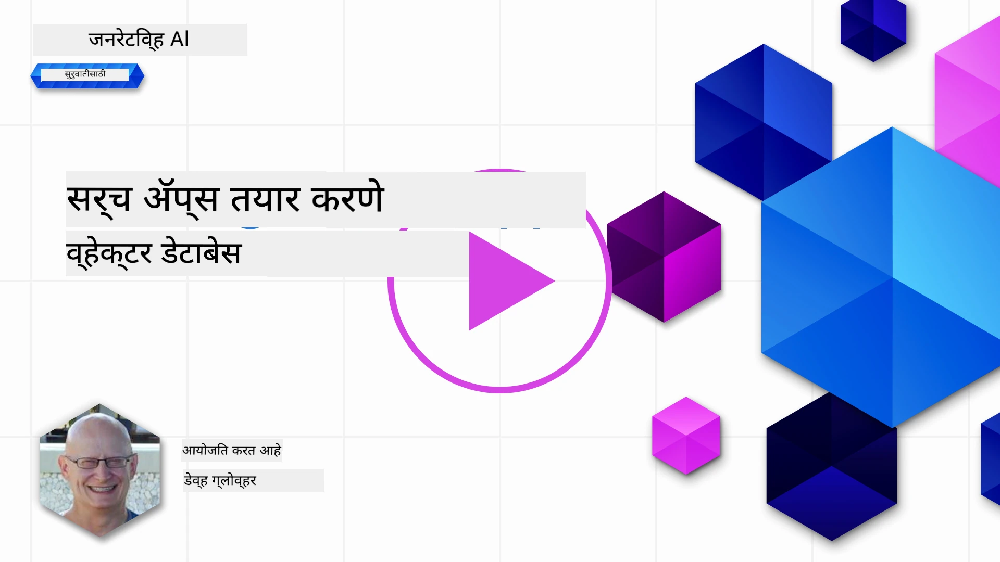
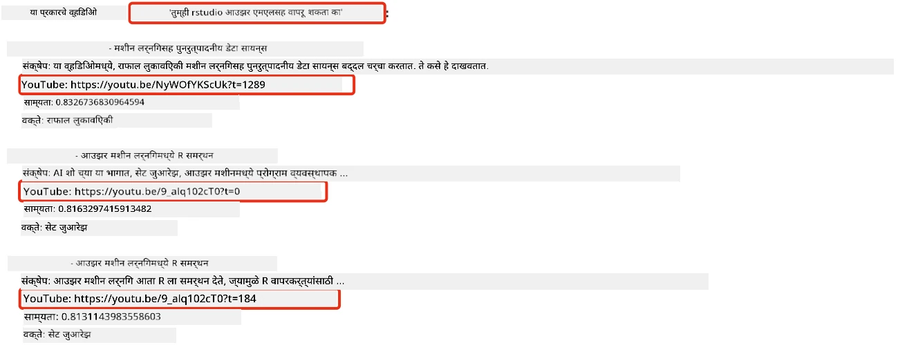
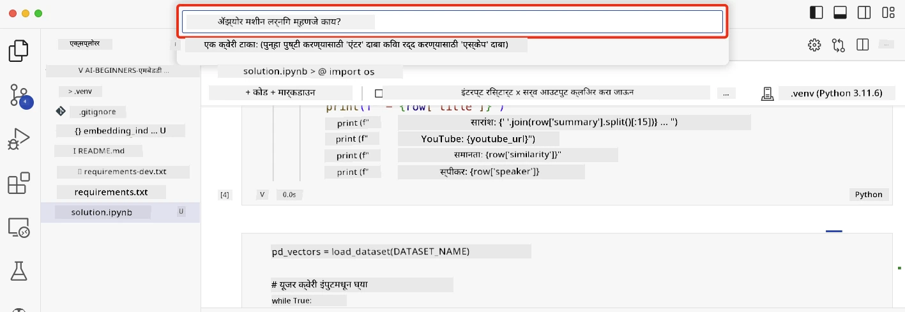

# शोध अनुप्रयोग तयार करणे

[](https://youtu.be/W0-nzXjOjr0?si=GcsqiTTvd7RKbo7V)

> > _हे धडा पाहण्यासाठी वरील प्रतिमा क्लिक करा_

LLMs म्हणजे फक्त चॅटबॉट्स आणि मजकूर निर्मितीपुरते मर्यादित नाहीत. Embeddings वापरून शोध अनुप्रयोग तयार करणे देखील शक्य आहे. Embeddings म्हणजे डेटाचे संख्यात्मक प्रतिनिधित्व जे वेक्टर्स म्हणूनही ओळखले जातात आणि हे डेटासाठी अर्थपूर्ण शोधासाठी वापरले जाऊ शकतात.

या धड्यात, आपण आमच्या शिक्षण स्टार्टअपसाठी एक शोध अनुप्रयोग तयार करणार आहोत. आमचा स्टार्टअप एक गैर-नफा संस्था आहे जी विकासशील देशांतील विद्यार्थ्यांना मुक्त शिक्षण प्रदान करते. आमच्या स्टार्टअपकडे अनेक YouTube व्हिडिओ आहेत ज्यांचा विद्यार्थी AI शिकण्यासाठी वापर करू शकतात. आमचा स्टार्टअप असा शोध अनुप्रयोग तयार करू इच्छितो जो विद्यार्थ्यांना प्रश्न टाकून YouTube व्हिडिओ शोधण्याची परवानगी देतो.

उदाहरणादाखल, विद्यार्थी 'Jupyter Notebooks काय आहेत?' किंवा 'Azure ML म्हणजे काय' असा प्रश्न टाकू शकतो आणि शोध अनुप्रयोग प्रश्नाशी संबंधित YouTube व्हिडिओंची यादी परत करेल आणि आणखी चांगले म्हणजे, शोध अनुप्रयोग त्या व्हिडिओतील त्या ठिकाणाचा दुवा देखील देईल जिथे प्रश्नाचे उत्तर आहे.

## परिचय

या धड्यात आपण आढळून पाहणार आहोत:

- अर्थपूर्ण आणि कीवर्ड शोध यामधील फरक.
- टेक्स्ट Embeddings काय आहेत.
- टेक्स्ट Embeddings इंडेक्स तयार करणे.
- टेक्स्ट Embeddings इंडेक्समध्ये शोध घेणे.

## शिक्षण उद्दिष्टे

हा धडा पूर्ण केल्यावर, आपण सक्षम असाल:

- अर्थपूर्ण आणि कीवर्ड शोध यामधील फरक सांगू शकणे.
- टेक्स्ट Embeddings काय आहेत हे समजावून सांगणे.
- Embeddings वापरून डेटा शोधण्यासाठी अनुप्रयोग तयार करणे.

## शोध अनुप्रयोग का तयार करणे?

शोध अनुप्रयोग तयार केल्याने आपल्याला डेटा शोधण्यासाठी Embeddings कसे वापरायचे हे समजेल. तसेच, आपण असे अनुप्रयोग तयार करायला शिकाल जे विद्यार्थ्यांना माहिती लवकर शोधायला मदत करेल.

या धड्यात Microsoft च्या [AI Show](https://www.youtube.com/playlist?list=PLlrxD0HtieHi0mwteKBOfEeOYf0LJU4O1) YouTube चॅनेलसाठी YouTube ट्रान्सक्रिप्ट्सचे Embedding इंडेक्स समाविष्ट आहे. AI Show हा YouTube चॅनेल आहे जो AI आणि मशीन लर्निंग विषयी शिकवतो. Embedding इंडेक्समध्ये ऑक्टोबर 2023 पर्यंतच्या प्रत्येक YouTube ट्रान्सक्रिप्टसाठी Embeddings आहेत. आपण हा Embedding इंडेक्स वापरून आमच्या स्टार्टअपसाठी शोध अनुप्रयोग तयार करणार आहोत. हा शोध अनुप्रयोग प्रश्नाचे उत्तर असलेल्या व्हिडिओतील ठिकाणाचा दुवा परत करतो. हे विद्यार्थ्यांसाठी आवश्यक माहिती लवकर शोधण्याचा उत्तम मार्ग आहे.

खालील उदाहरण प्रश्न 'आपण Azure ML सह rstudio वापरू शकता का?' या अर्थपूर्ण क्वेरीचे आहे. YouTube url पहा, url मध्ये timestamp आहे जो तुम्हाला त्या व्हिडिओतील त्या ठिकाणी घेऊन जातो जिथे प्रश्नाचे उत्तर आहे.



## अर्थपूर्ण शोध म्हणजे काय?

कदाचित तुम्हाला जाणून घ्यायचे आहे की अर्थपूर्ण शोध म्हणजे काय? अर्थपूर्ण शोध हा असा शोध तंत्र आहे जो क्वेरीतील शब्दांच्या अर्थ किंवा सेमँटिक्स वापरून संबंधित परिणाम परत करतो.

येथे एक अर्थपूर्ण शोधाचे उदाहरण आहे. समजा तुम्हाला कार विकत घ्यायची आहे, तुम्ही 'माझी स्वप्नातील कार' शोधा, अर्थपूर्ण शोध समजतो की तुम्ही कार स्वप्नात पाहत नाही, तर तुम्ही तुमची आदर्श कार विकत घ्यायची आहे. अर्थपूर्ण शोध तुमच्या इच्छेची जाणीव करून संबंधित परिणाम परत करतो. दुसरीकडे `कीवर्ड शोध` खऱ्या शब्दांच्या नितीने शोधतो आणि बहुतेक वेळा अप्रासंगिक परिणाम देतो.

## Text Embeddings काय आहेत?

[Text embeddings](https://en.wikipedia.org/wiki/Word_embedding?WT.mc_id=academic-105485-koreyst) हा एक मजकूर प्रतिनिधित्व तंत्र आहे जे [नैसर्गिक भाषा प्रक्रिया](https://en.wikipedia.org/wiki/Natural_language_processing?WT.mc_id=academic-105485-koreyst) मध्ये वापरले जाते. Text embeddings म्हणजे मजकुराचे अर्थपूर्ण संख्यात्मक प्रतिनिधित्व होय. Embeddings मशीनला समजण्यायोग्य पद्धतीने डेटा प्रतिबिंबित करतात. टेक्स्ट Embeddings तयार करण्यासाठी अनेक मॉडेल्स आहेत, या धड्यात आपण OpenAI Embedding मॉडेल वापरून Embeddings कसे तयार करायचे ते शिकणार आहोत.

उदाहरणार्थ, समजा खालील मजकूर AI Show YouTube चॅनेलच्या एका भागातील ट्रान्सक्रिप्टमध्ये आहे:

```text
Today we are going to learn about Azure Machine Learning.
```

आपण मजकूर OpenAI Embedding API कडे पाठवू आणि तो खालीलप्रमाणे 1536 संख्यांचा embedding परत करेल ज्याला vector असेही म्हणतात. vector मधील प्रत्येक संख्या मजकुराच्या एका वेगळ्या पैलूचे प्रतिनिधित्व करते. संक्षिप्ततेसाठी, येथे vector मधील पहिले 10 अंक दिले आहेत.

```python
[-0.006655829958617687, 0.0026128944009542465, 0.008792596869170666, -0.02446001023054123, -0.008540431968867779, 0.022071078419685364, -0.010703742504119873, 0.003311325330287218, -0.011632772162556648, -0.02187200076878071, ...]
```

## Embedding इंडेक्स कसा तयार होतो?

या धड्यासाठी Embedding इंडेक्स अनेक Python स्क्रिप्ट्स वापरून तयार केला गेला आहे. आपण 'scripts' फोल्डरमधील [README](./scripts/README.md?WT.mc_id=academic-105485-koreyst) मध्ये स्क्रिप्ट्स आणि सूचना पाहू शकता. तुम्हाला हा धडा पूर्ण करण्यासाठी या स्क्रिप्ट्स चालविण्याची गरज नाही कारण Embedding इंडेक्स तुम्हाला दिलेला आहे.

हे स्क्रिप्ट्स पुढील कार्ये करतात:

1. [AI Show](https://www.youtube.com/playlist?list=PLlrxD0HtieHi0mwteKBOfEeOYf0LJU4O1) प्लेलिस्टमधील प्रत्येक YouTube व्हिडिओसाठी ट्रान्सक्रिप्ट डाउनलोड केली जाते.
2. [OpenAI Functions](https://learn.microsoft.com/azure/ai-foundry/openai/how-to/function-calling?WT.mc_id=academic-105485-koreyst) वापरून YouTube ट्रान्सक्रिप्टमधील पहिल्या 3 मिनिटांमधून स्पीकरचे नाव काढण्याचा प्रयत्न केला जातो. प्रत्येक व्हिडिओसाठी स्पीकरचे नाव Embedding इंडेक्स `embedding_index_3m.json` मध्ये साठवले जाते.
3. ट्रान्सक्रिप्ट मजकूर नंतर **3 मिनिटांचे टुकडे** मध्ये विभागला जातो. टुकड्यामध्ये पुढील टुकड्यातून सुमारे 20 शब्दांचे ओव्हरलॅप असते जेणेकरून त्या टुकड्याचे Embedding कापले जाणार नाही आणि चांगला शोध संदर्भ मिळेल.
4. प्रत्येक मजकूराचा टुकडा OpenAI Chat API कडे पाठवला जातो ज्यात मजकूर 60 शब्दांमध्ये सारांशित केला जातो. हा सारांश देखील Embedding इंडेक्स `embedding_index_3m.json` मध्ये साठवला जातो.
5. शेवटी, टुकड्याचा मजकूर OpenAI Embedding API कडे पाठवला जातो. Embedding API त्याचा अर्थपूर्ण प्रतिनिधित्व करणारा 1536 संख्यांचा vector परत करतो. टुकडा आणि OpenAI Embedding vector एकत्रितपणे Embedding इंडेक्स `embedding_index_3m.json` मध्ये साठवले जातात.

### वेक्टर डेटाबेस

सोप्या करिता, Embedding इंडेक्स JSON फाईल `embedding_index_3m.json` मध्ये साठवला गेला आहे आणि Pandas DataFrame मध्ये लोड केला जातो. परंतु उत्पादनात, Embedding इंडेक्स वेक्टर डेटाबेसमध्ये संग्रहित केला जाऊ शकतो जसे की [Azure Cognitive Search](https://learn.microsoft.com/training/modules/improve-search-results-vector-search?WT.mc_id=academic-105485-koreyst), [Redis](https://cookbook.openai.com/examples/vector_databases/redis/readme?WT.mc_id=academic-105485-koreyst), [Pinecone](https://cookbook.openai.com/examples/vector_databases/pinecone/readme?WT.mc_id=academic-105485-koreyst), [Weaviate](https://cookbook.openai.com/examples/vector_databases/weaviate/readme?WT.mc_id=academic-105485-koreyst) इत्यादी.

## कोसाइन सादृश्यता समजून घेणे

आपण टेक्स्ट Embeddings विषयी शिकलो, पुढील टप्पा म्हणजे टेक्स्ट Embeddings वापरून डेटा कसा शोधायचा आणि कोसाइन सादृश्यतेचा वापर करून दिलेल्या क्वेरीला सर्वात सादृश्य Embeddings कसे शोधायचे हे शिकणे.

### कोसाइन सादृश्यता म्हणजे काय?

कोसाइन सादृश्यता दोन वेक्टरमधील सादृश्यतेचे मोजमाप आहे, याला 'नजीकच्या शेजारी शोध' असेही म्हणतात. कोसाइन सादृश्यता शोध करण्यासाठी, तुम्हाला OpenAI Embedding API वापरून क्वेरी मजकूराचा वेक्टर तयार करावा लागेल. नंतर क्वेरी वेक्टर आणि Embedding इंडेक्समधील प्रत्येक वेक्टर यांच्यात कोसाइन सादृश्यता मोजावी लागेल. लक्षात ठेवा, Embedding इंडेक्समध्ये प्रत्येक YouTube ट्रान्सक्रिप्ट टेक्स्ट सेगमेंटचा वेक्टर असतो. शेवटी, निकाल कोसाइन सादृश्यतेनुसार क्रमवारी लावा, ज्याचे कोणतेही टेक्स्ट सेगमेंट क्वेरीशी सर्वाधिक सादृश्य असेल तो वर येईल.

गणितीय दृष्टीने, कोसाइन सादृश्यता मल्टीडायमेन्शनल अवकाशात दोन वेक्टरमधील कोनाचा कोसाइन मोजते. हे मोजमाप उपयुक्त आहे कारण जर दोन दस्तऐवज Euclidean अंतराने दूर असले तरी, त्यांच्यातील कोन लहान आणि त्यामुळे कोसाइन सादृश्यता अधिक असू शकते. कोसाइन सादृश्यतेच्या अधिक माहितीसाठी, पाहा [Cosine similarity](https://en.wikipedia.org/wiki/Cosine_similarity?WT.mc_id=academic-105485-koreyst).

## तुमचा पहिला शोध अनुप्रयोग तयार करणे

पुढे, आपण Embeddings वापरून शोध अनुप्रयोग तयार कसा करायचा हे शिकणार आहोत. हा अनुप्रयोग विद्यार्थ्यांना प्रश्न विचारून व्हिडिओ शोधण्याची परवानगी देईल. अनुप्रयोग प्रश्नाशी संबंधित व्हिडिओंची यादी परत करेल. तसेच, व्हिडिओतील त्या ठिकाणाचा दुवा देखील देईल जिथे प्रश्नाचे उत्तर आहे.

हे समाधान Windows 11, macOS, आणि Ubuntu 22.04 वर Python 3.10 किंवा नंतरच्या आवृत्तीसह तयार व तपासलेले आहे. तुम्ही Python [python.org](https://www.python.org/downloads/?WT.mc_id=academic-105485-koreyst) वरून डाउनलोड करू शकता.

## असाइनमेंट - विद्यार्थ्यांना सक्षम करण्यासाठी शोध अनुप्रयोग तयार करणे

या धड्याच्या सुरुवातीला आपण आमच्या स्टार्टअपची ओळख करून दिली. आता विद्यार्थ्यांना त्यांच्या मूल्यमापनांसाठी शोध अनुप्रयोग तयार करण्यास सक्षम करण्याची वेळ आली आहे.

या असाइनमेंटमध्ये, तुम्ही Azure OpenAI Services तयार कराल ज्याचा वापर शोध अनुप्रयोग तयार करण्यासाठी केला जाईल. तुम्ही खालील Azure OpenAI Services तयार कराल. या असाइनमेंटची पूर्तता करण्यासाठी Azure सदस्यत्व आवश्यक आहे.

### Azure Cloud Shell सुरू करा

1. [Azure portal](https://portal.azure.com/?WT.mc_id=academic-105485-koreyst) मध्ये साइन इन करा.
2. Azure पोर्टलच्या वरच्या-उजव्या कोपias्र्यातील Cloud Shell आयकॉन निवडा.
3. पर्यावरण प्रकारासाठी **Bash** निवडा.

#### रिसोर्स ग्रुप तयार करा

> या सूचनांसाठी, आपण "semantic-video-search" नावाचा रिसोर्स ग्रुप East US मध्ये वापरत आहोत.
> तुम्ही रिसोर्स ग्रुपचे नाव बदलू शकता, पण रिसोर्सेससाठी स्थान बदलताना,
> [मॉडेल उपलब्धतेचे सारणी](https://aka.ms/oai/models?WT.mc_id=academic-105485-koreyst) तपासा.

```shell
az group create --name semantic-video-search --location eastus
```

#### Azure OpenAI Service रिसोर्स तयार करा

Azure Cloud Shell मधून खालील कमांड चालवून Azure OpenAI Service रिसोर्स तयार करा.

```shell
az cognitiveservices account create --name semantic-video-openai --resource-group semantic-video-search \
    --location eastus --kind OpenAI --sku s0
```

#### या अनुप्रयोगासाठी endpoint आणि keys मिळवा

Azure Cloud Shell मधून पुढील कमांड्स चालवून Azure OpenAI Service रिसोर्ससाठी endpoint आणि keys मिळवा.

```shell
az cognitiveservices account show --name semantic-video-openai \
   --resource-group  semantic-video-search | jq -r .properties.endpoint
az cognitiveservices account keys list --name semantic-video-openai \
   --resource-group semantic-video-search | jq -r .key1
```

#### OpenAI Embedding मॉडेल तैनात करा

Azure Cloud Shell मधून खालील कमांड चालवून OpenAI Embedding मॉडेल तैनात करा.

```shell
az cognitiveservices account deployment create \
    --name semantic-video-openai \
    --resource-group  semantic-video-search \
    --deployment-name text-embedding-ada-002 \
    --model-name text-embedding-ada-002 \
    --model-version "2"  \
    --model-format OpenAI \
    --sku-capacity 100 --sku-name "Standard"
```

## समाधान

GitHub Codespaces मध्ये [solution notebook](./python/aoai-solution.ipynb?WT.mc_id=academic-105485-koreyst) उघडा आणि Jupyter Notebook मधील सूचनांचे पालन करा.

जेव्हा आपण नोटबुक चालवाल, तेव्हा तुम्हाला क्वेरी टाकण्यास विचारणा केली जाईल. इनपुट बॉक्स असाच दिसेल:



## खूप छान! तुमचे शिक्षण सुरू ठेवा

हा धडा पूर्ण केल्यानंतर, आमचा [जनरेटिव्ह AI शिक्षण संच](https://aka.ms/genai-collection?WT.mc_id=academic-105485-koreyst) पाहा आणि तुमचे जनरेटिव्ह AI ज्ञान वाढवत राहा!

धडा 9 कडे पुढे जा जिथे आपण [प्रतिमा निर्मिती अनुप्रयोग कसे तयार करायचे](../09-building-image-applications/README.md?WT.mc_id=academic-105485-koreyst) पाहणार आहोत!

---

<!-- CO-OP TRANSLATOR DISCLAIMER START -->
**अस्वीकरण**:
हा दस्तऐवज AI भाषांतर सेवा [Co-op Translator](https://github.com/Azure/co-op-translator) चा वापर करून अनुवादित केला आहे. जरी आम्ही अचूकतेसाठी प्रयत्न करतो, तरी कृपया लक्षात घ्या की स्वयंचलित भाषांतरांमध्ये त्रुटी किंवा अचूकतेची कमतरता असू शकते. मूळ दस्तऐवज त्याच्या मूळ भाषेत अधिकृत स्रोत मानला पाहिजे. महत्त्वाची माहिती असल्यास, व्यावसायिक मानवी भाषांतराची शिफारस केली जाते. या भाषांतराच्या वापरामुळे उद्भवणाऱ्या कोणत्याही गैरसमज किंवा चुकीच्या अर्थलावणीसाठी आम्ही जबाबदार नाही.
<!-- CO-OP TRANSLATOR DISCLAIMER END -->