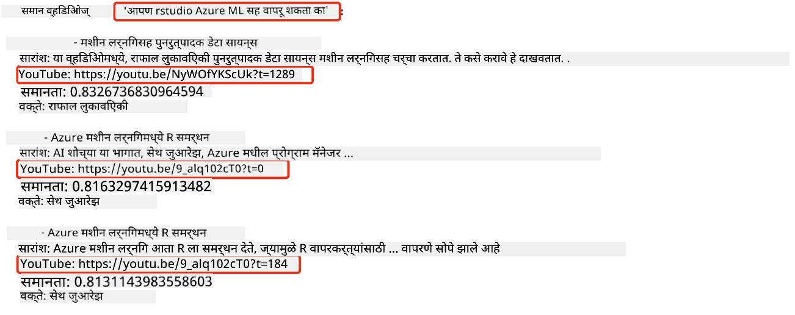
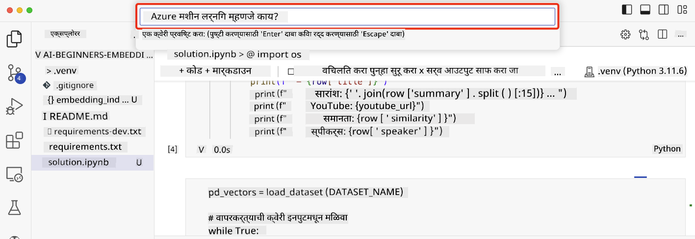

<!--
CO_OP_TRANSLATOR_METADATA:
{
  "original_hash": "58953c08b8ba7073b836d4270ea0fe86",
  "translation_date": "2025-10-17T13:41:23+00:00",
  "source_file": "08-building-search-applications/README.md",
  "language_code": "mr"
}
-->
# शोध अनुप्रयोग तयार करणे

[](https://youtu.be/W0-nzXjOjr0?si=GcsqiTTvd7RKbo7V)

> > _वरील प्रतिमेवर क्लिक करा आणि या धड्याचा व्हिडिओ पहा_

LLMs केवळ चॅटबॉट्स आणि मजकूर निर्मितीपुरते मर्यादित नाहीत. एम्बेडिंग्ज वापरून शोध अनुप्रयोग तयार करणे देखील शक्य आहे. एम्बेडिंग्ज म्हणजे डेटा साठी संख्यात्मक प्रतिनिधित्व, ज्याला व्हेक्टर असेही म्हणतात, आणि ते डेटा साठी सेमॅंटिक शोधासाठी वापरले जाऊ शकते.

या धड्यात, तुम्ही आमच्या शिक्षण स्टार्टअपसाठी शोध अनुप्रयोग तयार करणार आहात. आमचा स्टार्टअप एक ना-नफा संस्था आहे जी विकसनशील देशांतील विद्यार्थ्यांना मोफत शिक्षण प्रदान करते. आमच्या स्टार्टअपकडे मोठ्या प्रमाणात YouTube व्हिडिओ आहेत ज्याचा वापर विद्यार्थी AI बद्दल शिकण्यासाठी करू शकतात. आमचा स्टार्टअप एक शोध अनुप्रयोग तयार करू इच्छित आहे जो विद्यार्थ्यांना प्रश्न टाइप करून YouTube व्हिडिओ शोधण्याची परवानगी देतो.

उदाहरणार्थ, एखादा विद्यार्थी 'जुपिटर नोटबुक्स काय आहेत?' किंवा 'Azure ML म्हणजे काय?' असे टाइप करू शकतो आणि शोध अनुप्रयोग संबंधित व्हिडिओंची यादी परत करेल. त्याहून चांगले म्हणजे, शोध अनुप्रयोग व्हिडिओमधील त्या ठिकाणी लिंक परत करेल जिथे प्रश्नाचे उत्तर दिले आहे.

## परिचय

या धड्यात, आपण कव्हर करू:

- सेमॅंटिक वि कीवर्ड शोध.
- टेक्स्ट एम्बेडिंग्ज म्हणजे काय.
- टेक्स्ट एम्बेडिंग्ज इंडेक्स तयार करणे.
- टेक्स्ट एम्बेडिंग्ज इंडेक्स शोधणे.

## शिकण्याची उद्दिष्टे

हा धडा पूर्ण केल्यानंतर, तुम्ही:

- सेमॅंटिक आणि कीवर्ड शोधातील फरक सांगू शकता.
- टेक्स्ट एम्बेडिंग्ज म्हणजे काय ते स्पष्ट करू शकता.
- डेटा शोधण्यासाठी एम्बेडिंग्ज वापरून अनुप्रयोग तयार करू शकता.

## शोध अनुप्रयोग का तयार करावा?

शोध अनुप्रयोग तयार केल्याने तुम्हाला डेटा शोधण्यासाठी एम्बेडिंग्ज कसे वापरायचे हे समजण्यास मदत होईल. तुम्ही विद्यार्थ्यांना माहिती पटकन शोधण्यासाठी वापरता येईल असा शोध अनुप्रयोग तयार करणे देखील शिकाल.

या धड्यात Microsoft [AI Show](https://www.youtube.com/playlist?list=PLlrxD0HtieHi0mwteKBOfEeOYf0LJU4O1) YouTube चॅनलसाठी YouTube ट्रान्सक्रिप्ट्सचा एम्बेडिंग इंडेक्स समाविष्ट आहे. AI Show हा YouTube चॅनल आहे जो तुम्हाला AI आणि मशीन लर्निंगबद्दल शिकवतो. एम्बेडिंग इंडेक्स ऑक्टोबर 2023 पर्यंत प्रत्येक YouTube ट्रान्सक्रिप्टसाठी एम्बेडिंग्ज समाविष्ट करतो. तुम्ही आमच्या स्टार्टअपसाठी शोध अनुप्रयोग तयार करण्यासाठी एम्बेडिंग इंडेक्स वापराल. शोध अनुप्रयोग व्हिडिओमधील त्या ठिकाणी लिंक परत करतो जिथे प्रश्नाचे उत्तर दिले आहे. विद्यार्थ्यांना त्यांना आवश्यक असलेली माहिती पटकन शोधण्यासाठी हा एक उत्तम मार्ग आहे.

खाली 'Azure ML सह rstudio वापरता येईल का?' या प्रश्नासाठी सेमॅंटिक क्वेरीचे उदाहरण दिले आहे. YouTube URL तपासा, तुम्हाला URL मध्ये एक टाइमस्टॅम्प दिसेल जो तुम्हाला व्हिडिओमधील त्या ठिकाणी घेऊन जाईल जिथे प्रश्नाचे उत्तर दिले आहे.



## सेमॅंटिक शोध म्हणजे काय?

आता तुम्हाला आश्चर्य वाटेल, सेमॅंटिक शोध म्हणजे काय? सेमॅंटिक शोध ही एक शोध तंत्र आहे जी क्वेरीमधील शब्दांचा अर्थ वापरून संबंधित परिणाम परत करते.

सेमॅंटिक शोधाचे एक उदाहरण येथे आहे. समजा तुम्ही कार खरेदी करण्याचा विचार करत आहात, तुम्ही 'माझी स्वप्नातील कार' शोधू शकता, सेमॅंटिक शोध समजतो की तुम्ही कारबद्दल `स्वप्न` पाहत नाही, तर तुम्ही तुमची `आदर्श` कार खरेदी करण्याचा विचार करत आहात. सेमॅंटिक शोध तुमचा हेतू समजतो आणि संबंधित परिणाम परत करतो. पर्याय म्हणजे `कीवर्ड शोध` जो अक्षरशः कारबद्दल स्वप्न शोधेल आणि अनेकदा असंबंधित परिणाम परत करतो.

## टेक्स्ट एम्बेडिंग्ज म्हणजे काय?

[टेक्स्ट एम्बेडिंग्ज](https://en.wikipedia.org/wiki/Word_embedding?WT.mc_id=academic-105485-koreyst) ही [नैसर्गिक भाषा प्रक्रिया](https://en.wikipedia.org/wiki/Natural_language_processing?WT.mc_id=academic-105485-koreyst) मध्ये वापरली जाणारी मजकूर प्रतिनिधित्व तंत्र आहे. टेक्स्ट एम्बेडिंग्ज मजकूराचे सेमॅंटिक संख्यात्मक प्रतिनिधित्व आहेत. एम्बेडिंग्ज डेटा मशीनसाठी समजण्यास सोपे असलेल्या प्रकारे सादर करण्यासाठी वापरले जातात. टेक्स्ट एम्बेडिंग्ज तयार करण्यासाठी अनेक मॉडेल्स आहेत, या धड्यात, आपण OpenAI एम्बेडिंग मॉडेल वापरून एम्बेडिंग्ज तयार करण्यावर लक्ष केंद्रित करू.

येथे एक उदाहरण आहे, कल्पना करा की खालील मजकूर AI Show YouTube चॅनलवरील एका एपिसोडच्या ट्रान्सक्रिप्टमध्ये आहे:

```text
Today we are going to learn about Azure Machine Learning.
```

आम्ही OpenAI एम्बेडिंग API ला मजकूर पास करू आणि ते 1536 संख्यांचा एम्बेडिंग परत करेल ज्याला व्हेक्टर म्हणतात. व्हेक्टरमधील प्रत्येक संख्या मजकूराच्या वेगवेगळ्या पैलूचे प्रतिनिधित्व करते. संक्षिप्ततेसाठी, व्हेक्टरमधील पहिल्या 10 संख्या येथे आहेत.

```python
[-0.006655829958617687, 0.0026128944009542465, 0.008792596869170666, -0.02446001023054123, -0.008540431968867779, 0.022071078419685364, -0.010703742504119873, 0.003311325330287218, -0.011632772162556648, -0.02187200076878071, ...]
```

## एम्बेडिंग इंडेक्स कसा तयार केला जातो?

या धड्याचा एम्बेडिंग इंडेक्स Python स्क्रिप्ट्सच्या मालिकेद्वारे तयार केला गेला. तुम्हाला या धड्याच्या 'scripts' फोल्डरमधील [README](./scripts/README.md?WT.mc_id=academic-105485-koreyst) मध्ये स्क्रिप्ट्स आणि सूचना सापडतील. तुम्हाला या धड्याचा एम्बेडिंग इंडेक्स पूर्ण करण्यासाठी या स्क्रिप्ट्स चालवण्याची आवश्यकता नाही कारण एम्बेडिंग इंडेक्स तुम्हाला प्रदान केला आहे.

स्क्रिप्ट्स खालील ऑपरेशन्स करतात:

1. [AI Show](https://www.youtube.com/playlist?list=PLlrxD0HtieHi0mwteKBOfEeOYf0LJU4O1) प्लेलिस्टमधील प्रत्येक YouTube व्हिडिओसाठी ट्रान्सक्रिप्ट डाउनलोड केली जाते.
2. [OpenAI Functions](https://learn.microsoft.com/azure/ai-services/openai/how-to/function-calling?WT.mc_id=academic-105485-koreyst) वापरून, YouTube ट्रान्सक्रिप्टच्या पहिल्या 3 मिनिटांमधून स्पीकरचे नाव काढण्याचा प्रयत्न केला जातो. प्रत्येक व्हिडिओसाठी स्पीकरचे नाव `embedding_index_3m.json` नावाच्या एम्बेडिंग इंडेक्समध्ये संग्रहित केले जाते.
3. ट्रान्सक्रिप्ट मजकूर **3 मिनिटांच्या मजकूर विभागांमध्ये** विभागला जातो. विभागात पुढील विभागातील सुमारे 20 शब्द ओव्हरलॅपिंग समाविष्ट आहेत जेणेकरून विभागासाठी एम्बेडिंग कट ऑफ होणार नाही आणि चांगल्या शोध संदर्भासाठी.
4. प्रत्येक मजकूर विभाग OpenAI Chat API ला पास केला जातो जे मजकूर 60 शब्दांमध्ये संक्षिप्त करते. सारांश देखील `embedding_index_3m.json` एम्बेडिंग इंडेक्समध्ये संग्रहित केला जातो.
5. शेवटी, विभाग मजकूर OpenAI एम्बेडिंग API ला पास केला जातो. एम्बेडिंग API विभागाचा सेमॅंटिक अर्थ दर्शवणाऱ्या 1536 संख्यांचा व्हेक्टर परत करतो. विभाग OpenAI एम्बेडिंग व्हेक्टरसह `embedding_index_3m.json` एम्बेडिंग इंडेक्समध्ये संग्रहित केला जातो.

### व्हेक्टर डेटाबेस

धड्याच्या साधेपणासाठी, एम्बेडिंग इंडेक्स `embedding_index_3m.json` नावाच्या JSON फाइलमध्ये संग्रहित केला जातो आणि Pandas DataFrame मध्ये लोड केला जातो. तथापि, उत्पादनात, एम्बेडिंग इंडेक्स [Azure Cognitive Search](https://learn.microsoft.com/training/modules/improve-search-results-vector-search?WT.mc_id=academic-105485-koreyst), [Redis](https://cookbook.openai.com/examples/vector_databases/redis/readme?WT.mc_id=academic-105485-koreyst), [Pinecone](https://cookbook.openai.com/examples/vector_databases/pinecone/readme?WT.mc_id=academic-105485-koreyst), [Weaviate](https://cookbook.openai.com/examples/vector_databases/weaviate/readme?WT.mc_id=academic-105485-koreyst) यांसारख्या व्हेक्टर डेटाबेसमध्ये संग्रहित केला जाईल.

## कोसाइन साम्य समजून घेणे

आपण टेक्स्ट एम्बेडिंग्जबद्दल शिकले आहे, पुढील चरण म्हणजे टेक्स्ट एम्बेडिंग्ज वापरून डेटा शोधणे आणि विशेषतः कोसाइन साम्य वापरून दिलेल्या क्वेरीसाठी सर्वात समान एम्बेडिंग्ज शोधणे.

### कोसाइन साम्य म्हणजे काय?

कोसाइन साम्य दोन व्हेक्टरमधील साम्याचे मोजमाप आहे, याला `nearest neighbor search` असेही म्हणतात. कोसाइन साम्य शोध करण्यासाठी तुम्हाला OpenAI एम्बेडिंग API वापरून _क्वेरी_ मजकूरासाठी _व्हेक्टराइझ_ करणे आवश्यक आहे. नंतर क्वेरी व्हेक्टर आणि एम्बेडिंग इंडेक्समधील प्रत्येक व्हेक्टरमधील _कोसाइन साम्य_ मोजा. लक्षात ठेवा, एम्बेडिंग इंडेक्समध्ये प्रत्येक YouTube ट्रान्सक्रिप्ट मजकूर विभागासाठी एक व्हेक्टर आहे. शेवटी, कोसाइन साम्याने परिणाम क्रमवारीत लावा आणि सर्वाधिक कोसाइन साम्य असलेल्या मजकूर विभाग क्वेरीसाठी सर्वात समान आहेत.

गणितीय दृष्टिकोनातून, कोसाइन साम्य दोन व्हेक्टरमधील बहु-आयामी जागेत प्रोजेक्ट केलेल्या कोनाचा कोसाइन मोजतो. हे मोजमाप फायदेशीर आहे, कारण जर दोन दस्तऐवज आकारामुळे युक्लिडियन अंतराने दूर असतील, तर त्यांच्यात अजूनही कमी कोन असू शकतो आणि त्यामुळे उच्च कोसाइन साम्य असू शकते. कोसाइन साम्य समीकरणांबद्दल अधिक माहितीसाठी, [Cosine similarity](https://en.wikipedia.org/wiki/Cosine_similarity?WT.mc_id=academic-105485-koreyst) पहा.

## तुमचा पहिला शोध अनुप्रयोग तयार करणे

पुढे, आपण एम्बेडिंग्ज वापरून शोध अनुप्रयोग कसा तयार करायचा ते शिकणार आहोत. शोध अनुप्रयोग विद्यार्थ्यांना प्रश्न टाइप करून व्हिडिओ शोधण्याची परवानगी देईल. शोध अनुप्रयोग प्रश्नाशी संबंधित व्हिडिओंची यादी परत करेल. शोध अनुप्रयोग व्हिडिओमधील त्या ठिकाणी लिंक देखील परत करेल जिथे प्रश्नाचे उत्तर दिले आहे.

हे समाधान Windows 11, macOS आणि Ubuntu 22.04 वर Python 3.10 किंवा नंतरच्या आवृत्तीचा वापर करून तयार आणि चाचणी केले गेले आहे. तुम्ही [python.org](https://www.python.org/downloads/?WT.mc_id=academic-105485-koreyst) वरून Python डाउनलोड करू शकता.

## असाइनमेंट - विद्यार्थ्यांना सक्षम करण्यासाठी शोध अनुप्रयोग तयार करणे

या धड्याच्या सुरुवातीला आम्ही आमच्या स्टार्टअपची ओळख करून दिली. आता विद्यार्थ्यांना त्यांच्या मूल्यांकनासाठी शोध अनुप्रयोग तयार करण्यास सक्षम करण्याची वेळ आली आहे.

या असाइनमेंटमध्ये, तुम्ही शोध अनुप्रयोग तयार करण्यासाठी वापरल्या जाणाऱ्या Azure OpenAI Services तयार कराल. तुम्ही खालील Azure OpenAI Services तयार कराल. ही असाइनमेंट पूर्ण करण्यासाठी तुम्हाला Azure सदस्यता आवश्यक आहे.

### Azure Cloud Shell सुरू करा

1. [Azure पोर्टल](https://portal.azure.com/?WT.mc_id=academic-105485-koreyst) मध्ये साइन इन करा.
2. Azure पोर्टलच्या वरच्या उजव्या कोपर्यात Cloud Shell आयकॉन निवडा.
3. **Bash** पर्यावरण प्रकार निवडा.

#### संसाधन गट तयार करा

> या सूचनांसाठी, आम्ही East US मध्ये "semantic-video-search" नावाचा संसाधन गट वापरत आहोत.
> तुम्ही संसाधन गटाचे नाव बदलू शकता, परंतु संसाधनांसाठी स्थान बदलताना,
> [मॉडेल उपलब्धता टेबल](https://aka.ms/oai/models?WT.mc_id=academic-105485-koreyst) तपासा.

```shell
az group create --name semantic-video-search --location eastus
```

#### Azure OpenAI Service संसाधन तयार करा

Azure Cloud Shell मधून, Azure OpenAI Service संसाधन तयार करण्यासाठी खालील कमांड चालवा.

```shell
az cognitiveservices account create --name semantic-video-openai --resource-group semantic-video-search \
    --location eastus --kind OpenAI --sku s0
```

#### या अनुप्रयोगात वापरण्यासाठी एंडपॉइंट आणि कीज मिळवा

Azure Cloud Shell मधून, Azure OpenAI Service संसाधनासाठी एंडपॉइंट आणि कीज मिळवण्यासाठी खालील कमांड चालवा.

```shell
az cognitiveservices account show --name semantic-video-openai \
   --resource-group  semantic-video-search | jq -r .properties.endpoint
az cognitiveservices account keys list --name semantic-video-openai \
   --resource-group semantic-video-search | jq -r .key1
```

#### OpenAI एम्बेडिंग मॉडेल तैनात करा

Azure Cloud Shell मधून, OpenAI एम्बेडिंग मॉडेल तैनात करण्यासाठी खालील कमांड चालवा.

```shell
az cognitiveservices account deployment create \
    --name semantic-video-openai \
    --resource-group  semantic-video-search \
    --deployment-name text-embedding-ada-002 \
    --model-name text-embedding-ada-002 \
    --model-version "2"  \
    --model-format OpenAI \
    --sku-capacity 100 --sku-name "Standard"
```

## समाधान

GitHub Codespaces मध्ये [solution notebook](./python/aoai-solution.ipynb?WT.mc_id=academic-105485-koreyst) उघडा आणि Jupyter Notebook मधील सूचनांचे अनुसरण करा.

जेव्हा तुम्ही नोटबुक चालवाल, तेव्हा तुम्हाला क्वेरी प्रविष्ट करण्यास सांगितले जाईल. इनपुट बॉक्स असे दिसेल:



## उत्तम काम! तुमचे शिक्षण सुरू ठेवा

हा धडा पूर्ण केल्यानंतर, आमचा [Generative AI Learning collection](https://aka.ms/genai-collection?WT.mc_id=academic-105485-koreyst) तपासा आणि तुमचे जनरेटिव्ह AI ज्ञान वाढवा!

Lesson 9 मध्ये जा जिथे आपण [प्रतिमा निर्मिती अनुप्रयोग तयार करणे](../09-building-image-applications/README.md?WT.mc_id=academic-105485-koreyst) पाहणार आहोत!

---

**अस्वीकरण**:  
हा दस्तऐवज AI भाषांतर सेवा [Co-op Translator](https://github.com/Azure/co-op-translator) वापरून भाषांतरित करण्यात आला आहे. आम्ही अचूकतेसाठी प्रयत्नशील असलो तरी, कृपया लक्षात ठेवा की स्वयंचलित भाषांतरे त्रुटी किंवा अचूकतेच्या अभावाने युक्त असू शकतात. मूळ भाषेतील दस्तऐवज हा अधिकृत स्रोत मानला जावा. महत्त्वाच्या माहितीसाठी, व्यावसायिक मानवी भाषांतराची शिफारस केली जाते. या भाषांतराचा वापर करून झालेल्या कोणत्याही गैरसमज किंवा चुकीच्या अर्थासाठी आम्ही जबाबदार राहणार नाही.