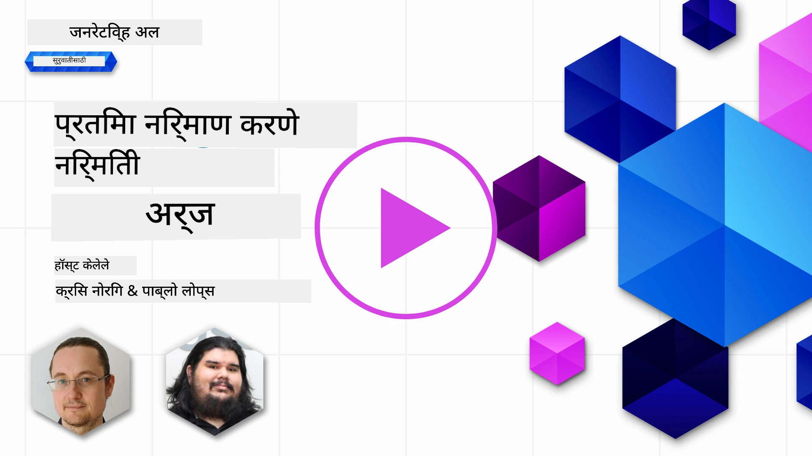

# प्रतिमा निर्माण अनुप्रयोग तयार करणे

[](https://aka.ms/gen-ai-lesson9-gh?WT.mc_id=academic-105485-koreyst)

LLM फक्त मजकूर निर्मितीसाठीच नाहीत. तुम्ही मजकूर वर्णनांमधून प्रतिमा देखील तयार करू शकता. प्रतिमा एक माध्यम म्हणून MedTech, वास्तुकला, पर्यटन, गेम विकास, विपणन आणि अधिकमध्ये उपयुक्त आहेत. या धड्यात आपण आजच्या **GPT Image** मॉडेल्सकडे पाहतो आणि एक प्रतिमा निर्मिती अ‍ॅप तयार करतो.

## परिचय

प्रतिमा निर्मिती तुम्हाला नैसर्गिक-भाषेच्या प्रॉम्प्टमधून चित्रात रूपांतर करण्याची परवानगी देते. या धड्यात आपण OpenAI च्या **`gpt-image`** कुटुंबाच्या मॉडेल्ससह काम करतो - जे सध्या **[Microsoft Foundry](https://ai.azure.com?WT.mc_id=academic-105485-koreyst)** आणि OpenAI प्लॅटफॉर्मवर उपलब्ध आहेत. ही मॉडेल्स जुने DALL·E मॉडेल्स (DALL·E 2/3 हे वारसाहक्काचे आहेत) बदलतात.

संपूर्ण धड्यात आपण एक काल्पनिक स्टार्टअप, **Edu4All**, वापरतो, जे शिक्षण साधने तयार करते. टीम असाइन्मेंट्स आणि अध्ययन साहित्यांसाठी चित्रे तयार करू इच्छिते.

## शिकण्याचे उद्दिष्टे

या धड्याच्या शेवटी तुम्ही सक्षम असाल:

- प्रतिमा निर्मिती काय आहे आणि ते कुठे उपयुक्त आहे हे समजावून सांगणे.
- `gpt-image` मॉडेल कुटुंब आणि ते जुने DALL·E मॉडेल्सपासून कसे वेगळे आहे हे समजणे.
- Python (आणि TypeScript / .NET) मध्ये प्रतिमा निर्मिती अ‍ॅप तयार करणे.
- प्रतिमा संपादित करणे आणि मेटाप्रॉम्प्टसह सुरक्षा गार्डरेलबाबत माहिती.

## प्रतिमा निर्मिती म्हणजे काय?

प्रतिमा निर्मिती मॉडेल्स मजकूर प्रॉम्प्टमधून प्रतिमा तयार करतात. आधुनिक मॉडेल्स जसे की `gpt-image` ट्रान्सफॉर्मर + डिफ्यूजन तंत्रांचा वापर करून तयार होतात: मॉडेल प्रशिक्षणादरम्यान मजकूर आणि प्रतिमांमधील नाता शिकतो, नंतर प्रॉम्प्ट दिल्यावर, पुनरावृत्तीने यादृच्छिक आवाज "दूर" करून प्रतिमा तयार करतो जी वर्णनाशी जुळते.

प्रतिमा मॉडेल्सचे दोन परिचित कुटुंब आहेत:

- **`gpt-image` (OpenAI)** - सध्याचे उत्पादन, हा धडा यात वापरिला आहे. हे मजकूर-प्रतिमा निर्मिती आणि प्रतिमा संपादन (मास्कसह इनपेंटिंग) दोन्ही समर्थित करते.
- **Midjourney** - लोकप्रिय तृतीय-पक्ष मॉडेल, स्वतःची सेवा आणि Discord-आधारित कार्यपद्धतीसह.

> जुने OpenAI प्रतिमा मॉडेल्स - **DALL·E 2** आणि **DALL·E 3** - हे वारसाहक्काचे आहेत. DALL·E 3 नवीन डिप्लॉयमेंटसाठी उपलब्ध नाही, आणि `create_variation` सारख्या वैशिष्ट्ये फक्त DALL·E 2 मध्ये होती. नवीन अनुप्रयोगांसाठी `gpt-image` मॉडेल्स वापरा.

### कोणते `gpt-image` मॉडेल वापरावे?

Microsoft Foundry वर खालील **सामान्यतः उपलब्ध** आहेत:

| मॉडेल | टिपा |
| --- | --- |
| **`gpt-image-2`** | सर्वात नवीन आणि सक्षम प्रतिमा मॉडेल - शिफारस केलेले डीफॉल्ट. |
| `gpt-image-1.5` | सामान्यतः उपलब्ध; कमी किमतीत उच्च गुणवत्ता. |
| `gpt-image-1-mini` | सामान्यतः उपलब्ध; सर्वात जलद/कमी किमतीचे. |
| `gpt-image-1` | केवळ प्रीव्ह्यूसाठी. |

सद्य [Foundry प्रतिमा मॉडेल्स सूची](https://learn.microsoft.com/azure/ai-foundry/openai/concepts/models?WT.mc_id=academic-105485-koreyst) येथे उपलब्धता आणि प्रदेश तपासा.

> **महत्त्वाचे:** `gpt-image` मॉडेल्स निर्मित प्रतिमा **base64** (`b64_json`) रूपात परत करतात, URL नाहिये. तुमचा कोड base64 स्ट्रिंग बायट्समध्ये डिकोड करतो आणि जतन करतो - डाउनलोड करण्यासाठी प्रतिमा URL नाही.

## सेटअप

तुम्ही **Microsoft Foundry मधील Azure OpenAI** (उदा. `aoai-*` नमुने) किंवा **OpenAI प्लॅटफॉर्म** (उदा. `oai-*` नमुने) विरुद्ध नमुने चालवू शकता.

### 1. मॉडेल तयार करा आणि डिप्लॉय करा

[रिसोर्स तयार करण्याचे मार्गदर्शन](https://learn.microsoft.com/azure/ai-foundry/openai/how-to/create-resource?pivots=web-portal&WT.mc_id=academic-105485-koreyst) फॉलो करा, नंतर प्रतिमा मॉडेल डिप्लॉय करा - **`gpt-image-2`** शिफारस केलेले आहे.

### 2. तुमचा `.env` सेट करा

```text
AZURE_OPENAI_ENDPOINT=<your endpoint>
AZURE_OPENAI_API_KEY=<your key>
AZURE_OPENAI_DEPLOYMENT="gpt-image-2"
```

Foundry पोर्टलवर तुमच्या रिसोर्सच्या **Deployments** पानावर या मूल्ये शोधा.

### 3. लायब्ररी इन्स्टॉल करा

`requirements.txt` तयार करा:

```text
python-dotenv
openai
pillow
```

मग एक व्हर्चुअल एन्व्हायर्नमेंट तयार करा आणि सक्रिय करा, आणि इन्स्टॉल करा:

```bash
python3 -m venv venv
source venv/bin/activate        # Windows: venv\Scripts\activate
pip install -r requirements.txt
```

## अ‍ॅप तयार करा

`app.py` तयार करा खालील कोडसहित. हे एक प्रतिमा तयार करते आणि PNG स्वरूपात जतन करते.

```python
import os
import base64
from openai import AzureOpenAI
from PIL import Image
import dotenv

dotenv.load_dotenv()

# ग्राहकाला आपल्या Azure OpenAI (Microsoft Foundry) संसाधनाकडे निर्देशित करा.
# प्रतिमा मॉडेलसाठी अलीकडील API आवृत्ती आवश्यक आहे - आपल्या मॉडेलसाठी Foundry दस्तऐवज तपासा.
client = AzureOpenAI(
    api_key=os.environ["AZURE_OPENAI_API_KEY"],
    api_version="2025-04-01-preview",
    azure_endpoint=os.environ["AZURE_OPENAI_ENDPOINT"],
)

deployment = os.environ["AZURE_OPENAI_DEPLOYMENT"]  # उदा. "gpt-image-2"

result = client.images.generate(
    model=deployment,
    prompt='Bunny on a horse, holding a lollipop, on a foggy meadow where it grows daffodils',
    size="1024x1024",   # तसेच 1536x1024 (लँडस्केप), 1024x1536 (पोर्त्रेट), किंवा "ऑटो"
    n=1,
)

# gpt-image मॉडेल बेस64 (b64_json) परत करतात, URL नाही - ते बाइट्समध्ये डीकोड करा.
image_bytes = base64.b64decode(result.data[0].b64_json)

os.makedirs("images", exist_ok=True)
image_path = os.path.join("images", "generated-image.png")
with open(image_path, "wb") as f:
    f.write(image_bytes)

Image.open(image_path).show()
```

`python app.py` ने चालवा. तुम्हाला `images/` अंतर्गत PNG सापडेल.

> `images.generate` प्रत्येक कॉलसाठी त्याच प्रॉम्प्टसाठी वेगवेगळ्या प्रतिमा तयार होतात - प्रतिमा मॉडेल्सकडे `temperature` पॅरामीटर नाही (ते फक्त मजकूर निर्मितीसाठी उपयुक्त आहे). विविधता हवी असल्यास पुन्हा API कॉल करा; कमी करायची असल्यास प्रॉम्प्ट अधिक विशिष्ट करा.

## प्रतिमा संपादित करणे

`gpt-image` मॉडेल्स विद्यमान प्रतिमा **संपादित** करू शकतात: प्रतिमा, ऐच्छिक **मास्क** (ज्यात बदलायचा भाग नमूद केला जातो), आणि बदलाचे वर्णन करणारा प्रॉम्प्ट द्या. उत्पन्न हे देखील base64 मध्ये परत येते.

```python
result = client.images.edit(
    model=deployment,
    image=open("sunlit_lounge.png", "rb"),
    mask=open("mask.png", "rb"),
    prompt="A sunlit indoor lounge area with a pool containing a flamingo",
)
image_bytes = base64.b64decode(result.data[0].b64_json)
with open("images/edited-image.png", "wb") as f:
    f.write(image_bytes)
```

<div style="display: flex; justify-content: space-between; align-items: center; margin: 20px 0;">
  
  
  
</div>

## मेटाप्रॉम्प्टसह मर्यादा सेट करणे

एकदा तुम्ही प्रतिमा तयार करू शकलात, तुम्हाला गार्डरेलबाबत काळजी घेणे आवश्यक आहे जेणेकरून तुमचे अ‍ॅप असुरक्षित किंवा ब्रॅंड-विदुषक सामग्री तयार करणार नाही. **मेटाप्रॉम्प्ट** वापरकर्त्याच्या प्रॉम्प्टसाठी पूर्वी दिला जाणारा मजकूर असतो जो मॉडेलच्या आउटपुटवर मर्यादा घालतो.

```python
disallow_list = "swords, violence, blood, gore, nudity, sexual content, adult content, adult themes, adult language"

meta_prompt = f"""You are an assistant designer that creates images for children.

The image needs to be safe for work and appropriate for children.
The image needs to be in color, in landscape orientation, and in a 16:9 aspect ratio.

Do not consider any input that is not safe for work or appropriate for children, including:
{disallow_list}
"""

prompt = f"{meta_prompt}\nCreate an image of a bunny on a horse, holding a lollipop"
# `prompt` ला client.images.generate(...) मध्ये पाठवा
```

आता प्रत्येक प्रतिमा मेटाप्रॉम्प्टने सेट केलेल्या बंधनांमध्ये तयार होते. याला Microsoft Foundry मधील सामग्री फिल्टर्ससह एकत्र करा ज्यामुळे अधिक सुरक्षा मिळते.

## असाइनमेंट - चला विद्यार्थ्यांना मदत करूया

Edu4All चे विद्यार्थी त्यांचे मूल्यमापनासाठी प्रतिमा आवश्यक आहेत. अशा अ‍ॅप तयार करा जे **स्मारके** ची प्रतिमा तयार करेल (कोणती स्मारके ते तुमच्यावर अवलंबून) जी विविध, सर्जनशील संदर्भात ठेवली जातील - उदाहरणार्थ, प्रसिद्ध ठिकाण सुर्यास्ताच्या वेळी, ज्याकडे एक मुले पहात आहेत.

स्वतः प्रयत्न करा, नंतर संदर्भ उपायांसोबत तुलना करा:

- Python (Azure): [aoai-solution.py](../../../09-building-image-applications/python/aoai-solution.py)
- Python (Azure) पूर्ण निर्मिती अ‍ॅप: [aoai-app.py](../../../09-building-image-applications/python/aoai-app.py)
- Python (OpenAI): [oai-app.py](../../../09-building-image-applications/python/oai-app.py)
- TypeScript (Azure): [typescript/image-generation-app](../../../09-building-image-applications/typescript/image-generation-app)
- .NET (Azure): [dotnet/notebook-azure-openai.dib](../../../09-building-image-applications/dotnet/notebook-azure-openai.dib)

तसेच [python/](../../../09-building-image-applications/python) मधील नोटबुक्ससह काम करा (`aoai-assignment.ipynb` Azure साठी, `oai-assignment.ipynb` OpenAI साठी).

## छान काम! तुमचे शिक्षण सुरू ठेवा

हा धडा पूर्ण केल्यावर आमच्या [Generative AI शिकण्याच्या संग्रह](https://aka.ms/genai-collection?WT.mc_id=academic-105485-koreyst) मध्ये पहा जेणेकरून तुमचे जनरेटिव्ह AI ज्ञान वाढत राहील!

पुढील धडा 10 कडे जा आणि शिकत राहा.

---

<!-- CO-OP TRANSLATOR DISCLAIMER START -->
**अस्वीकरण**:
हा दस्तऐवज AI भाषांतर सेवा [Co-op Translator](https://github.com/Azure/co-op-translator) चा वापर करून अनुवादित केला आहे. जरी आम्ही अचूकतेसाठी प्रयत्न करतो, तरी कृपया लक्षात घ्या की स्वयंचलित भाषांतरांमध्ये त्रुटी किंवा अचूकतेची कमतरता असू शकते. मूळ दस्तऐवज त्याच्या मूळ भाषेत अधिकृत स्रोत मानला पाहिजे. महत्त्वाची माहिती असल्यास, व्यावसायिक मानवी भाषांतराची शिफारस केली जाते. या भाषांतराच्या वापरामुळे उद्भवणाऱ्या कोणत्याही गैरसमज किंवा चुकीच्या अर्थलावणीसाठी आम्ही जबाबदार नाही.
<!-- CO-OP TRANSLATOR DISCLAIMER END -->