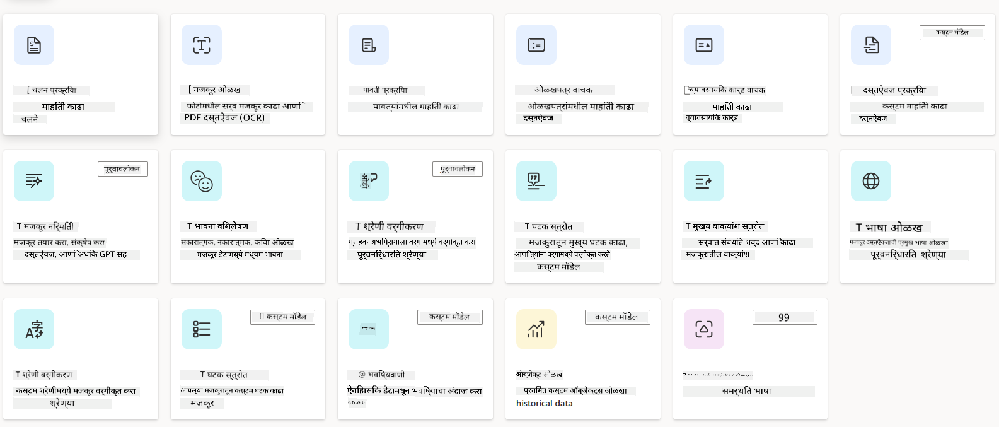
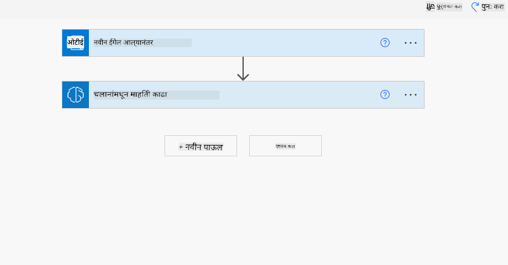
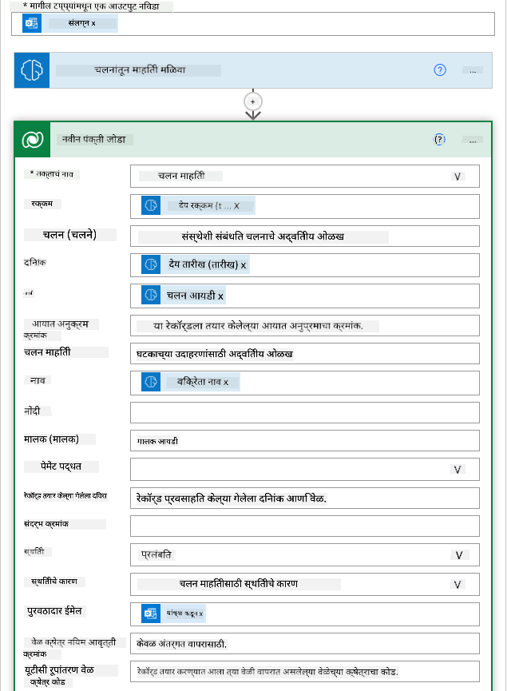
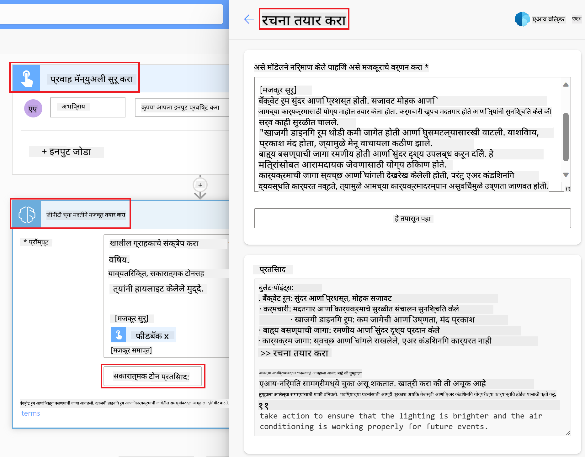

<!--
CO_OP_TRANSLATOR_METADATA:
{
  "original_hash": "f5ff3b6204a695a117d6f452403c95f7",
  "translation_date": "2025-05-19T20:03:46+00:00",
  "source_file": "10-building-low-code-ai-applications/README.md",
  "language_code": "mr"
}
-->
# कमी कोड AI अनुप्रयोग तयार करणे

## परिचय

आता आपण प्रतिमा निर्मिती अनुप्रयोग कसे तयार करावे हे शिकलो आहोत, चला कमी कोडबद्दल बोलूया. जनरेटिव AI विविध क्षेत्रांमध्ये वापरला जाऊ शकतो ज्यात कमी कोड देखील समाविष्ट आहे, परंतु कमी कोड म्हणजे काय आणि आपण त्यात AI कसा जोडू शकतो?

कमी कोड विकास प्लॅटफॉर्मच्या वापरामुळे पारंपरिक विकासक आणि गैर-विकासकांसाठी अनुप्रयोग आणि समाधान तयार करणे सोपे झाले आहे. कमी कोड विकास प्लॅटफॉर्म तुम्हाला कमी किंवा कोणत्याही कोडशिवाय अनुप्रयोग आणि समाधान तयार करण्यास सक्षम करतात. हे एक दृश्य विकास वातावरण प्रदान करून साध्य केले जाते जे तुम्हाला घटक ओढून सोडून अनुप्रयोग आणि समाधान तयार करण्यास सक्षम करते. हे तुम्हाला अनुप्रयोग आणि समाधान जलद आणि कमी संसाधनांसह तयार करण्यास सक्षम करते. या धड्यात, आपण कमी कोड कसा वापरायचा आणि पॉवर प्लॅटफॉर्म वापरून कमी कोड विकासाला AI सह कसा सुधारायचा याबद्दल सखोल चर्चा करू.

पॉवर प्लॅटफॉर्म संस्थांना त्यांच्या टीमना अंतर्ज्ञानी कमी-कोड किंवा नो-कोड वातावरणाद्वारे त्यांचे स्वतःचे समाधान तयार करण्यास सक्षम बनविण्याची संधी प्रदान करते. हे वातावरण समाधान तयार करण्याची प्रक्रिया सुलभ करण्यात मदत करते. पॉवर प्लॅटफॉर्मसह, समाधान काही महिन्यांऐवजी काही दिवस किंवा आठवड्यांत तयार केले जाऊ शकते. पॉवर प्लॅटफॉर्ममध्ये पाच प्रमुख उत्पादने आहेत: पॉवर अॅप्स, पॉवर ऑटोमेट, पॉवर BI, पॉवर पेजेस आणि कोपायलट स्टुडिओ.

या धड्यात समाविष्ट आहे:

- पॉवर प्लॅटफॉर्ममधील जनरेटिव AI चे परिचय
- कोपायलटचे परिचय आणि त्याचा कसा वापर करायचा
- पॉवर प्लॅटफॉर्ममध्ये जनरेटिव AI वापरून अॅप्स आणि फ्लो तयार करणे
- AI बिल्डरसह पॉवर प्लॅटफॉर्ममधील AI मॉडेल्स समजून घेणे

## शिकण्याची उद्दिष्टे

या धड्याच्या शेवटी, आपण सक्षम असाल:

- पॉवर प्लॅटफॉर्ममधील कोपायलट कसा कार्य करतो हे समजून घ्या.

- आमच्या शैक्षणिक स्टार्टअपसाठी एक विद्यार्थी असाइनमेंट ट्रॅकर अॅप तयार करा.

- इनव्हॉइसमधून माहिती काढण्यासाठी AI वापरणारा इनव्हॉइस प्रोसेसिंग फ्लो तयार करा.

- GPT AI मॉडेलसह टेक्स्ट तयार करताना सर्वोत्तम पद्धती लागू करा.

या धड्यात तुम्ही वापरणार असलेली साधने आणि तंत्रज्ञान:

- **पॉवर अॅप्स**, विद्यार्थी असाइनमेंट ट्रॅकर अॅपसाठी, जे डेटा ट्रॅक, व्यवस्थापित आणि संवाद साधण्यासाठी अॅप्स तयार करण्यासाठी कमी-कोड विकास वातावरण प्रदान करते.

- **डेटाव्हर्स**, विद्यार्थी असाइनमेंट ट्रॅकर अॅपसाठी डेटा साठवण्यासाठी जिथे डेटाव्हर्स अॅपचा डेटा साठवण्यासाठी कमी-कोड डेटा प्लॅटफॉर्म प्रदान करेल.

- **पॉवर ऑटोमेट**, इनव्हॉइस प्रोसेसिंग फ्लोसाठी जिथे तुम्हाला इनव्हॉइस प्रोसेसिंग प्रक्रिया स्वयंचलित करण्यासाठी वर्कफ्लो तयार करण्यासाठी कमी-कोड विकास वातावरण असेल.

- **AI बिल्डर**, इनव्हॉइस प्रोसेसिंग AI मॉडेलसाठी जिथे तुम्ही आमच्या स्टार्टअपसाठी इनव्हॉइस प्रक्रिया करण्यासाठी प्रीबिल्ट AI मॉडेल्स वापराल.

## पॉवर प्लॅटफॉर्ममधील जनरेटिव AI

जनरेटिव AI सह कमी-कोड विकास आणि अनुप्रयोग सुधारणा करणे हे पॉवर प्लॅटफॉर्मसाठी एक प्रमुख लक्ष केंद्रित क्षेत्र आहे. उद्दिष्ट म्हणजे कोणत्याही डेटा सायन्स तज्ञाची आवश्यकता न ठेवता AI-सक्षम अॅप्स, साइट्स, डॅशबोर्ड तयार करणे आणि AI सह प्रक्रिया स्वयंचलित करणे हे प्रत्येकाला सक्षम करणे. हे उद्दिष्ट कोपायलट आणि AI बिल्डरच्या स्वरूपात पॉवर प्लॅटफॉर्ममध्ये कमी-कोड विकास अनुभवात जनरेटिव AI एकत्रित करून साध्य केले जाते.

### हे कसे कार्य करते?

कोपायलट हा एक AI सहाय्यक आहे जो तुम्हाला नैसर्गिक भाषेचा वापर करून संवादात्मक पद्धतीने तुमच्या आवश्यकता वर्णन करून पॉवर प्लॅटफॉर्म सोल्यूशन्स तयार करण्यास सक्षम करतो. उदाहरणार्थ, तुम्ही तुमच्या AI सहाय्यकाला तुमच्या अॅपमध्ये कोणती फील्ड्स वापरणार आहेत हे सांगू शकता आणि तो अॅप आणि अंतर्निहित डेटा मॉडेल दोन्ही तयार करेल किंवा तुम्ही पॉवर ऑटोमेटमध्ये फ्लो सेटअप कसा करायचा हे निर्दिष्ट करू शकता.

तुमच्या अॅप स्क्रीनमध्ये वापरकर्त्यांना संवादात्मक संवादाद्वारे अंतर्दृष्टी शोधण्यास सक्षम करण्यासाठी तुम्ही कोपायलट संचालित कार्यक्षमता वैशिष्ट्य म्हणून वापरू शकता.

AI बिल्डर हे पॉवर प्लॅटफॉर्ममध्ये उपलब्ध असलेले कमी-कोड AI क्षमता आहे जे तुम्हाला प्रक्रिया स्वयंचलित करण्यात आणि परिणामांचा अंदाज लावण्यात मदत करण्यासाठी AI मॉडेल्स वापरण्यास सक्षम करते. AI बिल्डरसह तुम्ही तुमच्या डेटा Dataverse किंवा विविध क्लाउड डेटा स्त्रोतांशी जोडलेल्या अॅप्स आणि फ्लोमध्ये AI आणू शकता, जसे की SharePoint, OneDrive किंवा Azure.

कोपायलट पॉवर प्लॅटफॉर्मच्या सर्व उत्पादनांमध्ये उपलब्ध आहे: पॉवर अॅप्स, पॉवर ऑटोमेट, पॉवर BI, पॉवर पेजेस आणि पॉवर व्हर्च्युअल एजंट्स. AI बिल्डर पॉवर अॅप्स आणि पॉवर ऑटोमेटमध्ये उपलब्ध आहे. या धड्यात, आम्ही आमच्या शैक्षणिक स्टार्टअपसाठी सोल्यूशन तयार करण्यासाठी पॉवर अॅप्स आणि पॉवर ऑटोमेटमध्ये कोपायलट आणि AI बिल्डरचा कसा वापर करायचा यावर लक्ष केंद्रित करू.

### पॉवर अॅप्समधील कोपायलट

पॉवर प्लॅटफॉर्मचा एक भाग म्हणून, पॉवर अॅप्स डेटा ट्रॅक, व्यवस्थापित आणि संवाद साधण्यासाठी अॅप्स तयार करण्यासाठी कमी-कोड विकास वातावरण प्रदान करते. हे अॅप विकास सेवा संच आहे ज्यामध्ये स्केलेबल डेटा प्लॅटफॉर्म आणि क्लाउड सेवा आणि ऑन-प्रिमायसेस डेटा कनेक्ट करण्याची क्षमता आहे. पॉवर अॅप्स तुम्हाला ब्राउझर, टॅब्लेट आणि फोनवर चालणारे अॅप्स तयार करण्यास आणि सहकाऱ्यांसह शेअर करण्यास अनुमती देते. पॉवर अॅप्स एक साधी इंटरफेससह वापरकर्त्यांना अॅप विकासात सोपे करते, त्यामुळे प्रत्येक व्यवसाय वापरकर्ता किंवा प्रो विकासक सानुकूल अॅप्स तयार करू शकतो. कोपायलटद्वारे जनरेटिव AI सह अॅप विकास अनुभव देखील सुधारित केला जातो.

पॉवर अॅप्समधील कोपायलट AI सहाय्यक वैशिष्ट्य तुम्हाला कोणत्या प्रकारचा अॅप आवश्यक आहे आणि तुमचा अॅप कोणती माहिती ट्रॅक, गोळा किंवा दर्शवेल हे वर्णन करण्यास सक्षम करते. कोपायलट तुमच्या वर्णनावर आधारित एक प्रतिसादात्मक कॅनव्हास अॅप तयार करतो. त्यानंतर तुम्ही तुमच्या गरजा पूर्ण करण्यासाठी अॅप सानुकूलित करू शकता. AI कोपायलट तुमच्या गरजा पूर्ण करण्यासाठी डेटा साठवण्यासाठी आवश्यक असलेल्या फील्डसह एक Dataverse टेबल देखील तयार करते आणि सुचवते आणि काही नमुना डेटा प्रदान करते. या धड्यात नंतर Dataverse काय आहे आणि तुम्ही ते पॉवर अॅप्समध्ये कसे वापरू शकता हे पाहू. त्यानंतर तुम्ही संवादात्मक चरणांद्वारे AI कोपायलट सहाय्यक वैशिष्ट्य वापरून टेबल तुमच्या गरजा पूर्ण करण्यासाठी सानुकूलित करू शकता. हे वैशिष्ट्य पॉवर अॅप्सच्या होम स्क्रीनवरून सहज उपलब्ध आहे.

### पॉवर ऑटोमेटमधील कोपायलट

पॉवर प्लॅटफॉर्मचा एक भाग म्हणून, पॉवर ऑटोमेट वापरकर्त्यांना अनुप्रयोग आणि सेवांमधील स्वयंचलित वर्कफ्लो तयार करण्यास अनुमती देते. हे संप्रेषण, डेटा संकलन आणि निर्णय मंजुरी यासारख्या पुनरावृत्ती व्यावसायिक प्रक्रिया स्वयंचलित करण्यात मदत करते. त्याचे साधे इंटरफेस प्रत्येक तांत्रिक योग्यता असलेल्या वापरकर्त्यांना (नवशिक्यांपासून ते अनुभवी विकासकांपर्यंत) कामाच्या कार्यांना स्वयंचलित करण्यास अनुमती देते. कोपायलटद्वारे जनरेटिव AI सह वर्कफ्लो विकास अनुभव देखील सुधारित केला जातो.

पॉवर ऑटोमेटमधील कोपायलट AI सहाय्यक वैशिष्ट्य तुम्हाला कोणत्या प्रकारचा फ्लो आवश्यक आहे आणि तुमचा फ्लो कोणती कृती करेल हे वर्णन करण्यास सक्षम करते. कोपायलट तुमच्या वर्णनावर आधारित फ्लो तयार करतो. त्यानंतर तुम्ही तुमच्या गरजा पूर्ण करण्यासाठी फ्लो सानुकूलित करू शकता. AI कोपायलट देखील तुम्हाला स्वयंचलित करायच्या असलेल्या कार्याची आवश्यकता असलेल्या क्रियाकलाप सुचवतो. या धड्यात नंतर फ्लो काय आहे आणि तुम्ही ते पॉवर ऑटोमेटमध्ये कसे वापरू शकता हे पाहू. त्यानंतर तुम्ही संवादात्मक चरणांद्वारे AI कोपायलट सहाय्यक वैशिष्ट्य वापरून क्रियाकलाप तुमच्या गरजा पूर्ण करण्यासाठी सानुकूलित करू शकता. हे वैशिष्ट्य पॉवर ऑटोमेटच्या होम स्क्रीनवरून सहज उपलब्ध आहे.

## असाइनमेंट: आमच्या स्टार्टअपसाठी विद्यार्थी असाइनमेंट आणि इनव्हॉइस व्यवस्थापित करा, कोपायलटचा वापर करून

आमचे स्टार्टअप विद्यार्थ्यांना ऑनलाइन कोर्सेस प्रदान करते. स्टार्टअप वेगाने वाढले आहे आणि आता त्याच्या कोर्सेसच्या मागणीशी जुळवून घेण्यासाठी संघर्ष करत आहे. स्टार्टअपने तुम्हाला पॉवर प्लॅटफॉर्म विकसक म्हणून नियुक्त केले आहे जेणेकरून त्यांना त्यांच्या विद्यार्थी असाइनमेंट आणि इनव्हॉइस व्यवस्थापित करण्यात मदत करणारे कमी कोड समाधान तयार करण्यात मदत होईल. त्यांच्या समाधानाने त्यांना अॅपद्वारे विद्यार्थी असाइनमेंट ट्रॅक आणि व्यवस्थापित करण्यात आणि वर्कफ्लोद्वारे इनव्हॉइस प्रोसेसिंग प्रक्रिया स्वयंचलित करण्यात मदत करावी. तुम्हाला जनरेटिव AI वापरून समाधान विकसित करण्यास सांगितले गेले आहे.

कोपायलटचा वापर सुरू करताना, तुम्ही [पॉवर प्लॅटफॉर्म कोपायलट प्रॉम्प्ट लायब्ररी](https://github.com/pnp/powerplatform-prompts?WT.mc_id=academic-109639-somelezediko) वापरून प्रॉम्प्टसह सुरुवात करू शकता. या लायब्ररीमध्ये तुम्ही कोपायलटसह अॅप्स आणि फ्लो तयार करण्यासाठी वापरू शकता अशा प्रॉम्प्टची यादी आहे. तुम्ही कोपायलटला तुमच्या आवश्यकता कशा वर्णन करायच्या याची कल्पना मिळवण्यासाठी लायब्ररीतील प्रॉम्प्ट देखील वापरू शकता.

### आमच्या स्टार्टअपसाठी विद्यार्थी असाइनमेंट ट्रॅकर अॅप तयार करा

आमच्या स्टार्टअपमधील शिक्षकांना विद्यार्थी असाइनमेंटचा मागोवा घेण्यात अडचण येत आहे. त्यांनी असाइनमेंट ट्रॅक करण्यासाठी स्प्रेडशीटचा वापर केला आहे परंतु विद्यार्थ्यांची संख्या वाढल्यामुळे हे व्यवस्थापित करणे कठीण झाले आहे. त्यांनी तुम्हाला एक अॅप तयार करण्यास सांगितले आहे जे त्यांना विद्यार्थी असाइनमेंट ट्रॅक आणि व्यवस्थापित करण्यात मदत करेल. अॅपने त्यांना नवीन असाइनमेंट जोडण्याची, असाइनमेंट पाहण्याची, असाइनमेंट अपडेट करण्याची आणि असाइनमेंट हटवण्याची अनुमती द्यावी. अॅपने शिक्षक आणि विद्यार्थ्यांना ग्रेड केलेल्या आणि न केलेल्या असाइनमेंट पाहण्याची अनुमती देखील द्यावी.

तुम्ही पॉवर अॅप्समधील कोपायलटचा वापर करून खालील चरणांचे अनुसरण करून अॅप तयार कराल:

1. [पॉवर अॅप्स](https://make.powerapps.com?WT.mc_id=academic-105485-koreyst) होम स्क्रीनवर जा.

1. तुम्हाला कोणता अॅप तयार करायचा आहे हे वर्णन करण्यासाठी होम स्क्रीनवरील मजकूर क्षेत्र वापरा. उदाहरणार्थ, **_मी एक अॅप तयार करू इच्छितो जो विद्यार्थी असाइनमेंट ट्रॅक आणि व्यवस्थापित करेल_**. प्रॉम्प्ट AI कोपायलटला पाठवण्यासाठी **पाठवा** बटणावर क्लिक करा.

1. AI कोपायलट तुम्हाला डेटा साठवण्यासाठी आवश्यक असलेल्या फील्डसह एक Dataverse टेबल सुचवेल आणि काही नमुना डेटा प्रदान करेल. त्यानंतर तुम्ही संवादात्मक चरणांद्वारे AI कोपायलट सहाय्यक वैशिष्ट्य वापरून टेबल तुमच्या गरजा पूर्ण करण्यासाठी सानुकूलित करू शकता.

1. शिक्षक विद्यार्थ्यांना त्यांच्या असाइनमेंटच्या प्रगतीबद्दल अद्ययावत ठेवण्यासाठी त्यांच्या असाइनमेंट सबमिट केलेल्या विद्यार्थ्यांना ईमेल पाठवू इच्छितात. तुम्ही टेबलमध्ये विद्यार्थी ईमेल साठवण्यासाठी एक नवीन फील्ड जोडण्यासाठी कोपायलटचा वापर करू शकता. उदाहरणार्थ, तुम्ही टेबलमध्ये एक नवीन फील्ड जोडण्यासाठी खालील प्रॉम्प्ट वापरू शकता: **_मी विद्यार्थी ईमेल साठवण्यासाठी एक स्तंभ जोडू इच्छितो_**. प्रॉम्प्ट AI कोपायलटला पाठवण्यासाठी **पाठवा** बटणावर क्लिक करा.

1. AI कोपायलट एक नवीन फील्ड तयार करेल आणि तुम्ही तुमच्या गरजा पूर्ण करण्यासाठी फील्ड सानुकूलित करू शकता.

1. एकदा तुम्ही टेबल पूर्ण केल्यानंतर, अॅप तयार करण्यासाठी **अॅप तयार करा** बटणावर क्लिक करा.

1. AI कोपायलट तुमच्या वर्णनावर आधारित एक प्रतिसादात्मक कॅनव्हास अॅप तयार करेल. त्यानंतर तुम्ही तुमच्या गरजा पूर्ण करण्यासाठी अॅप सानुकूलित करू शकता.

1. शिक्षकांना विद्यार्थ्यांना ईमेल पाठवण्यासाठी, तुम्ही अॅपमध्ये एक नवीन स्क्रीन जोडण्यासाठी कोपायलटचा वापर करू शकता. उदाहरणार्थ, तुम्ही अॅपमध्ये एक नवीन स्क्रीन जोडण्यासाठी खालील प्रॉम्प्ट वापरू शकता: **_मी विद्यार्थ्यांना ईमेल पाठवण्यासाठी एक स्क्रीन जोडू इच्छितो_**. प्रॉम्प्ट AI कोपायलटला पाठवण्यासाठी **पाठवा** बटणावर क्लिक करा.

1. AI कोपायलट एक नवीन स्क्रीन तयार करेल आणि तुम्ही तुमच्या गरजा पूर्ण करण्यासाठी स्क्रीन सानुकूलित करू शकता.

1. एकदा तुम्ही अॅप पूर्ण केल्यानंतर, अॅप जतन करण्यासाठी **जतन करा** बटणावर क्लिक करा.

1. शिक्षकांसह अॅप शेअर करण्यासाठी, **शेअर करा** बटणावर क्लिक करा आणि नंतर पुन्हा **शेअर करा** बटणावर क्लिक करा. त्यानंतर तुम्ही त्यांचे ईमेल पत्ते प्रविष्ट करून शिक्षकांसह अॅप शेअर करू शकता.

> **तुमचे गृहपाठ**: तुम्ही नुकतेच तयार केलेले अॅप एक चांगली सुरुवात आहे परंतु ते सुधारित केले जाऊ शकते. ईमेल वैशिष्ट्यासह, शिक्षक केवळ विद्यार्थ्यांना त्यांचे ईमेल टाइप करूनच ईमेल पाठवू शकतात. तुम्ही शिक्षकांना त्यांच्या असाइनमेंट सबमिट केल्यावर विद्यार्थ्यांना आपोआप ईमेल पाठवण्यास सक्षम करण्यासाठी स्वयंचलन तयार करण्यासाठी कोपायलट वापरू शकता का? तुमचा इशारा म्हणजे योग्य प्रॉम्प्टसह तुम्ही पॉवर ऑटोमेटमध्ये कोपायलटचा वापर करून हे तयार करू शकता.

### आमच्या स्टार्टअपसाठी इनव्हॉइस माहिती टेबल तयार करा

आमच्या स्टार्टअपच्या वित्तीय टीमला इनव्हॉइस ट्रॅक करण्यास अडचण येत आहे. त्यांनी इनव्हॉइस ट्रॅक करण्यासाठी स्प्रेडशीटचा वापर केला आहे परंतु इनव्हॉइसची संख्या वाढल्यामुळे हे व्यवस्थापित करणे कठीण झाले आहे. त्यांनी तुम्हाला एक टेबल तयार करण्यास सांगितले आहे जे त्यांना प्राप्त झालेल्या इनव्हॉइसची माहिती साठवण्यात, ट्रॅक करण्यात आणि व्यवस्थापित करण्यात मदत करेल. टेबलचा वापर सर्व इनव्हॉइस माहिती काढण्यासाठी आणि टेबलमध्ये साठवण्यासाठी एक स्वयंचलन तयार करण्यासाठी केला पाहिजे. टेबलने वित्तीय टीमला ज्या इनव्हॉइसची पेमेंट झाली आहे आणि ज्या नाहीत त्या पाहण्याची अनुमती देखील द्यावी.

पॉवर प्लॅटफॉर्ममध्ये Dataverse नावाचा एक अंतर्निहित डेटा प्लॅटफॉर्म आहे जो तुम्हाला तुमच्या अॅप्स आणि सोल्यूशन्ससाठी डेटा साठवण्यास सक्षम करतो. Dataverse अॅपचा डेटा साठवण्यासाठी
एक मजकूर. - **भावना विश्लेषण**: हा मॉडेल मजकूरातील सकारात्मक, नकारात्मक, तटस्थ किंवा मिश्र भावना ओळखतो. - **बिझनेस कार्ड रीडर**: हा मॉडेल बिझनेस कार्ड्समधून माहिती काढतो. - **मजकूर ओळख**: हा मॉडेल प्रतिमांमधून मजकूर काढतो. - **वस्तू ओळख**: हा मॉडेल प्रतिमांमधून वस्तू ओळखतो आणि काढतो. - **दस्तऐवज प्रक्रिया**: हा मॉडेल फॉर्म्समधून माहिती काढतो. - **चलन प्रक्रिया**: हा मॉडेल चलनांमधून माहिती काढतो. कस्टम AI मॉडेल्ससह, तुम्ही तुमचे स्वतःचे मॉडेल AI बिल्डरमध्ये आणू शकता, ज्यामुळे ते कोणत्याही AI बिल्डर कस्टम मॉडेलप्रमाणे कार्य करू शकते, तुम्हाला तुमच्या स्वतःच्या डेटाचा वापर करून मॉडेल प्रशिक्षण देण्याची परवानगी देते. तुम्ही हे मॉडेल्स प्रक्रिया स्वयंचलित करण्यासाठी आणि Power Apps आणि Power Automate या दोन्हीमध्ये परिणामांची भविष्यवाणी करण्यासाठी वापरू शकता. तुमचे स्वतःचे मॉडेल वापरताना काही मर्यादा लागू होतात. या [मर्यादा](https://learn.microsoft.com/ai-builder/byo-model#limitations?WT.mc_id=academic-105485-koreyst) अधिक वाचा. 

## असाइनमेंट #2 - आमच्या स्टार्टअपसाठी एक चलन प्रक्रिया प्रवाह तयार करा

वित्तीय टीमला चलन प्रक्रिया करण्यात अडचण येत आहे. ते चलनांचा मागोवा घेण्यासाठी स्प्रेडशीटचा वापर करत आहेत परंतु चलनांची संख्या वाढल्यामुळे हे व्यवस्थापित करणे कठीण झाले आहे. त्यांनी तुम्हाला AI वापरून चलन प्रक्रिया करण्यासाठी एक वर्कफ्लो तयार करण्याची विनंती केली आहे. वर्कफ्लो त्यांना चलनांमधून माहिती काढून डेटाव्हर्स टेबलमध्ये साठवण्यास सक्षम करायला हवे. वर्कफ्लो त्यांना काढलेल्या माहितीच्या सह एक ईमेल वित्तीय टीमला पाठवण्यास देखील सक्षम करायला हवे. आता तुम्हाला AI बिल्डर काय आहे आणि ते का वापरावे हे माहित आहे, चला पाहूया की तुम्ही AI बिल्डरमधील चलन प्रक्रिया AI मॉडेलचा वापर करून वित्तीय टीमला चलन प्रक्रिया करण्यात मदत करण्यासाठी वर्कफ्लो कसा तयार करू शकता, ज्याबद्दल आपण आधीच चर्चा केली आहे. AI बिल्डरमधील चलन प्रक्रिया AI मॉडेलचा वापर करून वित्तीय टीमला चलन प्रक्रिया करण्यात मदत करणारा वर्कफ्लो तयार करण्यासाठी खालील चरणांचे पालन करा:

1. [Power Automate](https://make.powerautomate.com?WT.mc_id=academic-105485-koreyst) होम स्क्रीनवर जा.
2. तुम्ही तयार करू इच्छित असलेल्या वर्कफ्लोचे वर्णन करण्यासाठी होम स्क्रीनवरील मजकूर क्षेत्राचा वापर करा. उदाहरणार्थ, **_माझ्या मेलबॉक्समध्ये आलेल्या चलनाची प्रक्रिया करा_**. AI कोपायलटला प्रॉम्प्ट पाठवण्यासाठी **पाठवा** बटणावर क्लिक करा. 
3. AI कोपायलट तुम्हाला स्वयंचलित करण्यासाठी आवश्यक क्रिया सुचवेल. पुढील चरणांमध्ये जाण्यासाठी तुम्ही **पुढे** बटणावर क्लिक करू शकता.
4. पुढील चरणावर, Power Automate तुम्हाला प्रवाहासाठी आवश्यक कनेक्शन सेट अप करण्यास प्रवृत्त करेल. एकदा तुम्ही पूर्ण केले की, प्रवाह तयार करण्यासाठी **प्रवाह तयार करा** बटणावर क्लिक करा.
5. AI कोपायलट एक प्रवाह तयार करेल आणि तुम्ही त्यानंतर तुमच्या गरजेनुसार प्रवाह सानुकूलित करू शकता.
6. प्रवाहाचा ट्रिगर अपडेट करा आणि **फोल्डर** त्या फोल्डरवर सेट करा जिथे चलन साठवले जाईल. उदाहरणार्थ, तुम्ही फोल्डर **इनबॉक्स** वर सेट करू शकता. **प्रगत पर्याय दाखवा** वर क्लिक करा आणि **फक्त संलग्नकांसह** **होय** वर सेट करा. हे सुनिश्चित करेल की फोल्डरमध्ये संलग्नकासह ईमेल प्राप्त झाल्यावरच प्रवाह चालेल.
7. प्रवाहातून पुढील क्रिया काढा: **HTML ते मजकूर**, **रचना**, **रचना 2**, **रचना 3** आणि **रचना 4** कारण तुम्ही त्यांचा वापर करणार नाही.
8. तुम्ही त्याचा वापर करणार नसल्यामुळे प्रवाहातून **अट** क्रिया काढा. हे खालील स्क्रीनशॉटसारखे दिसायला हवे: 
9. **क्रिया जोडा** बटणावर क्लिक करा आणि **डेटाव्हर्स** शोधा. **नवीन पंक्ति जोडा** क्रिया निवडा.
10. **चलनांमधून माहिती काढा** क्रियेत, ईमेलमधील **संलग्नक सामग्री** कडे निर्देश करण्यासाठी **चलन फाइल** अपडेट करा. हे सुनिश्चित करेल की प्रवाह चलन संलग्नकातून माहिती काढतो.
11. तुम्ही आधी तयार केलेले **टेबल** निवडा. उदाहरणार्थ, तुम्ही **चलन माहिती** टेबल निवडू शकता. खालील फील्ड भरण्यासाठी मागील क्रियेतून डायनॅमिक सामग्री निवडा: - ID - रक्कम - तारीख - नाव - स्थिती - **स्थिती** **प्रलंबित** वर सेट करा. - पुरवठादार ईमेल - **जेव्हा नवीन ईमेल येते** ट्रिगरमधून **कडून** डायनॅमिक सामग्री वापरा. 
12. प्रवाह पूर्ण झाल्यावर, प्रवाह जतन करण्यासाठी **जतन करा** बटणावर क्लिक करा. तुम्ही नंतर ट्रिगरमध्ये निर्दिष्ट केलेल्या फोल्डरवर चलनासह ईमेल पाठवून प्रवाहाची चाचणी करू शकता.

> **तुमचे गृहपाठ**: तुम्ही तयार केलेला प्रवाह एक चांगली सुरुवात आहे, आता तुम्हाला विचार करावा लागेल की आमच्या वित्तीय टीमला पुरवठादाराला त्याच्या चलनाच्या वर्तमान स्थितीबद्दल अपडेट करण्यासाठी ईमेल पाठविण्याची परवानगी देणारी स्वयंचलन कसे तयार करावे. तुमचा इशारा: प्रवाहाला चलनाची स्थिती बदलल्यावर चालायला हवे.

## Power Automate मध्ये टेक्स्ट जनरेशन AI मॉडेल वापरा

AI बिल्डरमधील GPT AI मॉडेलसह टेक्स्ट तयार करणे तुम्हाला प्रॉम्प्टवर आधारित मजकूर तयार करण्यास सक्षम करते आणि हे Microsoft Azure OpenAI सेवा द्वारे समर्थित आहे. या क्षमतेसह, तुम्ही GPT (जनरेटिव्ह प्री-ट्रेंड ट्रान्सफॉर्मर) तंत्रज्ञान तुमच्या अ‍ॅप्स आणि प्रवाहांमध्ये समाविष्ट करू शकता, विविध स्वयंचलित प्रवाह आणि अंतर्दृष्टीपूर्ण अनुप्रयोग तयार करण्यासाठी.

GPT मॉडेल्स प्रचंड प्रमाणात डेटावर व्यापक प्रशिक्षण घेतात, त्यांना प्रॉम्प्ट दिल्यास मानवी भाषेसारखा मजकूर तयार करण्यास सक्षम बनवतात. वर्कफ्लो ऑटोमेशनसह एकत्रित झाल्यावर, GPT सारखे AI मॉडेल्स विविध कार्यांचे सुव्यवस्थापन आणि स्वयंचलन करण्यासाठी वापरले जाऊ शकतात.

उदाहरणार्थ, तुम्ही विविध उपयोग प्रकरणांसाठी स्वयंचलितपणे मजकूर तयार करण्यासाठी प्रवाह तयार करू शकता, जसे की: ईमेलचे मसुदे, उत्पादन वर्णन, आणि अधिक. तुम्ही मॉडेलचा वापर विविध अ‍ॅप्ससाठी मजकूर तयार करण्यासाठी देखील करू शकता, जसे की चॅटबॉट्स आणि ग्राहक सेवा अ‍ॅप्स जे ग्राहक सेवा एजंट्सला ग्राहकांच्या चौकशीला प्रभावीपणे आणि कार्यक्षमतेने उत्तर देण्यास सक्षम करतात.

Power Automate मध्ये या AI मॉडेलचा वापर कसा करायचा हे शिकण्यासाठी [AI बिल्डर आणि GPT सह बुद्धिमत्ता जोडा](https://learn.microsoft.com/training/modules/ai-builder-text-generation/?WT.mc_id=academic-109639-somelezediko) या मॉड्यूलमधून जा.

## उत्कृष्ट कार्य! तुमचे शिक्षण सुरू ठेवा

हा धडा पूर्ण केल्यानंतर, आमच्या [जनरेटिव्ह AI शिक्षण संग्रह](https://aka.ms/genai-collection?WT.mc_id=academic-105485-koreyst) वर जा, तुमचे जनरेटिव्ह AI ज्ञान वाढवण्यासाठी!

धडा 11 वर जा जिथे आपण [फंक्शन कॉलिंगसह जनरेटिव्ह AI एकत्रित कसे करावे](../11-integrating-with-function-calling/README.md?WT.mc_id=academic-105485-koreyst) पाहू!

**अस्वीकृती**:  
हा दस्तऐवज AI भाषांतर सेवा [Co-op Translator](https://github.com/Azure/co-op-translator) वापरून भाषांतरित करण्यात आला आहे. आम्ही अचूकतेसाठी प्रयत्न करत असलो तरी कृपया लक्षात ठेवा की स्वयंचलित भाषांतरे त्रुटी किंवा अचूकतेच्या अभावासह असू शकतात. मूळ भाषेतील दस्तऐवज अधिकृत स्रोत मानला पाहिजे. महत्त्वाच्या माहितीसाठी, व्यावसायिक मानवी भाषांतराची शिफारस केली जाते. या भाषांतराचा वापर करून उद्भवलेल्या कोणत्याही गैरसमजुती किंवा चुकीच्या अर्थासाठी आम्ही जबाबदार नाही.