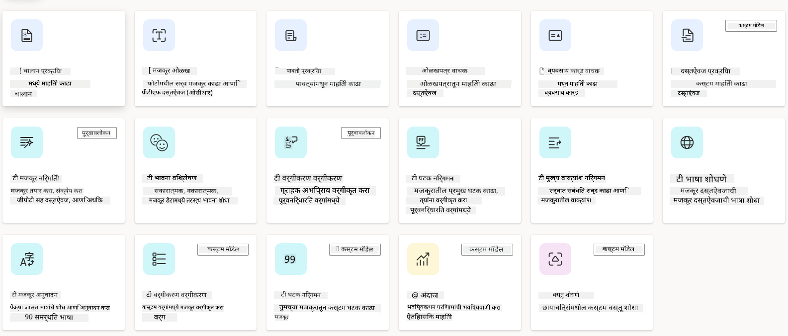
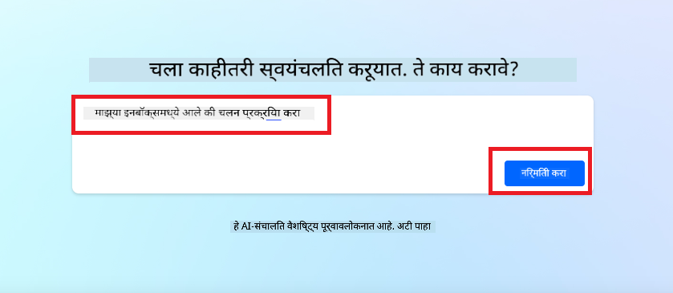
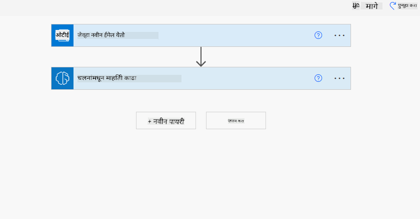
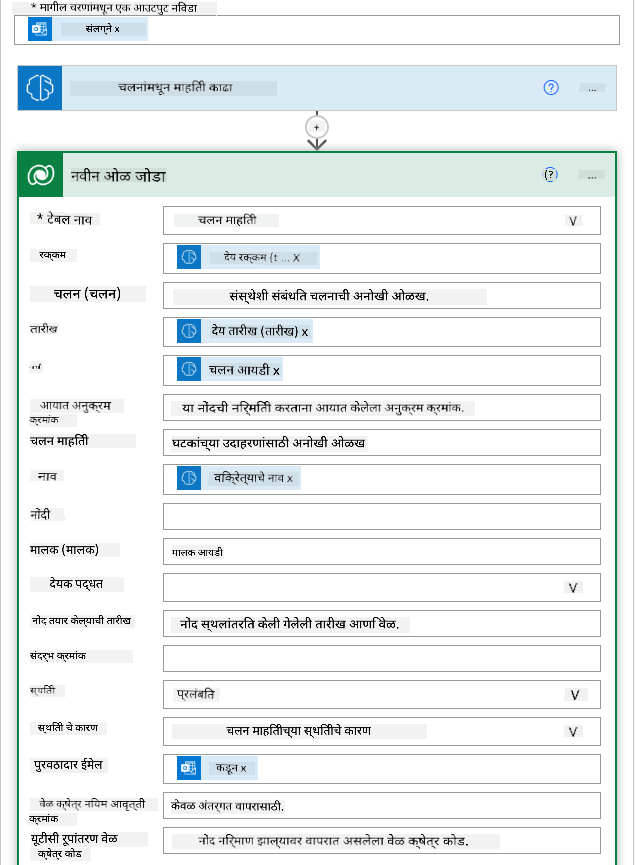
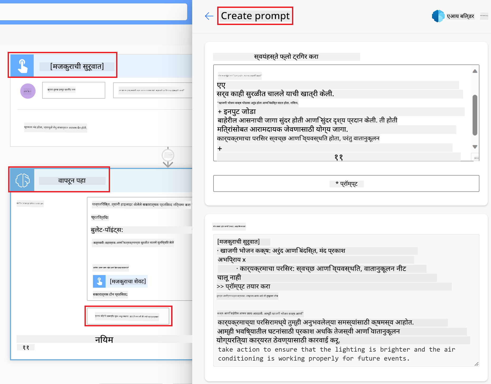

<!--
CO_OP_TRANSLATOR_METADATA:
{
  "original_hash": "f5ff3b6204a695a117d6f452403c95f7",
  "translation_date": "2025-06-25T18:24:06+00:00",
  "source_file": "10-building-low-code-ai-applications/README.md",
  "language_code": "mr"
}
-->
# लो कोड AI अनुप्रयोग तयार करणे

## परिचय

आता आपण प्रतिमा तयार करणारे अनुप्रयोग कसे तयार करायचे हे शिकले आहे, चला लो कोडबद्दल बोलूया. जनरेटिव AI विविध क्षेत्रांसाठी वापरले जाऊ शकते ज्यामध्ये लो कोड समाविष्ट आहे, परंतु लो कोड म्हणजे काय आणि आपण त्यामध्ये AI कसे जोडू शकतो?

लो कोड विकास प्लॅटफॉर्मचा वापर करून पारंपारिक विकसक आणि नॉन-विकसकांसाठी अनुप्रयोग आणि समाधान तयार करणे सोपे झाले आहे. लो कोड विकास प्लॅटफॉर्म तुम्हाला कमी कोड किंवा कोड न वापरता अनुप्रयोग आणि समाधान तयार करण्यास सक्षम करतात. हे एक दृश्य विकास वातावरण प्रदान करून साध्य केले जाते जे तुम्हाला घटक ड्रॅग आणि ड्रॉप करून अनुप्रयोग आणि समाधान तयार करण्यास सक्षम करते. हे तुम्हाला कमी संसाधनांसह आणि जलद अनुप्रयोग आणि समाधान तयार करण्यास सक्षम करते. या धड्यात, आम्ही लो कोडचा कसा वापर करायचा आणि AI वापरून लो कोड विकास कसा सुधारायचा यावर सखोल चर्चा करतो.

पॉवर प्लॅटफॉर्म संस्थांना त्यांच्या टीम्सना एक सहज लो-कोड किंवा नो-कोड वातावरणातून स्वतःचे समाधान तयार करण्यासाठी सक्षम करण्याची संधी प्रदान करते. हे वातावरण समाधान तयार करण्याची प्रक्रिया सोपी करण्यास मदत करते. पॉवर प्लॅटफॉर्मसह, समाधान महिन्यांऐवजी दिवस किंवा आठवड्यांत तयार केले जाऊ शकते. पॉवर प्लॅटफॉर्म पाच प्रमुख उत्पादने आहेत: पॉवर अ‍ॅप्स, पॉवर ऑटोमेट, पॉवर BI, पॉवर पेजेस आणि कोपायलट स्टुडिओ.

या धड्यात खालील विषयांचा समावेश आहे:

- पॉवर प्लॅटफॉर्ममधील जनरेटिव AI परिचय
- कोपायलट आणि त्याचा कसा वापर करायचा याचा परिचय
- पॉवर प्लॅटफॉर्ममध्ये जनरेटिव AI वापरून अनुप्रयोग आणि फ्लो तयार करणे
- AI बिल्डरसह पॉवर प्लॅटफॉर्ममधील AI मॉडेल्स समजून घेणे

## शिकण्याची उद्दिष्टे

या धड्याच्या शेवटी, तुम्हाला हे करता येईल:

- पॉवर प्लॅटफॉर्ममध्ये कोपायलट कसा कार्य करतो हे समजून घेणे.

- आमच्या शिक्षण स्टार्टअपसाठी स्टुडंट असाइनमेंट ट्रॅकर अ‍ॅप तयार करणे.

- AI वापरून इनव्हॉइसमधून माहिती काढण्यासाठी इनव्हॉइस प्रोसेसिंग फ्लो तयार करणे.

- GPT AI मॉडेलसह टेक्स्ट तयार करताना सर्वोत्तम पद्धती लागू करणे.

या धड्यात तुम्ही वापरणार असलेल्या साधने आणि तंत्रज्ञान:

- **पॉवर अ‍ॅप्स**, स्टुडंट असाइनमेंट ट्रॅकर अ‍ॅपसाठी, जे डेटा ट्रॅक, व्यवस्थापित आणि संवाद साधण्यासाठी अनुप्रयोग तयार करण्यासाठी लो-कोड विकास वातावरण प्रदान करते.

- **डेटाव्हर्स**, स्टुडंट असाइनमेंट ट्रॅकर अ‍ॅपसाठी डेटा साठवण्यासाठी जिथे डेटाव्हर्स अ‍ॅपचा डेटा साठवण्यासाठी लो-कोड डेटा प्लॅटफॉर्म प्रदान करेल.

- **पॉवर ऑटोमेट**, इनव्हॉइस प्रोसेसिंग फ्लोसाठी जिथे तुम्हाला इनव्हॉइस प्रोसेसिंग प्रक्रिया ऑटोमेट करण्यासाठी वर्कफ्लो तयार करण्यासाठी लो-कोड विकास वातावरण मिळेल.

- **AI बिल्डर**, इनव्हॉइस प्रोसेसिंग AI मॉडेलसाठी जिथे तुम्ही आमच्या स्टार्टअपसाठी इनव्हॉइस प्रोसेस करण्यासाठी प्रीबिल्ट AI मॉडेल्स वापराल.

## पॉवर प्लॅटफॉर्ममधील जनरेटिव AI

लो-कोड विकास आणि अनुप्रयोग जनरेटिव AI सह सुधारित करणे हे पॉवर प्लॅटफॉर्मसाठी एक प्रमुख लक्ष केंद्रित क्षेत्र आहे. AI-सक्षम अनुप्रयोग, साइट्स, डॅशबोर्ड तयार करणे आणि AI सह प्रक्रिया ऑटोमेट करणे हे प्रत्येकाला सक्षम करणे हे उद्दिष्ट आहे, _डेटा सायन्स कौशल्याची आवश्यकता नसताना_. हे उद्दिष्ट कोपायलट आणि AI बिल्डरच्या रूपात पॉवर प्लॅटफॉर्ममध्ये लो-कोड विकास अनुभवात जनरेटिव AI समाकलित करून साध्य केले जाते.

### हे कसे कार्य करते?

कोपायलट हा एक AI सहाय्यक आहे जो तुम्हाला नैसर्गिक भाषेत संवादात्मक चरणांची मालिका वर्णन करून पॉवर प्लॅटफॉर्म सोल्यूशन्स तयार करण्यास सक्षम करतो. उदाहरणार्थ, तुम्ही तुमच्या AI सहाय्यकाला तुमच्या अ‍ॅपमध्ये कोणती फील्ड्स असतील ते सांगण्याचे निर्देश देऊ शकता आणि ते अ‍ॅप आणि अंतर्गत डेटा मॉडेल दोन्ही तयार करेल किंवा तुम्ही पॉवर ऑटोमेटमध्ये फ्लो सेटअप कसे करायचे ते निर्दिष्ट करू शकता.

तुमच्या अ‍ॅप स्क्रीनमध्ये वापरकर्त्यांना संवादात्मक संवादांद्वारे अंतर्दृष्टी उघडण्यासाठी सक्षम करण्यासाठी फीचर म्हणून कोपायलट चालित कार्यक्षमता वापरू शकता.

AI बिल्डर हा पॉवर प्लॅटफॉर्ममध्ये उपलब्ध लो-कोड AI क्षमता आहे जो तुम्हाला प्रक्रिया ऑटोमेट करण्यास आणि परिणामांची भविष्यवाणी करण्यास मदत करण्यासाठी AI मॉडेल्स वापरण्यास सक्षम करतो. AI बिल्डरसह तुम्ही AI ला तुमच्या अ‍ॅप्स आणि फ्लोमध्ये आणू शकता जे तुमच्या डेटाव्हर्समधील डेटा किंवा विविध क्लाउड डेटा स्रोत, जसे की SharePoint, OneDrive किंवा Azure यांच्याशी कनेक्ट करतात.

कोपायलट पॉवर प्लॅटफॉर्मच्या सर्व उत्पादने: पॉवर अ‍ॅप्स, पॉवर ऑटोमेट, पॉवर BI, पॉवर पेजेस आणि पॉवर व्हर्च्युअल एजंट्समध्ये उपलब्ध आहे. AI बिल्डर पॉवर अ‍ॅप्स आणि पॉवर ऑटोमेटमध्ये उपलब्ध आहे. या धड्यात, आम्ही आमच्या शिक्षण स्टार्टअपसाठी समाधान तयार करण्यासाठी पॉवर अ‍ॅप्स आणि पॉवर ऑटोमेटमध्ये कोपायलट आणि AI बिल्डरचा कसा वापर करायचा यावर लक्ष केंद्रित करू.

### पॉवर अ‍ॅप्समधील कोपायलट

पॉवर प्लॅटफॉर्मचा एक भाग म्हणून, पॉवर अ‍ॅप्स डेटा ट्रॅक, व्यवस्थापित आणि संवाद साधण्यासाठी अनुप्रयोग तयार करण्यासाठी लो-कोड विकास वातावरण प्रदान करते. हे एक स्केलेबल डेटा प्लॅटफॉर्म आणि क्लाउड सेवा आणि ऑन-प्रिमाइसेस डेटाशी कनेक्ट होण्याची क्षमता असलेल्या अ‍ॅप विकास सेवांचा संच आहे. पॉवर अ‍ॅप्स तुम्हाला ब्राउझर, टॅबलेट आणि फोनवर चालणारे अ‍ॅप्स तयार करण्यास आणि सहकाऱ्यांसोबत शेअर करण्यास अनुमती देते. पॉवर अ‍ॅप्स एक साधा इंटरफेससह अनुप्रयोग विकासात वापरकर्त्यांना सहजतेने समाविष्ट करते, जेणेकरून प्रत्येक व्यवसाय वापरकर्ता किंवा प्रो विकसक कस्टम अ‍ॅप्स तयार करू शकेल. अ‍ॅप विकास अनुभव जनरेटिव AI द्वारे कोपायलटसह सुधारित केला जातो.

पॉवर अ‍ॅप्समधील कोपायलट AI सहाय्यक फीचर तुम्हाला तुमच्या अ‍ॅपला कोणत्या प्रकारची आवश्यकता आहे आणि तुमच्या अ‍ॅपला कोणती माहिती ट्रॅक, गोळा किंवा दर्शवायची आहे ते वर्णन करण्यास सक्षम करते. कोपायलट नंतर तुमच्या वर्णनावर आधारित प्रतिसादात्मक कॅनव्हास अ‍ॅप तयार करते. तुम्ही नंतर तुमच्या गरजेनुसार अ‍ॅप सानुकूलित करू शकता. AI कोपायलट तुमच्या आवश्यक डेटा ट्रॅक करण्यासाठी फील्डसह डेटाव्हर्स टेबल आणि काही नमुना डेटा सुचवतो. आम्ही या धड्यात नंतर डेटाव्हर्स काय आहे आणि तुम्ही पॉवर अ‍ॅप्समध्ये ते कसे वापरू शकता ते पाहू. तुम्ही नंतर संवादात्मक चरणांद्वारे AI कोपायलट सहाय्यक फीचर वापरून तुमच्या गरजेनुसार टेबल सानुकूलित करू शकता. हे फीचर पॉवर अ‍ॅप्स होम स्क्रीनवर सहज उपलब्ध आहे.

### पॉवर ऑटोमेटमधील कोपायलट

पॉवर प्लॅटफॉर्मचा एक भाग म्हणून, पॉवर ऑटोमेट वापरकर्त्यांना अनुप्रयोग आणि सेवांमधील स्वयंचलित वर्कफ्लो तयार करण्यास अनुमती देते. ते संप्रेषण, डेटा गोळा करणे आणि निर्णय मंजुरी यासारख्या पुनरावृत्ती होणाऱ्या व्यवसाय प्रक्रियेचे स्वयंचलन करण्यात मदत करते. त्याचा साधा इंटरफेस प्रत्येक तांत्रिक क्षमता असलेल्या वापरकर्त्यांना (सुरुवातीपासून अनुभवी विकसकांपर्यंत) कार्य कार्ये स्वयंचलित करण्यास अनुमती देतो. वर्कफ्लो विकास अनुभव जनरेटिव AI द्वारे कोपायलटसह सुधारित केला जातो.

पॉवर ऑटोमेटमधील कोपायलट AI सहाय्यक फीचर तुम्हाला कोणत्या प्रकारचा फ्लो आवश्यक आहे आणि तुमचा फ्लो कोणती क्रिया करायची आहे ते वर्णन करण्यास सक्षम करते. कोपायलट नंतर तुमच्या वर्णनावर आधारित फ्लो तयार करते. तुम्ही नंतर तुमच्या गरजेनुसार फ्लो सानुकूलित करू शकता. AI कोपायलट तुम्हाला स्वयंचलन करायचे कार्य करण्यासाठी आवश्यक क्रिया सुचवतो आणि तयार करतो. आम्ही या धड्यात नंतर फ्लो काय आहेत आणि तुम्ही पॉवर ऑटोमेटमध्ये त्यांचा कसा वापर करू शकता ते पाहू. तुम्ही नंतर संवादात्मक चरणांद्वारे AI कोपायलट सहाय्यक फीचर वापरून तुमच्या गरजेनुसार क्रिया सानुकूलित करू शकता. हे फीचर पॉवर ऑटोमेट होम स्क्रीनवर सहज उपलब्ध आहे.

## असाइनमेंट: आमच्या स्टार्टअपसाठी विद्यार्थी असाइनमेंट्स आणि इनव्हॉइसेस व्यवस्थापित करा, कोपायलट वापरून

आमचे स्टार्टअप विद्यार्थ्यांना ऑनलाइन कोर्सेस प्रदान करते. स्टार्टअपची वेगाने वाढ झाली आहे आणि आता त्यांच्या कोर्सेसच्या मागणीशी जुळवून घेण्यासाठी संघर्ष करीत आहे. स्टार्टअपने तुम्हाला पॉवर प्लॅटफॉर्म विकसक म्हणून नियुक्त केले आहे जेणेकरून तुम्ही त्यांना त्यांच्या विद्यार्थी असाइनमेंट्स आणि इनव्हॉइसेस व्यवस्थापित करण्यासाठी लो कोड समाधान तयार करण्यात मदत करू शकता. त्यांच्या समाधानाने त्यांना अ‍ॅपद्वारे विद्यार्थी असाइनमेंट्स ट्रॅक आणि व्यवस्थापित करण्यात आणि वर्कफ्लोद्वारे इनव्हॉइस प्रोसेसिंग प्रक्रिया स्वयंचलित करण्यात मदत करावी. तुम्हाला जनरेटिव AI वापरून समाधान विकसित करण्यास सांगितले आहे.

जेव्हा तुम्ही कोपायलट वापरण्यास सुरुवात करत असाल, तेव्हा तुम्ही प्रॉम्प्ट्ससह सुरुवात करण्यासाठी [पॉवर प्लॅटफॉर्म कोपायलट प्रॉम्प्ट लायब्ररी](https://github.com/pnp/powerplatform-prompts?WT.mc_id=academic-109639-somelezediko) वापरू शकता. या लायब्ररीमध्ये प्रॉम्प्ट्सची यादी आहे जी तुम्ही कोपायलटसह अ‍ॅप्स आणि फ्लो तयार करण्यासाठी वापरू शकता. तुम्ही कोपायलटसाठी तुमच्या आवश्यकता कशा वर्णन करायच्या याची कल्पना मिळवण्यासाठी लायब्ररीमधील प्रॉम्प्ट्स देखील वापरू शकता.

### आमच्या स्टार्टअपसाठी स्टुडंट असाइनमेंट ट्रॅकर अ‍ॅप तयार करा

आमच्या स्टार्टअपमधील शिक्षकांना विद्यार्थी असाइनमेंट्स ट्रॅक करण्यात अडचण येत आहे. त्यांनी असाइनमेंट्स ट्रॅक करण्यासाठी स्प्रेडशीट वापरला आहे परंतु विद्यार्थ्यांची संख्या वाढल्यामुळे ते व्यवस्थापित करणे कठीण झाले आहे. त्यांनी तुम्हाला एक अ‍ॅप तयार करण्यास सांगितले आहे जे त्यांना विद्यार्थी असाइनमेंट्स ट्रॅक आणि व्यवस्थापित करण्यात मदत करेल. अ‍ॅप त्यांना नवीन असाइनमेंट्स जोडणे, असाइनमेंट्स पाहणे, असाइनमेंट्स अपडेट करणे आणि असाइनमेंट्स हटवणे सक्षम करावे. अ‍ॅप शिक्षक आणि विद्यार्थ्यांना ग्रेडेड असाइनमेंट्स आणि नॉन-ग्रेडेड असाइनमेंट्स पाहण्यास सक्षम करावा.

तुम्ही पॉवर अ‍ॅप्समधील कोपायलट वापरून खालील चरणांचे अनुसरण करून अ‍ॅप तयार कराल:

1. [पॉवर अ‍ॅप्स](https://make.powerapps.com?WT.mc_id=academic-105485-koreyst) होम स्क्रीनवर जा.

1. तुम्ही तयार करू इच्छित असलेल्या अ‍ॅपचे वर्णन करण्यासाठी होम स्क्रीनवरील टेक्स्ट क्षेत्र वापरा. उदाहरणार्थ, **_मला विद्यार्थी असाइनमेंट्स ट्रॅक आणि व्यवस्थापित करण्यासाठी अ‍ॅप तयार करायचा आहे_**. AI कोपायलटला प्रॉम्प्ट पाठवण्यासाठी **Send** बटणावर क्लिक करा.

1. AI कोपायलट तुम्हाला आवश्यक डेटा ट्रॅक करण्यासाठी फील्डसह डेटाव्हर्स टेबल आणि काही नमुना डेटा सुचवेल. तुम्ही नंतर संवादात्मक चरणांद्वारे AI कोपायलट सहाय्यक फीचर वापरून तुमच्या गरजेनुसार टेबल सानुकूलित करू शकता.

   > **महत्वाचे**: डेटाव्हर्स हे पॉवर प्लॅटफॉर्मचे अंतर्गत डेटा प्लॅटफॉर्म आहे. अ‍ॅपचा डेटा साठवण्यासाठी हे एक लो-कोड डेटा प्लॅटफॉर्म आहे. हे एक पूर्णपणे व्यवस्थापित सेवा आहे जे मायक्रोसॉफ्ट क्लाउडमध्ये डेटा सुरक्षितपणे साठवते आणि तुमच्या पॉवर प्लॅटफॉर्म वातावरणात प्रोव्हिजन केले जाते. यात डेटा वर्गीकरण, डेटा वंशावळ, सूक्ष्म प्रवेश नियंत्रण आणि अधिक अशा अंगभूत डेटा गव्हर्नन्स क्षमता आहेत. तुम्ही डेटाव्हर्सबद्दल अधिक माहिती [इथे](https://docs.microsoft.com/powerapps/maker/data-platform/data-platform-intro?WT.mc_id=academic-109639-somelezediko) मिळवू शकता.

1. शिक्षक विद्यार्थ्यांना त्यांच्या असाइनमेंट्सच्या प्रगतीबद्दल अद्यतनित ठेवण्यासाठी असाइनमेंट्स सबमिट केलेल्या विद्यार्थ्यांना ईमेल पाठवू इच्छितात. तुम्ही टेबलमध्ये विद्यार्थ्यांचा ईमेल साठवण्यासाठी नवीन फील्ड जोडण्यासाठी कोपायलट वापरू शकता. उदाहरणार्थ, तुम्ही टेबलमध्ये नवीन फील्ड जोडण्यासाठी खालील प्रॉम्प्ट वापरू शकता: **_मला विद्यार्थी ईमेल साठवण्यासाठी एक कॉलम जोडायचा आहे_**. AI कोपायलटला प्रॉम्प्ट पाठवण्यासाठी **Send** बटणावर क्लिक करा.

1. AI कोपायलट नवीन फील्ड तयार करेल आणि तुम्ही नंतर तुमच्या गरजेनुसार फील्ड सानुकूलित करू शकता.

1. तुम्ही टेबल पूर्ण केल्यानंतर, अ‍ॅप तयार करण्यासाठी **Create app** बटणावर क्लिक करा.

1. AI कोपायलट तुमच्या वर्णनावर आधारित प्रतिसादात्मक कॅनव्हास अ‍ॅप तयार करेल. तुम्ही नंतर तुमच्या गरजेनुसार अ‍ॅप सानुकूलित करू शकता.

1. शिक्षकांना विद्यार्थ्यांना ईमेल पाठवण्यासाठी, तुम्ही अ‍ॅपमध्ये नवीन स्क्रीन जोडण्यासाठी कोपायलट वापरू शकता. उदाहरणार्थ, तुम्ही अ‍ॅपमध्ये नवीन स्क्रीन जोडण्यासाठी खालील प्रॉम्प्ट वापरू शकता: **_मला विद्यार्थ्यांना ईमेल पाठवण्यासाठी एक स्क्रीन जोडायची आहे_**. AI कोपायलटला प्रॉम्प्ट पाठवण्यासाठी **Send** बटणावर क्लिक करा.

1. AI कोपायलट नवीन स्क्रीन तयार करेल आणि तुम्ही नंतर तुमच्या गरजेनुसार स्क्रीन सानुकूलित करू शकता.

1. तुम्ही अ‍ॅप पूर्ण केल्यानंतर, अ‍ॅप जतन करण्यासाठी **Save** बटणावर क्लिक करा.

1. शिक्षकांसोबत अ‍ॅप शेअर करण्यासाठी, **Share** बटणावर क्लिक करा आणि नंतर पुन्हा **Share** बटणावर क्लिक करा. तुम्ही नंतर त्यांच्या ईमेल पत्ते प्रविष्ट करून शिक्षकांसोबत अ‍ॅप शेअर करू शकता.

> **तुमचे गृहकार्य**: तुम्ही तयार केलेले अ‍ॅप एक चांगली सुरुवात आहे परंतु ते सुधारले जाऊ शकते. ईमेल फीचरद्वारे, शिक्षक केवळ विद्यार्थ्यांना त्यांच्या ईमेल टाइप करून ईमेल पाठवू शकतात. तुम्ही शिक्षकांना त्यांच्या असाइनमेंट्स सबमिट करताना विद्यार्थ्यांना स्वयंचलितपणे ईमेल पाठविण्यास सक्षम करण्यासाठी स्वयंचलन तयार करण्यासाठी कोपायलट वापरू शकता का? तुमचा संकेत योग्य प्रॉम्प्टसह तुम्ही पॉवर ऑटोमेटमध्ये कोपायलट वापरून हे तयार करू शकता.

### आमच्या स्टार्टअपसाठी इनव्हॉइस माहिती टेबल तयार करा

आमच्या स्टार्टअपच्या वित्तीय टीमला इनव्हॉइस ट्रॅक करण्यात अडचण येत आहे. त्यांनी इनव्हॉइस ट्रॅक करण्यासाठी स्प्रेडशीट वापरला आहे परंतु इनव्हॉइसची संख्या वाढल्यामुळे ते व्यवस्थापित करणे
एक मजकूर. - **भावना विश्लेषण**: हा मॉडेल मजकूरातील सकारात्मक, नकारात्मक, तटस्थ, किंवा मिश्र भावना ओळखतो. - **व्यवसाय कार्ड वाचक**: हा मॉडेल व्यवसाय कार्डमधून माहिती काढतो. - **मजकूर ओळख**: हा मॉडेल प्रतिमांमधून मजकूर काढतो. - **वस्तू ओळख**: हा मॉडेल प्रतिमांमधून वस्तू ओळखतो आणि काढतो. - **दस्तऐवज प्रक्रिया**: हा मॉडेल फॉर्ममधून माहिती काढतो. - **चलन प्रक्रिया**: हा मॉडेल चलनांमधून माहिती काढतो. कस्टम AI मॉडेल्ससह आपण आपला स्वतःचा मॉडेल AI बिल्डरमध्ये आणू शकता ज्यामुळे तो कोणत्याही AI बिल्डर कस्टम मॉडेलप्रमाणे कार्य करू शकेल, ज्यामुळे आपण आपल्या स्वतःच्या डेटाचा वापर करून मॉडेल प्रशिक्षित करू शकता. आपण हे मॉडेल्स प्रक्रियांचे स्वयंचलितीकरण करण्यासाठी आणि Power Apps आणि Power Automate दोन्हीमध्ये परिणामांची भविष्यवाणी करण्यासाठी वापरू शकता. स्वतःच्या मॉडेलचा वापर करताना काही मर्यादा लागू होतात. या [मर्यादा](https://learn.microsoft.com/ai-builder/byo-model#limitations?WT.mc_id=academic-105485-koreyst) अधिक वाचा. 

## असाइनमेंट #2 - आमच्या स्टार्टअपसाठी एक चलन प्रक्रिया प्रवाह तयार करा

वित्तीय टीमला चलन प्रक्रिया करण्यात अडचण येत आहे. ते चलनांचा मागोवा घेण्यासाठी स्प्रेडशीटचा वापर करत आहेत, परंतु चलनांची संख्या वाढल्यामुळे हे व्यवस्थापित करणे कठीण झाले आहे. त्यांनी तुम्हाला AI वापरून चलन प्रक्रिया करण्यासाठी एक वर्कफ्लो तयार करण्यास सांगितले आहे. वर्कफ्लो त्यांना चलनांमधून माहिती काढण्यास आणि ती माहिती Dataverse टेबलमध्ये साठवण्यास सक्षम करावा. वर्कफ्लो त्यांना काढलेल्या माहितीने वित्तीय टीमला ईमेल पाठवण्यासही सक्षम करावा. आता तुम्हाला AI बिल्डर काय आहे आणि तुम्ही त्याचा वापर का करावा हे माहिती आहे, चला पाहूया की AI बिल्डरमधील चलन प्रक्रिया AI मॉडेलचा वापर करून वर्कफ्लो कसा तयार करता येईल जो वित्तीय टीमला चलन प्रक्रिया करण्यात मदत करेल. AI बिल्डरमधील चलन प्रक्रिया AI मॉडेल वापरून वित्तीय टीमला चलन प्रक्रिया करण्यात मदत करणारा वर्कफ्लो तयार करण्यासाठी खालील पायऱ्या अनुसरा:

1. [Power Automate](https://make.powerautomate.com?WT.mc_id=academic-105485-koreyst) मुख्य स्क्रीनवर जा.
2. तुम्हाला कोणता वर्कफ्लो तयार करायचा आहे ते मुख्य स्क्रीनवरील मजकूर क्षेत्रात वर्णन करा. उदाहरणार्थ, **_माझ्या मेलबॉक्समध्ये आलेले चलन प्रक्रिया करा_**. AI कॉपायलटला प्रॉम्प्ट पाठवण्यासाठी **पाठवा** बटणावर क्लिक करा. 
3. AI कॉपायलट तुम्हाला स्वयंचलित करण्यासाठी आवश्यक असलेल्या क्रिया सुचवेल. पुढील चरणांमध्ये जाण्यासाठी तुम्ही **पुढे** बटणावर क्लिक करू शकता.
4. पुढील चरणात, पॉवर ऑटोमेट तुम्हाला प्रवाहासाठी आवश्यक असलेल्या कनेक्शन्सची सेटअप करण्यास प्रवृत्त करेल. एकदा तुम्ही पूर्ण केल्यावर, प्रवाह तयार करण्यासाठी **फ्लो तयार करा** बटणावर क्लिक करा.
5. AI कॉपायलट प्रवाह तयार करेल आणि तुम्ही त्यानंतर प्रवाह तुमच्या गरजेनुसार सानुकूलित करू शकता.
6. प्रवाहाचा ट्रिगर अपडेट करा आणि **फोल्डर** त्याठिकाणी सेट करा जिथे चलन साठवले जाईल. उदाहरणार्थ, तुम्ही फोल्डर **इनबॉक्स** सेट करू शकता. **प्रगत पर्याय दाखवा** वर क्लिक करा आणि **फक्त संलग्नकांसह** **होय** वर सेट करा. हे सुनिश्चित करेल की जेव्हा फोल्डरमध्ये संलग्नकासह ईमेल प्राप्त होईल तेव्हा प्रवाह चालेल.
7. प्रवाहातून पुढील क्रिया काढा: **HTML ते मजकूर**, **Compose**, **Compose 2**, **Compose 3** आणि **Compose 4** कारण तुम्ही त्यांचा वापर करणार नाही.
8. प्रवाहातून **स्थिती** क्रिया काढा कारण तुम्ही त्याचा वापर करणार नाही. हे पुढील स्क्रीनशॉटसारखे दिसायला हवे: 
9. **क्रिया जोडा** बटणावर क्लिक करा आणि **Dataverse** शोधा. **नवीन ओळ जोडा** क्रिया निवडा.
10. **चलनांमधून माहिती काढा** क्रियेत, **चलन फाइल** ईमेलमधील **संलग्नक सामग्री** दर्शवण्यासाठी अपडेट करा. हे सुनिश्चित करेल की प्रवाह चलन संलग्नकातून माहिती काढतो.
11. तुम्ही आधी तयार केलेले **टेबल** निवडा. उदाहरणार्थ, तुम्ही **चलन माहिती** टेबल निवडू शकता. मागील क्रियेतून गतिशील सामग्री निवडा आणि पुढील फील्ड भरा: - आयडी - रक्कम - तारीख - नाव - स्थिती - **स्थिती** **प्रलंबित** वर सेट करा. - पुरवठादार ईमेल - **जेव्हा नवीन ईमेल येतो** ट्रिगरमधून **पासून** गतिशील सामग्री वापरा. 
12. एकदा तुम्ही प्रवाह पूर्ण केल्यावर, प्रवाह जतन करण्यासाठी **जतन करा** बटणावर क्लिक करा. तुम्ही नंतर प्रवाह तपासण्यासाठी ट्रिगरमध्ये निर्दिष्ट केलेल्या फोल्डरमध्ये चलनासह ईमेल पाठवून प्रवाह तपासू शकता.

> **तुमचे गृहपाठ**: तुम्ही तयार केलेला प्रवाह एक चांगली सुरुवात आहे, आता तुम्हाला आमच्या वित्तीय टीमला त्यांच्या चलनाच्या वर्तमान स्थितीबद्दल पुरवठादाराला ईमेल पाठवण्यासाठी स्वयंचलितीकरण कसे तयार करता येईल याचा विचार करणे आवश्यक आहे. तुमचा संकेत: प्रवाहाला चलनाची स्थिती बदलल्यावर चालायला हवे.

## पॉवर ऑटोमेटमध्ये मजकूर निर्मिती AI मॉडेल वापरा

AI बिल्डरमधील GPT AI मॉडेलसह मजकूर तयार करा जे प्रॉम्प्टवर आधारित मजकूर तयार करण्यास सक्षम करते आणि मायक्रोसॉफ्ट Azure OpenAI सर्व्हिसद्वारे समर्थित आहे. या क्षमतेसह, तुम्ही GPT (Generative Pre-Trained Transformer) तंत्रज्ञानाला तुमच्या अॅप्स आणि प्रवाहांमध्ये समाविष्ट करू शकता ज्यामुळे विविध स्वयंचलित प्रवाह आणि अंतर्दृष्टीपूर्ण अनुप्रयोग तयार करता येतील.

GPT मॉडेल्स मोठ्या प्रमाणात डेटावर विस्तृत प्रशिक्षण घेतात, ज्यामुळे त्यांना प्रॉम्प्ट दिल्यावर मानवी भाषेशी जवळीक साधणारा मजकूर तयार करता येतो. वर्कफ्लो स्वयंचलनासह एकत्रित केल्यावर, GPT सारखे AI मॉडेल्स विविध कार्ये सुव्यवस्थित आणि स्वयंचलित करण्यासाठी वापरले जाऊ शकतात.

उदाहरणार्थ, तुम्ही विविध वापर प्रकरणांसाठी स्वयंचलितपणे मजकूर तयार करण्यासाठी प्रवाह तयार करू शकता, जसे की: ईमेलचे मसुदे, उत्पादन वर्णने, आणि अधिक. तुम्ही मॉडेलचा वापर विविध अॅप्ससाठी मजकूर तयार करण्यासाठी देखील करू शकता, जसे की चॅटबॉट्स आणि ग्राहक सेवा अॅप्स जे ग्राहक सेवा एजंट्सना ग्राहकांच्या चौकशीला प्रभावीपणे आणि कार्यक्षमतेने प्रतिसाद देण्यास सक्षम करतात.

या AI मॉडेलचा पॉवर ऑटोमेटमध्ये वापर कसा करायचा ते शिकण्यासाठी [AI बिल्डर आणि GPT सह बुद्धिमत्ता जोडा](https://learn.microsoft.com/training/modules/ai-builder-text-generation/?WT.mc_id=academic-109639-somelezediko) मॉड्यूल पाहा.

## उत्तम काम! तुमचे शिक्षण सुरू ठेवा

हा धडा पूर्ण केल्यानंतर, आमच्या [Generative AI Learning संग्रह](https://aka.ms/genai-collection?WT.mc_id=academic-105485-koreyst) मध्ये जाऊन तुमचे Generative AI ज्ञान वाढवत राहा!

धडा 11 मध्ये जा जिथे आपण [Function Calling सह Generative AI एकत्रित करणे](../11-integrating-with-function-calling/README.md?WT.mc_id=academic-105485-koreyst) पाहू!

**अस्वीकरण**:  
हा दस्तऐवज AI भाषांतर सेवा [Co-op Translator](https://github.com/Azure/co-op-translator) वापरून भाषांतरित केला आहे. आम्ही अचूकतेसाठी प्रयत्नशील असलो तरी कृपया लक्षात ठेवा की स्वयंचलित भाषांतरांमध्ये त्रुटी किंवा अपूर्णता असू शकतात. मूळ भाषेतील दस्तऐवज हा प्राधिकृत स्रोत मानला पाहिजे. महत्त्वाच्या माहितीसाठी, व्यावसायिक मानव भाषांतराची शिफारस केली जाते. या भाषांतराचा वापर करून निर्माण झालेल्या कोणत्याही गैरसमज किंवा चुकीच्या अर्थासाठी आम्ही जबाबदार नाही.