# लो कोड AI अनुप्रयोग तयार करणे

[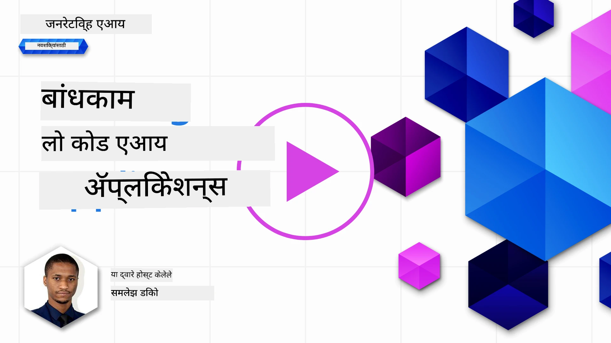](https://youtu.be/1vzq3Nd8GBA?si=h6LHWJXdmqf6mhDg)

> _(या धड्याचा व्हिडिओ पाहण्यासाठी वरिल प्रतिमा क्लिक करा)_

## परिचय

आता आपण प्रतिमा तयार करणारे अनुप्रयोग कसे तयार करायचे ते शिकलो आहोत, चला लो कोड बाबत बोलूया. जनरेटिव्ह AI विविध क्षेत्रांसाठी वापरला जाऊ शकतो, ज्यामध्ये लो कोड देखील समाविष्ट आहे, पण लो कोड म्हणजे काय आणि त्यात AI कसे जोडू?

लो कोड विकास प्लॅटफॉर्म्सचा वापर करून पारंपरिक विकासकांना आणि नॉन-डेव्हलपर्सना अनुप्रयोग आणि उपाय तयार करणे सोपे झाले आहे. लो कोड विकास प्लॅटफॉर्म्स आपल्याला फारसा किंवा कोणताही कोड न वापरता अनुप्रयोग आणि उपाय तयार करण्याची परवानगी देतात. हे एक दृश्यात्मक विकास पर्यावरण प्रदान करून साध्य केले जाते जेथे आपण घटक पकडून सोडून अनुप्रयोग आणि उपाय तयार करू शकता. यामुळे अनुप्रयोग आणि उपाय जलद आणि कमी संसाधनांत तयार करता येतात. या धड्यात, आपण लो कोड कसे वापरावे आणि पॉवर प्लॅटफॉर्म वापरून AI सह लो कोड विकास कसे सुधारणे यावर सखोल चर्चा करू.

पॉवर प्लॅटफॉर्म संस्था त्यांच्या संघांना सहज आणि समजण्यास सोप्या लो-कोड किंवा नो-कोड पर्यावरणाद्वारे त्यांच्या स्वत: च्या उपायांची निर्मिती करण्याची संधी प्रदान करतो. हे पर्यावरण उपाय तयार करण्याच्या प्रक्रियेस सोपे करते. पॉवर प्लॅटफॉर्म वापरून उपाय काही दिवसांत किंवा आठवड्यांत तयार करता येतात महिन्यांनी किंवा वर्षांनी नव्हेदेखील. पॉवर प्लॅटफॉर्ममध्ये पाच मुख्य उत्पादने आहेत: पॉवर अॅप्स, पॉवर ऑटोमेट, पॉवर BI, पॉवर पेजेस आणि कॉपिलट स्टुडिओ.

हा धडा खालील गोष्टींचा समावेश करतो:

- पॉवर प्लॅटफॉर्ममधील जनरेटिव्ह AI चे परिचय
- कॉपिलट चे परिचय आणि त्याचा वापर कसा करावा
- पॉवर प्लॅटफॉर्ममध्ये अनुप्रयोग आणि फ्लो तयार करण्यासाठी जनरेटिव्ह AI चा वापर
- AI बिल्डरद्वारे पॉवर प्लॅटफॉर्ममधील AI मॉडेल्स समजून घेणे
- मायक्रोसॉफ्ट कॉपिलट स्टुडिओसह बुद्धिमान एजंट तयार करणे

## शिकण्याचे उद्दिष्ट

या धड्याच्या शेवटी, आपण हे करू शकाल:

- पॉवर प्लॅटफॉर्ममध्ये कॉपिलट कसा कार्य करतो हे समजून घ्या.

- आपल्या शिक्षण स्टार्टअपसाठी स्टुडेंट असाइनमेंट ट्रॅकर अॅप तयार करा.

- एक इनव्हॉईस प्रोसेसिंग फ्लो तयार करा जे AI वापरून इनव्हॉईसेसमधून माहिती काढेल.

- Create Text with GPT AI मॉडेल वापरताना सर्वोत्तम प्रथांचा वापर करा.

- मायक्रोसॉफ्ट कॉपिलट स्टुडिओ म्हणजे काय आणि त्याचा वापर करून बुद्धिमान एजंट कसे तयार करायचे ते समजून घ्या.

या धड्यात आपण जे टूल्स आणि तंत्रज्ञान वापरू:

- **पॉवर अॅप्स**, स्टुडेंट असाइनमेंट ट्रॅकर अॅपसाठी, जे डेटा ट्रॅक, व्यवस्थापन आणि संवादासाठी लो-कोड विकास पर्यावरण प्रदान करते.

- **डेटाव्हर्स**, स्टुडेंट असाइनमेंट ट्रॅकर अॅपसाठी डेटा संचयन करण्यासाठी, जे अनुप्रयोगाचा डेटा संचय करण्यासाठी लो-कोड डेटा प्लॅटफॉर्म प्रदान करतो.

- **पॉवर ऑटोमेट**, इनव्हॉईस प्रोसेसिंग फ्लोसाठी जे कार्यप्रवाह तयार करायला लो-कोड विकास पर्यावरण देते.

- **AI बिल्डर**, इनव्हॉईस प्रोसेसिंग AI मॉडेलसाठी, जे आपल्याला पूर्वनिर्मित AI मॉडेल्स वापरून आपल्या स्टार्टअपने इनव्हॉईसेस प्रक्रिया करायला मदत करतो.

## पॉवर प्लॅटफॉर्ममधील जनरेटिव्ह AI

जनरेटिव्ह AI सह लो-कोड विकास आणि अनुप्रयोग सशक्त करणे हे पॉवर प्लॅटफॉर्मसाठी महत्त्वाचा क्षेत्र आहे. उद्दिष्ट आहे की प्रत्येकजण AI-सक्षम अॅप्स, साइटस्, डॅशबोर्ड आणि प्रक्रियांचे ऑटोमेशन AI वापरून करू शकतील, _कोणत्याही डेटा साइन्स तज्ञत्वाशिवाय_. हे उद्दिष्ट कॉपिलट आणि AI बिल्डर यांना पॉवर प्लॅटफॉर्ममधील लो-कोड विकास अनुभवात एकत्र करून साध्य केले जाते.

### हे कसे काम करते?

कॉपिलट हा एक AI सहाय्यक आहे जो नैसर्गिक भाषेत संभाषणांच्या मालिकेत आपले गरजांचे वर्णन करून पॉवर प्लॅटफॉर्मचे उपाय तयार करू शकतो. उदाहरणार्थ, आपण आपल्या AI सहाय्यकाला सांगू शकता की आपल्या अॅपमध्ये कोणते फील्ड्स हवेत आणि तो अॅपसोबत त्याचा मूलभूत डेटामॉडेल तयार करेल किंवा आपण पॉवर ऑटोमेटमध्ये फ्लो कसा सेट करायचा हे निर्दिष्ट करू शकता.

आपण आपल्या अॅप स्क्रीनमध्ये वापरकर्त्यांना संभाषणाच्या संवादांद्वारे अंतर्दृष्टी शोधायला सक्षम करण्यासाठी कॉपिलट संचालित कार्यक्षमता वापरू शकता.

AI बिल्डर हा पॉवर प्लॅटफॉर्ममध्ये उपलब्ध असलेला एक लो-कोड AI क्षमता आहे जो आपल्याला AI मॉडेल्स वापरून प्रक्रियांचे स्वयंचलन आणि परिणामांचे भाकीत करण्यात मदत करतो. AI बिल्डर वापरून आपण आपल्या अॅप्स आणि फ्लोमध्ये AI आणू शकता जे डेटाव्हर्स किंवा अन्य क्लाउड डेटा स्रोतांसह जसे की शेअरपॉइंट, वनड्राईव्ह किंवा अॅझूर यांच्याशी जोडलेले असतात.

कॉपिलट पॉवर प्लॅटफॉर्ममधील सर्व उत्पादनांमध्ये उपलब्ध आहे: पॉवर अॅप्स, पॉवर ऑटोमेट, पॉवर BI, पॉवर पेजेस आणि कॉपिलट स्टुडिओ (पूर्वी पॉवर वर्चुअल एजंट्स). AI बिल्डर पॉवर अॅप्स आणि पॉवर ऑटोमेटमध्ये उपलब्ध आहे. या धड्यात आपण कॉपिलट आणि AI बिल्डर कसे वापरायचे आणि शिक्षण स्टार्टअपने साठी उपाय कसा तयार करायचा हे शिकू.

### पॉवर अॅप्समधील कॉपिलट

पॉवर प्लॅटफॉर्मचा भाग म्हणून, पॉवर अॅप्स डेटा ट्रॅक, व्यवस्थापन आणि संवाद करण्यासाठी लो-कोड विकास पर्यावरण प्रदान करतो. हा एक ऍप विकास सेवा संच आहे ज्यात स्केलेबल डेटा प्लॅटफॉर्म आणि क्लाउड सेवा तसेच ऑन-प्रिमाइसेस डेटा कनेक्ट करण्याची क्षमता आहे. पॉवर अॅप्स आपल्याला ब्राउझर, टॅबलेट्स आणि फोनवर चालणारे अॅप्स तयार करण्याची परवानगी देतो, जे सहकारी लोकांसोबत शेअरही करता येतात. हे अॅप विकास सोपे करण्यासाठी साधी इंटरफेस देते, त्यामुळे प्रत्येक व्यावसायिक वापरकर्ता किंवा प्रो विकासक सानुकूल अॅप्स तयार करू शकतो. जनरेटिव्ह AI सह कॉपिलटद्वारे अॅप विकास अनुभव सुधारणे केले आहे.

पॉवर अॅप्समधील कॉपिलट AI सहाय्यक वैशिष्ट्य आपल्याला हवा असलेला अॅप कसा असावा हे वर्णन करण्यास आणि आपला अॅप कोणती माहिती ट्रॅक करेल, गोळा करेल किंवा दाखवेल हे सांगण्यास अनुमती देते. त्या वर्णनावरून कॉपिलट प्रतिसाद देणारा कॅनव्हास अॅप तयार करतो. आपण नंतर आपल्याला हवे तसा अॅप सानुकूलित करू शकता. AI कॉपिलट डेटाव्हर्स टेबल देखील तयार करतो आणि निर्देशित फील्ड्ससहित काही नमुना डेटा देते. आपण या धड्यात नंतर डेटाव्हर्स काय आहे आणि पॉवर अॅप्समध्ये कसा वापरायचा हे पाहू. आपण त्यानंतर AI कॉपिलट सहाय्यक वैशिष्ट्याद्वारे संभाषणात्मक पायऱ्यांमार्घे टेबल सानुकूलित करू शकता. हे वैशिष्ट्य पॉवर अॅप्स होम स्क्रिनवर सहज उपलब्ध आहे.

### पॉवर ऑटोमेटमधील कॉपिलट

पॉवर प्लॅटफॉर्मचा भाग म्हणून, पॉवर ऑटोमेट वापरकर्त्यांना अनुप्रयोग आणि सेवांमधील स्वयंचलित वर्कफ्लो तयार करण्यास अनुमती देते. हे संवाद, डेटा संग्रहण, निर्णय मंजुरी यांसारख्या पुनरावृत्ती व्यवसाय प्रक्रियांचे ऑटोमेशन करते. त्याची सोपी इंटरफेस प्रत्येक तांत्रिक क्षमतेच्या (नवशिक्या ते अनुभवी विकासक) वापरकर्त्यांना कार्ये स्वयंचलित करण्याची परवानगी देते. जनरेटिव्ह AI सह कॉपिलटद्वारे वर्कफ्लो विकास अनुभव सुधारणे केले आहे.

पॉवर ऑटोमेटमधील कॉपिलट AI सहाय्यक वैशिष्ट्य आपल्याला हव्या असलेल्या फ्लोचे वर्णन करण्यास आणि फ्लोने कोणती क्रिया करायची ते सांगण्यास अनुमती देते. त्या वर्णनावरून कॉपिलट एक फ्लो तयार करतो. आपण नंतर आपल्या गरजेनुसार फ्लो सानुकूलित करू शकता. AI कॉपिलट ज्या कार्यांसाठी आपण स्वयंचलन करू इच्छिता त्या कार्यांसाठी आवश्यक क्रिया देखील तयार करतो आणि सुचवतो. आपण या धड्यात नंतर फ्लोज काय आहेत आणि पॉवर ऑटोमेटमध्ये त्यांचा कसा वापर करू शकाल हे पाहू. आपण AI कॉपिलट सहाय्यक वैशिष्ट्याद्वारे संभाषणात्मक पायऱ्यांमार्फत त्या क्रियांनी आपली गरज पूर्ण करण्यासाठी सानुकूलित करू शकता. हे वैशिष्ट्य पॉवर ऑटोमेट होम स्क्रीनवर सहज उपलब्ध आहे.

## मायक्रोसॉफ्ट कॉपिलट स्टुडिओसह बुद्धिमान एजंट तयार करणे

[मायक्रोसॉफ्ट कॉपिलट स्टुडिओ](https://learn.microsoft.com/microsoft-copilot-studio/fundamentals-what-is-copilot-studio?WT.mc_id=academic-105485-koreyst) (पूर्वी पॉवर वर्चुअल एजंट्स) हा पॉवर प्लॅटफॉर्मचा लो-कोड सदस्य आहे **AI एजंट्स** तयार करण्यासाठी — संभाषणात्मक कॉपिलट जे प्रश्नांची उत्तरे देऊ शकतात, क्रिया करू शकतात, आणि वापरकर्त्यांच्या वतीने कार्ये स्वयंचलित करू शकतात. पॉवर प्लॅटफॉर्मच्या इतर भागांप्रमाणे, हे एजंट्स आपण दृष्य, नैसर्गिक-भाषा-प्रथम अनुभवात तयार करता: आपण एजंटला काय करायचे आहे ते वर्णन करता, आणि कॉपिलट स्टुडिओ त्याच्या सूचना, ज्ञान आणि क्रिया बांधायला मदत करतो.

आपल्या शिक्षण स्टार्टअपसाठी, आपण असा एजंट तयार करू शकता जो विद्यार्थ्यांच्या प्रश्नांची उत्तरे देतो, असाइनमेंटच्या मुदतांची तपासणी करतो, आणि अगदी शिक्षकाला ईमेल देखील पाठवू शकतो — तेही कोड न लिहिता.

येथे कॉपिलट स्टुडिओला सामर्थ्यवान बनवणाऱ्या काही नवीनतम क्षमतांची यादी आहे:

- **आपल्या ज्ञानातून जनरेटिव्ह उत्तरे**. प्रत्येक संभाषण हस्तलेखन करण्याऐवजी, आपण **ज्ञान स्रोत** — सार्वजनिक वेबसाइट्स, शेअरपॉइंट, वनड्राईव्ह, डेटाव्हर्स, अपलोड केलेल्या फायली किंवा कनेक्टर्सद्वारे एंटरप्राइझ डेटा — जोडू शकता, आणि एजंट त्यांवरून आधारित उत्तरे तयार करतो.

- **जनरेटिव्ह सुसूत्रीकरण**. कडक ट्रिगर वाक्यांशांवर अवलंबून न राहता, एजंट AI वापरून विनंती समजून घेतो आणि कोणते ज्ञान, विषय, आणि क्रिया एकत्र करावे हे गतिशीलपणे ठरवतो, त्यात अनेक पायऱ्या एकत्रित करणे देखील समाविष्ट आहे.

- **क्रिया आणि कनेक्टर्स**. एजंट फक्त चॅट करत नाही तर *कृती* देखील करू शकतो. आपण एजंटला 1,500+ पूर्वनिर्मित पॉवर प्लॅटफॉर्म कनेक्टर्स, पॉवर ऑटोमेट फ्लोज, सानुकूल REST API, प्रॉम्प्ट्स, किंवा **मॉडेल कॉन्टेक्स्ट प्रोटोकॉल (MCP)** सर्व्हर्सद्वारे समर्थित क्रिया देऊ शकता.

- **स्वायत्त एजंट**. एजंट फक्त चॅट विंडोमध्ये प्रतिक्रिया देत नाहीत. आपण **स्वायत्त एजंट** तयार करू शकता जे घटनांनी ट्रिगर होतात — जसे नवीन ईमेल, डेटाव्हर्समधील नवीन नोंद, किंवा फाइल अपलोड होणे — आणि नंतर पृष्ठभागात कार्य पूर्ण करतात.

- **अनेक एजंटांचे सुसूत्रीकरण**. एजंट इतर एजंटांना कॉल करू शकतात. कॉपिलट स्टुडिओ एजंट इतर एजंटना हस्तांतरित करू शकतो किंवा त्याद्वारे वाढविला जाऊ शकतो, ज्यात मायक्रोसॉफ्ट 365 कॉपिलट आणि मायक्रोसॉफ्ट फाउंड्रीमध्ये बनविलेले एजंट्स देखील आहेत.

- **मॉडेल निवड**. अंतर्गत मॉडेल्सच्या पलीकडे, आपण मायक्रोसॉफ्ट फाउंड्रीच्या मॉडेल कैटलॉगमधून मॉडेल्स आणू शकता जे आपल्या एजंटच्या तार्किक विचार आणि प्रतिसादानुसार सानुकूलित करतात.

- **कुठेही प्रकाशित करा**. एकदा तयार झाल्यावर, एजंट अनेक चॅनेल्सवर प्रकाशित केला जाऊ शकतो — मायक्रोसॉफ्ट टीम्स, मायक्रोसॉफ्ट 365 कॉपिलट, वेबसाइट किंवा सानुकूल अॅप, इत्यादी — सुरक्षितता, प्रमाणीकरण आणि विश्लेषण पॉवर प्लॅटफॉर्म प्रशासन अनुभवाद्वारे व्यवस्थापित केले जाते.

आपण [copilotstudio.microsoft.com](https://copilotstudio.microsoft.com?WT.mc_id=academic-105485-koreyst) येथे आपला पहिला एजंट तयार करण्यास सुरुवात करू शकता आणि [मायक्रोसॉफ्ट कॉपिलट स्टुडिओ दस्तऐवज](https://learn.microsoft.com/microsoft-copilot-studio/?WT.mc_id=academic-105485-koreyst) मध्ये अधिक माहिती मिळवा.

## असाइनमेंट: कॉपिलटचा वापर करून आपल्या स्टार्टअपसाठी विद्यार्थ्यांचे असाइनमेंट आणि इनव्हॉइस व्यवस्थापित करा

आमचा स्टार्टअप विद्यार्थ्यांसाठी ऑनलाइन कोर्सेस प्रदान करतो. स्टार्टअपने वेगाने वाढ केली आहे आणि आता त्यांच्या कोर्सेससाठीच्या मागणीशी जुळवून घेण्यात अडचण येत आहे. त्यांनी आपल्याला पॉवर प्लॅटफॉर्म डेव्हलपर म्हणून नेमले आहे जेणेकरून त्यांनी लो कोड सोल्यूशन तयार करू शकतील ज्यासह ते विद्यार्थ्यांचे असाइनमेंट आणि इनव्हॉइस व्यवस्थापित करू शकतील. त्यांच्या सोल्यूशनमुळे अॅपच्या माध्यमातून विद्यार्थ्यांचे असाइनमेंट ट्रॅक व व्यवस्थापित करता येतील आणि वर्कफ्लोद्वारे इनव्हॉइस प्रक्रिया स्वयंचलित करता येईल. आपल्याला जनरेटिव्ह AI वापरून सोल्यूशन विकसित करण्यास सांगण्यात आले आहे.

जेव्हा आपण कॉपिलट वापरण्यास सुरुवात करता, तेव्हा आपण [पॉवर प्लॅटफॉर्म कॉपिलट प्रॉम्प्ट लायब्ररी](https://github.com/pnp/powerplatform-prompts?WT.mc_id=academic-109639-somelezediko) वापरून प्रॉम्प्ट्ससह सुरुवात करू शकता. या लायब्ररीमध्ये कॉपिलटसह अॅप्स आणि फ्लो तयार करण्यासाठी प्रॉम्प्ट्सची यादी आहे. आपण प्रॉम्प्ट्स वापरून आपल्या गरजा कॉपिलटला कशा सांगायच्या याचा अंदाज देखील घेऊ शकता.

### आमच्या स्टार्टअपने साठी स्टुडेंट असाइनमेंट ट्रॅकर अॅप तयार करा

आमच्या स्टार्टअपने शिक्षकांना विद्यार्थ्यांच्या असाइनमेंट ट्रॅक करण्यात अडचण येत आहे. ते असाइनमेंट ट्रॅक करण्यासाठी स्प्रेडशीट वापरत होते पण विद्यार्थ्यांची संख्या वाढल्यामुळे ते व्यवस्थापित करणे कठीण झाले. त्यांनी आपल्याला एक अॅप तयार करण्यास सांगितले जे त्यांना विद्यार्थ्यांचे असाइनमेंट ट्रॅक आणि व्यवस्थापित करण्यात मदत करेल. अॅपमध्ये नवीन असाइनमेंट जोडणे, असाइनमेंट पाहणे, अपडेट करणे आणि काढून टाकण्याची सोय असावी. तसेच शिक्षक आणि विद्यार्थी ग्रेड केलेले आणि न केलेले असाइनमेंट पाहू शकतील.

आपण खालील टप्प्यांद्वारे पॉवर अॅप्समधील कॉपिलट वापरून अॅप तयार कराल:

1. [पॉवर अॅप्स](https://make.powerapps.com?WT.mc_id=academic-105485-koreyst) होम स्क्रीनवर जा.

1. होम स्क्रीनवरील टेक्स्ट एरिया वापरून आपल्याला हवे असलेले अॅप वर्णन करा. उदाहरणार्थ, **_मला विद्यार्थ्यांचे असाइनमेंट ट्रॅक आणि व्यवस्थापित करायला अॅप तयार करायचा आहे_**. AI कॉपिलटकडे प्रॉम्प्ट पाठवण्यासाठी **Send** बटणावर क्लिक करा.

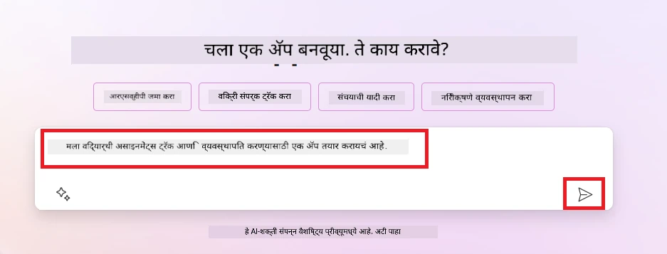

1. AI कॉपिलट आपल्याला डेटा साठवण्यासाठी आवश्यक फील्ड्ससह डेटाव्हर्स टेबल आणि काही नमुना डेटा सुचवेल. आपण AI कॉपिलट सहाय्यक वैशिष्ट्याद्वारे संभाषणात्मक टप्प्यांनी टेबल आपल्या गरजेनुसार सानुकूलित करू शकता.

   > **महत्त्वाचे**: डेटाव्हर्स हे पॉवर प्लॅटफॉर्मसाठी मूलभूत डेटा प्लॅटफॉर्म आहे. हे लो-कोड डेटा प्लॅटफॉर्म आहे जो सुरक्षितपणे मायक्रोसॉफ्ट क्लाउडमध्ये डेटा संग्रहित करतो आणि पॉवर प्लॅटफॉर्म पर्यावरणात प्रदान केला जातो. यात अंगभूत डेटा शासन क्षमता आहेत, जसे की डेटा वर्गीकरण, डेटा मागोवा, सूक्ष्म प्रवेश नियंत्रण, आणि बरेच काही. डेटाव्हर्सबद्दल अधिक जाणून घेण्यासाठी [येथे](https://docs.microsoft.com/powerapps/maker/data-platform/data-platform-intro?WT.mc_id=academic-109639-somelezediko) भेट द्या.

   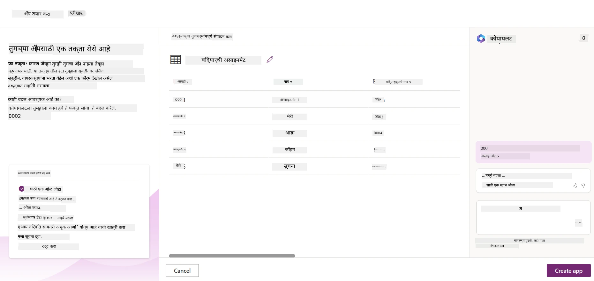

1. शिक्षकांनी असाइनमेंट सादर केलेल्या विद्यार्थ्यांना ईमेल करण्यासाठी ईमेल गोळा करण्यासाठी टेबलमध्ये नवीन फील्ड जोडण्यास कॉपिलट वापरू शकता. उदाहरणार्थ, टेबलमध्ये नवीन कॉलम जोडण्यासाठी पुढील प्रॉम्प्ट वापरू शकता: **_मला स्टुडेंट ईमेल संग्रहित करण्यासाठी कॉलम जोडायचा आहे_**. AI कॉपिलटकडे प्रॉम्प्ट पाठवण्यासाठी **Send** बटणावर क्लिक करा.

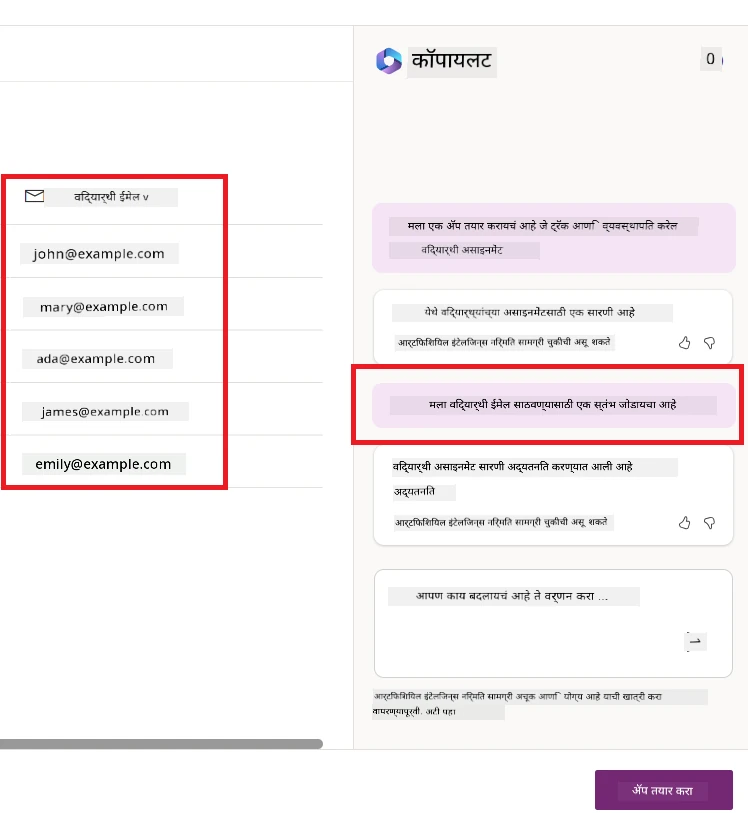

1. AI कॉपिलट नवीन फील्ड तयार करेल आणि आपण आपल्या गरजेनुसार फील्ड सानुकूलित करू शकता.

1. टेबल पूर्ण केल्यानंतर, अॅप तयार करण्यासाठी **Create app** बटणावर क्लिक करा.

1. AI Copilot तुमच्या वर्णनावर आधारित प्रतिसादक्षम Canvas अॅप तयार करेल. नंतर तुम्ही तुमच्या गरजेनुसार अॅप सानुकूलित करू शकता.

1. शिक्षकांना विद्यार्थ्यांना ईमेल पाठवण्यासाठी, तुम्ही Copilot वापरून अॅपमध्ये नवीन स्क्रीन जोडू शकता. उदाहरणार्थ, पुढील सूचना वापरून नवीन स्क्रीन अॅपमध्ये जोडू शकता: **_मला विद्यार्थ्यांना ईमेल पाठवण्यासाठी एक स्क्रीन जोडायची आहे_**. AI Copilot कडे सूचना पाठवण्यासाठी **Send** बटणावर क्लिक करा.

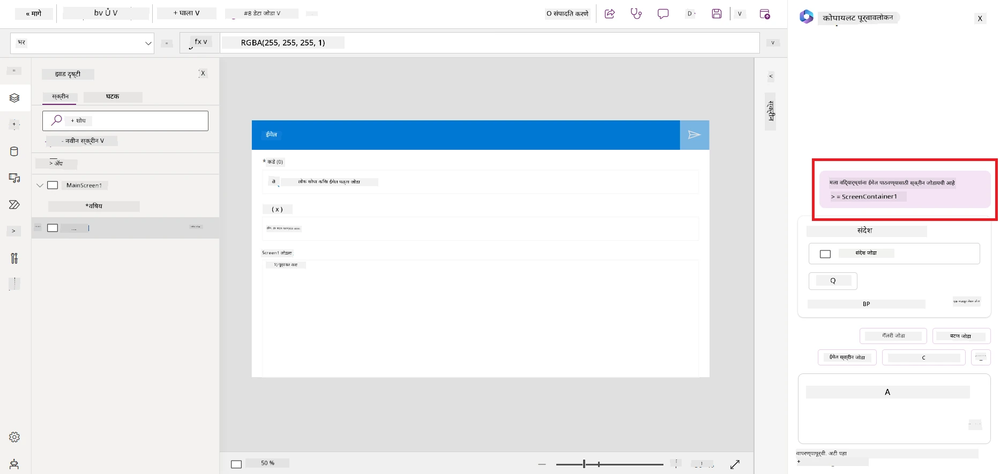

1. AI Copilot नवीन स्क्रीन तयार करेल आणि नंतर तुम्ही ती स्क्रीन तुमच्या गरजेनुसार सानुकूलित करू शकता.

1. अॅप पूर्ण झाल्यानंतर, अॅप सेव्ह करण्यासाठी **Save** बटणावर क्लिक करा.

1. शिक्षकांबरोबर अॅप शेअर करण्यासाठी, **Share** बटणावर क्लिक करा आणि नंतर पुन्हा **Share** वर क्लिक करा. तुम्ही शिक्षकांचे ईमेल पत्ते टाकून अॅप शेअर करू शकता.

> **तुमचे गृहकार्य**: तुम्ही तयार केलेला अॅप एक चांगली सुरुवात आहे परंतु त्यात सुधारणा करता येईल. ईमेल फिचरमुळे शिक्षक फक्त विद्यार्थ्यांना ईमेल्स manually टाईप करून पाठवू शकतात. तुम्ही Copilot वापरून असा ऑटोमेशन तयार करू शकता का ज्यामुळे शिक्षकांना असाईनमेंट सबमिट केल्यावर विद्यार्थ्यांना आपोआप ईमेल पाठवता येतील? योग्य सूचनेसह तुम्ही Power Automate मध्ये Copilot वापरून हे करू शकता.

### आमच्या स्टार्टअपसाठी एक इनव्हॉइस माहिती टेबल तयार करा

आमच्या स्टार्टअपच्या फायनान्स टीमला इनव्हॉइस ट्रॅक करण्यात अडचण येत आहे. ते इनव्हॉइससाठी स्प्रेडशीट वापरत आहेत, परंतु इनव्हॉइसेसच्या संख्येमुळे ते व्यवस्थापित करणे कठीण झाले आहे. त्यांनी तुम्हाला एक टेबल तयार करण्यास सांगितले आहे जे त्यांना इनव्हॉइसची माहिती साठवणे, ट्रॅक करणे आणि व्यवस्थापित करण्यात मदत करेल. हा टेबल ऑटोमेशन तयार करण्यासाठी वापरला पाहिजे जो सर्व इनव्हॉइस माहिती ओढून टेबलमध्ये साठवेल. टेबल फायनान्स टीमला भरलेले आणि न भरलेले इनव्हॉइस पाहण्यासही सक्षम करेल.

Power Platform मध्ये Dataverse नावाचा एक अंतर्निहित डेटा प्लॅटफॉर्म आहे जो तुमच्या अॅप्स आणि सोल्युशन्ससाठी डेटा साठवण्यास सक्षम करतो. Dataverse ही एक लो-कोड डेटा प्लॅटफॉर्म सेवा आहे जी Microsoft Cloud मध्ये डेटा सुरक्षितपणे साठवते आणि Power Platform वातावरणात प्राव्हिजन केली जाते. यात डेटा वर्गीकरण, डेटा उगम, सूक्ष्म प्रवेश नियंत्रण यांसारख्या डेटा शासकीय क्षमताही आहेत. तुम्ही Dataverse विषयी अधिक शिकू शकता [येथे](https://docs.microsoft.com/powerapps/maker/data-platform/data-platform-intro?WT.mc_id=academic-109639-somelezediko).

आमच्या स्टार्टअपने Dataverse का वापरावा? Dataverse मधील मानक आणि सानुकूल टेबल्स तुमच्या डेटासाठी सुरक्षित आणि क्लाउड-आधारित साठवण पर्याय देते. टेबल तुम्हाला विविध प्रकारचा डेटा साठवण्याची परवानगी देतात, जसे की एका Excel वर्कबुकमधील अनेक वर्कशीट्स वापरल्या जातात. तुम्ही तुमच्या संस्थेच्या किंवा व्यवसायाच्या गरजांसाठी डेटा साठवण्यासाठी टेबल्स वापरू शकता. Dataverse वापरून आमच्या स्टार्टअपला मिळणारे काही फायदे पुढीलप्रमाणे आहेत:

- **सुलभ व्यवस्थापन**: मेटाडेटा आणि डेटा दोन्ही क्लाउडमध्ये साठवले जातात, त्यामुळे तुम्हाला डेटा कसा साठवला जातो किंवा व्यवस्थापित केला जातो याची काळजी करायची नाही. तुम्ही फक्त अॅप्स आणि सोल्युशन्स तयार करण्यावर लक्ष केंद्रित करू शकता.

- **सुरक्षित**: Dataverse तुमच्या डेटासाठी सुरक्षित आणि क्लाउड-आधारित साठवण पर्याय प्रदान करतो. तुम्ही टेबलमधील डेटावर कोणाला कसे प्रवेश आहे हे भूमिका आधारित सुरक्षा वापरून नियंत्रित करू शकता.

- **शक्तिशाली मेटाडेटा**: डेटा प्रकार आणि नातेसंबंध थेट Power Apps मध्ये वापरले जातात.

- **लॉजिक आणि सत्यापन**: तुम्ही व्यवसाय नियम, गणिती फील्ड आणि सत्यापन नियम वापरून व्यवसाय लॉजिक राबवू शकता आणि डेटा अचूकता राखू शकता.

आता तुम्हाला Dataverse काय आहे आणि आपण ते का वापरावे हे माहीत आहे, तर आपण Copilot वापरून Dataverse मध्ये टेबल कसे तयार कराल ते पाहूया जे आमच्या फायनान्स टीमच्या गरजा पूर्ण करेल.

> **टीप** : तुम्ही पुढील विभागात हा टेबल वापरून ऑटोमेशन तयार कराल जो सर्व इनव्हॉइस माहिती काढेल आणि टेबलमध्ये साठवेल.

Copilot वापरून Dataverse मध्ये टेबल तयार करण्यासाठी खालील चरणांचे अनुसरण करा:

1. [Power Apps](https://make.powerapps.com?WT.mc_id=academic-105485-koreyst) होम स्क्रीनवर जा.

2. लेफ्ट नेव्हिगेशन बारमधून **Tables** निवडा आणि नंतर **Describe the new Table** वर क्लिक करा.

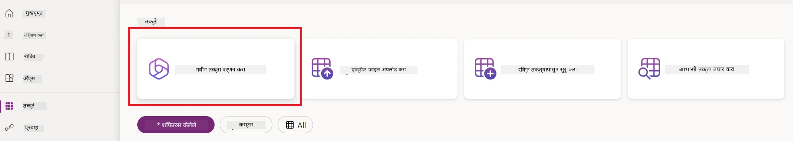

1. **Describe the new Table** स्क्रीनवर, टेबल कसे तयार करायचे ते वर्णन करण्यासाठी टेक्स्ट एरियाचा वापर करा. उदाहरणार्थ, **_मला इनव्हॉइस माहिती साठवण्यासाठी एक टेबल तयार करायचं आहे_**. AI Copilot कडे सूचना पाठवण्यासाठी **Send** बटणावर क्लिक करा.

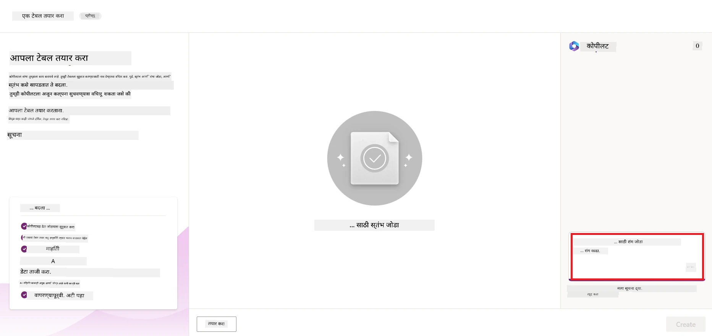

1. AI Copilot Dataverse टेबल सुचवेल ज्यात डेटा स्टोअर करण्यासाठी आवश्यक फील्ड्स आणि काही नमुना डेटा असेल. नंतर तुम्ही AI Copilot सहाय्यकाद्वारे संवादात्मक पायऱ्यांमुळे टेबल सानुकूलित करू शकता.

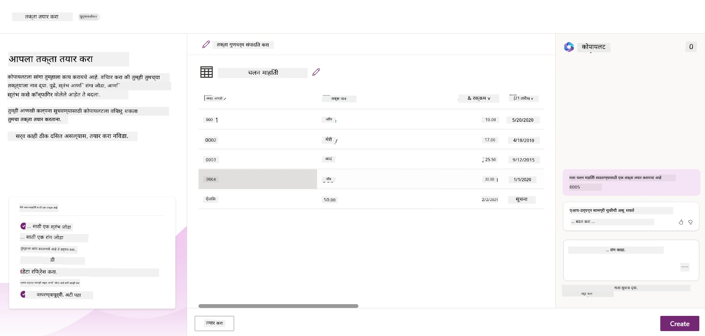

1. फायनान्स टीम पुरवठादाराला ईमेल पाठवून त्यांच्या इनव्हॉइसची सद्यस्थिती अपडेट करू इच्छिते. तुम्ही Copilot वापरून टेबलमध्ये पुरवठादार ईमेल साठवण्यासाठी नवीन फील्ड जोडू शकता. उदाहरणार्थ, पुढील सूचना वापरा: **_मला पुरवठादार ईमेल साठवण्यासाठी कॉलम जोडायचा आहे_**. AI Copilot कडे सूचना पाठवण्यासाठी **Send** बटणावर क्लिक करा.

1. AI Copilot नवीन फील्ड तयार करेल आणि नंतर तुम्ही ती फील्ड तुमच्या गरजेनुसार सानुकूलित करू शकता.

1. टेबल पूर्ण झाल्यावर, टेबल तयार करण्यासाठी **Create** बटणावर क्लिक करा.

## Power Platform मध्ये AI Builder सह AI मॉडेल्स

AI Builder हा Power Platform मध्ये उपलब्ध असलेला एक लो-कोड AI क्षमता आहे, जो तुम्हाला AI मॉडेल्स वापरून प्रोसेसेस ऑटोमेट करण्यास आणि निकालांची भाकीत करण्यास मदत करतो. AI Builder वापरून तुम्ही तुमच्या अॅप्स आणि फ्लोजमध्ये AI आणू शकता जे Dataverse किंवा विविध क्लाउड डेटा स्रोतांशी, जसे SharePoint, OneDrive किंवा Azure शी जोडतात.

## तयार केलेले AI मॉडेल्स विरुद्ध सानुकूल AI मॉडेल्स

AI Builder दोन प्रकारचे AI मॉडेल्स देतो: तयार केलेले AI मॉडेल्स आणि सानुकूल AI मॉडेल्स. तयार केलेले AI मॉडेल्स हे तयार वापरण्यासाठी असलेले Microsoft द्वारे प्रशिक्षित, आणि Power Platform मध्ये उपलब्ध असलेले AI मॉडेल्स आहेत. हे तुम्हाला तुमच्या अॅप्स आणि फ्लोजमध्ये बुद्धिमत्ता जोडण्यास मदत करतात, ज्यासाठी तुमच्याकडून डेटा गोळा करून स्वतःचे मॉडेल तयार, प्रशिक्षित व प्रकाशित करावे लागत नाही. तुम्ही या मॉडेल्स वापरून प्रोसेसेस ऑटोमेट करू शकता आणि निकालांचा अंदाज बांधू शकता.

Power Platform मध्ये उपलब्ध काही तयार केलेले AI मॉडेल्स:

- **की फ्रेज एक्स्ट्रॅक्शन**: हे मॉडेल मजकुरातून की फ्रेझेस काढते.
- **भाषा ओळख**: हे मॉडेल मजकुराची भाषा ओळखते.
- **भावना विश्लेषण**: हे मॉडेल मजकुरात सकारात्मक, नकारात्मक, तटस्थ किंवा मिश्र भावना ओळखते.
- **व्यवसाय कार्ड वाचक**: हे मॉडेल व्यवसाय कार्डमधून माहिती काढते.
- **टेक्स्ट मान्यता**: हे मॉडेल प्रतिमांमधून मजकूर ओळखते.
- **ऑब्जेक्ट शोध**: हे मॉडेल प्रतिमांमधून वस्तू शोधते आणि काढते.
- **डॉक्युमेंट प्रक्रिया**: हे मॉडेल फॉर्ममधून माहिती काढते.
- **इनव्हॉइस प्रक्रिया**: हे मॉडेल इनव्हॉइसेसमधून माहिती काढते.

सानुकूल AI मॉडेल्स वापरून तुम्ही तुमचा स्वतःचा मॉडेल AI Builder मध्ये आणू शकता, ज्यामुळे तो AI Builder चा कोणताही सानुकूल मॉडेलसारखा कार्य करतो, आणि तुम्ही तुमचा स्वतःचा डेटा वापरून मॉडेल प्रशिक्षित करू शकता. तुम्ही हे मॉडेल्स Power Apps आणि Power Automate मध्ये प्रोसेसेस ऑटोमेट करण्यासाठी आणि निकाल भाकीत करण्यासाठी वापरू शकता. स्वतःचा मॉडेल वापरताना काही बंधने लागू होतात. या [बंधने](https://learn.microsoft.com/ai-builder/byo-model#limitations?WT.mc_id=academic-105485-koreyst) विषयी अधिक वाचा.

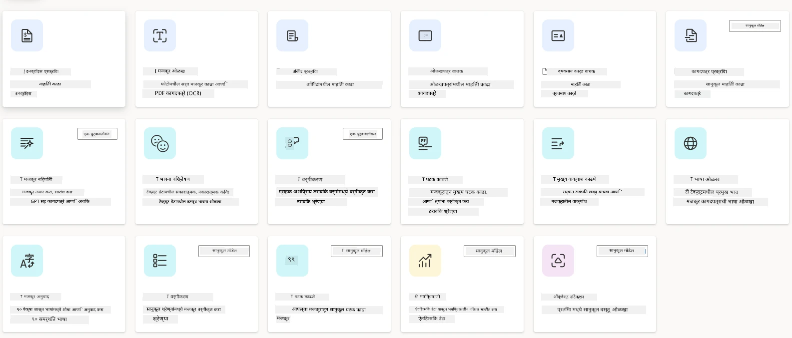

## असाइनमेंट #2 - आमच्या स्टार्टअपसाठी इनव्हॉइस प्रक्रिया फ्लो तयार करा

फायनान्स टीमला इनव्हॉइस प्रक्रिया करण्यात अडचण येत आहे. ते इनव्हॉइससाठी स्प्रेडशीट वापरत आहेत, परंतु इनव्हॉइसच्या संख्येमुळे व्यवस्थापन कठीण झाले आहे. त्यांनी तुम्हाला असा वर्कफ्लो तयार करण्यास सांगितले आहे जो AI वापरून इनव्हॉइस प्रक्रिया करण्यात मदत करेल. हा वर्कफ्लो इनव्हॉइसमधून माहिती काढण्यास आणि Dataverse टेबलमध्ये ती माहिती साठवण्यास सक्षम असेल. वर्कफ्लो फायनान्स टीमला काढलेली माहिती असलेली ईमेल पाठवण्यासही सक्षम असावी.

AI Builder काय आहे आणि का वापरायचे याची माहिती असल्यानंतर, आत्ता आपण AI Builder मधील इनव्हॉइस प्रक्रिया AI मॉडेल कसा वापरून फायनान्स टीमसाठी इनव्हॉइस प्रक्रिया करण्यासाठी वर्कफ्लो तयार करू शकतो ते पाहूया.

इनव्हॉइस प्रक्रिया AI मॉडेल वापरून फायनान्स टीमची मदत करणारा वर्कफ्लो तयार करण्यासाठी खालील चरणांचे अनुसरण करा:

1. [Power Automate](https://make.powerautomate.com?WT.mc_id=academic-105485-koreyst) होम स्क्रीनवर जा.

2. होम स्क्रीनवर टेक्स्ट एरियात तुम्हाला तयार करायचा असलेला वर्कफ्लो वर्णन करा. उदाहरणार्थ, **_जेव्हा माझ्या मेलबॉक्समध्ये इनव्हॉइस येईल तेव्हा प्रक्रिया करा_**. AI Copilot कडे सूचना पाठवण्यासाठी **Send** बटणावर क्लिक करा.

   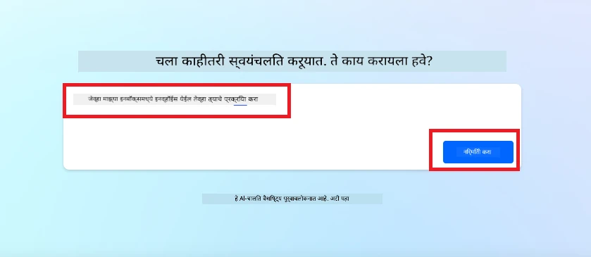

3. AI Copilot तुम्हाला आवश्यक असलेले क्रियाकलाप सुचवेल जे तुम्हाला तुमचे कार्य ऑटोमेट करण्यासाठी करावयाचे आहेत. पुढील टप्प्यांमध्ये जाण्यासाठी **Next** बटणावर क्लिक करा.

4. पुढील टप्प्यामध्ये, Power Automate तुमच्याकडे फ्लो सेटअपसाठी आवश्यक असलेल्या कनेक्शन्स सेट करण्यास सांगेल. पूर्ण झाल्यानंतर फ्लो तयार करण्यासाठी **Create flow** बटणावर क्लिक करा.

5. AI Copilot एक फ्लो तयार करेल आणि नंतर तुम्ही तुमच्या गरजेनुसार फ्लो सानुकूलित करू शकता.

6. फ्लोचा ट्रिगर अपडेट करा आणि इनव्हॉइस ज्या फोल्डरमध्ये साठवले जातील ते फोल्डर **Folder** मध्ये सेट करा. उदाहरणार्थ, फोल्डर **Inbox** सेट करू शकता. **Show advanced options** क्लिक करा आणि **Only with Attachments** पर्याय **Yes** करा. यामुळे हे सुनिश्चित होईल की त्या फोल्डरमध्ये अटॅचमेंटसह ईमेल आल्यावरच फ्लो चालेल.

7. पुढील क्रियाकलाप फ्लोमधून काढा: **HTML to text**, **Compose**, **Compose 2**, **Compose 3** आणि **Compose 4** कारण तुम्ही त्यांचा वापर करणार नाही.

8. फ्लोमधून **Condition** क्रिया काढा कारण तुम्ही त्याचा उपयोग करणार नाही. फ्लो खालील प्रमाणे दिसायला हवा:

   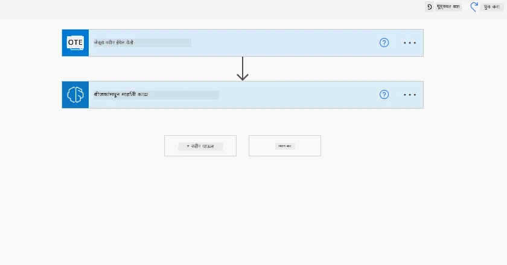

9. **Add an action** बटणावर क्लिक करा आणि **Dataverse** शोधा. नंतर **Add a new row** क्रिया निवडा.

10. **Extract Information from invoices** क्रियेत **Invoice File** अपडेट करा जेणेकरून ते 이메일मधील **Attachment Content** कडे निर्देशित करेल. त्यामुळे फ्लो इनव्हॉइस अटॅचमेंटमधून माहिती काढेल.

11. तुम्ही यापूर्वी तयार केलेला **Table** निवडा. उदाहरणार्थ, **Invoice Information** टेबल निवडा. मागील क्रियेतून डायनॅमिक कंटेंट वापरून खालील फील्ड भराः

    - ID
    - Amount
    - Date
    - Name
    - Status - **Status** चे मूल्य **Pending** सेट करा.
    - Supplier Email - **When a new email arrives** ट्रिगरमधून **From** डायनॅमिक कंटेंट वापरा.

    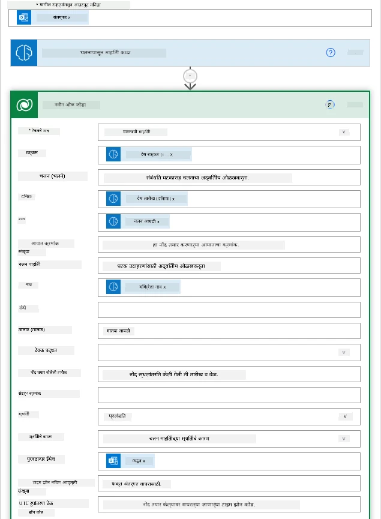

12. फ्लो पूर्ण झाल्यानंतर, फ्लो सेव्ह करण्यासाठी **Save** बटणावर क्लिक करा. तुम्ही फ्लोचा चाचणीसाठी इनव्हॉइस असलेला ईमेल ट्रिगरमध्ये दिलेल्या फोल्डरमध्ये पाठवू शकता.

> **तुमचे गृहकार्य**: तुम्ही तयार केलेला फ्लो एक चांगली सुरुवात आहे, आता तुम्हाला असा ऑटोमेशन तयार करायचा आहे ज्यामुळे आपल्या फायनान्स टीमला इनव्हॉइसच्या स्थिती बदलल्यावर पुरवठादाराला सद्यस्थितीबद्दल ईमेल पाठवता येईल. सूचना: ईमेल पाठवण्याचा फ्लो इनव्हॉइस स्थिती बदलल्यावर चालू व्हावा.

## Power Automate मध्ये Text Generation AI मॉडेल वापरा

AI Builder मधील Create Text with GPT AI मॉडेल तुम्हाला प्रॉम्प्टवर आधारित मजकूर तयार करण्यास सक्षम करते आणि हे Microsoft Azure OpenAI Service ने चालते. या क्षमतेसह तुम्ही GPT (Generative Pre-Trained Transformer) तंत्रज्ञान तुमच्या अॅप्स आणि फ्लोजमध्ये समाकलित करू शकता ज्यामुळे विविध ऑटोमेटेड फ्लोज आणि उपयुक्त अनुप्रयोग तयार करू शकता.

GPT मॉडेल्स विस्तृत प्रमाणात डेटावर प्रशिक्षण घेतात ज्यामुळे ते दिलेल्या प्रॉम्प्टवर मानवी भाषा सारखा मजकूर तयार करू शकतात. वर्कफ्लो ऑटोमेशनसह समाकलित झाल्यावर, GPT सारखे AI मॉडेल्स विविध कामे सुलभ आणि स्वयंचलित करण्यासाठी वापरले जाऊ शकतात.

उदाहरणार्थ, तुम्ही फ्लोज तयार करू शकता जे स्वयंचलितपणे विविध उपयोगांसाठी मजकूर तयार करतात जसे की: ईमेल काचेस, उत्पादन वर्णने आणि बरेच काही. तुम्ही ही मॉडेल वापरून वेगवेगळ्या अॅप्ससाठी मजकूर तयार करू शकता, जसे की चॅटबॉट्स आणि कस्टमर सर्व्हिस अॅप्स जे ग्राहक सेवा एजंट्सना कार्यक्षमतेने आणि परिणामकारकतेने ग्राहकांच्या चौकशींना प्रतिसाद देण्यास सक्षम करतात.

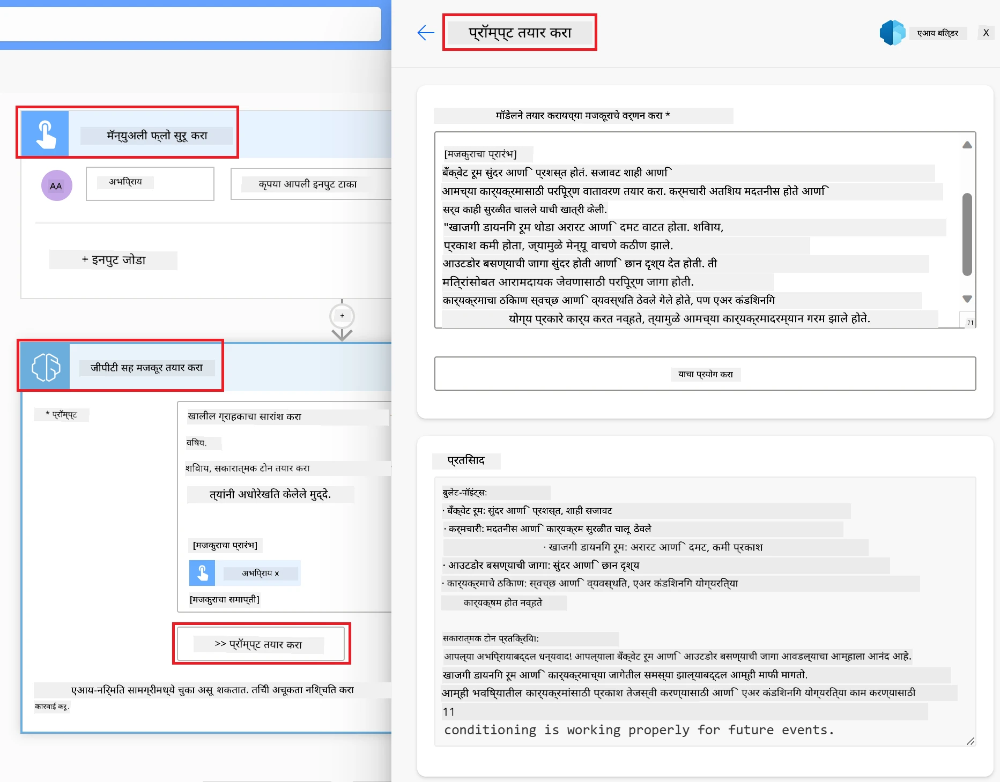

Power Automate मध्ये हा AI मॉडेल कसा वापरायचा हे जाणून घेण्यासाठी, [Add intelligence with AI Builder and GPT](https://learn.microsoft.com/training/modules/ai-builder-text-generation/?WT.mc_id=academic-109639-somelezediko) मोड्यूल पाहा.

## उत्कृष्ट काम! आपले शिक्षण सुरू ठेवा

हा धडा पूर्ण केल्यानंतर, आमच्या [Generative AI Learning collection](https://aka.ms/genai-collection?WT.mc_id=academic-105485-koreyst) ला भेट द्या आणि आपले Generative AI ज्ञान वाढवत रहा!

Copilot सानुकूलित करू इच्छिता आणि त्यातून अधिक मिळवू इच्छिता? [Awesome Copilot](https://github.com/github/awesome-copilot?WT.mc_id=academic-105485-koreyst) शोधा — GitHub Copilot चा जास्तीत जास्त वापर करण्यासाठी एक समुदाय-योगदान केलेला निर्देश, एजंट्स, कौशल्ये आणि कॉन्फिगरेशनची संग्रहण.

धडा 11 कडे चला, जिथे आपण [Function Calling सह Generative AI एकत्रित करण्याबद्दल](../11-integrating-with-function-calling/README.md?WT.mc_id=academic-105485-koreyst) पाहणार आहोत!

---

<!-- CO-OP TRANSLATOR DISCLAIMER START -->
**अस्वीकरण**:
हा दस्तऐवज AI भाषांतर सेवा [Co-op Translator](https://github.com/Azure/co-op-translator) चा वापर करून अनुवादित केला आहे. जरी आम्ही अचूकतेसाठी प्रयत्न करतो, तरी कृपया लक्षात घ्या की स्वयंचलित भाषांतरांमध्ये त्रुटी किंवा अचूकतेची कमतरता असू शकते. मूळ दस्तऐवज त्याच्या मूळ भाषेत अधिकृत स्रोत मानला पाहिजे. महत्त्वाची माहिती असल्यास, व्यावसायिक मानवी भाषांतराची शिफारस केली जाते. या भाषांतराच्या वापरामुळे उद्भवणाऱ्या कोणत्याही गैरसमज किंवा चुकीच्या अर्थलावणीसाठी आम्ही जबाबदार नाही.
<!-- CO-OP TRANSLATOR DISCLAIMER END -->