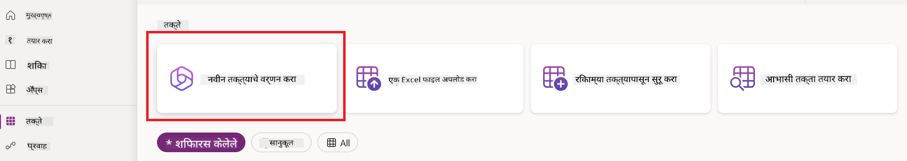
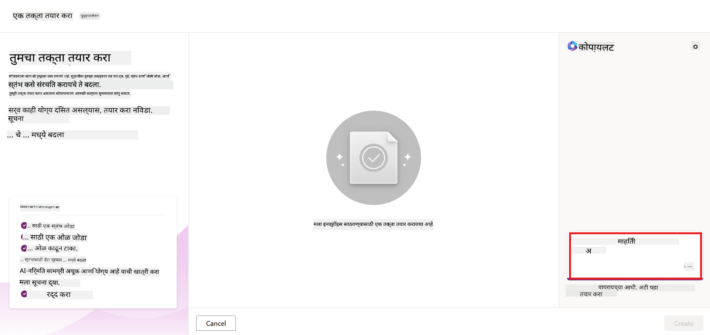
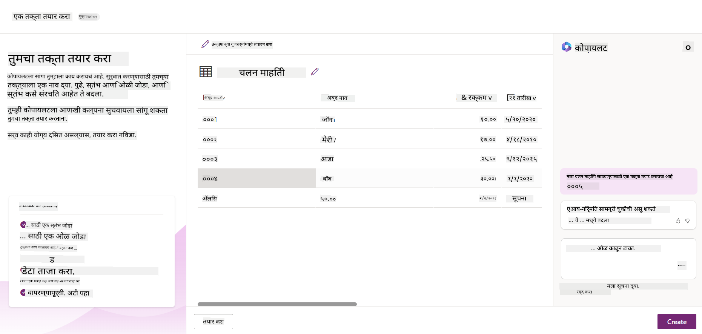
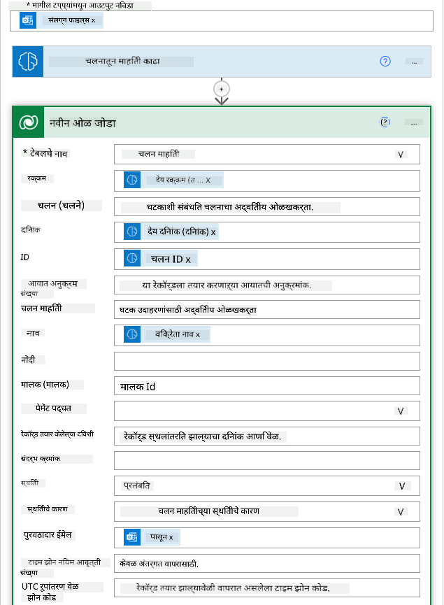

<!--
CO_OP_TRANSLATOR_METADATA:
{
  "original_hash": "846ac8e3b7dcfb697d3309fec05f0fea",
  "translation_date": "2025-10-17T13:39:12+00:00",
  "source_file": "10-building-low-code-ai-applications/README.md",
  "language_code": "mr"
}
-->
# लो कोड AI अनुप्रयोग तयार करणे

> _(वरील प्रतिमेवर क्लिक करून या धड्याचा व्हिडिओ पहा)_

## परिचय

आता आपण प्रतिमा तयार करणारे अनुप्रयोग कसे तयार करायचे ते शिकलो आहोत, चला लो कोडबद्दल बोलूया. जनरेटिव AI विविध क्षेत्रांमध्ये वापरले जाऊ शकते ज्यामध्ये लो कोड देखील समाविष्ट आहे, परंतु लो कोड म्हणजे काय आणि आपण त्यात AI कसे जोडू शकतो?

लो कोड डेव्हलपमेंट प्लॅटफॉर्म्सच्या वापरामुळे पारंपरिक डेव्हलपर्स आणि नॉन-डेव्हलपर्ससाठी अनुप्रयोग आणि सोल्यूशन्स तयार करणे सोपे झाले आहे. लो कोड डेव्हलपमेंट प्लॅटफॉर्म्स तुम्हाला कमी किंवा कोणत्याही कोडशिवाय अनुप्रयोग आणि सोल्यूशन्स तयार करण्यास सक्षम करतात. हे व्हिज्युअल डेव्हलपमेंट वातावरण प्रदान करून साध्य केले जाते जे तुम्हाला घटक ड्रॅग आणि ड्रॉप करून अनुप्रयोग आणि सोल्यूशन्स तयार करण्यास सक्षम करते. यामुळे तुम्ही कमी संसाधनांसह आणि जलद अनुप्रयोग तयार करू शकता. या धड्यात, लो कोड कसे वापरायचे आणि AI च्या मदतीने लो कोड डेव्हलपमेंट कसे सुधारायचे यावर सखोल चर्चा केली आहे.

पॉवर प्लॅटफॉर्म संस्थांना त्यांच्या टीम्सना अंतर्ज्ञानी लो-कोड किंवा नो-कोड वातावरणाद्वारे स्वतःचे सोल्यूशन्स तयार करण्यासाठी सक्षम करण्याची संधी प्रदान करते. हे वातावरण सोल्यूशन्स तयार करण्याची प्रक्रिया सुलभ करण्यास मदत करते. पॉवर प्लॅटफॉर्मसह, सोल्यूशन्स काही दिवस किंवा आठवड्यांत तयार केले जाऊ शकतात, महिन्यां किंवा वर्षांऐवजी. पॉवर प्लॅटफॉर्ममध्ये पाच प्रमुख उत्पादने आहेत: पॉवर अॅप्स, पॉवर ऑटोमेट, पॉवर BI, पॉवर पेजेस आणि कोपायलट स्टुडिओ.

या धड्यात समाविष्ट आहे:

- पॉवर प्लॅटफॉर्ममधील जनरेटिव AI ची ओळख
- कोपायलटची ओळख आणि त्याचा वापर कसा करायचा
- पॉवर प्लॅटफॉर्ममध्ये जनरेटिव AI वापरून अॅप्स आणि फ्लोज तयार करणे
- AI बिल्डरसह पॉवर प्लॅटफॉर्ममधील AI मॉडेल्स समजून घेणे

## शिकण्याची उद्दिष्टे

या धड्याच्या शेवटी, तुम्ही हे करू शकाल:

- पॉवर प्लॅटफॉर्ममध्ये कोपायलट कसा कार्य करतो ते समजून घ्या.

- आमच्या शिक्षण स्टार्टअपसाठी स्टुडंट असाइनमेंट ट्रॅकर अॅप तयार करा.

- AI चा वापर करून इनव्हॉइसमधून माहिती काढण्यासाठी इनव्हॉइस प्रोसेसिंग फ्लो तयार करा.

- GPT AI मॉडेलसह टेक्स्ट तयार करताना सर्वोत्तम पद्धती लागू करा.

या धड्यात तुम्ही वापरणार असलेल्या साधने आणि तंत्रज्ञान:

- **पॉवर अॅप्स**, स्टुडंट असाइनमेंट ट्रॅकर अॅपसाठी, जे डेटा ट्रॅक, व्यवस्थापित आणि संवाद साधण्यासाठी अॅप्स तयार करण्यासाठी लो-कोड डेव्हलपमेंट वातावरण प्रदान करते.

- **डेटाव्हर्स**, स्टुडंट असाइनमेंट ट्रॅकर अॅपसाठी डेटा संग्रहित करण्यासाठी, जिथे डेटाव्हर्स अॅपच्या डेटासाठी लो-कोड डेटा प्लॅटफॉर्म प्रदान करेल.

- **पॉवर ऑटोमेट**, इनव्हॉइस प्रोसेसिंग फ्लोसाठी, जिथे तुम्ही इनव्हॉइस प्रोसेसिंग प्रक्रिया स्वयंचलित करण्यासाठी वर्कफ्लोज तयार करण्यासाठी लो-कोड डेव्हलपमेंट वातावरण मिळवाल.

- **AI बिल्डर**, इनव्हॉइस प्रोसेसिंग AI मॉडेलसाठी, जिथे तुम्ही आमच्या स्टार्टअपसाठी इनव्हॉइस प्रक्रिया करण्यासाठी प्रीबिल्ट AI मॉडेल्स वापराल.

## पॉवर प्लॅटफॉर्ममधील जनरेटिव AI

लो-कोड डेव्हलपमेंट आणि अनुप्रयोग जनरेटिव AI सह सुधारणे हे पॉवर प्लॅटफॉर्मसाठी एक महत्त्वाचे लक्ष आहे. उद्दिष्ट म्हणजे प्रत्येकाला AI-सक्षम अॅप्स, साइट्स, डॅशबोर्ड तयार करण्यास आणि AI सह प्रक्रिया स्वयंचलित करण्यास सक्षम करणे, _डेटा सायन्सची कोणतीही तज्ञता आवश्यक नसताना_. हे उद्दिष्ट पॉवर प्लॅटफॉर्ममध्ये लो-कोड डेव्हलपमेंट अनुभवामध्ये कोपायलट आणि AI बिल्डरच्या स्वरूपात जनरेटिव AI समाकलित करून साध्य केले जाते.

### हे कसे कार्य करते?

कोपायलट हा एक AI सहाय्यक आहे जो तुम्हाला नैसर्गिक भाषेचा वापर करून संवादात्मक चरणांच्या मालिकेद्वारे तुमच्या आवश्यकता वर्णन करून पॉवर प्लॅटफॉर्म सोल्यूशन्स तयार करण्यास सक्षम करतो. उदाहरणार्थ, तुम्ही तुमच्या AI सहाय्यकाला तुमच्या अॅपमध्ये कोणते फील्ड असतील ते सांगू शकता आणि ते अॅप आणि अंतर्गत डेटा मॉडेल तयार करेल किंवा तुम्ही पॉवर ऑटोमेटमध्ये फ्लो कसे सेट करायचे ते निर्दिष्ट करू शकता.

तुमच्या अॅप स्क्रीनमध्ये कोपायलट चालवलेल्या कार्यक्षमतेचा वापर करून वापरकर्त्यांना संवादात्मक संवादाद्वारे अंतर्दृष्टी शोधण्यास सक्षम करण्यासाठी तुम्ही वापर करू शकता.

AI बिल्डर ही पॉवर प्लॅटफॉर्ममध्ये उपलब्ध लो-कोड AI क्षमता आहे जी तुम्हाला प्रक्रिया स्वयंचलित करण्यास आणि परिणामांची भविष्यवाणी करण्यात मदत करण्यासाठी AI मॉडेल्स वापरण्यास सक्षम करते. AI बिल्डरसह तुम्ही तुमच्या अॅप्स आणि फ्लोजमध्ये AI आणू शकता जे डेटाव्हर्स किंवा शेअरपॉइंट, वनड्राइव्ह किंवा अॅझर सारख्या विविध क्लाउड डेटा स्रोतांशी कनेक्ट होतात.

कोपायलट पॉवर प्लॅटफॉर्मच्या सर्व उत्पादनांमध्ये उपलब्ध आहे: पॉवर अॅप्स, पॉवर ऑटोमेट, पॉवर BI, पॉवर पेजेस आणि पॉवर व्हर्च्युअल एजंट्स. AI बिल्डर पॉवर अॅप्स आणि पॉवर ऑटोमेटमध्ये उपलब्ध आहे. या धड्यात, आम्ही आमच्या शिक्षण स्टार्टअपसाठी सोल्यूशन तयार करण्यासाठी पॉवर अॅप्स आणि पॉवर ऑटोमेटमध्ये कोपायलट आणि AI बिल्डर कसा वापरायचा यावर लक्ष केंद्रित करू.

### पॉवर अॅप्समधील कोपायलट

पॉवर प्लॅटफॉर्मचा भाग म्हणून, पॉवर अॅप्स डेटा ट्रॅक, व्यवस्थापित आणि संवाद साधण्यासाठी अॅप्स तयार करण्यासाठी लो-कोड डेव्हलपमेंट वातावरण प्रदान करते. हे अॅप डेव्हलपमेंट सेवांची एक श्रेणी आहे ज्यामध्ये स्केलेबल डेटा प्लॅटफॉर्म आणि क्लाउड सेवांशी कनेक्ट होण्याची क्षमता आहे. पॉवर अॅप्स तुम्हाला ब्राउझर, टॅब्लेट आणि फोनवर चालणारे अॅप्स तयार करण्यास आणि सहकाऱ्यांसह शेअर करण्यास अनुमती देते. पॉवर अॅप्स वापरकर्त्यांना सोप्या इंटरफेससह अॅप डेव्हलपमेंटमध्ये सहजतेने प्रवेश करण्यास अनुमती देते, जेणेकरून प्रत्येक व्यवसाय वापरकर्ता किंवा प्रो डेव्हलपर कस्टम अॅप्स तयार करू शकेल. अॅप डेव्हलपमेंट अनुभव जनरेटिव AI सह कोपायलटद्वारे देखील सुधारित केला जातो.

पॉवर अॅप्समधील कोपायलट AI सहाय्यक वैशिष्ट्य तुम्हाला तुमच्या अॅपची आवश्यकता कशी आहे आणि तुमचा अॅप कोणती माहिती ट्रॅक करेल, गोळा करेल किंवा दाखवेल हे वर्णन करण्यास सक्षम करते. कोपायलट नंतर तुमच्या वर्णनावर आधारित प्रतिसादात्मक कॅनव्हास अॅप तयार करतो. त्यानंतर तुम्ही तुमच्या गरजा पूर्ण करण्यासाठी अॅप सानुकूलित करू शकता. AI कोपायलट तुमच्या गरजा पूर्ण करण्यासाठी फील्डसह डेटाव्हर्स टेबल तयार करतो आणि काही नमुना डेटा सुचवतो. आम्ही या धड्याच्या पुढील भागात डेटाव्हर्स काय आहे आणि तुम्ही पॉवर अॅप्समध्ये ते कसे वापरू शकता ते पाहू. त्यानंतर तुम्ही संवादात्मक चरणांद्वारे AI कोपायलट सहाय्यक वैशिष्ट्य वापरून टेबल सानुकूलित करू शकता. हे वैशिष्ट्य पॉवर अॅप्सच्या होम स्क्रीनवर सहज उपलब्ध आहे.

### पॉवर ऑटोमेटमधील कोपायलट

पॉवर प्लॅटफॉर्मचा भाग म्हणून, पॉवर ऑटोमेट वापरकर्त्यांना अनुप्रयोग आणि सेवांमधील स्वयंचलित वर्कफ्लोज तयार करण्यास अनुमती देते. हे संवाद, डेटा संकलन आणि निर्णय मंजुरी यासारख्या पुनरावृत्ती व्यवसाय प्रक्रियेचे स्वयंचलित करण्यास मदत करते. त्याचा साधा इंटरफेस प्रत्येक तांत्रिक कौशल्य असलेल्या वापरकर्त्यांना (नवशिक्या ते अनुभवी डेव्हलपर्सपर्यंत) कामाचे कार्य स्वयंचलित करण्यास अनुमती देतो. वर्कफ्लो डेव्हलपमेंट अनुभव जनरेटिव AI सह कोपायलटद्वारे देखील सुधारित केला जातो.

पॉवर ऑटोमेटमधील कोपायलट AI सहाय्यक वैशिष्ट्य तुम्हाला तुमच्या फ्लोची आवश्यकता कशी आहे आणि तुमचा फ्लो कोणती क्रिया करेल हे वर्णन करण्यास सक्षम करते. कोपायलट नंतर तुमच्या वर्णनावर आधारित फ्लो तयार करतो. त्यानंतर तुम्ही तुमच्या गरजा पूर्ण करण्यासाठी फ्लो सानुकूलित करू शकता. AI कोपायलट तुमच्या स्वयंचलित प्रक्रियेसाठी आवश्यक असलेल्या क्रिया सुचवतो आणि तयार करतो. आम्ही या धड्याच्या पुढील भागात फ्लोज काय आहेत आणि तुम्ही पॉवर ऑटोमेटमध्ये ते कसे वापरू शकता ते पाहू. तुम्ही संवादात्मक चरणांद्वारे AI कोपायलट सहाय्यक वैशिष्ट्य वापरून क्रिया सानुकूलित करू शकता. हे वैशिष्ट्य पॉवर ऑटोमेटच्या होम स्क्रीनवर सहज उपलब्ध आहे.

## असाइनमेंट: आमच्या स्टार्टअपसाठी विद्यार्थी असाइनमेंट्स आणि इनव्हॉइस व्यवस्थापित करा, कोपायलट वापरून

आमचा स्टार्टअप विद्यार्थ्यांना ऑनलाइन कोर्सेस प्रदान करतो. स्टार्टअप वेगाने वाढला आहे आणि आता त्याच्या कोर्सेसच्या मागणीशी जुळवून घेण्यात संघर्ष करत आहे. स्टार्टअपने तुम्हाला पॉवर प्लॅटफॉर्म डेव्हलपर म्हणून नियुक्त केले आहे जेणेकरून तुम्ही त्यांना विद्यार्थी असाइनमेंट्स आणि इनव्हॉइस व्यवस्थापित करण्यासाठी लो कोड सोल्यूशन तयार करण्यात मदत करू शकता. त्यांचे सोल्यूशन विद्यार्थ्यांच्या असाइनमेंट्स ट्रॅक आणि व्यवस्थापित करण्यात त्यांना मदत करण्यासाठी अॅप तयार करण्यात सक्षम असावे आणि वर्कफ्लोद्वारे इनव्हॉइस प्रोसेसिंग प्रक्रिया स्वयंचलित करण्यात सक्षम असावे. तुम्हाला जनरेटिव AI वापरून सोल्यूशन विकसित करण्यास सांगितले आहे.

कोपायलट वापरण्यास सुरुवात करताना, तुम्ही [पॉवर प्लॅटफॉर्म कोपायलट प्रॉम्प्ट लायब्ररी](https://github.com/pnp/powerplatform-prompts?WT.mc_id=academic-109639-somelezediko) वापरू शकता जेणेकरून प्रॉम्प्ट्ससह सुरुवात करता येईल. या लायब्ररीमध्ये प्रॉम्प्ट्सची यादी आहे जी तुम्ही कोपायलटसह अॅप्स आणि फ्लोज तयार करण्यासाठी वापरू शकता. तुम्ही कोपायलटला तुमच्या गरजा कशा वर्णन करायच्या याची कल्पना मिळवण्यासाठी लायब्ररीतील प्रॉम्प्ट्स देखील वापरू शकता.

### आमच्या स्टार्टअपसाठी विद्यार्थी असाइनमेंट ट्रॅकर अॅप तयार करा

आमच्या स्टार्टअपमधील शिक्षकांना विद्यार्थी असाइनमेंट्स ट्रॅक करण्यात अडचण येत आहे. त्यांनी असाइनमेंट्स ट्रॅक करण्यासाठी स्प्रेडशीट वापरले आहे परंतु विद्यार्थ्यांची संख्या वाढल्यामुळे हे व्यवस्थापित करणे कठीण झाले आहे. त्यांनी तुम्हाला असे अॅप तयार करण्यास सांगितले आहे जे त्यांना विद्यार्थी असाइनमेंट्स ट्रॅक आणि व्यवस्थापित करण्यात मदत करेल. अॅपने त्यांना नवीन असाइनमेंट्स जोडण्यास, असाइनमेंट्स पाहण्यास, असाइनमेंट्स अपडेट करण्यास आणि असाइनमेंट्स हटवण्यास सक्षम करावे. अॅपने शिक्षक आणि विद्यार्थ्यांना ग्रेड केलेल्या आणि न ग्रेड केलेल्या असाइनमेंट्स पाहण्यास सक्षम करावे.

तुम्ही खालील चरणांचे अनुसरण करून पॉवर अॅप्समधील कोपायलट वापरून अॅप तयार कराल:

1. [पॉवर अॅप्स](https://make.powerapps.com?WT.mc_id=academic-105485-koreyst) होम स्क्रीनवर जा.

1. होम स्क्रीनवरील टेक्स्ट एरियाचा वापर करून तुम्हाला तयार करायचे असलेल्या अॅपचे वर्णन करा. उदाहरणार्थ, **_मला विद्यार्थी असाइनमेंट्स ट्रॅक आणि व्यवस्थापित करण्यासाठी अॅप तयार करायचा आहे_**. प्रॉम्प्ट AI कोपायलटला पाठवण्यासाठी **Send** बटणावर क्लिक करा.

1. AI कोपायलट तुम्हाला तुमच्या गरजा पूर्ण करण्यासाठी फील्डसह डेटाव्हर्स टेबल सुचवेल आणि काही नमुना डेटा प्रदान करेल. तुम्ही संवादात्मक चरणांद्वारे AI कोपायलट सहाय्यक वैशिष्ट्य वापरून टेबल सानुकूलित करू शकता.

   > **महत्त्वाचे**: डेटाव्हर्स हे पॉवर प्लॅटफॉर्मसाठी अंतर्गत डेटा प्लॅटफॉर्म आहे. हे अॅपचा डेटा संग्रहित करण्यासाठी लो-कोड डेटा प्लॅटफॉर्म आहे. हे एक पूर्णपणे व्यवस्थापित सेवा आहे जी मायक्रोसॉफ्ट क्लाउडमध्ये डेटा सुरक्षितपणे संग्रहित करते आणि तुमच्या पॉवर प्लॅटफॉर्म वातावरणात प्रोव्हिजन केली जाते. यामध्ये डेटा वर्गीकरण, डेटा वंश, सूक्ष्म प्रवेश नियंत्रण आणि बरेच काही यासारख्या अंगभूत डेटा गव्हर्नन्स क्षमता आहेत. तुम्ही डेटाव्हर्सबद्दल अधिक [येथे](https://docs.microsoft.com/powerapps/maker/data-platform/data-platform-intro?WT.mc_id=academic-109639-somelezediko) शिकू शकता.

   

1. शिक्षक विद्यार्थ्यांना त्यांच्या असाइनमेंट्सच्या प्रगतीबद्दल अद्ययावत ठेवण्यासाठी ईमेल पाठवू इच्छित आहेत. तुम्ही टेबलमध्ये विद्यार्थी ईमेल संग्रहित करण्यासाठी नवीन फील्ड जोडण्यासाठी कोपायलट वापरू शकता. उदाहरणार्थ, तुम्ही टेबलमध्ये नवीन फील्ड जोडण्यासाठी खालील प्रॉम्प्ट वापरू शकता: **_मला विद्यार्थी ईमेल संग्रहित करण्यासाठी एक कॉलम जोडायचा आहे_**. प्रॉम्प्ट AI कोपायलटला पाठवण्यासाठी **Send** बटणावर क्लिक करा.

1. AI कोपायलट नवीन फील्ड तयार करेल आणि तुम्ही तुमच्या गरजा पूर्ण करण्यासाठी फील्ड सानुकूलित करू शकता.

1. टेबल पूर्ण झाल्यावर, अॅप तयार करण्यासाठी **Create app** बटणावर क्लिक करा.

1. AI कोपायलट तुमच्या वर्णनावर आधारित प्रतिसादात्मक कॅनव्हास अॅप तयार करेल. तुम्ही तुमच्या गरजा पूर्ण करण्यासाठी अॅप सानुकूलित करू शकता.

1. शिक्षक विद्यार्थ्यांना ईमेल पाठवण्यासाठी, तुम्ही अॅपमध्ये नवीन स्क्रीन जोडण्यासाठी कोपायलट वापरू शकता. उदाहरणार्थ, तुम्ही अॅपमध्ये नवीन स्क्रीन जोडण्यासाठी खालील प्रॉम्प्ट वापरू शकता: **_मला विद्यार्थ्यांना ईमेल पाठवण्यासाठी स्क्रीन जोडायची आहे_**. प्रॉम्प्ट AI कोपायलटला पाठवण्यासाठी **Send** बटणावर क्लिक करा.

1. AI कोपायलट नवीन स्क्रीन तयार करेल आणि तुम्ही तुमच्या गरजा पूर्ण करण्यासाठी स्क्रीन सानुकूलित करू शकता.

1. अॅप पूर्ण झाल्यावर, अॅप सेव्ह करण्यासाठी **Save** बटणावर क्लिक करा.

1. शिक्षकांसह अॅप
आपल्या स्टार्टअपसाठी Dataverse का वापरावा? Dataverse मधील स्टँडर्ड आणि कस्टम टेबल्स आपल्या डेटासाठी सुरक्षित आणि क्लाउड-आधारित स्टोरेज पर्याय प्रदान करतात. टेबल्स आपल्याला विविध प्रकारचा डेटा साठवण्याची परवानगी देतात, जसे की आपण एका Excel वर्कबुकमध्ये अनेक वर्कशीट्स वापरता. आपण आपल्या संस्थेच्या किंवा व्यवसायाच्या गरजेनुसार डेटा साठवण्यासाठी टेबल्स वापरू शकता. Dataverse वापरण्याचे काही फायदे आपल्या स्टार्टअपसाठी खालीलप्रमाणे आहेत:

- **सोपे व्यवस्थापन**: मेटाडेटा आणि डेटा दोन्ही क्लाउडमध्ये साठवले जातात, त्यामुळे ते कसे साठवले जातात किंवा व्यवस्थापित केले जातात याची चिंता करण्याची गरज नाही. आपण आपल्या अ‍ॅप्स आणि सोल्यूशन्स तयार करण्यावर लक्ष केंद्रित करू शकता.

- **सुरक्षितता**: Dataverse आपल्या डेटासाठी सुरक्षित आणि क्लाउड-आधारित स्टोरेज पर्याय प्रदान करते. आपण रोल आधारित सुरक्षा वापरून टेबल्समधील डेटावर कोणाला प्रवेश आहे आणि ते कसे प्रवेश करू शकतात हे नियंत्रित करू शकता.

- **समृद्ध मेटाडेटा**: डेटा प्रकार आणि नातेसंबंध थेट Power Apps मध्ये वापरले जातात.

- **तर्क आणि सत्यापन**: आपण व्यवसाय नियम, गणना केलेली फील्ड्स आणि सत्यापन नियमांचा वापर करून व्यवसाय तर्क लागू करू शकता आणि डेटा अचूकता राखू शकता.

आता आपण Dataverse काय आहे आणि ते का वापरावे हे जाणून घेतले आहे, चला पाहूया की आपण आपल्या फायनान्स टीमच्या गरजांसाठी Dataverse मध्ये टेबल तयार करण्यासाठी Copilot कसे वापरू शकता.

> **टीप**: आपण पुढील विभागात एक ऑटोमेशन तयार करण्यासाठी या टेबलचा वापर कराल, जे सर्व इनव्हॉइस माहिती काढून ती टेबलमध्ये साठवेल.

Dataverse मध्ये Copilot वापरून टेबल तयार करण्यासाठी खालील चरणांचे अनुसरण करा:

1. [Power Apps](https://make.powerapps.com?WT.mc_id=academic-105485-koreyst) होम स्क्रीनवर जा.

2. डाव्या नेव्हिगेशन बारवर **Tables** निवडा आणि नंतर **Describe the new Table** वर क्लिक करा.

3. **Describe the new Table** स्क्रीनवर, आपण तयार करू इच्छित टेबलचे वर्णन करण्यासाठी टेक्स्ट एरिया वापरा. उदाहरणार्थ, **_मला इनव्हॉइस माहिती साठवण्यासाठी टेबल तयार करायचे आहे_**. AI Copilot ला प्रॉम्प्ट पाठवण्यासाठी **Send** बटणावर क्लिक करा.

4. AI Copilot आपल्याला आवश्यक डेटा साठवण्यासाठी फील्ड्ससह Dataverse टेबल सुचवेल आणि काही नमुना डेटा प्रदान करेल. आपण नंतर संवादात्मक चरणांद्वारे AI Copilot सहाय्यक वैशिष्ट्य वापरून टेबल सानुकूलित करू शकता.

5. फायनान्स टीम पुरवठादाराला त्यांच्या इनव्हॉइसची वर्तमान स्थिती अपडेट करण्यासाठी ईमेल पाठवू इच्छित आहे. आपण टेबलमध्ये पुरवठादार ईमेल साठवण्यासाठी नवीन फील्ड जोडण्यासाठी Copilot वापरू शकता. उदाहरणार्थ, आपण टेबलमध्ये नवीन फील्ड जोडण्यासाठी खालील प्रॉम्प्ट वापरू शकता: **_मला पुरवठादार ईमेल साठवण्यासाठी एक कॉलम जोडायचा आहे_**. AI Copilot ला प्रॉम्प्ट पाठवण्यासाठी **Send** बटणावर क्लिक करा.

6. AI Copilot नवीन फील्ड तयार करेल आणि नंतर आपण फील्ड आपल्या गरजेनुसार सानुकूलित करू शकता.

7. टेबल पूर्ण झाल्यावर, टेबल तयार करण्यासाठी **Create** बटणावर क्लिक करा.

## AI Builder सह Power Platform मधील AI मॉडेल्स

AI Builder हे Power Platform मध्ये उपलब्ध लो-कोड AI क्षमता आहे जे आपल्याला प्रक्रिया स्वयंचलित करण्यासाठी आणि परिणामांची भविष्यवाणी करण्यासाठी AI मॉडेल्स वापरण्याची परवानगी देते. AI Builder सह आपण Dataverse किंवा SharePoint, OneDrive किंवा Azure सारख्या विविध क्लाउड डेटा स्रोतांशी कनेक्ट होणाऱ्या अ‍ॅप्स आणि फ्लोजमध्ये AI आणू शकता.

## प्रीबिल्ट AI मॉडेल्स वि कस्टम AI मॉडेल्स

AI Builder दोन प्रकारचे AI मॉडेल्स प्रदान करते: प्रीबिल्ट AI मॉडेल्स आणि कस्टम AI मॉडेल्स. प्रीबिल्ट AI मॉडेल्स हे Microsoft द्वारे प्रशिक्षित आणि Power Platform मध्ये उपलब्ध तयार-टू-यूज AI मॉडेल्स आहेत. यामुळे आपल्याला डेटा गोळा करण्याची आणि नंतर आपले मॉडेल तयार, प्रशिक्षित आणि प्रकाशित करण्याची आवश्यकता न पडता आपल्या अ‍ॅप्स आणि फ्लोजमध्ये बुद्धिमत्ता जोडण्यास मदत होते. आपण या मॉडेल्सचा वापर प्रक्रिया स्वयंचलित करण्यासाठी आणि परिणामांची भविष्यवाणी करण्यासाठी करू शकता.

Power Platform मध्ये उपलब्ध काही प्रीबिल्ट AI मॉडेल्स खालीलप्रमाणे आहेत:

- **Key Phrase Extraction**: हे मॉडेल टेक्स्टमधून मुख्य वाक्यांश काढते.
- **Language Detection**: हे मॉडेल टेक्स्टची भाषा ओळखते.
- **Sentiment Analysis**: हे मॉडेल टेक्स्टमधील सकारात्मक, नकारात्मक, तटस्थ किंवा मिश्र भावना ओळखते.
- **Business Card Reader**: हे मॉडेल व्यवसाय कार्ड्समधून माहिती काढते.
- **Text Recognition**: हे मॉडेल प्रतिमांमधून टेक्स्ट काढते.
- **Object Detection**: हे मॉडेल प्रतिमांमधून वस्तू ओळखते आणि काढते.
- **Document Processing**: हे मॉडेल फॉर्म्समधून माहिती काढते.
- **Invoice Processing**: हे मॉडेल इनव्हॉइसमधून माहिती काढते.

कस्टम AI मॉडेल्ससह आपण आपले स्वतःचे मॉडेल AI Builder मध्ये आणू शकता जेणेकरून ते कोणत्याही AI Builder कस्टम मॉडेलसारखे कार्य करू शकेल, आपले स्वतःचे डेटा वापरून मॉडेल प्रशिक्षित करण्याची परवानगी देईल. आपण Power Apps आणि Power Automate मध्ये प्रक्रिया स्वयंचलित करण्यासाठी आणि परिणामांची भविष्यवाणी करण्यासाठी या मॉडेल्सचा वापर करू शकता. आपले स्वतःचे मॉडेल वापरताना काही मर्यादा लागू होतात. या मर्यादांबद्दल अधिक वाचा [मर्यादा](https://learn.microsoft.com/ai-builder/byo-model#limitations?WT.mc_id=academic-105485-koreyst).

## असाइनमेंट #2 - आमच्या स्टार्टअपसाठी इनव्हॉइस प्रोसेसिंग फ्लो तयार करा

फायनान्स टीमला इनव्हॉइस प्रोसेस करण्यात अडचण येत आहे. त्यांनी इनव्हॉइस ट्रॅक करण्यासाठी स्प्रेडशीटचा वापर केला आहे, परंतु इनव्हॉइसची संख्या वाढल्यामुळे हे व्यवस्थापित करणे कठीण झाले आहे. त्यांनी आपल्याला AI वापरून इनव्हॉइस प्रोसेस करण्यात मदत करणारा वर्कफ्लो तयार करण्यास सांगितले आहे. वर्कफ्लोने त्यांना इनव्हॉइसमधून माहिती काढण्यास आणि Dataverse टेबलमध्ये माहिती साठवण्यास सक्षम करावे. वर्कफ्लोने त्यांना काढलेल्या माहितीसह फायनान्स टीमला ईमेल पाठवण्यास सक्षम करावे.

आता आपण AI Builder काय आहे आणि ते का वापरावे हे जाणून घेतले आहे, चला पाहूया की आपण AI Builder मधील Invoice Processing AI मॉडेलचा वापर करून फायनान्स टीमला इनव्हॉइस प्रोसेस करण्यात मदत करणारा वर्कफ्लो कसा तयार करू शकता.

Invoice Processing AI मॉडेल वापरून फायनान्स टीमला इनव्हॉइस प्रोसेस करण्यात मदत करणारा वर्कफ्लो तयार करण्यासाठी खालील चरणांचे अनुसरण करा:

1. [Power Automate](https://make.powerautomate.com?WT.mc_id=academic-105485-koreyst) होम स्क्रीनवर जा.

2. होम स्क्रीनवरील टेक्स्ट एरिया वापरून आपण तयार करू इच्छित वर्कफ्लोचे वर्णन करा. उदाहरणार्थ, **_माझ्या मेलबॉक्समध्ये इनव्हॉइस आल्यावर प्रक्रिया करा_**. AI Copilot ला प्रॉम्प्ट पाठवण्यासाठी **Send** बटणावर क्लिक करा.

   

3. AI Copilot आपल्याला स्वयंचलित करायचे कार्य करण्यासाठी आवश्यक क्रिया सुचवेल. पुढील चरणांमध्ये जाण्यासाठी आपण **Next** बटणावर क्लिक करू शकता.

4. पुढील चरणावर, Power Automate आपल्याला फ्लो सेटअपसाठी आवश्यक कनेक्शन्स सेट करण्यास सांगेल. पूर्ण झाल्यावर, फ्लो तयार करण्यासाठी **Create flow** बटणावर क्लिक करा.

5. AI Copilot फ्लो तयार करेल आणि नंतर आपण फ्लो आपल्या गरजेनुसार सानुकूलित करू शकता.

6. फ्लोचा ट्रिगर अपडेट करा आणि **Folder** त्या फोल्डरवर सेट करा जिथे इनव्हॉइस साठवले जातील. उदाहरणार्थ, आपण फोल्डर **Inbox** सेट करू शकता. **Show advanced options** वर क्लिक करा आणि **Only with Attachments** **Yes** वर सेट करा. यामुळे फ्लो फोल्डरमध्ये अटॅचमेंटसह ईमेल प्राप्त झाल्यावरच चालेल.

7. फ्लोमधून खालील क्रिया काढा: **HTML to text**, **Compose**, **Compose 2**, **Compose 3** आणि **Compose 4** कारण आपण त्यांचा वापर करणार नाही.

8. फ्लोमधून **Condition** क्रिया काढा कारण आपण त्याचा वापर करणार नाही. ते खालील स्क्रीनशॉटसारखे दिसावे:

   

9. **Add an action** बटणावर क्लिक करा आणि **Dataverse** शोधा. **Add a new row** क्रिया निवडा.

10. **Extract Information from invoices** क्रियेमध्ये, **Invoice File** ईमेलमधील **Attachment Content** कडे निर्देशित करा. यामुळे फ्लो इनव्हॉइस अटॅचमेंटमधून माहिती काढेल.

11. आपण पूर्वी तयार केलेले **Table** निवडा. उदाहरणार्थ, आपण **Invoice Information** टेबल निवडू शकता. खालील फील्ड्स भरण्यासाठी मागील क्रियेमधील डायनॅमिक कंटेंट निवडा:

    - ID
    - Amount
    - Date
    - Name
    - Status - **Status** **Pending** वर सेट करा.
    - Supplier Email - **When a new email arrives** ट्रिगरमधील **From** डायनॅमिक कंटेंट वापरा.

    

12. फ्लो पूर्ण झाल्यावर, फ्लो सेव्ह करण्यासाठी **Save** बटणावर क्लिक करा. आपण ट्रिगरमध्ये निर्दिष्ट केलेल्या फोल्डरमध्ये इनव्हॉइससह ईमेल पाठवून फ्लोची चाचणी करू शकता.

> **आपले गृहपाठ**: आपण तयार केलेला फ्लो एक चांगली सुरुवात आहे, आता आपल्याला विचार करावा लागेल की आपण कसे ऑटोमेशन तयार करू शकता जे आपल्या फायनान्स टीमला पुरवठादाराला त्यांच्या इनव्हॉइसची वर्तमान स्थिती अपडेट करण्यासाठी ईमेल पाठवण्यास सक्षम करेल. आपला संकेत: फ्लो इनव्हॉइसची स्थिती बदलल्यावर चालला पाहिजे.

## Power Automate मध्ये टेक्स्ट जनरेशन AI मॉडेल वापरा

AI Builder मधील GPT AI मॉडेलसह टेक्स्ट तयार करण्याची क्षमता आपल्याला प्रॉम्प्टच्या आधारे टेक्स्ट तयार करण्यास सक्षम करते आणि Microsoft Azure OpenAI Service द्वारे समर्थित आहे. या क्षमतेसह, आपण GPT (Generative Pre-Trained Transformer) तंत्रज्ञान आपल्या अ‍ॅप्स आणि फ्लोजमध्ये समाविष्ट करू शकता जेणेकरून विविध स्वयंचलित फ्लोज आणि अंतर्दृष्टीपूर्ण अ‍ॅप्स तयार करता येतील.

GPT मॉडेल्स मोठ्या प्रमाणात डेटावर व्यापक प्रशिक्षण घेतात, ज्यामुळे ते प्रॉम्प्ट दिल्यावर मानवी भाषेसारखा टेक्स्ट तयार करतात. वर्कफ्लो ऑटोमेशनसह एकत्रित केल्यावर, GPT सारख्या AI मॉडेल्सचा वापर करून विविध कार्ये सुलभ आणि स्वयंचलित करता येतात.

उदाहरणार्थ, आपण ईमेल्सचे ड्राफ्ट्स, उत्पादनाचे वर्णन आणि इतर अनेक गोष्टींसाठी स्वयंचलितपणे टेक्स्ट तयार करण्यासाठी फ्लोज तयार करू शकता. आपण मॉडेलचा वापर चॅटबॉट्स आणि ग्राहक सेवा अ‍ॅप्ससाठी टेक्स्ट तयार करण्यासाठी देखील करू शकता, जे ग्राहक सेवा एजंट्सना ग्राहकांच्या चौकशींना प्रभावी आणि कार्यक्षमतेने प्रतिसाद देण्यास सक्षम करतात.

Power Automate मध्ये या AI मॉडेलचा वापर कसा करायचा ते शिकण्यासाठी [AI Builder आणि GPT सह बुद्धिमत्ता जोडा](https://learn.microsoft.com/training/modules/ai-builder-text-generation/?WT.mc_id=academic-109639-somelezediko) मॉड्यूलमध्ये जा.

## उत्तम काम! आपले शिक्षण सुरू ठेवा

हे धडा पूर्ण केल्यानंतर, आमच्या [Generative AI Learning collection](https://aka.ms/genai-collection?WT.mc_id=academic-105485-koreyst) मध्ये जा आणि आपल्या Generative AI ज्ञानाचा स्तर उंचवा!

Lesson 11 मध्ये जा जिथे आपण [Function Calling सह Generative AI एकत्रित करणे](../11-integrating-with-function-calling/README.md?WT.mc_id=academic-105485-koreyst) पाहू!

---

**अस्वीकरण**:  
हा दस्तऐवज AI भाषांतर सेवा [Co-op Translator](https://github.com/Azure/co-op-translator) वापरून भाषांतरित करण्यात आला आहे. आम्ही अचूकतेसाठी प्रयत्नशील असलो तरी, कृपया लक्षात ठेवा की स्वयंचलित भाषांतरे त्रुटी किंवा अचूकतेच्या अभावाने युक्त असू शकतात. मूळ भाषेतील दस्तऐवज हा अधिकृत स्रोत मानला जावा. महत्त्वाच्या माहितीसाठी, व्यावसायिक मानवी भाषांतराची शिफारस केली जाते. या भाषांतराचा वापर करून उद्भवलेल्या कोणत्याही गैरसमज किंवा चुकीच्या अर्थासाठी आम्ही जबाबदार राहणार नाही.