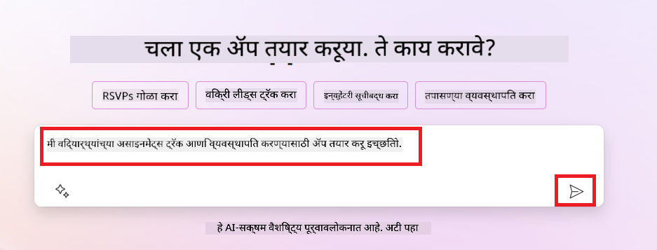
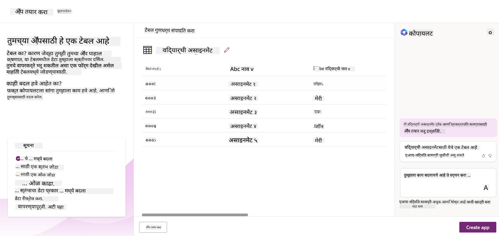
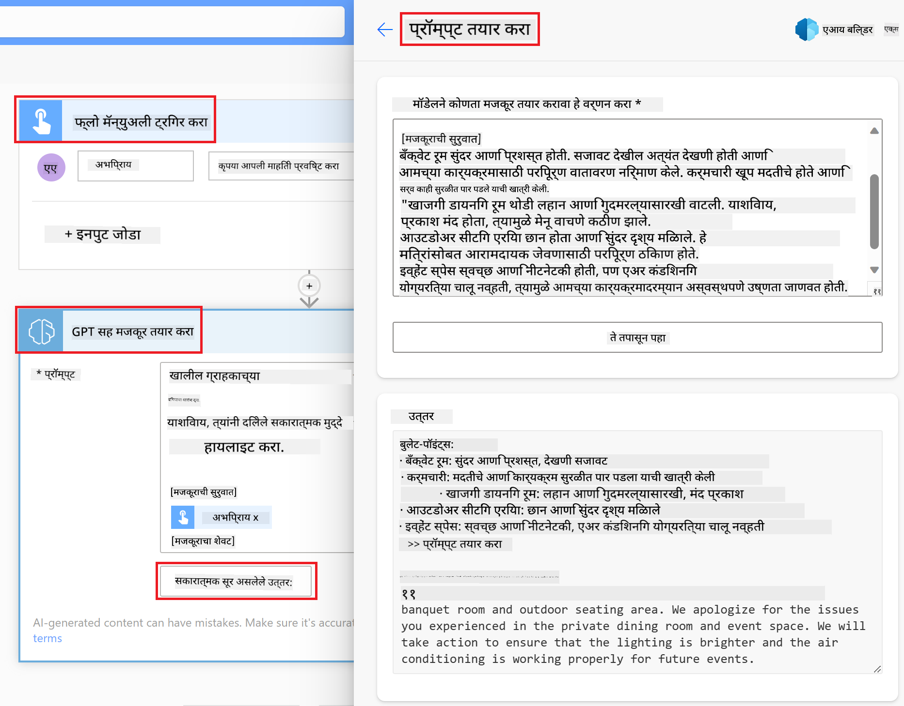

<!--
CO_OP_TRANSLATOR_METADATA:
{
  "original_hash": "f5ff3b6204a695a117d6f452403c95f7",
  "translation_date": "2025-07-09T13:51:06+00:00",
  "source_file": "10-building-low-code-ai-applications/README.md",
  "language_code": "mr"
}
-->
# लो कोड AI अनुप्रयोग तयार करणे

> _(वरील प्रतिमा क्लिक करून या धड्याचा व्हिडिओ पाहा)_

## परिचय

आता आपण प्रतिमा तयार करणारे अनुप्रयोग कसे तयार करायचे ते शिकलो आहोत, तर चला लो कोड बद्दल बोलूया. जनरेटिव्ह AI विविध क्षेत्रांमध्ये वापरला जाऊ शकतो ज्यात लो कोड देखील समाविष्ट आहे, पण लो कोड म्हणजे काय आणि त्यात AI कसा जोडता येईल?

परंपरागत विकासक आणि नॉन-डेव्हलपर्ससाठी लो कोड डेव्हलपमेंट प्लॅटफॉर्मचा वापर करून अॅप्स आणि सोल्यूशन्स तयार करणे सोपे झाले आहे. लो कोड डेव्हलपमेंट प्लॅटफॉर्म तुम्हाला कमी किंवा अगदी कोड न वापरता अॅप्स आणि सोल्यूशन्स तयार करण्याची परवानगी देतो. हे एक व्हिज्युअल डेव्हलपमेंट वातावरण प्रदान करून साध्य होते जेथे तुम्ही घटक ड्रॅग आणि ड्रॉप करून अॅप्स तयार करू शकता. यामुळे तुम्हाला कमी वेळात आणि कमी संसाधनांमध्ये अॅप्स तयार करता येतात. या धड्यात आपण लो कोड कसा वापरायचा आणि Power Platform वापरून AI सह लो कोड डेव्हलपमेंट कसे सुधारायचे याचा सखोल अभ्यास करू.

Power Platform संस्थांना त्यांच्या टीमला सहज समजणाऱ्या लो-कोड किंवा नो-कोड वातावरणाद्वारे स्वतःचे सोल्यूशन्स तयार करण्याची संधी देते. हे वातावरण सोल्यूशन्स तयार करण्याची प्रक्रिया सुलभ करते. Power Platform वापरून सोल्यूशन्स काही दिवसांत किंवा आठवड्यांत तयार होऊ शकतात, महिने किंवा वर्षे नव्हे. Power Platform मध्ये पाच मुख्य उत्पादने आहेत: Power Apps, Power Automate, Power BI, Power Pages आणि Copilot Studio.

या धड्यात समाविष्ट आहे:

- Power Platform मधील जनरेटिव्ह AI ची ओळख
- Copilot ची ओळख आणि त्याचा वापर कसा करायचा
- Power Platform मध्ये अॅप्स आणि फ्लोज तयार करण्यासाठी जनरेटिव्ह AI चा वापर
- AI Builder सह Power Platform मधील AI मॉडेल्स समजून घेणे

## शिकण्याचे उद्दिष्ट

या धड्याच्या शेवटी, तुम्ही खालील गोष्टी करू शकाल:

- Power Platform मध्ये Copilot कसा कार्य करतो हे समजून घेणे.

- आपल्या शिक्षण स्टार्टअपसाठी Student Assignment Tracker अॅप तयार करणे.

- AI वापरून इनव्हॉइसमधून माहिती काढण्यासाठी Invoice Processing Flow तयार करणे.

- Create Text with GPT AI Model वापरताना सर्वोत्तम पद्धती लागू करणे.

या धड्यात तुम्ही वापरणार असलेली साधने आणि तंत्रज्ञान:

- **Power Apps**, Student Assignment Tracker अॅपसाठी, जे डेटा ट्रॅक, व्यवस्थापित आणि संवाद साधण्यासाठी लो-कोड डेव्हलपमेंट वातावरण प्रदान करते.

- **Dataverse**, Student Assignment Tracker अॅपसाठी डेटा साठवण्यासाठी, जे अॅपचा डेटा साठवण्यासाठी लो-कोड डेटा प्लॅटफॉर्म आहे.

- **Power Automate**, Invoice Processing फ्लो साठी, जे इनव्हॉइस प्रक्रिया स्वयंचलित करण्यासाठी वर्कफ्लोज तयार करण्यासाठी लो-कोड डेव्हलपमेंट वातावरण देते.

- **AI Builder**, Invoice Processing AI मॉडेलसाठी, जे पूर्वनिर्मित AI मॉडेल्स वापरून इनव्हॉइस प्रक्रिया करण्यास मदत करते.

## Power Platform मधील जनरेटिव्ह AI

जनरेटिव्ह AI सह लो-कोड डेव्हलपमेंट आणि अनुप्रयोग सुधारणा हा Power Platform चा मुख्य लक्ष केंद्रित क्षेत्र आहे. उद्दिष्ट आहे की प्रत्येकजण AI-शक्तीने चालणारे अॅप्स, साइट्स, डॅशबोर्ड्स तयार करू शकेल आणि AI सह प्रक्रिया स्वयंचलित करू शकेल, _कोणत्याही डेटा सायन्स तज्ज्ञतेशिवाय_. हे उद्दिष्ट Power Platform मधील लो-कोड डेव्हलपमेंट अनुभवात Copilot आणि AI Builder चा समावेश करून साध्य केले जाते.

### हे कसे कार्य करते?

Copilot हा एक AI सहाय्यक आहे जो तुम्हाला नैसर्गिक भाषेत संवादात्मक पायऱ्यांमध्ये तुमच्या गरजा सांगून Power Platform सोल्यूशन्स तयार करण्यास मदत करतो. उदाहरणार्थ, तुम्ही AI सहाय्यकाला सांगू शकता की तुमच्या अॅपमध्ये कोणती फील्ड्स असतील आणि तो अॅप तसेच त्याचा डेटा मॉडेल तयार करेल किंवा Power Automate मध्ये फ्लो कसा सेट करायचा हे सांगू शकता.

तुम्ही Copilot-चालित फंक्शन्स तुमच्या अॅप स्क्रीनमध्ये वैशिष्ट्य म्हणून वापरू शकता ज्यामुळे वापरकर्ते संवादात्मक संवादाद्वारे अंतर्दृष्टी मिळवू शकतात.

AI Builder हा Power Platform मधील लो-कोड AI क्षमता आहे जो तुम्हाला AI मॉडेल्स वापरून प्रक्रिया स्वयंचलित करण्यास आणि परिणाम भाकीत करण्यास मदत करतो. AI Builder सह तुम्ही तुमच्या Dataverse मधील किंवा SharePoint, OneDrive, Azure सारख्या विविध क्लाउड डेटा स्रोतांशी जोडलेल्या अॅप्स आणि फ्लोजमध्ये AI आणू शकता.

Copilot Power Platform च्या सर्व उत्पादनांमध्ये उपलब्ध आहे: Power Apps, Power Automate, Power BI, Power Pages आणि Power Virtual Agents. AI Builder Power Apps आणि Power Automate मध्ये उपलब्ध आहे. या धड्यात आपण Power Apps आणि Power Automate मध्ये Copilot आणि AI Builder कसा वापरायचा यावर लक्ष केंद्रित करू.

### Power Apps मधील Copilot

Power Platform चा भाग म्हणून, Power Apps डेटा ट्रॅक, व्यवस्थापित आणि संवाद साधण्यासाठी लो-कोड डेव्हलपमेंट वातावरण प्रदान करते. हे अॅप डेव्हलपमेंट सेवा संच आहे ज्यामध्ये स्केलेबल डेटा प्लॅटफॉर्म आणि क्लाउड सेवा तसेच ऑन-प्रिमायसेस डेटाशी कनेक्ट होण्याची क्षमता आहे. Power Apps तुम्हाला ब्राउझर, टॅबलेट आणि फोनवर चालणारे अॅप्स तयार करण्याची आणि सहकाऱ्यांसोबत शेअर करण्याची परवानगी देते. Power Apps सोप्या इंटरफेससह वापरकर्त्यांना अॅप डेव्हलपमेंटमध्ये सहज प्रवेश देते, ज्यामुळे प्रत्येक व्यवसाय वापरकर्ता किंवा व्यावसायिक विकासक सानुकूल अॅप्स तयार करू शकतो. जनरेटिव्ह AI सह Copilot मुळे अॅप डेव्हलपमेंट अनुभव अधिक सुधारित होतो.

Power Apps मधील Copilot AI सहाय्यक वैशिष्ट्य तुम्हाला सांगण्याची परवानगी देते की तुम्हाला कसा अॅप हवा आहे आणि तुमचा अॅप कोणती माहिती ट्रॅक, गोळा किंवा दाखवेल. त्यानंतर Copilot तुमच्या वर्णनावर आधारित प्रतिसादक्षम Canvas अॅप तयार करतो. तुम्ही नंतर तुमच्या गरजेनुसार अॅप सानुकूल करू शकता. AI Copilot Dataverse टेबल देखील तयार करतो ज्यात तुम्हाला ट्रॅक करायची माहिती साठवण्यासाठी आवश्यक फील्ड्स आणि काही नमुना डेटा असतो. या धड्यात आपण Dataverse काय आहे आणि Power Apps मध्ये त्याचा कसा वापर करायचा हे पाहणार आहोत. तुम्ही नंतर AI Copilot सहाय्यक वैशिष्ट्याद्वारे संवादात्मक पायऱ्यांमध्ये टेबल सानुकूल करू शकता. हे वैशिष्ट्य Power Apps च्या होम स्क्रीनवर सहज उपलब्ध आहे.

### Power Automate मधील Copilot

Power Platform चा भाग म्हणून, Power Automate वापरकर्त्यांना अनुप्रयोग आणि सेवांमधील स्वयंचलित वर्कफ्लोज तयार करण्याची परवानगी देते. हे संवाद, डेटा संकलन आणि निर्णय मंजुरीसारख्या पुनरावृत्ती होणाऱ्या व्यवसाय प्रक्रियांचे स्वयंचलीत करण्यास मदत करते. त्याचा सोपा इंटरफेस प्रत्येक तांत्रिक कौशल्य असलेल्या वापरकर्त्यांना (नवशिक्या ते अनुभवी विकासक) कामे स्वयंचलित करण्यास अनुमती देतो. जनरेटिव्ह AI सह Copilot मुळे वर्कफ्लो डेव्हलपमेंट अनुभव अधिक सुधारित होतो.

Power Automate मधील Copilot AI सहाय्यक वैशिष्ट्य तुम्हाला सांगण्याची परवानगी देते की तुम्हाला कसा फ्लो हवा आहे आणि तुमचा फ्लो कोणती क्रिया करेल. त्यानंतर Copilot तुमच्या वर्णनावर आधारित फ्लो तयार करतो. तुम्ही नंतर तुमच्या गरजेनुसार फ्लो सानुकूल करू शकता. AI Copilot तुम्हाला आवश्यक क्रिया देखील सुचवतो ज्यामुळे तुम्ही स्वयंचलित करू इच्छित असलेले कार्य पूर्ण होईल. या धड्यात आपण फ्लोज काय आहेत आणि Power Automate मध्ये त्यांचा कसा वापर करायचा हे पाहणार आहोत. तुम्ही नंतर AI Copilot सहाय्यक वैशिष्ट्याद्वारे संवादात्मक पायऱ्यांमध्ये क्रिया सानुकूल करू शकता. हे वैशिष्ट्य Power Automate च्या होम स्क्रीनवर सहज उपलब्ध आहे.

## असाइनमेंट: Copilot वापरून आमच्या स्टार्टअपसाठी विद्यार्थी असाइनमेंट आणि इनव्हॉइस व्यवस्थापित करा

आमचा स्टार्टअप विद्यार्थ्यांना ऑनलाइन कोर्सेस प्रदान करतो. स्टार्टअपने वेगाने वाढ केली आहे आणि आता त्यांच्या कोर्सेसची मागणी पूर्ण करण्यात अडचण येत आहे. त्यांनी तुम्हाला Power Platform डेव्हलपर म्हणून नियुक्त केले आहे जेणेकरून तुम्ही त्यांना विद्यार्थी असाइनमेंट्स आणि इनव्हॉइस व्यवस्थापित करण्यासाठी लो कोड सोल्यूशन तयार करण्यात मदत करू शकाल. त्यांचे सोल्यूशन विद्यार्थ्यांच्या असाइनमेंट्स ट्रॅक आणि व्यवस्थापित करण्यासाठी अॅप आणि इनव्हॉइस प्रक्रिया स्वयंचलित करण्यासाठी वर्कफ्लो तयार करू शकेल. तुम्हाला जनरेटिव्ह AI वापरून सोल्यूशन विकसित करण्यास सांगितले आहे.

Copilot वापरायला सुरुवात करताना, तुम्ही [Power Platform Copilot Prompt Library](https://github.com/pnp/powerplatform-prompts?WT.mc_id=academic-109639-somelezediko) वापरू शकता. या लायब्ररीमध्ये Copilot सह अॅप्स आणि फ्लोज तयार करण्यासाठी वापरता येणाऱ्या प्रॉम्प्ट्सची यादी आहे. तुम्ही या लायब्ररीतील प्रॉम्प्ट्स वापरून तुमच्या गरजा Copilot कडे कशा सांगायच्या याचा अंदाज घेऊ शकता.

### आमच्या स्टार्टअपसाठी Student Assignment Tracker अॅप तयार करा

आमच्या स्टार्टअपमधील शिक्षकांना विद्यार्थी असाइनमेंट्स ट्रॅक करण्यात अडचण येत आहे. ते असाइनमेंट्स ट्रॅक करण्यासाठी स्प्रेडशीट वापरत होते, पण विद्यार्थ्यांची संख्या वाढल्यामुळे ते व्यवस्थापित करणे कठीण झाले आहे. त्यांनी तुम्हाला असाइनमेंट्स ट्रॅक आणि व्यवस्थापित करण्यासाठी अॅप तयार करण्यास सांगितले आहे. अॅपमध्ये नवीन असाइनमेंट्स जोडता येतील, असाइनमेंट्स पाहता येतील, अपडेट करता येतील आणि डिलीट करता येतील. तसेच शिक्षक आणि विद्यार्थी ग्रेड केलेले आणि न केलेले असाइनमेंट्स पाहू शकतील.

तुम्ही खालील पायऱ्या वापरून Power Apps मधील Copilot वापरून अॅप तयार कराल:

1. [Power Apps](https://make.powerapps.com?WT.mc_id=academic-105485-koreyst) च्या होम स्क्रीनवर जा.

2. होम स्क्रीनवरील टेक्स्ट एरिया वापरून तुम्हाला हवा असलेला अॅप वर्णन करा. उदाहरणार्थ, **_मला विद्यार्थी असाइनमेंट्स ट्रॅक आणि व्यवस्थापित करण्यासाठी अॅप तयार करायचा आहे_**. AI Copilot कडे प्रॉम्प्ट पाठवण्यासाठी **Send** बटणावर क्लिक करा.

3. AI Copilot तुम्हाला Dataverse टेबल सुचवेल ज्यात तुम्हाला ट्रॅक करायची माहिती साठवण्यासाठी आवश्यक फील्ड्स आणि काही नमुना डेटा असेल. तुम्ही नंतर AI Copilot सहाय्यक वैशिष्ट्याद्वारे संवादात्मक पायऱ्यांमध्ये टेबल सानुकूल करू शकता.

   > **महत्त्वाचे**: Dataverse हा Power Platform साठीचा अंतर्निहित डेटा प्लॅटफॉर्म आहे. हा अॅपचा डेटा साठवण्यासाठी लो-कोड डेटा प्लॅटफॉर्म आहे. हा पूर्णपणे व्यवस्थापित सेवा आहे जो Microsoft Cloud मध्ये सुरक्षितपणे डेटा साठवतो आणि तुमच्या Power Platform वातावरणात प्रोव्हिजन केला जातो. यात डेटा वर्गीकरण, डेटा लाइनिएज, सूक्ष्म प्रवेश नियंत्रण आणि बरेच काही यांसारख्या अंतर्निहित डेटा गव्हर्नन्स क्षमता आहेत. Dataverse बद्दल अधिक जाणून घेण्यासाठी [इथे](https://docs.microsoft.com/powerapps/maker/data-platform/data-platform-intro?WT.mc_id=academic-109639-somelezediko) पहा.

   

4. शिक्षकांना त्यांच्या असाइनमेंट्स सबमिट केलेल्या विद्यार्थ्यांना ईमेल पाठवायच्या आहेत ज्यामुळे ते असाइनमेंट्सच्या प्रगतीबद्दल अपडेट राहतील. तुम्ही Copilot वापरून टेबलमध्ये नवीन फील्ड जोडू शकता ज्यात विद्यार्थी ईमेल साठवता येईल. उदाहरणार्थ, तुम्ही खालील प्रॉम्प्ट वापरू शकता: **_मला विद्यार्थी ईमेल साठवण्यासाठी कॉलम जोडायचा आहे_**. AI Copilot कडे प्रॉम्प्ट पाठवण्यासाठी **Send** बटणावर क्लिक करा.

5. AI Copilot नवीन फील्ड तयार करेल आणि तुम्ही नंतर तुमच्या गरजेनुसार फील्ड सानुकूल करू शकता.

6. टेबल तयार झाल्यावर, अॅप तयार करण्यासाठी **Create app** बटणावर क्लिक करा.

7. AI Copilot तुमच्या वर्णनावर आधारित प्रतिसादक्षम Canvas अॅप तयार करेल. तुम्ही नंतर अॅप सानुकूल करू शकता.

8. शिक्षकांना विद्यार्थ्यांना ईमेल पाठवण्यासाठी, तुम्ही Copilot वापरून अॅपमध्ये नवीन स्क्रीन जोडू शकता. उदाहरणार्थ, तुम्ही खालील प्रॉम्प्ट वापरू शकता: **_मला विद्यार्थ्यांना ईमेल पाठवण्यासाठी स्क्रीन जोडायची आहे_**. AI Copilot कडे प्रॉम्प्ट पाठवण्यासाठी **Send** बटणावर क्लिक करा.

9. AI Copilot नवीन स्क्रीन तयार करेल आणि तुम्ही नंतर स्क्रीन सानुकूल करू शकता.

10. अॅप तयार झाल्यावर, **Save** बटणावर क्लिक करून अॅप जतन करा.

11. शिक्षकांसोबत अॅप शेअर करण्यासाठी, **Share** बटणावर क्लिक करा आणि पुन्हा **Share** वर क्लिक करा. तुम्ही शिक्षकांचे ईमेल पत्ते टाकून अॅप शेअर करू शकता.

> **तुमचे गृहपाठ**: तुम्ही तयार केलेला अॅप चांगला प्रारंभ आहे पण सुधारणा करता येईल. ईमेल फिचरमुळे शिक्षक फक्त विद्यार्थ्यांना मॅन्युअली ईमेल पाठवू शकतात कारण त्यांना ईमेल टाइप करावे लागतात. तुम्ही Copilot वापरून अशी ऑटोमेशन तयार करू शकता ज्यामुळे शिक्षकांना विद्यार्थी असाइनमेंट सबमिट केल्यावर ईमेल आपोआप पाठवता येईल? यासाठी योग्य प्रॉम्प्ट वापरून तुम्ही Power Automate मध्ये Copilot वापरू शकता.

### आमच्या स्टार्टअपसाठी इनव्हॉइस माहिती टेबल तयार करा

आमच्या स्टार्टअपच्या वित्त विभागाला इनव्हॉइस ट्रॅक करण्यात अडचण येत आहे. ते इनव्हॉइस ट्रॅक करण्यासाठी स्प्रेडशीट वापरत होते, पण इनव्हॉइसची संख्या वाढल्यामुळे ते व्यवस्थापित करणे कठीण झाले आहे. त्यांनी तुम्हाला अशी टेबल तयार करण्यास सांगितले आहे ज्यात त्यांनी मिळालेल्या इनव्हॉइसची माहिती साठवता, ट्रॅक आणि व्यवस्थापित करता येईल. ही टेबल अशी ऑटोमेशन तयार करण्यासाठी वापरली जाईल जी सर्व इनव्हॉइस माहिती काढून टेबलमध्ये साठवेल. टेबल वित्त विभागाला भरलेले आणि न भरलेले इनव्हॉइस पाहण्याची परवानगी देखील देईल.

Power Platform मध्ये Dataverse नावाचा अंतर्निहित डेटा प्लॅटफॉर्म आहे जो तुमच्या अॅप्स आणि सोल्यूशन्ससाठी डेटा साठवण्याची परवानगी देतो. Dataverse हा अॅपचा डेटा साठवण्यासाठी लो-कोड डेटा प्लॅटफॉर्म आहे. हा पूर्णपणे व्यवस्थापित सेवा आहे जो Microsoft Cloud मध्ये सुरक्षितपणे डेटा साठवतो आणि तुमच्या Power Platform वातावरणात प्रोव्हिजन केला जातो. यात डेटा वर्गीकरण, डेटा लाइनिएज, सूक्ष्म प्रवेश नियंत्रण आणि बरेच काही यांसारख्या अंतर्निहित डेटा गव्हर्नन्स क्षमता आहेत. Dataverse बद्दल अधिक जाणून घेण्यासाठी [इथे](https://docs.microsoft.com/powerapps/maker/data-platform/data-platform-intro?WT.mc_id=academic-109639-somelezediko) पहा.

आमच्या स्टार्टअपसाठी Dataverse का वापरावे?
- **सोपं व्यवस्थापन**: मेटाडेटा आणि डेटा दोन्ही क्लाउडमध्ये साठवले जातात, त्यामुळे तुम्हाला त्यांचा साठवण आणि व्यवस्थापन कसे होते याची काळजी करण्याची गरज नाही. तुम्ही तुमच्या अॅप्स आणि सोल्यूशन्स तयार करण्यावर लक्ष केंद्रित करू शकता.

- **सुरक्षित**: Dataverse तुमच्या डेटासाठी सुरक्षित आणि क्लाउड-आधारित साठवण पर्याय प्रदान करतो. तुम्ही तुमच्या टेबलमधील डेटावर कोणाला प्रवेश आहे आणि ते कसे प्रवेश करू शकतात हे भूमिका-आधारित सुरक्षा वापरून नियंत्रित करू शकता.

- **समृद्ध मेटाडेटा**: डेटा प्रकार आणि संबंध Power Apps मध्ये थेट वापरले जातात.

- **तर्क आणि प्रमाणीकरण**: तुम्ही व्यवसाय नियम, गणिती फील्ड्स आणि प्रमाणीकरण नियम वापरून व्यवसाय तर्क लागू करू शकता आणि डेटाची अचूकता राखू शकता.

आता तुम्हाला Dataverse काय आहे आणि का वापरायचा हे माहित आहे, तर पाहूया की आपण Copilot वापरून Dataverse मध्ये टेबल कसे तयार करू शकतो जे आमच्या वित्त टीमच्या गरजा पूर्ण करेल.

> **Note** : पुढील विभागात तुम्ही हा टेबल वापरून एक ऑटोमेशन तयार कराल जे सर्व इनव्हॉइस माहिती काढून टेबलमध्ये साठवेल.

Copilot वापरून Dataverse मध्ये टेबल तयार करण्यासाठी खालील पायऱ्या फॉलो करा:

1. [Power Apps](https://make.powerapps.com?WT.mc_id=academic-105485-koreyst) होम स्क्रीनवर जा.

2. डाव्या नेव्हिगेशन बारमध्ये **Tables** निवडा आणि नंतर **Describe the new Table** वर क्लिक करा.

3. **Describe the new Table** स्क्रीनवर, तुम्हाला तयार करायचा टेबल वर्णन करण्यासाठी टेक्स्ट एरिया वापरा. उदाहरणार्थ, **_मला इनव्हॉइस माहिती साठवण्यासाठी टेबल तयार करायचा आहे_**. AI Copilot कडे प्रॉम्प्ट पाठवण्यासाठी **Send** बटणावर क्लिक करा.

4. AI Copilot तुम्हाला Dataverse टेबल सुचवेल ज्यात तुम्हाला ट्रॅक करायची माहिती साठवण्यासाठी आवश्यक फील्ड्स आणि काही नमुना डेटा असेल. तुम्ही नंतर AI Copilot सहाय्यकाच्या संवादात्मक पायऱ्यांद्वारे टेबल तुमच्या गरजेनुसार सानुकूलित करू शकता.

5. वित्त टीम पुरवठादाराला त्यांच्या इनव्हॉइसच्या वर्तमान स्थितीची माहिती देण्यासाठी ईमेल पाठवू इच्छिते. तुम्ही Copilot वापरून टेबलमध्ये पुरवठादाराचा ईमेल साठवण्यासाठी नवीन फील्ड जोडू शकता. उदाहरणार्थ, तुम्ही खालील प्रॉम्प्ट वापरू शकता: **_मला पुरवठादार ईमेल साठवण्यासाठी कॉलम जोडायचा आहे_**. AI Copilot कडे प्रॉम्प्ट पाठवण्यासाठी **Send** बटणावर क्लिक करा.

6. AI Copilot नवीन फील्ड तयार करेल आणि तुम्ही नंतर ते फील्ड तुमच्या गरजेनुसार सानुकूलित करू शकता.

7. टेबल तयार झाल्यावर, **Create** बटणावर क्लिक करून टेबल तयार करा.

## Power Platform मधील AI मॉडेल्स AI Builder सह

AI Builder हा Power Platform मध्ये उपलब्ध असलेला लो-कोड AI क्षमता आहे जो तुम्हाला AI मॉडेल्स वापरून प्रक्रिया स्वयंचलित करण्यास आणि परिणामांची भाकीत करण्यास मदत करतो. AI Builder वापरून तुम्ही Dataverse किंवा SharePoint, OneDrive, Azure सारख्या विविध क्लाउड डेटा स्रोतांशी जोडलेल्या अॅप्स आणि फ्लोजमध्ये AI आणू शकता.

## Prebuilt AI Models आणि Custom AI Models

AI Builder दोन प्रकारचे AI मॉडेल्स प्रदान करतो: Prebuilt AI Models आणि Custom AI Models. Prebuilt AI Models हे Microsoft द्वारे प्रशिक्षित आणि Power Platform मध्ये उपलब्ध असलेले तयार वापरासाठी AI मॉडेल्स आहेत. हे तुम्हाला डेटा गोळा न करता, स्वतःचे मॉडेल तयार, प्रशिक्षित आणि प्रकाशित न करता तुमच्या अॅप्स आणि फ्लोजमध्ये बुद्धिमत्ता जोडण्यास मदत करतात. तुम्ही या मॉडेल्सचा वापर प्रक्रिया स्वयंचलित करण्यासाठी आणि परिणाम भाकीत करण्यासाठी करू शकता.

Power Platform मध्ये उपलब्ध काही Prebuilt AI Models मध्ये समाविष्ट आहेत:

- **Key Phrase Extraction**: हा मॉडेल मजकूरातून मुख्य वाक्प्रचार काढतो.
- **Language Detection**: हा मॉडेल मजकूराची भाषा ओळखतो.
- **Sentiment Analysis**: हा मॉडेल मजकूरातील सकारात्मक, नकारात्मक, तटस्थ किंवा मिश्र भावना ओळखतो.
- **Business Card Reader**: हा मॉडेल व्यवसाय कार्डमधील माहिती काढतो.
- **Text Recognition**: हा मॉडेल प्रतिमांमधून मजकूर काढतो.
- **Object Detection**: हा मॉडेल प्रतिमांमधून वस्तू ओळखतो आणि काढतो.
- **Document processing**: हा मॉडेल फॉर्ममधून माहिती काढतो.
- **Invoice Processing**: हा मॉडेल इनव्हॉइसमधून माहिती काढतो.

Custom AI Models वापरून तुम्ही तुमचा स्वतःचा मॉडेल AI Builder मध्ये आणू शकता ज्यामुळे तो AI Builder च्या कोणत्याही कस्टम मॉडेलसारखा कार्य करू शकतो, आणि तुम्ही तुमच्या स्वतःच्या डेटाचा वापर करून मॉडेल प्रशिक्षित करू शकता. तुम्ही हे मॉडेल्स Power Apps आणि Power Automate मध्ये प्रक्रिया स्वयंचलित करण्यासाठी आणि परिणाम भाकीत करण्यासाठी वापरू शकता. स्वतःचा मॉडेल वापरताना काही मर्यादा लागू होतात. या मर्यादांबद्दल अधिक वाचा [limitations](https://learn.microsoft.com/ai-builder/byo-model#limitations?WT.mc_id=academic-105485-koreyst).

## असाइनमेंट #2 - आमच्या स्टार्टअपसाठी इनव्हॉइस प्रक्रिया फ्लो तयार करा

वित्त टीमला इनव्हॉइस प्रक्रिया करण्यात अडचण येत आहे. ते इनव्हॉइस ट्रॅक करण्यासाठी स्प्रेडशीट वापरत होते पण इनव्हॉइसची संख्या वाढल्यामुळे ते व्यवस्थापित करणे कठीण झाले आहे. त्यांनी तुम्हाला एक वर्कफ्लो तयार करण्यास सांगितले आहे जो AI वापरून इनव्हॉइस प्रक्रिया करण्यात मदत करेल. वर्कफ्लो इनव्हॉइसमधून माहिती काढेल आणि ती Dataverse टेबलमध्ये साठवेल. तसेच, वर्कफ्लो वित्त टीमला काढलेली माहिती असलेला ईमेल पाठवण्यास सक्षम करेल.

आता तुम्हाला AI Builder काय आहे आणि का वापरायचा हे माहित आहे, तर पाहूया की आपण AI Builder मधील Invoice Processing AI Model वापरून वित्त टीमसाठी इनव्हॉइस प्रक्रिया कशी तयार करू शकतो.

AI Builder मधील Invoice Processing AI Model वापरून वित्त टीमसाठी इनव्हॉइस प्रक्रिया वर्कफ्लो तयार करण्यासाठी खालील पायऱ्या फॉलो करा:

1. [Power Automate](https://make.powerautomate.com?WT.mc_id=academic-105485-koreyst) होम स्क्रीनवर जा.

2. होम स्क्रीनवरील टेक्स्ट एरिया वापरून तुम्हाला तयार करायचा वर्कफ्लो वर्णन करा. उदाहरणार्थ, **_माझ्या मेलबॉक्समध्ये इनव्हॉइस आल्यावर प्रक्रिया करा_**. AI Copilot कडे प्रॉम्प्ट पाठवण्यासाठी **Send** बटणावर क्लिक करा.

   

3. AI Copilot तुम्हाला आवश्यक क्रिया सुचवेल ज्यामुळे तुम्ही स्वयंचलित करायचे काम पूर्ण करू शकता. पुढील पायऱ्यांसाठी **Next** बटणावर क्लिक करा.

4. पुढील पायरीवर, Power Automate तुम्हाला फ्लो साठी आवश्यक कनेक्शन्स सेटअप करण्यास सांगेल. पूर्ण झाल्यावर, फ्लो तयार करण्यासाठी **Create flow** बटणावर क्लिक करा.

5. AI Copilot फ्लो तयार करेल आणि तुम्ही नंतर फ्लो तुमच्या गरजेनुसार सानुकूलित करू शकता.

6. फ्लोचा ट्रिगर अपडेट करा आणि **Folder** सेट करा जिथे इनव्हॉइस साठवले जातील. उदाहरणार्थ, **Inbox** सेट करा. **Show advanced options** क्लिक करा आणि **Only with Attachments** ला **Yes** करा. यामुळे फक्त अटॅचमेंट असलेले ईमेल आले तेव्हा फ्लो चालेल.

7. खालील क्रिया फ्लोमधून काढा: **HTML to text**, **Compose**, **Compose 2**, **Compose 3**, आणि **Compose 4** कारण तुम्ही त्यांचा वापर करणार नाही.

8. फ्लोमधून **Condition** क्रिया काढा कारण तुम्ही ती वापरणार नाही. फ्लो खालीलप्रमाणे दिसेल:

   

9. **Add an action** बटणावर क्लिक करा आणि **Dataverse** शोधा. **Add a new row** क्रिया निवडा.

10. **Extract Information from invoices** क्रियेत, **Invoice File** अपडेट करा जेणेकरून ते ईमेलमधील **Attachment Content** कडे निर्देशित करेल. यामुळे फ्लो इनव्हॉइस अटॅचमेंटमधून माहिती काढेल.

11. तुम्ही आधी तयार केलेला **Table** निवडा. उदाहरणार्थ, **Invoice Information** टेबल निवडा. मागील क्रियेतून डायनॅमिक कंटेंट वापरून खालील फील्ड्स भरा:

    - ID  
    - Amount  
    - Date  
    - Name  
    - Status - **Status** ला **Pending** सेट करा.  
    - Supplier Email - **When a new email arrives** ट्रिगरमधून **From** डायनॅमिक कंटेंट वापरा.

    

12. फ्लो पूर्ण झाल्यावर, **Save** बटणावर क्लिक करून फ्लो जतन करा. नंतर तुम्ही फ्लो टेस्ट करू शकता, ज्यासाठी तुम्ही इनव्हॉइस असलेला ईमेल ट्रिगरमध्ये दिलेल्या फोल्डरमध्ये पाठवू शकता.

> **तुमचे गृहपाठ**: तुम्ही नुकताच तयार केलेला फ्लो चांगला प्रारंभ आहे, आता तुम्हाला विचार करायचा आहे की तुम्ही कसे एक ऑटोमेशन तयार करू शकता जे आमच्या वित्त टीमला पुरवठादाराला ईमेल पाठवून त्यांच्या इनव्हॉइसच्या वर्तमान स्थितीची माहिती देण्यास सक्षम करेल. तुमचा संकेत: फ्लो इनव्हॉइसच्या स्थिती बदलल्यावर चालला पाहिजे.

## Power Automate मध्ये Text Generation AI Model वापरा

AI Builder मधील Create Text with GPT AI Model तुम्हाला प्रॉम्प्टवर आधारित मजकूर तयार करण्याची क्षमता देते आणि हे Microsoft Azure OpenAI Service द्वारे समर्थित आहे. या क्षमतेसह, तुम्ही GPT (Generative Pre-Trained Transformer) तंत्रज्ञान तुमच्या अॅप्स आणि फ्लोजमध्ये समाविष्ट करू शकता ज्यामुळे विविध स्वयंचलित फ्लोज आणि उपयुक्त अॅप्लिकेशन्स तयार करता येतात.

GPT मॉडेल्स मोठ्या प्रमाणात डेटावर प्रशिक्षण घेतात, ज्यामुळे ते दिलेल्या प्रॉम्प्टवर मानवी भाषेसारखा मजकूर तयार करू शकतात. वर्कफ्लो ऑटोमेशनसह एकत्रित केल्यावर, GPT सारखे AI मॉडेल्स विविध कामे सुलभ आणि स्वयंचलित करण्यासाठी वापरले जाऊ शकतात.

उदाहरणार्थ, तुम्ही फ्लोज तयार करू शकता जे ईमेल ड्राफ्ट, उत्पादन वर्णने आणि इतर अनेक वापरासाठी मजकूर स्वयंचलितपणे तयार करतात. तुम्ही हे मॉडेल चॅटबॉट्स आणि ग्राहक सेवा अॅप्ससाठी देखील वापरू शकता जे ग्राहकांच्या चौकशींना प्रभावी आणि कार्यक्षम प्रतिसाद देण्यास मदत करतात.

Power Automate मध्ये हा AI Model कसा वापरायचा ते शिकण्यासाठी, [Add intelligence with AI Builder and GPT](https://learn.microsoft.com/training/modules/ai-builder-text-generation/?WT.mc_id=academic-109639-somelezediko) मॉड्यूल पहा.

## छान काम! तुमचे शिक्षण सुरू ठेवा

हा धडा पूर्ण केल्यानंतर, आमच्या [Generative AI Learning collection](https://aka.ms/genai-collection?WT.mc_id=academic-105485-koreyst) मध्ये जाऊन तुमचे Generative AI ज्ञान अधिक वाढवा!

पुढील धडा 11 मध्ये चला जिथे आपण [Generative AI सह Function Calling कसे एकत्रित करायचे](../11-integrating-with-function-calling/README.md?WT.mc_id=academic-105485-koreyst) ते पाहणार आहोत!

**अस्वीकरण**:  
हा दस्तऐवज AI अनुवाद सेवा [Co-op Translator](https://github.com/Azure/co-op-translator) वापरून अनुवादित केला आहे. आम्ही अचूकतेसाठी प्रयत्नशील असलो तरी, कृपया लक्षात घ्या की स्वयंचलित अनुवादांमध्ये चुका किंवा अचूकतेची कमतरता असू शकते. मूळ दस्तऐवज त्याच्या स्थानिक भाषेत अधिकृत स्रोत मानला जावा. महत्त्वाच्या माहितीसाठी व्यावसायिक मानवी अनुवाद करण्याची शिफारस केली जाते. या अनुवादाच्या वापरामुळे उद्भवलेल्या कोणत्याही गैरसमजुती किंवा चुकीच्या अर्थलागी आम्ही जबाबदार नाही.