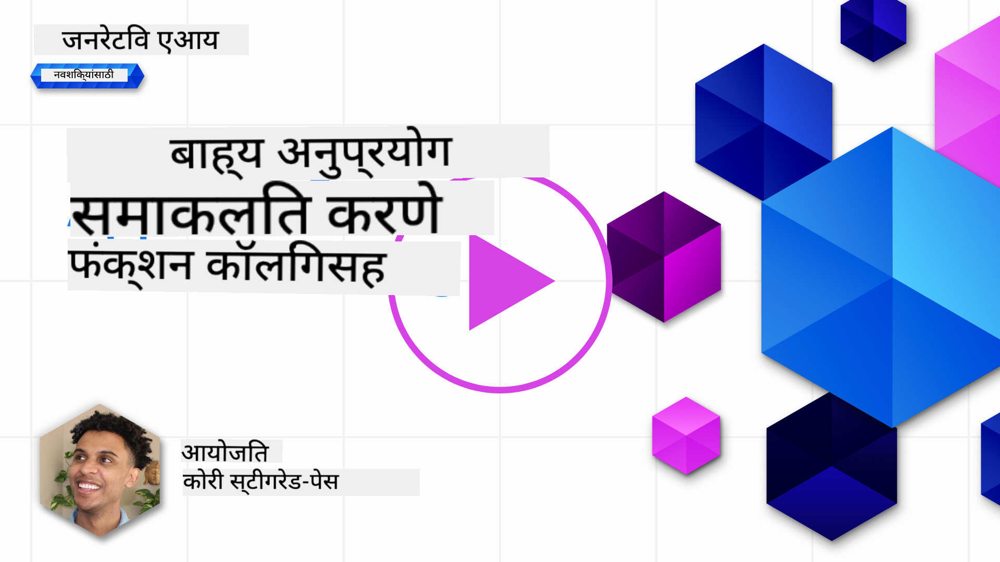
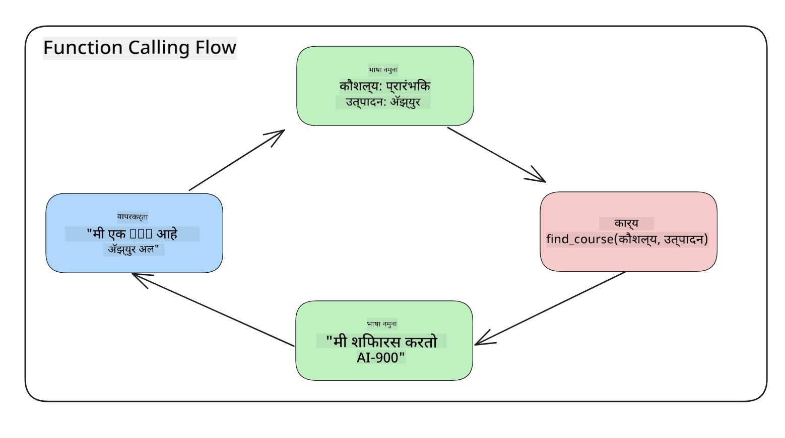
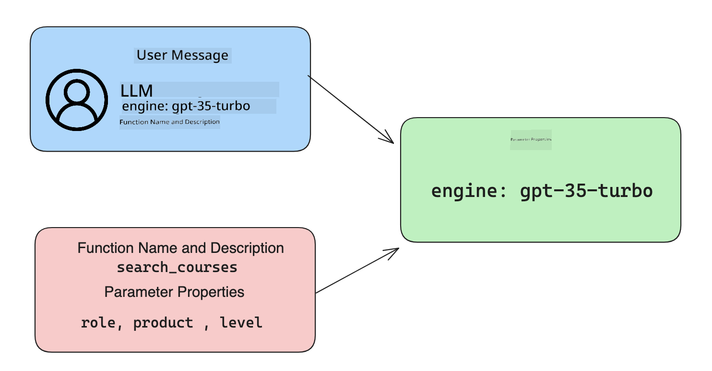

<!--
CO_OP_TRANSLATOR_METADATA:
{
  "original_hash": "77a48a201447be19aa7560706d6f93a0",
  "translation_date": "2025-05-19T21:25:00+00:00",
  "source_file": "11-integrating-with-function-calling/README.md",
  "language_code": "mr"
}
-->
# फंक्शन कॉलिंगसह एकत्रीकरण

[](https://aka.ms/gen-ai-lesson11-gh?WT.mc_id=academic-105485-koreyst)

आपण आतापर्यंतच्या धड्यांमध्ये बरेच काही शिकलात. तथापि, आपण आणखी सुधारणा करू शकतो. काही गोष्टी आपण हाताळू शकतो म्हणजे उत्तराच्या स्वरूपाला अधिक सुसंगत कसे बनवायचे जेणेकरून उत्तराशी काम करणे सोपे होईल. तसेच, आपला अनुप्रयोग अधिक समृद्ध करण्यासाठी आपण इतर स्त्रोतांमधून डेटा जोडू इच्छित असू शकतो.

वरील समस्यांचे निराकरण करण्यासाठी हा अध्याय आहे.

## परिचय

हा धडा कव्हर करेल:

- फंक्शन कॉलिंग म्हणजे काय आणि त्याचे उपयोग प्रकरणे स्पष्ट करा.
- Azure OpenAI वापरून फंक्शन कॉल तयार करणे.
- फंक्शन कॉल अनुप्रयोगात कसा एकत्रित करायचा.

## शिकण्याची उद्दिष्टे

या धड्याच्या शेवटी, आपण हे करू शकाल:

- फंक्शन कॉलिंगच्या वापराचा उद्देश स्पष्ट करा.
- Azure OpenAI सेवा वापरून फंक्शन कॉल सेटअप करा.
- आपल्या अनुप्रयोगाच्या उपयोग प्रकरणासाठी प्रभावी फंक्शन कॉल डिझाइन करा.

## परिस्थिती: फंक्शन्ससह आमच्या चॅटबॉटमध्ये सुधारणा करणे

या धड्यासाठी, आम्ही आमच्या शैक्षणिक स्टार्टअपसाठी एक वैशिष्ट्य तयार करू इच्छितो जे वापरकर्त्यांना तांत्रिक कोर्स शोधण्यासाठी चॅटबॉट वापरण्याची परवानगी देते. आम्ही त्यांच्या कौशल्य स्तर, वर्तमान भूमिका आणि तंत्रज्ञानाच्या आवडीशी जुळणारे कोर्स शिफारस करू.

ही परिस्थिती पूर्ण करण्यासाठी, आम्ही एकत्रितपणे वापरू:

- `Azure OpenAI` वापरकर्त्यासाठी चॅट अनुभव तयार करण्यासाठी.
- `Microsoft Learn Catalog API` वापरकर्त्याच्या विनंतीच्या आधारे कोर्स शोधण्यात वापरकर्त्यांना मदत करण्यासाठी.
- `Function Calling` वापरकर्त्याच्या चौकशीला घेऊन API विनंती करण्यासाठी फंक्शनला पाठवण्यासाठी.

सुरुवात करण्यासाठी, आपण पहिल्यांदा फंक्शन कॉलिंग का वापरायचे ते पाहूया:

## फंक्शन कॉलिंग का

फंक्शन कॉलिंगपूर्वी, LLM कडून मिळणारी उत्तरे असंरचित आणि विसंगत होती. विकसकांना प्रत्येक उत्तराच्या विविधतेला हाताळण्यासाठी जटिल पडताळणी कोड लिहावा लागला. वापरकर्ते "स्टॉकहोममधील वर्तमान हवामान काय आहे?" यासारखी उत्तरे मिळवू शकत नव्हते. कारण मॉडेल्स त्यांच्या डेटाच्या प्रशिक्षणाच्या वेळेपुरते मर्यादित होती.

फंक्शन कॉलिंग ही Azure OpenAI सेवेची एक वैशिष्ट्य आहे जी खालील मर्यादा ओलांडण्यासाठी आहे:

- **सुसंगत उत्तर स्वरूप**. आपण उत्तर स्वरूप अधिक चांगल्या प्रकारे नियंत्रित करू शकल्यास, आपण इतर प्रणालींमध्ये उत्तर एकत्रित करणे सोपे होईल.
- **बाह्य डेटा**. चॅट संदर्भात अनुप्रयोगाच्या इतर स्त्रोतांमधील डेटा वापरण्याची क्षमता.

## परिस्थितीद्वारे समस्येचे चित्रण करणे

> आपण समाविष्ट केलेल्या नोटबुकचा वापर करण्याची शिफारस करतो (./python/aoai-assignment.ipynb?WT.mc_id=academic-105485-koreyst) जर आपण खालील परिस्थिती चालवू इच्छित असाल. आपण फक्त वाचून देखील चालू ठेवू शकता कारण आम्ही एक समस्या स्पष्ट करण्याचा प्रयत्न करत आहोत जिथे फंक्शन्स समस्या सोडविण्यात मदत करू शकतात.

प्रतिक्रिया स्वरूप समस्येचे उदाहरण पाहूया:

मानूया की आम्हाला विद्यार्थ्यांच्या डेटाचा डेटाबेस तयार करायचा आहे जेणेकरून आम्ही त्यांना योग्य कोर्स सुचवू शकू. खाली आम्ही दोन विद्यार्थ्यांचे वर्णन केले आहे जे त्यांच्या डेटा मध्ये खूपच समान आहेत.

1. आमच्या Azure OpenAI संसाधनाशी कनेक्शन तयार करा:

   ```python
   import os
   import json
   from openai import AzureOpenAI
   from dotenv import load_dotenv
   load_dotenv()

   client = AzureOpenAI(
   api_key=os.environ['AZURE_OPENAI_API_KEY'],  # this is also the default, it can be omitted
   api_version = "2023-07-01-preview"
   )

   deployment=os.environ['AZURE_OPENAI_DEPLOYMENT']
   ```

   खाली Azure OpenAI शी कनेक्शन कॉन्फिगर करण्यासाठी काही Python कोड आहे जिथे आम्ही `api_type`, `api_base`, `api_version` and `api_key`.

1. Creating two student descriptions using variables `student_1_description` and `student_2_description` सेट करतो.

   ```python
   student_1_description="Emily Johnson is a sophomore majoring in computer science at Duke University. She has a 3.7 GPA. Emily is an active member of the university's Chess Club and Debate Team. She hopes to pursue a career in software engineering after graduating."

   student_2_description = "Michael Lee is a sophomore majoring in computer science at Stanford University. He has a 3.8 GPA. Michael is known for his programming skills and is an active member of the university's Robotics Club. He hopes to pursue a career in artificial intelligence after finishing his studies."
   ```

   आम्हाला वरील विद्यार्थ्यांचे वर्णन LLM ला पाठवायचे आहे जेणेकरून डेटा पार्स करता येईल. हा डेटा नंतर आमच्या अनुप्रयोगात वापरला जाऊ शकतो आणि API कडे पाठवला जाऊ शकतो किंवा डेटाबेसमध्ये संग्रहित केला जाऊ शकतो.

1. चला दोन समान प्रॉम्प्ट तयार करूया ज्यात आम्ही LLM ला ज्या माहितीमध्ये आम्हाला रस आहे ती माहिती देऊ:

   ```python
   prompt1 = f'''
   Please extract the following information from the given text and return it as a JSON object:

   name
   major
   school
   grades
   club

   This is the body of text to extract the information from:
   {student_1_description}
   '''

   prompt2 = f'''
   Please extract the following information from the given text and return it as a JSON object:

   name
   major
   school
   grades
   club

   This is the body of text to extract the information from:
   {student_2_description}
   '''
   ```

   वरील प्रॉम्प्ट LLM ला माहिती काढण्यासाठी आणि JSON स्वरूपात उत्तर परत करण्याचे निर्देश देतात.

1. प्रॉम्प्ट आणि Azure OpenAI शी कनेक्शन सेट केल्यानंतर, आम्ही आता `openai.ChatCompletion`. We store the prompt in the `messages` variable and assign the role to `user` वापरून LLM ला प्रॉम्प्ट पाठवू. हे वापरकर्त्याने चॅटबॉटला लिहिलेला संदेश अनुकरण करण्यासाठी आहे.

   ```python
   # response from prompt one
   openai_response1 = client.chat.completions.create(
   model=deployment,
   messages = [{'role': 'user', 'content': prompt1}]
   )
   openai_response1.choices[0].message.content

   # response from prompt two
   openai_response2 = client.chat.completions.create(
   model=deployment,
   messages = [{'role': 'user', 'content': prompt2}]
   )
   openai_response2.choices[0].message.content
   ```

आता आम्ही दोन्ही विनंत्या LLM ला पाठवू शकतो आणि `openai_response1['choices'][0]['message']['content']`.

1. Lastly, we can convert the response to JSON format by calling `json.loads` सारखे उत्तर मिळवून त्याचे परीक्षण करू शकतो:

   ```python
   # Loading the response as a JSON object
   json_response1 = json.loads(openai_response1.choices[0].message.content)
   json_response1
   ```

   प्रतिक्रिया 1:

   ```json
   {
     "name": "Emily Johnson",
     "major": "computer science",
     "school": "Duke University",
     "grades": "3.7",
     "club": "Chess Club"
   }
   ```

   प्रतिक्रिया 2:

   ```json
   {
     "name": "Michael Lee",
     "major": "computer science",
     "school": "Stanford University",
     "grades": "3.8 GPA",
     "club": "Robotics Club"
   }
   ```

   जरी प्रॉम्प्ट सारखेच आहेत आणि वर्णने समान आहेत, तरीही आम्हाला `Grades` property formatted differently, as we can sometimes get the format `3.7` or `3.7 GPA` for example.

   This result is because the LLM takes unstructured data in the form of the written prompt and returns also unstructured data. We need to have a structured format so that we know what to expect when storing or using this data

So how do we solve the formatting problem then? By using functional calling, we can make sure that we receive structured data back. When using function calling, the LLM does not actually call or run any functions. Instead, we create a structure for the LLM to follow for its responses. We then use those structured responses to know what function to run in our applications.



We can then take what is returned from the function and send this back to the LLM. The LLM will then respond using natural language to answer the user's query.

## Use Cases for using function calls

There are many different use cases where function calls can improve your app like:

- **Calling External Tools**. Chatbots are great at providing answers to questions from users. By using function calling, the chatbots can use messages from users to complete certain tasks. For example, a student can ask the chatbot to "Send an email to my instructor saying I need more assistance with this subject". This can make a function call to `send_email(to: string, body: string)`

- **Create API or Database Queries**. Users can find information using natural language that gets converted into a formatted query or API request. An example of this could be a teacher who requests "Who are the students that completed the last assignment" which could call a function named `get_completed(student_name: string, assignment: int, current_status: string)`

- **Creating Structured Data**. Users can take a block of text or CSV and use the LLM to extract important information from it. For example, a student can convert a Wikipedia article about peace agreements to create AI flashcards. This can be done by using a function called `get_important_facts(agreement_name: string, date_signed: string, parties_involved: list)`

## Creating Your First Function Call

The process of creating a function call includes 3 main steps:

1. **Calling** the Chat Completions API with a list of your functions and a user message.
2. **Reading** the model's response to perform an action i.e. execute a function or API Call.
3. **Making** another call to Chat Completions API with the response from your function to use that information to create a response to the user.



### Step 1 - creating messages

The first step is to create a user message. This can be dynamically assigned by taking the value of a text input or you can assign a value here. If this is your first time working with the Chat Completions API, we need to define the `role` and the `content` of the message.

The `role` can be either `system` (creating rules), `assistant` (the model) or `user` (the end-user). For function calling, we will assign this as `user` आणि एक उदाहरण प्रश्नाच्या मूल्यांचा फरक दिसतो.

```python
messages= [ {"role": "user", "content": "Find me a good course for a beginner student to learn Azure."} ]
```

विविध भूमिका नियुक्त करून, LLM ला हे स्पष्ट होते की प्रणाली काहीतरी सांगते की वापरकर्ता, ज्यामुळे LLM एक संभाषण इतिहास तयार करण्यात मदत होते.

### चरण 2 - फंक्शन्स तयार करणे

पुढे, आपण एक फंक्शन आणि त्या फंक्शनच्या पॅरामीटर्सची व्याख्या करू. येथे आम्ही फक्त एक फंक्शन वापरणार आहोत ज्याला `search_courses` but you can create multiple functions.

> **Important** : Functions are included in the system message to the LLM and will be included in the amount of available tokens you have available.

Below, we create the functions as an array of items. Each item is a function and has properties `name`, `description` and `parameters` म्हणतात:

```python
functions = [
   {
      "name":"search_courses",
      "description":"Retrieves courses from the search index based on the parameters provided",
      "parameters":{
         "type":"object",
         "properties":{
            "role":{
               "type":"string",
               "description":"The role of the learner (i.e. developer, data scientist, student, etc.)"
            },
            "product":{
               "type":"string",
               "description":"The product that the lesson is covering (i.e. Azure, Power BI, etc.)"
            },
            "level":{
               "type":"string",
               "description":"The level of experience the learner has prior to taking the course (i.e. beginner, intermediate, advanced)"
            }
         },
         "required":[
            "role"
         ]
      }
   }
]
```

प्रत्येक फंक्शन उदाहरण अधिक तपशीलवार वर्णन करूया:

- `name` - The name of the function that we want to have called.
- `description` - This is the description of how the function works. Here it's important to be specific and clear.
- `parameters` - A list of values and format that you want the model to produce in its response. The parameters array consists of items where the items have the following properties:
  1.  `type` - The data type of the properties will be stored in.
  1.  `properties` - List of the specific values that the model will use for its response
      1. `name` - The key is the name of the property that the model will use in its formatted response, for example, `product`.
      1. `type` - The data type of this property, for example, `string`.
      1. `description` - Description of the specific property.

There's also an optional property `required` - required property for the function call to be completed.

### Step 3 - Making the function call

After defining a function, we now need to include it in the call to the Chat Completion API. We do this by adding `functions` to the request. In this case `functions=functions`.

There is also an option to set `function_call` to `auto`. This means we will let the LLM decide which function should be called based on the user message rather than assigning it ourselves.

Here's some code below where we call `ChatCompletion.create`, note how we set `functions=functions` and `function_call="auto"` आणि म्हणूनच LLM ला आम्ही प्रदान केलेल्या फंक्शन्सना केव्हा कॉल करायचे ते ठरवण्याची निवड दिली जाते:

```python
response = client.chat.completions.create(model=deployment,
                                        messages=messages,
                                        functions=functions,
                                        function_call="auto")

print(response.choices[0].message)
```

आता परत येणारे उत्तर असे दिसते:

```json
{
  "role": "assistant",
  "function_call": {
    "name": "search_courses",
    "arguments": "{\n  \"role\": \"student\",\n  \"product\": \"Azure\",\n  \"level\": \"beginner\"\n}"
  }
}
```

येथे आपण पाहू शकतो की फंक्शन `search_courses` was called and with what arguments, as listed in the `arguments` property in the JSON response.

The conclusion the LLM was able to find the data to fit the arguments of the function as it was extracting it from the value provided to the `messages` parameter in the chat completion call. Below is a reminder of the `messages` मूल्य:

```python
messages= [ {"role": "user", "content": "Find me a good course for a beginner student to learn Azure."} ]
```

जसे तुम्ही पाहू शकता, `student`, `Azure` and `beginner` was extracted from `messages` and set as input to the function. Using functions this way is a great way to extract information from a prompt but also to provide structure to the LLM and have reusable functionality.

Next, we need to see how we can use this in our app.

## Integrating Function Calls into an Application

After we have tested the formatted response from the LLM, we can now integrate this into an application.

### Managing the flow

To integrate this into our application, let's take the following steps:

1. First, let's make the call to the OpenAI services and store the message in a variable called `response_message`.

   ```python
   response_message = response.choices[0].message
   ```

1. आता आम्ही Microsoft Learn API ला कोर्सची यादी मिळवण्यासाठी कॉल करणार असलेले फंक्शन परिभाषित करू:

   ```python
   import requests

   def search_courses(role, product, level):
     url = "https://learn.microsoft.com/api/catalog/"
     params = {
        "role": role,
        "product": product,
        "level": level
     }
     response = requests.get(url, params=params)
     modules = response.json()["modules"]
     results = []
     for module in modules[:5]:
        title = module["title"]
        url = module["url"]
        results.append({"title": title, "url": url})
     return str(results)
   ```

   लक्षात घ्या की आम्ही आता प्रत्यक्ष Python फंक्शन तयार करतो जे `functions` variable. We're also making real external API calls to fetch the data we need. In this case, we go against the Microsoft Learn API to search for training modules.

Ok, so we created `functions` variables and a corresponding Python function, how do we tell the LLM how to map these two together so our Python function is called?

1. To see if we need to call a Python function, we need to look into the LLM response and see if `function_call` मध्ये सादर केलेल्या फंक्शन नावे मॅप करते आणि निर्दिष्ट फंक्शनला कॉल करते. खाली नमूद केलेल्या तपासणी कशी करावी हे येथे आहे:

   ```python
   # Check if the model wants to call a function
   if response_message.function_call.name:
    print("Recommended Function call:")
    print(response_message.function_call.name)
    print()

    # Call the function.
    function_name = response_message.function_call.name

    available_functions = {
            "search_courses": search_courses,
    }
    function_to_call = available_functions[function_name]

    function_args = json.loads(response_message.function_call.arguments)
    function_response = function_to_call(**function_args)

    print("Output of function call:")
    print(function_response)
    print(type(function_response))


    # Add the assistant response and function response to the messages
    messages.append( # adding assistant response to messages
        {
            "role": response_message.role,
            "function_call": {
                "name": function_name,
                "arguments": response_message.function_call.arguments,
            },
            "content": None
        }
    )
    messages.append( # adding function response to messages
        {
            "role": "function",
            "name": function_name,
            "content":function_response,
        }
    )
   ```

   हे तीन ओळी, फंक्शन नाव, पॅरामीटर्स काढण्यासाठी आणि कॉल करण्यासाठी निश्चित करतात:

   ```python
   function_to_call = available_functions[function_name]

   function_args = json.loads(response_message.function_call.arguments)
   function_response = function_to_call(**function_args)
   ```

   आमचा कोड चालवल्यानंतर खालील आउटपुट आहे:

   **आउटपुट**

   ```Recommended Function call:
   {
     "name": "search_courses",
     "arguments": "{\n  \"role\": \"student\",\n  \"product\": \"Azure\",\n  \"level\": \"beginner\"\n}"
   }

   Output of function call:
   [{'title': 'Describe concepts of cryptography', 'url': 'https://learn.microsoft.com/training/modules/describe-concepts-of-cryptography/?
   WT.mc_id=api_CatalogApi'}, {'title': 'Introduction to audio classification with TensorFlow', 'url': 'https://learn.microsoft.com/en-
   us/training/modules/intro-audio-classification-tensorflow/?WT.mc_id=api_CatalogApi'}, {'title': 'Design a Performant Data Model in Azure SQL
   Database with Azure Data Studio', 'url': 'https://learn.microsoft.com/training/modules/design-a-data-model-with-ads/?
   WT.mc_id=api_CatalogApi'}, {'title': 'Getting started with the Microsoft Cloud Adoption Framework for Azure', 'url':
   'https://learn.microsoft.com/training/modules/cloud-adoption-framework-getting-started/?WT.mc_id=api_CatalogApi'}, {'title': 'Set up the
   Rust development environment', 'url': 'https://learn.microsoft.com/training/modules/rust-set-up-environment/?WT.mc_id=api_CatalogApi'}]
   <class 'str'>
   ```

1. आता आम्ही अद्यतनित संदेश, `messages` LLM ला पाठवू जेणेकरून आम्हाला API JSON स्वरूपित उत्तराऐवजी नैसर्गिक भाषा उत्तर मिळू शकेल.

   ```python
   print("Messages in next request:")
   print(messages)
   print()

   second_response = client.chat.completions.create(
      messages=messages,
      model=deployment,
      function_call="auto",
      functions=functions,
      temperature=0
         )  # get a new response from GPT where it can see the function response


   print(second_response.choices[0].message)
   ```

   **आउटपुट**

   ```python
   {
     "role": "assistant",
     "content": "I found some good courses for beginner students to learn Azure:\n\n1. [Describe concepts of cryptography] (https://learn.microsoft.com/training/modules/describe-concepts-of-cryptography/?WT.mc_id=api_CatalogApi)\n2. [Introduction to audio classification with TensorFlow](https://learn.microsoft.com/training/modules/intro-audio-classification-tensorflow/?WT.mc_id=api_CatalogApi)\n3. [Design a Performant Data Model in Azure SQL Database with Azure Data Studio](https://learn.microsoft.com/training/modules/design-a-data-model-with-ads/?WT.mc_id=api_CatalogApi)\n4. [Getting started with the Microsoft Cloud Adoption Framework for Azure](https://learn.microsoft.com/training/modules/cloud-adoption-framework-getting-started/?WT.mc_id=api_CatalogApi)\n5. [Set up the Rust development environment](https://learn.microsoft.com/training/modules/rust-set-up-environment/?WT.mc_id=api_CatalogApi)\n\nYou can click on the links to access the courses."
   }

   ```

## असाइनमेंट

Azure OpenAI Function Calling चे तुमचे शिक्षण सुरू ठेवण्यासाठी तुम्ही तयार करू शकता:

- फंक्शनचे अधिक पॅरामीटर्स जे शिकणाऱ्यांना अधिक कोर्स शोधण्यात मदत करू शकतात.
- आणखी एक फंक्शन कॉल तयार करा जो शिकणाऱ्याचे स्थानिक भाषा यासारखी अधिक माहिती घेईल
- जेव्हा फंक्शन कॉल आणि/किंवा API कॉल कोणतेही योग्य कोर्स परत करत नाही तेव्हा त्रुटी हाताळणी तयार करा

सूचना: [Learn API संदर्भ दस्तऐवजीकरण](https://learn.microsoft.com/training/support/catalog-api-developer-reference?WT.mc_id=academic-105485-koreyst) पृष्ठाचे अनुसरण करा जेणेकरून हे डेटा कसे आणि कुठे उपलब्ध आहे हे पाहू शकाल.

## उत्कृष्ट काम! प्रवास सुरू ठेवा

हा धडा पूर्ण केल्यानंतर, आमचा [Generative AI Learning संग्रह](https://aka.ms/genai-collection?WT.mc_id=academic-105485-koreyst) तपासा जेणेकरून तुमचे Generative AI ज्ञान वाढवू शकाल!

धडा 12 कडे जा, जिथे आम्ही [AI अनुप्रयोगांसाठी UX डिझाइन कसे करायचे](../12-designing-ux-for-ai-applications/README.md?WT.mc_id=academic-105485-koreyst) ते पाहू!

**अस्वीकृती**:  
हा दस्तऐवज AI भाषांतर सेवा [Co-op Translator](https://github.com/Azure/co-op-translator) वापरून भाषांतरित करण्यात आला आहे. आम्ही अचूकतेसाठी प्रयत्नशील असलो तरी, कृपया लक्षात ठेवा की स्वयंचलित भाषांतरे त्रुटी किंवा अचूकतेच्या अभावात असू शकतात. मूळ दस्तऐवज त्याच्या स्थानिक भाषेत प्रामाणिक स्रोत मानला पाहिजे. महत्त्वपूर्ण माहितीसाठी, व्यावसायिक मानवी भाषांतराची शिफारस केली जाते. या भाषांतराच्या वापरामुळे उद्भवणाऱ्या कोणत्याही गैरसमजुती किंवा चुकीच्या अर्थासाठी आम्ही जबाबदार नाही.