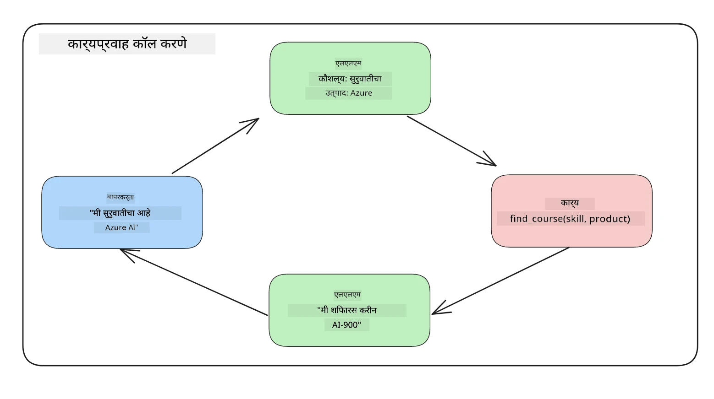
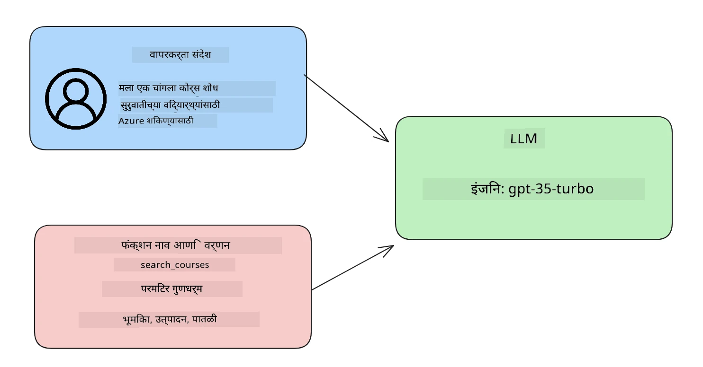

# फंक्शन कॉलिंगसह एकत्रीकरण

[](https://youtu.be/DgUdCLX8qYQ?si=f1ouQU5HQx6F8Gl2)

तुम्ही मागील धड्यांत चांगलेसे शिकलात. तथापि, आपण अजून सुधारणा करू शकतो. काही गोष्टी आपण हाताळू शकतो जसे की उत्तराचे एकसारखे स्वरूप कसे मिळवायचे ज्यामुळे उत्तरासह नंतरच्या प्रक्रियेत काम करणे सोपे होईल. तसेच, आपल्या अनुप्रयोगास अजून समृद्ध करण्यासाठी इतर स्रोतांमधून डेटा जोडायचा असू शकतो.

वर नमूद केलेल्या समस्यांचा हा अध्याय निराकरण करण्याचा प्रयत्न करतो.

## परिचय

हा धडा खालील गोष्टी समजावून सांगेल:

- फंक्शन कॉलिंग म्हणजे काय आणि त्याचे उपयोग काय आहेत हे समजावून सांगणे.
- Azure OpenAI वापरून फंक्शन कॉल तयार करणे.
- अनुप्रयोगात फंक्शन कॉल कसे एकत्र करायचे.

## शिकण्याचे उद्दिष्टे

या धड्याच्या शेवटी, तुम्ही सक्षम असाल:

- फंक्शन कॉलिंगचा उद्देश काय आहे हे समजावून सांगणे.
- Azure OpenAI सेवा वापरून फंक्शन कॉल सेट करणे.
- आपल्या अनुप्रयोगाच्या वापराच्या बाबतीत प्रभावी फंक्शन कॉल डिझाइन करणे.

## परिस्थिती: फंक्शन्ससह आमचा चॅटबॉट सुधारणा

या धड्यासाठी, आम्हाला आमच्या शिक्षण स्टार्टअपसाठी अशी वैशिष्ट्य तयार करायची आहे जी वापरकर्त्यांना तांत्रिक कोर्स शोधण्यासाठी चॅटबॉट वापरण्याची परवानगी देते. आम्ही कोर्सेस शिफारस करू जे त्यांच्या कौशल्य पातळी, वर्तमान भूमिका आणि तंत्रज्ञानाची रूची यानुसार फिट होतील.

या परिस्थितीचा पूर्ण करण्यासाठी, आपण एकत्र वापरणार आहोत:

- `Azure OpenAI` वापरून वापरकर्त्यासाठी चॅट अनुभव तयार करणे.
- `Microsoft Learn Catalog API` वापरून वापरकर्त्यांच्या विनंतीनुसार कोर्सेस शोधणे.
- `फंक्शन कॉलिंग` वापरून वापरकर्त्याच्या प्रश्नाला फंक्शनकडे पाठवणे ज्यायोगे API विनंती केली जाईल.

सुरुवात करण्यासाठी, पाहूया का आपण फंक्शन कॉलिंग वापरू इच्छितो:

## फंक्शन कॉलिंग का?

फंक्शन कॉलिंगच्या आधी, LLM कडून मिळणाऱ्या प्रतिसादांचा स्वरूप अव्यवस्थित आणि असंगत होता. विकसकांना प्रत्येक प्रतिसादाच्या वेगळ्या प्रकाराला हाताळण्यासाठी गुंतागुंतीचा वैधता कोड लिहावा लागायचा. वापरकर्त्यांना "स्टॉकहोममधील वर्तमान हवामान काय आहे?" असे प्रश्न विचारता येत नव्हते. कारण मॉडेल फक्त प्रशिक्षणाच्या वेळेपर्यंतच्या डेटावर मर्यादित होते.

फंक्शन कॉलिंग हे Azure OpenAI सेवेचे एक वैशिष्ट्य आहे जे खालील मर्यादा दूर करते:

- **सुसंगत प्रतिसाद स्वरूप**. जर आपण प्रतिसादाचा स्वरूप नियंत्रित करू शकतो, तर तो इतर प्रणालींसोबत सहजपणे एकत्र केला जाऊ शकतो.
- **बाह्य डेटा**. चॅट संदर्भात अनुप्रयोगाच्या इतर स्रोतांमधून डेटा वापरण्याची क्षमता.

## परिस्थितीच्या माध्यमातून समस्या स्पष्ट करणे

> आपण खालील परिस्थितीसाठी [संबंधित नोटबुक](./python/aoai-assignment.ipynb?WT.mc_id=academic-105485-koreyst) वापरण्याचा सल्ला देतो. तुम्ही फक्त वाचूही शकता कारण आम्ही असा प्रश्न मांडत आहोत जेथे फंक्शन्स समस्येवर उपाय देऊ शकतात.

प्रतिसाद स्वरूपाच्या समस्येचे उदाहरण पाहूया:

समजा आम्हाला विद्यार्थ्यांचा डेटाबेस तयार करायचा आहे जेणेकरून योग्य कोर्स सुचवता येईल. खाली दोन विद्यार्थी माहिती सादर केली आहे ज्यामध्ये डेटा अगदी सारखा आहे.

1. आमच्या Azure OpenAI स्रोताशी कनेक्शन तयार करा:

   ```python
   import os
   import json
   from openai import OpenAI
   from dotenv import load_dotenv
   load_dotenv()

   # Responses API Azure OpenAI (Microsoft Foundry) v1 endpoints वरून दिला जातो
   # त्यामुळे आपण OpenAI क्लायंटला <your-endpoint>/openai/v1/ येथे निर्देशित करतो.
   endpoint = os.environ['AZURE_OPENAI_ENDPOINT']
   client = OpenAI(
   api_key=os.environ['AZURE_OPENAI_API_KEY'],
   base_url=f"{endpoint.rstrip('/')}/openai/v1/",
   )

   deployment=os.environ['AZURE_OPENAI_DEPLOYMENT']
   ```

   खाली Azure OpenAI कनेक्शन कॉन्फिगर करण्यासाठी काही Python कोड आहे. आपण v1 endpoint वापरत असल्याने, फक्त `api_key` आणि `base_url` सेट करणे आवश्यक आहे (कोणतेही `api_version` गरजेचे नाही).

1. `student_1_description` आणि `student_2_description` या व्हेरिएबल्स वापरून दोन विद्यार्थी वर्णने तयार करणे.

   ```python
   student_1_description="Emily Johnson is a sophomore majoring in computer science at Duke University. She has a 3.7 GPA. Emily is an active member of the university's Chess Club and Debate Team. She hopes to pursue a career in software engineering after graduating."

   student_2_description = "Michael Lee is a sophomore majoring in computer science at Stanford University. He has a 3.8 GPA. Michael is known for his programming skills and is an active member of the university's Robotics Club. He hopes to pursue a career in artificial intelligence after finishing his studies."
   ```

   आम्हाला ही विद्यार्थी वर्णने LLM कडे पाठवायची आहेत जेणेकरून डेटा पार्स करता येईल. नंतर हा डेटा वापरुन आपल्या अनुप्रयोगात API कडे पाठवू शकतो किंवा डेटाबेसमध्ये साठवू शकतो.

1. आपण दोन सारखेच प्रॉम्प्ट तयार करु ज्यात LLM ला आपण कोणती माहिती हवी आहे ते सांगितले जाईल:

   ```python
   prompt1 = f'''
   Please extract the following information from the given text and return it as a JSON object:

   name
   major
   school
   grades
   club

   This is the body of text to extract the information from:
   {student_1_description}
   '''

   prompt2 = f'''
   Please extract the following information from the given text and return it as a JSON object:

   name
   major
   school
   grades
   club

   This is the body of text to extract the information from:
   {student_2_description}
   '''
   ```

   वरिल प्रॉम्प्ट्स LLM ला माहिती काढण्याचे आणि JSON स्वरूपात उत्तर देण्याचे निर्देश देतात.

1. प्रॉम्प्ट्स आणि Azure OpenAI कनेक्शन सेट केल्यानंतर, आपण आता `client.responses.create` वापरून LLM कडे प्रॉम्प्ट्स पाठवू. प्रॉम्प्ट `input` व्हेरिएबलमध्ये साठवले जाते आणि भूमिका `user` सेट केली जाते. हे वापरकर्त्याचा संदेश चॅटबॉट कडे लिहिल्याप्रमाणे आहे.

   ```python
   # प्रॉम्प्ट एक कडून प्रतिसाद
   openai_response1 = client.responses.create(
   model=deployment,
   input = [{'role': 'user', 'content': prompt1}],
   store=False,
   )
   openai_response1.output_text

   # प्रॉम्प्ट दोन कडून प्रतिसाद
   openai_response2 = client.responses.create(
   model=deployment,
   input = [{'role': 'user', 'content': prompt2}],
   store=False,
   )
   openai_response2.output_text
   ```

आता आपण दोन्ही विनंत्या LLM कडे पाठवू आणि `openai_response1.output_text` सारखे शोधून मिळणारा प्रतिसाद तपासू.

1. शेवटी, आम्ही प्रतिसाद `json.loads` वापरून JSON स्वरूपात रूपांतर करू:

   ```python
   # प्रतिसाद JSON ऑब्जेक्ट म्हणून लोड करत आहे
   json_response1 = json.loads(openai_response1.output_text)
   json_response1
   ```

   प्रतिसाद 1:

   ```json
   {
     "name": "Emily Johnson",
     "major": "computer science",
     "school": "Duke University",
     "grades": "3.7",
     "club": "Chess Club"
   }
   ```

   प्रतिसाद 2:

   ```json
   {
     "name": "Michael Lee",
     "major": "computer science",
     "school": "Stanford University",
     "grades": "3.8 GPA",
     "club": "Robotics Club"
   }
   ```

   जरी प्रॉम्प्ट्स समान आहेत आणि वर्णने अगदी सारखी आहेत, तरी `Grades` या प्रॉपर्टीच्या मूल्यांचे स्वरूप वेगळे आहे, जसे कधीकधी `3.7` आणि कधीकधी `3.7 GPA` आढळते.

   हे कारण LLM लिहिलेल्या प्रॉम्प्टच्या अविन्यस्त डेटावर आधारित असतो आणि त्याच्याही प्रतिसादाचा डेटा अविन्यस्त स्वरूपात असतो. आपण संरचित स्वरूप हवा आहे ज्यामुळे माहिती साठवताना किंवा वापरताना काय अपेक्षा ठेवायची हे माहीत राहील.

मग आपण हा स्वरूप समस्या कशी सोडवू? फंक्शन कॉलिंग वापरून, आपण संरचित डेटा अपेक्षित करू शकतो. फंक्शन कॉलिंग वापरताना, LLM खऱ्या अर्थाने फंक्शन्स कॉल किंवा चालवत नाही. त्याऐवजी आपण LLM ला प्रतिक्रिया देण्यासाठी एक रचना तयार करतो. नंतर त्या संरचित प्रतिक्रियांनुसार आपण आमच्या अनुप्रयोगात कोणता फंक्शन चालवायचा हे ठरवतो.



नंतर आपण फंक्शन कडून परत येणारे डेटा LLM कडे परत पाठवू. LLM नंतर नैसर्गिक भाषेत वापरकर्त्याच्या प्रश्नाचे उत्तर देईल.

## फंक्शन कॉलिंगसाठी वापराच्या बाबी

अनेक वापराच्या बाबी आहेत जिथे फंक्शन कॉल आपल्या अॅपमध्ये सुधारणा करू शकतो जसे की:

- **बाह्य साधने कॉल करणे**. चॅटबॉट वापरकर्त्यांच्या प्रश्नांना उत्तरे देण्यासाठी उत्कृष्ट आहेत. फंक्शन कॉलिंग वापरून, चॅटबॉट वापरकर्त्यांच्या संदेशांवरून विशिष्ट कार्ये पूर्ण करू शकतात. उदाहरणार्थ, विद्यार्थी चॅटबॉटला “माझ्या शिक्षकाला ईमेल पाठवा की मला या विषयावर अधिक मदत हवी आहे” असे म्हणू शकतो. हे `send_email(to: string, body: string)` नावाच्या फंक्शन कॉलला सक्षम करते.

- **API किंवा डेटाबेस क्वेरी तयार करणे**. वापरकर्ते नैसर्गिक भाषा वापरून माहिती शोधू शकतात जी नंतर फॉरमॅटेड क्वेरी किंवा API विनंतीमध्ये बदलली जाते. उदाहरणार्थ, शिक्षक विचारू शकतो “ज्यांनी शेवटचा असाइनमेंट पूर्ण केला आहे ते विद्यार्थी कोण आहेत?” ज्यासाठी `get_completed(student_name: string, assignment: int, current_status: string)` नावाचा फंक्शन कॉल केला जाऊ शकतो.

- **संरचित डेटा तयार करणे**. वापरकर्ते एक मजकूर किंवा CSV ब्लॉक वापरून LLM कडून महत्त्वाची माहिती काढू शकतात. उदाहरणार्थ, एखादा विद्यार्थी शांतता करारांबाबत विकिपीडिया लेख AI फ्लॅशकार्डसाठी रूपांतर करू शकतो. यासाठी `get_important_facts(agreement_name: string, date_signed: string, parties_involved: list)` नावाचा फंक्शन वापरला जातो.

## आपला पहिला फंक्शन कॉल तयार करणे

फंक्शन कॉल तयार करण्याची प्रक्रिया तीन मुख्य टप्प्यांत आहे:

1. आपल्या फंक्शन्स (साधने) यादीसह आणि वापरकर्त्याचा संदेश देऊन Responses API कॉलिंग.
2. क्रिया करण्यासाठी मॉडेलचा प्रतिसाद वाचन म्हणजे फंक्शन किंवा API कॉल अंमलात आणणे.
3. वापरकर्त्यास प्रतिसाद तयार करण्यासाठी आपल्या फंक्शनमधून प्रतिसाद घेऊन Responses API ला आणखी कॉल करणे.



### टप्पा 1 - संदेश तयार करणे

पहिला टप्पा वापरकर्त्याचा संदेश तयार करणे आहे. हा डायनॅमिकरित्या टेक्स्ट इनपुटमधून घेतला जाऊ शकतो किंवा आपण येथे मूल्य नियुक्त करू शकता. जर तुम्ही Responses API बरोबर प्रथम काम करत असाल तर, तुम्हाला संदेशाचा `role` आणि `content` निश्चित करावा लागेल.

`role` ही `system` (नियम तयार करणे), `assistant` (मॉडेल) किंवा `user` (अंतिम वापरकर्ता) असू शकते. फंक्शन कॉलिंगसाठी, आपण `user` म्हणून आणि एक उदाहरण प्रश्न म्हणून हे सेट करू.

```python
messages= [ {"role": "user", "content": "Find me a good course for a beginner student to learn Azure."} ]
```

विविध भूमिका सोपवून, LLM साठी स्पष्ट होते की ते सिस्टमकडून आहे की वापरकर्त्याकडून, ज्यामुळे चर्चा इतिहास तयार करण्यास मदत होते ज्यावर LLM काम करू शकतो.

### टप्पा 2 - फंक्शन्स तयार करणे

नंतर, आपण एक फंक्शन आणि त्याचे पॅरामीटर्स निश्चित करणार आहोत. येथे आपण एका फंक्शनचा वापर करणार आहोत ज्याला `search_courses` म्हणतात, परंतु तुम्ही अनेक फंक्शन्स तयार करू शकता.

> **महत्त्वाचे** : फंक्शन्स सिस्टम संदेशात LLM कडे समाविष्ट केली जातील आणि उपलब्ध टोकनच्या संख्येचा भाग असतील.

खाली, आपण फंक्शन्स आयटम्सच्या रूपात तयार करतो. प्रत्येक आयटम flat Responses API फॉरमॅटमधील साधन आहे ज्यामध्ये `type`, `name`, `description` आणि `parameters` आहेत:

```python
functions = [
   {
      "type":"function",
      "name":"search_courses",
      "description":"Retrieves courses from the search index based on the parameters provided",
      "parameters":{
         "type":"object",
         "properties":{
            "role":{
               "type":"string",
               "description":"The role of the learner (i.e. developer, data scientist, student, etc.)"
            },
            "product":{
               "type":"string",
               "description":"The product that the lesson is covering (i.e. Azure, Power BI, etc.)"
            },
            "level":{
               "type":"string",
               "description":"The level of experience the learner has prior to taking the course (i.e. beginner, intermediate, advanced)"
            }
         },
         "required":[
            "role"
         ]
      }
   }
]
```

आता आपण खाली प्रत्येक फंक्शनची अधिक तपशीलवार वर्णन करू:

- `name` - कॉल होणाऱ्या फंक्शनचे नाव.
- `description` - फंक्शन कसे काम करते याचे वर्णन. येथे स्पष्ट आणि ठोस असणे महत्त्वाचे आहे.
- `parameters` - मॉडेलने प्रतिसादात तयार करावयाचे मूल्ये आणि फॉरमॅट यांची यादी. parameters array मध्ये आयटम्स असतात ज्यांच्या खालील प्रॉपर्टीज असतात:
  1.  `type` - प्रॉपर्टीज साठवण्यासाठी डेटा प्रकार.
  1.  `properties` - मॉडेलने प्रतिसादासाठी वापरावयाचे ठराविक मूल्ये
      1. `name` - प्रॉपर्टीची की जी मॉडेल प्रतिसादासाठी वापरेल, उदाहरणार्थ, `product`.
      1. `type` - या प्रॉपर्टीचा डेटा प्रकार, उदाहरणार्थ, `string`.
      1. `description` - त्या विशिष्ट प्रॉपर्टीचे वर्णन.

एक पर्यायी प्रॉपर्टी `required` देखील आहे - फंक्शन कॉल पूर्ण होण्यासाठी आवश्यक प्रॉपर्टी.

### टप्पा 3 - फंक्शन कॉल करणे

फंक्शन निश्चित केल्यानंतर, आता आपण ते Responses API कॉलमध्ये समाविष्ट करायचे आहे. यासाठी `tools` मध्ये `functions` सेट करतो.

`tool_choice` हे `auto` सेट करण्याचा पर्याय देखील आहे. म्हणजे वापरकर्त्याच्या संदेशावर आधारित LLM स्वतः निर्णय घेईल कोणता फंक्शन कॉल करायचा.

खाली दिलेला कोड वापरून आपण `client.responses.create` कॉल करतो, येथे `tools=functions` आणि `tool_choice="auto"` कसे सेट केले आहे ते पाहा जेणेकरून LLM ला फंक्शन्स कॉल करण्याचा पर्याय मिळतो:

```python
response = client.responses.create(model=deployment,
                                        input=messages,
                                        tools=functions,
                                        tool_choice="auto",
                                        store=False)

print(response.output)
```

परत येणाऱ्या प्रतिसादामध्ये आता `response.output` मध्ये `function_call` आयटम दिसतो जो असे दिसतो:

```json
{
  "type": "function_call",
  "name": "search_courses",
  "call_id": "call_abc123",
  "arguments": "{\n  \"role\": \"student\",\n  \"product\": \"Azure\",\n  \"level\": \"beginner\"\n}"
}
```

येथे आपण पाहू शकतो की `search_courses` फंक्शन कसे कॉल झाले आणि कोणते आर्ग्युमेंट्स दिले गेले आहेत, जे JSON प्रतिसादातील `arguments` प्रॉपर्टीत आहेत.

निष्कर्ष असा की LLM ने `input` पॅरामीटरमध्ये दिलेल्या मूल्यांमधून डेटा-काढून फंक्शनच्या आर्ग्युमेंट्समध्ये बसवला. खाली `messages` मूल्य आठवणीसाठी दिले आहे:

```python
messages= [ {"role": "user", "content": "Find me a good course for a beginner student to learn Azure."} ]
```

आपण पाहू शकता की `student`, `Azure` आणि `beginner` `messages` मधून काढले गेले आणि फंक्शनसाठी इन्पुटने सेट केले गेले. अशा प्रकारे फंक्शन्स वापरणे प्रोम्प्टमधून माहिती काढण्याचा आणि LLM साठी रचना प्रदान करण्याचा चांगला मार्ग आहे.

पुढे, पाहूया हे आपल्याला अॅपमध्ये कसे वापरायचे.

## फंक्शन कॉल्सची अनुप्रयोगात एकत्रीकरण

LLM कडून मिळालेल्या स्वरूपित प्रतिसादाची चाचणी केल्यानंतर, आपण आता हे अनुप्रयोगात एकत्र करू शकतो.

### फ्लो व्यवस्थापन

हे आपल्याला अनुप्रयोगात एकत्रित करताना खालील टप्पे पार पाडावेत:

1. प्रथम, OpenAI सेवा कॉल करा आणि प्रतिसादातील `output` मधून फंक्शन कॉल आयटम काढा.

   ```python
   response_items = response.output
   tool_calls = [item for item in response_items if item.type == "function_call"]
   ```

1. आता Microsoft Learn API कॉल करणारा फंक्शन तयार करू जो कोर्सची यादी मिळवेल:

   ```python
   import requests

   def search_courses(role, product, level):
     url = "https://learn.microsoft.com/api/catalog/"
     params = {
        "role": role,
        "product": product,
        "level": level
     }
     response = requests.get(url, params=params)
     modules = response.json()["modules"]
     results = []
     for module in modules[:5]:
        title = module["title"]
        url = module["url"]
        results.append({"title": title, "url": url})
     return str(results)
   ```

   तयार केलेले `functions` व्हेरिएबल वापरून फंक्शनचे नाव नकाशे करणार खऱ्या Python फंक्शन तयार करा. आपण बाह्य API कॉल करतो ते डेटा मिळवण्यासाठी. यामध्ये Microsoft Learn API कडे प्रशिक्षण मॉड्यूल शोधण्यासाठी कॉल करतो.

ठीक आहे, आपण `functions` व्हेरिएबल आणि त्याशी संबंधित Python फंक्शन तयार केले, आता LLM ला हे कसे सांगायचे की या दोन्हीला नकाशित करा जेणेकरून आपला Python फंक्शन कॉल होईल?

1. पाहण्यासाठी की Python फंक्शन कॉल करायचा आहे की नाही, आपण LLM प्रतिसाद तपासू आणि `function_call` आयटम आहे का ते पाहू, आणि नंतर दिलेला फंक्शन कॉल करू. खाली तपासणीसाठी कोड आहे:

   ```python
   # मॉडेलला फंक्शन कॉल करायचा आहे का ते तपासा
   if tool_calls:
    for tool_call in tool_calls:
     print("Recommended Function call:")
     print(tool_call.name)
     print()

     # फंक्शन कॉल करा.
     function_name = tool_call.name

     available_functions = {
             "search_courses": search_courses,
     }
     function_to_call = available_functions[function_name]

     function_args = json.loads(tool_call.arguments)
     function_response = function_to_call(**function_args)

     print("Output of function call:")
     print(function_response)
     print(type(function_response))

     # फंक्शन कॉल आणि त्याचा परिणाम परत संभाषणात जोडा.
     # मॉडेलच्या function_call आयटमला त्याच्या आउटपुटच्या आधी जोडले पाहिजे.
     messages.append(tool_call)  # सहाय्यकाचा function_call आयटम
     messages.append( # फंक्शनचा परिणाम
         {
             "type": "function_call_output",
             "call_id": tool_call.call_id,
             "output": function_response,
         }
     )
   ```

   ही तीन ओळी फंक्शन नाव, आर्ग्युमेंट्स काढतात आणि कॉल करतात:

   ```python
   function_to_call = available_functions[function_name]

   function_args = json.loads(tool_call.arguments)
   function_response = function_to_call(**function_args)
   ```

   खाली आमच्या कोडचा आउटपुट आहे:

   **आउटपुट**

   ```Recommended Function call:
   {
     "name": "search_courses",
     "arguments": "{\n  \"role\": \"student\",\n  \"product\": \"Azure\",\n  \"level\": \"beginner\"\n}"
   }

   Output of function call:
   [{'title': 'Describe concepts of cryptography', 'url': 'https://learn.microsoft.com/training/modules/describe-concepts-of-cryptography/?
   WT.mc_id=api_CatalogApi'}, {'title': 'Introduction to audio classification with TensorFlow', 'url': 'https://learn.microsoft.com/en-
   us/training/modules/intro-audio-classification-tensorflow/?WT.mc_id=api_CatalogApi'}, {'title': 'Design a Performant Data Model in Azure SQL
   Database with Azure Data Studio', 'url': 'https://learn.microsoft.com/training/modules/design-a-data-model-with-ads/?
   WT.mc_id=api_CatalogApi'}, {'title': 'Getting started with the Microsoft Cloud Adoption Framework for Azure', 'url':
   'https://learn.microsoft.com/training/modules/cloud-adoption-framework-getting-started/?WT.mc_id=api_CatalogApi'}, {'title': 'Set up the
   Rust development environment', 'url': 'https://learn.microsoft.com/training/modules/rust-set-up-environment/?WT.mc_id=api_CatalogApi'}]
   <class 'str'>
   ```

1. आता आम्ही अद्ययावत संदेश `messages` LLM कडे पाठवू ज्यामुळे नैसर्गिक भाषेत प्रतिसाद मिळू शकेल API JSON फॉरमॅटेड उत्तराऐवजी.

   ```python
   print("Messages in next request:")
   print(messages)
   print()

   second_response = client.responses.create(
      input=messages,
      model=deployment,
      tool_choice="auto",
      tools=functions,
      temperature=0,
      store=False,
         )  # मॉडेलकडून नवीन प्रतिसाद मिळवा जिथे ते फंक्शन प्रतिसाद पाहू शकते


   print(second_response.output_text)
   ```

   **आउटपुट**

   ```text
   I found some good courses for beginner students to learn Azure:

   1. [Describe concepts of cryptography](https://learn.microsoft.com/training/modules/describe-concepts-of-cryptography/?WT.mc_id=api_CatalogApi)
   2. [Introduction to audio classification with TensorFlow](https://learn.microsoft.com/training/modules/intro-audio-classification-tensorflow/?WT.mc_id=api_CatalogApi)
   3. [Design a Performant Data Model in Azure SQL Database with Azure Data Studio](https://learn.microsoft.com/training/modules/design-a-data-model-with-ads/?WT.mc_id=api_CatalogApi)
   4. [Getting started with the Microsoft Cloud Adoption Framework for Azure](https://learn.microsoft.com/training/modules/cloud-adoption-framework-getting-started/?WT.mc_id=api_CatalogApi)
   5. [Set up the Rust development environment](https://learn.microsoft.com/training/modules/rust-set-up-environment/?WT.mc_id=api_CatalogApi)

   You can click on the links to access the courses.
   ```

## असाइनमेंट

Azure OpenAI फंक्शन कॉलिंगवरील आपले शिक्षण पुढे सुरू ठेवण्यासाठी आपण बनवू शकता:

- फंक्शनचे अजून पॅरामीटर्स जे शिकणाऱ्यांना अधिक कोर्सस शोधण्यासाठी मदत करू शकतात.

- शिकणाऱ्यांकडून त्यांची मूळ भाषा यासारखी अधिक माहिती घेणार्‍या दुसर्‍या फंक्शन कॉलची निर्मिती करा
- जेव्हा फंक्शन कॉल आणि/ किंवा API कॉल कोणतेही योग्य अभ्यासक्रम परत करत नाही तेव्हा त्रुटी हाताळणी तयार करा

टीप: [Learn API reference documentation](https://learn.microsoft.com/training/support/catalog-api-developer-reference?WT.mc_id=academic-105485-koreyst) पानाचा अवलंब करा, जेणेकरून कसे आणि कुठे ही माहिती उपलब्ध आहे हे पाहू शकता.

## उत्कृष्ट काम! प्रवास सुरू ठेवा

हा धडा पूर्ण केल्यावर, आमच्या [Generative AI Learning collection](https://aka.ms/genai-collection?WT.mc_id=academic-105485-koreyst) मध्ये भेट द्या आणि तुमचे Generative AI ज्ञान अधिक वाढवा!

धडा 12 कडे जा, जेथे आपण पाहणार आहोत [AI अनुप्रयोगांसाठी UX कसे डिझाइन करायचे](../12-designing-ux-for-ai-applications/README.md?WT.mc_id=academic-105485-koreyst)!

---

<!-- CO-OP TRANSLATOR DISCLAIMER START -->
**अस्वीकरण**:
हा दस्तऐवज AI भाषांतर सेवा [Co-op Translator](https://github.com/Azure/co-op-translator) चा वापर करून अनुवादित केला आहे. जरी आम्ही अचूकतेसाठी प्रयत्न करतो, तरी कृपया लक्षात घ्या की स्वयंचलित भाषांतरांमध्ये त्रुटी किंवा अचूकतेची कमतरता असू शकते. मूळ दस्तऐवज त्याच्या मूळ भाषेत अधिकृत स्रोत मानला पाहिजे. महत्त्वाची माहिती असल्यास, व्यावसायिक मानवी भाषांतराची शिफारस केली जाते. या भाषांतराच्या वापरामुळे उद्भवणाऱ्या कोणत्याही गैरसमज किंवा चुकीच्या अर्थलावणीसाठी आम्ही जबाबदार नाही.
<!-- CO-OP TRANSLATOR DISCLAIMER END -->