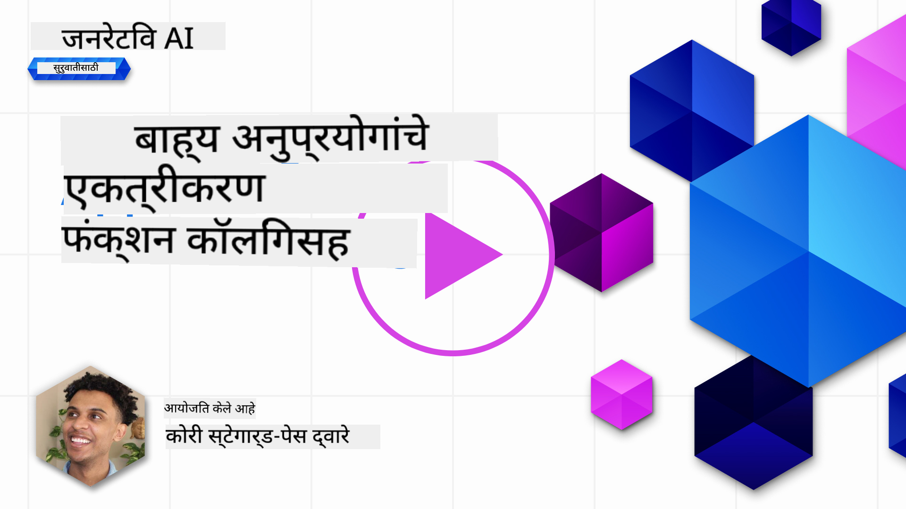
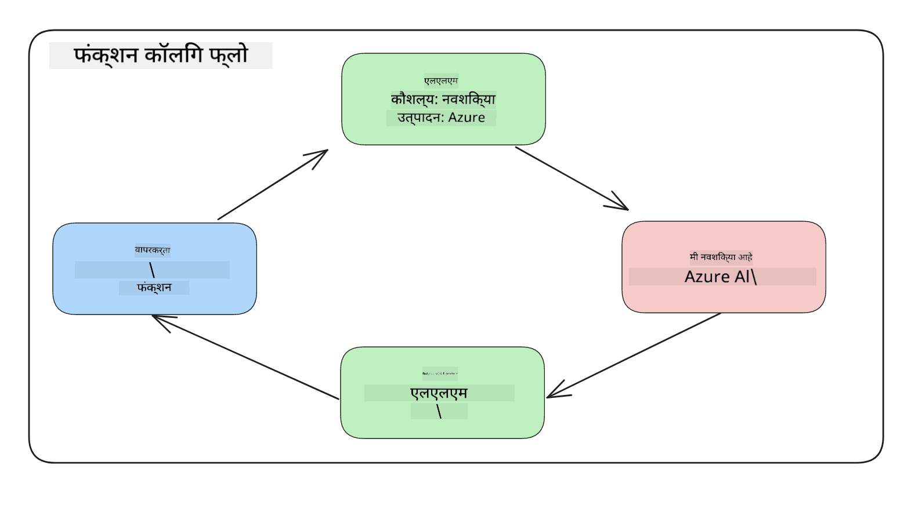
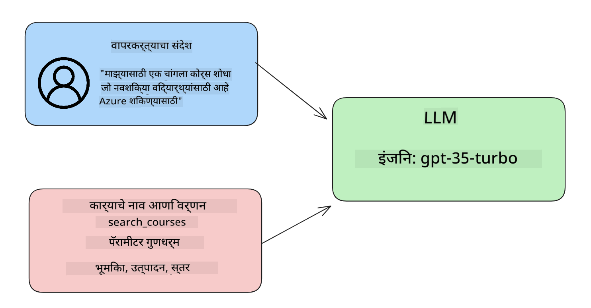

<!--
CO_OP_TRANSLATOR_METADATA:
{
  "original_hash": "f6f84f9ef2d066cd25850cab93580a50",
  "translation_date": "2025-10-17T13:40:14+00:00",
  "source_file": "11-integrating-with-function-calling/README.md",
  "language_code": "mr"
}
-->
# फंक्शन कॉलिंगसह एकत्रीकरण

[](https://youtu.be/DgUdCLX8qYQ?si=f1ouQU5HQx6F8Gl2)

आतापर्यंतच्या धड्यांमध्ये तुम्ही बरेच काही शिकले आहे. मात्र, अजून सुधारणा करता येऊ शकते. काही गोष्टी ज्या आपण सुधारू शकतो त्या म्हणजे प्रतिसादाचा अधिक सुसंगत स्वरूप मिळवणे जेणेकरून प्रतिसादाचा पुढील टप्प्यात उपयोग करणे सोपे होईल. तसेच, आपले अॅप्लिकेशन अधिक समृद्ध करण्यासाठी इतर स्रोतांमधून डेटा जोडण्याची आवश्यकता असू शकते.

वरील समस्यांचे निराकरण करण्यासाठी हा अध्याय आहे.

## परिचय

या धड्यात आपण शिकणार आहोत:

- फंक्शन कॉलिंग म्हणजे काय आणि त्याचे उपयोग.
- Azure OpenAI वापरून फंक्शन कॉल तयार करणे.
- फंक्शन कॉल अॅप्लिकेशनमध्ये कसे समाकलित करायचे.

## शिकण्याचे उद्दिष्ट

या धड्याच्या शेवटी, तुम्ही हे करू शकाल:

- फंक्शन कॉलिंग वापरण्याचा उद्देश स्पष्ट करा.
- Azure OpenAI सेवा वापरून फंक्शन कॉल सेट करा.
- तुमच्या अॅप्लिकेशनच्या उपयोगासाठी प्रभावी फंक्शन कॉल डिझाइन करा.

## परिस्थिती: फंक्शनसह आमच्या चॅटबॉटमध्ये सुधारणा करणे

या धड्यासाठी, आम्हाला आमच्या शिक्षण स्टार्टअपसाठी एक फीचर तयार करायचे आहे जे वापरकर्त्यांना तांत्रिक कोर्स शोधण्यासाठी चॅटबॉट वापरण्याची परवानगी देते. आम्ही त्यांच्या कौशल्य स्तर, सध्याची भूमिका आणि तंत्रज्ञानाच्या आवडीसाठी योग्य कोर्सेसची शिफारस करू.

ही परिस्थिती पूर्ण करण्यासाठी, आम्ही खालील गोष्टींचा वापर करू:

- `Azure OpenAI` वापरून वापरकर्त्यासाठी चॅट अनुभव तयार करणे.
- `Microsoft Learn Catalog API` वापरून वापरकर्त्याच्या विनंतीनुसार कोर्स शोधण्यात मदत करणे.
- `Function Calling` वापरून वापरकर्त्याच्या क्वेरीला फंक्शनकडे पाठवून API विनंती करणे.

सुरुवात करण्यासाठी, आपण फंक्शन कॉलिंग का वापरावे याचे कारण पाहूया:

## फंक्शन कॉलिंग का?

फंक्शन कॉलिंगपूर्वी, LLM कडून मिळणारे प्रतिसाद असंरचित आणि असुसंगत होते. विकसकांना प्रत्येक प्रतिसादाच्या विविधतेला हाताळण्यासाठी जटिल सत्यापन कोड लिहावा लागायचा. वापरकर्त्यांना "स्टॉकहोममधील सध्याचे हवामान काय आहे?" यासारखी उत्तरे मिळू शकत नव्हती. कारण मॉडेल्स केवळ प्रशिक्षणाच्या वेळेपर्यंत मर्यादित होते.

Azure OpenAI सेवेमधील फंक्शन कॉलिंग ही खालील मर्यादा दूर करण्यासाठी एक सुविधा आहे:

- **सुसंगत प्रतिसाद स्वरूप**. जर आपण प्रतिसाद स्वरूप अधिक चांगल्या प्रकारे नियंत्रित करू शकलो तर आपण प्रतिसाद इतर प्रणालींमध्ये सहजपणे समाकलित करू शकतो.
- **बाह्य डेटा**. चॅट संदर्भात अॅप्लिकेशनच्या इतर स्रोतांमधील डेटा वापरण्याची क्षमता.

## परिस्थितीद्वारे समस्या स्पष्ट करणे

> आम्ही तुम्हाला [समाविष्ट केलेल्या नोटबुक](./python/aoai-assignment.ipynb?WT.mc_id=academic-105485-koreyst) वापरण्याची शिफारस करतो जर तुम्हाला खालील परिस्थिती चालवायची असेल. तुम्ही फक्त वाचू शकता कारण आम्ही फंक्शनद्वारे समस्या कशी सोडवता येईल हे स्पष्ट करण्याचा प्रयत्न करत आहोत.

चला प्रतिसाद स्वरूप समस्येचे उदाहरण पाहूया:

आपण विद्यार्थ्यांचा डेटा संग्रह तयार करू इच्छितो जेणेकरून त्यांना योग्य कोर्स सुचवता येईल. खाली दोन विद्यार्थ्यांचे वर्णन आहे जे त्यांच्या डेटामध्ये खूप समान आहेत.

1. आमच्या Azure OpenAI संसाधनाशी कनेक्शन तयार करा:

   ```python
   import os
   import json
   from openai import AzureOpenAI
   from dotenv import load_dotenv
   load_dotenv()

   client = AzureOpenAI(
   api_key=os.environ['AZURE_OPENAI_API_KEY'],  # this is also the default, it can be omitted
   api_version = "2023-07-01-preview"
   )

   deployment=os.environ['AZURE_OPENAI_DEPLOYMENT']
   ```

   खाली काही Python कोड आहे ज्यामध्ये आम्ही आमच्या Azure OpenAI कनेक्शनसाठी `api_type`, `api_base`, `api_version` आणि `api_key` सेट करतो.

1. दोन विद्यार्थ्यांचे वर्णन तयार करणे, `student_1_description` आणि `student_2_description` वापरून.

   ```python
   student_1_description="Emily Johnson is a sophomore majoring in computer science at Duke University. She has a 3.7 GPA. Emily is an active member of the university's Chess Club and Debate Team. She hopes to pursue a career in software engineering after graduating."

   student_2_description = "Michael Lee is a sophomore majoring in computer science at Stanford University. He has a 3.8 GPA. Michael is known for his programming skills and is an active member of the university's Robotics Club. He hopes to pursue a career in artificial intelligence after finishing his studies."
   ```

   आम्हाला वरील विद्यार्थ्यांचे वर्णन LLM कडे पाठवायचे आहे जेणेकरून डेटा पार्स करता येईल. हा डेटा नंतर आमच्या अॅप्लिकेशनमध्ये वापरला जाऊ शकतो आणि API कडे पाठवला जाऊ शकतो किंवा डेटाबेसमध्ये संग्रहित केला जाऊ शकतो.

1. चला दोन समान प्रॉम्प्ट तयार करूया ज्यामध्ये आम्ही LLM ला सांगतो की आम्हाला कोणती माहिती हवी आहे:

   ```python
   prompt1 = f'''
   Please extract the following information from the given text and return it as a JSON object:

   name
   major
   school
   grades
   club

   This is the body of text to extract the information from:
   {student_1_description}
   '''

   prompt2 = f'''
   Please extract the following information from the given text and return it as a JSON object:

   name
   major
   school
   grades
   club

   This is the body of text to extract the information from:
   {student_2_description}
   '''
   ```

   वरील प्रॉम्प्ट LLM ला माहिती काढण्यासाठी आणि JSON स्वरूपात प्रतिसाद परत करण्याचे निर्देश देतात.

1. प्रॉम्प्ट आणि Azure OpenAI कनेक्शन सेट केल्यानंतर, आम्ही आता प्रॉम्प्ट LLM कडे पाठवू आणि `openai.ChatCompletion` वापरून प्रतिसाद प्राप्त करू. आम्ही प्रॉम्प्ट `messages` व्हेरिएबलमध्ये संग्रहित करतो आणि `user` ला भूमिका देतो. हे चॅटबॉटकडे वापरकर्त्याने संदेश लिहिल्याचे अनुकरण करण्यासाठी आहे.

   ```python
   # response from prompt one
   openai_response1 = client.chat.completions.create(
   model=deployment,
   messages = [{'role': 'user', 'content': prompt1}]
   )
   openai_response1.choices[0].message.content

   # response from prompt two
   openai_response2 = client.chat.completions.create(
   model=deployment,
   messages = [{'role': 'user', 'content': prompt2}]
   )
   openai_response2.choices[0].message.content
   ```

आता आम्ही दोन्ही विनंत्या LLM कडे पाठवू शकतो आणि आम्हाला मिळणारा प्रतिसाद तपासू शकतो, जसे की `openai_response1['choices'][0]['message']['content']`.

1. शेवटी, आम्ही प्रतिसाद JSON स्वरूपात रूपांतरित करू शकतो `json.loads` कॉल करून:

   ```python
   # Loading the response as a JSON object
   json_response1 = json.loads(openai_response1.choices[0].message.content)
   json_response1
   ```

   प्रतिसाद 1:

   ```json
   {
     "name": "Emily Johnson",
     "major": "computer science",
     "school": "Duke University",
     "grades": "3.7",
     "club": "Chess Club"
   }
   ```

   प्रतिसाद 2:

   ```json
   {
     "name": "Michael Lee",
     "major": "computer science",
     "school": "Stanford University",
     "grades": "3.8 GPA",
     "club": "Robotics Club"
   }
   ```

   जरी प्रॉम्प्ट समान आहेत आणि वर्णने समान आहेत, तरीही आम्हाला `Grades` प्रॉपर्टीचे मूल्य वेगवेगळ्या स्वरूपात दिसते, जसे की कधी कधी `3.7` किंवा `3.7 GPA`.

   हा परिणाम LLM असंरचित डेटा घेत असल्यामुळे आहे, जो लिखित प्रॉम्प्टच्या स्वरूपात असतो आणि असंरचित डेटा परत करतो. आम्हाला संरचित स्वरूप असणे आवश्यक आहे जेणेकरून आम्हाला हे माहित असेल की हा डेटा संग्रहित करताना किंवा वापरताना काय अपेक्षित आहे.

तर मग स्वरूपन समस्या कशी सोडवायची? फंक्शन कॉलिंग वापरून, आम्ही संरचित डेटा परत मिळवण्याची खात्री करू शकतो. फंक्शन कॉलिंग वापरताना, LLM प्रत्यक्षात कोणतेही फंक्शन कॉल करत नाही किंवा चालवत नाही. त्याऐवजी, आम्ही LLM ला त्याच्या प्रतिसादांसाठी अनुसरण करण्यासाठी एक संरचना तयार करतो. नंतर आम्ही त्या संरचित प्रतिसादांचा उपयोग करून आमच्या अॅप्लिकेशनमध्ये कोणते फंक्शन चालवायचे ते ठरवतो.



आम्ही नंतर फंक्शनकडून परत आलेले डेटा घेऊ शकतो आणि ते LLM कडे पाठवू शकतो. LLM नंतर वापरकर्त्याच्या क्वेरीला उत्तर देण्यासाठी नैसर्गिक भाषेचा वापर करून प्रतिसाद देईल.

## फंक्शन कॉल्ससाठी उपयोग

फंक्शन कॉल्स वापरून तुमच्या अॅपमध्ये सुधारणा करण्यासाठी अनेक उपयोग आहेत, जसे की:

- **बाह्य साधने कॉल करणे**. चॅटबॉट्स वापरकर्त्यांच्या प्रश्नांना उत्तरे देण्यात उत्कृष्ट आहेत. फंक्शन कॉलिंग वापरून, चॅटबॉट्स वापरकर्त्यांच्या संदेशांचा उपयोग विशिष्ट कार्ये पूर्ण करण्यासाठी करू शकतात. उदाहरणार्थ, विद्यार्थी चॅटबॉटला विचारू शकतो, "माझ्या शिक्षकाला ईमेल पाठवा की मला या विषयावर अधिक मदतीची आवश्यकता आहे". हे `send_email(to: string, body: string)` नावाच्या फंक्शनला कॉल करू शकते.

- **API किंवा डेटाबेस क्वेरी तयार करणे**. वापरकर्ते नैसर्गिक भाषेचा उपयोग करून माहिती शोधू शकतात जी स्वरूपित क्वेरी किंवा API विनंतीमध्ये रूपांतरित केली जाते. याचे एक उदाहरण म्हणजे शिक्षक जो विचारतो, "कोणते विद्यार्थी शेवटचे असाइनमेंट पूर्ण केले आहेत" जे `get_completed(student_name: string, assignment: int, current_status: string)` नावाच्या फंक्शनला कॉल करू शकते.

- **संरचित डेटा तयार करणे**. वापरकर्ते मजकूराचा ब्लॉक किंवा CSV घेऊ शकतात आणि LLM चा उपयोग करून त्यातून महत्त्वाची माहिती काढू शकतात. उदाहरणार्थ, विद्यार्थी शांती कराराबद्दल Wikipedia लेख रूपांतरित करून AI फ्लॅशकार्ड तयार करू शकतो. हे `get_important_facts(agreement_name: string, date_signed: string, parties_involved: list)` नावाच्या फंक्शनचा उपयोग करून केले जाऊ शकते.

## तुमचा पहिला फंक्शन कॉल तयार करणे

फंक्शन कॉल तयार करण्याची प्रक्रिया 3 मुख्य टप्प्यांमध्ये समाविष्ट आहे:

1. **कॉल करणे** - Chat Completions API ला तुमच्या फंक्शन्सची यादी आणि वापरकर्त्याचा संदेश पाठवणे.
2. **वाचणे** - मॉडेलच्या प्रतिसादाचा उपयोग करून कृती करणे, म्हणजे फंक्शन किंवा API कॉल चालवणे.
3. **पुन्हा कॉल करणे** - फंक्शनकडून मिळालेल्या प्रतिसादाचा उपयोग करून वापरकर्त्याला प्रतिसाद तयार करण्यासाठी Chat Completions API ला पुन्हा कॉल करणे.



### टप्पा 1 - संदेश तयार करणे

पहिला टप्पा म्हणजे वापरकर्त्याचा संदेश तयार करणे. हे टेक्स्ट इनपुटच्या मूल्याचा उपयोग करून डायनॅमिकपणे असाइन केले जाऊ शकते किंवा तुम्ही येथे मूल्य असाइन करू शकता. जर तुम्ही प्रथमच Chat Completions API वर काम करत असाल, तर तुम्हाला संदेशाचा `role` आणि `content` परिभाषित करावा लागेल.

`role` हे `system` (नियम तयार करणे), `assistant` (मॉडेल) किंवा `user` (अंतिम वापरकर्ता) असू शकते. फंक्शन कॉलिंगसाठी, आम्ही याला `user` म्हणून असाइन करू आणि एक उदाहरण प्रश्न देऊ.

```python
messages= [ {"role": "user", "content": "Find me a good course for a beginner student to learn Azure."} ]
```

वेगवेगळ्या भूमिका असाइन करून, LLM ला स्पष्ट होते की हे सिस्टमकडून आहे की वापरकर्त्याकडून, ज्यामुळे LLM ला संभाषणाचा इतिहास तयार करण्यात मदत होते.

### टप्पा 2 - फंक्शन्स तयार करणे

पुढे, आम्ही एक फंक्शन आणि त्या फंक्शनचे पॅरामीटर्स परिभाषित करू. आम्ही येथे फक्त एक फंक्शन वापरणार आहोत ज्याचे नाव `search_courses` आहे, पण तुम्ही अनेक फंक्शन्स तयार करू शकता.

> **महत्त्वाचे** : फंक्शन्स LLM च्या सिस्टम संदेशामध्ये समाविष्ट केले जातात आणि तुमच्याकडे उपलब्ध असलेल्या टोकन्सच्या संख्येत समाविष्ट केले जातात.

खाली, आम्ही फंक्शन्स आयटम्सच्या अॅरे म्हणून तयार करतो. प्रत्येक आयटम एक फंक्शन आहे आणि त्यात `name`, `description` आणि `parameters` प्रॉपर्टीज आहेत:

```python
functions = [
   {
      "name":"search_courses",
      "description":"Retrieves courses from the search index based on the parameters provided",
      "parameters":{
         "type":"object",
         "properties":{
            "role":{
               "type":"string",
               "description":"The role of the learner (i.e. developer, data scientist, student, etc.)"
            },
            "product":{
               "type":"string",
               "description":"The product that the lesson is covering (i.e. Azure, Power BI, etc.)"
            },
            "level":{
               "type":"string",
               "description":"The level of experience the learner has prior to taking the course (i.e. beginner, intermediate, advanced)"
            }
         },
         "required":[
            "role"
         ]
      }
   }
]
```

चला प्रत्येक फंक्शन उदाहरण अधिक तपशीलवार वर्णन करूया:

- `name` - आम्हाला कॉल करायचे असलेल्या फंक्शनचे नाव.
- `description` - फंक्शन कसे कार्य करते याचे वर्णन. येथे विशिष्ट आणि स्पष्ट असणे महत्त्वाचे आहे.
- `parameters` - मॉडेलला त्याच्या प्रतिसादासाठी तयार करायचे स्वरूप आणि मूल्यांची यादी. पॅरामीटर्स अॅरेमध्ये आयटम्स असतात जिथे आयटम्समध्ये खालील प्रॉपर्टीज असतात:
  1.  `type` - प्रॉपर्टीज ज्या डेटा प्रकारात संग्रहित केल्या जातील.
  1.  `properties` - मॉडेल त्याच्या प्रतिसादासाठी वापरणाऱ्या विशिष्ट मूल्यांची यादी.
      1. `name` - मॉडेल त्याच्या स्वरूपित प्रतिसादासाठी वापरणाऱ्या प्रॉपर्टीचे नाव, उदाहरणार्थ, `product`.
      1. `type` - प्रॉपर्टीचा डेटा प्रकार, उदाहरणार्थ, `string`.
      1. `description` - विशिष्ट प्रॉपर्टीचे वर्णन.

`required` - फंक्शन कॉल पूर्ण करण्यासाठी आवश्यक प्रॉपर्टी, हा पर्यायी प्रॉपर्टी आहे.

### टप्पा 3 - फंक्शन कॉल करणे

फंक्शन परिभाषित केल्यानंतर, आता आम्हाला Chat Completion API ला कॉलमध्ये ते समाविष्ट करणे आवश्यक आहे. आम्ही हे `functions` विनंतीमध्ये जोडून करतो. या प्रकरणात `functions=functions`.

`function_call` ला `auto` सेट करण्याचा पर्याय देखील आहे. याचा अर्थ आम्ही LLM ला वापरकर्त्याच्या संदेशाच्या आधारे कोणते फंक्शन कॉल करायचे ते ठरवू देतो, त्याऐवजी आम्ही स्वतः ते असाइन करत नाही.

खाली काही कोड आहे जिथे आम्ही `ChatCompletion.create` कॉल करतो, लक्ष द्या की आम्ही `functions=functions` आणि `function_call="auto"` सेट करतो आणि त्यामुळे LLM ला आम्ही प्रदान केलेल्या फंक्शन्स कॉल करण्याचा पर्याय देतो:

```python
response = client.chat.completions.create(model=deployment,
                                        messages=messages,
                                        functions=functions,
                                        function_call="auto")

print(response.choices[0].message)
```

आता परत येणारा प्रतिसाद खालीलप्रमाणे दिसतो:

```json
{
  "role": "assistant",
  "function_call": {
    "name": "search_courses",
    "arguments": "{\n  \"role\": \"student\",\n  \"product\": \"Azure\",\n  \"level\": \"beginner\"\n}"
  }
}
```

येथे आपण पाहू शकतो की `search_courses` फंक्शन कॉल केले गेले आणि कोणत्या arguments सह, जसे की JSON प्रतिसादातील `arguments` प्रॉपर्टीमध्ये सूचीबद्ध आहे.

LLM ने प्रतिसादात दिलेल्या arguments साठी डेटा शोधला आणि ते `messages` पॅरामीटरमध्ये प्रदान केलेल्या मूल्यातून काढले. खाली `messages` मूल्याची आठवण आहे:

```python
messages= [ {"role": "user", "content": "Find me a good course for a beginner student to learn Azure."} ]
```

जसे तुम्ही पाहू शकता, `student`, `Azure` आणि `beginner` हे `messages` मधून काढले गेले आणि फंक्शनसाठी इनपुट म्हणून सेट केले गेले. फंक्शन्सचा वापर करून माहिती काढणे आणि LLM ला संरचना प्रदान करणे आणि पुनर्वापरयोग्य कार्यक्षमता असणे हा एक उत्कृष्ट मार्ग आहे.

पुढे, आपण हे आपल्या अॅपमध्ये कसे वापरू शकतो ते पाहूया.

## अॅप्लिकेशनमध्ये फंक्शन कॉल्स समाकलित करणे

LLM कडून स्वरूपित प्रतिसादाची चाचणी घेतल्यानंतर, आता आपण हे अॅप्लिकेशनमध्ये समाकलित करू शकतो.

### प्रवाह व्यवस्थापन

हे अॅप्लिकेशनमध्ये समाकलित करण्यासाठी, खालील चरणांचे अनुसरण करूया:

1. प्रथम, OpenAI सेवांना कॉल करा आणि संदेश `response_message` नावाच्या व्हेरिएबलमध्ये संग्रहित करा.

   ```python
   response_message = response.choices[0].message
   ```

1. आता आम्ही Microsoft Learn API ला कॉल करणारे फंक्शन परिभाषित करू जे कोर्सेसची यादी मिळवेल:

   ```python
   import requests

   def search_courses(role, product, level):
     url = "https://learn.microsoft.com/api/catalog/"
     params = {
        "role": role,
        "product": product,
        "level": level
     }
     response = requests.get(url, params=params)
     modules = response.json()["modules"]
     results = []
     for module in modules[:5]:
        title = module["title"]
        url = module["url"]
        results.append({"title": title, "url": url})
     return str(results)
   ```

   लक्ष द्या की आम्ही आता `functions` व्हेरिएबलमध्ये परिभाषित केलेल्या फंक्शन नावे मॅप करणारे वास्तविक Python फंक्शन तयार करतो. आम्ही आवश्यक डेटा मिळवण्यासाठी बाह्य API कॉल्स देखील करतो. या प्रकरणात, आम्ही Microsoft Learn API कडे प्रशिक्षण मॉड्यूल शोधण्यासाठी जातो.

ठीक आहे, तर आम्ही `functions` व्हेरिएबल्स आणि संबंधित Python फंक्शन तयार केले, आम्ही LLM ला कसे सांगतो की हे दोन एकत्र कसे मॅप करायचे जेणेकरून आमचे Python फंक्शन कॉल केले जाईल?

1. Python फंक्शन कॉल करायचे आहे का हे पाहण्यासाठी, आम्हाला LLM प्रतिसाद तपासणे आवश्यक आहे आणि `function_call` त्याचा भाग आहे का ते पाहणे आवश्यक आहे आणि निर्दिष्ट फंक्शन कॉल करणे आवश्यक आहे. खाली तुम्ही उल्लेख केलेली तपासणी कशी करू शकता ते आहे:

   ```python
   # Check if the model wants to call a function
   if response_message.function_call.name:
    print("Recommended Function call:")
    print(response_message.function_call.name)
    print()

    # Call the function.
    function_name = response_message.function_call.name

    available_functions = {
            "search_courses": search_courses,
    }
    function_to_call = available_functions[function_name]

    function_args = json.loads(response_message.function_call.arguments)
    function_response = function_to_call(**function_args)

    print("Output of function call:")
    print(function_response)
    print(type(function_response))


    # Add the assistant response and function response to the messages
    messages.append( # adding assistant response to messages
        {
            "role": response_message.role,
            "function_call": {
                "name": function_name,
                "arguments": response_message.function_call.arguments,
            },
            "content": None
        }
    )
    messages.append( # adding function response to messages
        {
            "role": "function",
            "name": function_name,
            "content":function_response,
        }
    )
   ```

   या तीन ओळी, आम्ही फंक्शनचे नाव, arguments काढतो आणि कॉल करतो:

   ```python
   function_to_call = available_functions[function_name]

   function_args = json.loads(response_message.function_call.arguments)
   function_response = function_to_call(**function_args)
   ```

   खाली आमचा कोड चालवल्यानंतरचा आउटपुट आहे:

   **आउटपुट**

   ```Recommended Function call:
   {
     "name": "search_courses",
     "arguments": "{\n  \"role\": \"student\",\n  \"product\": \"Azure\",\n  \"level\": \"beginner\"\n}"
   }

   Output of function call:
   [{'title': 'Describe concepts of cryptography', 'url': 'https://learn.microsoft.com/training/modules/describe-concepts-of-cryptography/?
   WT.mc_id=api_CatalogApi'}, {'title': 'Introduction to audio classification with TensorFlow', 'url': 'https://learn.microsoft.com/en-
   us/training/modules/intro-audio-classification-tensorflow/?WT.mc_id=api_CatalogApi'}, {'title': 'Design a Performant Data Model in Azure SQL
   Database with Azure Data Studio', 'url': 'https://learn.microsoft.com/training/modules/design-a-data-model-with-ads/?
   WT.mc_id=api_CatalogApi'}, {'title': 'Getting started with the Microsoft Cloud Adoption Framework for Azure', 'url':
   'https://learn.microsoft.com/training/modules/cloud-adoption-framework-getting-started/?WT.mc_id=api_CatalogApi'}, {'title': 'Set up the
   Rust development environment', 'url': 'https://learn.microsoft.com/training/modules/rust-set-up-environment/?WT.mc_id=api_CatalogApi'}]
   <class 'str'>
   ```

1. आता आम्ही अद्यतनित संदेश, `messages` LLM कडे पाठवू जेणेकरून आम्हाला API JSON स्वरूपित प्रतिसादाऐवजी नैसर्गिक भाषेतील प्रतिसाद मिळेल.

   ```python
   print("Messages in next request:")
   print(messages)
   print()

   second_response = client.chat.completions.create(
      messages=messages,
      model=deployment,
      function_call="auto",
      functions=functions,
      temperature=0
         )  # get a new response from GPT where it can see the function response


   print(second_response.choices[0].message)
   ```

   **आउटपुट**

   ```python
   {
     "role": "assistant",
     "content": "I found some good courses for beginner students to learn Azure:\n\n1. [Describe concepts of cryptography] (https://learn.microsoft.com/training/modules/describe-concepts-of-cryptography/?WT.mc_id=api_CatalogApi)\n2. [Introduction to audio classification with TensorFlow](https://learn.microsoft.com/training/modules/intro-audio-classification-tensorflow/?WT.mc_id=api_CatalogApi)\n3. [Design a Performant Data Model in Azure SQL Database with Azure Data Studio](https://learn.microsoft.com/training/modules/design-a-data-model-with-ads/?WT.mc_id=api_CatalogApi)\n4. [Getting started with the Microsoft Cloud Adoption Framework for Azure](https://learn.microsoft.com/training/modules/cloud-adoption-framework-getting-started/?WT.mc_id=api_CatalogApi)\n5. [Set up the Rust development environment](https://learn.microsoft.com/training/modules/rust-set-up-environment/?WT.mc_id=api_CatalogApi)\n\nYou can click on the links to access the courses."
   }

   ```

## असाइनमेंट

Azure OpenAI Function Calling च्या तुमच्या शिक्षणाला पुढे चालू ठेवण्यासाठी तुम्ही तयार करू शकता:

- फंक्शनचे अधिक पॅरामीटर्स जे शिकणाऱ्यांना अधिक कोर्स शोधण्यात मदत करू शकतात.
- आणखी एक फंक्शन कॉल तयार करा जो शिकणाऱ्याच्या मूळ भाषेसारखी अधिक माहिती घेतो.
- फंक्शन कॉल आणि/किंवा API कॉल योग्य कोर्सेस परत करत नसल्यास त्रुटी हाताळणी तयार करा

सूचना: [Learn API reference documentation](https://learn.microsoft.com/training/support/catalog-api-developer-reference?WT.mc_id=academic-105485-koreyst) पृष्ठावर जा आणि डेटा कसा आणि कुठे उपलब्ध आहे ते पहा.

## उत्तम काम! प्रवास सुरू ठेवा

हा धडा पूर्ण केल्यानंतर, आमच्या [Generative AI Learning collection](https://aka.ms/genai-collection?WT.mc_id=academic-105485-koreyst) वर जा आणि तुमचे Generative AI ज्ञान वाढवत रहा!

धडा 12 वर जा, जिथे आपण [AI अॅप्लिकेशन्ससाठी UX डिझाइन](../12-designing-ux-for-ai-applications/README.md?WT.mc_id=academic-105485-koreyst) कसे करायचे ते पाहणार आहोत!

---

**अस्वीकरण**:  
हा दस्तऐवज AI भाषांतर सेवा [Co-op Translator](https://github.com/Azure/co-op-translator) वापरून भाषांतरित करण्यात आला आहे. आम्ही अचूकतेसाठी प्रयत्नशील असलो तरी, कृपया लक्षात ठेवा की स्वयंचलित भाषांतरांमध्ये त्रुटी किंवा अचूकतेचा अभाव असू शकतो. मूळ भाषेतील दस्तऐवज हा अधिकृत स्रोत मानला जावा. महत्त्वाच्या माहितीसाठी, व्यावसायिक मानवी भाषांतराची शिफारस केली जाते. या भाषांतराचा वापर करून झालेल्या कोणत्याही गैरसमज किंवा चुकीच्या अर्थासाठी आम्ही जबाबदार राहणार नाही.