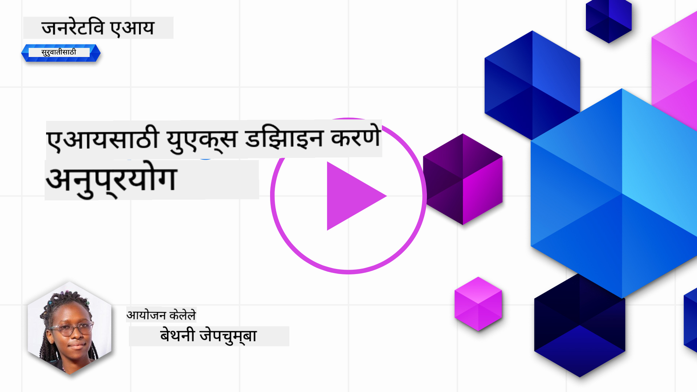
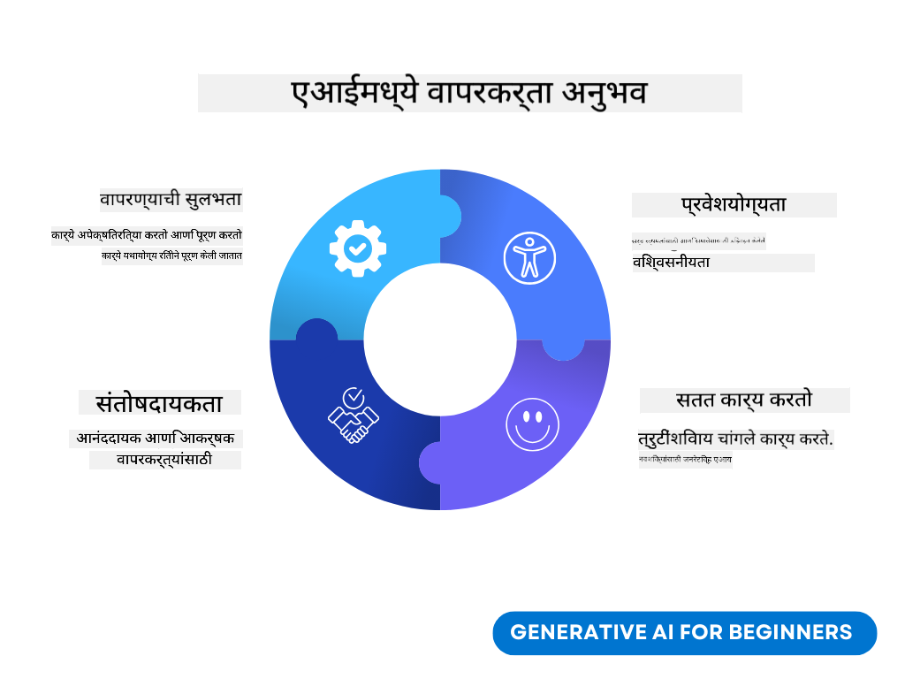
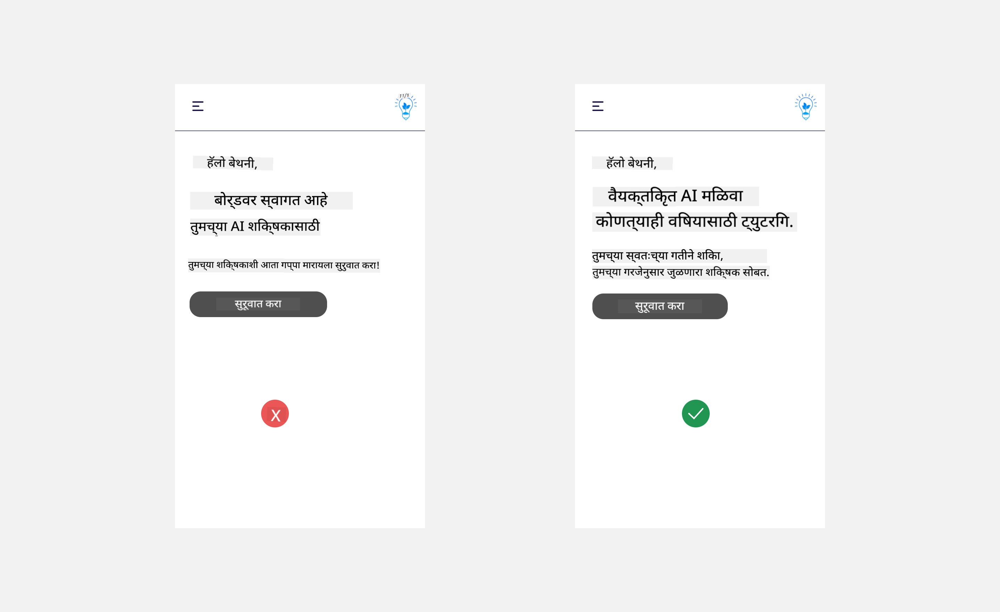
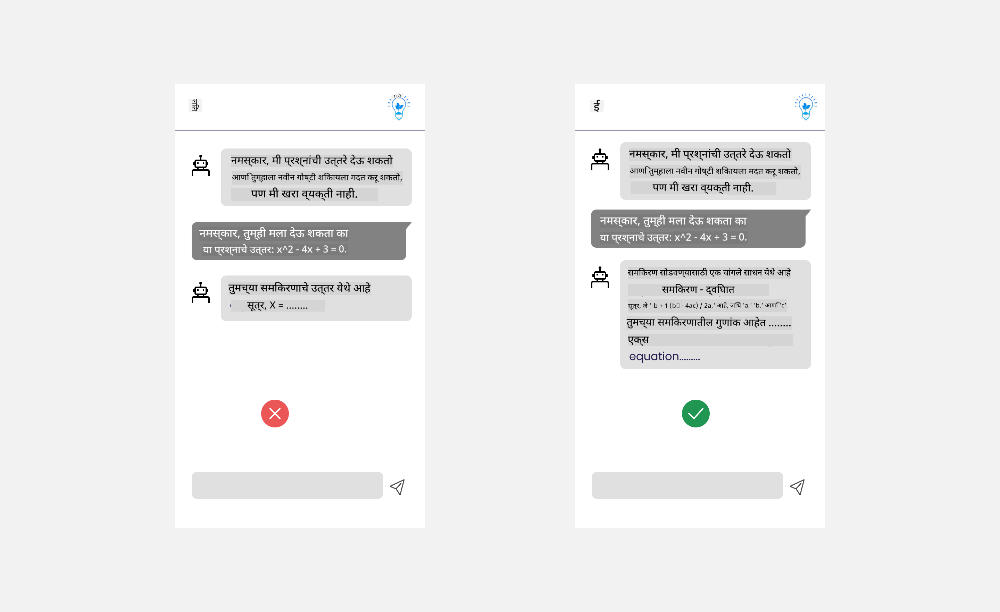
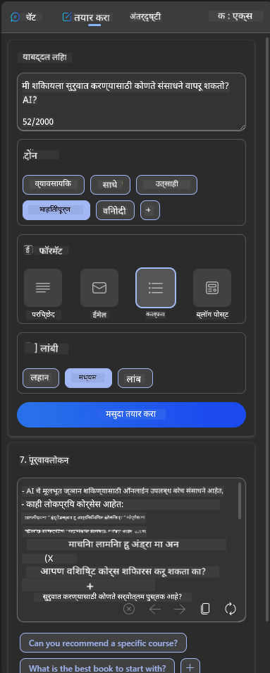
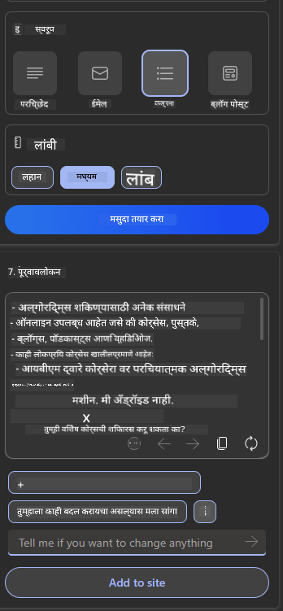
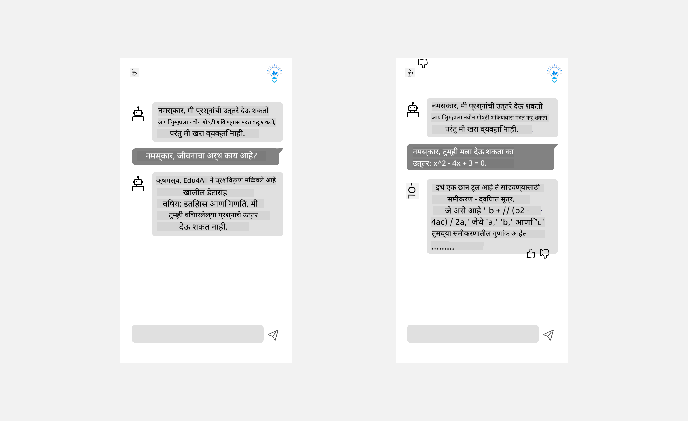

<!--
CO_OP_TRANSLATOR_METADATA:
{
  "original_hash": "ec385b41ee50579025d50cc03bfb3a25",
  "translation_date": "2025-05-19T21:49:47+00:00",
  "source_file": "12-designing-ux-for-ai-applications/README.md",
  "language_code": "mr"
}
-->
# AI अनुप्रयोगांसाठी UX डिझाइन करणे

> _(या धड्याचे व्हिडिओ पाहण्यासाठी वरील प्रतिमेवर क्लिक करा)_

वापरकर्ता अनुभव हा अॅप्स तयार करताना अत्यंत महत्त्वाचा पैलू आहे. वापरकर्त्यांना कार्ये कार्यक्षमतेने पार पाडण्यासाठी तुमचा अॅप वापरण्यायोग्य असावा. कार्यक्षम असणे एक गोष्ट आहे, परंतु तुम्हाला अॅप्स अशा प्रकारे डिझाइन करणे देखील आवश्यक आहे की त्याचा वापर प्रत्येकजण करू शकेल, म्हणजेच ते _प्रवेशयोग्य_ असावे. हा अध्याय या क्षेत्रावर लक्ष केंद्रित करेल जेणेकरून तुम्ही अशी अॅप डिझाइन कराल जी लोक वापरू शकतील आणि वापरू इच्छितात.

## परिचय

वापरकर्ता अनुभव म्हणजे वापरकर्ता विशिष्ट उत्पादन किंवा सेवा कशी वापरतो, मग ते प्रणाली, साधन किंवा डिझाइन असो. AI अनुप्रयोग विकसित करताना, विकसक केवळ वापरकर्ता अनुभव प्रभावी असल्याचे सुनिश्चित करण्यावरच लक्ष केंद्रित करत नाहीत तर नैतिकतेवरही लक्ष केंद्रित करतात. या धड्यात, आम्ही वापरकर्त्याच्या गरजा पूर्ण करणारे कृत्रिम बुद्धिमत्ता (AI) अनुप्रयोग कसे तयार करावे हे कव्हर करतो.

धडा खालील क्षेत्रांचा समावेश करेल:

- वापरकर्ता अनुभवाची ओळख आणि वापरकर्त्याच्या गरजांचे आकलन
- विश्वास आणि पारदर्शकतेसाठी AI अनुप्रयोगांची रचना
- सहयोग आणि अभिप्रायासाठी AI अनुप्रयोगांची रचना

## शिकण्याची उद्दिष्टे

हा धडा घेतल्यानंतर, तुम्हाला खालील गोष्टी करता येतील:

- वापरकर्त्याच्या गरजा पूर्ण करणारे AI अनुप्रयोग कसे तयार करावे हे समजून घ्या.
- विश्वास आणि सहकार्याला प्रोत्साहन देणारे AI अनुप्रयोग डिझाइन करा.

### पूर्वापेक्षित

थोडा वेळ घ्या आणि [वापरकर्ता अनुभव आणि डिझाइन विचार.](https://learn.microsoft.com/training/modules/ux-design?WT.mc_id=academic-105485-koreyst) याबद्दल अधिक वाचा

## वापरकर्ता अनुभवाची ओळख आणि वापरकर्त्याच्या गरजांचे आकलन

आमच्या काल्पनिक शिक्षण स्टार्टअपमध्ये, आमच्याकडे दोन मुख्य वापरकर्ते आहेत, शिक्षक आणि विद्यार्थी. या दोन वापरकर्त्यांपैकी प्रत्येकाची अनोखी गरजा आहेत. वापरकर्ता-केंद्रित डिझाइन वापरकर्त्याला प्राधान्य देते, जे सुनिश्चित करते की उत्पादने संबंधित आणि लाभदायक आहेत ज्यासाठी ती हेतू आहेत.

अनुप्रयोग **उपयुक्त, विश्वासार्ह, प्रवेशयोग्य आणि सुखद** असावा जेणेकरून चांगला वापरकर्ता अनुभव मिळेल.

### वापरण्यायोग्यता

उपयुक्त असणे म्हणजे अनुप्रयोगाच्या हेतूशी जुळणारी कार्यक्षमता असणे, जसे की ग्रेडिंग प्रक्रिया स्वयंचलित करणे किंवा पुनरावलोकनासाठी फ्लॅशकार्ड तयार करणे. ग्रेडिंग प्रक्रिया स्वयंचलित करणारा अनुप्रयोग विद्यार्थ्यांच्या कामाचे पूर्वनिर्धारित निकषांनुसार अचूक आणि कार्यक्षमतेने गुण देऊ शकतो. त्याचप्रमाणे, पुनरावलोकन फ्लॅशकार्ड तयार करणारा अनुप्रयोग त्याच्या डेटावर आधारित संबंधित आणि विविध प्रश्न तयार करू शकतो.

### विश्वासार्हता

विश्वासार्ह असणे म्हणजे अनुप्रयोग त्याचे कार्य सातत्याने आणि त्रुटीशिवाय करू शकतो. तथापि, AI अगदी मानवांसारखे परिपूर्ण नाही आणि त्रुटी होण्याची शक्यता असू शकते. अनुप्रयोग त्रुटी किंवा अनपेक्षित परिस्थितींना सामोरे जाऊ शकतात ज्यासाठी मानवी हस्तक्षेप किंवा दुरुस्ती आवश्यक असते. तुम्ही त्रुटी कशा हाताळता? या धड्याच्या शेवटच्या विभागात, आम्ही AI प्रणाली आणि अनुप्रयोग सहकार्य आणि अभिप्रायासाठी कसे डिझाइन केले जातात ते कव्हर करू.

### प्रवेशयोग्यता

प्रवेशयोग्य असणे म्हणजे विविध क्षमतांच्या वापरकर्त्यांना, अपंगांसह, वापरकर्ता अनुभव विस्तारित करणे, जेणेकरून कोणीही वगळले जाऊ नये. प्रवेशयोग्यता मार्गदर्शक तत्त्वे आणि तत्त्वांचे पालन करून, AI उपाय अधिक समावेशक, वापरण्यायोग्य आणि सर्व वापरकर्त्यांसाठी फायदेशीर बनतात.

### सुखद

सुखद असणे म्हणजे अनुप्रयोगाचा वापर आनंददायक आहे. आकर्षक वापरकर्ता अनुभवाचा वापरकर्त्यावर सकारात्मक परिणाम होऊ शकतो, त्यांना अनुप्रयोगाकडे परत जाण्यासाठी प्रोत्साहित करतो आणि व्यवसाय महसूल वाढवतो.

प्रत्येक आव्हान AI सह सोडवता येत नाही. AI तुमच्या वापरकर्ता अनुभवाला वाढवण्यासाठी येतो, मग ते मॅन्युअल कार्ये स्वयंचलित करणे असो किंवा वापरकर्ता अनुभव वैयक्तिकृत करणे असो.

## विश्वास आणि पारदर्शकतेसाठी AI अनुप्रयोगांची रचना

AI अनुप्रयोगांची रचना करताना विश्वास निर्माण करणे महत्त्वाचे आहे. विश्वास सुनिश्चित करतो की वापरकर्त्याला विश्वास आहे की अनुप्रयोग काम पूर्ण करेल, सातत्याने परिणाम देईल आणि परिणाम वापरकर्त्याच्या गरजेनुसार आहेत. या क्षेत्रातील एक धोका म्हणजे अविश्वास आणि अति-विश्वास. अविश्वास तेव्हा उद्भवतो जेव्हा वापरकर्त्याला AI प्रणालीवर कमी किंवा नाही विश्वास असतो, यामुळे वापरकर्ता तुमचा अनुप्रयोग नाकारतो. अति-विश्वास तेव्हा उद्भवतो जेव्हा वापरकर्ता AI प्रणालीच्या क्षमतेचा अति-आधार घेतो, ज्यामुळे वापरकर्त्यांनी AI प्रणालीवर खूप विश्वास ठेवला जातो. उदाहरणार्थ, अति-विश्वासाच्या बाबतीत स्वयंचलित ग्रेडिंग प्रणालीमुळे शिक्षक काही कागदपत्रे प्रमाणित करण्यासाठी पुरेशी मेहनत घेत नाहीत की ग्रेडिंग प्रणाली चांगली कार्य करते. यामुळे विद्यार्थ्यांसाठी अन्यायकारक किंवा अचूक ग्रेड मिळू शकतात किंवा अभिप्राय आणि सुधारणा करण्याच्या संधी गमावल्या जाऊ शकतात.

विश्वास योग्य ठिकाणी केंद्रस्थानी ठेवण्यासाठी दोन मार्ग म्हणजे स्पष्टीकरण आणि नियंत्रण.

### स्पष्टीकरण

जेव्हा AI निर्णय घेण्यास मदत करतो जसे की भविष्यातील पिढ्यांना ज्ञान देणे, तेव्हा शिक्षक आणि पालकांना AI निर्णय कसे घेतले जातात हे समजणे अत्यंत महत्त्वाचे आहे. हे म्हणजे स्पष्टीकरण - AI अनुप्रयोग निर्णय कसे घेतात हे समजणे. स्पष्टीकरणासाठी डिझाइन करताना AI अनुप्रयोग काय करू शकतो याचे उदाहरणे जोडणे समाविष्ट आहे. उदाहरणार्थ, "AI शिक्षकासह प्रारंभ करा" ऐवजी, प्रणाली वापरू शकते: "तुमच्या नोट्सचा AI वापरून सोप्या पुनरावलोकनासाठी सारांश तयार करा."

AI वापरकर्त्याच्या आणि वैयक्तिक डेटाचा कसा वापर करतो याचे आणखी एक उदाहरण आहे. उदाहरणार्थ, विद्यार्थी व्यक्तिमत्व असलेल्या वापरकर्त्याच्या व्यक्तिमत्वावर आधारित मर्यादा असू शकतात. AI प्रश्नांची उत्तरे उघड करू शकत नाही परंतु वापरकर्त्याला समस्या कशी सोडवता येईल याबद्दल विचार करण्यासाठी मार्गदर्शन करण्यात मदत करू शकतो.

स्पष्टीकरणाचा शेवटचा महत्त्वाचा भाग म्हणजे स्पष्टीकरणाची साधारणता. विद्यार्थी आणि शिक्षक AI तज्ञ नसू शकतात, त्यामुळे अनुप्रयोग काय करू शकतो किंवा करू शकत नाही याचे स्पष्टीकरण साधारण आणि समजण्यास सोपे असावे.

### नियंत्रण

जनरेटिव्ह AI वापरकर्ता आणि AI यांच्यातील सहकार्य निर्माण करते, जिथे उदाहरणार्थ वापरकर्ता विविध परिणामांसाठी संकेत बदलू शकतो. याशिवाय, एकदा आउटपुट तयार झाल्यावर, वापरकर्त्यांना परिणाम बदलता येणे आवश्यक आहे ज्यामुळे त्यांना नियंत्रणाची भावना मिळते. उदाहरणार्थ, Bing वापरताना, तुम्ही तुमचा संकेत स्वरूप, टोन आणि लांबीवर आधारित बदलू शकता. याशिवाय, तुम्ही तुमच्या आउटपुटमध्ये बदल करू शकता आणि खाली दाखवल्याप्रमाणे आउटपुट बदलू शकता:

Bing मधील आणखी एक वैशिष्ट्य जे वापरकर्त्याला अनुप्रयोगावर नियंत्रण देण्यास अनुमती देते ते म्हणजे AI वापरलेल्या डेटामध्ये सहभागी होण्याची आणि बाहेर पडण्याची क्षमता. शाळेच्या अनुप्रयोगासाठी, विद्यार्थ्याला त्याच्या नोट्स तसेच शिक्षकांच्या संसाधनांचा वापर पुनरावलोकन सामग्री म्हणून करायचा असेल.

> AI अनुप्रयोगांची रचना करताना, वापरकर्त्यांनी त्याच्या क्षमतेबद्दल अवास्तव अपेक्षा ठेवू नये हे सुनिश्चित करण्यासाठी हेतू महत्त्वाचा आहे. हे करण्याचा एक मार्ग म्हणजे संकेत आणि परिणाम यांच्यात घर्षण निर्माण करणे. वापरकर्त्याला हे स्मरण करून देणे की हे AI आहे आणि सहकारी मनुष्य नाही

## सहयोग आणि अभिप्रायासाठी AI अनुप्रयोगांची रचना

पूर्वी उल्लेख केल्याप्रमाणे, जनरेटिव्ह AI वापरकर्ता आणि AI यांच्यातील सहकार्य निर्माण करते. बहुतेक संवाद वापरकर्त्याने संकेत इनपुट करणे आणि AI आउटपुट तयार करणे यासह असतात. आउटपुट चुकीचे असल्यास काय? त्रुटी उद्भवल्यास अनुप्रयोग त्यांना कसा हाताळतो? AI वापरकर्त्याला दोष देतो का किंवा त्रुटी स्पष्ट करण्यासाठी वेळ घेतो का?

AI अनुप्रयोग अभिप्राय देण्यासाठी आणि प्राप्त करण्यासाठी तयार केले जावेत. हे केवळ AI प्रणाली सुधारण्यास मदत करत नाही तर वापरकर्त्यांसह विश्वास निर्माण करते. अभिप्राय लूप डिझाइनमध्ये समाविष्ट केला पाहिजे, उदाहरण म्हणून आउटपुटवर साधा अंगठा वर किंवा खाली असू शकतो.

हे हाताळण्याचा आणखी एक मार्ग म्हणजे प्रणालीची क्षमता आणि मर्यादा स्पष्टपणे संवाद साधणे. जेव्हा वापरकर्ता AI क्षमतेच्या पलीकडे काहीतरी मागणी करताना त्रुटी करतो, तेव्हा हे हाताळण्याचा मार्ग देखील असावा, खाली दाखवल्याप्रमाणे.

सिस्टम त्रुटी अनुप्रयोगांसह सामान्य आहेत जिथे वापरकर्त्याला AI च्या कक्षेबाहेरील माहितीची मदत आवश्यक असू शकते किंवा अनुप्रयोग वापरकर्ता किती प्रश्न/विषय तयार करू शकतो यावर मर्यादा असू शकते. उदाहरणार्थ, मर्यादित विषयांवर डेटा असलेल्या AI अनुप्रयोगासाठी, उदाहरणार्थ, इतिहास आणि गणित, भूगोलाशी संबंधित प्रश्न हाताळू शकत नाही. हे कमी करण्यासाठी, AI प्रणाली अशा प्रकारे प्रतिसाद देऊ शकते: "माफ करा, आमचे उत्पादन खालील विषयांवर डेटासह प्रशिक्षित केले गेले आहे....., मी तुम्ही विचारलेल्या प्रश्नाला प्रतिसाद देऊ शकत नाही."

AI अनुप्रयोग परिपूर्ण नाहीत, त्यामुळे ते चुका करण्यास बांधील आहेत. तुमचे अनुप्रयोग डिझाइन करताना, तुम्ही वापरकर्त्यांकडून अभिप्राय आणि त्रुटी हाताळणीसाठी जागा निर्माण केली पाहिजे ज्यामध्ये सोपी आणि सहज स्पष्टीकरण देता येईल.

## असाइनमेंट

आतापर्यंत तुम्ही तयार केलेल्या कोणत्याही AI अॅप्सचा विचार करा, तुमच्या अॅपमध्ये खालील चरणांची अंमलबजावणी करण्याचा विचार करा:

- **सुखद:** तुमचा अॅप अधिक सुखद कसा बनवता येईल याचा विचार करा. तुम्ही सर्वत्र स्पष्टीकरणे जोडत आहात का? तुम्ही वापरकर्त्याला शोधण्यासाठी प्रोत्साहित करत आहात का? तुम्ही तुमच्या त्रुटी संदेशांची शब्दरचना कशी करत आहात?

- **वापरण्यायोग्यता:** वेब अॅप तयार करणे. तुमचा अॅप माउस आणि कीबोर्डद्वारे नेव्हिगेट करण्यायोग्य आहे याची खात्री करा.

- **विश्वास आणि पारदर्शकता:** AI आणि त्याच्या आउटपुटवर पूर्णपणे विश्वास ठेवू नका, आउटपुट सत्यापित करण्यासाठी प्रक्रियेत मानव कसा जोडता येईल याचा विचार करा. विश्वास आणि पारदर्शकता साध्य करण्याचे इतर मार्ग देखील विचार करा आणि अंमलात आणा.

- **नियंत्रण:** अनुप्रयोगाला प्रदान केलेल्या डेटाचे नियंत्रण वापरकर्त्याला द्या. AI अनुप्रयोगामध्ये डेटा संकलनात सहभागी होण्याची आणि बाहेर पडण्याची पद्धत अंमलात आणा.

## तुमचे शिक्षण सुरू ठेवा!

हा धडा पूर्ण केल्यानंतर, आमचे [जनरेटिव्ह AI लर्निंग संग्रह](https://aka.ms/genai-collection?WT.mc_id=academic-105485-koreyst) तपासा जेणेकरून तुमचे जनरेटिव्ह AI ज्ञान वाढवणे सुरू ठेवा!

धडा 13 कडे जा, जिथे आम्ही AI अनुप्रयोग सुरक्षित करण्याच्या पद्धती पाहू! (../13-securing-ai-applications/README.md?WT.mc_id=academic-105485-koreyst)

**अस्वीकरण**:  
हा दस्तऐवज AI भाषांतर सेवा [Co-op Translator](https://github.com/Azure/co-op-translator) वापरून अनुवादित केला गेला आहे. आम्ही अचूकतेसाठी प्रयत्नशील असलो तरी कृपया लक्षात ठेवा की स्वयंचलित भाषांतरांमध्ये त्रुटी किंवा अचूकतेची कमतरता असू शकते. मूळ भाषेतील दस्तऐवज हा अधिकृत स्रोत मानला पाहिजे. महत्त्वपूर्ण माहिती साठी, व्यावसायिक मानवी भाषांतराची शिफारस केली जाते. या भाषांतराचा वापर केल्यामुळे उद्भवणाऱ्या कोणत्याही गैरसमज किंवा चुकीच्या अर्थासाठी आम्ही जबाबदार नाही.