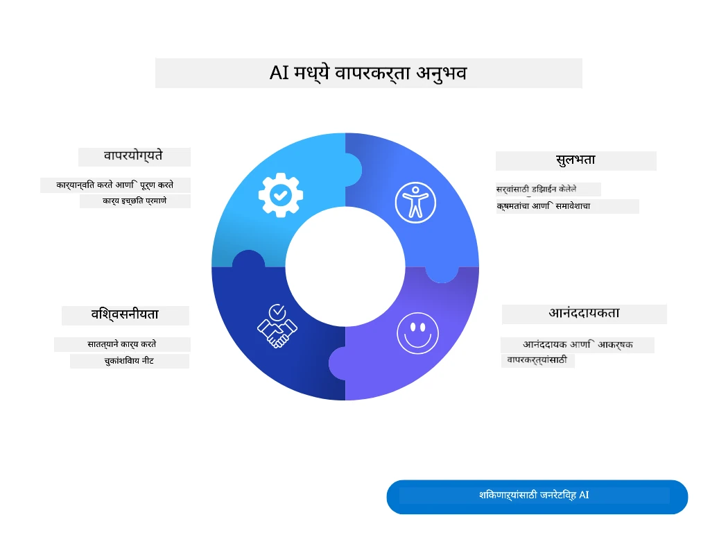
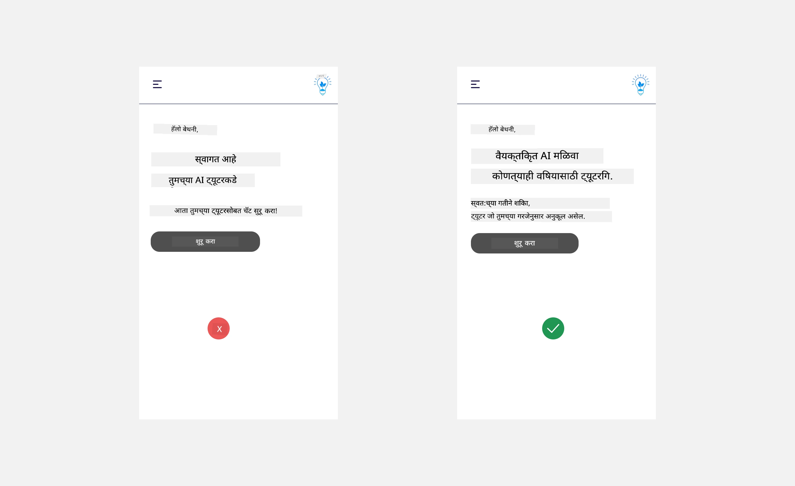
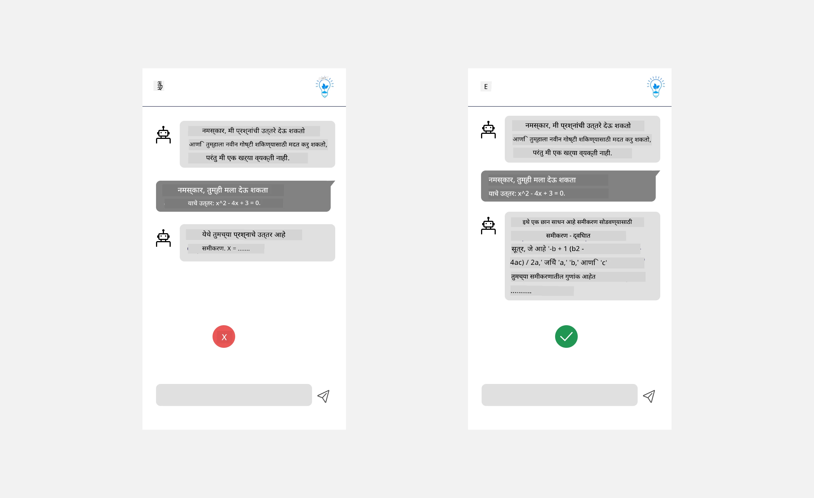
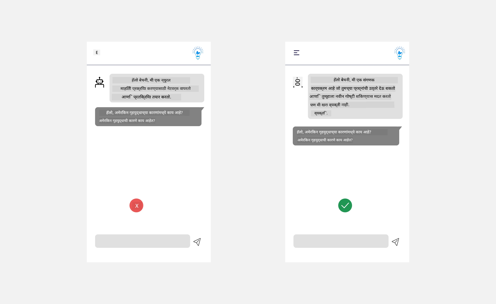
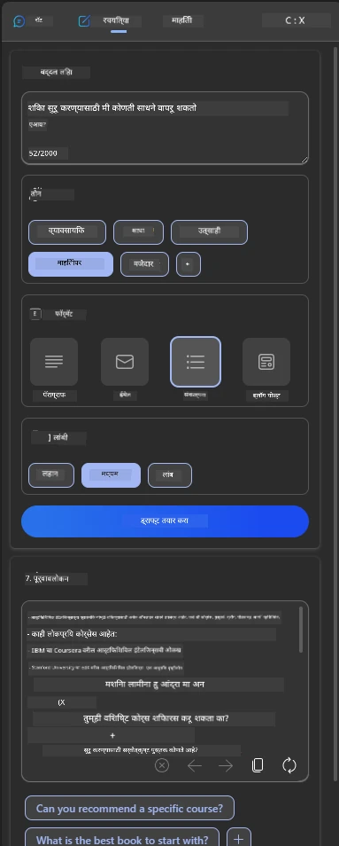
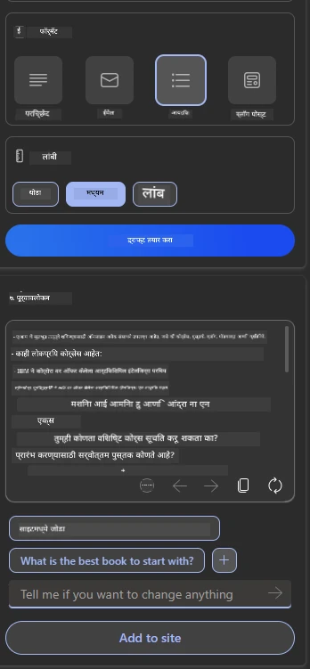
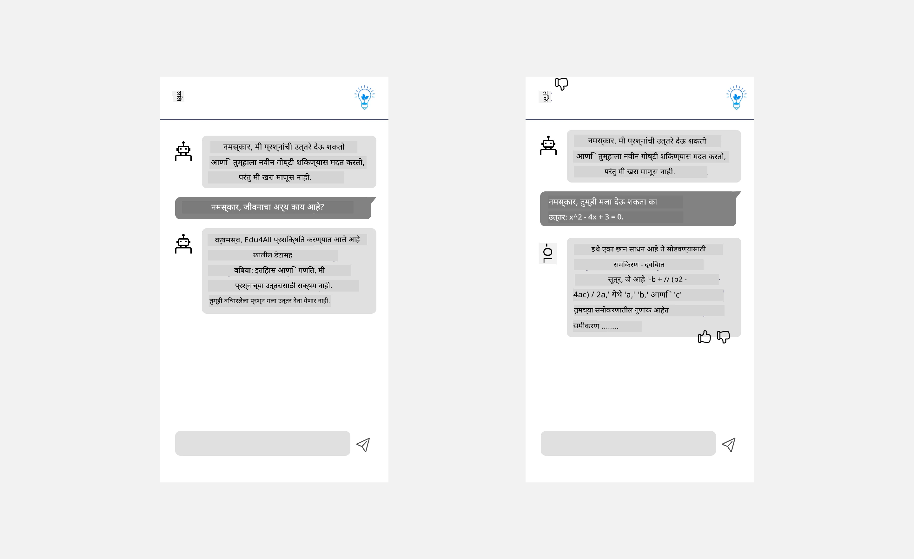

# एआय अनुप्रयोगांसाठी यूएक्स डिझाइन करणे

> _(या धड्याचा व्हिडिओ पहाण्यासाठी वरील चित्रावर क्लिक करा)_

यूजर अनुभव हे अॅप तयार करताना फार महत्त्वाचे अंग आहे. वापरकर्त्यांनी तुमचा अॅप कार्यक्षम मार्गाने वापरता यावा लागतो जेणेकरून ते कामे पार पाडू शकतील. कार्यक्षम असणे एक बाब आहे पण तुम्हाला असे अॅप्स डिझाइन करावे लागतात जे प्रत्येकाला वापरता येतील, म्हणजे _सुलभ_ असावेत. हा प्रकरण या भागावर लक्ष केंद्रीत करेल जेणेकरून तुम्ही असा अॅप डिझाइन करू शकाल जो लोक वापरू शकतील आणि वापरायला इच्छुक असतील.

## परिचय

यूजर अनुभव म्हणजे वापरकर्ता कशाप्रकारे एखाद्या विशिष्ट उत्पादन किंवा सेवेशी संवाद साधतो आणि त्याचा वापर करतो, ते सिस्टम, साधन किंवा डिझाइन असो. एआय अनुप्रयोग विकसित करताना, विकसक केवळ वापरकर्ता अनुभव प्रभावी कसा असेल यावर नव्हे तर नैतिकतेवर देखील लक्ष देतात. या धड्यात, आपण अशा आर्टिफिशियल इंटेलिजन्स (AI) अनुप्रयोगांची निर्मिती कशी करायची आहे जे वापरकर्त्यांच्या गरजा पूर्ण करतात हे पाहणार आहोत.

धडा खालील भागांवर लक्ष देईल:

- यूजर अनुभव आणि वापरकर्त्यांच्या गरजांची समज
- विश्वास आणि पारदर्शकतेसाठी एआय अनुप्रयोग डिझाइन करणे
- सहकार्य आणि अभिप्रायासाठी एआय अनुप्रयोग डिझाइन करणे

## शिक्षणाचे उद्दिष्टे

हा धडा पूर्ण केल्यानंतर, तुम्ही सक्षम असाल:

- वापरकर्त्यांच्या गरजा पूर्ण करणारे AI अनुप्रयोग कसे तयार करायचे हे समजून घेणे.
- विश्वास आणि सहकार्य वाढवणारे AI अनुप्रयोग डिझाइन करणे.

### पूर्वअट

काही वेळ घेत काही अधिक वाचा [यूजर अनुभव आणि डिझाइन थिंकिंगबद्दल.](https://learn.microsoft.com/training/modules/ux-design?WT.mc_id=academic-105485-koreyst)

## यूजर अनुभव आणि वापरकर्त्यांच्या गरजांची समज

आमच्या काल्पनिक शिक्षण स्टार्टअपने दोन मुख्य वापरकर्ते आहेत, शिक्षक आणि विद्यार्थी. प्रत्येक वापरकर्त्याच्या गरजा भिन्न आहेत. वापरकर्त्याभिमुख डिझाइन हा वापरकर्त्यावर प्राधान्य देतो याची खात्री करतो की उत्पादने ज्यासाठी आहेत त्यांच्यासाठी संबंधित आणि लाभदायक आहेत.

अॅप्लिकेशनकडे **उपयुक्त, विश्वासार्ह, सुलभ आणि आनंददायक** असणे आवश्यक आहे जेणेकरून चांगला वापरकर्ता अनुभव मिळू शकेल.

### वापर सुलभता

उपयुक्त असणे म्हणजे अॅप्लिकेशनमध्ये त्याच्या उद्दिष्टाशी जुळणारी कार्यक्षमता असणे, जसे की ग्रेडिंग प्रक्रिया स्वयंचलित करणे किंवा पुनरावलोकनासाठी फ्लॅशकार्ड तयार करणे. ग्रेडिंग प्रक्रिया स्वयंचलित करणारे अॅप विद्यार्थींच्या कामावर ठरवलेल्या निकषांनुसार अचूक आणि कार्यक्षमतेने गुण देऊ शकले पाहिजे. तसंच पुनरावलोकन फ्लॅशकार्ड तयार करणारे अॅप त्याच्या डेटावरुन संबंधित आणि वैविध्यपूर्ण प्रश्न तयार करू शकले पाहिजे.

### विश्वासार्हता

विश्वासार्ह असणे म्हणजे अॅप्लिकेशन सतत आणि त्रुटीशिवाय त्याचे कार्य पार पाडू शकणे. परंतु, AI माणसांसारखे परिपूर्ण नाही आणि कधीकधी त्रुटी येऊ शकतात. अॅप्लिकेशन्स त्रुटींकडे किंवा अनपेक्षित परिस्थितींना सामोरे जाऊ शकतात ज्यासाठी मानवी हस्तक्षेप किंवा दुरुस्ती आवश्यक असू शकते. तुम्ही त्रुटींना कसे हाताळता? या धड्याच्या शेवटच्या भागात आपण पाहणार आहोत की AI प्रणाली आणि अनुप्रयोग सहकार्य आणि अभिप्रायासाठी कसे डिझाइन केले जातात.

### सुलभता

सुलभ असणे म्हणजे विभिन्न क्षमता असलेल्या वापरकर्त्यांपर्यंत वापरकर्ता अनुभव पोहोचवणे, ज्यात अपंगत्व असलेले वापरकर्तेही समाविष्ट आहेत, याची खात्री करणे की कोणीही वगळले जात नसावे. सुलभता मार्गदर्शक तत्त्वे आणि तत्त्वे पाळून, AI सोल्युशन्स अधिक सर्वसमावेशक, वापरास सुलभ, आणि सर्व वापरकर्त्यांसाठी लाभदायक बनतात.

### आनंददायक

आनंददायक असणे म्हणजे अॅप्लिकेशन वापरणे आनंददायक असणे. आकर्षक वापरकर्ता अनुभवाचा वापरकर्त्यावर सकारात्मक परिणाम होतो ज्यामुळे ते अॅप्लिकेशनमध्ये परत येण्यास प्रोत्साहित होतात आणि व्यवसायाचे उत्पन्न वाढते.

प्रत्येक आव्हान एआयने सोडवता येत नाही. AI तुमचा वापरकर्ता अनुभव सुधारण्यासाठी येतो, असं जरी ते मॅन्युअल कामे स्वयंचलित करणे असो किंवा वापरकर्त्यांच्या अनुभवांना वैयक्तिकृत करणे असो.

## विश्वास आणि पारदर्शकतेसाठी एआय अनुप्रयोग डिझाइन करणे

AI अनुप्रयोग डिझाइन करताना विश्वास निर्माण करणे अत्यंत महत्त्वाचे असते. विश्वासामुळे वापरकर्त्याला खात्री होते की अॅप्लिकेशन काम पूर्ण करेल, सातत्याने परिणाम देईल आणि निकाल वापरकर्त्याच्या गरजेनुसार असेल. या क्षेत्रातील जो धोका आहे तो म्हणजे अविश्वास आणि जास्त विश्वास. अविश्वास तेव्हा निर्माण होतो जेव्हा वापरकर्त्याला AI प्रणालीवर फारसा किंवा कोणताही विश्वास नसतो, ज्यामुळे वापरकर्ता तुमचा अॅप्लिकेशन वापरणे नाकारतो. जास्त विश्वास तेव्हा होतो जेव्हा वापरकर्ता AI प्रणालीच्या क्षमतेचा अतिमूल्यांकन करतो, ज्यामुळे वापरकर्ते AI प्रणालीवर अत्यधिक विश्वास ठेवतात. उदाहरणार्थ, जर ग्रेडिंग प्रणालीवर जास्त विश्वास ठेवला गेला तर शिक्षक कदाचित काही पेपर्स तपासलेच नाहीत त्यामुळे विद्यार्थ्यांसाठी अन्याय्य किंवा अचूक नसलेले ग्रेड तयार होऊ शकतात किंवा अभिप्राय देण्याची आणि सुधारणा करण्याची संधी गमावली जाते.

विश्वास डिझाइनच्या केंद्रावर ठेवण्यासाठी दोन मार्ग आहेत, ते म्हणजे स्पष्टता आणि नियंत्रण.

### स्पष्टता

जेव्हा AI भविष्यातील पिढ्यांना ज्ञान देण्यासाठी निर्णय घेतो, तेव्हा शिक्षक आणि पालकांना AI निर्णय कसे घेतले जातात हे समजणे फार महत्त्वाचे असते. ही स्पष्टता आहे - AI अनुप्रयोग निर्णय कसे करतात हे समजणे. स्पष्टतेसाठी डिझाइन करताना अशा माहित्या समाविष्ट केल्या जातात ज्या AI कसे निर्णयावर पोहोचले हे अधोरेखित करतात. प्रेक्षकांनी समजले पाहिजे की आऊटपुट एआयने बनवले आहे, माणसाने नाही. उदाहरणार्थ, "तुमच्या ट्यूटरशी आत्ताच गप्पा प्रारंभ करा" म्हणण्याऐवजी "AI ट्यूटर वापरा जो तुमच्या गरजेनुसार समायोजित होतो आणि तुमच्या गतीवर शिकण्यास मदत करतो" असे म्हणावे.

दुसरे उदाहरण म्हणजे AI वापरकर्ता आणि वैयक्तिक डेटा कसा वापरतो. उदाहरणार्थ, विद्यार्थी असलेल्या वापरकर्त्याला त्याच्या व्यक्तिमत्त्वानुसार काही मर्यादा असू शकतात. AI प्रश्नांची उत्तरे थेट देऊ शकत नाही पण तो वापरकर्त्याला मार्गदर्शन करू शकतो की ते प्रश्न कसे सोडवू शकतात याबाबत विचार करायला.

स्पष्टीकरणाचा आणखी एक महत्त्वाचा भाग म्हणजे स्पष्टीकरणाच्या सोप्या करणे. विद्यार्थी आणि शिक्षक एआय तज्ञ नसू शकतात, त्यामुळे अॅप्लिकेशन काय करू शकते किंवा काय करू शकत नाही याचे स्पष्टीकरण सोपे आणि समजायला सोपे असायला हवे.

### नियंत्रण

जनरेटिव्ह AI वापरकर्ता आणि AI यांचे सहकार्य तयार करतो, जिथे वापरकर्ता विविध निकालांसाठी प्रॉम्प्ट्स बदलू शकतो. शिवाय, जेव्हा आऊटपुट तयार होते, तेव्हा वापरकर्त्यांनी निकालात बदल करण्याचा पर्याय असावा ज्यामुळे त्यांना नियंत्रणाचे भान मिळते. उदाहरणार्थ, Bing वापरताना तुम्ही तुमच्या प्रॉम्प्टचा स्वरूप, टोन आणि लांबीवर आधारित बदल करू शकता. शिवाय, तुम्ही तुमच्या आऊटपुटमध्ये बदल देखील करू शकता आणि पुढील प्रमाणे आऊटपुट सुधारू शकता:

Bing मधील आणखी एक वैशिष्ट्य जे वापरकर्त्याला अॅप्लिकेशनवर नियंत्रण देते ते म्हणजे वापरकर्त्याला डेटा वापरण्यासाठी ऑप्ट-इन आणि ऑप्ट-आउट करण्याचा पर्याय. शाळेच्या अॅप्लिकेशनसाठी, विद्यार्थी आपल्या नोट्स तसेच शिक्षकांचे संसाधने पुनरावलोकनासाठी वापरू इच्छित असू शकतात.

> AI अनुप्रयोग डिझाइन करताना, वापरकर्त्यांना त्याच्या क्षमतांविषयी अवास्तव अपेक्षा न बाळगता अति विश्वास न ठेवण्यास भाग पाडणे गरजेचे असते. यासाठी एक मार्ग म्हणजे प्रॉम्प्ट आणि निकाल यामध्ये काही अडथळ्यांचा समावेश करणे. वापरकर्त्याला स्मरण करून देणे की हे AI आहे, माणूस नाही.

## सहकार्य आणि अभिप्रायासाठी एआय अनुप्रयोग डिझाइन करणे

पूर्वी नमूद केल्याप्रमाणे, जनरेटिव्ह AI वापरकर्ता आणि AI यांच्यात सहकार्य तयार करतो. बहुतेक संवाद वापरकर्ता प्रॉम्प्ट देतो आणि AI आऊटपुट तयार करतो या स्वरूपात असतात. जर आऊटपुट चुकीचे असेल तर? त्रुटी आल्यास अॅप्लिकेशन कशी हाताळते? AI वापरकर्त्याला दोष देते का किंवा त्रुटीची स्पष्टता देण्यासाठी वेळ घालवते?

AI अनुप्रयोगांना अभिप्राय देणे आणि घेणे हे समाविष्ट केलेले असावे. यामुळे केवळ AI प्रणाली सुधारतेच नाही तर वापरकर्त्यांसोबत विश्वासही वाढतो. डिझाइनमध्ये अभिप्राय लूप असावा, उदाहरणार्थ, आऊटपुटवर साधा अंगठा वर किंवा खाली देण्याचा पर्याय.

ही त्रुटी हाताळण्याची आणखी एक पद्धत म्हणजे प्रणालीच्या क्षमता आणि मर्यादा स्पष्टपणे सांगणे. जेव्हा वापरकर्ता AI क्षमतेच्या पलिकडे काही विचारतो, तेव्हा ती त्रुटी हाताळण्याचा मार्ग देखील असला पाहिजे, पुढीलप्रमाणे.

अॅप्लिकेशनमध्ये त्रुटी सामान्य आहेत जिथे वापरकर्त्याला AI च्या कार्यक्षेत्राच्या पलीकडे माहितीची मदत लागते किंवा अनुप्रयोगावर वापरकर्त्याला किती प्रश्न/विषयांची सारांश तयार करता येतील त्याची मर्यादा असू शकते. उदाहरणार्थ, AI अनुप्रयोग विशिष्ट विषयांवर प्रशिक्षण घेतलेला असू शकतो जसे की इतिहास आणि गणित तर तो भूगोल विषयांवरील प्रश्न हाताळू शकत नाही. हे टाळण्यासाठी, AI प्रणाली खालीलप्रमाणे उत्तर देऊ शकते: "क्षमस्व, आमच्या उत्पादनाला खालील विषयांमध्ये डेटा द्वारे प्रशिक्षण देण्यात आले आहे....., मी तुम्ही विचारलेला प्रश्न उत्तर देऊ शकत नाही."

AI अनुप्रयोग परिपूर्ण नाहीत, त्यामुळे ते चुका करणारच. तुमचे अनुप्रयोग डिझाइन करताना, वापरकर्त्यांकडून अभिप्राय घेण्याची आणि त्रुटी हाताळणी करण्याची व्यवस्था सोपी आणि समजायला सोपी बनवावी.

## असाईनमेंट

अद्याप पर्यंत तुमच्या द्वारा तयार केलेल्या कोणत्याही AI अॅप्लिकेशन्समध्ये खालील टप्पे समाविष्ट करण्याचा विचार करा:

- **आनंददायक:** तुमचा अॅप आणखी आनंददायक कसा बनवता येईल याचा विचार करा. तुम्ही सगळीकडे स्पष्टीकरणे देत आहात का? तुम्ही वापरकर्त्याला शोध घेण्यास प्रोत्साहित करत आहात का? तुमच्या त्रुटी संदेशांचे स्वरूप कसे आहे?

- **वापर सुलभता:** वेब अॅप तयार करताना पक्का करा की तुमचा अॅप माऊस आणि कीबोर्ड दोघांनी नेव्हिगेट करता येईल.

- **विश्वास आणि पारदर्शकता:** AI आणि त्याच्या आऊटपुटवर पूर्ण विस्वास ठेवू नका, आऊटपुटची पडताळणी करण्यासाठी एखादा मानवी सहभाग कसा घालू शकता हे विचार करा. तसेच, विश्वास आणि पारदर्शकता साध्य करण्याचे इतर मार्गही विचार करून अमलात आणा.

- **नियंत्रण:** वापरकर्त्याला त्यांचा डेटा अॅप्लिकेशनला देण्यावर नियंत्रण द्या. AI अनुप्रयोगात डेटा संकलनासाठी वापरकर्त्याला ऑप्ट-इन आणि ऑप्ट-आउट करण्याचा पर्याय पुरवा.

<!-- ## [पोस्ट-धडा क्विझ](../../../12-designing-ux-for-ai-applications/quiz-url) -->

## तुमचे शिक्षण सुरू ठेवा!

हा धडा पूर्ण केल्यानंतर, आमच्या [जनरेटिव्ह AI शिक्षण संग्रह](https://aka.ms/genai-collection?WT.mc_id=academic-105485-koreyst) ला भेट द्या आणि तुमच्या जनरेटिव्ह AI ज्ञानाचा स्तर वाढवत राहा!

पुढील धडा 13 कडे चला, जिथे आपण पाहणार आहोत की [AI अनुप्रयोग सुरक्षित कसे करावे](../13-securing-ai-applications/README.md?WT.mc_id=academic-105485-koreyst)!

---

<!-- CO-OP TRANSLATOR DISCLAIMER START -->
**अस्वीकरण**:
हा दस्तऐवज AI भाषांतर सेवा [Co-op Translator](https://github.com/Azure/co-op-translator) चा वापर करून अनुवादित केला आहे. जरी आम्ही अचूकतेसाठी प्रयत्न करतो, तरी कृपया लक्षात घ्या की स्वयंचलित भाषांतरांमध्ये त्रुटी किंवा अचूकतेची कमतरता असू शकते. मूळ दस्तऐवज त्याच्या मूळ भाषेत अधिकृत स्रोत मानला पाहिजे. महत्त्वाची माहिती असल्यास, व्यावसायिक मानवी भाषांतराची शिफारस केली जाते. या भाषांतराच्या वापरामुळे उद्भवणाऱ्या कोणत्याही गैरसमज किंवा चुकीच्या अर्थलावणीसाठी आम्ही जबाबदार नाही.
<!-- CO-OP TRANSLATOR DISCLAIMER END -->