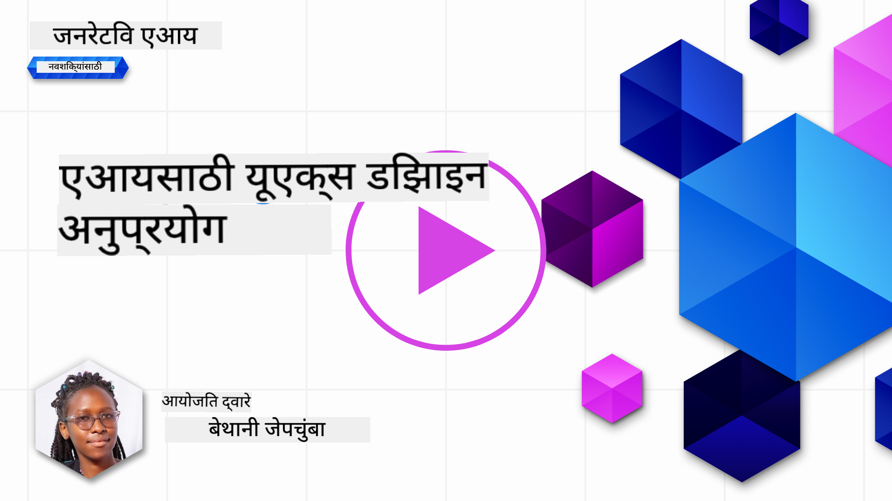
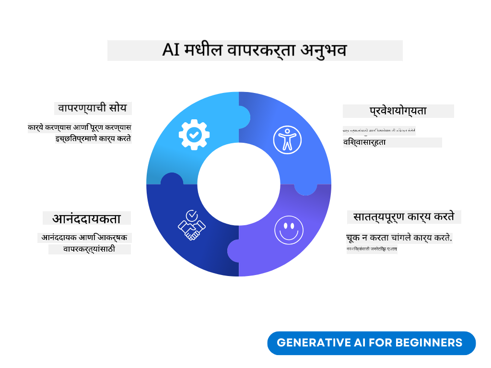
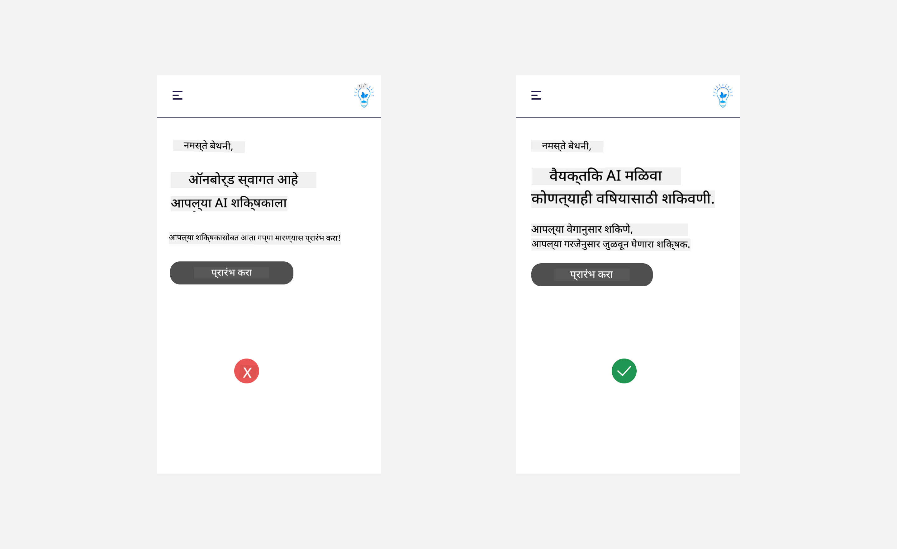
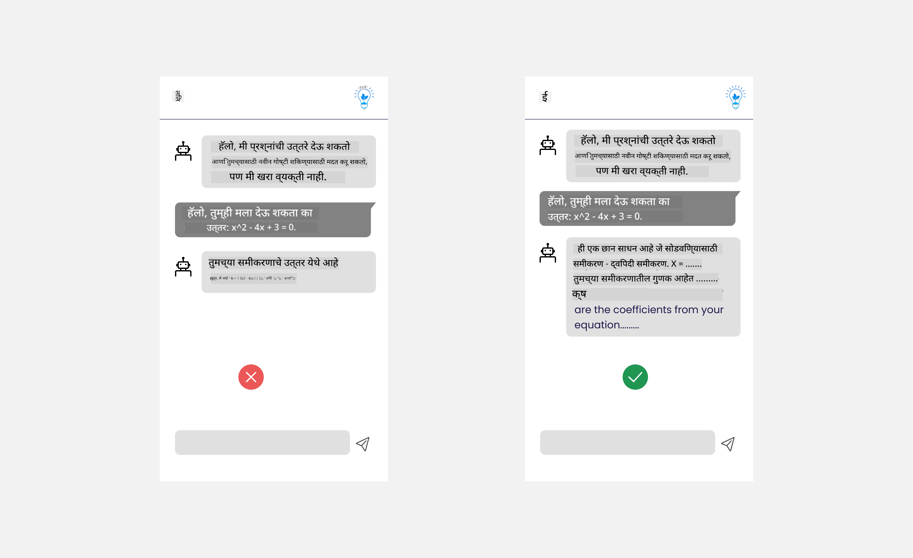
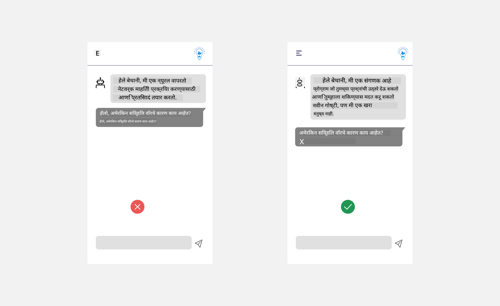
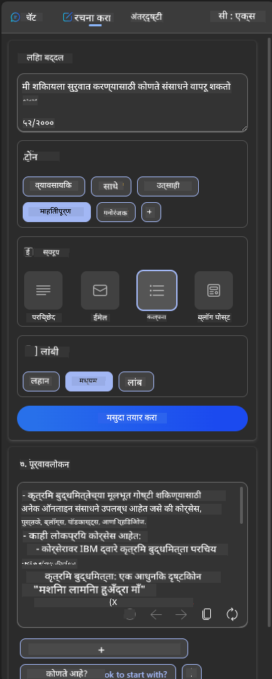
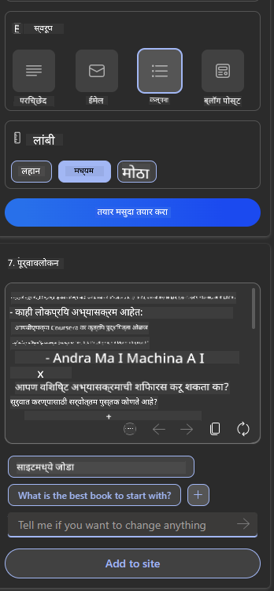
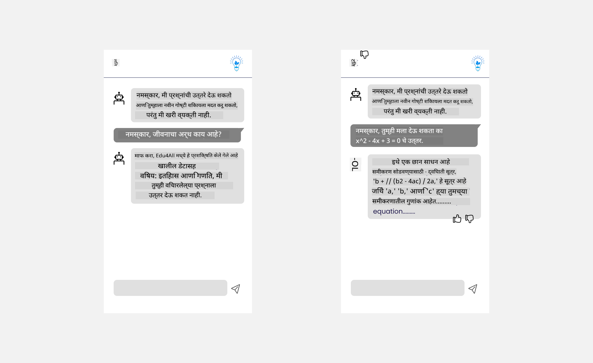

<!--
CO_OP_TRANSLATOR_METADATA:
{
  "original_hash": "ec385b41ee50579025d50cc03bfb3a25",
  "translation_date": "2025-06-25T20:16:55+00:00",
  "source_file": "12-designing-ux-for-ai-applications/README.md",
  "language_code": "mr"
}
-->
# AI अनुप्रयोगांसाठी UX डिझाइन करणे

> _(या धड्याचा व्हिडिओ पाहण्यासाठी वरच्या प्रतिमेवर क्लिक करा)_

वापरकर्ता अनुभव हा अॅप्स तयार करण्याचा एक अतिशय महत्त्वाचा पैलू आहे. वापरकर्त्यांना कार्ये करण्यासाठी तुमचा अॅप कार्यक्षमतेने वापरता येणे आवश्यक आहे. कार्यक्षम असणे ही एक गोष्ट आहे परंतु तुम्हाला अॅप्स डिझाइन करणे देखील आवश्यक आहे जेणेकरून ते सर्वांद्वारे वापरले जाऊ शकतील, त्यांना _सुलभ_ बनवता येईल. हे प्रकरण या क्षेत्रावर लक्ष केंद्रित करेल जेणेकरून तुम्ही असा अॅप डिझाइन कराल जो लोक वापरू शकतील आणि वापरू इच्छित आहेत.

## परिचय

वापरकर्ता अनुभव म्हणजे वापरकर्ता विशिष्ट उत्पादन किंवा सेवा, प्रणाली, साधन किंवा डिझाइनसह कसे संवाद साधतो आणि वापरतो. AI अनुप्रयोग विकसित करताना, विकसक केवळ वापरकर्ता अनुभव प्रभावी बनवण्यावरच लक्ष केंद्रित करत नाहीत तर नैतिकतेवर देखील लक्ष केंद्रित करतात. या धड्यात, आम्ही वापरकर्त्यांच्या गरजा पूर्ण करणारे कृत्रिम बुद्धिमत्ता (AI) अनुप्रयोग कसे तयार करायचे ते कव्हर करतो.

धडा खालील क्षेत्रे समाविष्ट करेल:

- वापरकर्ता अनुभवाची ओळख आणि वापरकर्त्याच्या गरजा समजून घेणे
- विश्वास आणि पारदर्शकतेसाठी AI अनुप्रयोग डिझाइन करणे
- सहयोग आणि अभिप्रायासाठी AI अनुप्रयोग डिझाइन करणे

## शिकण्याची उद्दिष्टे

हा धडा घेतल्यानंतर, तुम्ही सक्षम असाल:

- वापरकर्त्याच्या गरजा पूर्ण करणारे AI अनुप्रयोग कसे तयार करावे हे समजून घ्या.
- विश्वास आणि सहकार्याला प्रोत्साहन देणारे AI अनुप्रयोग डिझाइन करा.

### पूर्वअट

थोडा वेळ काढा आणि [वापरकर्ता अनुभव आणि डिझाइन विचार](https://learn.microsoft.com/training/modules/ux-design?WT.mc_id=academic-105485-koreyst) याबद्दल अधिक वाचा.

## वापरकर्ता अनुभवाची ओळख आणि वापरकर्त्याच्या गरजा समजून घेणे

आमच्या काल्पनिक शिक्षण स्टार्टअपमध्ये, आमच्याकडे दोन प्राथमिक वापरकर्ते आहेत, शिक्षक आणि विद्यार्थी. दोन्ही वापरकर्त्यांमध्ये अद्वितीय गरजा आहेत. वापरकर्त्याकेंद्रित डिझाइन वापरकर्त्याला प्राधान्य देते जेणेकरून उत्पादने संबंधित आणि ज्यासाठी ती उद्दिष्टित आहेत त्यांच्यासाठी फायदेशीर आहेत याची खात्री करणे.

अर्ज **उपयुक्त, विश्वासार्ह, सुलभ आणि आनंददायक** असावा जेणेकरून चांगला वापरकर्ता अनुभव मिळू शकेल.

### उपयुक्तता

उपयुक्त असणे म्हणजे अनुप्रयोगात त्याच्या इच्छित उद्देशाशी जुळणारे कार्यक्षमता असणे, जसे की ग्रेडिंग प्रक्रिया स्वयंचलित करणे किंवा पुनरावलोकनासाठी फ्लॅशकार्ड तयार करणे. ग्रेडिंग प्रक्रिया स्वयंचलित करणारे अनुप्रयोग पूर्वनिर्धारित निकषांवर आधारित विद्यार्थ्यांच्या कामाचे अचूक आणि कार्यक्षमतेने गुण देण्यास सक्षम असावे. त्याचप्रमाणे, पुनरावलोकन फ्लॅशकार्ड तयार करणारा अनुप्रयोग त्याच्या डेटावर आधारित संबंधित आणि विविध प्रश्न तयार करण्यात सक्षम असावा.

### विश्वासार्हता

विश्वसनीय असणे म्हणजे अनुप्रयोग त्याचे कार्य सातत्याने आणि त्रुटीशिवाय करू शकतो. तथापि, AI जसे की माणसे परिपूर्ण नाहीत आणि त्रुटी होण्याची शक्यता आहे. अनुप्रयोगांना त्रुटी किंवा अप्रत्याशित परिस्थितींचा सामना करावा लागू शकतो ज्यांना मानवी हस्तक्षेप किंवा दुरुस्तीची आवश्यकता असते. तुम्ही त्रुटी कशा हाताळता? या धड्याच्या शेवटच्या विभागात, आम्ही सहकार्य आणि अभिप्रायासाठी AI प्रणाली आणि अनुप्रयोग कसे डिझाइन केले जातात ते कव्हर करू.

### प्रवेशयोग्यता

सुलभ असणे म्हणजे विविध क्षमतांसह वापरकर्त्यांना, अपंगत्व असलेल्यांसह, कोणालाही वगळले जाऊ नये याची खात्री करून वापरकर्ता अनुभव विस्तारित करणे. प्रवेशयोग्यता मार्गदर्शक तत्त्वे आणि तत्त्वांचे पालन करून, AI सोल्यूशन्स अधिक समावेशक, वापरण्यायोग्य आणि सर्व वापरकर्त्यांसाठी फायदेशीर बनतात.

### आनंददायक

आनंददायक असणे म्हणजे अनुप्रयोग वापरण्यास आनंददायक असणे. आकर्षक वापरकर्ता अनुभवाचा वापरकर्त्यावर सकारात्मक परिणाम होऊ शकतो ज्यामुळे त्यांना अनुप्रयोगाकडे परत येण्यास प्रोत्साहन मिळते आणि व्यवसायाचे उत्पन्न वाढते.

प्रत्येक आव्हान AI सह सोडवता येत नाही. AI तुमचा वापरकर्ता अनुभव वाढवण्यासाठी येतो, मग ते मॅन्युअल कार्ये स्वयंचलित करणे असो किंवा वापरकर्ता अनुभव वैयक्तिकृत करणे असो.

## विश्वास आणि पारदर्शकतेसाठी AI अनुप्रयोग डिझाइन करणे

AI अनुप्रयोग डिझाइन करताना विश्वास निर्माण करणे अत्यंत महत्त्वाचे आहे. विश्वास सुनिश्चित करतो की वापरकर्त्याला विश्वास आहे की अनुप्रयोग काम पूर्ण करेल, सातत्याने परिणाम वितरीत करेल आणि वापरकर्त्याला आवश्यक असलेले परिणाम आहेत. या क्षेत्रातील एक धोका म्हणजे अविश्वास आणि अतिविश्वास. जेव्हा वापरकर्त्याला AI प्रणालीवर थोडा किंवा अजिबात विश्वास नसतो तेव्हा अविश्वास उद्भवतो, यामुळे वापरकर्त्याने तुमचा अनुप्रयोग नाकारला. जेव्हा वापरकर्ता AI प्रणालीच्या क्षमतेचा अतिप्रमाणात अंदाज लावतो, तेव्हा वापरकर्ते AI प्रणालीवर खूप जास्त विश्वास ठेवतात तेव्हा ओव्हरट्रस्ट उद्भवतो. उदाहरणार्थ, ओव्हरट्रस्टच्या बाबतीत स्वयंचलित ग्रेडिंग प्रणालीमुळे शिक्षकाला ग्रेडिंग प्रणाली चांगली कार्य करत असल्याची खात्री करण्यासाठी काही पेपर्सची प्रूफ न करण्यास प्रवृत्त होऊ शकते. यामुळे विद्यार्थ्यांसाठी अन्यायकारक किंवा अचूक ग्रेड मिळू शकतात किंवा अभिप्राय आणि सुधारणा करण्याच्या संधी गमावल्या जाऊ शकतात.

डिझाइनच्या केंद्रस्थानी विश्वास ठेवण्यासाठी दोन मार्ग म्हणजे स्पष्टता आणि नियंत्रण.

### स्पष्टता

AI भविष्यातील पिढ्यांना ज्ञान देण्यासारखे निर्णय घेण्यास मदत करते तेव्हा शिक्षक आणि पालकांसाठी AI निर्णय कसे घेतले जातात हे समजून घेणे अत्यंत आवश्यक आहे. ही स्पष्टता आहे - AI अनुप्रयोग निर्णय कसे घेतात हे समजून घेणे. स्पष्टतेसाठी डिझाइन करताना AI अनुप्रयोग काय करू शकतो याच्या उदाहरणांचा तपशील जोडणे समाविष्ट आहे. उदाहरणार्थ, "AI शिक्षकासह प्रारंभ करा" या ऐवजी प्रणाली वापरू शकते: "AI वापरून तुमच्या नोट्सचा सुलभ पुनरावलोकनासाठी सारांश करा."

AI वापरकर्त्याच्या आणि वैयक्तिक डेटाचा कसा वापर करते याचे आणखी एक उदाहरण आहे. उदाहरणार्थ, विद्यार्थ्याची व्यक्तिरेखा असलेल्या वापरकर्त्याला त्यांच्या व्यक्तिरेखेच्या आधारे मर्यादा असू शकतात. AI प्रश्नांची उत्तरे उघड करू शकणार नाही परंतु वापरकर्त्याला ते कसे सोडवू शकतात याचा विचार करण्यासाठी मार्गदर्शन करण्यात मदत करू शकते.

स्पष्टतेचा एक शेवटचा महत्त्वाचा भाग म्हणजे स्पष्टीकरणांचे सुलभीकरण. विद्यार्थी आणि शिक्षक AI तज्ञ नसू शकतात, म्हणून अनुप्रयोग काय करू शकतो किंवा करू शकत नाही याचे स्पष्टीकरण सुलभ आणि समजण्यास सोपे असावे.

### नियंत्रण

जनरेटिव्ह AI AI आणि वापरकर्त्यादरम्यान सहकार्य निर्माण करते, जिथे उदाहरणार्थ वापरकर्ता वेगवेगळ्या परिणामांसाठी संकेत बदलू शकतो. याव्यतिरिक्त, एकदा आउटपुट तयार झाल्यावर, वापरकर्त्यांनी निकाल बदलण्यास सक्षम असावे ज्यामुळे त्यांना नियंत्रणाची भावना मिळते. उदाहरणार्थ, Bing वापरताना, तुम्ही तुमचा संकेत स्वरूप, टोन आणि लांबीच्या आधारावर तयार करू शकता. याव्यतिरिक्त, तुम्ही तुमच्या आउटपुटमध्ये बदल जोडू शकता आणि आउटपुट बदलू शकता जसे की खाली दाखवले आहे:

Bing मधील आणखी एक वैशिष्ट्य जे वापरकर्त्याला अनुप्रयोगावर नियंत्रण ठेवण्याची परवानगी देते ते म्हणजे AI वापरत असलेल्या डेटामध्ये सहभागी होण्याची आणि न करण्याची क्षमता. शाळेच्या अनुप्रयोगासाठी, विद्यार्थी त्यांच्या नोट्स तसेच शिक्षकांच्या संसाधनांचा पुनरावलोकन सामग्री म्हणून वापर करू इच्छितो.

> AI अनुप्रयोग डिझाइन करताना, त्याच्या क्षमतांची अवास्तव अपेक्षा सेट न करता वापरकर्ते ओव्हरट्रस्ट करत नाहीत हे सुनिश्चित करण्यासाठी हेतुपूर्णता महत्त्वाची आहे. हे करण्याचा एक मार्ग म्हणजे संकेत आणि परिणामांमध्ये घर्षण निर्माण करणे. वापरकर्त्याला हे लक्षात ठेवून देणे की हे AI आहे आणि एक सहकारी माणूस नाही

## सहयोग आणि अभिप्रायासाठी AI अनुप्रयोग डिझाइन करणे

जसे की पूर्वी नमूद केले आहे, जनरेटिव्ह AI वापरकर्ता आणि AI दरम्यान सहकार्य निर्माण करते. बहुतेक गुंतवणूक एक वापरकर्ता संकेत इनपुट करत आहे आणि AI आउटपुट तयार करत आहे. आउटपुट चुकीचे असल्यास काय? जर ते घडले तर अनुप्रयोग त्रुटी कशा हाताळतो? AI वापरकर्त्याला दोष देतो का किंवा त्रुटी स्पष्ट करण्यासाठी वेळ घेतो का?

AI अनुप्रयोग अभिप्राय प्राप्त करण्यासाठी आणि देण्यासाठी तयार केले जावेत. हे केवळ AI प्रणालीला सुधारण्यास मदत करत नाही तर वापरकर्त्यांसोबत विश्वास निर्माण करते. डिझाइनमध्ये अभिप्राय लूप समाविष्ट केला पाहिजे, एक उदाहरण आउटपुटवर साधे अंगठा वर किंवा खाली असू शकते.

हे हाताळण्याचा आणखी एक मार्ग म्हणजे प्रणालीच्या क्षमता आणि मर्यादा स्पष्टपणे संवाद साधणे. जेव्हा वापरकर्ता AI क्षमतांपलीकडे काहीतरी विनंती करताना त्रुटी करतो, तेव्हा हे हाताळण्याचा एक मार्ग असावा, जसे की खाली दर्शविले आहे.

अर्जांसह प्रणाली त्रुटी सामान्य आहेत जिथे वापरकर्त्याला AI च्या कार्यक्षेत्राबाहेरील माहितीसह सहाय्याची आवश्यकता असू शकते किंवा अनुप्रयोगाला वापरकर्ता किती प्रश्न/विषय तयार करू शकतो यावर मर्यादा असू शकते. उदाहरणार्थ, मर्यादित विषयांवरील डेटासह प्रशिक्षित केलेला AI अनुप्रयोग, उदाहरणार्थ, इतिहास आणि गणित, भूगोलाशी संबंधित प्रश्न हाताळू शकत नाही. हे कमी करण्यासाठी, AI प्रणाली असे उत्तर देऊ शकते: "क्षमस्व, आमचे उत्पादन खालील विषयांवरील डेटासह प्रशिक्षित केले गेले आहे....., मी तुम्ही विचारलेल्या प्रश्नाचे उत्तर देऊ शकत नाही."

AI अनुप्रयोग परिपूर्ण नाहीत, म्हणून ते चुका करण्यास बांधील आहेत. तुमचे अनुप्रयोग डिझाइन करताना, तुम्ही वापरकर्त्यांकडून अभिप्राय आणि त्रुटी हाताळण्यासाठी सोपी आणि सहज समजण्याजोगी जागा तयार केली पाहिजे.

## असाइनमेंट

तुम्ही आतापर्यंत तयार केलेले कोणतेही AI अॅप्स घ्या, तुमच्या अॅपमध्ये खालील चरण अंमलात आणण्याचा विचार करा:

- **आनंददायक:** तुमचा अॅप अधिक आनंददायक बनवण्यासाठी तुम्ही काय करू शकता याचा विचार करा. तुम्ही सर्वत्र स्पष्टीकरण जोडत आहात का? तुम्ही वापरकर्त्याला एक्सप्लोर करण्यास प्रोत्साहित करत आहात का? तुमच्या त्रुटी संदेशांची शब्दरचना कशी आहे?

- **उपयुक्तता:** वेब अॅप तयार करणे. तुमचा अॅप माऊस आणि कीबोर्ड दोन्हीने नेव्हिगेट करण्यायोग्य असल्याचे सुनिश्चित करा.

- **विश्वास आणि पारदर्शकता:** AI आणि त्याच्या आउटपुटवर पूर्णपणे विश्वास ठेऊ नका, आउटपुट सत्यापित करण्यासाठी प्रक्रियेत माणूस कसा जोडाल याचा विचार करा. विश्वास आणि पारदर्शकता साध्य करण्याचे इतर मार्ग देखील विचारात घ्या आणि अंमलात आणा.

- **नियंत्रण:** अनुप्रयोगाला वापरकर्त्यांनी दिलेल्या डेटाचे नियंत्रण वापरकर्त्याला द्या. AI अनुप्रयोगात डेटा संकलनामध्ये सहभागी होण्याचा आणि न करण्याचा मार्ग अंमलात आणा.

## तुमचे शिक्षण सुरू ठेवा!

हा धडा पूर्ण केल्यानंतर, आमच्या [जनरेटिव्ह AI लर्निंग कलेक्शन](https://aka.ms/genai-collection?WT.mc_id=academic-105485-koreyst) ला भेट द्या जेणेकरून तुमचे जनरेटिव्ह AI ज्ञान वाढवता येईल!

धडा 13 वर जा, जिथे आम्ही पाहू [AI अनुप्रयोग सुरक्षित करणे](../13-securing-ai-applications/README.md?WT.mc_id=academic-105485-koreyst)!

**अस्वीकृती:**
हा दस्तऐवज AI अनुवाद सेवा [Co-op Translator](https://github.com/Azure/co-op-translator) चा वापर करून अनुवादित करण्यात आला आहे. आम्ही अचूकतेसाठी प्रयत्नशील असलो तरी कृपया लक्षात ठेवा की स्वयंचलित अनुवादात चुका किंवा अपूर्णता असू शकते. मूळ भाषेतील दस्तऐवज हा अधिकृत स्रोत मानला जावा. महत्त्वाच्या माहितीसाठी, व्यावसायिक मानव अनुवादाची शिफारस केली जाते. या अनुवादाच्या वापरामुळे उद्भवलेल्या कोणत्याही गैरसमज किंवा चुकीच्या अर्थासाठी आम्ही जबाबदार नाही.