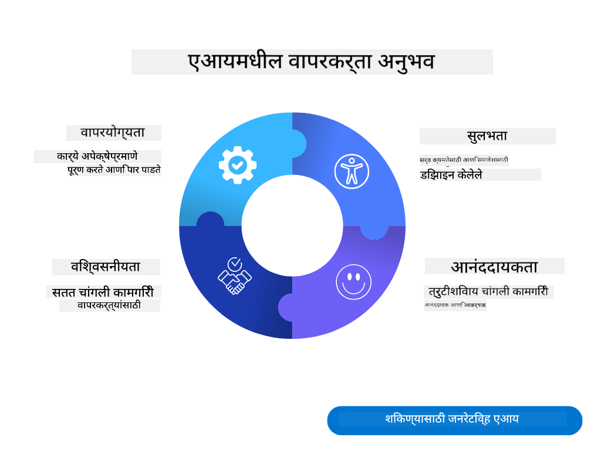
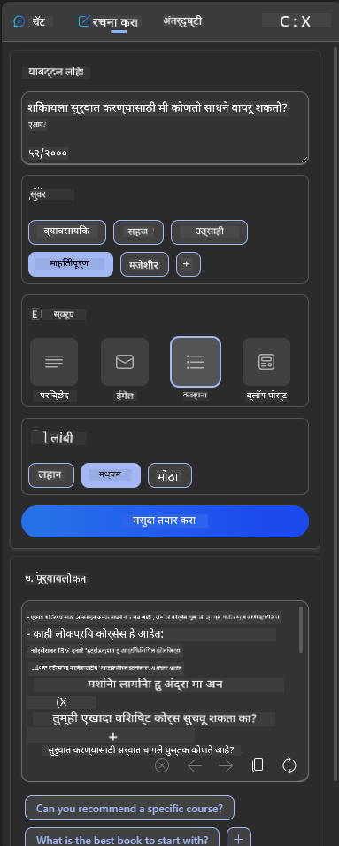

<!--
CO_OP_TRANSLATOR_METADATA:
{
  "original_hash": "747668e4c53d067369f06e9ec2e6313e",
  "translation_date": "2025-08-26T15:51:04+00:00",
  "source_file": "12-designing-ux-for-ai-applications/README.md",
  "language_code": "mr"
}
-->
# AI अनुप्रयोगांसाठी UX डिझाइन करणे

> _(वरील प्रतिमेवर क्लिक करून या धड्याचा व्हिडिओ पहा)_

वापरकर्ता अनुभव (User Experience) हे अ‍ॅप तयार करताना खूप महत्त्वाचे असते. वापरकर्त्यांना तुमचे अ‍ॅप कार्यक्षमतेने वापरता आले पाहिजे, जेणेकरून ते आपली कामे सहज करू शकतील. कार्यक्षम असणे हे एक आहे, पण तुम्ही अ‍ॅप असे डिझाइन केले पाहिजे की ते सर्वांसाठी वापरता येईल, म्हणजेच ते _सुलभ_ असावे. या प्रकरणात आपण यावर लक्ष केंद्रित करू, जेणेकरून शेवटी असे अ‍ॅप तयार होईल जे लोक वापरू शकतील आणि वापरू इच्छितील.

## परिचय

वापरकर्ता अनुभव म्हणजे वापरकर्ता एखाद्या विशिष्ट उत्पादन किंवा सेवेशी कसा संवाद साधतो आणि वापरतो, मग ते प्रणाली, साधन किंवा डिझाइन असो. AI अनुप्रयोग विकसित करताना, विकसक केवळ प्रभावी वापरकर्ता अनुभवावरच लक्ष केंद्रित करत नाहीत, तर नैतिकतेवरही भर देतात. या धड्यात, आपण वापरकर्त्यांच्या गरजा पूर्ण करणारे कृत्रिम बुद्धिमत्ता (AI) अनुप्रयोग कसे तयार करायचे हे पाहणार आहोत.

या धड्यात खालील गोष्टी समाविष्ट आहेत:

- वापरकर्ता अनुभवाची ओळख आणि वापरकर्त्यांच्या गरजांचे समज
- विश्वास आणि पारदर्शकतेसाठी AI अनुप्रयोग डिझाइन करणे
- सहकार्य आणि अभिप्रायासाठी AI अनुप्रयोग डिझाइन करणे

## शिकण्याची उद्दिष्टे

हा धडा घेतल्यानंतर, तुम्ही हे करू शकाल:

- वापरकर्त्यांच्या गरजा पूर्ण करणारे AI अनुप्रयोग कसे तयार करायचे हे समजून घ्या.
- विश्वास आणि सहकार्य वाढवणारे AI अनुप्रयोग डिझाइन करा.

### पूर्वअट

कृपया थोडा वेळ काढून [वापरकर्ता अनुभव आणि डिझाइन थिंकिंग](https://learn.microsoft.com/training/modules/ux-design?WT.mc_id=academic-105485-koreyst) याबद्दल अधिक वाचा.

## वापरकर्ता अनुभवाची ओळख आणि वापरकर्त्यांच्या गरजांचे समज

आपल्या काल्पनिक शैक्षणिक स्टार्टअपमध्ये, आपल्याकडे दोन मुख्य वापरकर्ते आहेत: शिक्षक आणि विद्यार्थी. या दोन्ही वापरकर्त्यांच्या गरजा वेगळ्या आहेत. वापरकर्ता-केंद्रित डिझाइनमध्ये वापरकर्त्याला प्राधान्य दिले जाते, जेणेकरून उत्पादने संबंधित आणि उपयुक्त ठरतील.

अ‍ॅप्लिकेशन **उपयुक्त, विश्वासार्ह, सुलभ आणि आनंददायक** असावे, जेणेकरून चांगला वापरकर्ता अनुभव मिळेल.

### वापरयोग्यता

उपयुक्त असणे म्हणजे अ‍ॅप्लिकेशनमध्ये त्याच्या उद्दिष्टानुसार कार्यक्षमता असणे, जसे की मूल्यांकन प्रक्रिया स्वयंचलित करणे किंवा पुनरावलोकनासाठी फ्लॅशकार्ड तयार करणे. मूल्यांकन प्रक्रिया स्वयंचलित करणारे अ‍ॅप्लिकेशन विद्यार्थ्यांच्या कामाचे गुण पूर्वनिर्धारित निकषांनुसार अचूक आणि कार्यक्षमतेने देऊ शकले पाहिजे. त्याचप्रमाणे, पुनरावलोकनासाठी फ्लॅशकार्ड तयार करणारे अ‍ॅप्लिकेशन त्याच्या डेटावर आधारित संबंधित आणि विविध प्रश्न तयार करू शकले पाहिजे.

### विश्वासार्हता

विश्वासार्ह असणे म्हणजे अ‍ॅप्लिकेशनने आपले कार्य सातत्याने आणि चुका न करता करणे. मात्र, AI देखील माणसांप्रमाणेच परिपूर्ण नसते आणि चुका होऊ शकतात. अ‍ॅप्लिकेशन्समध्ये कधी कधी अशा चुका किंवा अनपेक्षित परिस्थिती येऊ शकतात ज्या मानवी हस्तक्षेप किंवा दुरुस्तीची गरज असते. तुम्ही चुका कशा हाताळता? या धड्याच्या शेवटच्या भागात आपण AI प्रणाली आणि अ‍ॅप्लिकेशन्स सहकार्य आणि अभिप्रायासाठी कसे डिझाइन करतात हे पाहणार आहोत.

### सुलभता

सुलभ असणे म्हणजे विविध क्षमतेच्या वापरकर्त्यांसाठी, अपंगांसह, वापरकर्ता अनुभव वाढवणे, जेणेकरून कोणीही वगळले जाऊ नये. सुलभता मार्गदर्शक तत्त्वे आणि नियम पाळल्याने, AI सोल्यूशन्स अधिक सर्वसमावेशक, वापरण्यास सोपे आणि सर्वांसाठी उपयुक्त बनतात.

### आनंददायक

आनंददायक असणे म्हणजे अ‍ॅप्लिकेशन वापरण्यात मजा येणे. आकर्षक वापरकर्ता अनुभव वापरकर्त्यावर सकारात्मक परिणाम करू शकतो, ज्यामुळे ते पुन्हा अ‍ॅप वापरतात आणि व्यवसायाचे उत्पन्न वाढते.

प्रत्येक समस्या AI ने सोडवता येत नाही. AI वापरकर्ता अनुभव वाढवण्यासाठी येते, मग ते हाताने कराव्या लागणाऱ्या कामांचे स्वयंचलीकरण असो किंवा वैयक्तिकृत अनुभव असो.

## विश्वास आणि पारदर्शकतेसाठी AI अनुप्रयोग डिझाइन करणे

AI अनुप्रयोग डिझाइन करताना विश्वास निर्माण करणे अत्यंत महत्त्वाचे आहे. विश्वासामुळे वापरकर्त्याला खात्री वाटते की अ‍ॅप्लिकेशन काम पूर्ण करेल, सातत्याने परिणाम देईल आणि हे परिणाम वापरकर्त्याच्या गरजेनुसार असतील. या क्षेत्रातील एक धोका म्हणजे अविश्वास आणि अति-विश्वास. अविश्वास म्हणजे वापरकर्त्याला AI प्रणालीवर फारसा किंवा अजिबात विश्वास नसणे, त्यामुळे वापरकर्ता तुमचे अ‍ॅप नाकारतो. अति-विश्वास म्हणजे वापरकर्ता AI प्रणालीच्या क्षमतेचा अतिरेकाने अंदाज लावतो, ज्यामुळे वापरकर्ता AI वर खूपच विश्वास ठेवतो. उदाहरणार्थ, स्वयंचलित मूल्यांकन प्रणालीमध्ये अति-विश्वासामुळे शिक्षक काही पेपर्स तपासत नाहीत, त्यामुळे मूल्यांकन प्रणाली योग्य काम करते का हे तपासले जात नाही. यामुळे विद्यार्थ्यांना अन्यायकारक किंवा चुकीचे गुण मिळू शकतात, किंवा अभिप्राय व सुधारणा यासाठी संधी गमावली जाऊ शकते.

डिझाइनमध्ये विश्वास केंद्रस्थानी ठेवण्यासाठी दोन मार्ग आहेत: स्पष्टता (Explainability) आणि नियंत्रण (Control).

### स्पष्टता (Explainability)

AI निर्णय घेण्यास मदत करत असेल, जसे की पुढच्या पिढ्यांना ज्ञान देणे, तर शिक्षक आणि पालकांना AI निर्णय कसे घेतो हे समजणे महत्त्वाचे आहे. हेच स्पष्टता आहे - AI अनुप्रयोग निर्णय कसे घेतात हे समजणे. स्पष्टतेसाठी डिझाइन करताना, AI ने आउटपुट कसे दिले हे दाखवणारे तपशील द्यावेत. प्रेक्षकांना हे माहित असावे की हा आउटपुट AI ने तयार केला आहे, माणसाने नाही. उदाहरणार्थ, "आता तुमच्या ट्यूटरसोबत चॅटिंग सुरू करा" असे म्हणण्याऐवजी "तुमच्या गरजेनुसार जुळणारा आणि तुमच्या गतीने शिकायला मदत करणारा AI ट्यूटर वापरा" असे म्हणा.

आणखी एक उदाहरण म्हणजे AI वापरकर्त्याचा आणि वैयक्तिक डेटा कसा वापरतो. उदाहरणार्थ, विद्यार्थी या व्यक्तिमत्वाच्या वापरकर्त्याला त्यांच्या व्यक्तिमत्वावर आधारित काही मर्यादा असू शकतात. AI कदाचित प्रश्नांची उत्तरे थेट देऊ शकणार नाही, पण वापरकर्त्याला समस्या कशी सोडवता येईल याचा विचार करण्यास मदत करू शकतो.

स्पष्टतेचा आणखी एक महत्त्वाचा भाग म्हणजे स्पष्टीकरणे सोपी करणे. विद्यार्थी आणि शिक्षक हे AI तज्ञ नसू शकतात, त्यामुळे अ‍ॅप्लिकेशन काय करू शकते किंवा करू शकत नाही याची स्पष्टीकरणे सोपी आणि समजण्यास सोपी असावीत.

### नियंत्रण (Control)

जनरेटिव्ह AI मध्ये AI आणि वापरकर्ता यांच्यात सहकार्य असते, जिथे वापरकर्ता वेगवेगळ्या परिणामांसाठी prompts बदलू शकतो. शिवाय, एकदा आउटपुट तयार झाल्यावर, वापरकर्त्यांना ते बदलता यावे, म्हणजेच त्यांना नियंत्रणाची जाणीव मिळते. उदाहरणार्थ, Bing वापरताना, तुम्ही तुमचा prompt फॉरमॅट, टोन आणि लांबीवर आधारित सानुकूल करू शकता. तसेच, तुम्ही आउटपुटमध्ये बदल करू शकता आणि ते सुधारू शकता, खाली दाखवल्याप्रमाणे:

Bing मधील आणखी एक वैशिष्ट्य म्हणजे वापरकर्त्याला अ‍ॅप्लिकेशनवर नियंत्रण ठेवता येते, म्हणजे AI कोणता डेटा वापरतो यावर opt in किंवा opt out करता येते. शाळेच्या अ‍ॅप्लिकेशनमध्ये, विद्यार्थी त्यांच्या नोट्स आणि शिक्षकांचे स्रोत दोन्ही पुनरावलोकनासाठी वापरू इच्छितात.

> AI अनुप्रयोग डिझाइन करताना, वापरकर्ते अति-विश्वास ठेवू नयेत आणि क्षमतेबद्दल अवास्तव अपेक्षा ठेवू नयेत यासाठी हेतुपूर्वक डिझाइन करणे महत्त्वाचे आहे. यासाठी एक मार्ग म्हणजे prompts आणि परिणाम यामध्ये थोडा friction तयार करणे. वापरकर्त्याला सतत आठवण करून द्या की हे AI आहे, माणूस नाही.

## सहकार्य आणि अभिप्रायासाठी AI अनुप्रयोग डिझाइन करणे

पूर्वी सांगितल्याप्रमाणे, जनरेटिव्ह AI मध्ये वापरकर्ता आणि AI यांच्यात सहकार्य असते. बहुतेक वेळा वापरकर्ता prompt देतो आणि AI आउटपुट तयार करतो. पण जर आउटपुट चुकीचे असेल तर? अ‍ॅप्लिकेशन चुका झाल्यास त्या कशा हाताळते? AI वापरकर्त्याला दोष देते का, की चूक समजावून सांगते?

AI अनुप्रयोग असे असावेत की ते अभिप्राय घेऊ आणि देऊ शकतील. यामुळे केवळ AI प्रणाली सुधारते असे नाही, तर वापरकर्त्यांमध्ये विश्वासही वाढतो. डिझाइनमध्ये अभिप्राय लूप असावा, उदाहरणार्थ आउटपुटवर thumbs up किंवा thumbs down देण्याचा पर्याय.

हे हाताळण्याचा आणखी एक मार्ग म्हणजे प्रणालीच्या क्षमतांबद्दल आणि मर्यादांबद्दल स्पष्टपणे संवाद साधणे. वापरकर्त्याने AI क्षमतेच्या पलीकडे काही मागितले, तर तेही योग्य प्रकारे हाताळता आले पाहिजे, खाली दाखवल्याप्रमाणे.

सिस्टम त्रुटी अ‍ॅप्लिकेशन्समध्ये सामान्य आहेत, जिथे वापरकर्त्याला AI च्या कक्षेबाहेरील माहितीची गरज असू शकते किंवा अ‍ॅप्लिकेशनमध्ये वापरकर्ता किती प्रश्न/विषयांची सारांश तयार करू शकतो यावर मर्यादा असू शकते. उदाहरणार्थ, AI अ‍ॅप्लिकेशन केवळ मर्यादित विषयांवर (उदा. इतिहास आणि गणित) प्रशिक्षित असेल, तर ते भूगोलासारख्या प्रश्नांना उत्तर देऊ शकणार नाही. हे टाळण्यासाठी, AI प्रणाली असे उत्तर देऊ शकते: "माफ करा, आमचे उत्पादन खालील विषयांवरील डेटावर प्रशिक्षित आहे....., मी तुम्ही विचारलेला प्रश्न उत्तर देऊ शकत नाही."

AI अनुप्रयोग परिपूर्ण नसतात, त्यामुळे चुका होणारच. तुमचे अ‍ॅप्लिकेशन्स डिझाइन करताना, वापरकर्त्यांकडून अभिप्राय घेण्यासाठी आणि चुका हाताळण्यासाठी सोपा आणि समजण्यास सोपा मार्ग ठेवा.

## असाइनमेंट

तुम्ही आतापर्यंत तयार केलेल्या कोणत्याही AI अ‍ॅप्समध्ये, खालील गोष्टी अंमलात आणण्याचा विचार करा:

- **आनंददायक:** तुमचे अ‍ॅप अधिक आनंददायक कसे बनवता येईल याचा विचार करा. तुम्ही सर्वत्र स्पष्टीकरणे देत आहात का? वापरकर्त्याला शोध घेण्यास प्रोत्साहित करत आहात का? तुमच्या त्रुटी संदेशांची भाषा कशी आहे?

- **वापरयोग्यता:** वेब अ‍ॅप तयार करत आहात. तुमचे अ‍ॅप माउस आणि कीबोर्ड दोन्हीने नेव्हिगेट करता येईल याची खात्री करा.

- **विश्वास आणि पारदर्शकता:** AI आणि त्याच्या आउटपुटवर पूर्णपणे विश्वास ठेवू नका, आउटपुट पडताळण्यासाठी प्रक्रियेत माणसाचा सहभाग कसा वाढवता येईल याचा विचार करा. तसेच, विश्वास आणि पारदर्शकता साध्य करण्याचे इतर मार्गही विचारात घ्या आणि अंमलात आणा.

- **नियंत्रण:** वापरकर्त्याला त्यांनी अ‍ॅप्लिकेशनला दिलेल्या डेटावर नियंत्रण द्या. AI अ‍ॅप्लिकेशनमध्ये डेटा संकलनासाठी वापरकर्ता opt-in आणि opt-out करू शकेल असा पर्याय द्या.

## तुमचे शिक्षण पुढे चालू ठेवा!

हा धडा पूर्ण केल्यानंतर, आमचे [Generative AI Learning collection](https://aka.ms/genai-collection?WT.mc_id=academic-105485-koreyst) पहा आणि तुमचे Generative AI ज्ञान वाढवत राहा!

आता धडा १३ मध्ये चला, जिथे आपण [AI अनुप्रयोग सुरक्षित कसे करायचे](../13-securing-ai-applications/README.md?WT.mc_id=academic-105485-koreyst) हे पाहणार आहोत!

---

**अस्वीकरण**:
हे दस्तऐवज AI भाषांतर सेवा [Co-op Translator](https://github.com/Azure/co-op-translator) वापरून भाषांतरित केले आहे. आम्ही अचूकतेसाठी प्रयत्नशील असलो तरी, कृपया लक्षात घ्या की स्वयंचलित भाषांतरांमध्ये चुका किंवा अपूर्णता असू शकतात. मूळ दस्तऐवज त्याच्या मूळ भाषेत अधिकृत स्रोत मानावा. अत्यावश्यक माहितीसाठी, व्यावसायिक मानवी भाषांतराची शिफारस केली जाते. या भाषांतराचा वापर करून झालेल्या कोणत्याही गैरसमज किंवा चुकीच्या अर्थासाठी आम्ही जबाबदार राहणार नाही.