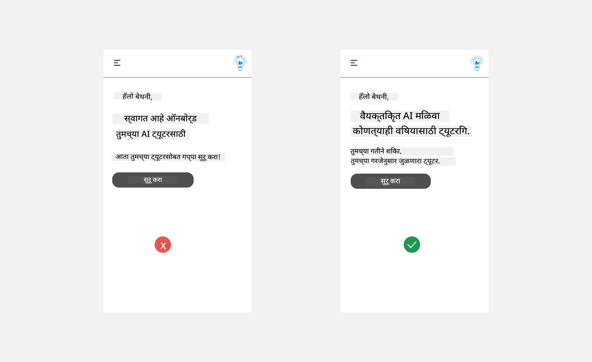

<!--
CO_OP_TRANSLATOR_METADATA:
{
  "original_hash": "78bbeed50fd4dc9fdee931f5daf98cb3",
  "translation_date": "2025-10-17T13:52:46+00:00",
  "source_file": "12-designing-ux-for-ai-applications/README.md",
  "language_code": "mr"
}
-->
# AI अनुप्रयोगांसाठी UX डिझाइन करणे

> _(वरील प्रतिमेवर क्लिक करून या धड्याचा व्हिडिओ पाहा)_

वापरकर्ता अनुभव (User Experience) हा अॅप्स तयार करताना खूप महत्त्वाचा भाग आहे. वापरकर्त्यांना तुमचा अॅप कार्यक्षमतेने वापरता यायला हवा, जेणेकरून ते आपले काम पूर्ण करू शकतील. कार्यक्षम असणे ही एक गोष्ट आहे, परंतु तुम्हाला असे अॅप्स डिझाइन करावे लागतील जे सर्वांसाठी वापरण्यास सुलभ असतील, म्हणजेच ते _सुलभ_ असतील. हा अध्याय या क्षेत्रावर लक्ष केंद्रित करेल, जेणेकरून तुम्ही असे अॅप डिझाइन करू शकाल जे लोक वापरू शकतील आणि वापरू इच्छित असतील.

## परिचय

वापरकर्ता अनुभव म्हणजे वापरकर्ता विशिष्ट उत्पादन किंवा सेवा, प्रणाली, साधन किंवा डिझाइनशी कसा संवाद साधतो आणि त्याचा वापर कसा करतो. AI अनुप्रयोग विकसित करताना, विकसक केवळ वापरकर्ता अनुभव प्रभावी असल्याचे सुनिश्चित करण्यावरच लक्ष केंद्रित करत नाहीत तर नैतिकतेवरही लक्ष केंद्रित करतात. या धड्यात, वापरकर्त्यांच्या गरजा पूर्ण करणारे कृत्रिम बुद्धिमत्ता (AI) अनुप्रयोग कसे तयार करायचे हे शिकवले जाईल.

या धड्यात खालील गोष्टींचा समावेश असेल:

- वापरकर्ता अनुभवाची ओळख आणि वापरकर्त्यांच्या गरजांचे आकलन
- विश्वास आणि पारदर्शकतेसाठी AI अनुप्रयोग डिझाइन करणे
- सहकार्य आणि अभिप्रायासाठी AI अनुप्रयोग डिझाइन करणे

## शिकण्याची उद्दिष्टे

हा धडा घेतल्यानंतर, तुम्ही हे करू शकाल:

- वापरकर्त्यांच्या गरजा पूर्ण करणारे AI अनुप्रयोग कसे तयार करायचे हे समजून घ्या.
- विश्वास आणि सहकार्याला प्रोत्साहन देणारे AI अनुप्रयोग डिझाइन करा.

### पूर्वअट

[वापरकर्ता अनुभव आणि डिझाइन थिंकिंग](https://learn.microsoft.com/training/modules/ux-design?WT.mc_id=academic-105485-koreyst) याबद्दल अधिक वाचा.

## वापरकर्ता अनुभवाची ओळख आणि वापरकर्त्यांच्या गरजांचे आकलन

आमच्या काल्पनिक शिक्षण स्टार्टअपमध्ये, आमच्याकडे दोन प्राथमिक वापरकर्ते आहेत, शिक्षक आणि विद्यार्थी. या दोन्ही वापरकर्त्यांच्या गरजा वेगळ्या आहेत. वापरकर्त्याला केंद्रस्थानी ठेवणारे डिझाइन हे सुनिश्चित करते की उत्पादने संबंधित आणि उपयुक्त आहेत.

अॅप्लिकेशनने चांगला वापरकर्ता अनुभव प्रदान करण्यासाठी **उपयुक्त, विश्वासार्ह, सुलभ आणि आनंददायक** असले पाहिजे.

### उपयुक्तता

उपयुक्त असणे म्हणजे अॅप्लिकेशनमध्ये त्याच्या उद्दिष्टानुसार कार्यक्षमता असणे, जसे की ग्रेडिंग प्रक्रिया स्वयंचलित करणे किंवा पुनरावलोकनासाठी फ्लॅशकार्ड तयार करणे. उदाहरणार्थ, ग्रेडिंग प्रक्रिया स्वयंचलित करणारे अॅप्लिकेशन विद्यार्थ्यांच्या कामाचे स्कोअर अचूक आणि कार्यक्षमतेने पूर्वनिर्धारित निकषांनुसार देऊ शकते.

### विश्वासार्हता

विश्वासार्ह असणे म्हणजे अॅप्लिकेशन त्याचे कार्य सातत्याने आणि त्रुटीशिवाय करू शकते. मात्र, AI देखील माणसांप्रमाणेच परिपूर्ण नाही आणि चुका होऊ शकतात. अॅप्लिकेशन्समध्ये अशा चुका किंवा अनपेक्षित परिस्थिती येऊ शकतात ज्यासाठी मानवी हस्तक्षेप किंवा सुधारणा आवश्यक असते. तुम्ही चुका कशा हाताळता? या धड्याच्या शेवटच्या विभागात, आम्ही सहकार्य आणि अभिप्रायासाठी AI प्रणाली आणि अनुप्रयोग कसे डिझाइन केले जातात यावर चर्चा करू.

### सुलभता

सुलभ असणे म्हणजे विविध क्षमतांच्या वापरकर्त्यांसाठी, ज्यात अपंगत्व असलेले लोक देखील समाविष्ट आहेत, वापरकर्ता अनुभव विस्तारित करणे, जेणेकरून कोणीही वगळले जाऊ नये. सुलभता मार्गदर्शक तत्त्वे आणि तत्त्वे पाळून, AI सोल्यूशन्स अधिक समावेशक, वापरण्यास सुलभ आणि सर्व वापरकर्त्यांसाठी फायदेशीर बनतात.

### आनंददायक

आनंददायक असणे म्हणजे अॅप्लिकेशन वापरण्यास आनंददायक असणे. आकर्षक वापरकर्ता अनुभवाचा वापरकर्त्यावर सकारात्मक परिणाम होऊ शकतो, ज्यामुळे ते अॅप्लिकेशनकडे परत येण्यास प्रोत्साहित होतात आणि व्यवसाय महसूल वाढतो.

प्रत्येक आव्हान AI ने सोडवता येत नाही. AI तुमचा वापरकर्ता अनुभव वाढवण्यासाठी येतो, मग तो मॅन्युअल कामे स्वयंचलित करणे असो किंवा वैयक्तिकृत वापरकर्ता अनुभव असो.

## विश्वास आणि पारदर्शकतेसाठी AI अनुप्रयोग डिझाइन करणे

AI अनुप्रयोग डिझाइन करताना विश्वास निर्माण करणे खूप महत्त्वाचे आहे. विश्वासामुळे वापरकर्त्याला खात्री वाटते की अॅप्लिकेशन काम पूर्ण करेल, सातत्याने परिणाम देईल आणि परिणाम वापरकर्त्याच्या गरजेनुसार असतील. या क्षेत्रातील एक धोका म्हणजे अविश्वास आणि अति-विश्वास. अविश्वास म्हणजे वापरकर्त्याला AI प्रणालीवर फारसा किंवा अजिबात विश्वास नसणे, ज्यामुळे वापरकर्ता तुमचा अॅप्लिकेशन नाकारतो. अति-विश्वास म्हणजे वापरकर्ता AI प्रणालीच्या क्षमतेचा अतिरेक करतो, ज्यामुळे वापरकर्ते AI प्रणालीवर खूप जास्त विश्वास ठेवतात.

विश्वास डिझाइनच्या केंद्रस्थानी ठेवण्यासाठी दोन मार्ग म्हणजे स्पष्टता आणि नियंत्रण.

### स्पष्टता

AI निर्णय कसे घेतो हे समजून घेणे म्हणजे स्पष्टता. उदाहरणार्थ, "तुमच्या ट्यूटरसोबत चॅटिंग सुरू करा" असे म्हणण्याऐवजी "AI ट्यूटर वापरा जो तुमच्या गरजेनुसार जुळवून घेतो आणि तुम्हाला तुमच्या गतीने शिकण्यास मदत करतो" असे म्हणा.

### नियंत्रण

जनरेटिव्ह AI वापरकर्ता आणि AI यांच्यात सहकार्य निर्माण करते, जिथे वापरकर्ता वेगवेगळ्या परिणामांसाठी प्रॉम्प्ट बदलू शकतो. उदाहरणार्थ, Bing वापरताना, तुम्ही तुमचा प्रॉम्प्ट स्वरूप, टोन आणि लांबीच्या आधारे सानुकूलित करू शकता.

AI अनुप्रयोग डिझाइन करताना, वापरकर्त्यांना AI च्या क्षमतेबद्दल अवास्तव अपेक्षा ठेवू नयेत याची खात्री करण्यासाठी हेतुपूर्णता महत्त्वाची आहे.

## सहकार्य आणि अभिप्रायासाठी AI अनुप्रयोग डिझाइन करणे

जनरेटिव्ह AI वापरकर्ता आणि AI यांच्यात सहकार्य निर्माण करते. बहुतेक वेळा वापरकर्ता प्रॉम्प्ट इनपुट करतो आणि AI आउटपुट तयार करतो. जर आउटपुट चुकीचे असेल तर काय? अॅप्लिकेशन चुका कशा हाताळते? AI वापरकर्त्याला दोष देते का किंवा त्रुटी स्पष्ट करण्यासाठी वेळ घेतो?

AI अनुप्रयोग अभिप्राय प्राप्त करण्यासाठी आणि देण्यासाठी तयार केले जावेत. यामुळे केवळ AI प्रणाली सुधारण्यास मदत होत नाही तर वापरकर्त्यांशी विश्वास देखील निर्माण होतो. अभिप्राय लूप डिझाइनमध्ये समाविष्ट केला पाहिजे, उदाहरणार्थ, आउटपुटवर साधा अंगठा वर किंवा खाली असू शकतो.

AI अनुप्रयोग परिपूर्ण नाहीत, त्यामुळे चुका होण्याची शक्यता असते. तुमचे अनुप्रयोग डिझाइन करताना, वापरकर्त्यांकडून अभिप्राय आणि त्रुटी हाताळण्यासाठी सोपी आणि सहज समजण्याजोगी पद्धत तयार करणे सुनिश्चित करा.

## असाइनमेंट

तुम्ही आतापर्यंत तयार केलेल्या कोणत्याही AI अॅप्समध्ये खालील पायऱ्या लागू करण्याचा विचार करा:

- **आनंददायक:** तुमचा अॅप अधिक आनंददायक कसा बनवता येईल याचा विचार करा. तुम्ही सर्वत्र स्पष्टीकरणे जोडत आहात का? तुम्ही वापरकर्त्याला एक्सप्लोर करण्यास प्रोत्साहित करत आहात का? तुमच्या त्रुटी संदेशांचे शब्दांकन कसे आहे?

- **उपयुक्तता:** वेब अॅप तयार करत आहात. तुमचा अॅप माऊस आणि कीबोर्ड दोन्हीने नेव्हिगेट करण्यायोग्य आहे याची खात्री करा.

- **विश्वास आणि पारदर्शकता:** AI आणि त्याच्या आउटपुटवर पूर्णपणे विश्वास ठेवू नका, आउटपुट सत्यापित करण्यासाठी प्रक्रियेत माणसाला कसे जोडाल याचा विचार करा. विश्वास आणि पारदर्शकता साध्य करण्याचे इतर मार्ग देखील विचारात घ्या आणि अंमलात आणा.

- **नियंत्रण:** वापरकर्त्याला अॅप्लिकेशनला प्रदान केलेल्या डेटावर नियंत्रण द्या. AI अॅप्लिकेशनमध्ये डेटा संकलनासाठी वापरकर्ता कसा ऑप्ट-इन आणि ऑप्ट-आउट करू शकतो याची अंमलबजावणी करा.

## तुमचे शिक्षण सुरू ठेवा!

हा धडा पूर्ण केल्यानंतर, आमचा [जनरेटिव्ह AI शिक्षण संग्रह](https://aka.ms/genai-collection?WT.mc_id=academic-105485-koreyst) तपासा आणि तुमचे जनरेटिव्ह AI ज्ञान वाढवा!

पुढील धडा 13 मध्ये जा, जिथे आपण [AI अनुप्रयोग सुरक्षित करणे](../13-securing-ai-applications/README.md?WT.mc_id=academic-105485-koreyst) याबद्दल शिकू!

---

**अस्वीकरण**:  
हा दस्तऐवज AI भाषांतर सेवा [Co-op Translator](https://github.com/Azure/co-op-translator) वापरून भाषांतरित करण्यात आला आहे. आम्ही अचूकतेसाठी प्रयत्नशील असलो तरी, कृपया लक्षात ठेवा की स्वयंचलित भाषांतरे त्रुटी किंवा अचूकतेच्या अभावाने युक्त असू शकतात. मूळ भाषेतील दस्तऐवज हा अधिकृत स्रोत मानला जावा. महत्त्वाच्या माहितीसाठी, व्यावसायिक मानवी भाषांतराची शिफारस केली जाते. या भाषांतराचा वापर करून उद्भवलेल्या कोणत्याही गैरसमज किंवा चुकीच्या अर्थासाठी आम्ही जबाबदार नाही.