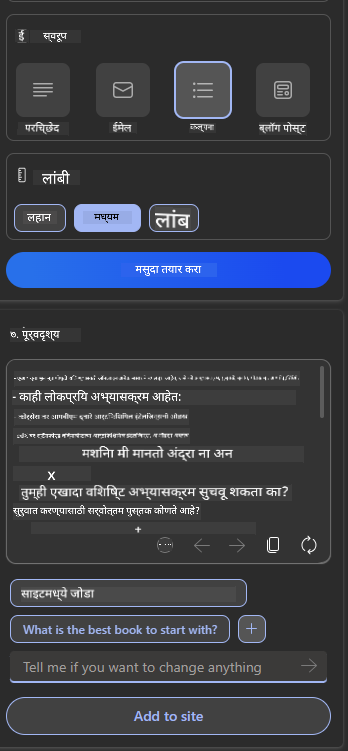

<!--
CO_OP_TRANSLATOR_METADATA:
{
  "original_hash": "ec385b41ee50579025d50cc03bfb3a25",
  "translation_date": "2025-07-09T14:54:00+00:00",
  "source_file": "12-designing-ux-for-ai-applications/README.md",
  "language_code": "mr"
}
-->
# AI अनुप्रयोगांसाठी UX डिझाइन करणे

> _(वरील प्रतिमा क्लिक करून या धड्याचा व्हिडिओ पाहा)_

युजर एक्सपीरियन्स (User Experience) हे अॅप्स तयार करताना खूप महत्त्वाचे असते. वापरकर्त्यांनी तुमचा अॅप कार्यक्षमतेने वापरता यावा, ही गरज असते. कार्यक्षम असणे महत्त्वाचे आहे, पण अॅप असे डिझाइन करणे देखील आवश्यक आहे की तो सर्वांनाच वापरता यावा, म्हणजे तो _सुलभ_ असावा. हा अध्याय या भागावर लक्ष केंद्रित करेल, ज्यामुळे तुम्ही असा अॅप डिझाइन करू शकाल जो लोक वापरू इच्छितात आणि वापरू शकतात.

## परिचय

युजर एक्सपीरियन्स म्हणजे वापरकर्ता एखाद्या विशिष्ट उत्पादन किंवा सेवेचा कसा वापर करतो आणि त्याच्याशी कसा संवाद साधतो, मग ते सिस्टम, साधन किंवा डिझाइन असो. AI अनुप्रयोग विकसित करताना, विकसक फक्त युजर एक्सपीरियन्स प्रभावी होईल याकडे लक्ष देत नाहीत, तर तो नैतिकही असावा याकडेही लक्ष देतात. या धड्यात आपण अशा Artificial Intelligence (AI) अनुप्रयोगांची निर्मिती कशी करायची ते पाहणार आहोत जे वापरकर्त्यांच्या गरजा पूर्ण करतात.

हा धडा खालील विषयांवर लक्ष केंद्रित करेल:

- युजर एक्सपीरियन्सची ओळख आणि वापरकर्त्यांच्या गरजांची समज
- विश्वास आणि पारदर्शकतेसाठी AI अनुप्रयोग डिझाइन करणे
- सहकार्य आणि अभिप्रायासाठी AI अनुप्रयोग डिझाइन करणे

## शिकण्याचे उद्दिष्ट

हा धडा पूर्ण केल्यानंतर, तुम्ही सक्षम असाल:

- वापरकर्त्यांच्या गरजा पूर्ण करणारे AI अनुप्रयोग कसे तयार करायचे ते समजून घेणे.
- विश्वास आणि सहकार्य वाढवणारे AI अनुप्रयोग डिझाइन करणे.

### पूर्वअट

काही वेळ काढा आणि [युजर एक्सपीरियन्स आणि डिझाइन थिंकिंग](https://learn.microsoft.com/training/modules/ux-design?WT.mc_id=academic-105485-koreyst) बद्दल अधिक वाचा.

## युजर एक्सपीरियन्सची ओळख आणि वापरकर्त्यांच्या गरजांची समज

आमच्या काल्पनिक शिक्षण स्टार्टअपमध्ये दोन मुख्य वापरकर्ते आहेत, शिक्षक आणि विद्यार्थी. प्रत्येक वापरकर्त्याच्या गरजा वेगळ्या आहेत. वापरकर्ता-केंद्रित डिझाइन वापरकर्त्याला प्राधान्य देते, ज्यामुळे उत्पादने त्या वापरकर्त्यांसाठी उपयुक्त आणि फायदेशीर ठरतात.

अॅप्लिकेशन **उपयुक्त, विश्वासार्ह, सुलभ आणि आनंददायक** असावे जेणेकरून चांगला युजर एक्सपीरियन्स मिळू शकेल.

### वापरयोग्यता

उपयुक्त असणे म्हणजे अॅप्लिकेशनमध्ये अशी कार्यक्षमता असावी जी त्याच्या उद्देशाशी जुळते, जसे की ग्रेडिंग प्रक्रिया स्वयंचलित करणे किंवा पुनरावलोकनासाठी फ्लॅशकार्ड तयार करणे. ग्रेडिंग प्रक्रिया स्वयंचलित करणारा अॅप विद्यार्थ्यांच्या कामाला पूर्वनिर्धारित निकषांनुसार अचूक आणि कार्यक्षमतेने गुण देऊ शकला पाहिजे. त्याचप्रमाणे, पुनरावलोकनासाठी फ्लॅशकार्ड तयार करणारा अॅप त्याच्या डेटावर आधारित संबंधित आणि विविध प्रश्न तयार करू शकला पाहिजे.

### विश्वासार्हता

विश्वासार्ह असणे म्हणजे अॅप त्याचे कार्य सातत्याने आणि त्रुटीशिवाय पार पाडू शकतो. मात्र, AI देखील माणसांसारखा परिपूर्ण नाही आणि चुका होऊ शकतात. अॅप्लिकेशन्सना अशा चुका किंवा अनपेक्षित परिस्थितींचा सामना करावा लागू शकतो ज्यासाठी मानवी हस्तक्षेप किंवा दुरुस्ती आवश्यक असते. तुम्ही चुका कशा हाताळता? या धड्याच्या शेवटच्या भागात आपण पाहणार आहोत की AI सिस्टम आणि अॅप्लिकेशन्स सहकार्य आणि अभिप्रायासाठी कसे डिझाइन केले जातात.

### सुलभता

सुलभ असणे म्हणजे विविध क्षमतांच्या वापरकर्त्यांपर्यंत युजर एक्सपीरियन्स पोहोचवणे, ज्यात अपंगत्व असलेले लोकही समाविष्ट आहेत, जेणेकरून कोणीही वगळले जाणार नाही. सुलभता मार्गदर्शक तत्त्वे आणि नियम पाळल्यास AI सोल्यूशन्स अधिक समावेशक, वापरण्यास सोपे आणि सर्व वापरकर्त्यांसाठी फायदेशीर होतात.

### आनंददायक

आनंददायक असणे म्हणजे अॅप वापरणे सुखद असावे. आकर्षक युजर एक्सपीरियन्स वापरकर्त्यांवर सकारात्मक परिणाम करू शकतो, ज्यामुळे ते अॅप वापरण्यास परत येतात आणि व्यवसायाचे उत्पन्न वाढते.

सर्व समस्या AI ने सोडवता येत नाहीत. AI तुमचा युजर एक्सपीरियन्स वाढवण्यासाठी येतो, मग तो मॅन्युअल कामे स्वयंचलित करणे असो किंवा युजर एक्सपीरियन्स वैयक्तिकृत करणे असो.

## विश्वास आणि पारदर्शकतेसाठी AI अनुप्रयोग डिझाइन करणे

AI अनुप्रयोग डिझाइन करताना विश्वास निर्माण करणे अत्यंत महत्त्वाचे आहे. विश्वासामुळे वापरकर्ता खात्री करतो की अॅप काम पूर्ण करेल, सातत्याने निकाल देईल आणि निकाल वापरकर्त्याच्या गरजेनुसार असतील. या क्षेत्रातील धोका म्हणजे अविश्वास आणि जास्त विश्वास. अविश्वास तेव्हा होतो जेव्हा वापरकर्त्याला AI सिस्टमवर फारसा विश्वास नसतो, ज्यामुळे तो तुमचा अॅप वापरणे टाळतो. जास्त विश्वास तेव्हा होतो जेव्हा वापरकर्ता AI सिस्टमच्या क्षमतेचा अतिरेक करतो, ज्यामुळे वापरकर्ते AI सिस्टमवर खूप जास्त विश्वास ठेवतात. उदाहरणार्थ, जर शिक्षकाने काही पेपर्स तपासले नाहीत कारण त्याला AI आधारित स्वयंचलित ग्रेडिंग सिस्टमवर पूर्ण विश्वास आहे, तर विद्यार्थ्यांना अन्यायकारक किंवा अचूक नसलेले ग्रेड मिळू शकतात, किंवा अभिप्राय आणि सुधारणा करण्याच्या संधी गमावल्या जाऊ शकतात.

डिझाइनमध्ये विश्वास केंद्रस्थानी ठेवण्यासाठी दोन मार्ग आहेत: स्पष्टता (explainability) आणि नियंत्रण (control).

### स्पष्टता

जेव्हा AI भविष्यातील पिढ्यांना ज्ञान देण्यास मदत करतो, तेव्हा शिक्षक आणि पालकांसाठी AI निर्णय कसे घेतले जातात हे समजून घेणे अत्यंत महत्त्वाचे असते. याला स्पष्टता म्हणतात - AI अनुप्रयोग निर्णय कसे घेतात हे समजून घेणे. स्पष्टतेसाठी डिझाइन करताना AI अॅप काय करू शकतो याचे उदाहरणे देणे आवश्यक असते. उदाहरणार्थ, "AI शिक्षकासह सुरुवात करा" याऐवजी, सिस्टम वापरू शकते: "AI वापरून तुमच्या नोट्सचा सारांश तयार करा ज्यामुळे पुनरावलोकन सोपे होईल."

दुसरे उदाहरण म्हणजे AI वापरकर्ता आणि वैयक्तिक डेटा कसा वापरतो. उदाहरणार्थ, विद्यार्थी या व्यक्तिमत्वावर आधारित वापरकर्त्याला काही मर्यादा असू शकतात. AI प्रश्नांची उत्तरे थेट देऊ शकत नाही, पण वापरकर्त्याला समस्या कशी सोडवायची यासाठी मार्गदर्शन करू शकतो.

स्पष्टतेचा आणखी एक महत्त्वाचा भाग म्हणजे स्पष्टीकरणे सोपी करणे. विद्यार्थी आणि शिक्षक AI तज्ञ नसू शकतात, त्यामुळे अॅप काय करू शकते किंवा काय करू शकत नाही याचे स्पष्टीकरण सोपे आणि समजण्यास सुलभ असावे.

### नियंत्रण

Generative AI वापरकर्त्याला आणि AI यांच्यात सहकार्य तयार करतो, जिथे वापरकर्ता वेगवेगळ्या निकालांसाठी प्रॉम्प्ट्स बदलू शकतो. शिवाय, एकदा आउटपुट तयार झाल्यावर, वापरकर्त्याला निकाल बदलण्याची मुभा असावी ज्यामुळे त्यांना नियंत्रणाची भावना मिळते. उदाहरणार्थ, Bing वापरताना तुम्ही तुमचा प्रॉम्प्ट फॉरमॅट, टोन आणि लांबीवर आधारित सानुकूलित करू शकता. तसेच, तुम्ही तुमच्या आउटपुटमध्ये बदल करू शकता आणि त्यानुसार आउटपुट सुधारू शकता:

Bing मध्ये आणखी एक वैशिष्ट्य म्हणजे वापरकर्त्याला AI वापरलेल्या डेटावर नियंत्रण देणे, जसे की डेटा वापरण्यासाठी ऑप्ट-इन किंवा ऑप्ट-आउट होण्याची सुविधा. शाळेच्या अॅपसाठी, विद्यार्थी त्याच्या नोट्स तसेच शिक्षकांच्या संसाधनांचा पुनरावलोकन साहित्य म्हणून वापर करू इच्छू शकतो.

> AI अनुप्रयोग डिझाइन करताना, वापरकर्त्यांनी AI वर जास्त विश्वास ठेवू नये यासाठी हेतुपुरस्सर उपाय करणे महत्त्वाचे आहे, ज्यामुळे त्यांची अपेक्षा वास्तविक राहील. यासाठी प्रॉम्प्ट्स आणि निकालांमध्ये थोडीशी अडचण निर्माण करणे उपयुक्त ठरते. वापरकर्त्याला आठवण करून देणे की हे AI आहे, माणूस नाही.

## सहकार्य आणि अभिप्रायासाठी AI अनुप्रयोग डिझाइन करणे

जसे आधी सांगितले, generative AI वापरकर्ता आणि AI यांच्यात सहकार्य तयार करतो. बहुतेक संवाद वापरकर्ता प्रॉम्प्ट टाकतो आणि AI आउटपुट तयार करतो. जर आउटपुट चुकीचे असेल तर काय? अॅप्लिकेशन चुका कशा हाताळते? AI वापरकर्त्याला दोष देतो का किंवा चुका समजावून सांगण्यासाठी वेळ घेतो का?

AI अनुप्रयोगांना अभिप्राय देणे आणि घेणे यासाठी तयार केले पाहिजे. यामुळे AI सिस्टम सुधारते आणि वापरकर्त्यांशी विश्वास वाढतो. डिझाइनमध्ये अभिप्राय लूप असावा, उदाहरणार्थ आउटपुटवर साधा थंब्स अप किंवा थंब्स डाउन.

दुसरा मार्ग म्हणजे सिस्टमच्या क्षमतांबाबत आणि मर्यादांबाबत स्पष्टपणे संवाद साधणे. जेव्हा वापरकर्ता AI क्षमतांपेक्षा जास्त काही मागतो, तेव्हा त्यासाठीही उपाय असावा, खाली दाखविल्याप्रमाणे.

सिस्टम त्रुटी सामान्य आहेत, जिथे वापरकर्त्याला AI च्या कक्षेपलीकडे माहिती हवी असू शकते किंवा अॅप्लिकेशनवर वापरकर्ता किती प्रश्न/विषयांसाठी सारांश तयार करू शकतो यावर मर्यादा असू शकते. उदाहरणार्थ, जर AI अॅप्लिकेशनला फक्त इतिहास आणि गणित या विषयांवर प्रशिक्षण दिले असेल, तर भूगोलाशी संबंधित प्रश्न हाताळणे शक्य नसेल. यासाठी AI सिस्टम असे उत्तर देऊ शकते: "क्षमस्व, आमच्या उत्पादनाला खालील विषयांवर डेटा वापरून प्रशिक्षण दिले गेले आहे....., मी तुम्ही विचारलेला प्रश्न उत्तर देऊ शकत नाही."

AI अनुप्रयोग परिपूर्ण नाहीत, त्यामुळे चुका होणे शक्य आहे. तुमचे अॅप डिझाइन करताना वापरकर्त्यांकडून अभिप्राय घेण्याची आणि त्रुटी हाताळण्याची सोपी आणि समजण्यास सुलभ व्यवस्था असावी.

## असाइनमेंट

आत्तापर्यंत तुम्ही तयार केलेल्या कोणत्याही AI अॅप्समध्ये खालील टप्पे अमलात आणण्याचा विचार करा:

- **आनंददायक:** तुमचा अॅप अधिक आनंददायक कसा करता येईल याचा विचार करा. तुम्ही सर्वत्र स्पष्टीकरणे देत आहात का? तुम्ही वापरकर्त्याला अन्वेषण करण्यास प्रोत्साहित करता का? तुमच्या त्रुटी संदेशांचे शब्द कसे आहेत?

- **वापरयोग्यता:** वेब अॅप तयार करताना, तुमचा अॅप माऊस आणि कीबोर्ड दोन्हीने सहज वापरता येईल याची खात्री करा.

- **विश्वास आणि पारदर्शकता:** AI आणि त्याच्या आउटपुटवर पूर्ण विश्वास ठेवू नका, आउटपुट तपासण्यासाठी मानवी हस्तक्षेप कसा करता येईल याचा विचार करा. तसेच, विश्वास आणि पारदर्शकता वाढवण्यासाठी इतर मार्ग अमलात आणा.

- **नियंत्रण:** वापरकर्त्याला त्यांचा डेटा अॅप्लिकेशनला देण्यावर नियंत्रण द्या. AI अॅप्लिकेशनमध्ये डेटा संकलनासाठी वापरकर्त्याला ऑप्ट-इन आणि ऑप्ट-आउट करण्याची सोय करा.

## तुमचे शिक्षण सुरू ठेवा!

हा धडा पूर्ण केल्यानंतर, आमच्या [Generative AI Learning collection](https://aka.ms/genai-collection?WT.mc_id=academic-105485-koreyst) मध्ये जाऊन तुमचे Generative AI ज्ञान अधिक वाढवा!

पुढील धडा 13 येथे जा, जिथे आपण [AI अनुप्रयोगांचे सुरक्षितीकरण](../13-securing-ai-applications/README.md?WT.mc_id=academic-105485-koreyst) कसे करायचे ते पाहणार आहोत!

**अस्वीकरण**:  
हा दस्तऐवज AI अनुवाद सेवा [Co-op Translator](https://github.com/Azure/co-op-translator) वापरून अनुवादित केला आहे. आम्ही अचूकतेसाठी प्रयत्नशील असलो तरी, कृपया लक्षात घ्या की स्वयंचलित अनुवादांमध्ये चुका किंवा अचूकतेची कमतरता असू शकते. मूळ दस्तऐवज त्याच्या स्थानिक भाषेत अधिकृत स्रोत मानला जावा. महत्त्वाच्या माहितीसाठी व्यावसायिक मानवी अनुवाद करण्याची शिफारस केली जाते. या अनुवादाच्या वापरामुळे उद्भवणाऱ्या कोणत्याही गैरसमजुती किंवा चुकीच्या अर्थलागी आम्ही जबाबदार नाही.