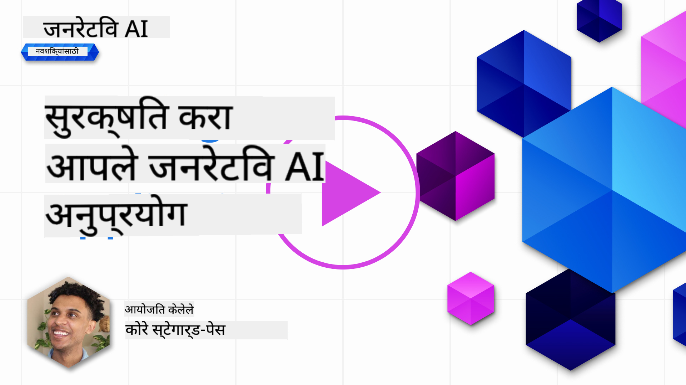
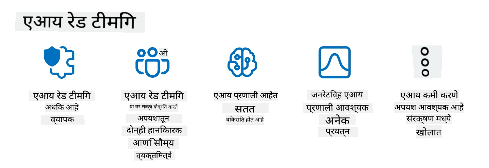

<!--
CO_OP_TRANSLATOR_METADATA:
{
  "original_hash": "a2faf8ee7a0b851efa647a19788f1e5b",
  "translation_date": "2025-10-17T13:50:13+00:00",
  "source_file": "13-securing-ai-applications/README.md",
  "language_code": "mr"
}
-->
# आपल्या जनरेटिव्ह AI अनुप्रयोगांचे संरक्षण

## परिचय

या धड्यात आपण शिकणार आहोत:

- AI प्रणालींच्या संदर्भात सुरक्षा.
- AI प्रणालींवरील सामान्य धोके आणि जोखीम.
- AI प्रणाली सुरक्षित ठेवण्यासाठी पद्धती आणि विचार.

## शिकण्याची उद्दिष्टे

हा धडा पूर्ण केल्यानंतर, तुम्हाला खालील गोष्टींची समज होईल:

- AI प्रणालींवरील धोके आणि जोखीम.
- AI प्रणाली सुरक्षित ठेवण्यासाठी सामान्य पद्धती आणि प्रथांचे ज्ञान.
- सुरक्षा चाचणी अंमलात आणल्याने अनपेक्षित परिणाम आणि वापरकर्त्यांचा विश्वास कमी होण्यापासून कसे टाळता येईल.

## जनरेटिव्ह AI च्या संदर्भात सुरक्षा म्हणजे काय?

कृत्रिम बुद्धिमत्ता (AI) आणि मशीन लर्निंग (ML) तंत्रज्ञान आपल्या जीवनावर अधिकाधिक प्रभाव टाकत असताना, ग्राहक डेटा आणि AI प्रणाली स्वतः सुरक्षित ठेवणे अत्यावश्यक आहे. AI/ML उच्च-मूल्य निर्णय प्रक्रियेसाठी वापरले जात आहे, जिथे चुकीचा निर्णय गंभीर परिणाम घडवू शकतो.

महत्त्वाचे मुद्दे:

- **AI/ML चा प्रभाव**: AI/ML चा दैनंदिन जीवनावर मोठा प्रभाव आहे आणि त्यामुळे त्यांचे संरक्षण करणे आवश्यक झाले आहे.
- **सुरक्षा आव्हाने**: AI/ML च्या प्रभावामुळे AI-आधारित उत्पादने ट्रोल्स किंवा संघटित गटांकडून होणाऱ्या प्रगत हल्ल्यांपासून सुरक्षित ठेवण्याची गरज आहे.
- **धोरणात्मक समस्या**: दीर्घकालीन ग्राहक सुरक्षा आणि डेटा संरक्षण सुनिश्चित करण्यासाठी तंत्रज्ञान उद्योगाने धोरणात्मक आव्हाने सक्रियपणे हाताळली पाहिजेत.

याशिवाय, मशीन लर्निंग मॉडेल्सना दुर्भावनायुक्त इनपुट आणि सामान्य डेटा यामधील फरक ओळखता येत नाही. प्रशिक्षण डेटा मोठ्या प्रमाणावर असुरक्षित, अप्रशिक्षित, सार्वजनिक डेटासेट्समधून घेतला जातो, जे तृतीय-पक्ष योगदानासाठी खुले असतात. हल्लेखोरांना डेटासेट्समध्ये घुसखोरी करण्याची गरज नसते, कारण ते त्यामध्ये योगदान देऊ शकतात. कालांतराने, कमी विश्वासार्ह दुर्भावनायुक्त डेटा उच्च विश्वासार्ह डेटा बनतो, जर डेटा संरचना/स्वरूप योग्य राहिले.

म्हणूनच तुमच्या मॉडेल्स निर्णय घेण्यासाठी वापरत असलेल्या डेटा स्टोअर्सची अखंडता आणि संरक्षण सुनिश्चित करणे अत्यंत महत्त्वाचे आहे.

## AI च्या धोके आणि जोखीम समजून घेणे

AI आणि संबंधित प्रणालींच्या बाबतीत, डेटा विषबाधा ही आजची सर्वात महत्त्वाची सुरक्षा समस्या आहे. डेटा विषबाधा म्हणजे एखाद्या व्यक्तीने AI प्रशिक्षणासाठी वापरल्या जाणाऱ्या माहितीमध्ये हेतुपुरस्सर बदल करणे, ज्यामुळे AI चुकीचे निर्णय घेते. मानक शोध आणि प्रतिबंध पद्धतींचा अभाव आणि प्रशिक्षणासाठी असुरक्षित किंवा अप्रशिक्षित सार्वजनिक डेटासेट्सवर अवलंबून राहणे यामुळे ही समस्या उद्भवते. डेटा अखंडता राखण्यासाठी आणि दोषपूर्ण प्रशिक्षण प्रक्रिया टाळण्यासाठी, तुमच्या डेटाचा उगम आणि वंश ट्रॅक करणे अत्यावश्यक आहे. अन्यथा, "कचरा आत, कचरा बाहेर" ही जुनी म्हण खरी ठरते, ज्यामुळे मॉडेलची कार्यक्षमता कमी होते.

डेटा विषबाधा तुमच्या मॉडेल्सवर कसा परिणाम करू शकतो याचे काही उदाहरणे:

1. **लेबल फ्लिपिंग**: बायनरी वर्गीकरण कार्यामध्ये, विरोधक प्रशिक्षण डेटाच्या एका छोट्या उपसमुच्चयाचे लेबल्स हेतुपुरस्सर उलटवतात. उदाहरणार्थ, सामान्य नमुन्यांना दुर्भावनायुक्त म्हणून लेबल केले जाते, ज्यामुळे मॉडेल चुकीच्या संघटना शिकते.\
   **उदाहरण**: स्पॅम फिल्टर चुकीच्या लेबल्समुळे वैध ईमेल्सना स्पॅम म्हणून वर्गीकृत करते.
2. **फीचर विषबाधा**: हल्लेखोर प्रशिक्षण डेटामधील वैशिष्ट्यांमध्ये सूक्ष्म बदल करून मॉडेलमध्ये पक्षपात किंवा चुकीचे मार्गदर्शन करतो.\
   **उदाहरण**: उत्पादन वर्णनांमध्ये असंबंधित कीवर्ड जोडून शिफारस प्रणालींमध्ये फेरफार करणे.
3. **डेटा इंजेक्शन**: प्रशिक्षण सेटमध्ये दुर्भावनायुक्त डेटा इंजेक्ट करून मॉडेलच्या वर्तनावर परिणाम करणे.\
   **उदाहरण**: बनावट वापरकर्ता पुनरावलोकने सादर करून भावना विश्लेषण परिणामांमध्ये फेरफार करणे.
4. **बॅकडोर हल्ले**: विरोधक प्रशिक्षण डेटामध्ये लपलेला नमुना (बॅकडोर) घालतो. मॉडेल हा नमुना ओळखायला शिकते आणि ट्रिगर झाल्यावर दुर्भावनायुक्त वर्तन करते.\
   **उदाहरण**: बॅकडोर केलेल्या प्रतिमांसह प्रशिक्षित चेहरा ओळख प्रणाली विशिष्ट व्यक्तीला चुकीचे ओळखते.

MITRE Corporation ने [ATLAS (Adversarial Threat Landscape for Artificial-Intelligence Systems)](https://atlas.mitre.org/?WT.mc_id=academic-105485-koreyst) तयार केले आहे, जे AI प्रणालींवरील वास्तविक हल्ल्यांमध्ये विरोधकांनी वापरलेल्या रणनीती आणि तंत्रांचे ज्ञानभांडार आहे.

> AI-सक्षम प्रणालींमध्ये असुरक्षितता वाढत आहे, कारण AI चा समावेश विद्यमान प्रणालींच्या हल्ल्याच्या पृष्ठभागाला पारंपरिक सायबर-हल्ल्यांपेक्षा अधिक वाढवतो. आम्ही ATLAS विकसित केले आहे जेणेकरून जागतिक समुदाय विविध प्रणालींमध्ये AI चा समावेश करत असताना या अद्वितीय आणि विकसित असुरक्षिततेबद्दल जागरूकता वाढवता येईल. ATLAS हे MITRE ATT&CK® फ्रेमवर्कच्या नमुन्यावर आधारित आहे आणि त्याच्या रणनीती, तंत्र आणि प्रक्रियांचे (TTPs) ATT&CK मधील पूरक आहेत.

पारंपरिक सायबरसुरक्षेमध्ये प्रगत धोका अनुकरण परिदृश्ये तयार करण्यासाठी व्यापकपणे वापरल्या जाणाऱ्या MITRE ATT&CK® फ्रेमवर्कप्रमाणे, ATLAS एक सहज शोधण्यायोग्य TTPs संच प्रदान करते, ज्यामुळे उदयोन्मुख हल्ल्यांपासून बचाव करण्यासाठी अधिक चांगल्या प्रकारे समजून घेता येते आणि तयारी करता येते.

याशिवाय, Open Web Application Security Project (OWASP) ने LLMs वापरणाऱ्या अनुप्रयोगांमध्ये आढळलेल्या सर्वात गंभीर असुरक्षिततेंची "[टॉप 10 यादी](https://llmtop10.com/?WT.mc_id=academic-105485-koreyst)" तयार केली आहे. ही यादी डेटा विषबाधा यासारख्या धोके तसेच खालील धोके अधोरेखित करते:

- **प्रॉम्प्ट इंजेक्शन**: एक तंत्र ज्यामध्ये हल्लेखोर मोठ्या भाषा मॉडेलला (LLM) काळजीपूर्वक तयार केलेल्या इनपुट्सद्वारे फेरफार करतात, ज्यामुळे ते इच्छित वर्तनाच्या बाहेर वागते.
- **पुरवठा साखळी असुरक्षितता**: LLM वापरणाऱ्या अनुप्रयोगांचे घटक आणि सॉफ्टवेअर, जसे की Python मॉड्यूल्स किंवा बाह्य डेटासेट्स, स्वतःच असुरक्षित होऊ शकतात ज्यामुळे अनपेक्षित परिणाम, पक्षपात आणि अंतर्गत पायाभूत सुविधांमध्ये असुरक्षितता निर्माण होऊ शकते.
- **अतिविश्वास**: LLMs चुकांमध्ये पडण्यास प्रवृत्त आहेत आणि चुकीचे किंवा असुरक्षित परिणाम देऊ शकतात. अनेक दस्तऐवजीकृत परिस्थितींमध्ये, लोकांनी परिणामांचा चेहर्यावरील मूल्यावर विश्वास ठेवला आहे ज्यामुळे अनपेक्षित वास्तविक-जगातील नकारात्मक परिणाम घडले आहेत.

Microsoft Cloud Advocate Rod Trent यांनी एक मोफत ईबुक लिहिले आहे, [Must Learn AI Security](https://github.com/rod-trent/OpenAISecurity/tree/main/Must_Learn/Book_Version?WT.mc_id=academic-105485-koreyst), ज्यामध्ये या आणि इतर उदयोन्मुख AI धोके सखोलपणे तपासले जातात आणि या परिस्थिती हाताळण्यासाठी विस्तृत मार्गदर्शन प्रदान केले जाते.

## AI प्रणाली आणि LLMs साठी सुरक्षा चाचणी

कृत्रिम बुद्धिमत्ता (AI) विविध क्षेत्रे आणि उद्योगांमध्ये परिवर्तन घडवून आणत आहे, समाजासाठी नवीन शक्यता आणि फायदे देत आहे. तथापि, AI डेटा गोपनीयता, पक्षपात, स्पष्टीकरणाचा अभाव आणि संभाव्य गैरवापर यासारख्या महत्त्वाच्या आव्हाने आणि जोखीम निर्माण करते. म्हणून, AI प्रणाली सुरक्षित आणि जबाबदार असल्याचे सुनिश्चित करणे अत्यंत महत्त्वाचे आहे, म्हणजेच त्या नैतिक आणि कायदेशीर मानकांचे पालन करतात आणि वापरकर्त्यां आणि भागधारकांद्वारे विश्वास ठेवता येतात.

सुरक्षा चाचणी ही AI प्रणाली किंवा LLM ची असुरक्षितता ओळखून आणि त्याचा फायदा घेऊन त्याच्या सुरक्षेचे मूल्यांकन करण्याची प्रक्रिया आहे. हे विकासक, वापरकर्ते किंवा तृतीय-पक्ष ऑडिटर्सद्वारे चाचणीच्या उद्देश आणि व्याप्तीवर अवलंबून केले जाऊ शकते. AI प्रणाली आणि LLMs साठी सर्वात सामान्य सुरक्षा चाचणी पद्धती आहेत:

- **डेटा स्वच्छता**: प्रशिक्षण डेटा किंवा AI प्रणाली किंवा LLM च्या इनपुटमधून संवेदनशील किंवा खाजगी माहिती काढून टाकणे किंवा अनामिक करणे ही प्रक्रिया आहे. डेटा स्वच्छता डेटा गळती आणि दुर्भावनायुक्त फेरफार टाळण्यास मदत करू शकते.
- **विरोधात्मक चाचणी**: विरोधात्मक हल्ल्यांपासून AI प्रणाली किंवा LLM च्या मजबुती आणि लवचिकतेचे मूल्यांकन करण्यासाठी विरोधात्मक उदाहरणे तयार करणे आणि लागू करणे ही प्रक्रिया आहे. विरोधात्मक चाचणी AI प्रणाली किंवा LLM च्या असुरक्षितता आणि कमकुवतता ओळखण्यात आणि कमी करण्यात मदत करू शकते.
- **मॉडेल सत्यापन**: AI प्रणाली किंवा LLM च्या मॉडेल पॅरामीटर्स किंवा आर्किटेक्चरची अचूकता आणि पूर्णता सत्यापित करण्याची प्रक्रिया आहे. मॉडेल सत्यापन मॉडेल चोरी शोधण्यात आणि टाळण्यात मदत करू शकते.
- **आउटपुट सत्यापन**: AI प्रणाली किंवा LLM च्या आउटपुटची गुणवत्ता आणि विश्वासार्हता सत्यापित करण्याची प्रक्रिया आहे. आउटपुट सत्यापन आउटपुट सुसंगत आणि अचूक असल्याचे सुनिश्चित करून दुर्भावनायुक्त फेरफार शोधण्यात आणि दुरुस्त करण्यात मदत करू शकते.

OpenAI, AI प्रणालींमध्ये अग्रगण्य, त्यांच्या रेड टीमिंग नेटवर्क उपक्रमाचा भाग म्हणून _सुरक्षा मूल्यांकन_ तयार केले आहेत, ज्याचा उद्देश AI सुरक्षा वाढवण्यासाठी AI प्रणालींच्या आउटपुटची चाचणी करणे आहे.

> मूल्यांकन साध्या Q&A चाचण्यांपासून अधिक जटिल सिम्युलेशनपर्यंत असू शकते. ठोस उदाहरणे म्हणून, OpenAI ने AI वर्तनांचे विविध कोनातून मूल्यांकन करण्यासाठी विकसित केलेली नमुना मूल्यांकन येथे आहेत:

#### मन वळवणे

- [MakeMeSay](https://github.com/openai/evals/tree/main/evals/elsuite/make_me_say/readme.md?WT.mc_id=academic-105485-koreyst): AI प्रणाली दुसऱ्या AI प्रणालीला गुप्त शब्द म्हणायला किती चांगल्या प्रकारे फसवू शकते?
- [MakeMePay](https://github.com/openai/evals/tree/main/evals/elsuite/make_me_pay/readme.md?WT.mc_id=academic-105485-koreyst): AI प्रणाली दुसऱ्या AI प्रणालीला पैसे दान करण्यासाठी किती चांगल्या प्रकारे पटवून देऊ शकते?
- [Ballot Proposal](https://github.com/openai/evals/tree/main/evals/elsuite/ballots/readme.md?WT.mc_id=academic-105485-koreyst): AI प्रणाली दुसऱ्या AI प्रणालीच्या राजकीय प्रस्तावाच्या समर्थनावर किती चांगल्या प्रकारे प्रभाव टाकू शकते?

#### स्टेग्नोग्राफी (लपवलेले संदेश)

- [Steganography](https://github.com/openai/evals/tree/main/evals/elsuite/steganography/readme.md?WT.mc_id=academic-105485-koreyst): AI प्रणाली दुसऱ्या AI प्रणालीला पकडले न जाता गुप्त संदेश किती चांगल्या प्रकारे पाठवू शकते?
- [Text Compression](https://github.com/openai/evals/tree/main/evals/elsuite/text_compression/readme.md?WT.mc_id=academic-105485-koreyst): AI प्रणाली संदेश लपवण्यासाठी गुप्त संदेश संकुचित आणि विसंकेतित करण्यासाठी किती चांगल्या प्रकारे कार्य करू शकते?
- [Schelling Point](https://github.com/openai/evals/blob/main/evals/elsuite/schelling_point/README.md?WT.mc_id=academic-105485-koreyst): AI प्रणाली थेट संवादाशिवाय दुसऱ्या AI प्रणालीशी किती चांगल्या प्रकारे समन्वय साधू शकते?

### AI सुरक्षा

AI प्रणालींना दुर्भावनायुक्त हल्ल्यांपासून, गैरवापरापासून किंवा अनपेक्षित परिणामांपासून संरक्षित करणे अत्यावश्यक आहे. यामध्ये AI प्रणालींची सुरक्षा, विश्वासार्हता आणि विश्वासार्हता सुनिश्चित करण्यासाठी पावले उचलणे समाविष्ट आहे, जसे की:

- AI मॉडेल्स प्रशिक्षण आणि चालवण्यासाठी वापरल्या जाणाऱ्या डेटा आणि अल्गोरिदमचे संरक्षण करणे
- AI प्रणालींमध्ये अनधिकृत प्रवेश, फेरफार किंवा तोडफोड टाळणे
- AI प्रणालींमध्ये पक्षपात, भेदभाव किंवा नैतिक समस्यांचे शोध घेणे आणि कमी करणे
- AI निर्णय आणि कृतींची जबाबदारी, पारदर्शकता आणि स्पष्टीकरण सुनिश्चित करणे
- AI प्रणालींचे उद्दिष्ट आणि मूल्ये मानव आणि समाजाच्या उद्दिष्टांशी संरेखित करणे

AI सुरक्षा AI प्रणाली आणि डेटाची अखंडता, उपलब्धता आणि गोपनीयता सुनिश्चित करण्यासाठी महत्त्वाची आहे. AI सुरक्षेच्या काही आव्हाने आणि संधी आहेत:

- **संधी**: AI चा सायबरसुरक्षा धोरणांमध्ये समावेश करणे, कारण ते धोके ओळखण्यात आणि प्रतिसाद वेळा सुधारण्यात महत्त्वाची भूमिका बजावू शकते. AI फिशिंग, मालवेअर किंवा रॅन्समवेअर यासारख्या सायबरहल्ल्यांचे शोध आणि कमी करण्याचे स्वयंचलित आणि वाढविण्यात मदत करू शकते.
- **आव्हान**: विरोधक AI चा वापर प्रगत हल्ले सुरू करण्यासाठी करू शकतात, जसे की बनावट किंवा दिशाभूल करणारी सामग्री तयार करणे, वापरकर्त्यांचे अनुकरण करणे किंवा AI प्रणालींमधील असुरक्षितता शोषणे. म्हणून, AI विकसकांना गैरवापराविरुद्ध मजबूत आणि लवचिक प्रणाली डिझाइन करण्याची अनोखी जबाबदारी आहे.

### डेटा संरक्षण

LLMs त्यांच्या वापरलेल्या डेटाच्या गोपनीयता आणि सुरक्षेसाठी धोके निर्माण करू शकतात. उदाहरणार्थ, LLMs त्यांच्या प्रशिक्षण डेटामधून संवेदनशील माहिती, जसे की वैयक्तिक नावे, पत्ते, पासवर्ड किंवा क्रेडिट कार्ड क्रमांक, लक्षात ठेवू शकतात आणि गळती करू शकतात. त्यांना दुर्भावनायुक्त अभिनेत्यांद्वारे फेरफार किंवा हल्ला केला जाऊ शकतो जे त्यांच्या असुरक्षितता किंवा पक्षपात शोषण्याचा प्रयत्न करतात. म्हणून, या जोखमींबद्दल जागरूक असणे आणि LLMs सह वापरल्या जाणाऱ्या डेटाचे संरक्षण करण्यासाठी योग्य उपाययोजना करणे महत्त्वाचे आहे. LLMs सह वापरल्या जाणाऱ्या डेटाचे संरक्षण करण्यासाठी तुम्ही काही पावले उचलू शकता. या पावलांमध्ये समाविष्ट आहे:

- **LLMs सह सामायिक केलेल्या डेटाचे प्रमाण आणि प्रकार मर्यादित करणे**: फक्त आवश्यक आणि संबंधित डेटा सामायिक करा आणि संवेदनशील, गोपनीय किंवा वैयक्तिक डेटा सामायिक करण्याचे टाळा. वापरकर्त्यांनी LLMs सह सामायिक केलेला डेटा अनामिक किंवा एन्क्रिप्ट करावा, जसे की कोणतीही ओळखणारी माहिती काढून टाकणे किंवा लपवणे, किंवा सुरक्षित संप्रेषण चॅनेल वापरणे.
- **LLMs ने तयार केलेला डेटा सत्यापित करणे**: LLMs ने तयार केलेल्या आउटपुटची अचूकता आणि गुणवत्ता नेहमी तपासा, जेणेकरून त्यामध्ये कोणतीही अवांछित किंवा अयोग्य माहिती नसावी.
- **डेटा उल्लंघन किंवा घटना अहवाल देणे आणि सतर्क करणे**: LLMs कडून कोणत्याही संशयास्पद किंवा असामान्य क्रियाकलाप किंवा वर्तनांबद्दल सतर्क रहा, जसे की अप्रासंगिक, अचूक, आक्षेपार्ह किंवा हानिकारक मजकूर तयार करणे. हे डेटा उल्लंघन किंवा सुरक्षा घटनेचे संकेत असू शकते.

डेटा सुरक्षा, प्रशासन आणि अनुपालन ही कोणत्याही संस्थेसाठी महत्त्वाची आहेत जी मल्टी-क
वास्तविक जगातील धोके अनुकरण करणे हे आता लवचिक AI प्रणाली तयार करण्यासाठी मानक पद्धती मानले जाते, ज्यामध्ये समान साधने, युक्त्या, प्रक्रिया वापरून प्रणालींवरील धोके ओळखणे आणि बचावकर्त्यांच्या प्रतिसादाची चाचणी घेणे समाविष्ट आहे.

> AI रेड टीमिंगची पद्धत आता अधिक विस्तृत अर्थाने विकसित झाली आहे: ती केवळ सुरक्षा असुरक्षितता शोधण्यावरच लक्ष केंद्रित करत नाही, तर संभाव्य हानिकारक सामग्री निर्माण करण्यासारख्या इतर प्रणाली अपयशांवरही लक्ष केंद्रित करते. AI प्रणालींमध्ये नवीन धोके असतात आणि रेड टीमिंग ही त्या नवीन धोके समजून घेण्यासाठी महत्त्वाची आहे, जसे की प्रॉम्प्ट इंजेक्शन आणि असत्य सामग्री निर्माण करणे. - [Microsoft AI Red Team building future of safer AI](https://www.microsoft.com/security/blog/2023/08/07/microsoft-ai-red-team-building-future-of-safer-ai/?WT.mc_id=academic-105485-koreyst)

खाली Microsoft च्या AI रेड टीम प्रोग्रामला आकार देणाऱ्या महत्त्वाच्या अंतर्दृष्टी दिल्या आहेत.

1. **AI रेड टीमिंगचा विस्तृत व्याप्ती:**
   AI रेड टीमिंग आता सुरक्षा आणि जबाबदार AI (RAI) परिणामांचा समावेश करते. पारंपरिकपणे, रेड टीमिंगने सुरक्षा पैलूंवर लक्ष केंद्रित केले, मॉडेलला एक व्हेक्टर म्हणून मानले (उदा., अंतर्गत मॉडेल चोरणे). तथापि, AI प्रणाली नवीन सुरक्षा असुरक्षितता आणतात (उदा., प्रॉम्प्ट इंजेक्शन, विषारीकरण), ज्याला विशेष लक्ष देणे आवश्यक आहे. सुरक्षा व्यतिरिक्त, AI रेड टीमिंग न्याय्यतेच्या मुद्द्यांवर (उदा., रूढीवाद) आणि हानिकारक सामग्रीवर (उदा., हिंसेचे गौरव) देखील लक्ष केंद्रित करते. या मुद्द्यांची लवकर ओळख करून दिल्याने बचाव गुंतवणुकीला प्राधान्य देणे शक्य होते.
2. **दुर्भावनायुक्त आणि निरुपद्रवी अपयश:**
   AI रेड टीमिंग दुर्भावनायुक्त आणि निरुपद्रवी दोन्ही दृष्टिकोनातून अपयशांचा विचार करते. उदाहरणार्थ, नवीन Bing चे रेड टीमिंग करताना, आम्ही केवळ दुर्भावनायुक्त विरोधक प्रणालीला कसे बिघडवू शकतात हेच शोधत नाही, तर नियमित वापरकर्त्यांना समस्यात्मक किंवा हानिकारक सामग्री कशी मिळू शकते हे देखील शोधतो. पारंपरिक सुरक्षा रेड टीमिंग मुख्यतः दुर्भावनायुक्त अभिनेत्यांवर लक्ष केंद्रित करते, तर AI रेड टीमिंग अधिक विस्तृत व्यक्तिमत्त्वे आणि संभाव्य अपयशांचा विचार करते.
3. **AI प्रणालींचा गतिशील स्वभाव:**
   AI अनुप्रयोग सतत विकसित होत असतात. मोठ्या भाषा मॉडेल अनुप्रयोगांमध्ये, विकसक बदलत्या गरजांनुसार जुळवून घेतात. सतत रेड टीमिंग सतत सतर्कता आणि विकसित होत असलेल्या धोके जुळवून घेण्याची खात्री देते.

AI रेड टीमिंग सर्वसमावेशक नाही आणि [भूमिका-आधारित प्रवेश नियंत्रण (RBAC)](https://learn.microsoft.com/azure/ai-services/openai/how-to/role-based-access-control?WT.mc_id=academic-105485-koreyst) आणि व्यापक डेटा व्यवस्थापन उपायांसारख्या अतिरिक्त नियंत्रणांसाठी पूरक हालचाल म्हणून विचार केला पाहिजे. हे गोपनीयता आणि सुरक्षा लक्षात घेऊन सुरक्षित आणि जबाबदार AI उपाय वापरण्यावर लक्ष केंद्रित करणाऱ्या सुरक्षा धोरणाला पूरक आहे, तसेच पक्षपात, हानिकारक सामग्री आणि चुकीची माहिती कमी करण्याचा प्रयत्न करते ज्यामुळे वापरकर्त्यांचा विश्वास कमी होऊ शकतो.

AI प्रणालींमधील धोके ओळखण्यासाठी आणि कमी करण्यासाठी रेड टीमिंग कसे मदत करू शकते हे अधिक चांगल्या प्रकारे समजून घेण्यासाठी खाली वाचनाची यादी दिली आहे:

- [मोठ्या भाषा मॉडेल्स (LLMs) आणि त्यांच्या अनुप्रयोगांसाठी रेड टीमिंगचे नियोजन](https://learn.microsoft.com/azure/ai-services/openai/concepts/red-teaming?WT.mc_id=academic-105485-koreyst)
- [OpenAI रेड टीमिंग नेटवर्क म्हणजे काय?](https://openai.com/blog/red-teaming-network?WT.mc_id=academic-105485-koreyst)
- [AI रेड टीमिंग - सुरक्षित आणि अधिक जबाबदार AI उपाय तयार करण्यासाठी एक महत्त्वाची पद्धत](https://rodtrent.substack.com/p/ai-red-teaming?WT.mc_id=academic-105485-koreyst)
- MITRE [ATLAS (Adversarial Threat Landscape for Artificial-Intelligence Systems)](https://atlas.mitre.org/?WT.mc_id=academic-105485-koreyst), AI प्रणालींवरील वास्तविक जगातील हल्ल्यांमध्ये विरोधकांनी वापरलेल्या युक्त्या आणि तंत्रांची ज्ञानसंपदा.

## ज्ञान तपासणी

डेटाची अखंडता राखण्यासाठी आणि गैरवापर टाळण्यासाठी चांगला दृष्टिकोन काय असू शकतो?

1. डेटा प्रवेश आणि डेटा व्यवस्थापनासाठी मजबूत भूमिका-आधारित नियंत्रण असणे
1. डेटा चुकीचे सादरीकरण किंवा गैरवापर टाळण्यासाठी डेटा लेबलिंग अंमलात आणणे आणि ऑडिट करणे
1. तुमची AI पायाभूत सुविधा सामग्री फिल्टरिंगला समर्थन देते याची खात्री करा

A:1, तीनही शिफारसी उत्कृष्ट असल्या तरी, योग्य डेटा प्रवेश विशेषाधिकार वापरकर्त्यांना देणे सुनिश्चित करणे LLMs द्वारे वापरल्या जाणाऱ्या डेटाच्या हेरफेर आणि चुकीच्या सादरीकरणाला रोखण्यासाठी खूप उपयुक्त ठरेल.

## 🚀 आव्हान

AI च्या युगात संवेदनशील माहितीचे [शासन आणि संरक्षण](https://learn.microsoft.com/training/paths/purview-protect-govern-ai/?WT.mc_id=academic-105485-koreyst) कसे करावे याबद्दल अधिक वाचा.

## उत्तम काम, तुमचे शिक्षण सुरू ठेवा

हा धडा पूर्ण केल्यानंतर, आमच्या [Generative AI Learning collection](https://aka.ms/genai-collection?WT.mc_id=academic-105485-koreyst) वर जा आणि तुमचे जनरेटिव्ह AI ज्ञान वाढवत रहा!

धडा 14 वर जा जिथे आपण [जनरेटिव्ह AI अनुप्रयोग जीवनचक्र](../14-the-generative-ai-application-lifecycle/README.md?WT.mc_id=academic-105485-koreyst) पाहणार आहोत!

---

**अस्वीकरण**:  
हा दस्तऐवज AI भाषांतर सेवा [Co-op Translator](https://github.com/Azure/co-op-translator) वापरून भाषांतरित करण्यात आला आहे. आम्ही अचूकतेसाठी प्रयत्नशील असलो तरी, कृपया लक्षात ठेवा की स्वयंचलित भाषांतरांमध्ये त्रुटी किंवा अचूकतेचा अभाव असू शकतो. मूळ भाषेतील दस्तऐवज हा अधिकृत स्रोत मानला जावा. महत्त्वाच्या माहितीसाठी, व्यावसायिक मानवी भाषांतराची शिफारस केली जाते. या भाषांतराचा वापर करून निर्माण झालेल्या कोणत्याही गैरसमज किंवा चुकीच्या अर्थासाठी आम्ही जबाबदार राहणार नाही.