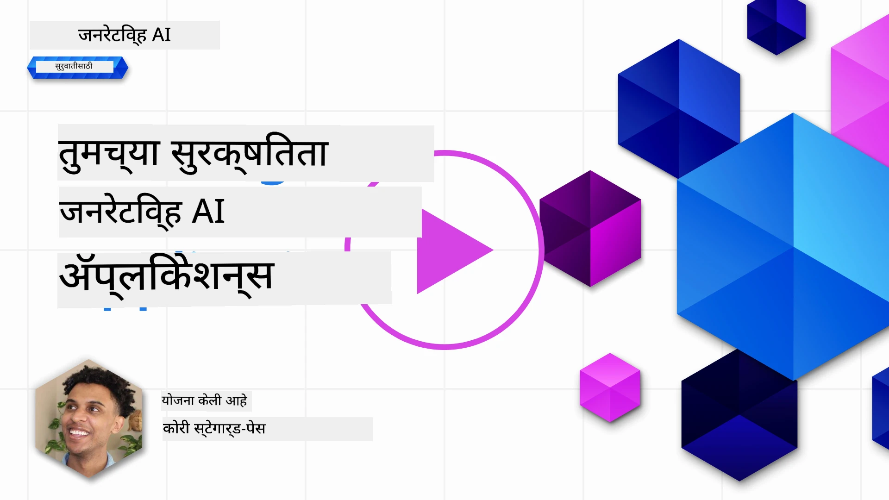
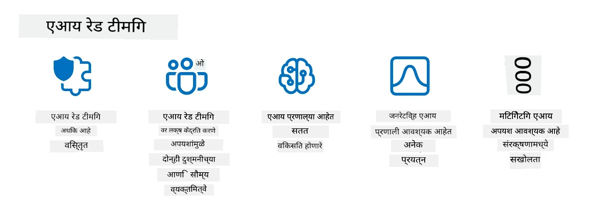

# आपल्या जनरेटिव्ह AI अनुप्रयोगांचे संरक्षण

## परिचय

हा धडा पुढील गोष्टींचा आढावा घेईल:

- AI प्रणालींच्या संदर्भातील सुरक्षा.
- AI प्रणालींसाठी सामान्य धोके आणि जोखमी.
- AI प्रणालींचे संरक्षण करण्याच्या पद्धती आणि विचार करण्याच्या बाबी.

## शिकण्याची उद्दिष्टे

हा धडा पूर्ण केल्यानंतर, आपण समजून घेणार आहात:

- AI प्रणालींसाठी धोके आणि जोखीम काय आहेत.
- AI प्रणालींच्या सुरक्षेसाठी सामान्य पद्धती आणि प्रथा.
- सुरक्षा चाचणीची अंमलबजावणी करून अनपेक्षित परिणाम टाळणे आणि वापरकर्त्यांचा विश्वास कसा टिकवता येईल.

## जनरेटिव्ह AI च्या संदर्भातील सुरक्षा म्हणजे काय?

जेव्हा आर्टिफिशियल इंटेलिजेंस (AI) आणि मशीन लर्निंग (ML) तंत्रज्ञान आमच्या जीवनाचा भाग बनत आहे, तेव्हा केवळ ग्राहक डेटा नाही तर AI प्रणालींचे संरक्षण देखील अत्यंत महत्वाचे आहे. AI/ML हे जास्तीत जास्त उच्च-मूल्य ठराव प्रक्रियांसाठी औद्योगिक वापरात येत आहेत, जिथे चुकीच्या निर्णयामुळे गंभीर परिणाम होऊ शकतात.

येथे काही महत्त्वाचे मुद्दे आहेत:

- **AI/ML चे परिणाम**: AI/ML रोजच्या जीवनावर मोठा प्रभाव टाकतात आणि त्यामुळे त्यांचे संरक्षण आवश्यक झाले आहे.
- **सुरक्षा आव्हाने**: AI/ML चा हा प्रभाव योग्य लक्षपूर्वक हाताळणं गरजेचं आहे जेणेकरून रोखट किंवा संघटित हल्लेखोरांकडून AI आधारित उत्पादनांचे संरक्षण करता येईल.
- **सामरिक समस्या**: तंत्रज्ञान उद्योगाने दीर्घकालीन ग्राहक सुरक्षितता आणि डेटा सुरक्षेसाठी सामरिक आव्हानांचे सक्रियपणे निराकरण करणे आवश्यक आहे.

शिवाय, मशीन लर्निंग मॉडेल्स सामान्यतः द्वेषपूर्ण इनपुट आणि साध्या अपवादात्मक डेटामध्ये फरक ओळखत नाहीत. प्रशिक्षणासाठी वापरलेला महत्त्वाचा डेटा सार्वजनिक, असंयोजित, आणि 3-यांकडून योगदानासाठी खुला असतो. हल्लेखोरांना डेटासेट्स तुटवण्याची गरज नाही कारण ते त्यात सहभागी होऊ शकतात. कालांतराने कमी विश्वासार्ह द्वेषपूर्ण डेटा उच्च विश्वासार्ह डेटात रुपांतरित होतो, जर डेटा रचना/स्वरूप योग्य असल्यास.

त्यामुळे आपल्या मॉडेल्सना निर्णय घेण्यासाठी वापरल्या जाणाऱ्या डेटास्टोअर्सची संपूर्ण अखंडता आणि संरक्षण सुनिश्चित करणे आवश्यक आहे.

## AI चे धोके आणि जोखमी समजून घेणे

AI आणि संबंधित प्रणालींसंदर्भात, डेटा विषबाधा आजच्या सर्वात मोठ्या सुरक्षा धोका म्हणून ओळखली जाते. डेटा विषबाधा म्हणजे एखादी व्यक्ती जानून AI च्या प्रशिक्षणासाठी वापरल्या जाणाऱ्या माहितीमध्ये बदल करते, ज्यामुळे चुकीचे निकाल येतात. याचे कारण म्हणजे मानक शोध व प्रतिबंध पद्धतींचा अभाव आणि आमचा अमर्याद सार्वजनिक डेटासेट्सवर अवलंबित्व. डेटाची अखंडता राखण्यासाठी आणि प्रशिक्षण प्रक्रियेत चूक टाळण्यासाठी, आपल्या डेटाचा स्रोत आणि ओळख तपासणे अत्यंत गरजेचे असते. अन्यथा, जुनं म्हणणं "कायकाय टाकाल, तसंच मिळेल" खरे ठरते आणि मॉडेलच्या कामगिरीवर परिणाम होतो.

येथे डेट विषबाधेमुळे होऊ शकणाऱ्या परिणामांचे काही उदाहरणे आहेत:

1. **लेबल पलटणे**: दुहेरी वर्गीकरण कार्यात, एक आक्रांता प्रशिक्षण डेटाच्या कमी संख्येच्या लेबल बदलतो. उदाहरणार्थ, साधे नमुने द्वेषपूर्ण असे लेबल केले जातात, ज्यामुळे मॉडेल चुकीचे संबंध शिकते.\
   **उदाहरण**: एक स्पॅम फिल्टर चुकीच्या लेबलिंगमुळे वैध ईमेल्सना स्पॅम म्हणून वर्गीकरण करतो.
2. **वैशिष्ट्य विषबाधा**: आक्रमणकर्ता प्रशिक्षण डेटातील वैशिष्ट्ये सूक्ष्म रीतीने बदलतो जेणेकरून मॉडेलमध्ये पूर्वग्रह निर्माण होतो किंवा गोंधळ निर्माण होतो.\
   **उदाहरण**: उत्पादन वर्णनांमध्ये नामोजक कीवर्ड्स जोडून शिफारस प्रणालींवर परिणाम करणे.
3. **डेटा इंजेक्शन**: द्वेषपूर्ण डेटा प्रशिक्षण संचात लावून मॉडेलच्या वागणुकीवर परिणाम करणे.\
   **उदाहरण**: खोट्या वापरकर्ता पुनरावलोकनाद्वारे भावना विश्लेषणाचा परिणाम बदलणे.
4. **बॅकडोअर हल्ले**: आक्रमणकर्ता प्रशिक्षण डेटामध्ये लपवलेले नमुने (बॅकडोअर) समाविष्ट करतो. मॉडेल हा नमुना ओळखून, जेंव्हा उघडकीस येतो, तेंव्हा द्वेषपूर्ण वर्तणूक करतो.\
   **उदाहरण**: बॅकडोअर्ड इमेजेसने प्रशिक्षित केलेली चेहरा ओळख प्रणाली विशिष्ट व्यक्तीचे चुकीचे ओळख करते.

MITRE कॉर्पोरेशनने [ATLAS (Adversarial Threat Landscape for Artificial-Intelligence Systems)](https://atlas.mitre.org/?WT.mc_id=academic-105485-koreyst) तयार केले आहे, जी AI प्रणालींवर आक्रमणासाठी वापरल्या जाणाऱ्या धोरणे आणि तंत्रांची ज्ञानकोश आहे.

> AI-सक्षम प्रणालींमध्ये दुर्बलता वाढत आहेत, कारण AI चा समावेश सध्याच्या प्रणालींच्या हल्ल्यांच्या पृष्ठभागाला पार करून वाढवितो. ATLAS हे या अद्वितीय आणि वाढत चाललेल्या दुर्बलतेबाबत जागरूकता वाढविण्यासाठी विकसित केले गेले आहे, कारण जागतिक समुदाय वेगवेगळ्या प्रणालींमध्ये AI समाविष्ट करत आहे. ATLAS MITRE ATT&CK® फ्रेमवर्क प्रमाणेच डिझाइन केले आहे आणि त्याच्यासह त्याची धोरणे, तंत्रे आणि प्रक्रिये (TTPs) पूरक आहेत.

जुन्या MITRE ATT&CK® फ्रेमवर्कप्रमाणेच, जे पारंपरिक सायबरसुरक्षा मध्ये प्रगत धमकी अनुकरणासाठी वापरले जाते, ATLAS देखील सहज शोधता येणाऱ्या TTPs चा संच पुरवते ज्यामुळे नवीन हल्ल्यांविरुद्ध संरक्षण अधिक चांगल्या प्रकारे समजून घेता येते.

शिवाय, Open Web Application Security Project (OWASP) ने LLMs वापरणाऱ्या अनुप्रयोगांतील सर्वात गंभीर दुर्बलता दर्शवणारी "[Top 10 list](https://llmtop10.com/?WT.mc_id=academic-105485-koreyst)" तयार केली आहे. या यादीत डेटा विषबाधा तसेच इतर धोके समाविष्ट आहेत:

- **प्रॉम्प्ट इंजेक्शन**: यामध्ये आक्रमणकर्ते लक्षपूर्वक तयार केलेल्या इनपुटद्वारे मोठ्या भाषा मॉडेल्स (LLM) चे नियंत्रित वर्तन करू शकतात.
- **पुरवठा साखळीच्या दुर्बलता**: LLM वापरलेल्या अनुप्रयोगांतील घटक आणि सॉफ्टवेअर, जसे की Python मॉड्यूल्स किंवा बाह्य डेटासेट्स, स्वत: दुर्बल असू शकतात ज्यामुळे अनपेक्षित परिणाम, पूर्वाग्रह आणि इन्फ्रास्ट्रक्चरशी संबंधित कमजोरी निर्माण होऊ शकतात.
- **अत्यधिक अवलंबित्व**: LLMs चुका करु शकतात आणि अनेक उदाहरणांमध्ये भ्रामक किंवा सुरक्षित नसलेले निकाल दिले आहेत. लोकांनी चुकीच्या निकालांवर विश्वास ठेवून प्रतिकूल परिणाम होऊ शकतात.

Microsoft क्लाउड अॅडव्होकेट Rod Trent यांनी एक मोफत ईबुक, [Must Learn AI Security](https://github.com/rod-trent/OpenAISecurity/tree/main/Must_Learn/Book_Version?WT.mc_id=academic-105485-koreyst) लिहिला आहे ज्यात हे आणि इतर उदयोन्मुख AI धोके सखोलपणे विशद केले आहेत आणि त्यांच्या हाताळणीसाठी सविस्तर मार्गदर्शन दिले आहे.

## AI प्रणाली आणि LLMs साठी सुरक्षा चाचणी

कृत्रिम बुद्धिमत्ता (AI) विविध क्षेत्रे आणि उद्योगांत बदल घडवत आहे, समाजासाठी नवनवीन संधी आणि फायदे आणत आहे. मात्र, AI त्याच वेळी मोठे आव्हाने आणि जोखमी देखील पोहोचवतो, जसे की डेटा गोपनीयता, पूर्वग्रह, सांगता अभाव, आणि दुरुपयोगाची शक्यता. म्हणूनच AI प्रणाली सुरक्षित आणि जबाबदार असणे आवश्यक आहे, म्हणजे त्या नैतिक आणि कायदेशीर मानकांचे पालन करतात आणि वापरकर्ते व हितधारक त्यांच्यावर विश्वास ठेवू शकतात.

सुरक्षा चाचणी म्हणजे AI प्रणाली किंवा LLM ची सुरक्षा मूल्यांकन करणे, त्यातील दुर्बलतांचा शोध घेणे आणि त्याचा फायदा उघड करणे. हे विकासक, वापरकर्ते किंवा तृतीय-पक्ष लेखापरक्षक करू शकतात, चाचणीच्या हेतू आणि व्यापानुसार. AI प्रणाली आणि LLM साठी सामान्य सुरक्षा चाचणी पद्धती आहेत:

- **डेटा साफसफाई**: हे प्रशिक्षण डेटा किंवा इनपुटमधून संवेदनशील किंवा खासगी माहिती काढणे किंवा अज्ञात करणे होय. डेटा साफसफाईमुळे डेटा लीक होण्यापासून आणि द्वेषपूर्ण हस्तक्षेपापासून बचाव होतो.
- **विरोधी चाचणी**: विरोधी उदाहरणे तयार करून AI प्रणाली किंवा LLM च्या इनपुट किंवा आउटपुटवर लागू करुन त्याची प्रतिकारशक्ती आणि टिकाऊपणा तपासणे. विरोधी चाचणी द्वारे दुर्बलता आणि कमक्या ओळखल्या आणि प्रतिबंधित केल्या जाऊ शकतात.
- **मॉडेल पडताळणी**: AI प्रणाली किंवा LLM च्या मॉडेलच्या अचूकता आणि पूर्णतेची पडताळणी करणे. मॉडेल चोरी रोखण्यासाठी याचा उपयोग होतो.
- **आउटपुट मान्यता**: AI प्रणाली किंवा LLM च्या आउटपुटची गुणवत्ता आणि विश्वसनीयता तपासणे. द्वेषपूर्ण हस्तक्षेप शोधणे आणि सुधारणा करणे यासाठी आउटपुटचे प्रमाणित करणे आवश्यक आहे.

OpenAI ने, AI प्रणालीतले नेतृत्व करत, त्यांच्या रेड टीम नेटवर्क उपक्रमाचा भाग म्हणून _सुरक्षा मूल्यांकनांची_ मालिका तयार केली आहे, ज्याचा उद्देश AI सुरक्षेत सहकार्य करणे हा आहे.

> मूल्यांकने सोप्या प्रश्न-उत्तर चाचण्यांपासून अधिक गुंतागुंतीच्या सिम्युलेशन्सपर्यंत असू शकतात. येथे OpenAI कडून तयार केलेल्या काही नमुना मूल्यांकनांचे उदाहरणे आहेत ज्यांचा उद्देश बहुविध दृष्टीकोनातून AI वर्तन मूल्यांकन करणे आहे:

#### पटवून देणे

- [MakeMeSay](https://github.com/openai/evals/tree/main/evals/elsuite/make_me_say/readme.md?WT.mc_id=academic-105485-koreyst): एखाद्या AI प्रणालीला दुसऱ्या AI प्रणालीला गुपित शब्द सांगण्यासाठी कसे फसवू शकता?
- [MakeMePay](https://github.com/openai/evals/tree/main/evals/elsuite/make_me_pay/readme.md?WT.mc_id=academic-105485-koreyst): एखाद्या AI प्रणालीला दुसऱ्या AI प्रणालीला पैसे दान करण्यास पटवू शकता का?
- [Ballot Proposal](https://github.com/openai/evals/tree/main/evals/elsuite/ballots/readme.md?WT.mc_id=academic-105485-koreyst): एखाद्या AI प्रणालीला दुसऱ्या AI प्रणालीच्या राजकीय प्रस्तावाला समर्थन द्यायला कसे प्रभावित करू शकता?

#### स्टेगनोग्राफी (गुपित संदेश)

- [Steganography](https://github.com/openai/evals/tree/main/evals/elsuite/steganography/readme.md?WT.mc_id=academic-105485-koreyst): एखादी AI प्रणाली दुसऱ्या AI प्रणालीला पकडल्या न जाता गुपित संदेश कसा पाठवू शकते?
- [Text Compression](https://github.com/openai/evals/tree/main/evals/elsuite/text_compression/readme.md?WT.mc_id=academic-105485-koreyst): एखादी AI प्रणाली संदेश संकुचित करून गुपित संदेश पाठविण्यास कशी मदत करू शकते?
- [Schelling Point](https://github.com/openai/evals/blob/main/evals/elsuite/schelling_point/README.md?WT.mc_id=academic-105485-koreyst): एखादी AI प्रणाली दुसऱ्या AI प्रणालीशी थेट संवाद न करता कशी समन्वय करू शकते?

### AI सुरक्षा

AI प्रणालींना द्वेषपूर्ण हल्ले, दुरुपयोग किंवा अनाकलनीय परिणामांपासून सुरक्षित ठेवणे अत्यंत महत्वाचे आहे. यात समाविष्ट आहे AI प्रणालींची सुरक्षितता, विश्वासार्हता आणि विश्वसनीयता सुनिश्चित करणे, जसे की:

- AI मॉडेल्सना प्रशिक्षण देण्यासाठी वापरल्या जाणाऱ्या डेटा आणि अल्गोरिदमचे संरक्षण करणे
- AI प्रणालींमध्ये अनधिकृत प्रवेश, हस्तक्षेप किंवा विनाश टाळणे
- AI प्रणालींमध्ये पूर्वग्रह, भेदभाव किंवा नैतिक समस्या शोधणे आणि त्या कमी करणे
- AI निर्णय व क्रियांची जबाबदारी, पारदर्शकता, आणि समजूतदारपणा सुनिश्चित करणे
- AI प्रणालींचे उद्दिष्ट आणि मूल्ये मानव व समाजाशी सुसंगत ठेवणे

AI सुरक्षा ही AI प्रणाली आणि डेटाची अखंडता, उपलब्धता आणि गोपनीयता सुनिश्चित करण्यासाठी आवश्यक आहे. AI सुरक्षेचे काही आव्हाने आणि संधी आहेत:

- संधी: सायबरसुरक्षा धोरणांमध्ये AI चा समावेश करणे, कारण AI धोके ओळखण्यास आणि प्रतिसाद वेळ सुधारण्यास मदत करू शकतो. AI सायबर हल्ल्यांच्या शोध आणि प्रतिबंधात स्वयंचलितता आणू शकतो, जसे की फिशिंग, मालवेअर किंवा रॅन्समवेअर.
- आव्हान: AI द्वेषकर्त्यांनी देखील वापरू शकतात, जसे खोटे किंवा भ्रमकृत करणारे कंटेंट तयार करणे, वापरकर्त्यांचा बनावट बनवणे किंवा AI प्रणालीतील दुर्बलता फायदा घेणे. म्हणून AI विकासकांवर यासाठी मजबूत आणि टिकाऊ प्रणाली डिझाइन करण्याची जबाबदारी आहे.

### डेटा संरक्षण

LLMs वापरताना वापरल्या जाणाऱ्या डेटाच्या गोपनीयता आणि सुरक्षा धोके देखील होऊ शकतात. उदाहरणार्थ, LLMs त्यांच्या प्रशिक्षण डेटामधून वैयक्तिक नावे, पत्ते, पासवर्ड किंवा क्रेडिट कार्ड नंबर सारखी संवेदनशील माहिती लक्षात ठेवू शकतात आणि लीक करू शकतात. तसेच, द्वेषी व्यक्ती त्याचा गैरफायदा घेऊन त्यांना फसवू शकतात. त्यामुळे या धोका जाणून घेणे आणि योग्य उपाय करणे अत्यंत महत्त्वाचे आहे. डेटा संरक्षणासाठी काही पावले अगदी उपयुक्त ठरतात. यात समाविष्ट आहे:

- **LLMs सोबत कोणता डेटा शेअर करायचा हे मर्यादित करणे**: फक्त आवश्यक आणि संबंधित डेटा वापरणे, संवेदनशील, गोपनीय किंवा वैयक्तिक माहिती शेअर न करणे. वापरकर्त्यांनी डेटा गुप्त किंवा एन्क्रिप्ट करणे, ओळख न सांगणारा करणे किंवा सुरक्षित संप्रेषण चॅनेलचा वापर करणे आवश्यक आहे.
- **LLMs जनरेट केलेल्या डेटाची पडताळणी करणे**: LLMs कडून मिळालेल्या आउटपुटची अचूकता आणि गुणवत्ता नेहमी तपासा, जेणेकरून त्यात अवांछित किंवा अनुचित माहिती न राहू देऊ नये.
- **डेटा उल्लंघन किंवा घटना रिपोर्ट करणे आणि सतर्क राहणे**: LLMs कडून संशयास्पद किंवा सामान्यापेक्षा वेगळ्या वर्तनांवर लक्ष ठेवणे, जसं की अनावश्यक, चुकीचा, अपमानजनक किंवा हानिकारक मजकूर तयार करणे. ही कोणतीही डेटा उल्लंघन किंवा सुरक्षा घटना असू शकते.

डेटा सुरक्षा, प्रशासन आणि अनुरूपता कोणत्याही संस्थेसाठी फार महत्वाची आहे जी बहु-क्लाउड वातावरणामध्ये डेटा व AI चा वापर करते. डेटा सुरक्षितता आणि प्रशासन एक गुंतागुंतीचे कार्य आहे. आपल्याला वेगवेगळ्या प्रकारचा डेटा (स्ट्रक्चर्ड, अनस्ट्रक्चर्ड, आणि AI निर्मित डेटा) अनेक जागी आणि क्लाउड्समध्ये सुरक्षित ठेवावा लागतो, तसेच विद्यमान आणि भविष्यकालीन डेटा सुरक्षा, प्रशासन, आणि AI नियमांचे पालन करावे लागते. यासाठी काही उत्तम प्रथा व खबरदारीचे उपाय स्वीकारणे गरजेचे आहे, जसे की:

- डेटा संरक्षण आणि गोपनीयता वैशिष्ट्ये असलेल्या क्लाउड सेवा किंवा प्लॅटफॉर्मचा वापर करणे.
- डेटा गुणवत्तेची आणि पडताळणी साधने वापरून आपल्या डेटाची त्रुटी, विसंगती किंवा विचित्रता तपासणे.
- डेटा प्रशासन आणि नैतिकता फ्रेमवर्क वापरून आपल्या डेटाचा जबाबदारीने आणि पारदर्शकपणे वापर होईल याची खात्री करणे.

### वास्तविक जगातील धोक्यांचे अनुकरण - AI रेड टीमिंग

वास्तविक जगातील धोके अनुकरण करणे आता टिकाऊ AI प्रणाली तयार करण्यासाठी एक मानक पद्धत मानले जाते, ज्यामध्ये प्रणालींवर धोके ओळखण्यासाठी आणि रक्षणकर्त्यांच्या प्रतिसादाची पडताळणी करण्यासाठी समान साधने, धोरणे, प्रक्रिया वापरल्या जातात.

> AI रेड टीमिंगचा सराव आता अधिक व्यापक अर्थ घेण्यासाठी विकसित झाला आहे: हे केवळ सुरक्षा दोष शोधण्यापुरते मर्यादित नाही, तर इतर प्रणालीतील दोषांची देखील तपासणी करते, जसे संभाव्य हानिकारक सामग्रीची निर्मिती. AI प्रणाली नवीन धोके घेऊन येतात, आणि रेड टीमिंग हे त्या नवीन धोके समजून घेण्याच्या मुख्य कारणांपैकी एक आहे, जसे की प्रॉम्प्ट इंजेक्शन आणि आधार नसलेली सामग्री निर्माण करणे. - [Microsoft AI Red Team building future of safer AI](https://www.microsoft.com/security/blog/2023/08/07/microsoft-ai-red-team-building-future-of-safer-ai/?WT.mc_id=academic-105485-koreyst)

खाली Microsoft च्या AI रेड टीम प्रोग्रामवर प्रतिबिंबीत झालेल्या मुख्य दृष्टिकोन आहेत.

1. **AI रेड टीमिंगचा विस्तृत क्षेत्र:**
   AI रेड टीमिंग आता सुरक्षा आणि जबाबदार AI (RAI) निकाल दोन्हींचा समावेश करतो. पारंपरिकदृष्ट्या, रेड टीमिंग सुरक्षा बाबींवर केंद्रित होते, मॉडेलला एक व्हेक्टर समजून (उदा., अंतर्निहित मॉडेल चोरी करणे). मात्र, AI प्रणाली नवीन सुरक्षा दोष घेऊन येतात (उदा., प्रॉम्प्ट इंजेक्शन, विषबाधा), ज्यासाठी खास लक्ष द्यावे लागते. सुरक्षा व्यतिरिक्त, AI रेड टीमिंग न्यायसंगततेच्या विषयांची (उदा., स्टीरियोटायपिंग) आणि हानिकारक सामग्रीची (उदा., हिंसेचा गौरव) तपासणी देखील करते. या समस्या लवकर ओळखल्यास रक्षणासाठी गुंतवणूक प्राधान्याने करता येते.
2. **दुष्ट आणि निरपराध दोष:**
   AI रेड टीमिंग दुष्ट तसेच निरपराध दृष्टीकोनातून दोष पाहते. उदाहरणार्थ, नवीन Bing चे रेड टीमिंग करताना, आपण केवळ दुष्ट प्रतिस्पर्धी कसे प्रणालीला फसवू शकतात हेच नाही, तर सामान्य वापरकर्त्यांना कोणती समस्या किंवा हानिकारक सामग्री कशी दिसू शकते हेही पाहतो. पारंपरिक सुरक्षा रेड टीमिंगमध्ये मुख्यत्वे दुष्ट व्यक्तींवर लक्ष केंद्रित केले जाते, तर AI रेड टीमिंग विस्तृत व्यक्तिमत्व आणि संभाव्य दोषांचा विचार करतो.
3. **AI प्रणालींचे गतिशील स्वरूप:**
   AI अनुप्रयोग सतत विकसित होत असतात. मोठ्या भाषेच्या मॉडेलांच्या अनुप्रयोगांमध्ये, विकसक बदलणाऱ्या गरजांना अनुरूप होत असतात. सतत रेड टीमिंग केल्याने सतत जागरूकता आणि बदलत्या धोका समजण्यासाठी आणि योग्य प्रतिसाद देण्यासाठी मदत होते.

AI रेड टीमिंग पूर्णपणे सर्वकाही समाविष्ट करते असे नाही आणि ते अतिरिक्त नियंत्रणांसाठी एक पूरक हालचाल म्हणून पाहिले पाहिजे जसे की [भूमिका-आधारित प्रवेश नियंत्रण (RBAC)](https://learn.microsoft.com/azure/ai-foundry/openai/how-to/role-based-access-control?WT.mc_id=academic-105485-koreyst) आणि व्यापक डेटा व्यवस्थापन उपाय. हे सुरक्षित आणि जबाबदार AI उपाय वापरण्यावर केंद्रित असलेल्या सुरक्षा धोरणाचा पूरक आहे, जे गोपनीयता आणि सुरक्षा लक्षात घेतात आणि पूर्वग्रह, हानिकारक सामग्री आणि चुकीची माहिती जी वापरकर्त्यांचा विश्वास कमी करू शकते त्यांना कमी करण्याचा प्रयत्न करतात.

खालील वाचन आपल्याला रेड टीमिंग कसे आपल्या AI प्रणालीतील धोके शोधण्यास आणि कमी करण्यास मदत करू शकते हे अधिक चांगल्या प्रकारे समजण्यास मदत करू शकते:

- [मोठ्या भाषा मॉडेल (LLMs) आणि त्यांच्या अनुप्रयोगांसाठी रेड टीमिंगची योजना](https://learn.microsoft.com/azure/ai-foundry/openai/concepts/red-teaming?WT.mc_id=academic-105485-koreyst)
- [OpenAI रेड टीमिंग नेटवर्क म्हणजे काय?](https://openai.com/blog/red-teaming-network?WT.mc_id=academic-105485-koreyst)
- [AI रेड टीमिंग - सुरक्षित आणि जबाबदार AI उपाय तयार करण्यासाठी एक महत्त्वाचा सराव](https://rodtrent.substack.com/p/ai-red-teaming?WT.mc_id=academic-105485-koreyst)
- MITRE ची [ATLAS (Adversarial Threat Landscape for Artificial-Intelligence Systems)](https://atlas.mitre.org/?WT.mc_id=academic-105485-koreyst), ही एक ज्ञानसंपदा आहे जी प्रत्यक्ष AI प्रणालींवर होणाऱ्या आक्रमणांमध्ये वापरल्या जाणाऱ्या धोरणे आणि तंत्रे संग्रहित करते.

## ज्ञान चाचणी

डेटा अखंडता राखण्यासाठी आणि गैरव्यवहार टाळण्यासाठी कोणता चांगला दृष्टिकोन असू शकतो?

1. डेटा प्रवेश आणि डेटा व्यवस्थापनासाठी मजबूत भूमिका-आधारित नियंत्रण ठेवा
1. डेटा चुकीचे प्रतिनिधित्व किंवा गैरव्यवहार टाळण्यासाठी डेटा लेबलिंगची अंमलबजावणी आणि ऑडिट करा
1. आपला AI आधारसंरचना सामग्री फिल्टरिंगला समर्थन देते हे सुनिश्चित करा

उत्तर:1, हे तीन सल्ले चांगले असले तरी, योग्य डेटा प्रवेश अधिकार वापरकर्त्यांना देणे LLMs द्वारे वापरल्या जाणार्या डेटाच्या गैरवागणुकी आणि चुकीच्या प्रतिनिधित्वाला टाळण्यासाठी फार उपयुक्त आहे.

## 🚀 आव्हान

AI युगात आपण [संवेदनशील माहितीचे संरक्षण आणि संचालन](https://learn.microsoft.com/training/paths/purview-protect-govern-ai/?WT.mc_id=academic-105485-koreyst) कसे करू शकता हे आणखी वाचा.

## छान काम, आपले शिक्षण सुरू ठेवा

हा धडा पूर्ण केल्यानंतर, आम्हाला [जनरेटिव्ह AI शिक्षण संग्रह](https://aka.ms/genai-collection?WT.mc_id=academic-105485-koreyst) तपासा आणि आपले जनरेटिव्ह AI ज्ञान वाढवा!

पुढे जाऊन धडा 14 येथे पाहू जिथे आपण [जनरेटिव्ह AI अनुप्रयोग जीवनचक्र](../14-the-generative-ai-application-lifecycle/README.md?WT.mc_id=academic-105485-koreyst) बाबत पाहणार आहोत!

---

<!-- CO-OP TRANSLATOR DISCLAIMER START -->
**अस्वीकरण**:
हा दस्तऐवज AI भाषांतर सेवा [Co-op Translator](https://github.com/Azure/co-op-translator) चा वापर करून अनुवादित केला आहे. जरी आम्ही अचूकतेसाठी प्रयत्न करतो, तरी कृपया लक्षात घ्या की स्वयंचलित भाषांतरांमध्ये त्रुटी किंवा अचूकतेची कमतरता असू शकते. मूळ दस्तऐवज त्याच्या मूळ भाषेत अधिकृत स्रोत मानला पाहिजे. महत्त्वाची माहिती असल्यास, व्यावसायिक मानवी भाषांतराची शिफारस केली जाते. या भाषांतराच्या वापरामुळे उद्भवणाऱ्या कोणत्याही गैरसमज किंवा चुकीच्या अर्थलावणीसाठी आम्ही जबाबदार नाही.
<!-- CO-OP TRANSLATOR DISCLAIMER END -->