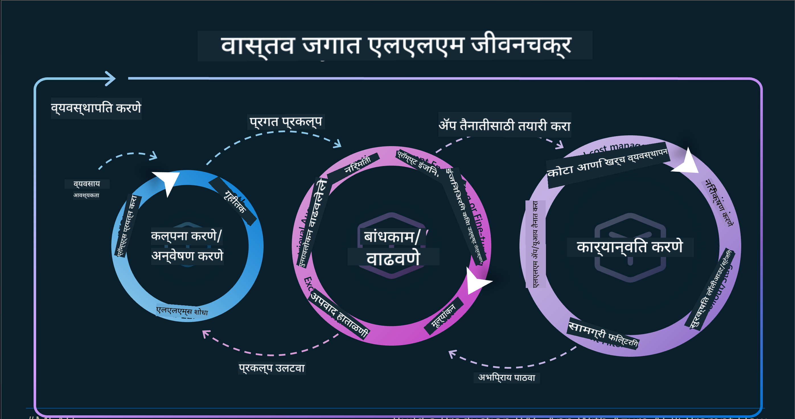
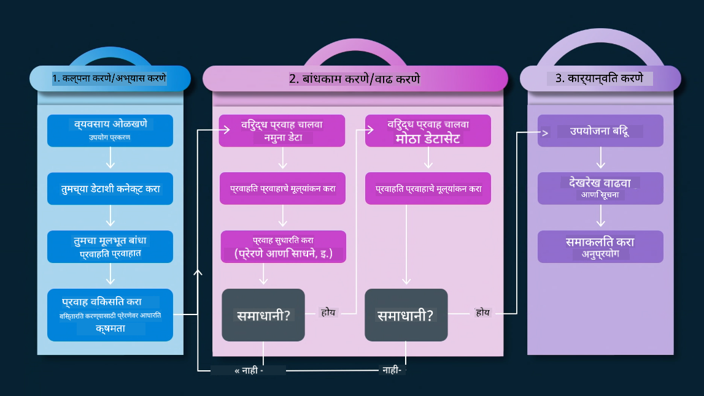
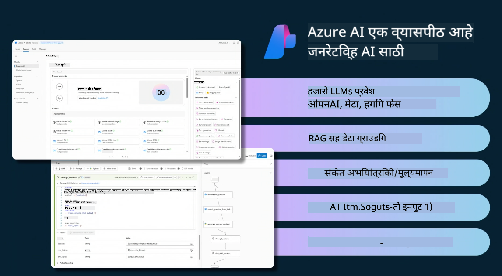
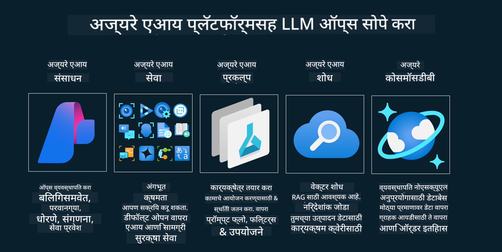
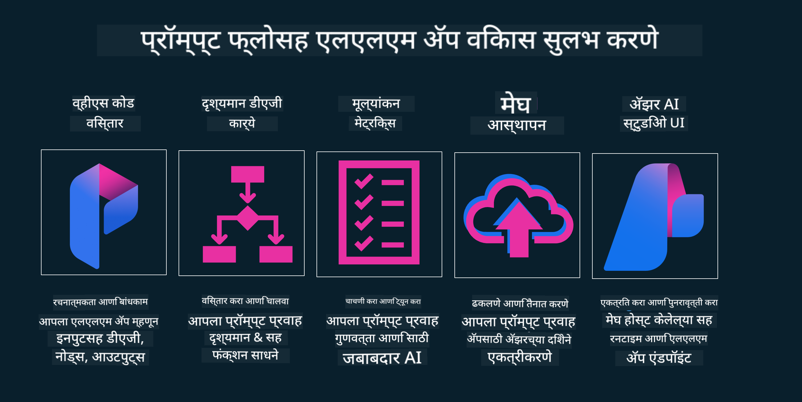

<!--
CO_OP_TRANSLATOR_METADATA:
{
  "original_hash": "27a5347a5022d5ef0a72ab029b03526a",
  "translation_date": "2025-05-19T23:24:08+00:00",
  "source_file": "14-the-generative-ai-application-lifecycle/README.md",
  "language_code": "mr"
}
-->

# जनरेटिव्ह AI अनुप्रयोग जीवनचक्र

सर्व AI अनुप्रयोगांसाठी एक महत्त्वाचा प्रश्न म्हणजे AI वैशिष्ट्यांची सुसंगतता, कारण AI एक वेगाने विकसित होणारे क्षेत्र आहे, तुमचा अनुप्रयोग सुसंगत, विश्वासार्ह आणि मजबूत राहावा यासाठी तुम्हाला त्याचे सतत निरीक्षण, मूल्यांकन आणि सुधारणा करणे आवश्यक आहे. यासाठी जनरेटिव्ह AI जीवनचक्र उपयुक्त ठरते.

जनरेटिव्ह AI जीवनचक्र हे एक फ्रेमवर्क आहे जे तुम्हाला जनरेटिव्ह AI अनुप्रयोग विकसित करणे, तैनात करणे आणि देखभाल करण्याच्या टप्प्यांमधून मार्गदर्शन करते. हे तुम्हाला तुमचे उद्दिष्टे निश्चित करण्यात, तुमची कामगिरी मोजण्यात, तुमच्या आव्हानांची ओळख करण्यात आणि तुमचे उपाय अंमलात आणण्यात मदत करते. हे तुमच्या अनुप्रयोगाला तुमच्या डोमेनच्या नैतिक आणि कायदेशीर मानकांशी आणि तुमच्या भागधारकांशी जुळवून घेण्यात देखील मदत करते. जनरेटिव्ह AI जीवनचक्राचे पालन करून, तुम्ही तुमचा अनुप्रयोग नेहमीच मूल्य वितरीत करत आहे आणि तुमच्या वापरकर्त्यांना समाधान देत आहे याची खात्री करू शकता.

## परिचय

या अध्यायात, तुम्ही:

- MLOps ते LLMOps मधील परिवर्तन समजून घ्या
- LLM जीवनचक्र
- जीवनचक्र साधने
- जीवनचक्र मेट्रिफिकेशन आणि मूल्यांकन

## MLOps ते LLMOps मधील परिवर्तन समजून घ्या

LLMs हे कृत्रिम बुद्धिमत्तेच्या शस्त्रागारातील एक नवीन साधन आहे, ते अनुप्रयोगांसाठी विश्लेषण आणि निर्मिती कार्यांमध्ये अत्यंत शक्तिशाली आहेत, परंतु या शक्तीमुळे AI आणि क्लासिक मशीन लर्निंग कार्यांना सुव्यवस्थित करण्याच्या पद्धतींवर काही परिणाम होतात.

यासह, आम्हाला या साधनाला गतिशीलपणे अनुकूल करण्यासाठी एक नवीन पॅराडाइम आवश्यक आहे, योग्य प्रोत्साहनांसह. जुन्या AI अॅप्सना "ML अॅप्स" आणि नवीन AI अॅप्सना "GenAI अॅप्स" किंवा फक्त "AI अॅप्स" म्हणून वर्गीकृत करू शकतो, त्यावेळी वापरल्या जाणाऱ्या मुख्य प्रवाहातील तंत्रज्ञान आणि तंत्रांचा विचार करून. हे अनेक प्रकारे आपल्या कथनात बदल करते, खालील तुलना पहा.

ध्यान द्या की LLMOps मध्ये, आम्ही अॅप डेव्हलपर्सवर अधिक लक्ष केंद्रित करतो, एकात्मता एक महत्त्वाचा मुद्दा म्हणून वापरतो, "Models-as-a-Service" वापरतो आणि मेट्रिक्ससाठी खालील मुद्द्यांचा विचार करतो.

- गुणवत्ता: प्रतिसाद गुणवत्ता
- हानी: जबाबदार AI
- प्रामाणिकपणा: प्रतिसादाची आधारभूतता (अर्थपूर्ण आहे का? ते योग्य आहे का?)
- खर्च: उपाय बजेट
- विलंबता: टोकन प्रतिसादासाठी सरासरी वेळ

## LLM जीवनचक्र

प्रथम, जीवनचक्र आणि त्यातील सुधारणा समजून घेण्यासाठी, पुढील माहितीपटाची नोंद करूया.

जसे तुम्ही लक्षात घेऊ शकता, हे MLOps मधील सामान्य जीवनचक्रांपेक्षा वेगळे आहे. LLM मध्ये अनेक नवीन आवश्यकता आहेत, जसे की प्रॉम्प्टिंग, गुणवत्ता सुधारण्यासाठी विविध तंत्रे (फाइन-ट्यूनिंग, RAG, मेटा-प्रॉम्प्ट्स), जबाबदार AI सह विविध मूल्यांकन आणि जबाबदारी, शेवटी, नवीन मूल्यांकन मेट्रिक्स (गुणवत्ता, हानी, प्रामाणिकपणा, खर्च आणि विलंबता).

उदाहरणार्थ, आपण कसे कल्पना करतो ते पहा. त्यांची परिकल्पना योग्य ठरू शकते की नाही हे तपासण्यासाठी शक्यता शोधण्यासाठी विविध LLMs सह प्रयोग करण्यासाठी प्रॉम्प्ट इंजिनिअरिंग वापरून.

हे रेखीय नाही, परंतु एकत्रित लूप, पुनरावृत्तीशील आणि एक व्यापक चक्र आहे हे लक्षात ठेवा.

आपण त्या पायऱ्या कशा शोधू शकतो? चला जीवनचक्र कसे तयार करू शकतो याचा तपशीलवार अभ्यास करूया.

हे थोडे जटिल दिसू शकते, प्रथम तीन मोठ्या चरणांवर लक्ष केंद्रित करूया.

1. कल्पना करणे/अन्वेषण करणे: अन्वेषण, येथे आम्ही आमच्या व्यवसायाच्या गरजेनुसार शोधू शकतो. प्रोटोटायपिंग, [PromptFlow](https://microsoft.github.io/promptflow/index.html?WT.mc_id=academic-105485-koreyst) तयार करणे आणि आमच्या परिकल्पनेसाठी ते पुरेसे कार्यक्षम आहे की नाही हे तपासणे.
2. बांधकाम/वृद्धी करणे: अंमलबजावणी, आता, आम्ही मोठ्या डेटासेटसाठी मूल्यांकन सुरू करतो, तंत्रे लागू करतो, जसे की फाइन-ट्यूनिंग आणि RAG, आमच्या उपायाची मजबुती तपासण्यासाठी. जर ते नाही, तर ते पुन्हा लागू करणे, आमच्या प्रवाहात नवीन पायऱ्या जोडणे किंवा डेटा पुन्हा संरचित करणे मदत करू शकते. आमचा प्रवाह आणि आमचा स्केल चाचणी केल्यानंतर, जर ते कार्य करत असेल आणि आमचे मेट्रिक्स तपासले, तर ते पुढील चरणासाठी तयार आहे.
3. ऑपरेशनलाइझिंग: एकत्रीकरण, आता आमच्या प्रणालीमध्ये मॉनिटरिंग आणि अलर्ट सिस्टीम जोडणे, अनुप्रयोगात समाकलन आणि अनुप्रयोगात समाकलन.

मग, व्यवस्थापनाचा व्यापक चक्र आहे, सुरक्षा, अनुपालन आणि शासनावर लक्ष केंद्रित करणे.

अभिनंदन, आता तुमचा AI अॅप तयार आहे आणि कार्यरत आहे. प्रत्यक्ष अनुभवासाठी, [Contoso Chat Demo](https://nitya.github.io/contoso-chat/?WT.mc_id=academic-105485-koreys) वर एक नजर टाका.

आता, आम्ही कोणती साधने वापरू शकतो?

## जीवनचक्र साधने

साधनांसाठी, Microsoft [Azure AI Platform](https://azure.microsoft.com/solutions/ai/?WT.mc_id=academic-105485-koreys) आणि [PromptFlow](https://microsoft.github.io/promptflow/index.html?WT.mc_id=academic-105485-koreyst) प्रदान करते, तुमचा चक्र सोपा करण्यासाठी आणि लागू करण्यासाठी आणि तयार करण्यासाठी.

[Azure AI Platform](https://azure.microsoft.com/solutions/ai/?WT.mc_id=academic-105485-koreys) तुम्हाला [AI Studio](https://ai.azure.com/?WT.mc_id=academic-105485-koreys) वापरण्याची परवानगी देते. AI Studio एक वेब पोर्टल आहे जे तुम्हाला मॉडेल्स, नमुने आणि साधने शोधण्याची परवानगी देते. तुमचे संसाधने व्यवस्थापित करणे, UI विकास प्रवाह आणि कोड-फर्स्ट विकासासाठी SDK/CLI पर्याय.

Azure AI, तुम्हाला तुमच्या ऑपरेशन्स, सेवा, प्रकल्प, वेक्टर शोध आणि डेटाबेस गरजा व्यवस्थापित करण्यासाठी एकाधिक संसाधने वापरण्याची परवानगी देते.

प्रूफ-ऑफ-कॉन्सेप्ट (POC) पासून मोठ्या प्रमाणातील अनुप्रयोगांपर्यंत, PromptFlow सह बांधा:

- VS कोडमधून अॅप्स डिझाइन आणि तयार करा, दृश्यात्मक आणि कार्यात्मक साधनांसह
- तुमचे अॅप्स सहजतेने गुणवत्तापूर्ण AI साठी चाचणी आणि फाइन-ट्यून करा.
- क्लाउडसह एकत्रित आणि पुनरावृत्ती करण्यासाठी Azure AI स्टुडिओ वापरा, जलद समाकलनासाठी पुश आणि तैनात करा.

## छान! तुमचे शिक्षण सुरू ठेवा!

अप्रतिम, आता [Contoso Chat App](https://nitya.github.io/contoso-chat/?WT.mc_id=academic-105485-koreyst) सह संकल्पना वापरण्यासाठी आम्ही कसे अनुप्रयोग संरचित करतो याबद्दल अधिक जाणून घ्या, क्लाउड अॅडव्होकेसी हे संकल्पना प्रात्यक्षिकांमध्ये कसे जोडते ते तपासण्यासाठी. अधिक सामग्रीसाठी, आमच्या [Ignite ब्रेकआउट सेशन](https://www.youtube.com/watch?v=DdOylyrTOWg) ची तपासणी करा!

आता, जनरेटिव्ह AI वर प्रभाव टाकण्यासाठी आणि अधिक आकर्षक अनुप्रयोग तयार करण्यासाठी [Retrieval Augmented Generation and Vector Databases](../15-rag-and-vector-databases/README.md?WT.mc_id=academic-105485-koreyst) कसे परिणाम करतात हे समजण्यासाठी धडा 15 तपासा!

**अस्वीकृति**:  
हा दस्तऐवज AI भाषांतर सेवा [Co-op Translator](https://github.com/Azure/co-op-translator) वापरून भाषांतरित करण्यात आला आहे. आम्ही अचूकतेसाठी प्रयत्नशील असलो तरी कृपया लक्षात ठेवा की स्वयंचलित भाषांतरे त्रुटी किंवा अपूर्णता असू शकतात. मूळ दस्तऐवज त्याच्या मूळ भाषेत प्राधिकृत स्रोत म्हणून विचारात घेतला पाहिजे. महत्त्वाच्या माहितीसाठी, व्यावसायिक मानव भाषांतराची शिफारस केली जाते. या भाषांतराचा वापर करून उद्भवणाऱ्या कोणत्याही गैरसमज किंवा चुकीच्या अर्थासाठी आम्ही जबाबदार नाही.