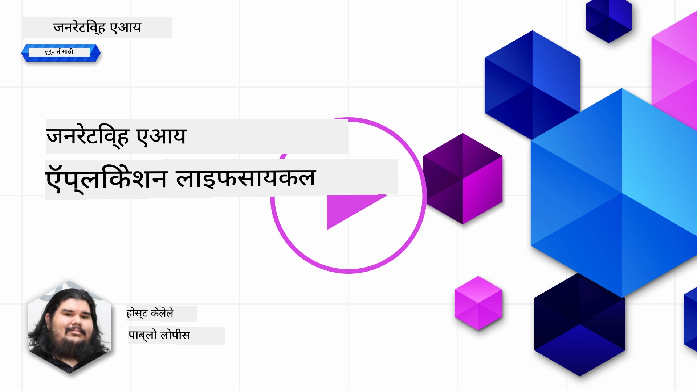
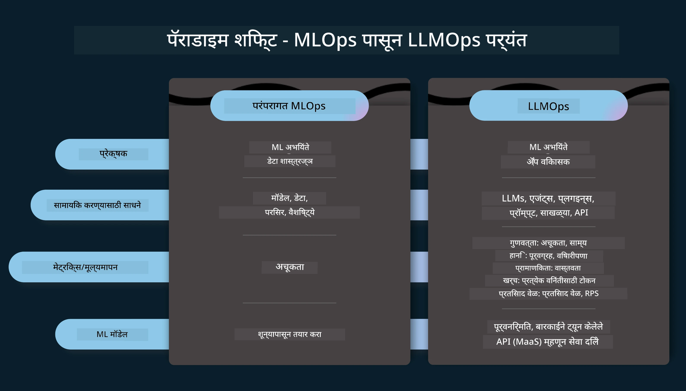
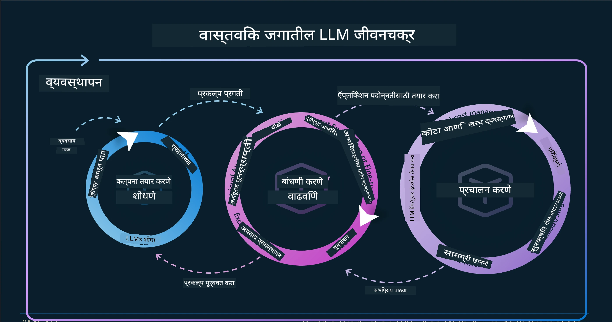
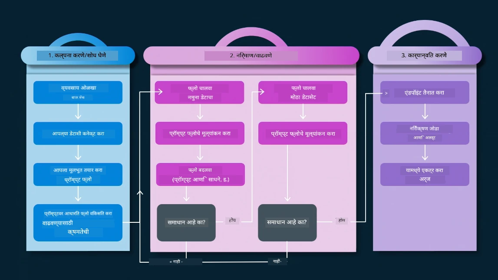
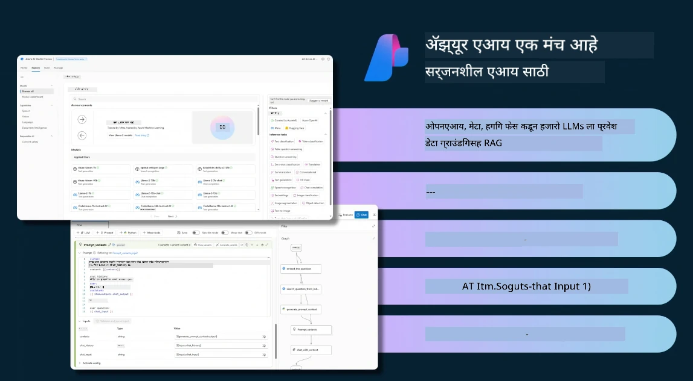
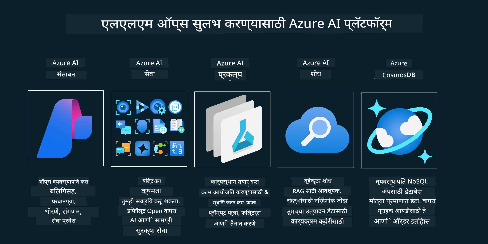
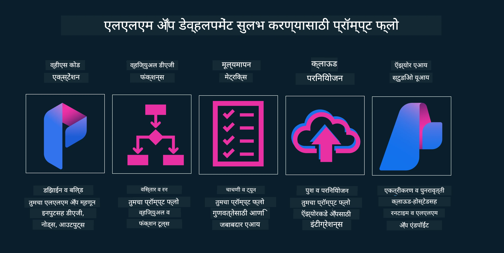

<!--
CO_OP_TRANSLATOR_METADATA:
{
  "original_hash": "df44972d5575ea8cef3c52ee31696d04",
  "translation_date": "2025-12-19T14:09:03+00:00",
  "source_file": "14-the-generative-ai-application-lifecycle/README.md",
  "language_code": "mr"
}
-->

# जनरेटिव AI अनुप्रयोग जीवनचक्र

सर्व AI अनुप्रयोगांसाठी एक महत्त्वाचा प्रश्न म्हणजे AI वैशिष्ट्यांची सुसंगतता, कारण AI हा एक जलद विकसित होणारा क्षेत्र आहे, आपला अनुप्रयोग सुसंगत, विश्वासार्ह आणि मजबूत राहील याची खात्री करण्यासाठी, आपल्याला त्याचे सतत निरीक्षण, मूल्यांकन आणि सुधारणा करणे आवश्यक आहे. यासाठी जनरेटिव AI जीवनचक्र उपयुक्त ठरतो.

जनरेटिव AI जीवनचक्र हा एक फ्रेमवर्क आहे जो आपल्याला जनरेटिव AI अनुप्रयोग विकसित करणे, तैनात करणे आणि देखभाल करण्याच्या टप्प्यांमधून मार्गदर्शन करतो. तो आपल्याला आपले उद्दिष्टे निश्चित करण्यास, आपली कामगिरी मोजण्यास, आपले आव्हाने ओळखण्यास आणि आपले उपाय अंमलात आणण्यास मदत करतो. तो आपला अनुप्रयोग आपल्या क्षेत्रातील नैतिक आणि कायदेशीर मानकांशी आणि आपल्या हितधारकांशी सुसंगत ठेवण्यास देखील मदत करतो. जनरेटिव AI जीवनचक्राचे पालन करून, आपण सुनिश्चित करू शकता की आपला अनुप्रयोग नेहमीच मूल्य प्रदान करत आहे आणि आपल्या वापरकर्त्यांना समाधान देत आहे.

## परिचय

या प्रकरणात, आपण:

- MLOps पासून LLMOps कडे होणाऱ्या पॅराडाइम शिफ्ट समजून घ्या
- LLM जीवनचक्र
- जीवनचक्र साधने
- जीवनचक्र मेट्रिफिकेशन आणि मूल्यांकन

## MLOps पासून LLMOps कडे होणाऱ्या पॅराडाइम शिफ्ट समजून घ्या

LLM हे आर्टिफिशियल इंटेलिजन्सच्या शस्त्रागारातील एक नवीन साधन आहे, ते अनुप्रयोगांसाठी विश्लेषण आणि निर्मिती कार्यांमध्ये अत्यंत शक्तिशाली आहेत, परंतु या शक्तीचा काही परिणाम AI आणि पारंपरिक मशीन लर्निंग कार्ये कशी सुलभ करायची यावर होतो.

यासाठी, आपल्याला या साधनाला योग्य प्रोत्साहनांसह गतिशील पद्धतीने जुळवून घेण्यासाठी नवीन पॅराडाइमची गरज आहे. आपण जुन्या AI अनुप्रयोगांना "ML Apps" आणि नवीन AI अनुप्रयोगांना "GenAI Apps" किंवा फक्त "AI Apps" म्हणून वर्गीकृत करू शकतो, जे त्या काळातील मुख्य प्रवाहातील तंत्रज्ञान आणि तंत्रे दर्शवतात. यामुळे आपली कथा अनेक प्रकारे बदलते, खालील तुलना पहा.

लक्षात घ्या की LLMOps मध्ये, आपण अनुप्रयोग विकासकांवर अधिक लक्ष केंद्रित करतो, एकत्रीकरणांना महत्त्वाचा मुद्दा मानतो, "Models-as-a-Service" वापरतो आणि मेट्रिक्ससाठी खालील मुद्द्यांवर विचार करतो.

- गुणवत्ता: प्रतिसादाची गुणवत्ता
- हानी: जबाबदार AI
- प्रामाणिकपणा: प्रतिसादाची आधारभूतता (समजते का? ते बरोबर आहे का?)
- खर्च: उपाययोजनेचा बजेट
- विलंब: टोकन प्रतिसादासाठी सरासरी वेळ

## LLM जीवनचक्र

प्रथम, जीवनचक्र आणि त्यातील बदल समजून घेण्यासाठी, पुढील माहितीचित्र पाहूया.

आपण लक्षात घेऊ शकता की हे पारंपारिक MLOps जीवनचक्रांपेक्षा वेगळे आहे. LLMs कडे अनेक नवीन गरजा आहेत, जसे की प्रॉम्प्टिंग, गुणवत्ता सुधारण्यासाठी वेगवेगळ्या तंत्रांचा वापर (फाईन-ट्यूनिंग, RAG, मेटा-प्रॉम्प्ट्स), जबाबदार AI सह वेगळे मूल्यांकन आणि जबाबदारी, शेवटी नवीन मूल्यांकन मेट्रिक्स (गुणवत्ता, हानी, प्रामाणिकपणा, खर्च आणि विलंब).

उदाहरणार्थ, आपण कसे कल्पना करतो ते पाहा. विविध LLMs सह प्रयोग करण्यासाठी प्रॉम्प्ट इंजिनिअरिंग वापरून शक्यता तपासणे, त्यांच्या संकल्पना बरोबर आहेत का हे तपासणे.

लक्षात घ्या की हे रेषीय नाही, तर एकत्रित लूप्स, पुनरावृत्ती आणि एक व्यापक चक्र आहे.

आपण त्या टप्प्यांचा कसा शोध घेऊ शकतो? जीवनचक्र कसे तयार करू शकतो याचा तपशील पाहूया.

हे थोडे गुंतागुंतीचे वाटू शकते, तर प्रथम तीन मोठ्या टप्प्यांवर लक्ष केंद्रित करूया.

1. कल्पना करणे/शोध घेणे: शोध, येथे आपण आपल्या व्यवसायाच्या गरजेनुसार शोध घेऊ शकतो. प्रोटोटायपिंग, [PromptFlow](https://microsoft.github.io/promptflow/index.html?WT.mc_id=academic-105485-koreyst) तयार करणे आणि तपासणे की ते आपल्या संकल्पनेसाठी पुरेसे कार्यक्षम आहे का.
1. बांधणी/वाढवणे: अंमलबजावणी, आता आपण मोठ्या डेटासेटसाठी मूल्यांकन सुरू करतो, फाईन-ट्यूनिंग आणि RAG सारख्या तंत्रांचा वापर करून आपल्या उपाययोजनेची मजबुती तपासतो. जर ते कार्य करत नसेल, तर पुन्हा अंमलबजावणी करणे, आपल्या प्रवाहात नवीन टप्पे जोडणे किंवा डेटा पुनर्रचना करणे उपयुक्त ठरू शकते. आपल्या प्रवाह आणि प्रमाण तपासल्यानंतर, जर ते कार्य करते आणि मेट्रिक्स तपासले तर, पुढील टप्प्यासाठी तयार आहे.
1. ऑपरेशनलायझिंग: एकत्रीकरण, आता आपल्या प्रणालीमध्ये मॉनिटरिंग आणि अलर्ट सिस्टम जोडणे, तैनाती आणि अनुप्रयोग एकत्रीकरण.

यानंतर, व्यवस्थापनाचा व्यापक चक्र आहे, जो सुरक्षा, अनुपालन आणि शासनावर लक्ष केंद्रित करतो.

अभिनंदन, आता आपला AI अनुप्रयोग तयार आहे आणि कार्यरत आहे. प्रत्यक्ष अनुभवासाठी, [Contoso Chat Demo](https://nitya.github.io/contoso-chat/?WT.mc_id=academic-105485-koreys) पहा.

आता, आपण कोणती साधने वापरू शकतो?

## जीवनचक्र साधने

साधनांसाठी, Microsoft [Azure AI Platform](https://azure.microsoft.com/solutions/ai/?WT.mc_id=academic-105485-koreys) आणि [PromptFlow](https://microsoft.github.io/promptflow/index.html?WT.mc_id=academic-105485-koreyst) आपला जीवनचक्र सुलभपणे अंमलात आणण्यासाठी आणि तयार करण्यासाठी मदत करतात.

[Azure AI Platform](https://azure.microsoft.com/solutions/ai/?WT.mc_id=academic-105485-koreys) आपल्याला [AI Studio](https://ai.azure.com/?WT.mc_id=academic-105485-koreys) वापरण्याची परवानगी देते. AI Studio हा एक वेब पोर्टल आहे जो आपल्याला मॉडेल्स, नमुने आणि साधने एक्सप्लोर करण्याची परवानगी देतो. आपले संसाधने व्यवस्थापित करणे, UI विकास प्रवाह आणि SDK/CLI पर्यायांसह कोड-प्रथम विकासासाठी.

Azure AI आपल्याला अनेक संसाधने वापरण्याची परवानगी देते, आपले ऑपरेशन्स, सेवा, प्रकल्प, व्हेक्टर शोध आणि डेटाबेस गरजा व्यवस्थापित करण्यासाठी.

Proof-of-Concept(POC) पासून मोठ्या प्रमाणावर अनुप्रयोग तयार करा PromptFlow सह:

- VS Code मधून डिझाइन आणि अनुप्रयोग तयार करा, दृश्यात्मक आणि कार्यात्मक साधने वापरून
- आपल्या अनुप्रयोगांची गुणवत्ता AI साठी तपासा आणि फाईन-ट्यून करा, सहजतेने.
- Azure AI Studio वापरून क्लाउडसह एकत्रीकरण आणि पुनरावृत्ती करा, जलद एकत्रीकरणासाठी पुश आणि तैनात करा.

## छान! आपले शिक्षण सुरू ठेवा!

अद्भुत, आता अधिक जाणून घ्या की आपण अनुप्रयोग कसा रचतो जेणेकरून संकल्पना वापरता येतील [Contoso Chat App](https://nitya.github.io/contoso-chat/?WT.mc_id=academic-105485-koreyst) सह, पाहण्यासाठी की क्लाउड अ‍ॅडव्होकेसी कसे त्या संकल्पना सादरीकरणांमध्ये जोडते. अधिक सामग्रीसाठी, आमचा [Ignite ब्रेकआउट सत्र](https://www.youtube.com/watch?v=DdOylyrTOWg) पहा!

आता, धडा 15 तपासा, समजून घेण्यासाठी की [Retrieval Augmented Generation आणि Vector Databases](../15-rag-and-vector-databases/README.md?WT.mc_id=academic-105485-koreyst) जनरेटिव AI वर कसा प्रभाव टाकतात आणि अधिक आकर्षक अनुप्रयोग तयार करण्यासाठी!

---

<!-- CO-OP TRANSLATOR DISCLAIMER START -->
**अस्वीकरण**:
हा दस्तऐवज AI अनुवाद सेवा [Co-op Translator](https://github.com/Azure/co-op-translator) वापरून अनुवादित केला आहे. आम्ही अचूकतेसाठी प्रयत्नशील असलो तरी, कृपया लक्षात घ्या की स्वयंचलित अनुवादांमध्ये चुका किंवा अचूकतेची कमतरता असू शकते. मूळ दस्तऐवज त्याच्या स्थानिक भाषेत अधिकृत स्रोत मानला जावा. महत्त्वाच्या माहितीसाठी व्यावसायिक मानवी अनुवाद शिफारसीय आहे. या अनुवादाच्या वापरामुळे उद्भवलेल्या कोणत्याही गैरसमजुती किंवा चुकीच्या अर्थलागी आम्ही जबाबदार नाही.
<!-- CO-OP TRANSLATOR DISCLAIMER END -->