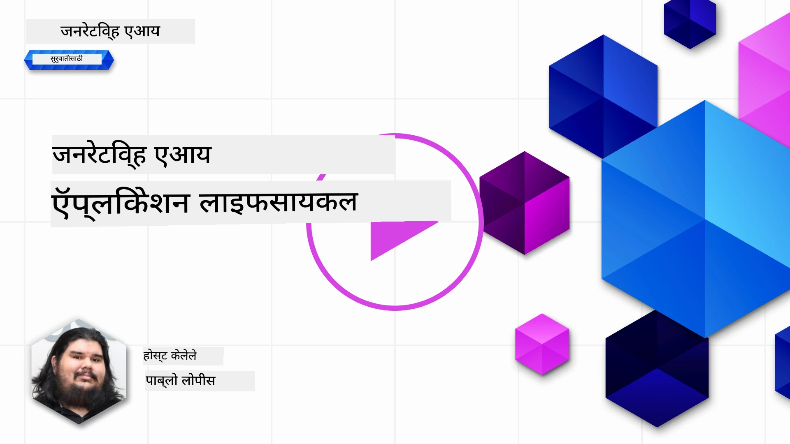
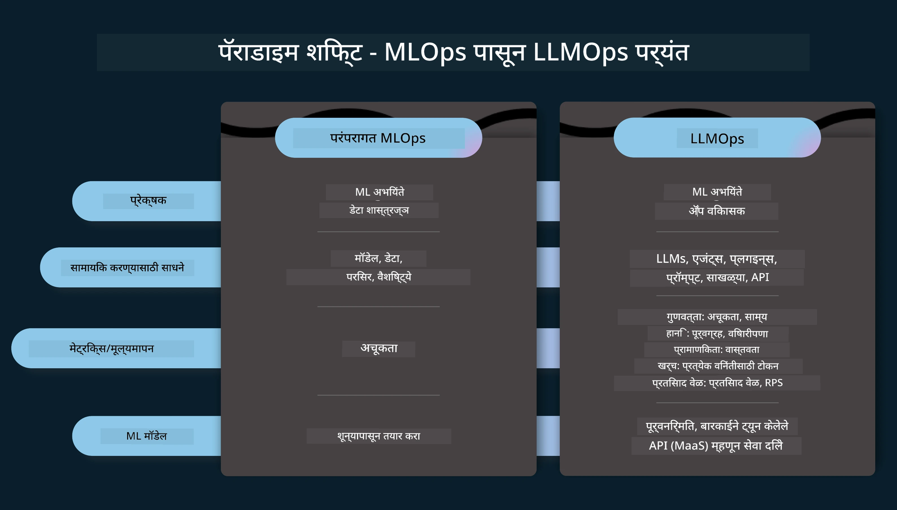
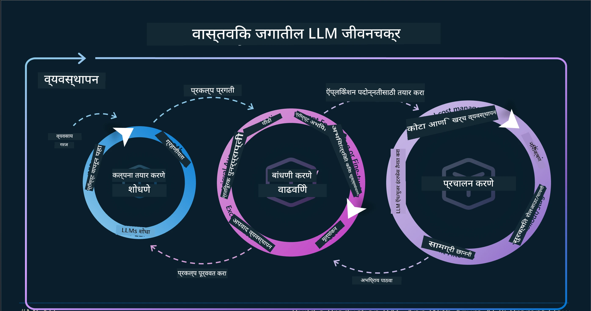
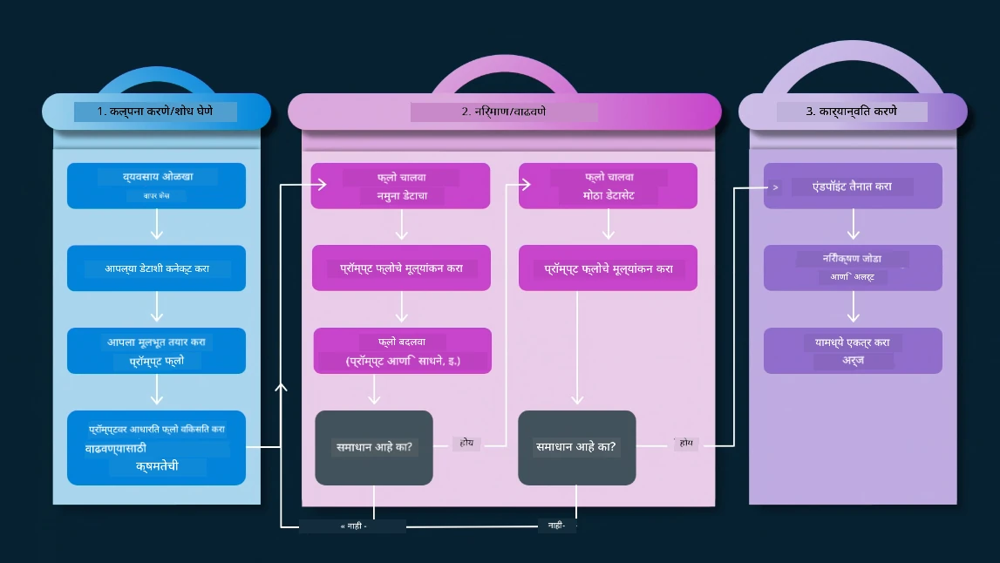
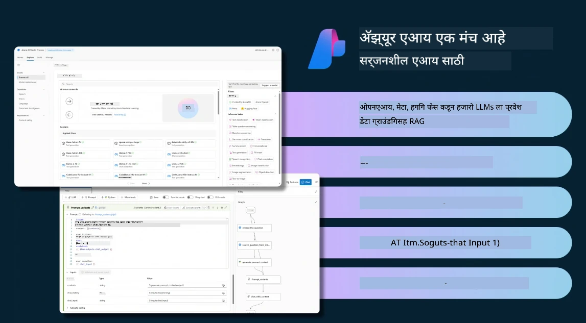
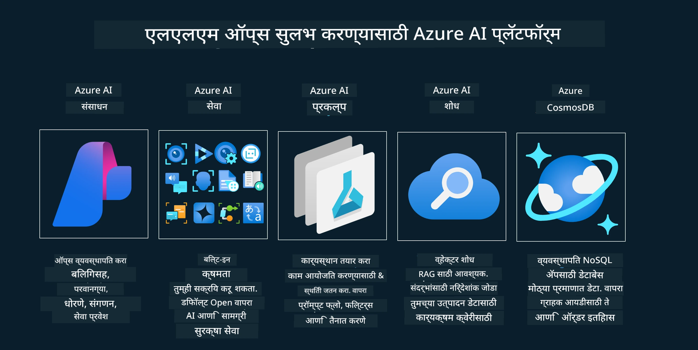
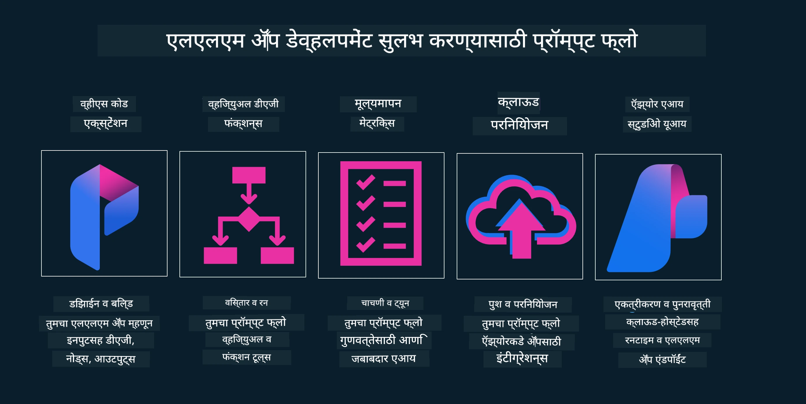

# जनरेटिव एआय अनुप्रयोगाचा जीवनचक्र

सर्व एआय अनुप्रयोगांसाठी एक महत्त्वाचा प्रश्न म्हणजे एआय वैशिष्ट्यांची सुसंगतता, कारण एआय ही एक जलद विकसित होणारी क्षेत्र आहे, आपल्या अनुप्रयोगाची सुसंगतता, विश्वासार्हता आणि मजबूतता कायम ठेवण्यासाठी, आपण त्यावर सतत देखरेख, मूल्यांकन आणि सुधारणा करणे आवश्यक आहे. यासाठीच जनरेटिव एआय जीवनचक्र उपयुक्त असतो.

जनरेटिव एआय जीवनचक्र हा एक फ्रेमवर्क आहे जो तुम्हाला जनरेटिव एआय अनुप्रयोग विकसित करणे, तैनात करणे आणि देखभाल करण्याच्या टप्प्यांत मार्गदर्शन करतो. हे आपले उद्दिष्टे परिभाषित करण्यात, प्रदर्शन मोजण्यात, आव्हाने ओळखण्यात आणि उपाय अंमलात आणण्यात मदत करते. तसेच आपल्या अनुप्रयोगाला आपल्या क्षेत्रातील आणि सहभागींच्या नैतिक व कायदेशीर मानकांशी सुसंगत ठेवण्यासही मदत होते. जनरेटिव एआय जीवनचक्राचे अनुसरण करून, आपण सुनिश्चित करू शकता की आपला अनुप्रयोग नेहमीच मूल्य देत आहे आणि आपल्या वापरकर्त्यांना समाधानी ठेवतो.

## परिचय

या अध्यायात, आपण:

- MLOps पासून LLMOps पर्यंतच्या पॅराडाइम शिफ्ट समजू शकणार आहोत
- LLM जीवनचक्र
- जीवनचक्र टूलिंग
- जीवनचक्र मेट्रिफिकेशन आणि मूल्यांकन

## MLOps पासून LLMOps कडे पॅराडाइम शिफ्ट समजून घ्या

LLMs म्हणजे आर्टिफिशियल इंटेलिजन्सच्या हत्यारातील नवीन साधन आहे, ते अनुप्रयोगांसाठी विश्लेषण आणि जनरेशन कार्यात अत्यंत शक्तिशाली आहेत, परंतु या शक्तीचा एआय आणि क्लासिक मशीन लर्निंग कार्ये सुलभ करण्याच्या पद्धतीवर काही परिणाम होतो.

यामुळे, आपल्याला या साधनाचा योग्य प्रोत्साहनांसह गतिशीलरित्या जुळवून घेण्यासाठी नवीन पॅराडाइम आवश्यक आहे. आपण जुने AI अनुप्रयोग "ML अनुप्रयोग" म्हणून वर्गीकृत करू शकतो आणि नवीन AI अनुप्रयोग "GenAI अनुप्रयोग" किंवा फक्त "AI अनुप्रयोग" म्हणून, जे त्या काळातील मुख्य प्रवाहातील तंत्रज्ञान आणि तंत्रांना प्रतिबिंबित करतात. हे आपली कथा अनेक मार्गांनी बदलते, पुढील तुलना पाहा.

LLMOps मध्ये, आपण अ‍ॅप डेव्हलपर्स वर अधिक लक्ष केंद्रित करत आहोत, एकात्मता महत्त्वाचा मुद्दा म्हणून वापरत आहोत, "Models-as-a-Service" वापरून आणि मेट्रिक्ससाठी खालील मुद्द्यांवर विचार करत आहोत.

- गुणवत्ता: प्रतिसाद गुणवत्ता
- हानी: उत्तरदायी एआय
- प्रामाणिकपणा: प्रतिसादाचा आधार (समजले का? हे बरोबर आहे का?)
- खर्च: उपायाचा बजेट
- विलंब: टोकन प्रतिसादाचा सरासरी वेळ

## LLM जीवनचक्र

प्रथम, जीवनचक्र आणि बदल समजून घेण्यासाठी, पुढील माहितीचित्र पहा.

जसे तुम्हाला दिसेल, हे पारंपारिक MLOps जीवनचक्रांपेक्षा वेगळे आहे. LLMs ला बरेच नवीन गरजा आहेत, जसे की प्रॉम्प्टिंग, गुणवत्ता सुधारण्यासाठी वेगवेगळ्या तंत्रे (फाइन-ट्यूनिंग, RAG, मेटा-प्रॉम्प्ट्स), उत्तरदायी AI सह वेगळे मूल्यमापन आणि जबाबदारी, आणि अखेर नवीन मूल्यांकन मेट्रिक्स (गुणवत्ता, हानी, प्रामाणिकपणा, खर्च आणि विलंब).

उदाहरणार्थ, आपण कसे कल्पना करतो ते पहा. विविध LLMs सह प्रॉम्प्ट इंजिनिअरिंग वापरून शक्यता शोधण्याचा प्रयोग करून, त्यांच्या हायपोथेसिस योग्य असू शकते का ते तपासणे.

हे सरळ रेषीय नाही, तर समाकलित लूप्स, पुनरावृत्ती असलेले आणि एक व्यापक चक्र आहे.

आपण ही पावले कशी तपासू शकतो? जीवनचक्र कसे तयार करावे यावर तपशीलवार वाचा.

हे थोडे क्लिष्ट दिसू शकते, प्रथम तीन मोठ्या टप्प्यांवर लक्ष केंद्रित करूया.

1. कल्पना / शोध: शोध, येथे आपण आपल्या व्यवसायाच्या गरजेनुसार शोध करू शकतो. प्रोटोटायपिंग, [PromptFlow](https://microsoft.github.io/promptflow/index.html?WT.mc_id=academic-105485-koreyst) तयार करणे आणि तपासणे की तो आपल्या हायपोथेसिससाठी पुरेसा कार्यक्षम आहे की नाही.
1. बांधणी / वाढवणे: अंमलबजावणी, आता आपण मोठ्या डेटासेटसाठी मूल्यांकन सुरू करतो, फाइन-ट्यूनिंग आणि RAG सारखी तंत्रे वापरून आपला उपाय किती मजबूत आहे ते तपासतो. जर तो काम करत नसेल, तर त्याचा पुनरावृत्ती करणे, नवीन पावले जोडणे किंवा डेटाचे पुनर्संयोजन करणे उपयुक्त ठरू शकते. आपला प्रवाह आणि स्केल तपासल्यावर, जर तो कार्यरत असेल आणि मेट्रिक्स योग्य असतील, तर पुढील टप्प्यासाठी तयार आहे.
1. कार्यान्वयन: एकत्रीकरण, आता आपल्याच्या प्रणालीसाठी देखरेख आणि अलर्ट प्रणाली जोडणे, अनुप्रयोग तैनात करणे आणि एकत्रीकरण.

मग व्यवस्थापनाचा व्यापक चक्र आहे, ज्यात सुरक्षा, अनुपालन आणि शासनावर लक्ष दिले जाते.

अभिनंदने, आता तुमचा AI अनुप्रयोग तयार आहे आणि कार्यरत आहे. प्रत्यक्ष प्रयोगासाठी, [Contoso Chat Demo](https://nitya.github.io/contoso-chat/?WT.mc_id=academic-105485-koreyst) पहा.

आता, आपण कोणती साधने वापरू शकतो?

## जीवनचक्र टूलिंग

साधनेसाठी, Microsoft [Azure AI Platform](https://azure.microsoft.com/solutions/ai/?WT.mc_id=academic-105485-koreyst) आणि [PromptFlow](https://microsoft.github.io/promptflow/index.html?WT.mc_id=academic-105485-koreyst) उपलब्ध करतो जे आपला जीवनचक्र सुलभ आणि अंमलबजावणीसाठी तयार करतात.

[Azure AI Platform](https://azure.microsoft.com/solutions/ai/?WT.mc_id=academic-105485-koreyst) तुम्हाला [AI Studio](https://ai.azure.com/?WT.mc_id=academic-105485-koreyst) वापरण्याची परवानगी देते. AI Studio हा वेब पोर्टल आहे जो मॉडेल्स, नमुने आणि साधने एक्सप्लोर करण्यास, स्रोत व्यवस्थापन, UI विकास प्रवाह आणि SDK/CLI पर्यायांसह कोड-प्रथम विकासासाठी मदत करतो.

Azure AI आपल्याला अनेक संसाधने वापरण्याची परवानगी देतो, आपले ऑपरेशन्स, सेवा, प्रकल्प, व्हेक्टर शोध आणि डेटाबेस गरजा व्यवस्थापित करण्यासाठी.

Proof-of-Concept (POC) पासून मोठ्या प्रमाणावर अनुप्रयोगांसाठी PromptFlow सह बांधा:

- व्हिज्युअल आणि फंक्शनल टूल्ससह VS Code मध्ये अ‍ॅप तयार करा आणि डिझाइन करा
- आपले अ‍ॅप्स गुणवत्ता एआय साठी सहजपणे तपासा आणि फाइन-ट्यून करा.
- Azure AI Studio वापरून क्लाऊडसह एकत्रीकरण करा, पुश करा आणि जलद तैनातीसाठी पुनरावृत्ती करा.

## छान! तुमचे शिक्षण सुरू ठेवा!

आश्चर्यकारक, आता अधिक जाणून घ्या की आपण अनुप्रयोग कसा रचतो आणि सैद्धांतिक संकल्पना [Contoso Chat App](https://nitya.github.io/contoso-chat/?WT.mc_id=academic-105485-koreyst) मध्ये कसे वापरतो, क्लाऊड अ‍ॅडव्होकेसी कशी प्रस्तुत करणारे डेमो दाखवते हे पाहण्यासाठी. अधिक सामग्रीसाठी, आमचा [Ignite ब्रेकआउट सत्र!](https://www.youtube.com/watch?v=DdOylyrTOWg) पहा.

आता, धडा 15 पहा जेणेकरून [Retrieval Augmented Generation and Vector Databases](../15-rag-and-vector-databases/README.md?WT.mc_id=academic-105485-koreyst) जनरेटिव एआयवर कसा परिणाम करतो आणि अधिक आकर्षक अनुप्रयोग तयार करतो हे समजून घ्या!

---

<!-- CO-OP TRANSLATOR DISCLAIMER START -->
**इजाजतपत्र**:
हा दस्तऐवज AI भाषांतर सेवा [Co-op Translator](https://github.com/Azure/co-op-translator) वापरून भाषांतरित करण्यात आला आहे. आम्ही अचूकतेसाठी प्रयत्न करतो, तरी कृपया लक्षात घ्या की स्वयंचलित भाषांतरांमध्ये त्रुटी किंवा अचूकतेची कमतरता असू शकते. मूळ दस्तऐवज त्याच्या स्थानिक भाषेमध्ये अधिकृत स्रोत मानला जावा. महत्त्वाची माहिती असल्यास, व्यावसायिक मानवी भाषांतर करण्याचा सल्ला दिला जातो. या भाषांतराच्या वापरामुळे उद्भवणाऱ्या कोणत्याही गैरसमजuthi (गैरसमज किंवा चुकीच्या अर्थव्यक्ती) साठी आम्ही जबाबदार नाही.
<!-- CO-OP TRANSLATOR DISCLAIMER END -->