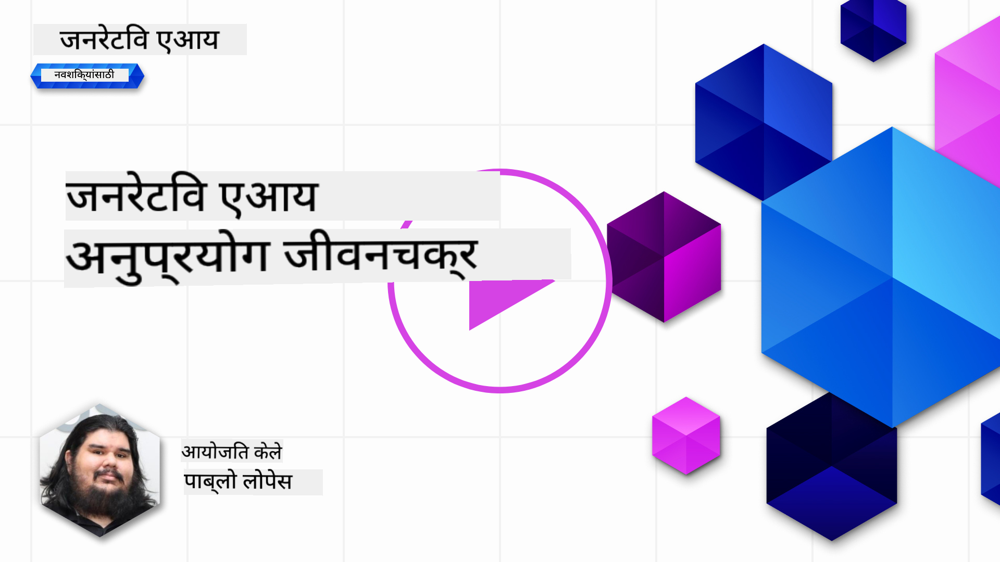
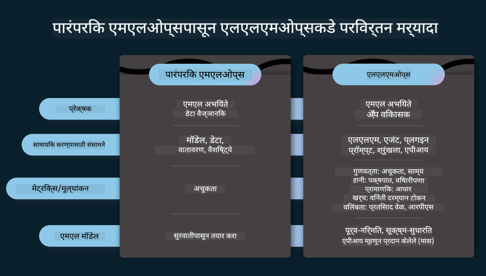
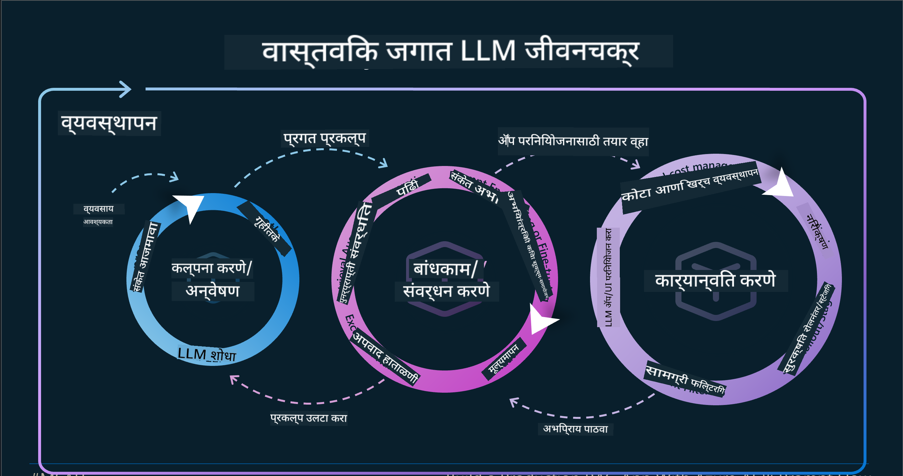
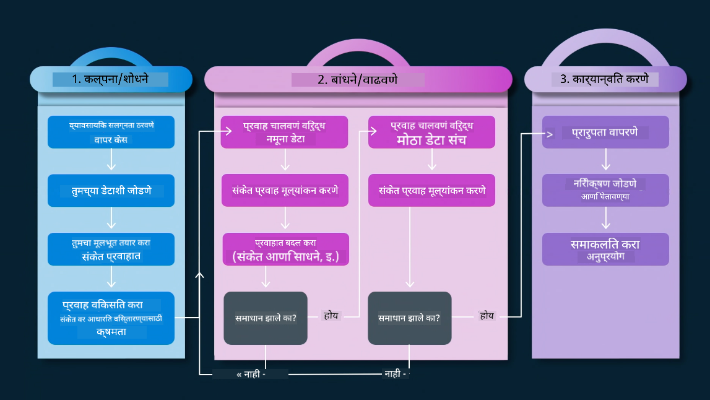
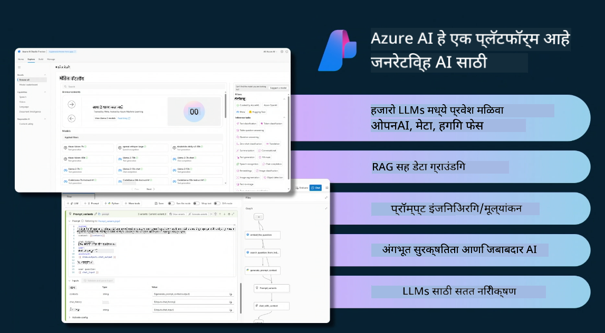
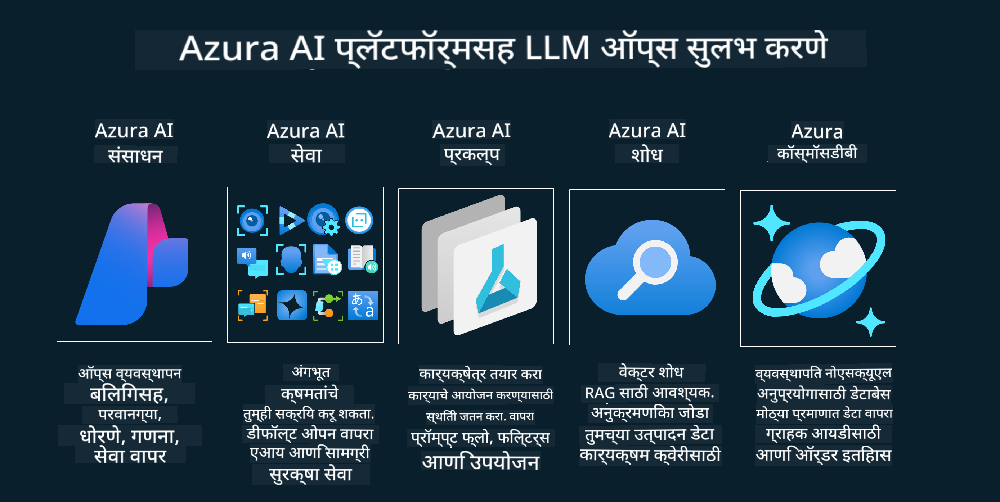
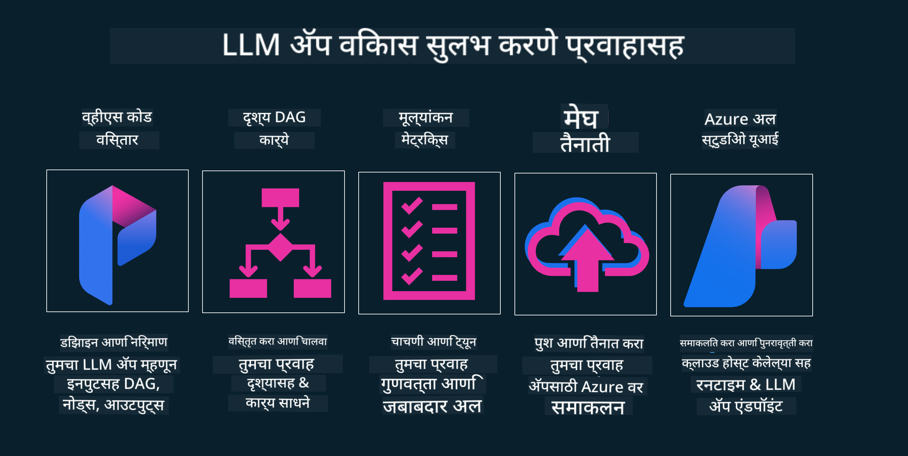

<!--
CO_OP_TRANSLATOR_METADATA:
{
  "original_hash": "27a5347a5022d5ef0a72ab029b03526a",
  "translation_date": "2025-06-25T21:59:50+00:00",
  "source_file": "14-the-generative-ai-application-lifecycle/README.md",
  "language_code": "mr"
}
-->

# जनरेटिव्ह AI अनुप्रयोग जीवनचक्र

सर्व AI अनुप्रयोगांसाठी एक महत्त्वाचा प्रश्न म्हणजे AI वैशिष्ट्यांची सुसंगतता. AI हे एक जलद विकसित होणारे क्षेत्र आहे, त्यामुळे तुमचा अनुप्रयोग सुसंगत, विश्वासार्ह आणि मजबूत राहील याची खात्री करण्यासाठी तुम्हाला त्याचे सतत निरीक्षण, मूल्यांकन आणि सुधारणा करणे आवश्यक आहे. यासाठी जनरेटिव्ह AI जीवनचक्र कामी येतो.

जनरेटिव्ह AI जीवनचक्र एक फ्रेमवर्क आहे जो तुम्हाला जनरेटिव्ह AI अनुप्रयोग विकसित, तैनात आणि देखरेख करण्याच्या टप्प्यांमधून मार्गदर्शन करतो. हे तुम्हाला तुमची उद्दिष्टे निश्चित करण्यास, तुमच्या कामगिरीचे मोजमाप करण्यास, तुमच्या आव्हानांची ओळख पटविण्यास आणि तुमचे उपाय अंमलात आणण्यास मदत करते. हे तुम्हाला तुमच्या डोमेन आणि तुमच्या हितधारकांच्या नैतिक आणि कायदेशीर मानकांसह तुमचा अनुप्रयोग संरेखित करण्यास देखील मदत करते. जनरेटिव्ह AI जीवनचक्राचे अनुसरण करून, तुम्ही तुमचा अनुप्रयोग नेहमी मूल्य प्रदान करत आहे आणि तुमच्या वापरकर्त्यांना समाधान देत आहे याची खात्री करू शकता.

## परिचय

या अध्यायात, तुम्ही:

- MLOps मधून LLMOps पर्यंतच्या पॅराडाइम शिफ्टचा समज
- LLM जीवनचक्र
- जीवनचक्र साधनांचा वापर
- जीवनचक्र मेट्रिफिकेशन आणि मूल्यांकन

## MLOps मधून LLMOps पर्यंतच्या पॅराडाइम शिफ्टचा समज

LLMs हे कृत्रिम बुद्धिमत्तेच्या शस्त्रागारातील एक नवीन साधन आहे, ते अनुप्रयोगांसाठी विश्लेषण आणि निर्मिती कार्यांमध्ये अत्यंत शक्तिशाली आहेत, परंतु या शक्तीमुळे AI आणि क्लासिक मशीन लर्निंग कार्यांचे प्रवाह सुलभ करण्याच्या पद्धतींमध्ये काही परिणाम होतात.

यामुळे, आम्हाला या साधनाला योग्य प्रोत्साहनांसह एक गतिशील पॅराडाइममध्ये अनुकूल करण्याची आवश्यकता आहे. आम्ही जुन्या AI अॅप्सना "ML अॅप्स" आणि नवीन AI अॅप्सना "GenAI अॅप्स" किंवा फक्त "AI अॅप्स" म्हणून वर्गीकृत करू शकतो, जे त्या वेळच्या मुख्य प्रवाहातील तंत्रज्ञान आणि तंत्रांचे प्रतिबिंबित करतात. हे आमच्या कथनाला अनेक प्रकारे बदलते, पुढील तुलना पहा.

हे लक्षात ठेवा की LLMOps मध्ये, आम्ही अॅप डेव्हलपर्सवर अधिक लक्ष केंद्रित करतो, इंटिग्रेशन्सचा एक प्रमुख बिंदू म्हणून वापर करतो, "Models-as-a-Service" वापरतो आणि मेट्रिक्ससाठी खालील बिंदूंवर विचार करतो.

- गुणवत्ता: प्रतिसादाची गुणवत्ता
- नुकसान: जबाबदार AI
- प्रामाणिकपणा: प्रतिसादाची आधारभूतता (अर्थपूर्ण आहे का? ते योग्य आहे का?)
- खर्च: समाधानाचा बजेट
- विलंब: टोकन प्रतिसादासाठी सरासरी वेळ

## LLM जीवनचक्र

प्रथम, जीवनचक्र आणि बदल समजण्यासाठी, पुढील माहितीपटाची नोंद करूया.

तुम्हाला लक्षात येईल की हे MLOps च्या सामान्य जीवनचक्रांपेक्षा वेगळे आहे. LLMs मध्ये अनेक नवीन आवश्यकता आहेत, जसे की प्रॉम्प्टिंग, गुणवत्ता सुधारण्यासाठी विविध तंत्र (फाइन-ट्यूनिंग, RAG, मेटा-प्रॉम्प्ट्स), जबाबदार AI सह विविध मूल्यांकन आणि जबाबदारी, शेवटी, नवीन मूल्यांकन मेट्रिक्स (गुणवत्ता, नुकसान, प्रामाणिकपणा, खर्च आणि विलंब).

उदाहरणार्थ, आम्ही कसे कल्पना करतो ते पहा. त्यांचे गृहितक योग्य ठरू शकतात की नाही हे तपासण्यासाठी शक्यता शोधण्यासाठी विविध LLMs सह प्रयोग करण्यासाठी प्रॉम्प्ट इंजिनिअरिंग वापरणे.

हे रेखीय नाही, परंतु एकात्मिक लूप्स, पुनरावृत्ती आणि एक व्यापक चक्र आहे हे लक्षात ठेवा.

आम्ही त्या पायऱ्या कशा शोधू शकतो? चला तपशीलवार जाणून घेऊया की आम्ही जीवनचक्र कसे तयार करू शकतो.

हे थोडे जटिल दिसू शकते, चला प्रथम तीन मोठ्या चरणांवर लक्ष केंद्रित करूया.

1. कल्पना/शोध: अन्वेषण, येथे आम्ही आमच्या व्यवसायाच्या गरजेनुसार अन्वेषण करू शकतो. प्रोटोटायपिंग, [PromptFlow](https://microsoft.github.io/promptflow/index.html?WT.mc_id=academic-105485-koreyst) तयार करणे आणि आमच्या गृहितकासाठी पुरेसे कार्यक्षम आहे का ते तपासणे.
2. बांधकाम/वर्धन: अंमलबजावणी, आता, आम्ही मोठ्या डेटासेटसाठी मूल्यांकन सुरू करतो, तंत्रे अंमलात आणतो, जसे की फाइन-ट्यूनिंग आणि RAG, आमच्या समाधानाची मजबुती तपासण्यासाठी. जर तसे नसेल तर, आमच्या प्रवाहात नवीन पायऱ्या जोडणे किंवा डेटा पुनर्रचना करणे मदत करू शकते. आमचा प्रवाह आणि आमचा स्केल चाचणी केल्यानंतर, जर ते कार्य करत असेल आणि आमच्या मेट्रिक्सची तपासणी केली तर, ते पुढील चरणासाठी तयार आहे.
3. ऑपरेशनलाइजिंग: एकत्रीकरण, आता आमच्या प्रणालीमध्ये मॉनिटरिंग आणि अलर्ट सिस्टम जोडणे, तैनाती आणि अनुप्रयोग एकत्रीकरण.

त्यानंतर, व्यवस्थापनाचा व्यापक चक्र आहे, सुरक्षा, अनुपालन आणि शासनावर लक्ष केंद्रित करणे.

अभिनंदन, आता तुमचा AI अॅप तयार आहे आणि कार्यरत आहे. प्रत्यक्ष अनुभवासाठी, [Contoso Chat Demo](https://nitya.github.io/contoso-chat/?WT.mc_id=academic-105485-koreys) पहा.

आता, आम्ही कोणती साधने वापरू शकतो?

## जीवनचक्र साधनांचा वापर

साधनांसाठी, Microsoft [Azure AI Platform](https://azure.microsoft.com/solutions/ai/?WT.mc_id=academic-105485-koreys) आणि [PromptFlow](https://microsoft.github.io/promptflow/index.html?WT.mc_id=academic-105485-koreyst) प्रदान करते, जे तुमचा चक्र सुलभ आणि अंमलात आणण्यासाठी तयार करतात.

[Azure AI Platform](https://azure.microsoft.com/solutions/ai/?WT.mc_id=academic-105485-koreys), तुम्हाला [AI Studio](https://ai.azure.com/?WT.mc_id=academic-105485-koreys) वापरण्याची परवानगी देते. AI Studio एक वेब पोर्टल आहे जे तुम्हाला मॉडेल्स, नमुने आणि साधनांचा शोध घेण्याची परवानगी देते. तुमची संसाधने व्यवस्थापित करणे, UI विकास प्रवाह आणि कोड-फर्स्ट विकासासाठी SDK/CLI पर्याय.

Azure AI, तुम्हाला तुमच्या ऑपरेशन्स, सेवा, प्रकल्प, वेक्टर शोध आणि डेटाबेस गरजांचे व्यवस्थापन करण्यासाठी अनेक संसाधने वापरण्याची परवानगी देते.

प्रूफ-ऑफ-कॉन्सेप्ट (POC) पासून मोठ्या प्रमाणात अनुप्रयोगांपर्यंत PromptFlow सह निर्माण करा:

- VS Code मधून दृश्यात्मक आणि कार्यात्मक साधनांसह अॅप्स डिझाइन आणि तयार करा
- गुणवत्ता AI साठी तुमचे अॅप्स सहजतेने चाचणी करा आणि फाइन-ट्यून करा.
- Azure AI Studio वापरून क्लाउडसह एकत्रित करा आणि पुनरावृत्ती करा, जलद एकत्रीकरणासाठी पुश आणि तैनात करा.

## उत्तम! तुमचे शिक्षण सुरू ठेवा!

अप्रतिम, आता आम्ही कसे संकल्पना वापरून अनुप्रयोग संरचित करतो हे जाणून घ्या [Contoso Chat App](https://nitya.github.io/contoso-chat/?WT.mc_id=academic-105485-koreyst) सह, क्लाउड अॅडव्होकेसी कसे त्या संकल्पनांना प्रात्यक्षिकांमध्ये जोडते ते तपासण्यासाठी. अधिक सामग्रीसाठी, आमच्या [Ignite breakout session!
](https://www.youtube.com/watch?v=DdOylyrTOWg) पहा.

आता, पाठ 15 पहा, [Retrieval Augmented Generation and Vector Databases](../15-rag-and-vector-databases/README.md?WT.mc_id=academic-105485-koreyst) जनरेटिव्ह AI वर कसा परिणाम करतो आणि अधिक आकर्षक अनुप्रयोग तयार करण्यासाठी!

**अस्वीकृती**:  
हे दस्तऐवज AI भाषांतर सेवा [Co-op Translator](https://github.com/Azure/co-op-translator) वापरून भाषांतरित केले गेले आहे. आम्ही अचूकतेसाठी प्रयत्नशील असलो तरी, कृपया लक्षात घ्या की स्वयंचलित भाषांतरे चुका किंवा अचूकतेचा अभाव असू शकतात. मूळ भाषेतील मूळ दस्तऐवज प्राधिकृत स्रोत मानला जावा. महत्त्वपूर्ण माहितीसाठी, व्यावसायिक मानव भाषांतराची शिफारस केली जाते. या भाषांतराचा वापर करून उद्भवलेल्या कोणत्याही गैरसमज किंवा चुकीच्या अर्थासाठी आम्ही जबाबदार नाही.