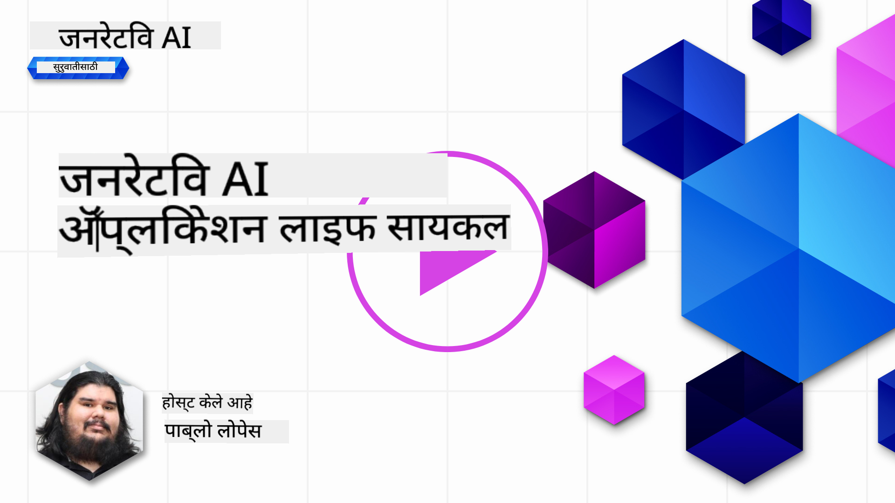
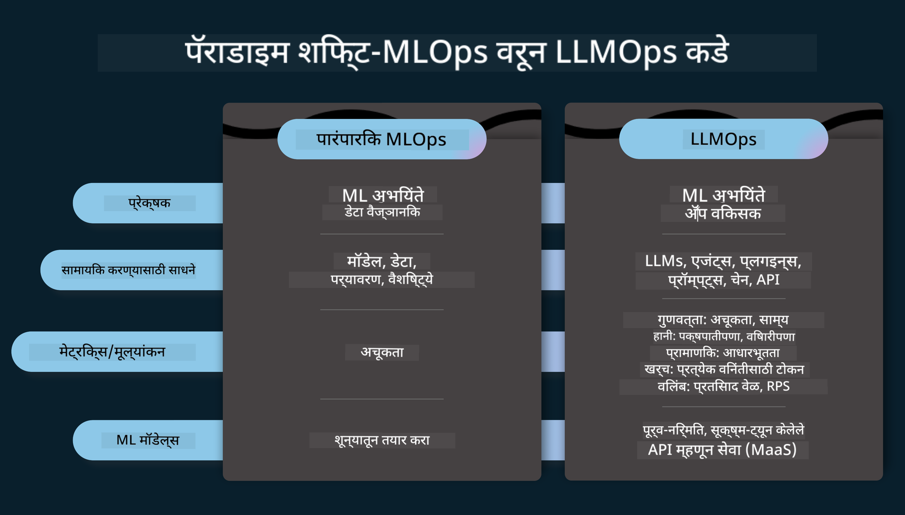
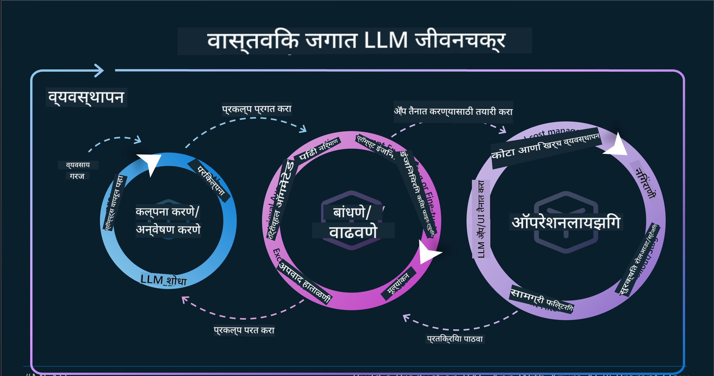
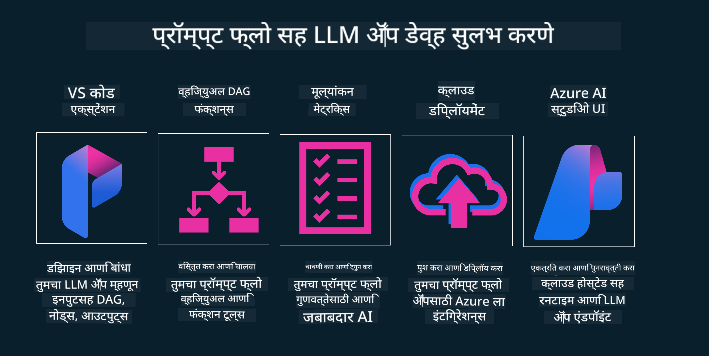

<!--
CO_OP_TRANSLATOR_METADATA:
{
  "original_hash": "27a5347a5022d5ef0a72ab029b03526a",
  "translation_date": "2025-07-09T15:50:55+00:00",
  "source_file": "14-the-generative-ai-application-lifecycle/README.md",
  "language_code": "mr"
}
-->

# जनरेटिव AI अनुप्रयोग जीवनचक्र

सर्व AI अनुप्रयोगांसाठी एक महत्त्वाचा प्रश्न म्हणजे AI वैशिष्ट्यांची सुसंगतता, कारण AI हा एक जलद विकसित होणारा क्षेत्र आहे. तुमचा अनुप्रयोग सुसंगत, विश्वासार्ह आणि मजबूत राहावा यासाठी तुम्हाला त्याचे सतत निरीक्षण, मूल्यांकन आणि सुधारणा करणे आवश्यक आहे. यासाठीच जनरेटिव AI जीवनचक्र उपयुक्त ठरतो.

जनरेटिव AI जीवनचक्र हा एक फ्रेमवर्क आहे जो तुम्हाला जनरेटिव AI अनुप्रयोग विकसित करणे, तैनात करणे आणि देखभाल करण्याच्या टप्प्यांमधून मार्गदर्शन करतो. तो तुमचे उद्दिष्टे निश्चित करण्यात, कामगिरी मोजण्यात, अडचणी ओळखण्यात आणि उपाय अंमलात आणण्यात मदत करतो. तसेच, तुमचा अनुप्रयोग तुमच्या क्षेत्रातील नैतिक आणि कायदेशीर मानकांशी आणि हितधारकांशी सुसंगत राहील याची खात्री करतो. जनरेटिव AI जीवनचक्राचे पालन करून, तुम्ही तुमचा अनुप्रयोग नेहमीच मूल्य देत राहील आणि वापरकर्त्यांचे समाधान करेल याची खात्री करू शकता.

## परिचय

या प्रकरणात, तुम्ही:

- MLOps पासून LLMOps कडे झालेल्या परिवर्तनाची समज प्राप्त कराल
- LLM जीवनचक्र
- जीवनचक्र साधने
- जीवनचक्र मेट्रिफिकेशन आणि मूल्यांकन

## MLOps पासून LLMOps कडे झालेल्या परिवर्तनाची समज

LLM हे आर्टिफिशियल इंटेलिजन्सच्या साधनसामग्रीतील एक नवीन साधन आहे, जे अनुप्रयोगांसाठी विश्लेषण आणि निर्मिती कार्यांमध्ये अत्यंत सामर्थ्यशाली आहे, परंतु या सामर्थ्यामुळे AI आणि पारंपरिक मशीन लर्निंग कार्ये कशी सुलभ करायची यावर काही परिणाम होतात.

यासाठी, या साधनाला योग्य प्रोत्साहनांसह गतिशील पद्धतीने स्वीकारण्यासाठी नवीन दृष्टिकोन आवश्यक आहे. आपण जुन्या AI अनुप्रयोगांना "ML Apps" आणि नवीन AI अनुप्रयोगांना "GenAI Apps" किंवा फक्त "AI Apps" म्हणून वर्गीकृत करू शकतो, जे त्या काळात वापरल्या जाणाऱ्या मुख्य प्रवाहातील तंत्रज्ञान आणि तंत्रांना प्रतिबिंबित करतात. यामुळे आपली कथा अनेक प्रकारे बदलते, खालील तुलना पाहा.

LLMOps मध्ये, आपण अनुप्रयोग विकासकांवर अधिक लक्ष केंद्रित करतो, एकत्रीकरणाला महत्त्व देतो, "Models-as-a-Service" वापरतो आणि मेट्रिक्ससाठी खालील मुद्द्यांवर विचार करतो.

- गुणवत्ता: प्रतिसादाची गुणवत्ता
- हानी: जबाबदार AI
- प्रामाणिकपणा: प्रतिसादाची आधारभूतता (समजते का? बरोबर आहे का?)
- खर्च: उपाययोजनेचा बजेट
- विलंब: टोकन प्रतिसादासाठी सरासरी वेळ

## LLM जीवनचक्र

प्रथम, जीवनचक्र आणि त्यातील बदल समजून घेण्यासाठी पुढील माहितीपट पहा.

तुम्हाला लक्षात येईल की हा पारंपरिक MLOps जीवनचक्रांपेक्षा वेगळा आहे. LLMs साठी अनेक नवीन गरजा आहेत, जसे की प्रॉम्प्टिंग, गुणवत्ता सुधारण्यासाठी विविध तंत्रे (फाईन-ट्यूनिंग, RAG, मेटा-प्रॉम्प्ट्स), जबाबदार AI सह वेगळे मूल्यांकन आणि जबाबदारी, आणि नवीन मूल्यांकन मेट्रिक्स (गुणवत्ता, हानी, प्रामाणिकपणा, खर्च आणि विलंब).

उदाहरणार्थ, आपण कसे कल्पना करतो ते पाहा. विविध LLMs सह प्रॉम्प्ट इंजिनिअरिंग वापरून शक्यता तपासणे आणि त्यांची कल्पना बरोबर आहे का हे तपासणे.

हे लक्षात ठेवा की हे रेषीय नाही, तर एकत्रित लूप्स, पुनरावृत्ती आणि एक व्यापक चक्र आहे.

आपण त्या टप्प्यांचा कसा शोध घेऊ शकतो? चला तपशीलात जाऊ आणि जीवनचक्र कसे तयार करायचे ते पाहू.

हे थोडे गुंतागुंतीचे वाटू शकते, तर प्रथम तीन मोठ्या टप्प्यांवर लक्ष केंद्रित करूया.

1. कल्पना करणे/शोध घेणे: शोध, येथे आपण आपल्या व्यवसायाच्या गरजेनुसार शोध घेऊ शकतो. प्रोटोटायपिंग, [PromptFlow](https://microsoft.github.io/promptflow/index.html?WT.mc_id=academic-105485-koreyst) तयार करणे आणि तपासणे की ते आपल्या कल्पनेसाठी पुरेसे कार्यक्षम आहे का.
2. बांधणी/वाढवणे: अंमलबजावणी, आता आपण मोठ्या डेटासेटसाठी मूल्यांकन सुरू करतो, फाईन-ट्यूनिंग आणि RAG सारखी तंत्रे वापरून आपल्या उपाययोजनेची मजबुती तपासतो. जर ते काम करत नसेल, तर पुन्हा अंमलबजावणी करणे, नवीन टप्पे जोडणे किंवा डेटा पुनर्रचना करणे उपयुक्त ठरू शकते. आपल्या कार्यप्रवाह आणि प्रमाण तपासल्यानंतर, जर ते योग्य असेल आणि मेट्रिक्स तपासले तर पुढील टप्प्यासाठी तयार आहे.
3. ऑपरेशनलायझिंग: एकत्रीकरण, आता आपल्या प्रणालीमध्ये मॉनिटरिंग आणि अलर्ट सिस्टम जोडणे, तैनाती आणि अनुप्रयोग एकत्रीकरण करणे.

यानंतर, सुरक्षा, अनुपालन आणि शासनावर लक्ष केंद्रित करून व्यवस्थापनाचा व्यापक चक्र आहे.

अभिनंदन, आता तुमचा AI अनुप्रयोग तयार आहे आणि कार्यरत आहे. प्रत्यक्ष अनुभवासाठी, [Contoso Chat Demo](https://nitya.github.io/contoso-chat/?WT.mc_id=academic-105485-koreys) पहा.

आता, आपण कोणती साधने वापरू शकतो?

## जीवनचक्र साधने

साधनांसाठी, Microsoft [Azure AI Platform](https://azure.microsoft.com/solutions/ai/?WT.mc_id=academic-105485-koreys) आणि [PromptFlow](https://microsoft.github.io/promptflow/index.html?WT.mc_id=academic-105485-koreyst) तुमचा जीवनचक्र सुलभपणे अंमलात आणण्यासाठी आणि तयार करण्यासाठी मदत करतात.

[Azure AI Platform](https://azure.microsoft.com/solutions/ai/?WT.mc_id=academic-105485-koreys) तुम्हाला [AI Studio](https://ai.azure.com/?WT.mc_id=academic-105485-koreys) वापरण्याची परवानगी देते. AI Studio हा एक वेब पोर्टल आहे जो तुम्हाला मॉडेल्स, नमुने आणि साधने एक्सप्लोर करण्याची, तुमचे संसाधने व्यवस्थापित करण्याची, UI विकास प्रवाह आणि SDK/CLI पर्यायांसह कोड-प्रथम विकासासाठी मदत करतो.

Azure AI तुम्हाला अनेक संसाधने वापरण्याची परवानगी देते, ज्यामुळे तुम्ही तुमच्या ऑपरेशन्स, सेवा, प्रकल्प, व्हेक्टर शोध आणि डेटाबेस गरजा व्यवस्थापित करू शकता.

PromptFlow सह Proof-of-Concept(POC) पासून मोठ्या प्रमाणावर अनुप्रयोग तयार करा:

- VS Code मधून डिझाइन आणि अॅप्स तयार करा, दृश्यात्मक आणि कार्यात्मक साधने वापरून
- तुमच्या अॅप्सची गुणवत्ता तपासण्यासाठी आणि फाईन-ट्यून करण्यासाठी सोपे मार्ग
- Azure AI Studio वापरून क्लाउडसह एकत्रीकरण आणि पुनरावृत्ती करा, जलद एकत्रीकरणासाठी पुश आणि तैनात करा.

## छान! तुमचे शिक्षण सुरू ठेवा!

अद्भुत, आता [Contoso Chat App](https://nitya.github.io/contoso-chat/?WT.mc_id=academic-105485-koreyst) सह अनुप्रयोग कसा रचायचा हे शिका, ज्यात Cloud Advocacy कसे हे संकल्पना सादरीकरणांमध्ये जोडते ते पाहा. अधिक सामग्रीसाठी, आमचा [Ignite ब्रेकआउट सत्र](https://www.youtube.com/watch?v=DdOylyrTOWg) पहा!

आता, धडा 15 पहा, ज्यात [Retrieval Augmented Generation आणि Vector Databases](../15-rag-and-vector-databases/README.md?WT.mc_id=academic-105485-koreyst) जनरेटिव AI वर कसा प्रभाव टाकतात आणि अधिक आकर्षक अनुप्रयोग कसे तयार करायचे ते समजून घ्या!

**अस्वीकरण**:  
हा दस्तऐवज AI अनुवाद सेवा [Co-op Translator](https://github.com/Azure/co-op-translator) वापरून अनुवादित केला आहे. आम्ही अचूकतेसाठी प्रयत्नशील असलो तरी, कृपया लक्षात घ्या की स्वयंचलित अनुवादांमध्ये चुका किंवा अचूकतेची कमतरता असू शकते. मूळ दस्तऐवज त्याच्या स्थानिक भाषेत अधिकृत स्रोत मानला जावा. महत्त्वाच्या माहितीसाठी व्यावसायिक मानवी अनुवाद करण्याची शिफारस केली जाते. या अनुवादाच्या वापरामुळे उद्भवणाऱ्या कोणत्याही गैरसमजुती किंवा चुकीच्या अर्थलागी आम्ही जबाबदार नाही.