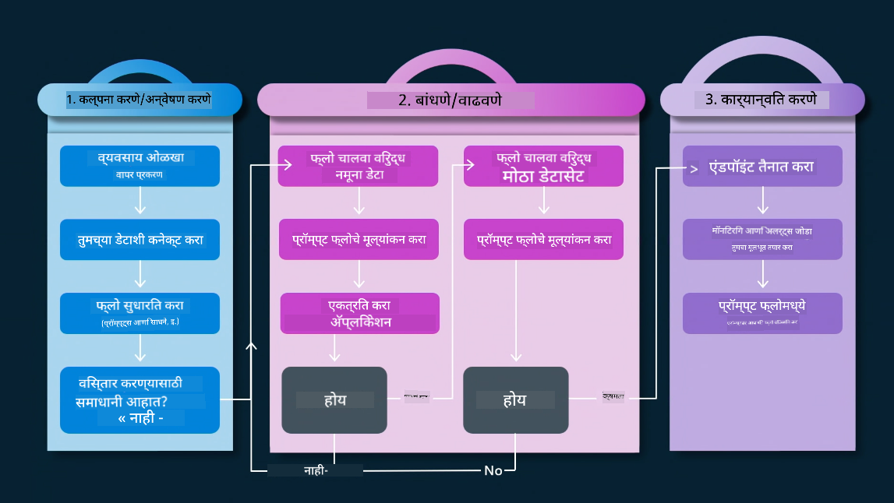
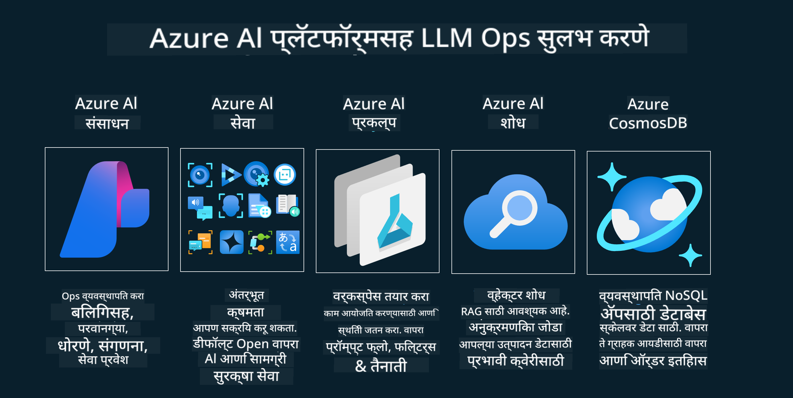

<!--
CO_OP_TRANSLATOR_METADATA:
{
  "original_hash": "b9d32511b27373a1b21b5789d4fda057",
  "translation_date": "2025-10-17T13:41:00+00:00",
  "source_file": "14-the-generative-ai-application-lifecycle/README.md",
  "language_code": "mr"
}
-->

# जनरेटिव AI अनुप्रयोग जीवनचक्र

सर्व AI अनुप्रयोगांसाठी एक महत्त्वाचा प्रश्न म्हणजे AI वैशिष्ट्यांची सुसंगतता. AI हे वेगाने विकसित होणारे क्षेत्र आहे, त्यामुळे तुमचा अनुप्रयोग सुसंगत, विश्वासार्ह आणि मजबूत राहावा यासाठी तुम्हाला सतत निरीक्षण, मूल्यांकन आणि सुधारणा करणे आवश्यक आहे. यासाठी जनरेटिव AI जीवनचक्र उपयोगी ठरते.

जनरेटिव AI जीवनचक्र हे एक फ्रेमवर्क आहे जे तुम्हाला जनरेटिव AI अनुप्रयोग विकसित, तैनात आणि देखरेख करण्याच्या टप्प्यांमधून मार्गदर्शन करते. हे तुम्हाला तुमचे उद्दिष्टे परिभाषित करण्यास, तुमची कामगिरी मोजण्यास, तुमच्या आव्हानांची ओळख करण्यास आणि तुमचे उपाय अंमलात आणण्यास मदत करते. तसेच, हे तुमचा अनुप्रयोग तुमच्या क्षेत्रातील नैतिक आणि कायदेशीर मानकांशी आणि तुमच्या भागधारकांशी सुसंगत ठेवण्यास मदत करते. जनरेटिव AI जीवनचक्राचे अनुसरण करून, तुम्ही सुनिश्चित करू शकता की तुमचा अनुप्रयोग नेहमीच मूल्य प्रदान करतो आणि तुमच्या वापरकर्त्यांना समाधान देतो.

## परिचय

या अध्यायात तुम्ही:

- MLOps पासून LLMOps पर्यंतच्या पॅराडाइम शिफ्टला समजून घ्याल
- LLM जीवनचक्र
- जीवनचक्र साधने
- जीवनचक्र मेट्रिकेशन आणि मूल्यांकन

## MLOps पासून LLMOps पर्यंत पॅराडाइम शिफ्ट समजून घ्या

LLMs हे कृत्रिम बुद्धिमत्तेच्या शस्त्रागारातील एक नवीन साधन आहे. ते अनुप्रयोगांसाठी विश्लेषण आणि निर्मिती कार्यांमध्ये अत्यंत शक्तिशाली आहेत, परंतु या शक्तीमुळे AI आणि पारंपरिक मशीन लर्निंग कार्यांना सुव्यवस्थित करण्याच्या पद्धतींवर काही परिणाम होतो.

यामुळे, आम्हाला या साधनाला गतिशीलतेत योग्य प्रोत्साहनांसह अनुकूल करण्यासाठी एक नवीन पॅराडाइम आवश्यक आहे. जुन्या AI अॅप्सना "ML अॅप्स" आणि नवीन AI अॅप्सना "GenAI अॅप्स" किंवा फक्त "AI अॅप्स" म्हणून वर्गीकृत करता येते, जे त्या वेळी वापरल्या जाणाऱ्या मुख्य प्रवाहातील तंत्रज्ञान आणि तंत्र दर्शवतात. यामुळे आपली कथा अनेक प्रकारे बदलते. खालील तुलना पहा.

LLMOps मध्ये, आपण अॅप डेव्हलपर्सवर अधिक लक्ष केंद्रित करतो, एकत्रीकरणे एक महत्त्वाचा मुद्दा म्हणून वापरतो, "Models-as-a-Service" वापरतो आणि मेट्रिक्ससाठी खालील मुद्द्यांचा विचार करतो:

- गुणवत्ता: प्रतिसादाची गुणवत्ता
- हानी: जबाबदार AI
- प्रामाणिकपणा: प्रतिसादाची आधारभूतता (अर्थपूर्ण आहे का? ते योग्य आहे का?)
- खर्च: समाधान बजेट
- विलंब: टोकन प्रतिसादासाठी सरासरी वेळ

## LLM जीवनचक्र

प्रथम, जीवनचक्र आणि त्यातील बदल समजून घेण्यासाठी, पुढील माहितीपट लक्षात घेऊया.

जसे तुम्ही पाहू शकता, हे MLOps च्या सामान्य जीवनचक्रांपेक्षा वेगळे आहे. LLMs मध्ये अनेक नवीन आवश्यकता आहेत, जसे की प्रॉम्प्टिंग, गुणवत्ता सुधारण्यासाठी विविध तंत्र (फाइन-ट्यूनिंग, RAG, मेटा-प्रॉम्प्ट्स), जबाबदार AI सह वेगवेगळे मूल्यांकन आणि जबाबदारी, शेवटी, नवीन मूल्यांकन मेट्रिक्स (गुणवत्ता, हानी, प्रामाणिकपणा, खर्च आणि विलंब).

उदाहरणार्थ, आपण कल्पना कशी करतो ते पहा. प्रॉम्प्ट इंजिनिअरिंग वापरून विविध LLMs सह प्रयोग करणे, शक्यता शोधणे आणि त्यांची गृहीतके योग्य असू शकतात का ते तपासणे.

हे रेषीय नाही, परंतु एकत्रित लूप्स, पुनरावृत्तीशील आणि एकूणच चक्र आहे.

आपण त्या चरणांचा कसा शोध घेऊ शकतो? चला तपशीलात जाऊन पाहूया की आपण जीवनचक्र कसे तयार करू शकतो.

हे थोडे क्लिष्ट दिसत असले तरी, प्रथम तीन मोठ्या चरणांवर लक्ष केंद्रित करूया.

1. कल्पना करणे/शोध घेणे: शोध, येथे आपण आपल्या व्यवसायाच्या गरजेनुसार शोध घेऊ शकतो. प्रोटोटायपिंग, [PromptFlow](https://microsoft.github.io/promptflow/index.html?WT.mc_id=academic-105485-koreyst) तयार करणे आणि आमची गृहीतके पुरेशी कार्यक्षम आहेत का ते तपासणे.
2. तयार करणे/वाढवणे: अंमलबजावणी, आता, आम्ही मोठ्या डेटासेटसाठी मूल्यांकन करण्यास सुरुवात करतो, तंत्र अंमलात आणतो, जसे की फाइन-ट्यूनिंग आणि RAG, आमच्या समाधानाची मजबुती तपासण्यासाठी. जर ते कार्य करत नसेल, तर आमच्या प्रवाहात नवीन चरण जोडणे किंवा डेटा पुन्हा संरचित करणे उपयुक्त ठरू शकते. आमचा प्रवाह आणि आमचा स्केल तपासल्यानंतर, जर ते कार्य करत असेल आणि आमचे मेट्रिक्स तपासले, तर ते पुढील टप्प्यासाठी तयार आहे.
3. ऑपरेशनलायझिंग: एकत्रीकरण, आता आमच्या प्रणालीमध्ये मॉनिटरिंग आणि अलर्ट सिस्टम जोडणे, तैनाती आणि आमच्या अनुप्रयोगात एकत्रीकरण.

यानंतर, व्यवस्थापनाचे एकूणच चक्र आहे, जे सुरक्षा, अनुपालन आणि गव्हर्नन्सवर लक्ष केंद्रित करते.

अभिनंदन, आता तुमचा AI अॅप तयार आहे आणि कार्यरत आहे. प्रत्यक्ष अनुभवासाठी, [Contoso Chat Demo](https://nitya.github.io/contoso-chat/?WT.mc_id=academic-105485-koreys) वर एक नजर टाका.

आता, कोणती साधने वापरता येतील?

## जीवनचक्र साधने

साधनांसाठी, मायक्रोसॉफ्ट [Azure AI Platform](https://azure.microsoft.com/solutions/ai/?WT.mc_id=academic-105485-koreys) आणि [PromptFlow](https://microsoft.github.io/promptflow/index.html?WT.mc_id=academic-105485-koreyst) प्रदान करते, जे तुमचे जीवनचक्र अंमलात आणणे सोपे आणि तयार करते.

[Azure AI Platform](https://azure.microsoft.com/solutions/ai/?WT.mc_id=academic-105485-koreys) तुम्हाला [AI Studio](https://ai.azure.com/?WT.mc_id=academic-105485-koreys) वापरण्याची परवानगी देते. AI Studio हे एक वेब पोर्टल आहे जे तुम्हाला मॉडेल्स, नमुने आणि साधने एक्सप्लोर करण्याची परवानगी देते. तुमची संसाधने व्यवस्थापित करणे, UI विकास प्रवाह आणि कोड-फर्स्ट विकासासाठी SDK/CLI पर्याय.

Azure AI तुम्हाला तुमच्या ऑपरेशन्स, सेवा, प्रकल्प, व्हेक्टर शोध आणि डेटाबेस गरजा व्यवस्थापित करण्यासाठी अनेक संसाधने वापरण्याची परवानगी देते.

Proof-of-Concept(POC) पासून मोठ्या प्रमाणातील अनुप्रयोगांपर्यंत PromptFlow सह तयार करा:

- VS Code मधून अॅप्स डिझाइन आणि तयार करा, व्हिज्युअल आणि फंक्शनल टूल्ससह
- तुमच्या अॅप्सची गुणवत्ता AI साठी सहजपणे चाचणी करा आणि फाइन-ट्यून करा.
- Azure AI Studio वापरून क्लाउडसह एकत्रित करा आणि पुनरावृत्ती करा, जलद एकत्रीकरणासाठी पुश आणि तैनात करा.

## उत्तम! तुमचे शिक्षण सुरू ठेवा!

अप्रतिम, आता [Contoso Chat App](https://nitya.github.io/contoso-chat/?WT.mc_id=academic-105485-koreyst) कसे तयार करायचे ते शिकून या संकल्पनांचा उपयोग कसा करायचा ते जाणून घ्या, क्लाउड अॅडव्होकेसी डेमोमध्ये या संकल्पनांचा कसा समावेश केला जातो ते तपासा. अधिक सामग्रीसाठी, आमचे [Ignite breakout session](https://www.youtube.com/watch?v=DdOylyrTOWg) पहा!

आता, जनरेटिव AI वर प्रभाव टाकण्यासाठी आणि अधिक आकर्षक अनुप्रयोग तयार करण्यासाठी [Retrieval Augmented Generation आणि व्हेक्टर डेटाबेस](../15-rag-and-vector-databases/README.md?WT.mc_id=academic-105485-koreyst) कसे समजून घ्यायचे ते पाहा!

---

**अस्वीकरण**:  
हा दस्तऐवज AI भाषांतर सेवा [Co-op Translator](https://github.com/Azure/co-op-translator) वापरून भाषांतरित करण्यात आला आहे. आम्ही अचूकतेसाठी प्रयत्नशील असलो तरी, कृपया लक्षात ठेवा की स्वयंचलित भाषांतरांमध्ये त्रुटी किंवा अचूकतेचा अभाव असू शकतो. मूळ भाषेतील दस्तऐवज हा अधिकृत स्रोत मानला जावा. महत्त्वाच्या माहितीसाठी व्यावसायिक मानवी भाषांतराची शिफारस केली जाते. या भाषांतराचा वापर करून निर्माण झालेल्या कोणत्याही गैरसमज किंवा चुकीच्या अर्थासाठी आम्ही जबाबदार राहणार नाही.